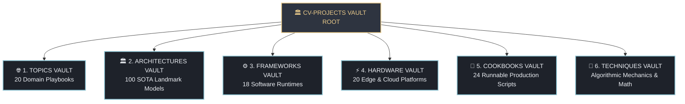

# 🚀 CV Projects: Master Knowledge Vault & Engineering Dashboard

Welcome to the **CV Projects Knowledge & Engineering Vault**—a unified, production-grade knowledge base and runnable software repository covering state-of-the-art Computer Vision, Multimodal Physical AI, Sensor Fusion, and Edge Hardware Deployment (FPGA / GPU / Real-Time Systems).

---

## 🏛️ The Six Core Vault Pillars



| Vault Pillar | Core Navigation Hub | Scope & Assets Covered | Key Technologies |
| :--- | :--- | :--- | :--- |
| **1. Topics Vault** | [[topics/00-topics-moc\|Master Topics MOC]] | 20 Deep-Dive Perception & Deployment Disciplines | Object Detection, LiDAR, Sensor Fusion, Real-Time OS |
| **2. Architectures Vault** | [[architectures/00-architectures-moc\|Central Architecture MOC]] | 98 Dedicated Landmark & 2026 SOTA Model Documents | YOLO26, RT-DETRv4, SAM 2.1, D-FINE, RF-DETR, 3DGS |
| **3. Frameworks Vault** | [[frameworks/00-frameworks-moc\|Software Frameworks MOC]] | 18 Production Inference, Training & IPC Toolchains | TensorRT 10, ONNX Runtime, Vulkan SC, Iceoryx2, Zenoh |
| **4. Hardware Vault** | [[hardware/00-hardware-moc\|Hardware Platforms MOC]] | 20 Edge SoCs, Automotive Drives, NPUs & FPGAs | NVIDIA Orin/Thor, AMD Versal Gen 2, Intel NPU |
| **5. Cookbooks Vault** | [[cookbooks/00-cookbooks-moc\|Runnable Cookbooks MOC]] | 24 Standalone, Pure-Python/Rust Verified Scripts | CUDA Graphs, Quark PTQ, Lie SLAM, Rerun, FiftyOne |
| **6. Techniques Vault** | [[techniques/00-techniques-moc\|Techniques MOC]] | Foundational Operators, Transforms & Math Formulations | Fourier Adaptation, DCNv4, Hypergraphs, GRL, Direct Regression |

---

## ⚡ Quick Navigation by Engineering Objective

### 🎯 Looking for Object Detectors & Segmenters?
- Real-Time NMS-Free Detectors: [[architectures/real-time-detectors-and-segmenters/rf-detr|RF-DETR]], [[architectures/real-time-detectors-and-segmenters/yolo26|YOLO26]], [[architectures/real-time-detectors-and-segmenters/d-fine|D-FINE]], [[architectures/real-time-detectors-and-segmenters/rt-detr-v4|RT-DETR v4]]
- Zero-Shot Promptable Segmentation: [[architectures/vision-foundation-models/sam-2-1|SAM 2.1]], [[architectures/real-time-detectors-and-segmenters/efficientvit-sam|EfficientViT-SAM]], [[architectures/real-time-detectors-and-segmenters/sam-hq|SAM-HQ]]
- Open-Vocabulary & Grounding: [[architectures/real-time-detectors-and-segmenters/grounding-dino|Grounding DINO]], [[architectures/real-time-detectors-and-segmenters/yolo-world|YOLO-World]]

### 🤖 Looking for Physical AI & Robotics?
- Vision-Language-Action (VLA): [[architectures/multimodal-vlm-and-vla/rt-2|RT-2]], [[architectures/multimodal-vlm-and-vla/openvla|OpenVLA]], [[architectures/multimodal-vlm-and-vla/pi0|π₀ (Pi-Zero)]], [[architectures/multimodal-vlm-and-vla/palme|PaLM-E]]
- Manipulation Trajectories: [[architectures/multimodal-vlm-and-vla/act|ACT]], [[architectures/multimodal-vlm-and-vla/diffusion-policy|Diffusion Policy]], [[architectures/multimodal-vlm-and-vla/anygrasp|AnyGrasp]]
- 6-DoF Object Pose: [[architectures/pose-and-robotics-manipulation/foundationpose|FoundationPose]], [[architectures/pose-and-robotics-manipulation/megapose|MegaPose]], [[architectures/pose-and-robotics-manipulation/cosypose|CosyPose]]

### 🚗 Looking for Autonomous Driving & 3D Spatial Perception?
- 3D Point Clouds & Sensor Fusion: [[architectures/3d-pointclouds-and-lidar/bevfusion|BEVFusion]], [[architectures/3d-pointclouds-and-lidar/dsvt|DSVT]], [[architectures/3d-pointclouds-and-lidar/centerpoint|CenterPoint]], [[architectures/3d-pointclouds-and-lidar/sparse4d|Sparse4D]]
- SLAM & Radiance Fields: [[architectures/spatial-radiance-and-slam/3d-gaussian-splatting|3D Gaussian Splatting]], [[architectures/spatial-radiance-and-slam/gaussian-splatting-slam|Gaussian Splatting SLAM]], [[architectures/spatial-radiance-and-slam/instant-ngp|Instant-NGP]]

### 🛡️ Looking for Edge Runtimes, Safety & Zero-Copy IPC?
- Safety-Critical & Embedded Runtimes: [[frameworks/vulkan-sc|Vulkan SC 2.0]], [[frameworks/tensorrt|NVIDIA TensorRT 10]], [[frameworks/onnxruntime|ONNX Runtime 1.20+]], [[frameworks/vitis-ai|AMD Vitis AI 6.2]]
- Zero-Copy Communications: [[frameworks/iceoryx2|Eclipse Iceoryx2]], [[frameworks/zenoh|Eclipse Zenoh]], [[frameworks/ros2-rmw|ROS 2 RMW]]
- Safety & Verification Playbook: [[topics/safety-verification-and-robustness/README|Safety Verification]], [[topics/real-time-systems/README|Real-Time Systems]]


### 🧬 Looking for Foundational Techniques & Mathematical Mechanics?
- **Signal Processing & Active Sensing**: [[techniques/fourier-domain-adaptation|Fourier Domain Adaptation (FDA)]], [[techniques/gradient-reversal-and-dann|Gradient Reversal Layer (GRL / DANN)]], [[techniques/phase-shifting-profilometry-structured-light|Phase-Shifting Profilometry (PSP)]]
- **Spatial, 3D & Geometric Operators**: [[techniques/deformable-convolutions|Deformable Convolutions (DCNv1–DCNv4)]], [[techniques/hypergraph-computation|Hypergraph Neural Computation]], [[techniques/lift-splat-shoot-bev-pooling|Lift-Splat-Shoot (LSS & BEV Pooling)]], [[techniques/3d-gaussian-splatting-rasterization|3D Gaussian Splatting Rasterization]], [[techniques/lie-algebra-se3-pose-tracking|Lie Algebra se(3) Pose Tracking]], [[techniques/all-pairs-correlation-pyramids|All-Pairs Correlation Pyramids (RAFT)]], [[techniques/variational-optical-flow-tv-l1|Variational Optical Flow (TV-L1)]], [[techniques/multiresolution-hash-encodings-and-sparse-voxels|Multiresolution Spatial Hash Encodings]], [[techniques/orthogonal-procrustes-and-umeyama-sim3|Orthogonal Procrustes & Umeyama]]
- **Set Prediction, Loss Functions & Safe Control**: [[techniques/bipartite-matching-and-hungarian-assigner|Bipartite Matching & Hungarian Assigner]], [[techniques/distribution-focal-loss-vs-direct-regression|DFL vs. Direct Metric Regression]], [[techniques/contrastive-learning-infonce-vs-siglip|Contrastive SigLIP vs. InfoNCE]], [[techniques/control-barrier-functions-safe-control|Control Barrier Functions (CBF-QP)]], [[techniques/error-state-kalman-filter-eskf-vio|Error-State Kalman Filter (ESKF)]]
- **Attention, State-Space & Continuous Generative Trajectories**: [[techniques/flash-attention-and-online-softmax|FlashAttention & Online Softmax]], [[techniques/visual-state-space-mamba|Visual State-Space Models (VMamba / SS2D)]], [[techniques/continuous-flow-matching|Continuous Flow Matching (CFM)]], [[techniques/action-chunking-cvae|Action Chunking with C-VAE (ACT)]]
- **Edge Acceleration & Quantization**: [[techniques/structural-reparameterization|Structural Reparameterization (RepConv)]], [[techniques/post-training-quantization-and-outlier-smoothing|PTQ & Outlier Smoothing (SmoothQuant)]]
---

## 📊 Dataview Dynamic Vault Directory

```dataview
TABLE domain AS "Engineering Domain", status AS "Status", updated AS "Last Verified"
FROM ""
WHERE file.name = "00-topics-moc" OR file.name = "00-architectures-moc" OR file.name = "00-frameworks-moc" OR file.name = "00-hardware-moc" OR file.name = "00-cookbooks-moc" OR file.name = "00-techniques-moc"
SORT file.name ASC
```
