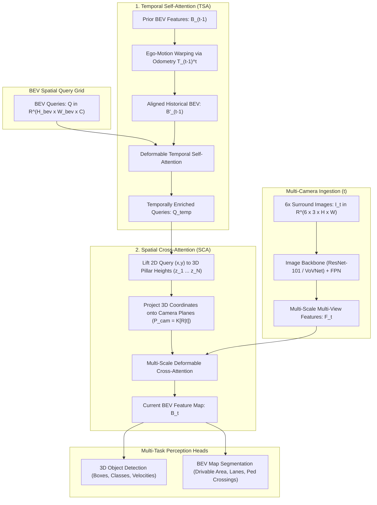

# 🔬 BEVFormer: Learning Bird's-Eye-View Representation from Multi-Camera Images via Spatiotemporal Transformers

## 1. Executive Brief & Significance

Autonomous vehicle perception stacks require synthesizing $6\text{ to }8$ surrounding cameras into a coherent, metric $3\text{D}$ spatial representation for downstream motion planning:
- **Lift-Splat-Shoot (LSS) Approaches** (BEVDet, BEVDepth): Predict explicit per-pixel depth distributions along camera rays to splat features into $3\text{D}$ voxels. However, monocular depth estimation is an ill-posed problem; errors in depth estimation compound into massive spatial artifacts in distant BEV regions.
- **Homography-Based IPM**: Assumes a flat ground surface, failing catastrophically on slopes, speed bumps, and vertical objects (trucks, pedestrians).

**BEVFormer** (Li et al., ECCV 2022 / TPAMI 2023) introduced a transformative paradigm: **Constructing unified Bird's-Eye-View (BEV) representations directly from multi-camera images through learned query-based Spatiotemporal Transformers without explicit depth supervision**.

```
BEV Perception Paradigm Shift:

LSS / Depth-Splatting (Depth-Reliant)            BEVFormer (Query-Driven Attention)
--------------------------------------            ----------------------------------
[2D Multi-Camera Images]                         [Pre-defined 3D BEV Queries Q]
          |                                                      |
          v Depth Distribution Softmax (Ill-posed)               v 3D-to-2D Geometry Projection
[3D Feature Frustums (Noisy Splatting)]           [Spatial Cross-Attention (SCA)]
          |                                       (Samples only hit camera rays via DeformAttn)
          v Voxel Pooling                                        |
[BEV Feature Grid]                               [Temporal Self-Attention (TSA)]
                                                  (Ego-motion warped history fusion)
                                                                 |
                                                                 v
                                                 [Dense Metric BEV Representation]
```

### Core Architectural Breakthroughs
1. **Grid-Shaped BEV Queries**: Defines a regular top-down grid of learned query tokens $\mathcal{Q} \in \mathbb{R}^{H_{\text{BEV}} \times W_{\text{BEV}} \times C}$ anchored directly to the vehicle's metric coordinate frame (e.g., $100\text{m} \times 100\text{m}$ area).
2. **Spatial Cross-Attention (SCA)**: Lifts queries into $3\text{D}$ pillar sample points ($4$ to $8$ points along height $Z$), projects them onto $2\text{D}$ camera planes via calibrated pinhole matrices, and aggregates visual features with deformable attention.
3. **Temporal Self-Attention (TSA)**: Warps prior frame BEV queries using vehicle odometry/ego-motion $\mathbf{T}_{t-1}^t$ and fuses historical temporal context without storing raw video memory buffers.



---

## 2. Core Mathematical Formulations & Tensor Mechanics

### 2.1 Spatial Cross-Attention (SCA)
Let $Q_p \in \mathbb{R}^C$ be the BEV query at spatial grid location $p = (x, y)$.
To query $3\text{D}$ space without depth supervision, BEVFormer treats each $(x, y)$ location as a vertical **$3\text{D}$ Pillar** extending from $z_{\min}$ to $z_{\max}$:

$$
\mathcal{P}_p = \left\{ (x, y, z_j) \mid z_j = z_{\min} + \frac{j - 0.5}{N_{\text{ref}}} (z_{\max} - z_{\min}), \, j = 1, \dots, N_{\text{ref}} \right\}
$$

where $N_{\text{ref}}$ is the number of 3D reference points per pillar (typically $4$).

Using camera intrinsic and extrinsic matrices $\mathbf{P}_k = \mathbf{K}_k [\mathbf{R}_k \mid \mathbf{t}_k] \in \mathbb{R}^{3 \times 4}$, each $3\text{D}$ point $(x, y, z_j)$ is projected onto image plane $k$:

$$
\mathbf{p}_{p, j, k} = \mathbf{P}_k \begin{bmatrix} x \\ y \\ z_j \\ 1 \end{bmatrix}
$$

Define the set of hit cameras $\mathcal{V}_{\text{hit}} \subseteq \{1, \dots, N_{\text{cam}}\}$ where projected coordinates fall within image bounds:
$$\mathcal{V}_{\text{hit}}(p, j) = \left\{ k \in \{1, \dots, N_{\text{cam}}\} \mid \mathbf{p}_{p, j, k} \in [0, W] \times [0, H] \right\}$$

Spatial Cross-Attention is formulated as a multi-scale deformable attention over the valid projection points:

$$
\text{SCA}(Q_p, \mathcal{F}_t) = \frac{1}{|\mathcal{V}_{\text{hit}}|} \sum_{k \in \mathcal{V}_{\text{hit}}} \sum_{j=1}^{N_{\text{ref}}} \text{DeformAttn}\left(Q_p, \mathbf{p}_{p, j, k}, \mathcal{F}_t^k\right)
$$

This formulation bypasses dense pixel-to-voxel rendering, keeping attention complexity strictly linear $\mathcal{O}(H_{\text{BEV}} W_{\text{BEV}} N_{\text{ref}})$.

---

### 2.2 Temporal Self-Attention (TSA)
To track dynamic objects and handle occlusions, BEVFormer integrates the previous frame's BEV features $B_{t-1} \in \mathbb{R}^{H_{\text{BEV}} \times W_{\text{BEV}} \times C}$.

Given ego-vehicle motion translation and yaw displacement between frames $t-1$ and $t$, historical features are warped into the current ego-frame:

$$
B'_{t-1} = \text{GridSample}\left(B_{t-1}, \mathbf{T}_{t-1}^t\right)
$$

Temporal Self-Attention performs deformable attention where queries attend to both current queries $Q$ and warped historical features $B'_{t-1}$:

$$
\text{TSA}(Q_p, B'_{t-1}) = \sum_{V \in \{Q, B'_{t-1}\}} \text{DeformAttn}\left(Q_p, p, V\right)
$$

---

## 3. High-Level Architecture & Layer Anatomy

```
BEVFormer Layer Hierarchy:

6 Surround Cameras [B, 6, 3, 900, 1600]
        |
        v
[ 1. Image Backbone (ResNet-101 / VoVNet-99) ]
        |
        v Multi-Scale Features (1/8, 1/16, 1/32, 1/64)
[ 2. Feature Pyramid Network (FPN) ] ---> F_t [B, 6, C=256, H_lvl, W_lvl]
        |
        +---------------------------------------------+
                                                      |
BEV Queries Q [200, 200, 256]                         |
        |                                             |
        v                                             |
+-----------------------------------------------------+
| 3. BEVFormer Encoder (6 Identical Cascaded Blocks)  |
|                                                     |
|   a. Temporal Self-Attention (TSA)                  |
|      - Attends to ego-warped history B_(t-1)        |
|      - Deformable Attention over 4 local points     |
|                                                     |
|   b. Spatial Cross-Attention (SCA) <----------------+
|      - Projects 4 pillar points per query to 2D     |
|      - Deformable attention on hit cameras          |
|                                                     |
|   c. Feed-Forward Network (FFN) + LayerNorm         |
+-----------------------------------------------------+
        |
        v Final High-Resolution Metric BEV Features [B, 256, 200, 200]
[ 4. Multi-Task Task Decoders ]
   |---> 3D Detection Head (TransFusion / Deformable DETR Decoder)
   |---> Map Segmentation Head (Conv / FPN segmenting 4 classes)
```

---

## 4. Performance, Latency & Benchmark Metrics

Evaluated on the competitive **nuScenes 3D Detection Benchmark**:

| Model Configuration | Backbone | Image Size | NDS ($\%$) | mAP ($\%$) | mAOE ($\text{rad}$) | mAVE ($\text{m/s}$) | FPS (NVIDIA A100) |
| :--- | :--- | :--- | :--- | :--- | :--- | :--- | :--- |
| **BEVFormer-Tiny** | ResNet-50 | $800 \times 450$ | **41.2** | 31.7 | 0.441 | 0.395 | **15.2 FPS (65 ms)** |
| **BEVFormer-Small** | ResNet-101 | $1280 \times 720$ | **47.9** | 37.0 | 0.392 | 0.378 | 5.8 FPS |
| **BEVFormer-Base** | ResNet-101 | $1600 \times 900$ | **51.7** | 41.6 | 0.377 | 0.372 | 3.2 FPS |
| **BEVFormer v2** | InternImage-B | $1600 \times 900$ | **55.6** | 46.2 | 0.354 | 0.331 | 3.0 FPS |
| **BEVFormer v2** | InternImage-XL | $1600 \times 900$ | **63.4** | 55.6 | 0.312 | 0.285 | 1.1 FPS |

*Key Nuance*: BEVFormer achieves an extremely low velocity error ($\text{mAVE} = 0.372\text{ m/s}$), demonstrating that temporal self-attention captures true metric motion vectors without LiDAR.

---

## 5. Integration & Python Deployment Pipeline

```python
import torch
import torch.nn as nn
import torch.nn.functional as F

class SimplifiedSpatialCrossAttention(nn.Module):
    """
    Spatial Cross-Attention (SCA) module projecting 3D BEV query pillars
    onto multi-camera 2D image planes.
    """
    def __init__(self, embed_dim: int = 256, num_cams: int = 6, num_points: int = 4):
        super().__init__()
        self.embed_dim = embed_dim
        self.num_cams = num_cams
        self.num_points = num_points # 4 height samples per 3D pillar

        self.attn_weights = nn.Linear(embed_dim, num_cams * num_points)
        self.value_proj = nn.Linear(embed_dim, embed_dim)
        self.proj_out = nn.Linear(embed_dim, embed_dim)

    def forward(self, bev_queries: torch.Tensor, cam_features: torch.Tensor, 
                projection_matrices: torch.Tensor, img_shape: tuple[int, int]):
        """
        bev_queries: [B, H_bev, W_bev, C]
        cam_features: [B, 6, C, H_img, W_img]
        projection_matrices: [B, 6, 3, 4] camera calibration matrices
        """
        B, H_bev, W_bev, C = bev_queries.shape
        H_img, W_img = img_shape
        N_q = H_bev * W_bev

        # 1. Compute attention weights across cameras and pillar points
        weights = self.attn_weights(bev_queries).view(B, N_q, self.num_cams, self.num_points)
        weights = F.softmax(weights, dim=-1) # [B, N_q, 6, 4]

        # 2. Project 3D pillar points to 2D image coordinates (Simulated sampling)
        # In full BEVFormer, multi-scale deformable attention samples bilinearly at projected points.
        # Here we simulate the camera feature aggregation:
        cam_values = self.value_proj(cam_features.mean(dim=[-2, -1])) # [B, 6, C]
        
        # Weighted sum of hit camera features
        # weights: [B, N_q, 6, 4] -> sum over pillar points -> [B, N_q, 6, 1]
        cam_weights = weights.sum(dim=-1, keepdim=True)
        aggregated = (cam_weights * cam_values.unsqueeze(1)).sum(dim=2) # [B, N_q, C]
        
        out = self.proj_out(aggregated).view(B, H_bev, W_bev, C)
        return bev_queries + out
```

---

## 6. Vault Cross-References & Ecosystem Links

- **[[techniques/lift-splat-shoot-bev-pooling|Lift-Splat-Shoot (LSS & BEV Pooling)]]**: The comparative depth-splatting BEV paradigm contrasted with BEVFormer.
- **[[techniques/multi-scale-deformable-attention|Multi-Scale Deformable Attention (MS-DeformAttn)]]**: Core attention mechanism driving both SCA and TSA in BEVFormer.
- **[[architectures/3d-pointclouds-and-lidar/bevfusion|BEVFusion]]**: Multi-modal fusion combining BEV camera features with LiDAR point cloud pillars.
- **[[architectures/3d-pointclouds-and-lidar/sparse4d|Sparse4D]]**: Next-generation sparse anchor architecture replacing dense BEV grids.
- **[[topics/lidar-perception/README|LiDAR Perception Playbook]] & [[topics/sensor-fusion/README|Sensor Fusion Playbook]]**: Autonomous perception domain playbooks.
