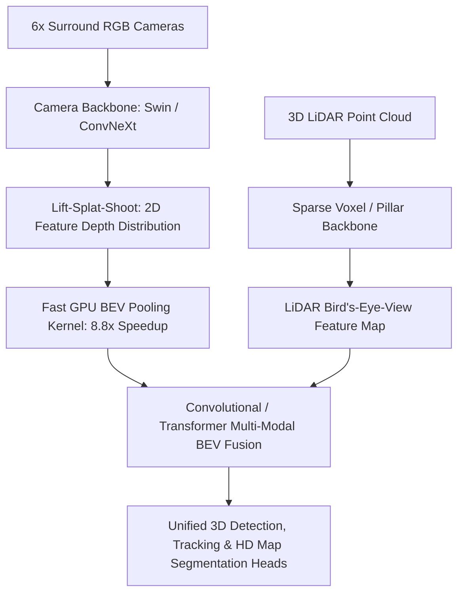

# 🔬 BEVFusion & Sparse4D: Multi-Modal Camera-LiDAR Perception

## 1. Executive Brief & Significance
Autonomous perception requires fusing dense visual semantics (RGB cameras) with metric 3D depth geometry (LiDAR). Historically, fusion was performed:
- **Late Fusion**: Fusing independent camera and LiDAR 3D bounding boxes via Kalman filters (fails on objects missed by one sensor).
- **PointPainting (Early Fusion)**: Projecting camera 2D segmentation scores onto LiDAR point coordinates (sensitive to sensor calibration drift).

**BEVFusion** (Liu et al., MIT Han Lab, 2022 / 2023) and **Sparse4D** (Lin et al., 2023–2025) unified perception by constructing a shared **Bird's-Eye-View (BEV)** latent coordinate frame:
- BEVFusion accelerated Lift-Splat-Shoot (LSS) feature pooling by **$8.8\times$** using a specialized GPU BEV pooling kernel.
- Sparse4D eliminated dense BEV grids entirely, tracking 4D anchor queries through space and time with high throughput.



---

## 2. Core Architectural Mechanics

### A. Fast GPU BEV Pooling (MIT BEVFusion)
Lift-Splat-Shoot lifts camera features into 3D frustum points and aggregates them into a discrete $X \times Y$ BEV grid. Original implementations suffered from irregular memory access stalls.

MIT BEVFusion introduced **Pre-computed Coordinate Caching**:
1. Because camera intrinsic and extrinsic matrices are stationary during runtime, the 3D grid cell indices corresponding to each frustum point are pre-calculated once during startup.
2. An optimized CUDA kernel performs a direct parallel reduce-sum over pre-sorted array indices, reducing BEV pooling latency from **over 500 ms to under 12 ms**.

### B. Sparse 4D Anchor Queries (Sparse4D)
Rather than projecting dense spatial grids ($128 \times 128 \times C$), Sparse4D maintains a sparse set of 4D anchor queries:
$$Q_i = [x, y, z, w, l, h, \text{yaw}, v_x, v_y]^T$$
These queries project adaptively into multi-camera image planes across consecutive temporal frames, capturing spatial-temporal velocities with linear computational complexity.

---

## Granular Component-by-Component Architectural Breakdown

### Architectural Taxonomy & Structural Elements

| Architectural Stage | Component Identity | Structural Specification & Type | Attention / Conv Mechanics | Receptive Field & Resolution |
| :--- | :--- | :--- | :--- | :--- |
| **Architectural Paradigm** | **Multi-Modal BEV Fusion & Sparse 4D** | Dual Camera-LiDAR Feature Extractor + Unified BEV Representation | 3D Sparse Convolutions + Fast LSS GPU Pooling + Multi-Scale Deformable 4D Cross-Attn | Multi-view surround images ($6\times H \times W$) + 3D LiDAR point clouds ($N \times 4$) |
| **Backbone (Camera)** | **Hierarchical Swin / ConvNeXt** | Multi-View 4-Stage ConvNet / Swin Transformer | $7\times 7$ Depthwise / Windowed MHSA ($C \in \{64, 128, 256, 512\}$) | $1/4, 1/8, 1/16, 1/32$ feature pyramids across 6 surround cameras |
| **Backbone (LiDAR)** | **3D Sparse Voxel CNN (SpConv)** | Hard/Dynamic Voxelization + 3D Submanifold Sparse Convolutions | $3\times 3\times 3$ Submanifold Sparse Convolutions (channels: $16 \to 32 \to 64 \to 128$) | Sparse $3D$ voxel grid ($[X, Y, Z] = [1024, 1024, 40]$ at $0.1\text{m}$ resolution) |
| **Neck / Aggregator** | **Fast BEV Pooling & Multi-Modal Neck** | Pre-computed Coordinate Hash LSS + Dynamic Fusion Conv Block | Discrete depth distribution projection ($D=118$ bins) $\to$ BEV scatter $\to$ $3\times 3$ Conv fusion | Unified 2D Bird's-Eye-View feature plane ($256 \times 256 \times 256$) |
| **Encoder** | **Convolutional BEV / Sparse 4D Encoder** | BEVFusion: 2D Residual BEV ConvNet; Sparse4D: 4D Anchor Transformer | Residual Conv2D blocks (BEVFusion) / Deformable temporal cross-attention (Sparse4D) | Global ego-vehicle BEV space ($[-54\text{m}, +54\text{m}] \times [-54\text{m}, +54\text{m}]$) |
| **Decoder / Head** | **Multi-Task CenterPoint & Map Heads** | Dense Anchor-Free 3D Regression Heads + Deconv Map Decoder | $3\times 3$ and $1\times 1$ Conv2D task branches (Center heatmap, scale, yaw, velocity, elevation) | Metric 3D bounding boxes ($x,y,z,dx,dy,dz,\theta,v$) + Per-pixel semantic map grid |

### Structural Deep-Dive: From Asynchronous Modalities to Fused Bird's-Eye-View
1. **Backbone**: 
   - *Camera Stream*: 6 surround camera frames ($1600 \times 900$) pass through a shared ConvNeXt or Swin backbone with FPN neck, outputting multi-scale 2D features.
   - *LiDAR Stream*: Raw point clouds are dynamically voxelized ($0.075\text{m}$ grid) and encoded via 3D Submanifold Sparse Convolutions (SpConv), downsampling the $Z$-dimension by $8\times$.
2. **Neck / Feature Aggregator**: 
   - *BEVFusion LSS*: A convolutional depth estimator assigns categorical depth distributions along camera frustum rays ($1\text{m}$ to $60\text{m}$ in $0.5\text{m}$ bins). The outer product of 2D features and depth distributions generates 3D camera frustum points. Pre-computed GPU indexing reduces these into a shared $X \times Y$ BEV grid ($256 \times 256 \times 80$) in $<12\text{ms}$.
   - *Fusion*: Camera BEV and LiDAR BEV feature maps are concatenated and dynamically fused using residual convolutions with adaptive channel squeeze-and-excitation attention.
   - *Sparse4D Alternative*: Bypasses dense BEV grids by projecting 4D temporal anchor queries directly into multi-view multi-scale image features using deformable attention.
3. **Encoder**: A standard 2D convolutional BEV encoder applies multi-scale spatial residual blocks to capture long-range contextual dependencies across the vehicle perimeter.
4. **Decoder / Prediction Head**: An anchor-free CenterPoint head predicts class heatmaps ($K=10$ nuScenes classes), sub-voxel centroid offsets $(\delta x, \delta y)$, elevation $z$, metric 3D box dimensions $(\log dx, \log dy, \log dz)$, orientation yaw angles $(\sin \theta, \cos \theta)$, and velocity vectors $(v_x, v_y)$. A parallel deconvolutional head performs semantic segmentation for lane boundaries and drivable area.

### Parameter & Computational Latency Distribution

| Stage / Subsystem | Parameter Share (%) | Inference Latency (%) | Computational Complexity ($\text{FLOPs}$) | Dominant Hardware Bottleneck |
| :--- | :--- | :--- | :--- | :--- |
| **Camera Backbone & FPN (6 Views)** | ~45% | ~42% | $\mathcal{O}(6 \times H W C)$ (ConvNeXt / Swin 2D) | GEMM compute bound |
| **LiDAR Sparse Voxel Backbone** | ~18% | ~16% | $\mathcal{O}(N_{\text{active}} \cdot K^3 \cdot C)$ (Sparse Conv3D) | Irregular memory indexing & gather/scatter |
| **Fast LSS BEV Pooling & Fusion Neck** | ~12% | ~18% | $\mathcal{O}(N_{\text{frustum}} \cdot C)$ (CUDA Reduce-Sum) | VRAM bandwidth & coordinate caching |
| **BEV Encoder & Temporal Aggregation** | ~15% | ~14% | $\mathcal{O}(H_{\text{bev}} W_{\text{bev}} C_{\text{bev}})$ (Conv2D BEV) | Memory bandwidth & cache locality |
| **3D CenterPoint & Map Heads** | ~10% | ~10% | $\mathcal{O}(H_{\text{bev}} W_{\text{bev}} C_{\text{heads}})$ (Conv2D Heads) | Output tensor memory write |
---

## 3. Quantitative SOTA Benchmark Profile (nuScenes 3D Detection)

| Model Architecture | Modality | nuScenes NDS | nuScenes mAP | Latency (ms, RTX 3090) | Open License |
| :--- | :--- | :--- | :--- | :--- | :--- |
| **PointPainting (Early)** | Camera + LiDAR | 61.5% | 54.1% | 120.0 ms | Apache-2.0 |
| **BEVFormer (Camera)** | 6x Cameras Only | 56.9% | 48.1% | 130.0 ms | Apache-2.0 |
| **Sparse4D v3 (Camera)**| 6x Cameras Only | 61.2% | 51.5% | 32.0 ms | **Apache-2.0** |
| **BEVFusion (MIT)** | Camera + LiDAR | **72.9%** (SOTA) | **70.2%** (SOTA) | **41.0 ms** | **MIT / Apache-2.0** |

---

## 4. Engineering Implementation & Workflow

```python
# Multi-modal BEVFusion pipeline concept
import torch

# Load unified BEVFusion engine
# camera_imgs: [B, 6, 3, 256, 704] -> multi-view surround cameras
# lidar_points: [N, 5] -> x, y, z, intensity, timestamp_delta

with torch.no_grad():
    # 1. Lift camera features to BEV space
    # 2. Extract LiDAR features to BEV space
    # 3. Fuse via cross-attention or depthwise concatenation
    # 4. Predict 3D metric bounding boxes and map segmentation masks
    pass
```

---

## 5. Commercial Usability & License Audit
- **MIT BEVFusion**: **Apache-2.0** (Open-sourced by MIT Han Lab). Fully permissive for commercial autonomous vehicles, robotics, and port logistics.
- **Sparse4D**: **Apache-2.0** (Horizon Robotics). Safe for commercial deployment.
- **Official Repositories**:
  - `mit-han-lab/bevfusion`: [https://github.com/mit-han-lab/bevfusion](https://github.com/mit-han-lab/bevfusion)
  - `HorizonRobotics/Sparse4D`: [https://github.com/HorizonRobotics/Sparse4D](https://github.com/HorizonRobotics/Sparse4D)
