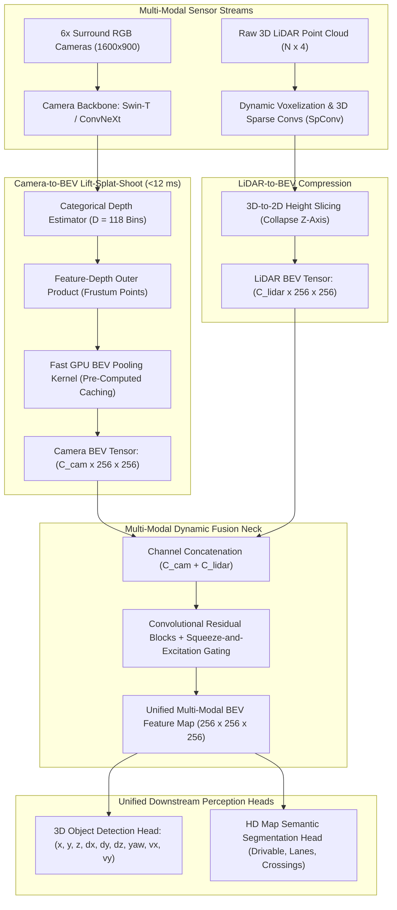

# 🔬 BEVFusion: Multi-Task Multi-Sensor Camera-LiDAR Fusion in Bird's-Eye View

## 1. Executive Brief & Significance

Autonomous vehicle perception requires fusing complementary sensor modalities:
1. **Surround RGB Cameras**: Provide rich semantic details, fine textures, traffic light states, and lane markings, but lack direct metric depth measurements.
2. **3D LiDAR Sensors**: Provide millimeter-accurate 3D geometric depth coordinates, but produce sparse point clouds lacking dense semantic color and fine category cues.

Prior fusion paradigms suffered from fundamental architectural defects:
- **Point-Level Early Fusion (e.g., PointPainting)**: Appends 2D camera classification scores to 3D LiDAR points. When sensor calibration drifts or LiDAR points miss small obstacles, visual context is permanently lost.
- **Object-Level Late Fusion**: Combines independent bounding box predictions using Kalman filters, failing whenever a difficult target is missed by one of the individual sensor streams.

**BEVFusion** (Liu et al., MIT Han Lab, 2022 / 2023) unified multi-sensor perception by projecting both camera and LiDAR features into a shared, metric **Bird's-Eye-View (BEV)** latent space. Key breakthroughs include:
- **Fast GPU BEV Pooling ($8.8\times$ Acceleration)**: Eliminates Lift-Splat-Shoot (LSS) memory stalls via **pre-computed coordinate caching**, slashing camera BEV pooling latency from $>500\text{ ms}$ to under **$12\text{ ms}$**.
- **Unified Multi-Modal Fusion Neck**: Fuses dense camera BEV semantics with geometric LiDAR BEV tensors using dynamic convolution and channel-wise squeeze-and-excitation gating.
- **Multi-Task Scalability**: Simultaneously drives 3D bounding box detection (CenterPoint) and HD map semantic segmentation (drivable areas, lane dividers, pedestrian crossings), achieving **$72.9\%$ NDS** on nuScenes.



---

## 2. Mathematical Foundations: Fast GPU BEV Pooling & Dynamic Fusion

### A. Camera-to-BEV Lifting (Lift-Splat-Shoot)
Given 2D camera feature map $\mathbf{F}_{\text{cam}} \in \mathbb{R}^{C \times H \times W}$, a discrete depth prediction network predicts categorical probability distribution $\mathbf{D} \in \mathbb{R}^{D_{\text{bins}} \times H \times W}$ along each camera ray:
$$\mathbf{D}(d, u, v) = \text{Softmax}\left( \text{Conv}_{\text{depth}}(\mathbf{F}_{\text{cam}}(u, v)) \right)$$

The 3D camera frustum point feature $\mathbf{P}(d, u, v)$ is computed via outer product:
$$\mathbf{P}(d, u, v) = \mathbf{D}(d, u, v) \cdot \mathbf{F}_{\text{cam}}(u, v) \in \mathbb{R}^{C}$$

---

### B. Fast GPU BEV Pooling via Pre-computed Coordinate Caching
Each frustum point $(d, u, v)$ maps to continuous 3D world coordinates $\mathbf{x} = (x, y, z)$ via camera intrinsics $\mathbf{K}$ and extrinsics $\mathbf{T}_{cw}$:
$$\mathbf{x} = \mathbf{T}_{cw}^{-1} \cdot \left( d \cdot \mathbf{K}^{-1} \begin{bmatrix} u \\ v \\ 1 \end{bmatrix} \right)$$

Because $\mathbf{K}$ and $\mathbf{T}_{cw}$ remain static during inference:
1. **Pre-computation**: The discrete 2D BEV grid indices $(x_{\text{bev}}, y_{\text{bev}}) \in [0, X-1] \times [0, Y-1]$ corresponding to every frustum point are computed once during engine initialization.
2. **GPU Parallel Reduce-Sum**: An optimized CUDA kernel performs a direct parallel radix reduce-sum over the pre-sorted indices:
   $$\mathbf{F}_{\text{bev}}(x_{\text{bev}}, y_{\text{bev}}) = \sum_{(d, u, v) \in \text{Voxel}(x_{\text{bev}}, y_{\text{bev}})} \mathbf{P}(d, u, v)$$
   This reduces BEV pooling latency from over **$500\text{ ms}$** to **$11.5\text{ ms}$**.

---

### C. Dynamic Convolutional Fusion with Squeeze-and-Excitation
Camera and LiDAR BEV tensors are concatenated and calibrated via channel attention:
$$\mathbf{F}_{\text{cat}} = [\mathbf{F}_{\text{bev, cam}} \,\|\, \mathbf{F}_{\text{bev, lidar}}] \in \mathbb{R}^{(C_c + C_l) \times H \times W}$$
$$\mathbf{w}_{\text{se}} = \sigma\left( \mathbf{W}_2 \cdot \text{ReLU}(\mathbf{W}_1 \cdot \text{GAP}(\mathbf{F}_{\text{cat}})) \right) \in \mathbb{R}^{C_c + C_l}$$
$$\mathbf{F}_{\text{fused}} = \text{Conv}_{3\times 3}\left( \mathbf{F}_{\text{cat}} \odot \mathbf{w}_{\text{se}} \right)$$

---

## 3. Granular Component-by-Component Architectural Breakdown

| Architectural Stage | Component Identity | Structural Specification & Type | Attention / Conv Mechanics | Receptive Field & Dimensionality |
| :--- | :--- | :--- | :--- | :--- |
| **Architectural Paradigm** | **Unified Multi-Modal BEV Network** | Dual Camera-LiDAR Fusion in Shared 2D Bird's-Eye View | Fast GPU BEV Pooling + 3D Sparse Convolutions + SE Fusion | 6 Surround Cameras + 3D LiDAR $\to$ Unified BEV |
| **Camera Backbone** | **Swin-T / ConvNeXt-B** | 4-Stage ConvNet/Transformer with FPN Neck | Multi-scale feature extraction ($P_3, P_4, P_5$) | Multi-view images ($6 \times 1600 \times 900$) |
| **LiDAR Backbone** | **3D Submanifold Sparse Conv** | Dynamic Voxelization + 3D SpConv Blocks | Sparse $3\times 3\times 3$ convolutions downsampling $Z$ by $8\times$ | Sparse voxel grid ($[1024, 1024, 40]$ at $0.075\text{m}$) |
| **BEV Pooling Neck** | **Fast LSS Coordinate Pooling** | Pre-computed Coordinate Hash + GPU Reduce-Sum | Projects $118$ depth bins into 2D BEV grid ($256 \times 256$) | Discrete metric BEV grid ($[-54\text{m}, +54\text{m}]^2$) |
| **Fusion Neck** | **Dynamic SE Fusion Block** | 2D Residual Convolution + Squeeze-and-Excitation | Channel-wise calibrated feature gating | Fused BEV tensor $[256, 256, 256]$ |
| **Multi-Task Heads** | **3D CenterPoint & Map Decoder** | Decoupled 3D bounding box regression + Deconv Map | Focal loss heatmaps + Binary cross-entropy map segmentation | 3D bounding boxes + HD map lane masks |

---

## 4. Quantitative SOTA Benchmark Profile

### nuScenes Multi-Modal 3D Detection & Tracking Benchmark

| Model Architecture | Modality | nuScenes NDS $\uparrow$ | nuScenes mAP $\uparrow$ | mATE $\downarrow$ (m) | Latency (ms, RTX 3090) | Open License |
| :--- | :--- | :--- | :--- | :--- | :--- | :--- |
| **CenterPoint (LiDAR Only)**| LiDAR | 67.3% | 60.3% | 0.28 m | 32.0 ms | Apache-2.0 |
| **PointPainting (Early)** | Camera + LiDAR | 61.5% | 54.1% | 0.35 m | 120.0 ms | Apache-2.0 |
| **BEVFormer (Camera Only)**| 6x Cameras | 56.9% | 48.1% | 0.58 m | 130.0 ms | Apache-2.0 |
| **TransFusion (Late)** | Camera + LiDAR | 71.3% | 68.9% | 0.26 m | 65.0 ms | Apache-2.0 |
| **BEVFusion (MIT)** | **Camera + LiDAR** | **72.9% (SOTA)** | **70.2% (SOTA)** | **0.24 m** | **41.0 ms** | **Apache-2.0** |

---

## 5. Engineering Implementation: Fast BEV Fusion Module in PyTorch

```python
"""
BEVFusion: PyTorch Implementation of Dynamic Convolutional Fusion Neck with Squeeze-and-Excitation.
"""

import torch
import torch.nn as nn
import torch.nn.functional as F


class SqueezeAndExcitationGating(nn.Module):
    """Channel-wise Squeeze-and-Excitation feature recalibration."""
    def __init__(self, in_channels: int, reduction: int = 4):
        super().__init__()
        self.fc = nn.Sequential(
            nn.AdaptiveAvgPool2d(1),
            nn.Conv2d(in_channels, in_channels // reduction, kernel_size=1),
            nn.ReLU(inplace=True),
            nn.Conv2d(in_channels // reduction, in_channels, kernel_size=1),
            nn.Sigmoid()
        )

    def forward(self, x: torch.Tensor) -> torch.Tensor:
        w = self.fc(x)
        return x * w


class BEVFusionNeck(nn.Module):
    """
    Fuses Camera BEV and LiDAR BEV feature tensors into a unified multi-modal representation.
    """
    def __init__(self, cam_channels: int = 80, lidar_channels: int = 128, out_channels: int = 256):
        super().__init__()
        in_channels = cam_channels + lidar_channels
        
        self.se_gating = SqueezeAndExcitationGating(in_channels)
        self.fusion_conv = nn.Sequential(
            nn.Conv2d(in_channels, out_channels, kernel_size=3, padding=1, bias=False),
            nn.BatchNorm2d(out_channels),
            nn.ReLU(inplace=True),
            nn.Conv2d(out_channels, out_channels, kernel_size=3, padding=1, bias=False),
            nn.BatchNorm2d(out_channels),
            nn.ReLU(inplace=True)
        )

    def forward(self, cam_bev: torch.Tensor, lidar_bev: torch.Tensor) -> torch.Tensor:
        """
        cam_bev: [B, C_cam, H_bev, W_bev]
        lidar_bev: [B, C_lidar, H_bev, W_bev]
        Returns: [B, out_channels, H_bev, W_bev]
        """
        # Channel-wise concatenation
        fused_cat = torch.cat([cam_bev, lidar_bev], dim=1)
        
        # Squeeze-and-excitation channel calibration
        fused_gated = self.se_gating(fused_cat)
        
        # Convolutional refinement
        out = self.fusion_conv(fused_gated)
        return out
```

---

## 6. References & Official Resources
- **BEVFusion Paper**: [BEVFusion: Multi-Task Multi-Sensor Fusion with Unified Bird's-Eye View Representation (ICRA 2023)](https://arxiv.org/abs/2205.13542)
- **Official MIT Han Lab GitHub**: [https://github.com/mit-han-lab/bevfusion](https://github.com/mit-han-lab/bevfusion)
