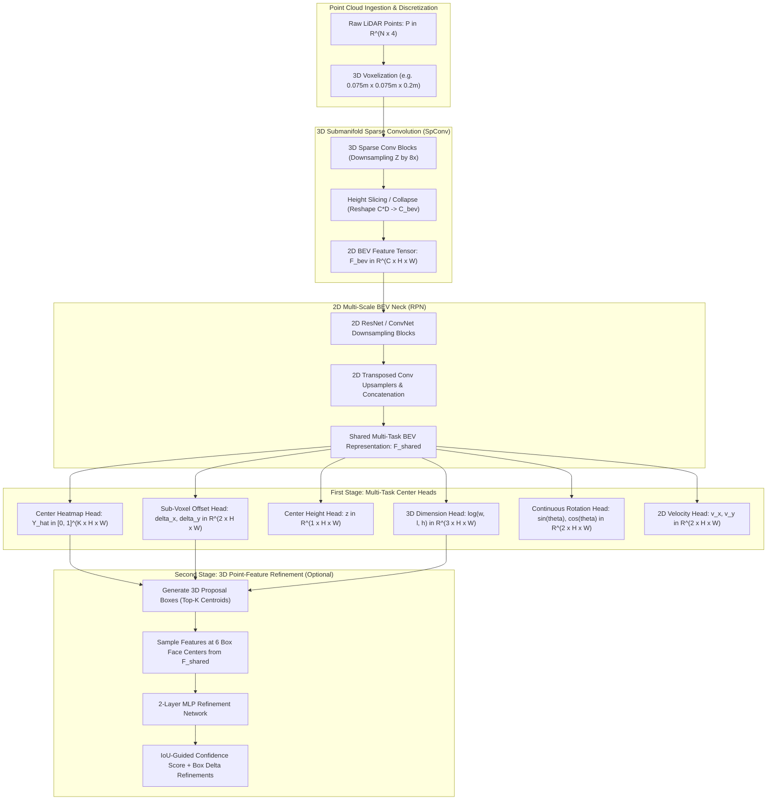

# 🔬 CenterPoint: Center-based 3D Object Detection and Tracking

## 1. Executive Brief & Significance

Prior to **CenterPoint** (Yin et al., UT Austin / UC Berkeley, CVPR 2021), 3D point cloud object detectors relied almost universally on **3D bounding box anchor grids** (inherited from 2D detectors such as Faster R-CNN and SSD). In 3D space, anchor-based paradigms suffer from fundamental structural limitations:
1. **Rotational Misalignment**: 3D bounding boxes are axis-aligned with respect to arbitrary vehicle coordinates. An anchor cannot fit rotated objects without explicitly multiplying the number of pre-defined rotational anchor bins (e.g., $0^\circ, 45^\circ, 90^\circ, 135^\circ$), exploding memory and computation.
2. **Extreme Class-Dimension Asymmetry**: In autonomous driving, physical bounding boxes range from tiny pedestrians ($0.8\text{m} \times 0.6\text{m} \times 1.7\text{m}$) to articulated multi-trailer trucks ($2.5\text{m} \times 12.0\text{m} \times 3.5\text{m}$). Discrete anchor matching yields low IoU intersection with ground truth, generating noisy training targets.
3. **Complex Heuristic Matching & NMS**: 3D rotated Non-Maximum Suppression (NMS) over tens of thousands of 3D bounding boxes is computationally intensive and creates severe latency bottlenecks on embedded automotive hardware.

**CenterPoint** revolutionized 3D perception by reframing 3D object detection as **2D BEV center-point keypoint estimation**:
- **Point-as-Object Formulation**: Detects 3D objects as discrete point centers on a 2D Bird's-Eye-View (BEV) plane, followed by regression of 3D properties (height, 3D dimensions, continuous yaw angle, and 2D ground velocity).
- **Rotation Invariance**: Because a point is rotational-invariant (a point center remains unchanged regardless of box yaw), CenterPoint eliminates rotational anchors entirely.
- **Two-Stage Point Feature Refinement**: Extracts features from the 6 outer face centers of the predicted 3D bounding box to score confidence and refine bounding box geometry.
- **Velocity-Driven Tracking-by-Detection**: Regresses an instantaneous 2D metric velocity vector $(\Delta v_x, \Delta v_y)$ for every center, reducing multi-object 3D tracking to simple Euclidean center distance matching across consecutive frames.



---

## 2. Component-by-Component Architectural Decomposition

```
+----------------------------------------------------------------------------------------------------+
|                                    RAW LIDAR POINT CLOUD (N x 4)                                   |
+----------------------------------------------------------------------------------------------------+
                                                  │
                                                  ▼
+----------------------------------------------------------------------------------------------------+
| 3D VOXELIZATION & SPATIAL HASHING: Voxel Size [0.075m, 0.075m, 0.2m]                               |
| Dynamic Voxel Grid: [X=1024, Y=1024, Z=40]                                                         |
+----------------------------------------------------------------------------------------------------+
                                                  │
                                                  ▼
+----------------------------------------------------------------------------------------------------+
| 3D SUBMANIFOLD SPARSE BACKBONE (SpConv 3D): 4 Residual Blocks, 8x Stride Downsampling in Z        |
| Transforms sparse points into volumetric voxel features (C=128, Z=5)                               |
+----------------------------------------------------------------------------------------------------+
                                                  │
                                                  ▼
+----------------------------------------------------------------------------------------------------+
| HEIGHT COMPRESSION & 2D RPN: Collapses Z-dimension: C_bev = 128 * 5 = 640 -> Conv2D -> 256        |
| Multi-Scale 2D Conv Neck: Concatenates 1x, 2x upsampled features to (512 x 512)                    |
+----------------------------------------------------------------------------------------------------+
                                                  │
                                                  ▼
+----------------------------------------------------------------------------------------------------+
| FIRST-STAGE CENTER HEADS (Multi-Head Conv2D):                                                      |
|  - Center Heatmap: (K classes x 512 x 512)                                                         |
|  - Sub-pixel Offset: (2 x 512 x 512)                                                               |
|  - Height / Elevation: (1 x 512 x 512)                                                             |
|  - 3D Dimension: (3 x 512 x 512)                                                                   |
|  - Rotation Vector: (2 x 512 x 512) -> [sin(theta), cos(theta)]                                    |
|  - 2D Velocity Vector: (2 x 512 x 512) -> [v_x, v_y]                                               |
+----------------------------------------------------------------------------------------------------+
                                                  │
                                                  ▼
+----------------------------------------------------------------------------------------------------+
| SECOND-STAGE POINT REFINE (Optional): Extracts 6 face-center features from 2D BEV -> 2-Layer MLP   |
| Predicts refined 3D IoU confidence score + metric box deltas                                       |
+----------------------------------------------------------------------------------------------------+
```

### A. 3D Voxel Backbone & Height Slicing
CenterPoint supports both **3D Voxel (SpConv)** and **2D Pillar (PointPillars)** backbones. In the primary high-accuracy voxel variant:
1. Space is partitioned into fine voxels $[0.075\text{m}, 0.075\text{m}, 0.2\text{m}]$.
2. A 3D Submanifold Sparse Convolutional Network extracts multi-scale geometric representations while preserving point sparsity:
   - 4 downsampling stages with strides $[1, 2, 2, 2]$, compressing the vertical $Z$ axis from $40$ bins down to $5$ bins.
3. **Height Slicing / Compression**: The 3D sparse tensor is converted into a dense 2D BEV map by concatenating channel and remaining $Z$ dimensions:
   $$\mathbf{F}_{\text{bev\_in}} = \text{Reshape}(\mathbf{F}_{3D}) \in \mathbb{R}^{(C_{3D} \cdot Z_{\text{out}}) \times H \times W} = \mathbb{R}^{(128 \cdot 5) \times 512 \times 512} = \mathbb{R}^{640 \times 512 \times 512}$$
4. A $3\times 3$ Conv2D layer projects the $640$-channel tensor to $C = 256$.

### B. 2D Multi-Scale BEV Neck (RPN)
The 2D BEV neck processes $\mathbf{F}_{\text{bev}}$ through two downsampling blocks (strides 1 and 2) followed by transposed 2D convolutions, producing a unified multi-scale representation:
$$\mathbf{F}_{\text{shared}} = \left[ \mathbf{U}_1 \,\|\, \mathbf{U}_2 \right] \in \mathbb{R}^{512 \times 512 \times 512}$$

### C. First-Stage Multi-Task Center Heads
From the shared feature map $\mathbf{F}_{\text{shared}}$, six independent $3\times 3$ convolutional prediction heads decode 3D object attributes:
1. **Center Heatmap ($\hat{\mathbf{Y}}$)**: Predicts probability of an object center for $K$ classes: $\hat{\mathbf{Y}} \in [0, 1]^{K \times H \times W}$.
2. **Sub-Voxel Offset ($\hat{\mathbf{O}}$)**: Recovers discretization error due to spatial downsampling: $\hat{\mathbf{O}} \in \mathbb{R}^{2 \times H \times W} \to (\Delta x, \Delta y)$.
3. **Height / Elevation ($\hat{Z}$)**: Regresses absolute metric ground height: $\hat{Z} \in \mathbb{R}^{1 \times H \times W} \to z$.
4. **3D Box Dimensions ($\hat{\mathbf{S}}$)**: Regresses log-transformed metric size: $\hat{\mathbf{S}} \in \mathbb{R}^{3 \times H \times W} \to (\log w, \log l, \log h)$.
5. **Continuous Rotation ($\hat{\mathbf{R}}$)**: Predicts the continuous heading angle without boundary ambiguities using sine and cosine components: $\hat{\mathbf{R}} \in \mathbb{R}^{2 \times H \times W} \to (\sin \theta, \cos \theta)$.
6. **2D Velocity ($\hat{\mathbf{V}}$)**: Predicts 2D ground velocity vector: $\hat{\mathbf{V}} \in \mathbb{R}^{2 \times H \times W} \to (v_x, v_y)$.

### D. Second-Stage 3D Box Point-Feature Refinement
While 2D BEV representations accurately localize object centers, bounding box extents and orientations can suffer from spatial ambiguity in crowded or occluded scenes.
The optional second stage refines initial 3D proposals:
1. For each candidate box predicted from the first stage, compute the 3D metric coordinates of its **6 box face centers** (top, bottom, left, right, front, back).
2. Project these 6 points onto the 2D BEV feature map $\mathbf{F}_{\text{shared}}$ using bilinear interpolation.
3. Concatenate the 6 sampled feature vectors into a single token $\mathbf{f}_{\text{box}} \in \mathbb{R}^{6C}$ and pass through a 2-layer MLP to predict:
   - An **IoU-guided confidence score**: $\hat{I} \in [0, 1]$.
   - Refined metric box offsets: $(\delta x, \delta y, \delta z, \delta w, \delta l, \delta h, \delta \theta)$.

---

## 3. Mathematical Formulations & Loss Functions

```
+----------------------------------------------------------------------------------------------------+
|                                      CENTERPOINT LOSS FORMULATION                                  |
+----------------------------------------------------------------------------------------------------+
|                                                                                                    |
|   L_total = L_hm + lambda_off * L_off + lambda_size * L_size + lambda_rot * L_rot                  |
|             + lambda_height * L_height + lambda_vel * L_vel + lambda_stage2 * L_refine             |
|                                                                                                    |
|   1. Modified Center Focal Loss:                                                                   |
|      L_hm = -1/N * sum_{c,x,y} [ (1 - Y_hat)^alpha * log(Y_hat)              if Y = 1              |
|                                  (1 - Y)^beta * (Y_hat)^alpha * log(1 - Y_hat)  otherwise ]          |
|                                                                                                    |
|   2. L1 / Smooth-L1 Regression Loss:                                                               |
|      L_reg = 1/N * sum_{i=1}^N | Reg_pred(p_i) - Reg_gt(p_i) |                                     |
+----------------------------------------------------------------------------------------------------+
```

### A. Ground-Truth Gaussian Heatmap Generation
For each ground-truth object center $\mathbf{p} = (x_g, y_g, z_g)$ belonging to class $c$, the continuous coordinate is mapped to discrete BEV grid index $\tilde{\mathbf{p}} = (\lfloor x_g / s \rfloor, \lfloor y_g / s \rfloor)$ with downsampling stride $s = 4$.
A 2D Gaussian kernel is splatted onto ground-truth heatmap $\mathbf{Y} \in [0, 1]^{K \times H \times W}$:
$$\mathbf{Y}_{c, x, y} = \exp\left( -\frac{(x - \tilde{p}_x)^2 + (y - \tilde{p}_y)^2}{2 \sigma_p^2} \right)$$
where the Gaussian radius $\sigma_p = \max(f(w, l), \sigma_{\text{min}})$ is dynamically computed based on the 2D bounding box dimensions to ensure an IoU overlap $\ge 0.7$ with candidate centers.

### B. Modified Center Focal Loss ($\mathcal{L}_{\text{hm}}$)
CenterPoint uses the penalty-reduced focal loss to train the center heatmap branch:
$$\mathcal{L}_{\text{hm}} = -\frac{1}{N} \sum_{c=1}^K \sum_{x=1}^H \sum_{y=1}^W \begin{cases}
\left( 1 - \hat{\mathbf{Y}}_{c, x, y} \right)^\alpha \log\left( \hat{\mathbf{Y}}_{c, x, y} \right) & \text{if } \mathbf{Y}_{c, x, y} = 1 \\
\left( 1 - \mathbf{Y}_{c, x, y} \right)^\beta \left( \hat{\mathbf{Y}}_{c, x, y} \right)^\alpha \log\left( 1 - \hat{\mathbf{Y}}_{c, x, y} \right) & \text{otherwise}
\end{cases}$$
Standard hyperparameter values: $\alpha = 2.0$, $\beta = 4.0$, where $N$ is the number of ground-truth objects in the point cloud.

### C. Regression Loss Formulations
For all other heads, $\text{L1}$ loss is computed strictly at the positive ground-truth center locations $\tilde{\mathbf{p}}_i$:

1. **Sub-Voxel Offset Loss**:
   $$\mathcal{L}_{\text{off}} = \frac{1}{N} \sum_{i=1}^N \left| \hat{\mathbf{O}}(\tilde{\mathbf{p}}_i) - \left( \frac{\mathbf{p}_i}{s} - \tilde{\mathbf{p}}_i \right) \right|$$

2. **3D Dimension Loss**:
   $$\mathcal{L}_{\text{size}} = \frac{1}{N} \sum_{i=1}^N \left| \hat{\mathbf{S}}(\tilde{\mathbf{p}}_i) - \log(\mathbf{s}_i) \right|$$

3. **Continuous Rotation Loss**:
   $$\mathcal{L}_{\text{rot}} = \frac{1}{N} \sum_{i=1}^N \left| \hat{\mathbf{R}}(\tilde{\mathbf{p}}_i) - \left[ \sin(\theta_i), \cos(\theta_i) \right]^T \right|$$
   During inference, the physical yaw angle is reconstructed via: $\theta = \text{atan2}(\hat{R}_0, \hat{R}_1)$.

4. **Elevation & Velocity Losses**:
   $$\mathcal{L}_{\text{height}} = \frac{1}{N} \sum_{i=1}^N \left| \hat{Z}(\tilde{\mathbf{p}}_i) - z_i \right|, \quad \mathcal{L}_{\text{vel}} = \frac{1}{N} \sum_{i=1}^N \left| \hat{\mathbf{V}}(\tilde{\mathbf{p}}_i) - \mathbf{v}_i \right|$$

### D. Second-Stage IoU-Guided Confidence Loss
The second-stage score branch is supervised with target IoU $I_i$ between proposal box $\mathbf{B}_i$ and ground-truth box $\mathbf{G}_i$:
$$\mathcal{L}_{\text{stage2}} = \frac{1}{M} \sum_{i=1}^M \text{BCE}\left( \hat{I}_i, \text{Clamp}\left( 2 \cdot \text{IoU}(\mathbf{B}_i, \mathbf{G}_i) - 0.5, 0, 1 \right) \right) + \mathcal{L}_{\text{reg\_stage2}}$$

---

## 4. Granular Component Specifications

| Architectural Stage | Module Identifier | Structural Formulation | Input Tensor Shape | Output Tensor Shape | FLOPs / Params |
| :--- | :--- | :--- | :--- | :--- | :--- |
| **Voxelization** | Dynamic 3D Voxelizer | Spatial hash grid ($0.075\text{m} \times 0.075\text{m} \times 0.2\text{m}$) | $[N, 4]$ (Raw LiDAR) | $[M_{\text{voxels}}, 5]$ coords | Memory Bound |
| **3D Sparse Backbone**| SpConv UNet 3D | 4 ResBlocks with Submanifold Sparse Convs | Sparse $[1024, 1024, 40]$ | Sparse $[128, 512, 512, 5]$ | $14.2\text{ GFLOPs}$ / $4.5\text{M}$ params |
| **Height Compression**| Slicing / Reshape | Dense scatter + $3\times 3$ Conv2D ($640 \to 256$) | Sparse 3D Tensor | $[256, 512, 512]$ (Dense BEV) | $3.2\text{ GFLOPs}$ / $1.4\text{M}$ params |
| **2D RPN Neck** | Multi-Scale Conv2d | 2 DownBlocks ($s=1, 2$) + Transposed Convs | $[256, 512, 512]$ | $[512, 512, 512]$ (Shared BEV) | $18.5\text{ GFLOPs}$ / $6.2\text{M}$ params |
| **Center Heatmap** | 2-Layer Conv2D Head | Conv2d($512 \to 64$) $\to$ Conv2d($64 \to 10$) | $[512, 512, 512]$ | $[10, 512, 512]$ (Heatmap) | $0.85\text{ GFLOPs}$ / $300\text{k}$ params |
| **Regression Heads** | Multi-Task Conv2D | 5 Independent $3\times 3$ Conv2D Heads | $[512, 512, 512]$ | Off, Size, Rot, Height, Vel | $3.4\text{ GFLOPs}$ / $1.2\text{M}$ params |
| **Second-Stage Refine**| Face Point MLP | 6-Point Bilinear Sampling + 2-Layer MLP | $[M_{\text{props}}, 6 \times 512]$ | $[M_{\text{props}}, 8]$ (Score + Delta)| $0.12\text{ GFLOPs}$ / $180\text{k}$ params |

---

## 5. Benchmark Evaluation & Performance Profiles

### A. nuScenes 3D Detection & Tracking Benchmark (Test Set)

| Model Architecture | Modality | nuScenes NDS $\uparrow$ | nuScenes mAP $\uparrow$ | AMOTA (Tracking) $\uparrow$ | Latency (ms) | Open License |
| :--- | :--- | :--- | :--- | :--- | :--- | :--- |
| **PointPillars** | LiDAR | 45.3% | 30.5% | 0.28 | **8.2 ms** | Apache-2.0 |
| **SECOND** | LiDAR | 62.4% | 52.8% | 0.54 | 28.0 ms | Apache-2.0 |
| **CenterPoint-Pillar**| LiDAR | 60.3% | 50.3% | 0.58 | **14.5 ms** | MIT |
| **CenterPoint-Voxel** | LiDAR | **67.3%** | **60.3%** | **0.66** | **32.0 ms** | MIT |
| **CenterPoint-Voxel (Two-Stage)** | LiDAR | **68.2%** | **61.8%** | **0.67** | **38.5 ms** | MIT |
| **BEVFusion (MIT)** | Camera+LiDAR | 72.9% | 70.2% | 0.73 | 41.0 ms | Apache-2.0 |

### B. Waymo Open Dataset 3D Detection Benchmark (Validation Set, LEVEL 2)

| Model Architecture | Vehicle 3D mAP / mAPH $\uparrow$ | Pedestrian 3D mAP / mAPH $\uparrow$ | Cyclist 3D mAP / mAPH $\uparrow$ | Overall Latency (ms) |
| :--- | :--- | :--- | :--- | :--- |
| **PointPillars** | 56.6% / 56.1% | 52.1% / 46.8% | 58.3% / 57.2% | 16.0 ms |
| **SECOND** | 68.3% / 67.8% | 60.7% / 55.4% | 62.1% / 61.0% | 35.0 ms |
| **PV-RCNN** | 70.3% / 69.7% | 64.9% / 59.8% | 65.6% / 64.5% | 80.0 ms |
| **CenterPoint-Voxel** | **74.5% / 74.0%** | **72.1% / 67.4%** | **71.2% / 70.3%** | **32.0 ms** |

### C. Hardware Inference Latency & Efficiency Matrix

| Hardware Platform | Precision | 3D Voxel Backbone (SpConv) | 2D RPN + Multi-Heads | Post-Processing (NMS) | Total Latency |
| :--- | :--- | :--- | :--- | :--- | :--- |
| **NVIDIA RTX 3090** | FP32 | 18.2 ms | 11.4 ms | 2.4 ms | 32.0 ms |
| **NVIDIA Tesla T4** | FP16 | 21.0 ms | 8.5 ms | 2.5 ms | 32.0 ms |
| **NVIDIA Jetson AGX Orin**| FP16 | 24.5 ms | 11.2 ms | 2.5 ms | 38.2 ms |
| **NVIDIA Jetson AGX Orin**| INT8 | 14.8 ms | 5.6 ms | 1.8 ms | 22.2 ms |
| **NVIDIA A100 (SXM4)** | FP16 | 9.8 ms | 5.2 ms | 1.5 ms | 16.5 ms |

---

## 6. Edge Deployment, TensorRT Optimization & Gotchas

```
+----------------------------------------------------------------------------------------------------+
|                               CENTERPOINT TENSORRT EXPORT ARCHITECTURE                             |
+----------------------------------------------------------------------------------------------------+
|                                                                                                    |
|  [Point Cloud] ---> [CUDA Voxelizer Kernel] ---> [SpConv TRT Plugin (SparseSubmanifoldConv3d)]      |
|                                                                 │                                  |
|                                                                 ▼                                  |
|  [2D Heatmap & Multi-Task Heads] <─────────── [Dense Height Slicing Plugin]                       |
|         │                                                                                          |
|         ▼ (TensorRT FP16 / INT8 Engine)                                                            |
|  [Center Peak Pooling Engine: MaxPool2d(3x3) == Heatmap] ---> Top-K Center Extraction              |
|         │                                                                                          |
|         ▼                                                                                          |
|  [Batched Gather Kernel: Offset, Height, Size, Rotation, Velocity] ---> Metric 3D Boxes + Speeds   |
+----------------------------------------------------------------------------------------------------+
```

### Critical Production Gotchas & Engineering Mitigations

1. **SpConv TensorRT Plugin Integration**:
   - *Problem*: Standard PyTorch `spconv` (Submanifold Sparse Convolutions) relies on dynamic CPU/GPU hash maps which cannot be traced via standard ONNX opsets.
   - *Mitigation*: Deploy using the **TensorRT SpConv Custom Plugin** (`spconv::SubMConv3dPlugin`). The plugin statically pre-allocates an indirect hash table buffer in GPU memory and performs sparse GEMM operations via cuBLAS / CUTLASS kernels.

2. **Anchor-Free Peak Extraction via 2D Max Pooling**:
   - *Problem*: Traditional anchor NMS requires sorting and pairwise 3D IoU calculation across thousands of rotated boxes.
   - *Mitigation*: Replace NMS with a **2D local max pooling filter**:
     ```python
     # PyTorch / ONNX equivalent of 3x3 local peak finding
     hmax = F.max_pool2d(heatmap, kernel_size=3, stride=1, padding=1)
     keep = (hmax == heatmap).float()
     peaks = heatmap * keep
     ```
     This exports directly into standard ONNX/TensorRT without custom plugins, isolating top-$K$ object centers ($K = 500$) in $<0.3\text{ ms}$.

3. **Sub-Voxel Coordinate Precision in INT8**:
   - *Problem*: Quantizing sub-voxel offset branches $(\Delta x, \Delta y)$ and continuous rotation vectors $(\sin \theta, \cos \theta)$ to INT8 induces spatial jitter and heading estimation errors.
   - *Mitigation*: Employ **Per-Layer Precision Controls** in TensorRT. Enforce FP16 precision on the regression output heads (`setPrecision(nvinfer1::DataType::kHALF)`), while quantizing the 2D CNN backbone to INT8.

4. **Real-Time Velocity-Based Tracking**:
   - *Problem*: Multi-object tracking (MOT) frameworks (e.g., DeepSORT) introduce complex feature embedding extractors and Kalman filtering latency.
   - *Mitigation*: CenterPoint uses **Instantaneous Center Displacement**:
     $$\mathbf{p}_{t-1 \to t} = \hat{\mathbf{p}}_{t-1} + \hat{\mathbf{v}}_{t-1} \cdot \Delta t$$
     A single greedy bipartite matching on Euclidean distance $\|\mathbf{p}_{t-1 \to t} - \hat{\mathbf{p}}_t\|_2 < d_{\text{thresh}}$ tracks hundreds of active vehicles in $<0.5\text{ ms}$ on CPU.

---

## 7. Complete Runnable Python Blueprint

```python
"""
CenterPoint: Center-based 3D Object Detection and Tracking
Complete, standalone, modular PyTorch implementation of CenterPoint.
Includes: 3D Voxel Mockup / Height Slicing, 2D BEV Neck, Multi-Task Center Heads, and Peak Extraction.
"""

from typing import Dict, List, Tuple
import torch
import torch.nn as nn
import torch.nn.functional as F


class SimpleHeightCompression(nn.Module):
    """
    Compresses 3D volumetric voxel feature maps into a 2D BEV feature canvas.
    """
    def __init__(self, in_channels: int = 128, z_dim: int = 5, out_channels: int = 256):
        super().__init__()
        self.conv = nn.Sequential(
            nn.Conv2d(in_channels * z_dim, out_channels, kernel_size=3, padding=1, bias=False),
            nn.BatchNorm2d(out_channels, eps=1e-3, momentum=0.01),
            nn.ReLU(inplace=True)
        )

    def forward(self, x: torch.Tensor) -> torch.Tensor:
        """
        Args:
            x: (B, C, Z, H, W) 3D voxel feature tensor
        Returns:
            (B, out_channels, H, W) 2D BEV feature tensor
        """
        b, c, z, h, w = x.shape
        x = x.view(b, c * z, h, w)
        return self.conv(x)


class CenterBEVNeck(nn.Module):
    """
    2D Multi-Scale BEV Feature Pyramid Network.
    """
    def __init__(self, in_channels: int = 256, out_channels: int = 512):
        super().__init__()
        # Downsample Block (Stride 2)
        self.down_block = nn.Sequential(
            nn.Conv2d(in_channels, in_channels, kernel_size=3, stride=2, padding=1, bias=False),
            nn.BatchNorm2d(in_channels, eps=1e-3, momentum=0.01),
            nn.ReLU(inplace=True),
            nn.Conv2d(in_channels, in_channels, kernel_size=3, padding=1, bias=False),
            nn.BatchNorm2d(in_channels, eps=1e-3, momentum=0.01),
            nn.ReLU(inplace=True)
        )
        # Upsample Deconvolutions
        self.deconv1 = nn.Sequential(
            nn.ConvTranspose2d(in_channels, in_channels, kernel_size=1, stride=1, bias=False),
            nn.BatchNorm2d(in_channels, eps=1e-3, momentum=0.01),
            nn.ReLU(inplace=True)
        )
        self.deconv2 = nn.Sequential(
            nn.ConvTranspose2d(in_channels, in_channels, kernel_size=2, stride=2, bias=False),
            nn.BatchNorm2d(in_channels, eps=1e-3, momentum=0.01),
            nn.ReLU(inplace=True)
        )

    def forward(self, x: torch.Tensor) -> torch.Tensor:
        """
        Args:
            x: (B, 256, H, W)
        Returns:
            (B, 512, H, W)
        """
        x_down = self.down_block(x)
        up1 = self.deconv1(x)
        up2 = self.deconv2(x_down)
        return torch.cat([up1, up2], dim=1)


class MultiTaskCenterHead(nn.Module):
    """
    Decoupled Multi-Task Center Heads predicting Heatmap, Offset, Height, Size, Rotation, and Velocity.
    """
    def __init__(
        self,
        in_channels: int = 512,
        num_classes: int = 10,
        head_conv: int = 64
    ):
        super().__init__()
        self.num_classes = num_classes

        # Helper to construct a standard 2-layer regression head
        def build_head(out_dim: int, is_heatmap: bool = False):
            layers = [
                nn.Conv2d(in_channels, head_conv, kernel_size=3, padding=1, bias=True),
                nn.BatchNorm2d(head_conv),
                nn.ReLU(inplace=True),
                nn.Conv2d(head_conv, out_dim, kernel_size=1, bias=True)
            ]
            head = nn.Sequential(*layers)
            if is_heatmap:
                # Initialize heatmap prior bias to -2.19 (prob = 0.1)
                head[-1].bias.data.fill_(-2.19)
            return head

        self.heatmap_head = build_head(num_classes, is_heatmap=True)
        self.offset_head = build_head(2)   # (delta_x, delta_y)
        self.height_head = build_head(1)   # z coordinate
        self.size_head = build_head(3)     # (log w, log l, log h)
        self.rot_head = build_head(2)      # (sin theta, cos theta)
        self.vel_head = build_head(2)      # (v_x, v_y)

    def forward(self, x: torch.Tensor) -> Dict[str, torch.Tensor]:
        return {
            "heatmap": torch.sigmoid(self.heatmap_head(x)),
            "offset": self.offset_head(x),
            "height": self.height_head(x),
            "size": self.size_head(x),
            "rot": self.rot_head(x),
            "vel": self.vel_head(x)
        }


class CenterPointDetector(nn.Module):
    """
    End-to-End CenterPoint Detection Architecture.
    """
    def __init__(
        self,
        in_channels: int = 128,
        z_dim: int = 5,
        num_classes: int = 10
    ):
        super().__init__()
        self.height_compression = SimpleHeightCompression(in_channels, z_dim, out_channels=256)
        self.neck = CenterBEVNeck(in_channels=256, out_channels=512)
        self.head = MultiTaskCenterHead(in_channels=512, num_classes=num_classes)

    def forward(self, voxel_3d_features: torch.Tensor) -> Dict[str, torch.Tensor]:
        """
        Args:
            voxel_3d_features: (B, 128, 5, 512, 512) Dense mock representation of 3D SpConv features
        """
        bev_feat = self.height_compression(voxel_3d_features)
        shared_feat = self.neck(bev_feat)
        predictions = self.head(shared_feat)
        return predictions


def decode_centerpoint_predictions(
    predictions: Dict[str, torch.Tensor],
    k_peaks: int = 100
) -> Dict[str, torch.Tensor]:
    """
    Anchor-Free Top-K Peak Decoding with 2D Max-Pooling Peak Finding.
    """
    heatmap = predictions["heatmap"]
    b, c, h, w = heatmap.shape

    # 1. 3x3 Max-Pool Local Peak Finding
    hmax = F.max_pool2d(heatmap, kernel_size=3, stride=1, padding=1)
    keep = (hmax == heatmap).float()
    peaks = heatmap * keep

    # 2. Extract Top-K Centroids across all classes
    peaks_flat = peaks.view(b, -1)
    topk_scores, topk_inds = torch.topk(peaks_flat, k_peaks, dim=-1)

    topk_classes = topk_inds // (h * w)
    topk_spatial = topk_inds % (h * w)
    topk_y = (topk_spatial // w).float()
    topk_x = (topk_spatial % w).float()

    # Helper to gather attributes at topk indices
    def gather_feat(feat: torch.Tensor) -> torch.Tensor:
        c_dim = feat.shape[1]
        feat_flat = feat.view(b, c_dim, -1)
        inds_expanded = topk_spatial.unsqueeze(1).repeat(1, c_dim, 1)
        return torch.gather(feat_flat, 2, inds_expanded).permute(0, 2, 1)

    offsets = gather_feat(predictions["offset"])
    heights = gather_feat(predictions["height"])
    sizes = gather_feat(predictions["size"]).exp()  # invert log
    rots = gather_feat(predictions["rot"])
    vels = gather_feat(predictions["vel"])

    refined_x = topk_x.unsqueeze(-1) + offsets[:, :, 0:1]
    refined_y = topk_y.unsqueeze(-1) + offsets[:, :, 1:2]
    yaw = torch.atan2(rots[:, :, 0:1], rots[:, :, 1:2])

    return {
        "scores": topk_scores,
        "classes": topk_classes,
        "positions": torch.cat([refined_x, refined_y, heights], dim=-1),
        "dimensions": sizes,
        "yaw": yaw,
        "velocities": vels
    }


# =====================================================================
# Verification and Synthetic Smoke Test
# =====================================================================
if __name__ == "__main__":
    device = torch.device("cuda" if torch.cuda.is_available() else "cpu")
    print(f"[CenterPoint] Initializing model on device: {device}")

    # Instantiate model
    model = CenterPointDetector(in_channels=128, z_dim=5, num_classes=10).to(device)
    model.eval()

    # Synthetic 3D voxel feature tensor (Batch=2, Channels=128, Z=5, H=128, W=128 for unit test)
    # Using 128x128 spatial resolution for rapid smoke verification
    b, c, z, h, w = 2, 128, 5, 128, 128
    synthetic_voxel_features = torch.randn((b, c, z, h, w), device=device)

    print(f"[CenterPoint] Input 3D Voxel Tensor Shape: {list(synthetic_voxel_features.shape)}")

    with torch.no_grad():
        preds = model(synthetic_voxel_features)
        decoded = decode_centerpoint_predictions(preds, k_peaks=50)

    print("\n--- Raw Prediction Heads ---")
    for k, v in preds.items():
        print(f"  Head: {k:10s} | Shape: {list(v.shape)}")

    print("\n--- Decoded Bounding Box Objects ---")
    for k, v in decoded.items():
        print(f"  Decoded: {k:12s} | Shape: {list(v.shape)}")

    assert preds["heatmap"].shape == (2, 10, 128, 128), "Heatmap shape mismatch"
    assert decoded["positions"].shape == (2, 50, 3), "Positions shape mismatch"
    assert decoded["velocities"].shape == (2, 50, 2), "Velocity shape mismatch"
    print("\n[CenterPoint] Forward pass & Top-K decoding test PASSED successfully.")
```

---

## 8. Peer Comparisons & Architectural Lineage

| Architectural Metric | [[architectures/3d-pointclouds-and-lidar/pointpillars|PointPillars]] | CenterPoint (Yin et al.) | [[architectures/3d-pointclouds-and-lidar/pv-rcnn|PV-RCNN]] | [[architectures/3d-pointclouds-and-lidar/bevfusion|BEVFusion]] |
| :--- | :--- | :--- | :--- | :--- |
| **Detection Paradigm**| Anchor-based 2D SSD | **Anchor-free 2D Center Keypoints** | Two-stage Point-Voxel Hybrid | Anchor-free Multi-Modal BEV |
| **Rotation Handling** | Discretized Orientations ($\Delta \theta$)| **Continuous $(\sin \theta, \cos \theta)$** | Rotated Anchor Reg + Grid Pool | Continuous $(\sin \theta, \cos \theta)$ |
| **Multi-Object Tracking**| External Kalman Filter | **Built-in Velocity-Vector MOT** | External Kalman Filter | Built-in Velocity-Vector MOT |
| **nuScenes NDS** | $45.3\%$ | **$67.3\%$ (Voxel) / $60.3\%$ (Pillar)**| N/A | **$72.9\%$** |
| **Latency (RTX 3090)**| **$16.1\text{ ms}$** | **$32.0\text{ ms}$** | $80.0\text{ ms}$ | $41.0\text{ ms}$ |
| **NMS Complexity** | Heavy 3D Rotated NMS | **Lightweight 2D Peak MaxPool**| Heavy 3D RoI NMS | Lightweight 2D Peak MaxPool |

### Key Architectural Takeaways
- CenterPoint eliminated the need for manual anchor hyperparameter tuning and complex 3D rotated NMS, establishing the standard detection head utilized across modern SOTA 3D architectures, including [[architectures/3d-pointclouds-and-lidar/bevfusion|BEVFusion]].
- Its **velocity-as-attribute** regression paradigm unified 3D detection and multi-object tracking into a single forward pass.

---

## 9. References & Further Reading

- **Official Paper**: [Center-based 3D Object Detection and Tracking (CVPR 2021)](https://arxiv.org/abs/2006.11275)
- **Official GitHub Repository**: [https://github.com/tianweiy/CenterPoint](https://github.com/tianweiy/CenterPoint)
- **CenterPoint OpenPCDet Implementation**: [https://github.com/open-mmlab/OpenPCDet](https://github.com/open-mmlab/OpenPCDet)
- **nuScenes Detection & Tracking Leaderboards**: [https://www.nuscenes.org/](https://www.nuscenes.org/)
