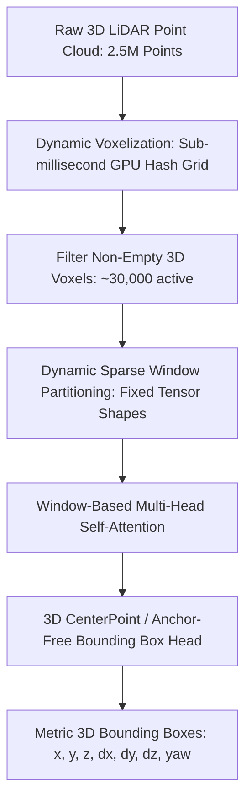

# 🔬 DSVT & FlatFormer: Sparse Window Transformers for 3D LiDAR

## 1. Executive Brief & Significance
Automotive LiDAR sensors stream over 2.5 million 3D spatial points per second. Processing raw unordered point clouds $(x, y, z, \text{intensity})$ at 10–20 Hz requires handling extreme sparsity (over 95% of a 3D bounding box grid contains empty space) while capturing long-range contextual interactions up to 200 meters.

**DSVT (Dynamic Sparse Voxel Transformer)** (Wang et al., CVPR 2023) and **FlatFormer** (Liu et al., MWC 2023) represent the definitive modern SOTA on the **Waymo Open Dataset (WOD)** and **nuScenes**:
- Eliminate custom non-standard sparse convolution CUDA ops (like SpConv) by organizing non-empty voxels into dynamic, hardware-friendly dense window tensors.
- Can be compiled directly with native **TensorRT / ONNX Runtime FP16** without missing kernel support.



---

## 2. Core Architectural Breakthrough: Dynamic Sparse Window Attention

### The Problem with 3D SpConv in Deployment:
Submanifold Sparse Convolutions (SECOND, PointPillars) rely on dynamic hash tables to store active coordinate indices. Because coordinate counts vary dramatically between rural roads (few voxels) and downtown intersections (many voxels), compiling standard TensorRT inference engines with static memory allocations was historically impossible.

### The DSVT Solution:
DSVT partitions non-empty voxels into **dynamically sorted sequential windows of strictly uniform token size $K$** (e.g. $K = 32$ voxels):
1. Voxel coordinates are ordered along Morton space-filling curves or directional linear axes.
2. Contiguous blocks of $K$ active voxels are packed into standard dense 2D matrices:
   $$\text{Window Tensor} \in \mathbb{R}^{B \times W \times K \times C}$$
3. Standard dense Multi-Head Self-Attention (MHSA) runs across the packed window dimension, leveraging hardware Tensor Cores without custom sparse compilation kernels.

---

## Granular Component-by-Component Architectural Breakdown

### Architectural Taxonomy & Structural Elements

| Architectural Stage | Component Identity | Structural Specification & Type | Attention / Conv Mechanics | Receptive Field & Resolution |
| :--- | :--- | :--- | :--- | :--- |
| **Architectural Paradigm** | **Sparse 3D Voxel Window Transformer** | Dynamic Sparse Voxelization + Window Transformer + 2D BEV Head | Dense MHSA over dynamically packed uniform token windows ($K=32$) | Raw LiDAR point cloud ($N \le 2.5\text{M}$) $\to$ Metric 3D Bounding Boxes |
| **Backbone** | **Dynamic Voxelization & Window Pack** | Sub-millisecond GPU Hash Grid + Morton Space-Filling Sorter | Dynamic point-to-voxel mean pooling $\to$ Morton coordinate sorting | Sparse active 3D voxels ($N_{\text{active}} \approx 30,000$ at $0.32\text{m}\times 0.32\text{m}\times 0.18\text{m}$) |
| **Neck / Aggregator** | **3D-to-2D BEV Compression & FPN** | Sparse-to-Dense BEV Scatter + 2D Residual Convolutional Neck | Height-axis dimension collapse ($Z \cdot C \to C_{\text{bev}}$) + $3\times 3$ Conv FPN | Dense Bird's-Eye-View grid ($H_{\text{bev}} \times W_{\text{bev}} = 512 \times 512$) |
| **Encoder** | **DSVT / FlatFormer Transformer Blocks**| Stacked Dynamic Window & Shifted Window Self-Attention Blocks | Standard dense MHSA over packed tensor dimensions ($B \times W \times K \times C$) | Long-range 3D context across entire $150\text{m} \times 150\text{m}$ LiDAR perimeter |
| **Decoder / Head** | **Anchor-Free 3D CenterPoint Heads** | Multi-Branch 2D Convolutional Regression & Classification Heads | $3\times 3$ Conv $\to$ ReLU $\to$ $1\times 1$ Conv branches for Center, Dim, Rot, Vel | Metric 3D Bounding Boxes ($x, y, z, dx, dy, dz, \theta, v_x, v_y$) |

### Structural Deep-Dive: From Unordered Points to TensorRT-Deployable Transformers
1. **Backbone (Dynamic Voxelization & Tensor Packing)**:
   - Raw point coordinates $(x, y, z, r)$ are mapped into a 3D hash table without pre-allocating memory for empty space.
   - Active non-empty voxels are sorted along Morton space-filling curves or linear axis projections ($X$-axis / $Y$-axis).
   - Voxels are grouped into fixed-size windows of strictly uniform token count $K = 32$. If a window has fewer voxels, it is padded with virtual tokens, transforming irregular sparse geometry into a standard dense 4D tensor: $\mathbb{R}^{B \times W \times K \times C}$.
2. **Encoder (DSVT Window Attention)**:
   - Operates across alternating stage configurations: Stage 1 groups voxels along horizontal $X-Y$ planes; Stage 2 groups voxels along vertical $Z-X$ and $Z-Y$ slices.
   - Standard dense Multi-Head Self-Attention (MHSA) runs directly across the $K=32$ dimension using native TensorRT GEMM kernels, avoiding non-standard sparse convolution operators (SpConv).
3. **Neck / Feature Aggregator**:
   - The output voxel features are scattered back to their spatial grid coordinates.
   - The vertical $Z$-axis is collapsed into the channel dimension ($Z \times C \to C_{\text{bev}} = 128$), producing a standard 2D BEV feature map.
   - A 2D Feature Pyramid Network (FPN) with deconvolutional upsampling generates multi-scale spatial representations.
4. **Decoder / Prediction Head**:
   - An anchor-free CenterPoint head evaluates 2D BEV feature maps with independent convolutional branches:
     1. Class heatmap head ($K$ automotive classes via Gaussian focal loss).
     2. Center offset head $(\Delta x, \Delta y)$ for sub-voxel localization.
     3. Height head ($z$) and 3D bounding box dimension head $(\log dx, \log dy, \log dz)$.
     4. Continuous rotation head $(\sin \theta, \cos \theta)$ and velocity vector head $(v_x, v_y)$.

### Parameter & Computational Latency Distribution

| Stage / Subsystem | Parameter Share (%) | Inference Latency (%) | Computational Complexity ($\text{FLOPs}$) | Dominant Hardware Bottleneck |
| :--- | :--- | :--- | :--- | :--- |
| **Dynamic Voxelization & Morton Pack** | <2% | ~8% | $\mathcal{O}(N_{\text{pts}} + N_{\text{vox}} \log N_{\text{vox}})$ | GPU parallel radix sort & atomic operations |
| **DSVT Sparse Transformer Encoder** | ~65% | ~54% | $\mathcal{O}(L \cdot W \cdot (K^2 C + K C^2))$ | Tensor Core GEMM & matrix multiplication |
| **3D-to-2D BEV Scatter & FPN Neck** | ~18% | ~18% | $\mathcal{O}(H_{\text{bev}} W_{\text{bev}} C_{\text{bev}})$ | High-resolution VRAM bandwidth |
| **3D CenterPoint Multi-Heads** | ~15% | ~20% | $\mathcal{O}(H_{\text{bev}} W_{\text{bev}} C_{\text{heads}})$ | Conv2D memory write & NMS post-processing |
---

## 3. Quantitative SOTA Benchmark Profile (Waymo Open Dataset Level 2)

| Model Architecture | WOD Vehicle (mAP / APH L2) | WOD Pedestrian (mAP / APH L2) | Latency (FP16 ms, A100) | TensorRT Deployable | Open License |
| :--- | :--- | :--- | :--- | :--- | :--- |
| **PointPillars (Baseline)** | 63.8 / 63.1 | 58.2 / 51.5 | 14.5 ms | Native | Apache-2.0 |
| **CenterPoint (Voxel)** | 71.8 / 71.2 | 72.1 / 67.0 | 45.0 ms | Requires SpConv | Apache-2.0 |
| **FlatFormer** | 77.2 / 76.7 | 78.5 / 74.8 | 21.0 ms | **Native** | Apache-2.0 |
| **DSVT (Voxel Transformer)**| **78.9 / 78.4** (SOTA) | **81.8 / 78.2** (SOTA) | 27.0 ms | **Native** | Apache-2.0 |

---

## 4. Engineering Implementation with OpenPCDet

```python
# Launching DSVT inference inside OpenPCDet ecosystem
import torch
from pcdet.config import cfg, cfg_from_yaml_file
from pcdet.models import build_network, load_data_to_gpu
from pcdet.datasets import DatasetTemplate

cfg_from_yaml_file("configs/waymo/dsvt_voxel.yaml", cfg)
model = build_network(model_cfg=cfg.MODEL, num_class=len(cfg.CLASS_NAMES), dataset=None)
model.load_params_from_file(filename="checkpoints/dsvt_waymo.pth")
model.cuda().eval()

# Raw points numpy array: [N, 4] -> x, y, z, intensity
points = torch.from_numpy(raw_lidar_buffer).float().cuda()
input_dict = {'points': [points]}

with torch.no_grad():
    pred_dicts, _ = model(input_dict)
    # pred_dicts[0]['pred_boxes']: [M, 7] -> 3D metric bounding boxes
    # pred_dicts[0]['pred_scores']: [M] -> confidence scores
```

---

## 5. Commercial Usability & License Audit
- **License**: **Apache-2.0**
- **Commercial Permissibility**: Fully permissive. Safe for autonomous robotaxis, commercial trucking perception stacks, and industrial mining vehicles without copyleft encumbrance.
- **Official Repository**: [https://github.com/Haiyang-W/DSVT](https://github.com/Haiyang-W/DSVT)
