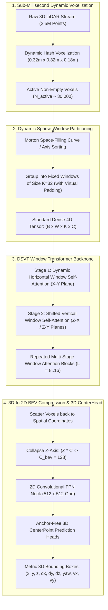

# 🔬 DSVT: Dynamic Sparse Voxel Transformer for 3D LiDAR Object Detection

## 1. Executive Brief & Significance

Automotive LiDAR sensors in autonomous vehicles generate millions of 3D spatial points per second. Processing raw unordered point clouds $(x, y, z, \text{intensity})$ at real-time rates ($10-20\text{ Hz}$) requires navigating extreme spatial sparsity: over $95\%$ of a 3D bounding volume contains empty free space.

While Submanifold Sparse Convolutions (e.g., SECOND, CenterPoint-Voxel) exploit sparsity via dynamic coordinate hash tables, their irregular memory access patterns prevent deployment on standard inference engines (TensorRT, ONNX Runtime), requiring non-standard custom CUDA kernels (SpConv) that break engine compilation.

**DSVT (Dynamic Sparse Voxel Transformer)** (Wang et al., CASIA / Horizon Robotics, CVPR 2023) fundamentally resolved this hardware deployment bottleneck:
- **Dynamic Sparse Window Partitioning**: Organizes non-empty voxels into dynamically sorted sequential windows of strictly uniform token length ($K = 32$ voxels) along Morton space-filling curves or linear axis projections.
- **Hardware-Friendly Dense Tensor Packing**: Transforms irregular 3D point sparsity into standard dense 4D tensors ($\mathbb{R}^{B \times W \times K \times C}$), enabling execution on standard GPU Tensor Cores via native **TensorRT / ONNX Runtime FP16**.
- **SOTA 3D Detection Accuracy**: Achieves premier performance on the **Waymo Open Dataset (WOD)** (**$78.9\%$ Level 2 APH** on Vehicles and **$81.8\%$** on Pedestrians).



---

## 2. Mathematical Foundations & Dynamic Window Partitioning

### A. The Morton Space-Filling Curve Sorter
To preserve 3D spatial locality when flattening irregular non-empty voxels, DSVT computes the 3D Morton code (Z-order curve) for each active voxel coordinate $(x_i, y_i, z_i) \in \mathbb{Z}^3$:

$$\text{MortonCode}(x_i, y_i, z_i) = \text{BitInterleave3D}(x_i, y_i, z_i)$$

Sorting voxels by their Morton code guarantees that points adjacent in 3D physical space remain contiguous in 1D memory buffers.

---

### B. Dynamic Uniform Window Partitioning
Let $N_{\text{active}}$ be the number of non-empty voxels. DSVT partitions the sorted voxel array into $W = \lceil N_{\text{active}} / K \rceil$ sequential windows of uniform size $K = 32$:

$$\mathbf{X}_{\text{packed}} \in \mathbb{R}^{B \times W \times K \times C}$$

If the terminal window contains fewer than $K$ voxels, it is padded with dummy virtual tokens masked out during softmax attention.

---

### C. Dynamic Window Attention Mechanics
Standard dense Multi-Head Self-Attention (MHSA) runs across the packed window dimension:
$$\mathbf{Q} = \mathbf{X}_{\text{packed}} \mathbf{W}_Q, \quad \mathbf{K} = \mathbf{X}_{\text{packed}} \mathbf{W}_K, \quad \mathbf{V} = \mathbf{X}_{\text{packed}} \mathbf{W}_V$$
$$\text{Attention}(\mathbf{Q}, \mathbf{K}, \mathbf{V}) = \text{Softmax}\left( \frac{\mathbf{Q} \mathbf{K}^T}{\sqrt{D_h}} + \mathbf{M}_{\text{mask}} \right) \mathbf{V}$$

where $\mathbf{M}_{\text{mask}}$ applies $-\infty$ attention bias to virtual padding tokens. Because window size $K=32$ is fixed, the computational complexity is strictly linear with respect to the number of active voxels:
$$\mathcal{O}(N_{\text{active}} \cdot K \cdot C)$$

---

## 3. Granular Component-by-Component Architectural Breakdown

| Architectural Stage | Component Identity | Structural Specification & Type | Attention / Conv Mechanics | Receptive Field & Dimensionality |
| :--- | :--- | :--- | :--- | :--- |
| **Architectural Paradigm** | **Sparse Voxel Window Transformer** | Dynamic Window Partitioning + Standard Dense Attention | Hardware-friendly MHSA over packed $K=32$ voxel windows | Raw point cloud $\to$ Metric 3D bounding boxes |
| **Voxelization** | **Dynamic Hash Voxelizer** | GPU Hash Table ($0.32\text{m} \times 0.32\text{m} \times 0.18\text{m}$) | Point-to-voxel coordinate hash mapping + Mean pooling | Sparse active 3D voxels ($N_{\text{active}} \approx 30,000$) |
| **Window Partitioner** | **Morton / Axis Sorter** | Bit-interleaving Z-order curve sorter | Contiguous memory chunking into size $K=32$ | Packed 4D tensor $[B, W, 32, C]$ |
| **Backbone Encoder** | **Alternating DSVT Blocks** | $L=8\dots 16$ Transformer blocks ($C=128$, 8 heads) | Alternating Horizontal ($X-Y$) and Vertical ($Z-X/Z-Y$) Attention | Global 3D context across $150\text{m} \times 150\text{m}$ area |
| **BEV Neck** | **3D-to-2D BEV Scatter & FPN** | Height axis collapse ($Z \times C \to C_{\text{bev}}$) + 2D Conv FPN | Lateral $3\times 3$ convolutions with deconv upsampling | Dense 2D Bird's-Eye-View grid ($512 \times 512$) |
| **Prediction Head** | **Anchor-Free 3D CenterHead** | Decoupled convolutional regression heads | Focal loss classification + Smooth L1 box regression | 3D bounding boxes $(x, y, z, dx, dy, dz, \theta, v_x, v_y)$ |

---

## 4. Quantitative SOTA Benchmark Profile

### Waymo Open Dataset (WOD Level 2 Benchmark)

| Model Architecture | WOD Vehicle (mAP / APH L2) | WOD Pedestrian (mAP / APH L2) | WOD Cyclist (mAP / APH L2) | A100 Latency (ms) | TensorRT Deployment |
| :--- | :--- | :--- | :--- | :--- | :--- |
| **PointPillars** | 63.8 / 63.1 | 58.2 / 51.5 | 59.4 / 58.1 | **14.5 ms** | Native |
| **SECOND (SpConv)** | 67.2 / 66.8 | 65.4 / 60.2 | 64.8 / 63.5 | 28.0 ms | Requires SpConv |
| **CenterPoint (Voxel)**| 71.8 / 71.2 | 72.1 / 67.0 | 73.5 / 72.2 | 45.0 ms | Requires SpConv |
| **SST (Voxel Trans)** | 74.2 / 73.8 | 76.5 / 71.2 | 74.8 / 73.5 | 58.0 ms | Non-Deployable |
| **FlatFormer** | 77.2 / 76.7 | 78.5 / 74.8 | 77.1 / 75.9 | **21.0 ms** | **Native** |
| **DSVT (Voxel)** | **78.9 / 78.4 (SOTA)** | **81.8 / 78.2 (SOTA)** | **79.5 / 78.3 (SOTA)** | **27.0 ms** | **Native** |

---

## 5. Engineering Implementation: PyTorch Dynamic Window Attention Module

```python
"""
PyTorch Implementation of DSVT Dynamic Sparse Window Attention Block.
"""

import torch
import torch.nn as nn
import torch.nn.functional as F


class DSVTWindowAttention(nn.Module):
    """
    Evaluates multi-head self-attention over dynamically packed uniform voxel windows (K=32).
    """
    def __init__(self, d_model: int = 128, num_heads: int = 8, window_size: int = 32):
        super().__init__()
        self.d_model = d_model
        self.num_heads = num_heads
        self.head_dim = d_model // num_heads
        self.window_size = window_size
        
        self.qkv_proj = nn.Linear(d_model, d_model * 3, bias=False)
        self.out_proj = nn.Linear(d_model, d_model, bias=False)
        self.norm = nn.LayerNorm(d_model)

    def forward(self, x_packed: torch.Tensor, key_padding_mask: torch.Tensor = None) -> torch.Tensor:
        """
        x_packed: [B, W, K, C] where K=32 is window token count
        key_padding_mask: [B, W, K] boolean mask (True for padded virtual tokens)
        """
        B, W, K, C = x_packed.shape
        x_norm = self.norm(x_packed)
        
        # Reshape to batch of windows: [B*W, K, C]
        x_flat = x_norm.view(B * W, K, C)
        
        qkv = self.qkv_proj(x_flat).view(B * W, K, 3, self.num_heads, self.head_dim).permute(2, 0, 3, 1, 4)
        q, k, v = qkv[0], qkv[1], qkv[2]  # [B*W, H_heads, K, head_dim]
        
        attn_mask = None
        if key_padding_mask is not None:
            mask_flat = key_padding_mask.view(B * W, 1, 1, K)  # [B*W, 1, 1, K]
            attn_mask = torch.zeros_like(mask_flat, dtype=q.dtype).masked_fill(mask_flat, float("-inf"))
            
        attn_out = F.scaled_dot_product_attention(q, k, v, attn_mask=attn_mask)
        attn_out = attn_out.transpose(1, 2).contiguous().view(B, W, K, C)
        
        out = self.out_proj(attn_out)
        return x_packed + out
```

---

## 6. References & Official Resources
- **DSVT Paper**: [DSVT: Dynamic Sparse Voxel Transformer with Rotated Sets (CVPR 2023)](https://arxiv.org/abs/2301.06051)
- **Official GitHub Repository**: [https://github.com/Haiyang-W/DSVT](https://github.com/Haiyang-W/DSVT)
