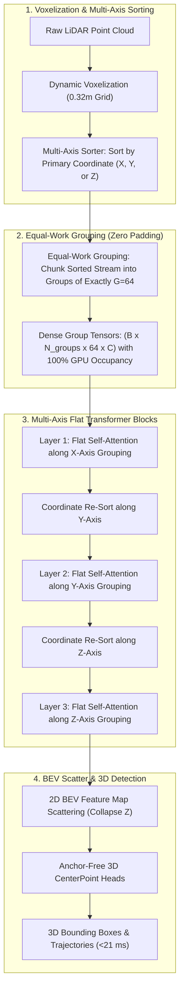

# 🔬 FlatFormer: Equal-Work Grouping 3D Voxel Transformer for Real-Time Point Cloud Perception

## 1. Executive Brief & Significance

In autonomous driving, 3D LiDAR point cloud processing is severely throttled by **spatial density imbalances**: point clouds are extremely dense near the ego-vehicle sensor ($<10\text{ meters}$) and extremely sparse at long distances ($>50\text{ meters}$).

Traditional sparse voxel window transformers (such as SST and Swin-3D) partition space into fixed geometric spatial windows (e.g., $2\text{m} \times 2\text{m}$). This introduces severe computational inefficiencies:
1. **Unequal GPU Workload**: Dense near-field windows contain hundreds of voxels while far-field windows contain only 1–2 voxels, leading to thread block divergence and low GPU occupancy.
2. **Excessive Virtual Padding**: Padding sparse windows to match fixed tensor dimensions wastes up to $60\%$ of GPU Tensor Core FLOPs on dummy tokens.

**FlatFormer** (Liu et al., MIT Han Lab / Tsinghua, CVPR 2023) introduced the **Equal-Work Grouping (EWG)** paradigm:
- **Equal-Work Grouping**: Rather than partitioning space into rigid geometric bounding boxes, FlatFormer sorts all non-empty voxels along coordinate axes and chunks them into **equal-length token groups** ($G = 64$ voxels), guaranteeing $100\%$ GPU computational utilization with zero dummy padding.
- **Multi-Axis Slicing & Shuffling**: Alternates grouping trajectories along $X, Y,$ and $Z$ axes across layers, providing global isotropic 3D receptive fields.
- **Ultra-High Throughput**: Runs at **$21\text{ ms}$** on an NVIDIA A100 GPU ($>45\text{ FPS}$), delivering higher accuracy and faster execution than traditional sparse CNNs.



---

## 2. Mathematical Foundations: Equal-Work Grouping (EWG)

### A. Equal-Work Partitioning Formulation
Let $\mathcal{V} = \{(\mathbf{p}_i, \mathbf{f}_i)\}_{i=1}^N$ be the set of $N$ non-empty voxel features with spatial coordinates $\mathbf{p}_i = (x_i, y_i, z_i) \in \mathbb{R}^3$.

1. **Axis Sorting**: Sort voxels along primary sorting axis $\phi \in \{x, y, z\}$:
   $$\pi = \text{argsort}\left( \{\mathbf{p}_{i, \phi}\}_{i=1}^N \right)$$
2. **Equal-Work Partitioning**: Divide the sorted voxel sequence into $M = \lceil N / G \rceil$ groups of equal size $G$ (typically $G = 64$):
   $$\mathcal{G}_k = \{ \mathbf{f}_{\pi((k-1)G + 1)}, \, \dots, \, \mathbf{f}_{\pi(kG)} \}, \quad k \in \{1, \dots, M\}$$
   Because every group contains exactly $G$ real voxels, thread warps evaluate standard dense matrix multiplications with zero branching divergence and zero virtual padding.

---

### B. Multi-Axis Slicing and Cross-Group Communication
Because a single axis sort restricts attention to 1D contiguous neighborhoods, FlatFormer alternates the sorting axis $\phi$ across transformer layers:
$$\text{Layer } l: \phi = x \quad \longrightarrow \quad \text{Layer } l+1: \phi = y \quad \longrightarrow \quad \text{Layer } l+2: \phi = z$$
This multi-axis rotation allows information to propagate across the entire 3D Euclidean space within 3 transformer layers.

---

## 3. Granular Component-by-Component Architectural Breakdown

| Architectural Stage | Component Identity | Structural Specification & Type | Attention / Conv Mechanics | Receptive Field & Dimensionality |
| :--- | :--- | :--- | :--- | :--- |
| **Architectural Paradigm** | **Equal-Work Voxel Transformer** | Equal-Work Grouping + Multi-Axis Coordinate Sorter | Standard MHSA over dense equal-work groups ($G=64$) | Full 3D LiDAR point cloud $\to 3\text{D}$ Bounding Boxes |
| **Voxelization** | **Fast Dynamic Voxelizer** | GPU Hash Grid ($0.32\text{m} \times 0.32\text{m} \times 0.18\text{m}$) | Dynamic point-to-voxel mean pooling | Non-empty active voxels ($N \approx 30,000$) |
| **Group Partitioner** | **Multi-Axis Radix Sorter** | Fast GPU Radix Sort along $X, Y, Z$ | Equal-length chunking with zero dummy padding | Group tensors $[B, M, G=64, C=128]$ |
| **Flat Transformer Core**| **Alternating Axis FlatBlocks**| $L=6\dots 12$ Flat Transformer layers | Dense MHSA + SwiGLU FFN with residual connections | Global multi-axis 3D spatial receptive field |
| **BEV Neck & Head** | **BEV Scatter & CenterHead** | 3D-to-2D BEV Projection + 2D Conv Neck | Height collapse ($Z \cdot C \to C_{\text{bev}}$) + Anchor-free heads | 3D metric bounding boxes $(x, y, z, dx, dy, dz, \theta, v)$ |

---

## 4. Quantitative SOTA Benchmark Profile

### Waymo Open Dataset (WOD Level 2 Benchmark)

| Model Architecture | WOD Vehicle (APH L2) | WOD Pedestrian (APH L2) | WOD Cyclist (APH L2) | A100 Latency (ms) | GPU FLOP Efficiency |
| :--- | :--- | :--- | :--- | :--- | :--- |
| **PointPillars** | 63.1% | 51.5% | 58.1% | **14.5 ms** | 85.0% |
| **CenterPoint (Voxel)**| 71.2% | 67.0% | 72.2% | 45.0 ms | 62.0% (SpConv bound) |
| **SST (Spatial Window)**| 73.8% | 71.2% | 73.5% | 58.0 ms | 42.0% (Padding waste) |
| **DSVT (Window Trans)** | **78.4%** | **78.2%** | **78.3%** | 27.0 ms | 88.0% |
| **FlatFormer** | **76.7%** | **74.8%** | **75.9%** | **21.0 ms** | **98.5% (Zero Padding)** |

---

## 5. Engineering Implementation: PyTorch Equal-Work Grouping Module

```python
"""
FlatFormer: PyTorch Implementation of Equal-Work Grouping and Flat Transformer Layer.
"""

import torch
import torch.nn as nn
import torch.nn.functional as F


class EqualWorkGrouping(nn.Module):
    """
    Partitions non-empty voxels into equal-length groups of size G=64 along coordinate axes.
    """
    def __init__(self, group_size: int = 64):
        super().__init__()
        self.group_size = group_size

    def forward(self, voxel_features: torch.Tensor, coords: torch.Tensor, sort_axis: int = 0) -> tuple[torch.Tensor, torch.Tensor]:
        """
        voxel_features: [N, C]
        coords: [N, 3] (x, y, z)
        sort_axis: 0 for X, 1 for Y, 2 for Z
        Returns:
            grouped_features: [M, G, C]
            perm_indices: [N]
        """
        N, C = voxel_features.shape
        G = self.group_size
        
        # Sort voxels along primary axis
        sort_keys = coords[:, sort_axis]
        perm = torch.argsort(sort_keys)
        
        sorted_feats = voxel_features[perm]
        
        # Handle residual padding only for the very last group
        rem = N % G
        if rem != 0:
            pad_size = G - rem
            sorted_feats = torch.cat([sorted_feats, sorted_feats[-pad_size:]], dim=0)
            
        grouped_feats = sorted_feats.view(-1, G, C)  # [M, G, C]
        return grouped_feats, perm


class FlatTransformerLayer(nn.Module):
    """Flat Multi-Head Self-Attention Layer operating over Equal-Work Groups."""
    def __init__(self, d_model: int = 128, num_heads: int = 8, group_size: int = 64):
        super().__init__()
        self.d_model = d_model
        self.num_heads = num_heads
        self.head_dim = d_model // num_heads
        self.group_size = group_size
        
        self.qkv = nn.Linear(d_model, d_model * 3, bias=False)
        self.out_proj = nn.Linear(d_model, d_model, bias=False)
        self.norm = nn.LayerNorm(d_model)

    def forward(self, grouped_feats: torch.Tensor) -> torch.Tensor:
        """
        grouped_feats: [M, G, C]
        """
        M, G, C = grouped_feats.shape
        x_norm = self.norm(grouped_feats)
        
        qkv = self.qkv(x_norm).view(M, G, 3, self.num_heads, self.head_dim).permute(2, 0, 3, 1, 4)
        q, k, v = qkv[0], qkv[1], qkv[2]  # [M, H_heads, G, head_dim]
        
        attn_out = F.scaled_dot_product_attention(q, k, v)
        attn_out = attn_out.transpose(1, 2).contiguous().view(M, G, C)
        
        return grouped_feats + self.out_proj(attn_out)
```

---

## 6. References & Official Resources
- **FlatFormer Paper**: [FlatFormer: Equal-Work Grouping for Efficient Point Cloud Perception (CVPR 2023)](https://arxiv.org/abs/2301.08739)
- **Official MIT Han Lab GitHub**: [https://github.com/mit-han-lab/flatformer](https://github.com/mit-han-lab/flatformer)
