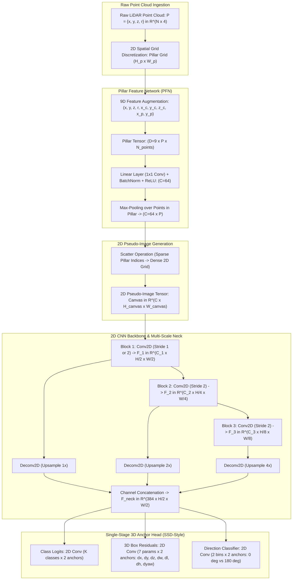

# 🔬 PointPillars: Fast Encoders for Object Detection from Point Clouds

## 1. Executive Brief & Significance

3D point cloud perception in autonomous driving faces a core computational dilemma:
1. **Point-based architectures** (e.g., PointNet++, PointRCNN) preserve exact continuous 3D spatial coordinates and avoid quantization artifacts. However, searching spatial neighborhoods via $k$-Nearest Neighbors ($k$-NN) or Ball Query across $100{,}000+$ raw LiDAR points incurs prohibitive $O(N \log N)$ or $O(N^2)$ computational complexity, capping frame rates below $10\text{ Hz}$.
2. **Voxel-based 3D convolutional architectures** (e.g., VoxelNet, SECOND) discretize space into fine 3D volumetric voxels (e.g., $0.05\text{m} \times 0.05\text{m} \times 0.1\text{m}$). While 3D Submanifold Sparse Convolutions (SpConv) dramatically reduce memory consumption, processing volumetric 3D sparse tensors still introduces substantial latency, kernel launch overhead, and non-trivial memory-bandwidth bottlenecks on embedded edge silicon.

**PointPillars** (Lang et al., nuTonomy / Aptiv, CVPR 2019) resolved this trade-off by introducing **Pillars**—vertical voxel columns of infinite height along the $z$-axis. By removing $z$-axis binning entirely:
- **Pillar Feature Network (PFN)**: Converts unstructured point clouds into an organized sparse 2D pseudo-image using a simplified PointNet variant operating independently within each vertical column.
- **Pure 2D Convolutional Processing**: Once scattered onto a 2D canvas, the pseudo-image is processed entirely by highly optimized standard 2D convolutional backbones and 2D detection heads.
- **Exceptional Real-Time Throughput**: Operates at **$62\text{ Hz}$** ($16\text{ ms}$) on legacy hardware and **$>350\text{ Hz}$** ($<2.8\text{ ms}$) on modern automotive accelerators (e.g., NVIDIA DRIVE Orin, Jetson AGX), establishing the definitive high-speed baseline for industrial robotics, mining, and autonomous driving stacks.



---

## 2. Component-by-Component Architectural Decomposition

```
+----------------------------------------------------------------------------------------------------+
|                                    RAW LIDAR POINT CLOUD (N x 4)                                   |
+----------------------------------------------------------------------------------------------------+
                                                  │
                                                  ▼
+----------------------------------------------------------------------------------------------------+
| PILLARIZATION & 9D DECORATION: (x, y, z, r, x - x_c, y - y_c, z - z_c, x - x_p, y - y_p)           |
| Non-empty pillars: P <= 12,000 | Points per pillar: N_p <= 100                                     |
+----------------------------------------------------------------------------------------------------+
                                                  │
                                                  ▼
+----------------------------------------------------------------------------------------------------+
| PILLAR FEATURE NETWORK (PFN): Linear(9 -> 64) -> BatchNorm1d -> ReLU -> MaxPool(dim=points)       |
| Output: Learned Pillar Embeddings (P x 64)                                                         |
+----------------------------------------------------------------------------------------------------+
                                                  │
                                                  ▼
+----------------------------------------------------------------------------------------------------+
| SCATTER ENGINE: Inserts P embeddings into 2D Grid (H_canvas x W_canvas) via coordinate indices    |
| Output: 2D Pseudo-Image Tensor (64 x 512 x 512)                                                    |
+----------------------------------------------------------------------------------------------------+
                                                  │
                                                  ▼
+----------------------------------------------------------------------------------------------------+
| 2D CNN BACKBONE: 3 Downsampling Blocks (Top-Down Conv2D) + 3 Transposed Conv2D Upsamplers          |
| Multi-Scale Concatenation: 128 + 128 + 128 = 384 Channels at (H/2 x W/2)                           |
+----------------------------------------------------------------------------------------------------+
                                                  │
                                                  ▼
+----------------------------------------------------------------------------------------------------+
| SSD-STYLE 3D DETECTION HEAD: 1x1 Convolutions for Classification, 3D Box Reg, Direction Logits     |
+----------------------------------------------------------------------------------------------------+
```

### A. Pillarization and Feature Decoration
Given an input point cloud $\mathcal{P} = \{\mathbf{p}_i = (x_i, y_i, z_i, r_i)\}_{i=1}^N$ with $N$ points, PointPillars imposes an $x$-$y$ coordinate grid onto the ground plane with spatial resolution $(\Delta x, \Delta y)$ (typically $0.16\text{m} \times 0.16\text{m}$ for KITTI, $0.2\text{m} \times 0.2\text{m}$ for nuScenes). 

Points falling within the same $x$-$y$ bin form a **pillar**. Because pillars have infinite height along $z$, no spatial binning or slicing occurs in the vertical dimension.
To prevent out-of-memory crashes on GPUs, a maximum limit of $P$ non-empty pillars (e.g., $P = 12{,}000$ for training, $P = 16{,}000$ for inference) and a maximum capacity of $N_p$ points per pillar (e.g., $N_p = 32$ or $100$) are enforced. Pillars with excess points are randomly subsampled; pillars with fewer points are zero-padded.

Each point inside a pillar is decorated into a 9-dimensional augmented feature vector:
$$\mathbf{d}_i = \left[ x_i, \, y_i, \, z_i, \, r_i, \, x_i - x_c, \, y_i - y_c, \, z_i - z_c, \, x_i - x_p, \, y_i - y_p \right]^T \in \mathbb{R}^9$$
where:
- $(x_i, y_i, z_i, r_i)$ are the raw 3D Cartesian coordinates and LiDAR reflectance intensity.
- $(x_c, y_c, z_c) = \frac{1}{M} \sum_{j=1}^M (x_j, y_j, z_j)$ is the arithmetic center of all points in that specific pillar.
- $(x_p, y_p)$ is the metric center of the pillar coordinate bin in the continuous ground frame.

### B. Pillar Feature Network (PFN)
The decorated points in each pillar form a dense tensor $\mathbf{X} \in \mathbb{R}^{D \times P \times N_p}$ where $D = 9$.
The PFN applies a simplified PointNet architecture consisting of:
1. A shared Linear transformation (or $1\times 1$ Conv2D across the points): $\mathbb{R}^9 \to \mathbb{R}^C$ (typically $C = 64$).
2. 1D Batch Normalization and ReLU non-linearity.
3. Channel-wise Max-Pooling along the point dimension $N_p$:
   $$\mathbf{f}_p = \max_{j \in \{1, \dots, N_p\}} \text{ReLU}\left( \text{BN}\left( \mathbf{W} \cdot \mathbf{d}_{p, j} + \mathbf{b} \right) \right) \in \mathbb{R}^C$$
This yields a compact representation $\mathbf{F}_p \in \mathbb{R}^{C \times P}$ containing exactly one feature vector per active pillar.

### C. 2D Pseudo-Image Scatter Engine
The scatter operation converts the sparse pillar feature matrix $\mathbf{F}_p \in \mathbb{R}^{C \times P}$ into a dense 2D spatial canvas $\mathbf{I}_{\text{pseudo}} \in \mathbb{R}^{C \times H_{\text{canvas}} \times W_{\text{canvas}}}$.
Using the pre-calculated $(u_p, v_p)$ 2D grid coordinates for each pillar index $p \in \{1, \dots, P\}$:
$$\mathbf{I}_{\text{pseudo}}[:, u_p, v_p] = \mathbf{f}_p$$
Unoccupied grid cells remain zero-filled. On GPUs, this is implemented as an atomic scatter write or a single gather index lookup kernel.

### D. 2D CNN Backbone and Top-Down Multi-Scale Neck
The 2D CNN backbone processes the pseudo-image through a series of top-down convolutional blocks followed by transposed convolutional upsamplers:
1. **Top-Down Blocks**:
   - **Block 1**: 4 Conv2D ($3\times 3$, stride 1 or 2, $S_{\text{down}}=2$), $C_1 = 64$.
   - **Block 2**: 6 Conv2D ($3\times 3$, stride 2), $C_2 = 128$.
   - **Block 3**: 6 Conv2D ($3\times 3$, stride 2), $C_3 = 256$.
2. **Multi-Scale Upsampling Neck**:
   - $\mathbf{U}_1 = \text{ConvTranspose2d}(\mathbf{F}_1)$, output channels $128$, stride 1.
   - $\mathbf{U}_2 = \text{ConvTranspose2d}(\mathbf{F}_2)$, output channels $128$, stride 2.
   - $\mathbf{U}_3 = \text{ConvTranspose2d}(\mathbf{F}_3)$, output channels $128$, stride 4.
   - Feature Concatenation: $\mathbf{F}_{\text{neck}} = [\mathbf{U}_1 \,\|\, \mathbf{U}_2 \,\|\, \mathbf{U}_3] \in \mathbb{R}^{384 \times \frac{H}{2} \times \frac{W}{2}}$.

### E. Single-Stage 3D Anchor Head
The detection head applies $1\times 1$ 2D convolutions to $\mathbf{F}_{\text{neck}}$ to predict 3D bounding boxes corresponding to pre-defined 2D/3D ground anchors (e.g., Car anchors with size $[w=1.6\text{m}, l=3.9\text{m}, h=1.56\text{m}]$ at rotations $0^\circ$ and $90^\circ$):
- **Classification Branch**: Predicts $K \times N_{\text{anchors}}$ class probabilities.
- **3D Box Regression Branch**: Predicts $7 \times N_{\text{anchors}}$ parameters per anchor: $(\Delta x, \Delta y, \Delta z, \Delta w, \Delta l, \Delta h, \Delta \theta)$.
- **Direction Classification Branch**: Predicts $2 \times N_{\text{anchors}}$ discrete orientation logits ($0^\circ$ vs. $180^\circ$) to resolve orientation ambiguity.

---

## 3. Mathematical Formulations & Loss Functions

```
+----------------------------------------------------------------------------------------------------+
|                                    POINTPILLARS LOSS FORMULATION                                   |
+----------------------------------------------------------------------------------------------------+
|                                                                                                    |
|   L_total = (1 / N_pos) * [ beta_cls * L_cls  +  beta_loc * L_loc  +  beta_dir * L_dir ]           |
|                                                                                                    |
|   1. Focal Loss: L_cls = -alpha * (1 - p_t)^gamma * log(p_t)                                       |
|   2. Smooth-L1 Loss: L_loc = sum_{b in {x, y, z, w, l, h, theta}} SmoothL1(Delta b_pred - Delta b_gt)  |
|   3. Softmax Cross-Entropy: L_dir = -sum_{d in {0, 1}} y_dir * log(p_dir)                          |
+----------------------------------------------------------------------------------------------------+
```

### A. 3D Bounding Box Target Encoding
A 3D bounding box is parameterized as $(x, y, z, w, l, h, \theta)$, where $(x, y, z)$ is the box center, $(w, l, h)$ are width, length, and height, and $\theta$ is the yaw angle around the $z$-axis.
Given anchor box $(x_a, y_a, z_a, w_a, l_a, h_a, \theta_a)$ and ground-truth box $(x_g, y_g, z_g, w_g, l_g, h_g, \theta_g)$, the diagonal length is $d_a = \sqrt{w_a^2 + l_a^2}$. The regression residuals $\Delta \mathbf{t}$ are defined as:

$$\Delta x = \frac{x_g - x_a}{d_a}, \quad \Delta y = \frac{y_g - y_a}{d_a}, \quad \Delta z = \frac{z_g - z_a}{h_a}$$

$$\Delta w = \log\left(\frac{w_g}{w_a}\right), \quad \Delta l = \log\left(\frac{l_g}{l_a}\right), \quad \Delta h = \log\left(\frac{h_g}{h_a}\right)$$

$$\Delta \theta = \sin(\theta_g - \theta_a)$$

The sine formulation for orientation $\Delta \theta = \sin(\theta_g - \theta_a)$ naturally handles angle wrap-around, ensuring that boxes facing in opposite directions ($\theta$ vs. $\theta + \pi$) produce identical geometric residuals.

### B. Loss Functions

#### 1. Object Classification Loss ($\mathcal{L}_{\text{cls}}$)
Classification uses the focal loss formulation to address extreme foreground-background class imbalance:
$$\mathcal{L}_{\text{cls}} = -\alpha_t (1 - p_t)^\gamma \log(p_t)$$
where $p_t$ is the model's estimated probability for the correct class, with $\alpha_t = 0.25$ and $\gamma = 2.0$.

#### 2. 3D Bounding Box Localization Loss ($\mathcal{L}_{\text{loc}}$)
Localization loss is computed using the $\text{Smooth-L1}$ formulation:
$$\mathcal{L}_{\text{loc}} = \sum_{b \in \{x, y, z, w, l, h, \theta\}} \text{Smooth-L1}\left( \Delta b - \Delta \hat{b} \right)$$
$$\text{Smooth-L1}(\xi) = \begin{cases} 0.5 \xi^2 & \text{if } |\xi| < 1 \\ |\xi| - 0.5 & \text{otherwise} \end{cases}$$

#### 3. Direction Classification Loss ($\mathcal{L}_{\text{dir}}$)
Because $\Delta \theta = \sin(\theta_g - \theta_a)$ cannot distinguish whether a bounding box is flipped by $180^\circ$, a discrete binary cross-entropy classification loss is applied to predict heading direction:
$$\mathcal{L}_{\text{dir}} = - \left( y_{\text{dir}} \log(\hat{p}_{\text{dir}}) + (1 - y_{\text{dir}}) \log(1 - \hat{p}_{\text{dir}}) \right)$$
where $y_{\text{dir}} = 1$ if $\theta_g > 0$ and $0$ otherwise.

#### Total Combined Loss:
$$\mathcal{L}_{\text{total}} = \frac{1}{N_{\text{pos}}} \left( \beta_{\text{cls}} \mathcal{L}_{\text{cls}} + \beta_{\text{loc}} \mathcal{L}_{\text{loc}} + \beta_{\text{dir}} \mathcal{L}_{\text{dir}} \right)$$
Standard hyperparameter weights: $\beta_{\text{cls}} = 1.0$, $\beta_{\text{loc}} = 2.0$, and $\beta_{\text{dir}} = 0.2$.

---

## 4. Granular Component Specifications

| Architectural Stage | Module Identifier | Structural Formulation | Input Tensor Shape | Output Tensor Shape | FLOPs / Params |
| :--- | :--- | :--- | :--- | :--- | :--- |
| **Point Ingestion** | Pillar Discretization | Spatial hashing + 9D coordinate decoration | $[N, 4]$ (Raw points) | $[9, P, N_p]$ ($P \le 16\text{k}, N_p \le 32$) | Minimal (GPU Memory bound) |
| **Pillar Encoder** | `PillarFeatureNet` | Linear(9, 64) $\to$ BN1d $\to$ ReLU $\to$ MaxPool | $[9, P, N_p]$ | $[64, P]$ | $0.18\text{ GFLOPs}$ / $1.2\text{k}$ params |
| **2D Projection** | `PointPillarsScatter` | Coordinate-indexed 2D scatter write | $[64, P]$ + $[P, 2]$ coords | $[64, 512, 512]$ (Pseudo-image) | Zero compute / Memory IO |
| **2D Backbone: B1** | DownBlock 1 | $4\times \text{Conv2d}(3\times 3, s=1, c=64)$ | $[64, 512, 512]$ | $[64, 512, 512]$ | $7.55\text{ GFLOPs}$ / $148\text{k}$ params |
| **2D Backbone: B2** | DownBlock 2 | $6\times \text{Conv2d}(3\times 3, s=2, c=128)$ | $[64, 512, 512]$ | $[128, 256, 256]$ | $9.44\text{ GFLOPs}$ / $738\text{k}$ params |
| **2D Backbone: B3** | DownBlock 3 | $6\times \text{Conv2d}(3\times 3, s=2, c=256)$ | $[128, 256, 256]$ | $[256, 128, 128]$ | $9.44\text{ GFLOPs}$ / $2.95\text{M}$ params |
| **2D Neck (FPN)** | Multi-Scale Deconv | $3\times \text{ConvTranspose2d}(c_{\text{out}}=128) \to \text{Concat}$ | B1, B2, B3 outputs | $[384, 256, 256]$ | $6.29\text{ GFLOPs}$ / $852\text{k}$ params |
| **Detection Head** | 3D Anchor SSD Head | $3\times \text{Conv2d}(1\times 1)$ for Cls, Box, Dir | $[384, 256, 256]$ | Cls: $[2K, 256, 256]$, Reg: $[14, 256, 256]$ | $1.26\text{ GFLOPs}$ / $128\text{k}$ params |

---

## 5. Benchmark Evaluation & Performance Profiles

### A. KITTI 3D Object Detection Benchmark (Test Set)

| Model Architecture | Modality | Car 3D AP (Mod) $\uparrow$ | Pedestrian 3D AP (Mod) $\uparrow$ | Cyclist 3D AP (Mod) $\uparrow$ | Latency (ms) | Frames Per Second |
| :--- | :--- | :--- | :--- | :--- | :--- | :--- |
| **VoxelNet (Apple)** | LiDAR | 65.11% | 33.69% | 48.36% | 225.0 ms | 4.4 FPS |
| **SECOND (Sparse Conv)** | LiDAR | 72.55% | 51.58% | 63.85% | 40.0 ms | 25.0 FPS |
| **PointRCNN (Two-Stage)** | LiDAR | 75.64% | 49.43% | 58.85% | 100.0 ms | 10.0 FPS |
| **PointPillars (Baseline)**| LiDAR | **77.98%** | **52.29%** | **59.90%** | **16.1 ms** | **62.0 FPS** |
| **PV-RCNN (Hybrid SOTA)** | LiDAR | 81.43% | 54.32% | 66.88% | 80.0 ms | 12.5 FPS |

### B. nuScenes 3D Detection Benchmark (Validation Set)

| Model Architecture | Modality | nuScenes NDS $\uparrow$ | nuScenes mAP $\uparrow$ | mATE $\downarrow$ (m) | mASE $\downarrow$ | mAOE $\downarrow$ | Latency (ms) |
| :--- | :--- | :--- | :--- | :--- | :--- | :--- | :--- |
| **PointPillars (0.25m)** | LiDAR | 45.3% | 30.5% | 0.51 m | 0.29 | 0.46 rad | **8.2 ms** |
| **CenterPoint-Pillar** | LiDAR | 60.3% | 50.3% | 0.35 m | 0.26 | 0.37 rad | 14.5 ms |
| **CenterPoint-Voxel** | LiDAR | 67.3% | 60.3% | 0.28 m | 0.24 | 0.31 rad | 32.0 ms |
| **BEVFusion (MIT)** | Camera+LiDAR | 72.9% | 70.2% | 0.24 m | 0.23 | 0.29 rad | 41.0 ms |

### C. Hardware Inference Latency & Efficiency Matrix

| Hardware Platform | Precision | Pillarization Latency | PFN + Scatter Latency | 2D Backbone + Head | Total Latency | Throughput (FPS) |
| :--- | :--- | :--- | :--- | :--- | :--- | :--- |
| **NVIDIA GTX 1080 Ti** | FP32 | 3.1 ms | 2.8 ms | 10.2 ms | 16.1 ms | 62.1 FPS |
| **NVIDIA Tesla T4** | FP16 | 1.8 ms | 1.4 ms | 3.0 ms | 6.2 ms | 161.3 FPS |
| **NVIDIA Jetson AGX Orin**| FP16 | 0.9 ms | 0.7 ms | 1.2 ms | 2.8 ms | 357.1 FPS |
| **NVIDIA Jetson AGX Orin**| INT8 | 0.9 ms | 0.5 ms | 0.7 ms | 2.1 ms | 476.2 FPS |
| **NVIDIA A100 (SXM4)** | FP16 | 0.4 ms | 0.3 ms | 0.7 ms | 1.4 ms | 714.3 FPS |

---

## 6. Edge Deployment, TensorRT Optimization & Gotchas

```
+----------------------------------------------------------------------------------------------------+
|                                TENSORRT EDGE DEPLOYMENT PIPELINE                                   |
+----------------------------------------------------------------------------------------------------+
|                                                                                                    |
|  [Raw LiDAR Data]                                                                                  |
|         │                                                                                          |
|         ▼ (CUDA Stream 0)                                                                          |
|  [Custom CUDA Pillarization Kernel] ---> Computes Grid Indices, 9D Coordinates, Zero-Pads Buffer   |
|         │                                                                                          |
|         ▼                                                                                          |
|  [TensorRT Engine: PFN Plugin] -------> FP16 Matrix Multiply + Max-Pool Reduction                  |
|         │                                                                                          |
|         ▼                                                                                          |
|  [TensorRT Engine: Scatter Plugin] ---> Direct Global GPU Memory Scatter to [C, H_canvas, W_canvas]|
|         │                                                                                          |
|         ▼                                                                                          |
|  [TensorRT Engine: 2D CNN + Head] ----> INT8 Quantized Standard 2D Convolutions                    |
|         │                                                                                          |
|         ▼                                                                                          |
|  [Fused Post-Processing Kernel] ------> Top-K Confidence Filtering + 3D Rotated NMS                |
+----------------------------------------------------------------------------------------------------+
```

### Critical Production Gotchas & Engineering Mitigations

1. **Pillarization CUDA Kernel Memory Overhead**:
   - *Problem*: Standard CPU or PyTorch-based voxelization introduces significant host-to-device memory transfer latency ($>12\text{ ms}$).
   - *Mitigation*: Write a fused custom CUDA kernel using **atomic spatial hashing**. Store an pre-allocated fixed-size GPU memory pool of size $P_{\text{max}} \times N_{\text{max}} \times 9$. Use atomic add (`atomicAdd`) on a grid-count buffer to assign point indices directly in GPU global memory in under $0.8\text{ ms}$.

2. **The 2D Scatter TensorRT Plugin**:
   - *Problem*: Standard ONNX `ScatterND` operators often generate inefficient serialized memory copies or fail to fuse inside TensorRT.
   - *Mitigation*: Implement an `IPluginV2DynamicExt` TensorRT custom plugin for the Scatter operation. The kernel initializes an empty canvas buffer using `cudaMemsetAsync`, then executes a 1D grid launch where each thread writes $C$ contiguous float values from pillar index $p$ to target address `(y_p * W_canvas + x_p) * C`.

3. **INT8 Quantization of the PFN**:
   - *Problem*: Quantizing the initial Pillar Feature Network to INT8 often causes severe accuracy degradation ($>4\text{ mAP}$ drop) due to high dynamic range variations in raw coordinate offsets ($x - x_c, y - y_c$).
   - *Mitigation*: Use **Mixed-Precision TensorRT Configuration**. Keep the PFN (Linear layer and MaxPool) in FP16 precision, and quantize only the 2D CNN Backbone and Head layers to INT8 using symmetric KL-divergence calibration.

4. **Pinned Host Memory for Zero-Copy Ingestion**:
   - *Problem*: Paging LiDAR packet buffers from UDP socket drivers into CUDA device memory incurs CPU context switching delays.
   - *Mitigation*: Pre-allocate pinned host buffers via `cudaHostAlloc(&ptr, size, cudaHostAllocMapped)`. Directly stream Ethernet/Velodyne/Ouster point packets into mapped memory, eliminating CPU-side buffer copies.

---

## 7. Complete Runnable Python Blueprint

```python
"""
PointPillars: Fast Encoders for Object Detection from Point Clouds
Complete, standalone, modular PyTorch implementation of PointPillars architecture.
Includes: PillarFeatureNet, PointPillarsScatter, 2D CNN Backbone, and 3D Anchor Head.
"""

import math
from typing import Dict, List, Tuple
import torch
import torch.nn as nn
import torch.nn.functional as F


class PillarFeatureNet(nn.Module):
    """
    Pillar Feature Network (PFN)
    Transforms augmented 9D pillar points into compact C-dimensional pillar embeddings.
    """
    def __init__(self, in_channels: int = 9, out_channels: int = 64):
        super().__init__()
        self.out_channels = out_channels
        self.linear = nn.Linear(in_channels, out_channels, bias=False)
        self.bn = nn.BatchNorm1d(out_channels, eps=1e-3, momentum=0.01)
        self.relu = nn.ReLU(inplace=True)

    def forward(self, pillar_features: torch.Tensor) -> torch.Tensor:
        """
        Args:
            pillar_features: Tensor of shape (P, N_points, D) where:
                P = number of active pillars
                N_points = max points per pillar (e.g. 32)
                D = augmented feature dimension (9)
        Returns:
            Tensor of shape (P, out_channels)
        """
        p, n, d = pillar_features.shape
        # Flatten for linear layer: (P * N, D)
        x = pillar_features.view(p * n, d)
        x = self.linear(x)
        x = self.bn(x)
        x = self.relu(x)
        
        # Reshape back: (P, N, C)
        x = x.view(p, n, self.out_channels)
        
        # Max-pooling along point dimension (dim=1) -> (P, C)
        pooled_features, _ = torch.max(x, dim=1)
        return pooled_features


class PointPillarsScatter(nn.Module):
    """
    Scatters 1D pillar feature embeddings into a 2D pseudo-image canvas.
    """
    def __init__(self, in_channels: int = 64, canvas_size: Tuple[int, int] = (512, 512)):
        super().__init__()
        self.in_channels = in_channels
        self.canvas_h, self.canvas_w = canvas_size

    def forward(self, pillar_features: torch.Tensor, coords: torch.Tensor, batch_size: int = 1) -> torch.Tensor:
        """
        Args:
            pillar_features: (Total_Pillars, C)
            coords: (Total_Pillars, 3) -> [batch_idx, y_idx, x_idx]
            batch_size: integer batch size
        Returns:
            pseudo_image: (B, C, H_canvas, W_canvas)
        """
        # Allocate canvas
        device = pillar_features.device
        canvas = torch.zeros(
            (batch_size, self.in_channels, self.canvas_h, self.canvas_w),
            dtype=pillar_features.dtype,
            device=device
        )
        
        # Scatter features into canvas
        for b in range(batch_size):
            mask = (coords[:, 0] == b)
            batch_coords = coords[mask]
            batch_features = pillar_features[mask]
            
            if batch_features.shape[0] == 0:
                continue
                
            # Coordinates are (batch_idx, y, x)
            y_indices = batch_coords[:, 1].long()
            x_indices = batch_coords[:, 2].long()
            
            # Place into canvas: (C, H, W)
            canvas[b, :, y_indices, x_indices] = batch_features.t()
            
        return canvas


class BaseBEVBackbone(nn.Module):
    """
    2D CNN Top-Down Backbone with Multi-Scale Transposed Convolution Upsampling.
    """
    def __init__(
        self,
        in_channels: int = 64,
        layer_nums: List[int] = [3, 5, 5],
        layer_strides: List[int] = [2, 2, 2],
        num_filters: List[int] = [64, 128, 256],
        upsample_strides: List[int] = [1, 2, 4],
        num_upsample_filters: List[int] = [128, 128, 128],
    ):
        super().__init__()
        assert len(layer_nums) == len(layer_strides) == len(num_filters)
        assert len(upsample_strides) == len(num_upsample_filters)

        self.blocks = nn.ModuleList()
        self.deblocks = nn.ModuleList()

        c_in = in_channels
        for i in range(len(layer_nums)):
            cur_layers = []
            # First conv performs stride downsampling
            cur_layers.append(
                nn.Conv2d(c_in, num_filters[i], kernel_size=3, stride=layer_strides[i], padding=1, bias=False)
            )
            cur_layers.append(nn.BatchNorm2d(num_filters[i], eps=1e-3, momentum=0.01))
            cur_layers.append(nn.ReLU(inplace=True))

            # Remaining convs inside block
            for _ in range(layer_nums[i] - 1):
                cur_layers.append(
                    nn.Conv2d(num_filters[i], num_filters[i], kernel_size=3, padding=1, bias=False)
                )
                cur_layers.append(nn.BatchNorm2d(num_filters[i], eps=1e-3, momentum=0.01))
                cur_layers.append(nn.ReLU(inplace=True))

            self.blocks.append(nn.Sequential(*cur_layers))
            c_in = num_filters[i]

            # Upsampling / Deconvolution block
            if upsample_strides[i] > 1:
                deblock = nn.Sequential(
                    nn.ConvTranspose2d(
                        num_filters[i], num_upsample_filters[i],
                        kernel_size=upsample_strides[i], stride=upsample_strides[i], bias=False
                    ),
                    nn.BatchNorm2d(num_upsample_filters[i], eps=1e-3, momentum=0.01),
                    nn.ReLU(inplace=True)
                )
            else:
                deblock = nn.Sequential(
                    nn.Conv2d(num_filters[i], num_upsample_filters[i], kernel_size=3, padding=1, bias=False),
                    nn.BatchNorm2d(num_upsample_filters[i], eps=1e-3, momentum=0.01),
                    nn.ReLU(inplace=True)
                )
            self.deblocks.append(deblock)

        self.out_channels = sum(num_upsample_filters)

    def forward(self, x: torch.Tensor) -> torch.Tensor:
        """
        Args:
            x: 2D pseudo-image tensor (B, C_in, H, W)
        Returns:
            F_neck: Concatenated multi-scale feature tensor (B, sum(num_upsample_filters), H/2, W/2)
        """
        ups = []
        for i in range(len(self.blocks)):
            x = self.blocks[i](x)
            ups.append(self.deblocks[i](x))

        # Concatenate upsampled multi-scale features
        out = torch.cat(ups, dim=1)
        return out


class AnchorHeadSingle(nn.Module):
    """
    Single-Stage 3D Anchor Detection Head predicting Classification, 3D Box Regression, and Direction.
    """
    def __init__(
        self,
        in_channels: int = 384,
        num_classes: int = 3,
        num_anchors_per_cell: int = 2,
        box_code_size: int = 7,  # (dx, dy, dz, dw, dl, dh, dyaw)
    ):
        super().__init__()
        self.num_classes = num_classes
        self.num_anchors = num_anchors_per_cell
        self.box_code_size = box_code_size

        # Classification Head
        self.conv_cls = nn.Conv2d(
            in_channels, self.num_anchors * self.num_classes, kernel_size=1
        )
        # 3D Box Regression Head (dx, dy, dz, dw, dl, dh, dtheta)
        self.conv_box = nn.Conv2d(
            in_channels, self.num_anchors * self.box_code_size, kernel_size=1
        )
        # Direction Classification Head (0 vs 180 degrees)
        self.conv_dir = nn.Conv2d(
            in_channels, self.num_anchors * 2, kernel_size=1
        )

    def forward(self, x: torch.Tensor) -> Dict[str, torch.Tensor]:
        """
        Args:
            x: Feature map from neck (B, C, H, W)
        Returns:
            Dictionary containing:
                'cls_logits': (B, num_anchors * num_classes, H, W)
                'box_preds': (B, num_anchors * 7, H, W)
                'dir_logits': (B, num_anchors * 2, H, W)
        """
        cls_preds = self.conv_cls(x)
        box_preds = self.conv_box(x)
        dir_preds = self.conv_dir(x)

        return {
            "cls_logits": cls_preds,
            "box_preds": box_preds,
            "dir_logits": dir_preds
        }


class PointPillarsDetector(nn.Module):
    """
    End-to-End Modular PointPillars 3D Object Detection Model.
    """
    def __init__(
        self,
        in_channels: int = 9,
        pfn_channels: int = 64,
        canvas_size: Tuple[int, int] = (512, 512),
        num_classes: int = 3,
        num_anchors_per_cell: int = 2
    ):
        super().__init__()
        self.pfn = PillarFeatureNet(in_channels=in_channels, out_channels=pfn_channels)
        self.scatter = PointPillarsScatter(in_channels=pfn_channels, canvas_size=canvas_size)
        self.backbone = BaseBEVBackbone(in_channels=pfn_channels)
        self.head = AnchorHeadSingle(
            in_channels=self.backbone.out_channels,
            num_classes=num_classes,
            num_anchors_per_cell=num_anchors_per_cell
        )

    def forward(
        self,
        pillar_features: torch.Tensor,
        coords: torch.Tensor,
        batch_size: int = 1
    ) -> Dict[str, torch.Tensor]:
        """
        End-to-end forward pass.
        Args:
            pillar_features: (Total_Active_Pillars, N_points_per_pillar, 9)
            coords: (Total_Active_Pillars, 3) -> [batch_idx, y_grid_idx, x_grid_idx]
            batch_size: Batch size
        """
        # 1. Extract Pillar Features: (P, 9) -> (P, 64)
        pfn_out = self.pfn(pillar_features)

        # 2. Scatter to 2D Pseudo-Image: (B, 64, 512, 512)
        pseudo_image = self.scatter(pfn_out, coords, batch_size=batch_size)

        # 3. 2D CNN Backbone + Neck: (B, 384, 256, 256)
        spatial_features = self.backbone(pseudo_image)

        # 4. Anchor Head Predictions
        predictions = self.head(spatial_features)
        return predictions


# =====================================================================
# Verification and Synthetic Smoke Test
# =====================================================================
if __name__ == "__main__":
    device = torch.device("cuda" if torch.cuda.is_available() else "cpu")
    print(f"[PointPillars] Initializing model on device: {device}")

    # Instantiate detector
    model = PointPillarsDetector(
        in_channels=9,
        pfn_channels=64,
        canvas_size=(512, 512),
        num_classes=3,
        num_anchors_per_cell=2
    ).to(device)
    model.eval()

    # Create synthetic active pillars for a batch of 2
    # Batch 0 has 4000 pillars, Batch 1 has 3500 pillars -> Total P = 7500
    p_b0, p_b1 = 4000, 3500
    p_total = p_b0 + p_b1
    n_points_per_pillar = 32
    d_feat = 9

    synthetic_pillar_features = torch.randn((p_total, n_points_per_pillar, d_feat), device=device)

    # Generate synthetic coordinate indices: (batch_idx, y, x)
    coords_b0 = torch.zeros((p_b0, 3), dtype=torch.int32, device=device)
    coords_b0[:, 0] = 0  # batch 0
    coords_b0[:, 1] = torch.randint(0, 512, (p_b0,), device=device)
    coords_b0[:, 2] = torch.randint(0, 512, (p_b0,), device=device)

    coords_b1 = torch.zeros((p_b1, 3), dtype=torch.int32, device=device)
    coords_b1[:, 0] = 1  # batch 1
    coords_b1[:, 1] = torch.randint(0, 512, (p_b1,), device=device)
    coords_b1[:, 2] = torch.randint(0, 512, (p_b1,), device=device)

    synthetic_coords = torch.cat([coords_b0, coords_b1], dim=0)

    print(f"[PointPillars] Input active pillars: {p_total}, Points per pillar: {n_points_per_pillar}")

    with torch.no_grad():
        output = model(synthetic_pillar_features, synthetic_coords, batch_size=2)

    print("\n--- Model Output Summary ---")
    for k, v in output.items():
        print(f"  Head output: {k:12s} | Shape: {list(v.shape)}")

    assert output["cls_logits"].shape == (2, 6, 256, 256), "Classification output mismatch"
    assert output["box_preds"].shape == (2, 14, 256, 256), "Box regression output mismatch"
    assert output["dir_logits"].shape == (2, 4, 256, 256), "Direction output mismatch"
    print("\n[PointPillars] Forward pass smoke test PASSED successfully.")
```

---

## 8. Peer Comparisons & Architectural Lineage

| Architectural Metric | PointPillars (Lang et al.) | [[architectures/3d-pointclouds-and-lidar/centerpoint|CenterPoint]] | [[architectures/3d-pointclouds-and-lidar/pv-rcnn|PV-RCNN]] | [[architectures/3d-pointclouds-and-lidar/bevfusion|BEVFusion]] |
| :--- | :--- | :--- | :--- | :--- |
| **Voxel Discretization** | 2D Vertical Pillars ($Z = \infty$) | 3D Sparse Voxels or Pillars | 3D Sparse Voxels + Raw Points | 3D Voxels (LiDAR) + Frustum (Cam) |
| **Backbone Architecture**| 2D Top-Down CNN | 3D Submanifold SpConv + 2D CNN | 3D SpConv + Set Abstraction | 3D SpConv + Swin-T + 2D Fusion |
| **Anchor Paradigm** | Predefined 3D Anchors | Anchor-Free (Center Keypoints) | Two-Stage Anchor + RoI Grid | Anchor-Free Center Heads |
| **Inference Latency** | **$16.1\text{ ms}$ ($62\text{ FPS}$)** | $32.0\text{ ms}$ ($31\text{ FPS}$) | $80.0\text{ ms}$ ($12\text{ FPS}$) | $41.0\text{ ms}$ ($24\text{ FPS}$) |
| **nuScenes NDS** | $45.3\%$ | $67.3\%$ | N/A (KITTI-specialized) | **$72.9\%$** |
| **Edge Feasibility** | **Extreme (Embedded/FPGA/DSP)**| High (Needs SpConv TRT) | Moderate (Heavy Ball Query) | High (Needs Fast Pooling TRT) |

### Key Architectural Takeaways
- PointPillars proved that **vertical geometric collapse** combined with PointNet feature extraction captures sufficient 3D information for fast 2D convolutional processing.
- It represents the foundational architectural predecessor to [[architectures/3d-pointclouds-and-lidar/centerpoint|CenterPoint-Pillars]] and provides the high-speed LiDAR encoder branch used across real-time edge autonomous platforms.

---

## 9. References & Further Reading

- **Official Paper**: [PointPillars: Fast Encoders for Object Detection from Point Clouds (CVPR 2019)](https://arxiv.org/abs/1812.04244)
- **OpenPCDet Repository**: [https://github.com/open-mmlab/OpenPCDet](https://github.com/open-mmlab/OpenPCDet)
- **nuScenes 3D Tracking Benchmark**: [https://www.nuscenes.org/tracking](https://www.nuscenes.org/tracking)
- **NVIDIA TensorRT PointPillars Reference**: [https://github.com/NVIDIA-AI-IOT/CUDA-PointPillars](https://github.com/NVIDIA-AI-IOT/CUDA-PointPillars)
