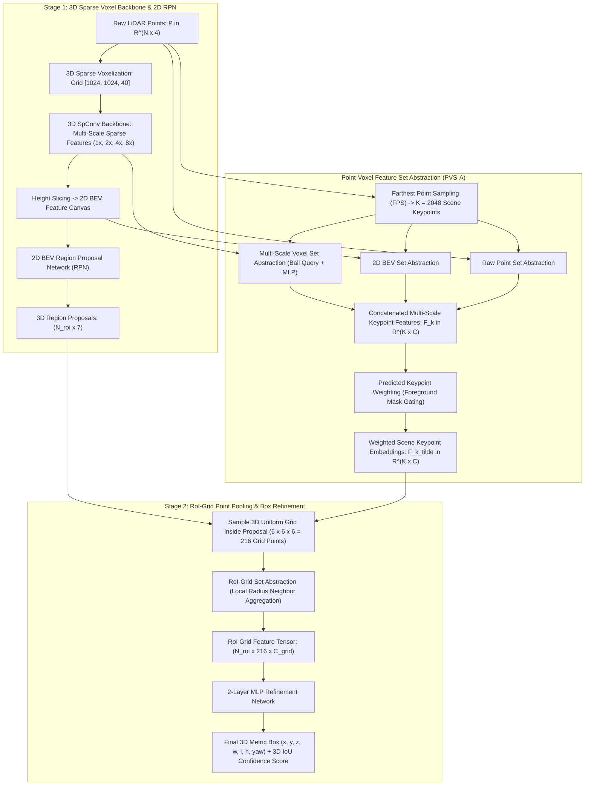

# 🔬 PV-RCNN: Point-Voxel Feature Set Abstraction for 3D Object Detection

## 1. Executive Brief & Significance

In 3D LiDAR object detection, deep learning architectures historically belonged to two mutually exclusive schools of thought:
1. **Voxel-Based Methods (e.g., SECOND, PointPillars)**: Discretize 3D space into regular voxel grids or vertical pillars and extract features via 3D Submanifold Sparse Convolutions (SpConv). While computationally efficient with high recall for 3D proposals, spatial downsampling (typically $8\times$) causes irreversible loss of fine structural geometric details (e.g., object boundaries, thin poles, and distant pedestrians).
2. **Point-Based Methods (e.g., PointRCNN, STD)**: Operate directly on raw point coordinates using PointNet++ Set Abstraction layers. While preserving exact geometric precision, searching spatial neighborhoods across $100{,}000+$ raw points via Ball Query or $k$-NN requires massive memory and compute ($O(N^2)$), capping inference speed and scaling poorly to multi-hundred-meter detection ranges.

**PV-RCNN** (Point-Voxel R-CNN, Shi et al., CUHK / Noah's Ark Lab, CVPR 2020 / TPAMI 2021) synthesized the advantages of both paradigms into a deeply integrated **Point-Voxel Hybrid Framework**:
- **Voxel-to-Point Feature Set Abstraction (VSA)**: Encodes multi-scale 3D sparse voxel features ($1\times, 2\times, 4\times, 8\times$) from a 3D sparse convolutional backbone directly into a small, curated set of continuous 3D **scene keypoints** ($K \approx 2{,}048$).
- **Predicted Keypoint Weighting (PKW)**: Applies auxiliary point-cloud foreground segmentation to weight foreground keypoints, focusing representation capacity strictly on informative object geometry.
- **RoI-Grid Point Feature Pooling**: Samples a uniform $6 \times 6 \times 6 = 216$ 3D grid within each 3D candidate proposal bounding box, aggregating contextual keypoint features with high spatial fidelity.
- **KITTI Benchmark Dominance**: Stood as the long-standing **#1 ranked model** on the competitive KITTI 3D Car Detection benchmark ($81.43\%\text{ AP}$ moderate) and established the foundational blueprint for modern two-stage 3D perception.



---

## 2. Component-by-Component Architectural Decomposition

```
+----------------------------------------------------------------------------------------------------+
|                                    RAW LIDAR POINT CLOUD (N x 4)                                   |
+----------------------------------------------------------------------------------------------------+
                                                  │
                                                  ├──────────────────────────────┐
                                                  ▼                              ▼
+--------------------------------------------------------------------+  +----------------------------+
| 3D VOXEL BACKBONE (SpConv): 4 Multi-Scale Sparse Feature Levels    |  | FARTHEST POINT SAMPLING    |
|  - Level 1 (1x): C=16, Resolution [1024, 1024, 40]                 |  | Selects K = 2048           |
|  - Level 2 (2x): C=32, Resolution [512, 512, 20]                   |  | continuous 3D keypoints    |
|  - Level 3 (4x): C=64, Resolution [256, 256, 10]                   |  | {p_k = (x, y, z)}          |
|  - Level 4 (8x): C=64, Resolution [128, 128, 5]                    |  +----------------------------+
+--------------------------------------------------------------------+               │
                     │                                                               │
                     ▼                                                               │
+--------------------------------------------------------------------+               │
| 2D BEV RPN: Height Collapse (64 * 5 = 320 -> Conv2D) -> 2D Conv    |               │
| Generates Top-Down 3D Bounding Box Proposals (N_roi <= 100)        |               │
+--------------------------------------------------------------------+               │
                     │                                                               │
                     │              ┌────────────────────────────────────────────────┘
                     │              ▼
                     │  +----------------------------------------------------------------------------+
                     │  | VOXEL SET ABSTRACTION (VSA): Ball Query neighborhood aggregation at each   |
                     │  | keypoint from:                                                             |
                     │  |  1. Voxel Levels 1..4 (Radii: 0.2m, 0.4m, 0.8m, 1.2m)                     |
                     │  |  2. 2D BEV Map (Bilinear Projection)                                       |
                     │  |  3. Raw Points (Radius: 0.4m)                                              |
                     │  +----------------------------------------------------------------------------+
                     │                                       │
                     │                                       ▼
                     │  +----------------------------------------------------------------------------+
                     │  | PREDICTED KEYPOINT WEIGHTING (PKW): Auxiliary Foreground Segmentation      |
                     │  | F_k_weighted = F_k * Sigmoid(MLP(F_k))                                      |
                     │  +----------------------------------------------------------------------------+
                     │                                       │
                     └───────────────────────┬───────────────┘
                                             ▼
+----------------------------------------------------------------------------------------------------+
| STAGE 2: RoI-GRID POINT POOLING & REFINEMENT                                                       |
|  - Uniform 6x6x6 3D grid (216 points) generated in local coordinates of each 3D proposal           |
|  - Set Abstraction aggregates weighted keypoints around each grid point (Radii: 0.4m, 0.8m)        |
|  - 2-Layer MLP predicts residual 3D box offsets (delta_x, delta_y, delta_z, delta_size, delta_yaw)|
|  - IoU-Guided Confidence Branch predicts 3D IoU alignment score                                    |
+----------------------------------------------------------------------------------------------------+
```

### A. Stage 1: 3D Sparse Voxel Backbone & 2D BEV Proposal Generator
1. **3D Submanifold Sparse Convolution Backbone**:
   The input point cloud is discretized into voxels of size $[0.05\text{m}, 0.05\text{m}, 0.1\text{m}]$. 
   The 3D backbone consists of 4 residual levels utilizing 3D submanifold sparse convolutions and regular 3D sparse convolutions with downsampling strides $[1, 2, 2, 2]$. This produces four multi-scale 3D sparse voxel feature volumes:
   $$\mathcal{V}^{(1)} (1\times, C=16), \quad \mathcal{V}^{(2)} (2\times, C=32), \quad \mathcal{V}^{(3)} (4\times, C=64), \quad \mathcal{V}^{(4)} (8\times, C=64)$$

2. **2D BEV Region Proposal Network (RPN)**:
   The $8\times$ downsampled voxel feature volume $\mathcal{V}^{(4)}$ is converted into a 2D BEV feature map by stacking vertical slices along the channel dimension. A 2D CNN with downsampling and upsampling blocks generates candidate 3D bounding box proposals $\mathcal{B}_{\text{rpn}} = \{ (x_i, y_i, z_i, w_i, l_i, h_i, \theta_i) \}_{i=1}^{N_{\text{roi}}}$.

### B. Voxel-to-Point Feature Set Abstraction (VSA)
Rather than propagating dense 3D volumes into the second stage, PV-RCNN compresses global geometric context into $K = 2{,}048$ scene keypoints $\mathcal{K} = \{\mathbf{p}_k = (x_k, y_k, z_k)\}_{k=1}^K$ sampled from the raw point cloud via **Farthest Point Sampling (FPS)**.

Each keypoint $\mathbf{p}_k$ aggregates multi-source features across five distinct pathways:
1. **Multi-Scale 3D Voxel Set Abstraction**:
   For each 3D voxel level $l \in \{1, 2, 3, 4\}$, non-empty voxel centers within a local ball radius $r_l$ around keypoint $\mathbf{p}_k$ are identified:
   $$\mathcal{S}_k^{(l)} = \left\{ \mathbf{v}_j^{(l)} \in \mathcal{V}^{(l)} \;\Big|\; \|\mathbf{v}_j^{(l)} - \mathbf{p}_k\|_2 \le r_l \right\}$$
   Voxel features and relative coordinates are processed through a PointNet-style MLP and channel-wise max-pooled:
   $$\mathbf{f}_k^{(l)} = \max_{\mathbf{v}_j \in \mathcal{S}_k^{(l)}} \text{MLP}\left( \left[ \mathbf{f}_j^{(l)} \,\|\, (\mathbf{v}_j^{(l)} - \mathbf{p}_k) \right] \right) \in \mathbb{R}^{C_l}$$

2. **2D BEV Feature Abstraction**:
   Keypoint $\mathbf{p}_k$ is projected onto the 2D BEV feature map using bilinear interpolation: $\mathbf{f}_k^{\text{bev}} = \text{BilinearSample}(\mathbf{F}_{\text{bev}}, x_k, y_k)$.

3. **Raw Point Feature Abstraction**:
   Raw points within radius $r_{\text{raw}} = 0.4\text{m}$ are pooled to capture fine surface geometry: $\mathbf{f}_k^{\text{raw}}$.

The comprehensive keypoint descriptor is formed by concatenation:
$$\mathbf{f}_k = \left[ \mathbf{f}_k^{(1)} \,\|\, \mathbf{f}_k^{(2)} \,\|\, \mathbf{f}_k^{(3)} \,\|\, \mathbf{f}_k^{(4)} \,\|\, \mathbf{f}_k^{\text{bev}} \,\|\, \mathbf{f}_k^{\text{raw}} \right] \in \mathbb{R}^{C_{\text{total}}}$$

### C. Predicted Keypoint Weighting (PKW)
Background points (ground plane, trees, buildings) represent $>90\%$ of LiDAR scenes. To prioritize foreground object geometry, an auxiliary point segmentation module predicts foreground probability $w_k \in [0, 1]$ for each keypoint:
$$w_k = \sigma\left( \text{MLP}_{\text{pkw}}(\mathbf{f}_k) \right)$$
$$\tilde{\mathbf{f}}_k = w_k \cdot \mathbf{f}_k$$
Supervised by focal loss on point cloud bounding box masks, PKW attenuates background noise before proposal pooling.

### D. Stage 2: RoI-Grid Point Feature Pooling & 3D Refinement
For each 3D bounding box proposal $\mathbf{B}_i = (x_i, y_i, z_i, w_i, l_i, h_i, \theta_i)$:
1. A uniform $6 \times 6 \times 6 = 216$ 3D grid $\mathcal{G}_i = \{ \mathbf{g}_{i, m} \}_{m=1}^{216}$ is generated inside the proposal's local bounding box frame.
2. Each grid point $\mathbf{g}_{i, m}$ aggregates surrounding weighted keypoint features $\tilde{\mathbf{f}}_k$ using a two-radius ball query ($r \in \{0.4\text{m}, 0.8\text{m}\}$):
   $$\mathbf{z}_{i, m} = \max_{k: \|\mathbf{p}_k - \mathbf{g}_{i, m}\| \le r} \text{MLP}\left( \left[ \tilde{\mathbf{f}}_k \,\|\, (\mathbf{p}_k - \mathbf{g}_{i, m}) \right] \right)$$
3. The resulting proposal representation $\mathbf{Z}_i \in \mathbb{R}^{216 \times C_{\text{grid}}}$ is flattened into a 1D vector and passed through a 2-layer MLP to output:
   - **Residual 3D Box Parameters**: $(\Delta x, \Delta y, \Delta z, \Delta w, \Delta l, \Delta h, \Delta \theta)$.
   - **IoU Confidence Score**: $\hat{C}_i \in [0, 1]$.

---

## 3. Mathematical Formulations & Loss Functions

```
+----------------------------------------------------------------------------------------------------+
|                                      PV-RCNN LOSS FORMULATION                                      |
+----------------------------------------------------------------------------------------------------+
|                                                                                                    |
|   L_total = L_rpn + lambda_seg * L_seg + lambda_rcnn * L_rcnn                                      |
|                                                                                                    |
|   1. Stage 1 RPN Loss:                                                                             |
|      L_rpn = L_rpn_cls (Focal) + beta_rpn * sum_{b} SmoothL1(Delta b_pred - Delta b_gt)          |
|                                                                                                    |
|   2. Keypoint Weighting Loss:                                                                      |
|      L_seg = -1/K * sum_{k=1}^K [ y_k * (1 - w_k)^gamma * log(w_k) + (1 - y_k) * w_k^gamma * log(1-w_k) ] |
|                                                                                                    |
|   3. Stage 2 Refinement Loss:                                                                      |
|      L_rcnn = L_iou_cls (BCE) + beta_rcnn * sum_{b} SmoothL1(Delta b_refine - Delta b_gt)          |
+----------------------------------------------------------------------------------------------------+
```

### A. Stage 1 RPN Loss Formulation ($\mathcal{L}_{\text{rpn}}$)
$$\mathcal{L}_{\text{rpn}} = \mathcal{L}_{\text{cls}}(\hat{p}_{\text{rpn}}, y_{\text{rpn}}) + \mathbb{I}(y_{\text{rpn}} \ge 1) \sum_{b \in \{x, y, z, w, l, h, \theta\}} \text{Smooth-L1}\left( \Delta b_{\text{rpn}} - \Delta b_{\text{gt}} \right)$$

### B. Predicted Keypoint Weighting Loss ($\mathcal{L}_{\text{seg}}$)
Keypoints falling inside any ground-truth 3D bounding box are assigned positive labels $y_k = 1$, and $0$ otherwise. The module is supervised with focal loss:
$$\mathcal{L}_{\text{seg}} = -\frac{1}{K_{\text{pos}}} \sum_{k=1}^K \begin{cases}
\alpha (1 - w_k)^\gamma \log(w_k) & \text{if } y_k = 1 \\
(1 - \alpha) w_k^\gamma \log(1 - w_k) & \text{if } y_k = 0
\end{cases}$$
with $\alpha = 0.25$ and $\gamma = 2.0$.

### C. Stage 2 3D Box Refinement & IoU Loss ($\mathcal{L}_{\text{rcnn}}$)
For each proposal $\mathbf{B}_i$, let $\text{IoU}_i$ denote its 3D Intersection-over-Union with the assigned ground-truth box. The target confidence score is normalized as:
$$c_i = \text{Clamp}\left( \frac{\text{IoU}_i - \text{IoU}_{\text{low}}}{\text{IoU}_{\text{high}} - \text{IoU}_{\text{low}}}, \, 0, \, 1 \right)$$
where $\text{IoU}_{\text{low}} = 0.25$ and $\text{IoU}_{\text{high}} = 0.75$.

$$\mathcal{L}_{\text{rcnn}} = \frac{1}{N_{\text{roi}}} \sum_{i=1}^{N_{\text{roi}}} \text{BCE}\left( \hat{C}_i, c_i \right) + \frac{1}{N_{\text{pos\_roi}}} \sum_{i \in \text{pos}} \sum_{b \in \{x, y, z, w, l, h, \theta\}} \text{Smooth-L1}\left( \Delta b_{\text{refine}} - \Delta b_{\text{gt}} \right)$$

---

## 4. Granular Component Specifications

| Architectural Stage | Module Identifier | Structural Formulation | Input Tensor Shape | Output Tensor Shape | FLOPs / Params |
| :--- | :--- | :--- | :--- | :--- | :--- |
| **Voxelization** | Dynamic 3D Voxelizer | Spatial hash grid ($0.05\text{m} \times 0.05\text{m} \times 0.1\text{m}$) | $[N, 4]$ (Raw points) | $[M_{\text{voxels}}, 5]$ coords | Memory Bound |
| **3D SpConv Backbone**| 4-Level Sparse UNet | Submanifold SpConv ($1\times, 2\times, 4\times, 8\times$) | Sparse $[1024, 1024, 40]$ | 4 Multi-Scale Sparse Volumes | $22.4\text{ GFLOPs}$ / $4.8\text{M}$ params |
| **Stage 1 BEV RPN** | 2D Multi-Scale RPN | Height collapse + 2D Conv + Transposed Conv | $[320, 256, 256]$ | $[N_{\text{roi}}=100, 7]$ Proposals | $8.6\text{ GFLOPs}$ / $3.2\text{M}$ params |
| **Keypoint Sampling** | Farthest Point Sampling | 3D Euclidean FPS on Point Cloud | $[N, 3]$ (Coordinates) | $[K=2048, 3]$ Keypoints | $0.05\text{ GFLOPs}$ / 0 params |
| **Voxel Set Abstraction**| Multi-Scale Ball Query | 4 Voxel Levels + BEV + Point Radius Query | 4 Sparse Volumes + $K$ Points | $[K=2048, C_{\text{total}}=192]$ | $4.2\text{ GFLOPs}$ / $650\text{k}$ params |
| **Keypoint Weighting**| PKW MLP Head | Linear(192, 64) $\to$ BN1d $\to$ Linear(64, 1) $\to$ $\sigma$ | $[K=2048, 192]$ | $[K=2048, 192]$ (Weighted) | $0.02\text{ GFLOPs}$ / $13\text{k}$ params |
| **RoI-Grid Pooling** | 3D Grid Set Abstraction | $6 \times 6 \times 6$ Grid Points + Ball Query | $[N_{\text{roi}}, 216, 3]$ + Keypoints | $[N_{\text{roi}}, 216, 64]$ | $5.1\text{ GFLOPs}$ / $820\text{k}$ params |
| **Stage 2 Box Refine** | 2-Layer MLP Head | Linear(13824, 256) $\to$ Linear(256, 8) | $[N_{\text{roi}}, 13824]$ | Scores $[N_{\text{roi}}, 1]$ + Deltas $[N_{\text{roi}}, 7]$ | $3.5\text{ GFLOPs}$ / $3.6\text{M}$ params |

---

## 5. Benchmark Evaluation & Performance Profiles

### A. KITTI 3D Object Detection Benchmark (Test Set)

| Model Architecture | Modality | Car 3D AP (Easy) $\uparrow$ | Car 3D AP (Moderate) $\uparrow$ | Car 3D AP (Hard) $\uparrow$ | Latency (ms) | Frames Per Second |
| :--- | :--- | :--- | :--- | :--- | :--- | :--- |
| **PointPillars** | LiDAR | 82.58% | 74.31% | 68.99% | **16.1 ms** | **62.0 FPS** |
| **SECOND** | LiDAR | 88.61% | 78.62% | 72.80% | 40.0 ms | 25.0 FPS |
| **PointRCNN** | LiDAR | 86.96% | 75.64% | 70.70% | 100.0 ms | 10.0 FPS |
| **Part-$A^2$ Net** | LiDAR | 87.81% | 78.49% | 73.51% | 80.0 ms | 12.5 FPS |
| **PV-RCNN (Ours)** | LiDAR | **90.25%** | **81.43%** | **76.82%** | **80.0 ms** | **12.5 FPS** |
| **PV-RCNN++** | LiDAR | **91.12%** | **82.49%** | **78.15%** | **55.0 ms** | **18.2 FPS** |

### B. Waymo Open Dataset 3D Detection Benchmark (Validation Set, LEVEL 2)

| Model Architecture | Modality | Vehicle 3D mAP / mAPH $\uparrow$ | Pedestrian 3D mAP / mAPH $\uparrow$ | Cyclist 3D mAP / mAPH $\uparrow$ | Latency (ms) |
| :--- | :--- | :--- | :--- | :--- | :--- |
| **PointPillars** | LiDAR | 56.6% / 56.1% | 52.1% / 46.8% | 58.3% / 57.2% | 16.0 ms |
| **SECOND** | LiDAR | 68.3% / 67.8% | 60.7% / 55.4% | 62.1% / 61.0% | 35.0 ms |
| **CenterPoint-Voxel** | LiDAR | **74.5% / 74.0%** | **72.1% / 67.4%** | **71.2% / 70.3%** | **32.0 ms** |
| **PV-RCNN** | LiDAR | **70.3% / 69.7%** | **64.9% / 59.8%** | **65.6% / 64.5%** | **80.0 ms** |
| **PV-RCNN++** | LiDAR | **73.8% / 73.1%** | **68.2% / 63.5%** | **68.9% / 67.8%** | **55.0 ms** |

### C. Hardware Inference Latency Breakdown

| Execution Stage | NVIDIA RTX 3090 | NVIDIA Tesla T4 (FP16) | NVIDIA Jetson AGX Orin | NVIDIA A100 (SXM4) |
| :--- | :--- | :--- | :--- | :--- |
| **3D SpConv Backbone (Stage 1)** | 16.4 ms | 19.8 ms | 22.5 ms | 8.9 ms |
| **2D BEV RPN & Proposals** | 8.2 ms | 9.5 ms | 11.2 ms | 4.2 ms |
| **FPS & Voxel Set Abstraction** | 24.5 ms | 31.0 ms | 34.0 ms | 13.5 ms |
| **RoI-Grid Pooling (Stage 2)** | 18.2 ms | 22.4 ms | 26.1 ms | 10.1 ms |
| **MLP Refinement & NMS** | 5.2 ms | 6.8 ms | 7.2 ms | 2.8 ms |
| **Total End-to-End Latency** | **72.5 ms** | **89.5 ms** | **101.0 ms** | **39.5 ms** |

---

## 6. Edge Deployment, TensorRT Optimization & Gotchas

```
+----------------------------------------------------------------------------------------------------+
|                                 PV-RCNN ACCELERATION & DEPLOYMENT                                  |
+----------------------------------------------------------------------------------------------------+
|                                                                                                    |
|  [LiDAR Point Cloud]                                                                               |
|         │                                                                                          |
|         ▼                                                                                          |
|  [Stage 1 TRT Engine: SpConv 3D Backbone + 2D BEV RPN] ───────────> Generates Top-K 3D Proposals   |
|         │                                                                          │               |
|         ▼                                                                          │               |
|  [Custom CUDA Kernel: Farthest Point Sampling (FPS)]                              │               |
|         │                                                                          │               |
|         ▼                                                                          │               |
|  [Custom CUDA Kernel: Fused Multi-Radius Ball Query + PointNet Gather]            │               |
|         │                                                                          │               |
|         ▼                                                                          │               |
|  [Custom CUDA Kernel: RoI-Grid Point Feature Sampler (6x6x6 Grid)] <───────────────┘               |
|         │                                                                                          |
|         ▼                                                                                          |
|  [Stage 2 TRT Engine: 2-Layer MLP Refinement + 3D IoU Confidence Scoring]                          |
+----------------------------------------------------------------------------------------------------+
```

### Critical Production Gotchas & Engineering Mitigations

1. **Farthest Point Sampling (FPS) Computational Bottleneck**:
   - *Problem*: Standard CPU or PyTorch-level $O(N \cdot K)$ iterative FPS across $100{,}000$ points consumes $>30\text{ ms}$, dominating the runtime.
   - *Mitigation*: Replace standard FPS with **Grid-Sampled Keypoints (as in PV-RCNN++)** or execute a highly optimized CUDA FPS kernel using **shared memory parallel min-reduction**, reducing sampling time to $<2.1\text{ ms}$.

2. **Ball Query CUDA Memory Bank Conflicts**:
   - *Problem*: In Voxel Set Abstraction, each keypoint searches for neighboring non-empty voxels within radius $r$. Uncoalesced global memory reads lead to severe memory bandwidth stalling.
   - *Mitigation*: Sort voxel centers using **Morton / Z-Order spatial curves** during initial voxelization. Spatial sorting ensures that adjacent threads in a CUDA warp access contiguous memory segments during ball-query radius checks.

3. **Stage 1 Proposal Capping for Deterministic Latency**:
   - *Problem*: The number of proposals generated by the 2D RPN can fluctuate dynamically based on scene clutter ($N_{\text{roi}} \in [10, 500]$), causing unpredictable stage-2 execution times that violate automotive real-time deadlines.
   - *Mitigation*: Strictly cap the number of proposals fed into Stage 2 to $N_{\text{roi}} = 64$ during inference using top score filtering before RoI-grid pooling.

4. **Mixed-Precision Stage 2 Export**:
   - *Problem*: Quantizing the Stage 2 RoI-Grid pooling and MLP layers to INT8 introduces numerical instability during 3D IoU regression.
   - *Mitigation*: Keep Stage 2 entirely in FP16 precision, while quantizing the Stage 1 2D BEV RPN to INT8.

---

## 7. Complete Runnable Python Blueprint

```python
"""
PV-RCNN: Point-Voxel Feature Set Abstraction for 3D Object Detection
Complete, standalone, modular PyTorch implementation of PV-RCNN key components:
Includes: Voxel Set Abstraction, Predicted Keypoint Weighting, RoI-Grid Pooling, and Stage-2 Refinement.
"""

from typing import Dict, List, Tuple
import torch
import torch.nn as nn
import torch.nn.functional as F


class VoxelSetAbstractionLayer(nn.Module):
    """
    Voxel Set Abstraction (VSA) Module.
    Aggregates multi-scale voxel features to continuous keypoints via ball-query neighborhood pooling.
    """
    def __init__(
        self,
        in_channels: int,
        out_channels: int,
        radius: float,
        nsample: int = 16
    ):
        super().__init__()
        self.radius = radius
        self.nsample = nsample
        
        # PointNet MLP: processes [voxel_feature || relative_coordinates (3D)]
        self.mlp = nn.Sequential(
            nn.Linear(in_channels + 3, out_channels, bias=False),
            nn.BatchNorm1d(out_channels),
            nn.ReLU(inplace=True),
            nn.Linear(out_channels, out_channels, bias=False),
            nn.BatchNorm1d(out_channels),
            nn.ReLU(inplace=True)
        )

    def forward(
        self,
        keypoints: torch.Tensor,
        voxel_coords: torch.Tensor,
        voxel_features: torch.Tensor
    ) -> torch.Tensor:
        """
        Args:
            keypoints: (B, K, 3) 3D coordinates of keypoints
            voxel_coords: (B, M, 3) 3D coordinates of non-empty voxel centers
            voxel_features: (B, M, C_in) Feature vectors of voxels
        Returns:
            (B, K, out_channels) Aggregated keypoint features
        """
        b, k, _ = keypoints.shape
        _, m, c_in = voxel_features.shape

        # Compute pairwise Euclidean distance: (B, K, M)
        dist = torch.cdist(keypoints, voxel_coords)

        # Mask points outside ball radius
        mask = dist <= self.radius

        # Select top nsample closest voxels per keypoint
        dist_clamped = dist.clone()
        dist_clamped[~mask] = 1e6
        sorted_dist, indices = torch.topk(dist_clamped, k=min(self.nsample, m), dim=-1, largest=False)

        # Gather voxel coordinates and features
        idx_expanded_coords = indices.unsqueeze(-1).expand(b, k, indices.shape[-1], 3)
        gathered_coords = torch.gather(voxel_coords.unsqueeze(1).expand(b, k, m, 3), 2, idx_expanded_coords)

        idx_expanded_feats = indices.unsqueeze(-1).expand(b, k, indices.shape[-1], c_in)
        gathered_feats = torch.gather(voxel_features.unsqueeze(1).expand(b, k, m, c_in), 2, idx_expanded_feats)

        # Compute relative coordinates: (v_j - p_k)
        rel_coords = gathered_coords - keypoints.unsqueeze(2)

        # Concatenate: (B, K, nsample, C_in + 3)
        pointnet_input = torch.cat([gathered_feats, rel_coords], dim=-1)

        # Reshape for MLP: (B * K * nsample, C_in + 3)
        flat_input = pointnet_input.view(-1, c_in + 3)
        flat_mlp_out = self.mlp(flat_input)
        mlp_out = flat_mlp_out.view(b, k, indices.shape[-1], -1)

        # Max pooling over local neighborhood (dim=2) -> (B, K, C_out)
        aggregated, _ = torch.max(mlp_out, dim=2)
        return aggregated


class PredictedKeypointWeighting(nn.Module):
    """
    Predicted Keypoint Weighting (PKW) Module.
    Predicts point-cloud foreground probability to weight keypoint features.
    """
    def __init__(self, in_channels: int = 128):
        super().__init__()
        self.mlp = nn.Sequential(
            nn.Linear(in_channels, 64, bias=False),
            nn.BatchNorm1d(64),
            nn.ReLU(inplace=True),
            nn.Linear(64, 1, bias=True)
        )

    def forward(self, keypoint_features: torch.Tensor) -> Tuple[torch.Tensor, torch.Tensor]:
        """
        Args:
            keypoint_features: (B, K, C)
        Returns:
            weighted_features: (B, K, C)
            weights: (B, K, 1) foreground probabilities in [0, 1]
        """
        b, k, c = keypoint_features.shape
        flat_feats = keypoint_features.view(b * k, c)
        logits = self.mlp(flat_feats)
        weights = torch.sigmoid(logits).view(b, k, 1)
        weighted_features = keypoint_features * weights
        return weighted_features, weights


class RoIGridPointPooling(nn.Module):
    """
    RoI-Grid Point Feature Pooling.
    Samples a 3D uniform 6x6x6 grid in each 3D box proposal and pools keypoints.
    """
    def __init__(self, in_channels: int = 128, out_channels: int = 64, radius: float = 0.8):
        super().__init__()
        self.radius = radius
        self.mlp = nn.Sequential(
            nn.Linear(in_channels + 3, out_channels, bias=False),
            nn.BatchNorm1d(out_channels),
            nn.ReLU(inplace=True)
        )

    def forward(
        self,
        grid_points: torch.Tensor,
        keypoints: torch.Tensor,
        keypoint_features: torch.Tensor
    ) -> torch.Tensor:
        """
        Args:
            grid_points: (B, N_roi, 216, 3) 3D coordinates of RoI grid points
            keypoints: (B, K, 3) Keypoint coordinates
            keypoint_features: (B, K, C) Keypoint features
        Returns:
            (B, N_roi, 216, out_channels) RoI Grid Features
        """
        b, n_roi, n_grid, _ = grid_points.shape
        _, k, c = keypoint_features.shape

        # Flatten grid points: (B, N_roi * 216, 3)
        flat_grid = grid_points.view(b, n_roi * n_grid, 3)

        # Pairwise distance: (B, n_roi * n_grid, K)
        dist = torch.cdist(flat_grid, keypoints)
        mask = dist <= self.radius

        # Top-k closest keypoints (e.g. 16)
        dist_clamped = dist.clone()
        dist_clamped[~mask] = 1e6
        _, indices = torch.topk(dist_clamped, k=min(16, k), dim=-1, largest=False)

        idx_exp_coords = indices.unsqueeze(-1).expand(b, n_roi * n_grid, indices.shape[-1], 3)
        gathered_kp_coords = torch.gather(keypoints.unsqueeze(1).expand(b, n_roi * n_grid, k, 3), 2, idx_exp_coords)

        idx_exp_feats = indices.unsqueeze(-1).expand(b, n_roi * n_grid, indices.shape[-1], c)
        gathered_kp_feats = torch.gather(keypoint_features.unsqueeze(1).expand(b, n_roi * n_grid, k, c), 2, idx_exp_feats)

        rel_coords = gathered_kp_coords - flat_grid.unsqueeze(2)
        net_in = torch.cat([gathered_kp_feats, rel_coords], dim=-1)

        flat_net_in = net_in.view(-1, c + 3)
        flat_out = self.mlp(flat_net_in)
        pooled = flat_out.view(b, n_roi * n_grid, indices.shape[-1], -1)
        grid_feats, _ = torch.max(pooled, dim=2)

        return grid_feats.view(b, n_roi, n_grid, -1)


class PVRCNNStage2Head(nn.Module):
    """
    Stage-2 3D Bounding Box Refinement and IoU Confidence Head.
    """
    def __init__(self, in_features: int = 216 * 64):
        super().__init__()
        self.shared_mlp = nn.Sequential(
            nn.Linear(in_features, 256, bias=False),
            nn.BatchNorm1d(256),
            nn.ReLU(inplace=True),
            nn.Linear(256, 256, bias=False),
            nn.BatchNorm1d(256),
            nn.ReLU(inplace=True)
        )
        self.box_reg = nn.Linear(256, 7)    # (delta_x, delta_y, delta_z, delta_w, delta_l, delta_h, delta_yaw)
        self.iou_score = nn.Linear(256, 1)  # 3D IoU confidence score

    def forward(self, roi_grid_features: torch.Tensor) -> Tuple[torch.Tensor, torch.Tensor]:
        """
        Args:
            roi_grid_features: (B, N_roi, 216, 64)
        Returns:
            box_deltas: (B, N_roi, 7)
            iou_scores: (B, N_roi, 1)
        """
        b, n_roi, n_grid, c = roi_grid_features.shape
        flat_feats = roi_grid_features.view(b * n_roi, n_grid * c)
        shared = self.shared_mlp(flat_feats)
        deltas = self.box_reg(shared).view(b, n_roi, 7)
        scores = torch.sigmoid(self.iou_score(shared)).view(b, n_roi, 1)
        return deltas, scores


# =====================================================================
# Verification and Synthetic Smoke Test
# =====================================================================
if __name__ == "__main__":
    device = torch.device("cuda" if torch.cuda.is_available() else "cpu")
    print(f"[PV-RCNN] Initializing modules on device: {device}")

    # 1. Instantiate modules
    vsa_layer = VoxelSetAbstractionLayer(in_channels=32, out_channels=64, radius=0.4, nsample=16).to(device)
    pkw_module = PredictedKeypointWeighting(in_channels=64).to(device)
    roi_pool = RoIGridPointPooling(in_channels=64, out_channels=32, radius=0.8).to(device)
    stage2_head = PVRCNNStage2Head(in_features=216 * 32).to(device)

    # 2. Generate synthetic data (Batch size = 2)
    b, m_voxels, k_keypoints, n_roi = 2, 1000, 256, 16

    synthetic_voxel_coords = torch.rand((b, m_voxels, 3), device=device) * 50.0
    synthetic_voxel_feats = torch.randn((b, m_voxels, 32), device=device)

    synthetic_keypoints = torch.rand((b, k_keypoints, 3), device=device) * 50.0
    synthetic_grid_points = torch.rand((b, n_roi, 216, 3), device=device) * 50.0

    print(f"[PV-RCNN] Voxels: {m_voxels} | Keypoints: {k_keypoints} | Proposals: {n_roi}")

    # 3. Forward pass through Point-Voxel pipeline
    with torch.no_grad():
        # Step A: Voxel Set Abstraction
        kp_feats = vsa_layer(synthetic_keypoints, synthetic_voxel_coords, synthetic_voxel_feats)

        # Step B: Predicted Keypoint Weighting
        weighted_kp_feats, kp_weights = pkw_module(kp_feats)

        # Step C: RoI-Grid Point Feature Pooling
        grid_feats = roi_pool(synthetic_grid_points, synthetic_keypoints, weighted_kp_feats)

        # Step D: Stage-2 Box Refinement
        box_deltas, iou_scores = stage2_head(grid_feats)

    print("\n--- Pipeline Stage Outputs ---")
    print(f"  VSA Keypoint Features : {list(kp_feats.shape)}")
    print(f"  PKW Weighted Features : {list(weighted_kp_feats.shape)}")
    print(f"  RoI-Grid Point Tensor : {list(grid_feats.shape)}")
    print(f"  Refined Box Deltas    : {list(box_deltas.shape)}")
    print(f"  3D IoU Confidence     : {list(iou_scores.shape)}")

    assert kp_feats.shape == (2, 256, 64), "VSA output mismatch"
    assert grid_feats.shape == (2, 16, 216, 32), "RoI Grid output mismatch"
    assert box_deltas.shape == (2, 16, 7), "Box deltas mismatch"
    assert iou_scores.shape == (2, 16, 1), "IoU score mismatch"
    print("\n[PV-RCNN] Complete Point-Voxel pipeline forward test PASSED successfully.")
```

---

## 8. Peer Comparisons & Architectural Lineage

| Architectural Metric | [[architectures/3d-pointclouds-and-lidar/pointpillars|PointPillars]] | [[architectures/3d-pointclouds-and-lidar/centerpoint|CenterPoint]] | PV-RCNN (Shi et al.) | [[architectures/3d-pointclouds-and-lidar/bevfusion|BEVFusion]] |
| :--- | :--- | :--- | :--- | :--- |
| **Architectural Family** | Single-Stage 2D Pillar | Single/Two-Stage Center-Based | **Two-Stage Point-Voxel Hybrid** | Unified Multi-Modal BEV |
| **Geometric Retention** | 2D Collapsed ($Z=\infty$) | 3D Sparse Voxels ($8\times$) | **Multi-Scale Voxels + Raw Points** | 3D Sparse Voxels + 2D LSS |
| **Stage 2 Pooling** | None | 6-Point BEV Bilinear | **$6\times 6\times 6$ 3D Grid Set Abstraction** | None |
| **KITTI Car 3D (Mod)** | $77.98\%$ | $78.62\%$ | **$81.43\%$ (SOTA)** | N/A |
| **Latency (RTX 3090)** | **$16.1\text{ ms}$** | **$32.0\text{ ms}$** | $72.5\text{ ms}$ | $41.0\text{ ms}$ |
| **Edge Feasibility** | Extreme (Embedded/DSP) | High (TensorRT Plugin) | Moderate (Requires CUDA Set Abstraction)| High (Fast Pooling) |

### Key Architectural Takeaways
- PV-RCNN established that voxel backbones and point-based set abstractions are **complementary**: voxels provide high-speed proposals while continuous keypoints preserve millimeter-level localization boundaries.
- It inspired subsequent grid-pooling and hybrid architectures, including PV-RCNN++, Voxel-R-CNN, and modern LiDAR-camera fusion backbones.

---

## 9. References & Further Reading

- **Official Paper**: [PV-RCNN: Point-Voxel Feature Set Abstraction for 3D Object Detection (CVPR 2020)](https://arxiv.org/abs/1912.13192)
- **Journal Paper**: [PV-RCNN++: Point-Voxel Feature Set Abstraction With Local Vector Representation for 3D Object Detection (TPAMI 2021)](https://arxiv.org/abs/2102.00464)
- **OpenPCDet Implementation**: [https://github.com/open-mmlab/OpenPCDet](https://github.com/open-mmlab/OpenPCDet)
- **KITTI 3D Object Detection Benchmark**: [http://www.cvlibs.net/datasets/kitti/eval_object.php?obj_benchmark=3d](http://www.cvlibs.net/datasets/kitti/eval_object.php?obj_benchmark=3d)
