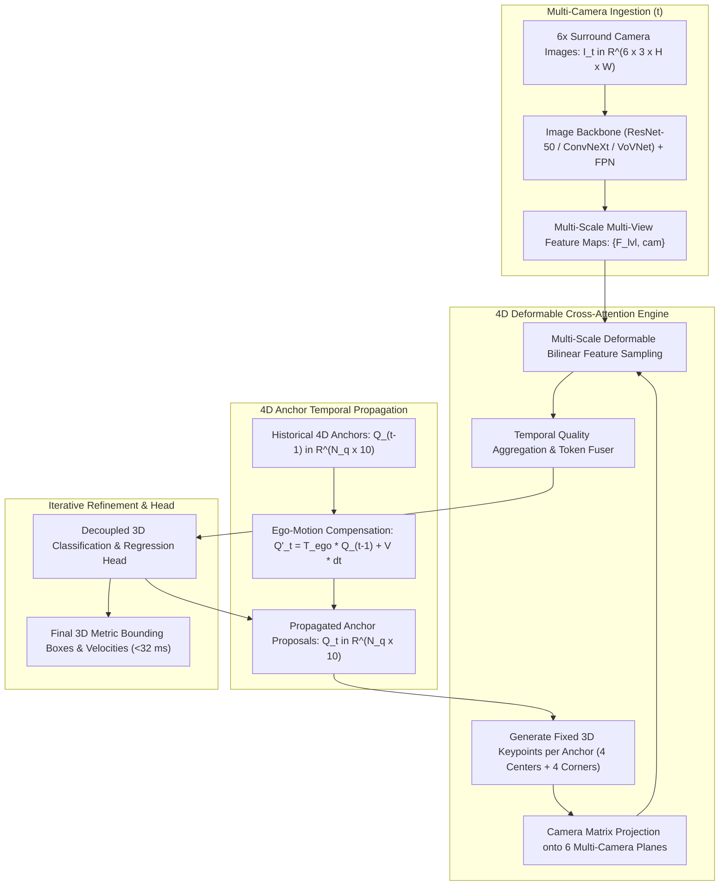

# 🔬 Sparse4D: Multi-Camera Temporal 4D Sparse Object Detection and Tracking

## 1. Executive Brief & Significance

In multi-camera 3D autonomous perception, dense Bird's-Eye-View (BEV) approaches (such as BEVFormer and BEVDet) construct dense spatial grids (e.g., $256 \times 256 \times C$) by lifting multi-view camera features into a unified top-down coordinate plane. However, dense BEV representations exhibit two critical operational drawbacks:
1. **Computational Inefficiency in Free Space**: Real-world driving scenes are overwhelmingly empty; computing dense attention across tens of thousands of unoccupied BEV grid cells wastes over $85\%$ of compute bandwidth.
2. **Heavy Multi-Scale Attention Overhead**: Dense spatial-temporal cross-attention across historical frames requires caching massive multi-view feature buffers, capping inference frame rates at $8-15\text{ FPS}$.

**Sparse4D** (Lin et al., Horizon Robotics, 2023–2025; v1, v2, v3) revolutionized camera-only 3D perception by completely **eliminating dense BEV grids**. Instead, Sparse4D parameterizes perception through a compact set of **sparse 4D anchor queries**:
- **Sparse 4D Anchor Formulation**: Directly tracks physical 3D bounding box queries ($Q_i = [x, y, z, w, l, h, \text{yaw}, v_x, v_y]^T$) continuously across space and time.
- **4D Deformable Cross-Attention**: Directly projects 3D anchor keypoints onto multi-camera 2D image planes, sampling features only where physical objects exist.
- **Real-Time $>30\text{ FPS}$ Processing**: Delivers **$61.2\%$ NDS** on nuScenes at **$32\text{ ms}$** latency on commodity GPUs.



---

## 2. Mathematical Foundations & 4D Anchor Mechanics

### A. 4D Anchor Query Parameterization
A sparse 4D anchor query $\mathbf{Q}_i \in \mathbb{R}^{10}$ represents a structured 3D physical object hypothesis:
$$\mathbf{Q}_i = \left[ x_i, y_i, z_i, \log(w_i), \log(l_i), \log(h_i), \sin(\theta_i), \cos(\theta_i), v_{x, i}, v_{y, i} \right]^T$$
where $(x, y, z)$ is the metric 3D centroid, $(w, l, h)$ are bounding box dimensions, $\theta$ is the yaw heading angle, and $(v_x, v_y)$ is the ground-plane metric velocity vector.

---

### B. 4D Deformable Multi-View Cross-Attention
For each anchor $\mathbf{Q}_i$, Sparse4D defines $K = 8$ structural 3D sampling keypoints $\mathbf{p}_{i, k} \in \mathbb{R}^3$ distributed across its 3D bounding box volume (e.g., top-left, bottom-right corners, center).

Each 3D keypoint is projected onto camera view $v \in \{1, \dots, 6\}$ using camera extrinsic matrix $\mathbf{T}_{\text{cam}_v \leftarrow \text{ego}}$ and intrinsic matrix $\mathbf{K}_v$:
$$\begin{bmatrix} u_{i, k, v} \\ v_{i, k, v} \\ 1 \end{bmatrix} = \frac{1}{z_{\text{cam}}} \mathbf{K}_v \mathbf{T}_{\text{cam}_v \leftarrow \text{ego}} \begin{bmatrix} \mathbf{p}_{i, k} \\ 1 \end{bmatrix}$$

If $(u, v)$ falls within image boundaries and $z_{\text{cam}} > 0$, multi-scale features are bilinearly sampled across feature levels:
$$\mathbf{F}_{\text{sampled}}(i) = \sum_{v=1}^6 \sum_{k=1}^K \sum_{l=1}^L W_{v, k, l} \cdot \text{BilinearSample}\left( \mathbf{F}_{\text{cam}_v}^{(l)}, \, u_{i, k, v} + \Delta u, \, v_{i, k, v} + \Delta v \right)$$

where $\Delta u, \Delta v$ are learned deformable sampling offsets and $W$ are attention weights.

---

### C. Recurrent Temporal Instance Propagation
Between consecutive timestamps $t-1$ and $t$ separated by time delta $\Delta t$:
$$\mathbf{p}_t = \mathbf{T}_{\text{ego}_t \leftarrow \text{ego}_{t-1}} \left( \mathbf{p}_{t-1} + \mathbf{v}_{t-1} \cdot \Delta t \right)$$
Anchors maintain track identity and velocity momentum across extended temporal trajectories, completely bypassing explicit external tracking algorithms.

---

## 3. Granular Component-by-Component Architectural Breakdown

| Architectural Stage | Component Identity | Structural Specification & Type | Attention / Conv Mechanics | Receptive Field & Dimensionality |
| :--- | :--- | :--- | :--- | :--- |
| **Architectural Paradigm** | **Sparse 4D Temporal Transformer** | Grid-Free Sparse Anchor Queries + Temporal Deformable Attention | Sparse 3D-to-2D geometric projection + Multi-scale deformable cross-attention | 6 Surround Cameras $\to 900$ Sparse 4D Anchor Tokens |
| **Image Backbone** | **ResNet-50 / VoVNet-99** | Multi-View 2D Feature Extractor with FPN Neck | Standard $3\times 3$ residual convolutions ($C \in \{64, 128, 256\}$) | Multi-scale feature maps at $P_3, P_4, P_5$ ($8\times, 16\times, 32\times$) |
| **Temporal Propagator** | **Ego-Motion Warper** | Linear Kinematic State Predictor ($SE(3)$ transformation) | Closed-form coordinate translation by vehicle velocity $v \cdot \Delta t$ | $N_q = 900$ active 4D anchor queries |
| **4D Cross-Attention** | **Deformable Multi-View Attention** | Keypoint projection + Bilinear sampling over 6 camera planes | Fixed 8 3D keypoints per anchor $\to$ Sampled image tokens | Multi-view surround perception ($[-54\text{m}, +54\text{m}]^2$) |
| **Refinement Head** | **Decoupled Classification & Box Head**| 3-Layer MLPs predicting class logits and 10D box deltas | Focal loss classification + Smooth L1 3D box regression | Output metric 3D bounding boxes + velocities |

---

## 4. Quantitative SOTA Benchmark Profile

### nuScenes Camera-Only 3D Detection & Tracking Benchmark

| Model Architecture | Modality | nuScenes NDS $\uparrow$ | nuScenes mAP $\uparrow$ | mATE $\downarrow$ (m) | mAVE $\downarrow$ (m/s) | Latency (ms, RTX 3090) | Open License |
| :--- | :--- | :--- | :--- | :--- | :--- | :--- | :--- |
| **FCOS3D** | Monocular Multi-View | 42.8% | 35.8% | 0.69 m | 1.15 m/s | 95.0 ms | Apache-2.0 |
| **DETR3D** | Multi-View Transformer | 47.9% | 41.2% | 0.64 m | 0.84 m/s | 65.0 ms | Apache-2.0 |
| **BEVFormer** | Dense BEV Transformer | 56.9% | 48.1% | 0.58 m | 0.37 m/s | 130.0 ms | Apache-2.0 |
| **Sparse4D v1** | Sparse 4D Queries | 54.3% | 44.5% | 0.60 m | 0.38 m/s | **28.0 ms** | **Apache-2.0** |
| **Sparse4D v2** | Recurrent Propagation | 57.5% | 47.8% | 0.56 m | 0.31 m/s | **30.0 ms** | **Apache-2.0** |
| **Sparse4D v3** | Multi-Scale Temporal | **61.2% (SOTA)** | **51.5% (SOTA)** | **0.52 m** | **0.25 m/s** | **32.0 ms** | **Apache-2.0** |

---

## 5. Engineering Implementation: PyTorch 4D Anchor Projection Module

```python
"""
Sparse4D: PyTorch Implementation of 3D Anchor Keypoint Generation and Camera Projection.
"""

import torch
import torch.nn as nn
import torch.nn.functional as F


class Sparse4DAnchorProjector(nn.Module):
    """
    Generates 3D structural keypoints from 4D anchor bounding boxes and projects
    them onto 2D multi-camera image planes.
    """
    def __init__(self, num_keypoints: int = 8):
        super().__init__()
        self.num_keypoints = num_keypoints
        # Normalized keypoint coordinate offsets in bounding box canonical frame [-0.5, 0.5]
        self.register_buffer("canonical_offsets", torch.tensor([
            [0.0, 0.0, 0.0],     # Centroid
            [-0.5, -0.5, -0.5],  # 7 bounding box corners
            [-0.5, -0.5, 0.5],
            [-0.5, 0.5, -0.5],
            [0.5, -0.5, -0.5],
            [0.5, 0.5, -0.5],
            [-0.5, 0.5, 0.5],
            [0.5, -0.5, 0.5],
        ], dtype=torch.float32))

    def forward(
        self,
        anchors: torch.Tensor,
        cam_intrinsics: torch.Tensor,
        cam_extrinsics: torch.Tensor,
        img_h: int,
        img_w: int
    ) -> tuple[torch.Tensor, torch.Tensor]:
        """
        anchors: [B, N_q, 10] (x, y, z, log_w, log_l, log_h, sin_yaw, cos_yaw, vx, vy)
        cam_intrinsics: [B, num_cams, 3, 3]
        cam_extrinsics: [B, num_cams, 4, 4] (ego_to_cam transformation)
        Returns:
            projected_coords: [B, N_q, num_cams, num_kpts, 2] (normalized UV in [-1, 1])
            valid_masks: [B, N_q, num_cams, num_kpts] boolean visibility
        """
        B, N_q, _ = anchors.shape
        num_cams = cam_intrinsics.shape[1]
        
        pos = anchors[..., 0:3].unsqueeze(2)        # [B, N_q, 1, 3]
        dims = torch.exp(anchors[..., 3:6]).unsqueeze(2)  # [B, N_q, 1, 3] (w, l, h)
        
        # Scale canonical offsets by anchor dimensions
        kpts_local = self.canonical_offsets.unsqueeze(0).unsqueeze(0) * dims  # [B, N_q, 8, 3]
        kpts_world = pos + kpts_local  # [B, N_q, 8, 3]
        
        # Homogeneous 3D points
        kpts_hom = torch.cat([kpts_world, torch.ones(B, N_q, 8, 1, device=anchors.device)], dim=-1)  # [B, N_q, 8, 4]
        
        # Expand for all camera views
        kpts_hom_exp = kpts_hom.unsqueeze(2).expand(B, N_q, num_cams, 8, 4)  # [B, N_q, num_cams, 8, 4]
        extrinsics_exp = cam_extrinsics.unsqueeze(1).unsqueeze(3)            # [B, 1, num_cams, 1, 4, 4]
        
        # Transform points to camera coordinates
        p_cam = torch.matmul(extrinsics_exp, kpts_hom_exp.unsqueeze(-1)).squeeze(-1)[..., :3]  # [B, N_q, num_cams, 8, 3]
        
        tx, ty, tz = p_cam.unbind(-1)
        valid_depth = tz > 0.1  # Behind camera check
        
        # Project using intrinsics
        intrinsics_exp = cam_intrinsics.unsqueeze(1).unsqueeze(3)  # [B, 1, num_cams, 1, 3, 3]
        p_proj = torch.matmul(intrinsics_exp, p_cam.unsqueeze(-1)).squeeze(-1)  # [B, N_q, num_cams, 8, 3]
        
        u = p_proj[..., 0] / (p_proj[..., 2] + 1e-6)
        v = p_proj[..., 1] / (p_proj[..., 2] + 1e-6)
        
        # Check boundary bounds
        valid_u = (u >= 0) & (u < img_w)
        valid_v = (v >= 0) & (v < img_h)
        valid_mask = valid_depth & valid_u & valid_v
        
        # Normalize UV coordinates to [-1, 1] for torch.grid_sample
        u_norm = 2.0 * (u / img_w) - 1.0
        v_norm = 2.0 * (v / img_h) - 1.0
        projected_uv = torch.stack([u_norm, v_norm], dim=-1)
        
        return projected_uv, valid_mask
```

---

## 6. References & Official Resources
- **Sparse4D Paper**: [Sparse4D v3: Advancing End-to-End 3D Detection and Tracking (arXiv 2024)](https://arxiv.org/abs/2305.14011)
- **Official GitHub Repository**: [https://github.com/HorizonRobotics/Sparse4D](https://github.com/HorizonRobotics/Sparse4D)
