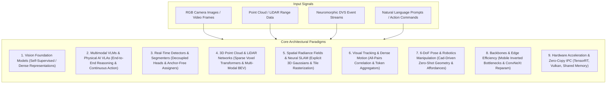

# 🏛️ Central Architecture Vault & Taxonomy Hub

> **Navigation**: [[README|🏠 Central Knowledge Hub]] / **Architectures Hub**

This directory hosts the deep-dive architectural analyses, benchmark profiles, and edge deployment mechanics for state-of-the-art vision models, multimodal agents, and high-performance perception runtimes.

---

## 1. High-Level Architectural Taxonomy

Every modern computer vision and perception model is decomposed across its core structural layers: **Backbone**, **Neck / Feature Aggregator**, **Encoder**, and **Decoder / Prediction Head**.



---

## 2. Structured Domain Hierarchy

The Architecture Vault is organized into 9 specialized domains reflecting real-world engineering boundaries:

| Directory | Core Focus | Landmark Models & Systems |
| :--- | :--- | :--- |
| **`vision-foundation-models/`** | Dense representations, self-supervised pre-training, zero-shot segmentation & depth. | [[architectures/vision-foundation-models/sam-2|SAM 2]], [[architectures/vision-foundation-models/depth-anything-v2|Depth Anything V2]], [[architectures/vision-foundation-models/dinov2-and-dinov3|DINOv2 & DINOv3]], [[architectures/vision-foundation-models/siglip|SigLIP]] |
| **`multimodal-vlm-and-vla/`** | Vision-language understanding, robotic manipulation, flow-matching diffusion policies. | [[architectures/multimodal-vlm-and-vla/qwen2-vl|Qwen2-VL]], [[architectures/multimodal-vlm-and-vla/florence-2|Florence-2]], [[architectures/multimodal-vlm-and-vla/internvl2-5|InternVL 2.5]], [[architectures/multimodal-vlm-and-vla/pi0-and-diffusion-policy|Physical Intelligence π₀]], [[architectures/multimodal-vlm-and-vla/anygrasp-and-openvla|AnyGrasp & OpenVLA]] |
| **`real-time-detectors-and-segmenters/`** | Sub-millisecond 2D object localization, attention-centric detectors, universal mask segmentation. | [[architectures/real-time-detectors-and-segmenters/yolov12|YOLOv12]], [[architectures/real-time-detectors-and-segmenters/mask2former|Mask2Former]], [[architectures/real-time-detectors-and-segmenters/fastsam-and-mobilesam|FastSAM & MobileSAM]] |
| **`3d-pointclouds-and-lidar/`** | Dynamic sparse voxelization, multi-modal LiDAR-camera sensor fusion, bird's-eye-view temporal networks. | [[architectures/3d-pointclouds-and-lidar/dsvt-and-flatformer|DSVT & FlatFormer]], [[architectures/3d-pointclouds-and-lidar/bevfusion-and-sparse4d|BEVFusion & Sparse4D]] |
| **`spatial-radiance-and-slam/`** | Explicit 3D Gaussian Splatting, real-time photometric/geometric camera tracking, sub-millimeter mapping. | [[architectures/spatial-radiance-and-slam/splatam-and-gaussian-splatting|SplaTAM & 3DGS SLAM]], [[architectures/spatial-radiance-and-slam/3dgs-slam-and-monogs|3DGS-SLAM & MonoGS]] |
| **`visual-tracking-and-flow/`** | Long-range dense point tracking, decoupled Kalman association, transformer correlation matching. | [[architectures/visual-tracking-and-flow/cotracker|CoTracker]], [[architectures/visual-tracking-and-flow/botsort-and-bytetrack|BoT-SORT & ByteTrack]] |
| **`pose-and-robotics-manipulation/`** | 6-Degrees-of-Freedom object pose tracking, CAD mesh alignment, suction and parallel-jaw affordance prediction. | [[architectures/pose-and-robotics-manipulation/foundationpose-and-megapose|FoundationPose & MegaPose]] |
| **`backbones-and-edge-efficiency/`** | Modernized pure ConvNets, structural reparameterization, inverted residual bottlenecks. | [[architectures/backbones-and-edge-efficiency/convnext-and-mobilenet|ConvNeXt & MobileNetV4]] |
| **`hardware-and-acceleration-runtimes/`** | Low-latency inference runtimes, cross-vendor Vulkan shaders, zero-copy shared memory IPC. | [[architectures/hardware-and-acceleration-runtimes/tensorrt-and-vulkan|TensorRT & Vulkan Kompute]], [[architectures/hardware-and-acceleration-runtimes/vitis-ai-and-finn|Vitis AI & FINN]], [[architectures/hardware-and-acceleration-runtimes/iceoryx2-and-zenoh|Iceoryx2 & Zenoh]] |

---

## 3. Grand Architectural Component-by-Component Matrix

This matrix provides an intensive structural breakdown of every landmark architecture across its constituent sub-modules:

| Architecture | Paradigm | Vision Backbone | Neck / Aggregator | Encoder Module | Decoder / Prediction Head | Compute Bottleneck | License | Note Link |
| :--- | :--- | :--- | :--- | :--- | :--- | :--- | :---: | :--- |
| **SAM 2** | Foundation Segmenter | Hierarchical Hiera ViT (Windowed MAE) | FPN with Lateral Convolutions | Memory Attention (Cross-frame Self/Cross Attn) | Mask Decoder (Point/Box Prompt Query MLP) | Attention Memory Bank | Apache-2.0 | [[architectures/vision-foundation-models/sam-2]] |
| **Depth Anything V2** | Monocular Depth Foundation | DINOv2 ViT (Patch 14x14) | Multi-Scale Feature Reassembly (DPT) | Standard Quadratic MHSA | Dense Spatial Depth Projection Head | Quadratic ViT MHSA | Apache-2.0 | [[architectures/vision-foundation-models/depth-anything-v2]] |
| **DINOv2 & DINOv3** | Self-Supervised ViT | Isotropic Vision Transformer (ViT-S/B/L/g) | Direct Token Extraction | Self-Attention with SwiGLU & RoPE | Linear Probing / DPT Heads | Memory Bandwidth (ViT-g) | Apache-2.0 | [[architectures/vision-foundation-models/dinov2-and-dinov3]] |
| **SigLIP** | Contrastive Vision-Language | Isotropic ViT (Patch 16x16 / 14x14) | LayerNorm + Linear Projection | Bidirectional MHSA with FlashAttention | Sigmoid Pairwise Loss (No Softmax Normalizer) | Patch Embedding MatMul | Apache-2.0 | [[architectures/vision-foundation-models/siglip]] |
| **Qwen2-VL** | Multimodal VLM | NaiveDynamicViT (Dynamic Res Tokens) | 2D Spatial Pixel Unshuffle Adapter | Multimodal Rotary Embedding (M-RoPE) | Autoregressive Causal Qwen2 Transformer | Vision Token Count & KV-Cache | Apache-2.0 | [[architectures/multimodal-vlm-and-vla/qwen2-vl]] |
| **Florence-2** | Multi-Task Seq2Seq | DaViT (Dual Attention Vision Transformer) | Linear Adapter + Cross-Attn Bridge | Alternating Spatial Window + Channel Group Attn | Autoregressive Seq2Seq Decoder + 1000 Loc Bins | Autoregressive Token Generation | MIT | [[architectures/multimodal-vlm-and-vla/florence-2]] |
| **InternVL 2.5** | High-Res Multimodal | InternViT-6B (Variable Aspect Ratio) | Dynamic Pixel Shuffle ($C \times 4 \to 4C$) | Hierarchical ViT Self-Attention | Qwen2.5 Autoregressive LLM ($1.5\text{B} \to 72\text{B}$) | High-Resolution Vision Prefill | Apache-2.0 | [[architectures/multimodal-vlm-and-vla/internvl2-5]] |
| **π₀ (Pi-Zero)** | Vision-Language-Action | Pretrained SigLIP ViT + Gemma Backbone | Linear Vision-Language Projector | Multimodal Transformer Self-Attention | Continuous Flow Matching MLP Denoiser | 50 Hz ODE Integration Steps | Research | [[architectures/multimodal-vlm-and-vla/pi0-and-diffusion-policy]] |
| **OpenVLA** | Vision-Language-Action | SigLIP ViT + DINOv2 Fused Stem | 2-Layer MLP Multi-Modal Projector | Causal LLaMA-2 7B Transformer | Discretized 256-Bin Action Tokenizer Head | 5 Hz Autoregressive LM Forward | Apache-2.0 | [[architectures/multimodal-vlm-and-vla/anygrasp-and-openvla]] |
| **YOLOv12** | Real-Time Detector | A-GELAN (Area-Attention Efficient ELAN) | PANet / FPN Path Aggregation | 1D Directional Strip Area Attention ($A^2$) | Decoupled Anchor-Free Task-Aligned Head | Area Attention MatMul | AGPL-3.0 | [[architectures/real-time-detectors-and-segmenters/yolov12]] |
| **Mask2Former** | Universal Segmenter | ResNet / Swin Transformer | Multi-Scale Deformable Pixel Decoder | Deformable Self-Attention | Masked-Attention Transformer Query Decoder | Deformable Attention Indexing | Apache-2.0 | [[architectures/real-time-detectors-and-segmenters/mask2former]] |
| **FastSAM & MobileSAM**| Real-Time Edge SAM | YOLOv8x ConvStem / TinyViT (5M) | PANet Neck / Linear Channel Adapter | Depthwise Conv Bottlenecks / Window MHSA | Lightweight SAM Two-Way Transformer Decoder | Mask Prototype Matrix Multiply | Apache-2.0 | [[architectures/real-time-detectors-and-segmenters/fastsam-and-mobilesam]] |
| **DSVT & FlatFormer** | Sparse 3D LiDAR | Dynamic Sparse Voxel Partition Stem | Submanifold Sparse Convolutions | Dynamic Sparse Voxel Window Attention | Anchor-Free 3D CenterHead | Sparse Indexing & Scattering | Apache-2.0 | [[architectures/3d-pointclouds-and-lidar/dsvt-and-flatformer]] |
| **BEVFusion & Sparse4D**| Multi-Modal Fusion | Dual Swin-T (Camera) + SparseConv (LiDAR)| Camera-to-BEV Pooling + Dynamic Voxelization| Cross-Attention BEV Fusion Encoder | Sparse 4D Deformable Tracking Head | BEV Grid Memory Bandwidth | Apache-2.0 | [[architectures/3d-pointclouds-and-lidar/bevfusion-and-sparse4d]] |
| **SplaTAM & 3DGS** | Dense Radiance SLAM | Continuous 3D Covariance Matrix $\Sigma$ | Differentiable Tile-Based Gaussian Rasterizer| Gradient Densification & Spatial Pruning | Adam Optimizer on $\mathfrak{se}(3)$ Camera Poses | Differentiable Rasterizer VRAM | Apache-2.0 | [[architectures/spatial-radiance-and-slam/splatam-and-gaussian-splatting]] |
| **3DGS-SLAM & MonoGS** | Monocular Dense SLAM | 3D Gaussian Primitive Field | Differentiable Gaussian Splatting Renderer | Photometric & Geometric Bundle Adjustment | Direct Optical Flow & Photometric Pose Solver | Frame-to-Model Optimization | MIT / Apache | [[architectures/spatial-radiance-and-slam/3dgs-slam-and-monogs]] |
| **CoTracker** | Dense Point Tracker | ResNet-50 Feature Pyramid Backbone | 4D Correlation Volume Construction | Cross-Time Multi-Scale Transformer Encoder | Iterative Point Coordinate & Visibility MLP | 4D Correlation Volume Slicing | Apache-2.0 | [[architectures/visual-tracking-and-flow/cotracker]] |
| **ByteTrack & BoT-SORT**| High-Speed MOT | Decoupled 2D Detector (YOLOv8/X) | FastReID Feature Extractor (BoT-SORT) | Classical Kalman Filter State Transition | Two-Stage Hungarian Bipartite Matching | Detector Inference (Track is <1ms)| Apache-2.0 | [[architectures/visual-tracking-and-flow/botsort-and-bytetrack]] |
| **FoundationPose** | 6-DoF Zero-Shot Pose | Render-and-Compare ResNet/ViT Backbone | Multi-View Geometric Feature Correlation | Cross-Attention Feature Matching Block | Lie Algebra $\mathfrak{se}(3)$ Disentangled Pose Refiner| Neural Rendering Render-Compare | NVIDIA (NC) | [[architectures/pose-and-robotics-manipulation/foundationpose-and-megapose]] |
| **ConvNeXt & MobileNet**| Modernized Backbones | Depthwise Separable 7x7 Convs (ConvNeXt) | Inverted Bottlenecks with Universal UI-Blocks | Pure Convolutional Stages (No Attention) | Global Average Pooling + Linear Classifier | Memory Bandwidth on Depthwise | Apache-2.0 | [[architectures/backbones-and-edge-efficiency/convnext-and-mobilenet]] |
| **TensorRT & Vulkan** | Hardware Runtimes | Ahead-Of-Time Engine Compilation | Fused Conv-BN-ReLU & Gemm Kernels | Native INT8 PTQ/QAT Calibration Matrix | Zero-Copy Host-Device DMA-BUF / Unified Memory | PCIe Transfer (Eliminated via UMA)| Apache / Perm | [[architectures/hardware-and-acceleration-runtimes/tensorrt-and-vulkan]] |
| **Vitis AI & FINN** | FPGA QNN Runtimes | Brevitas 1-to-4-bit Quantization Stem | Streaming Dataflow AXI-Stream FIFOs | Fully Pipelined Compute Engines (Matrix-Vector)| Custom RTL AXI Stream Output Master | Look-Up Table (LUT) Routing | Apache-2.0 | [[architectures/hardware-and-acceleration-runtimes/vitis-ai-and-finn]] |
| **Iceoryx2 & Zenoh** | Zero-Copy Robotics IPC| POSIX Shared Memory Ring Buffers | CycloneDDS / Zenoh Micro-Broker Bridge | Lock-Free Single-Producer Multi-Consumer (SPMC)| Zero-Copy Borrowed Memory Deserialization Head | Shared Memory Cache Coherence | Apache-2.0 | [[architectures/hardware-and-acceleration-runtimes/iceoryx2-and-zenoh]] |

---

## 4. Obsidian Dynamic Dataview Index

```dataview
TABLE architecture_class AS "Class", primary_license AS "License", updated AS "Updated"
FROM "architectures"
WHERE file.name != "README" AND file.name != "00-architectures-moc"
SORT file.name ASC
```
