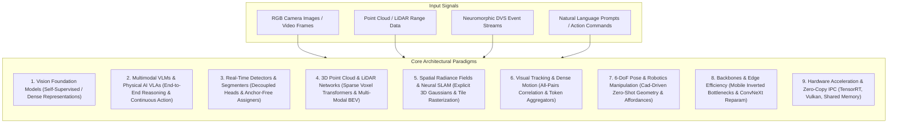

# 🏛️ Central Architecture Vault & Taxonomy Hub

> **Navigation**: [[README|🏠 Central Knowledge Hub]] / **Architectures Hub**

This directory hosts the deep-dive architectural analyses, benchmark profiles, and edge deployment mechanics for state-of-the-art vision models, multimodal agents, and high-performance perception runtimes.

---

## 1. High-Level Architectural Taxonomy

Every modern computer vision and perception model is decomposed across its core structural layers: **Backbone**, **Neck / Feature Aggregator**, **Encoder**, and **Decoder / Prediction Head**.



---

## 2. Structured Domain Hierarchy

The Architecture Vault is organized into 9 specialized domains reflecting real-world engineering boundaries:

| Directory | Core Focus | Landmark Models & Systems |
| :--- | :--- | :--- |
| **`vision-foundation-models/`** | Dense representations, self-supervised pre-training, zero-shot segmentation & depth. | [[architectures/vision-foundation-models/sam-2|SAM 2]], [[architectures/vision-foundation-models/depth-anything-v2|Depth Anything V2]], [[architectures/vision-foundation-models/dinov2|DINOv2]], [[architectures/vision-foundation-models/dinov3|DINOv3]], [[architectures/vision-foundation-models/siglip|SigLIP]] |
| **`multimodal-vlm-and-vla/`** | Vision-language understanding, robotic manipulation, flow-matching diffusion policies. | [[architectures/multimodal-vlm-and-vla/qwen2-5-vl|Qwen2.5-VL]], [[architectures/multimodal-vlm-and-vla/qwen2-vl|Qwen2-VL]], [[architectures/multimodal-vlm-and-vla/florence-2|Florence-2]], [[architectures/multimodal-vlm-and-vla/internvl2-5|InternVL 2.5]], [[architectures/multimodal-vlm-and-vla/pi0|π₀ (Pi-Zero)]], [[architectures/multimodal-vlm-and-vla/diffusion-policy|Diffusion Policy]], [[architectures/multimodal-vlm-and-vla/anygrasp|AnyGrasp]], [[architectures/multimodal-vlm-and-vla/openvla|OpenVLA]] |
| **`real-time-detectors-and-segmenters/`** | Sub-millisecond 2D object localization, attention-centric detectors, universal mask segmentation. | [[architectures/real-time-detectors-and-segmenters/rf-detr|RF-DETR]], [[architectures/real-time-detectors-and-segmenters/yolov12|YOLOv12]], [[architectures/real-time-detectors-and-segmenters/mask2former|Mask2Former]], [[architectures/real-time-detectors-and-segmenters/fastsam|FastSAM]], [[architectures/real-time-detectors-and-segmenters/mobilesam|MobileSAM]] |
| **`3d-pointclouds-and-lidar/`** | Dynamic sparse voxelization, multi-modal LiDAR-camera sensor fusion, bird's-eye-view temporal networks. | [[architectures/3d-pointclouds-and-lidar/dsvt|DSVT]], [[architectures/3d-pointclouds-and-lidar/flatformer|FlatFormer]], [[architectures/3d-pointclouds-and-lidar/bevfusion|BEVFusion]], [[architectures/3d-pointclouds-and-lidar/sparse4d|Sparse4D]] |
| **`spatial-radiance-and-slam/`** | Explicit 3D Gaussian Splatting, real-time photometric/geometric camera tracking, sub-millimeter mapping. | [[architectures/spatial-radiance-and-slam/3d-gaussian-splatting|3D Gaussian Splatting]], [[architectures/spatial-radiance-and-slam/splatam|SplaTAM]], [[architectures/spatial-radiance-and-slam/3dgs-slam|3DGS-SLAM]], [[architectures/spatial-radiance-and-slam/monogs|MonoGS]] |
| **`visual-tracking-and-flow/`** | Long-range dense point tracking, decoupled Kalman association, transformer correlation matching. | [[architectures/visual-tracking-and-flow/cotracker|CoTracker]], [[architectures/visual-tracking-and-flow/botsort|BoT-SORT]], [[architectures/visual-tracking-and-flow/bytetrack|ByteTrack]] |
| **`pose-and-robotics-manipulation/`** | 6-Degrees-of-Freedom object pose tracking, CAD mesh alignment, suction and parallel-jaw affordance prediction. | [[architectures/pose-and-robotics-manipulation/foundationpose|FoundationPose]], [[architectures/pose-and-robotics-manipulation/megapose|MegaPose]] |
| **`backbones-and-edge-efficiency/`** | Modernized pure ConvNets, 2D selective state space models, inverted residual bottlenecks. | [[architectures/backbones-and-edge-efficiency/mambavision|MambaVision]], [[architectures/backbones-and-edge-efficiency/vmamba|VMamba]], [[architectures/backbones-and-edge-efficiency/convnext-v2|ConvNeXt V2]], [[architectures/backbones-and-edge-efficiency/mobilenetv4|MobileNetV4]] |
| **`hardware-and-acceleration-runtimes/`** | Low-latency inference runtimes, cross-vendor Vulkan shaders, zero-copy shared memory IPC. | [[architectures/hardware-and-acceleration-runtimes/tensorrt-runtime|TensorRT 10]], [[architectures/hardware-and-acceleration-runtimes/vulkan-runtime|Vulkan 1.3 Compute]], [[architectures/hardware-and-acceleration-runtimes/vitis-ai-dpu|Vitis AI DPU]], [[architectures/hardware-and-acceleration-runtimes/finn-qnn|FINN QNN]], [[architectures/hardware-and-acceleration-runtimes/iceoryx2-ipc|Iceoryx2 IPC]], [[architectures/hardware-and-acceleration-runtimes/zenoh-router|Zenoh Router]] |

---

## 3. Grand Architectural Component-by-Component Matrix

This matrix provides an intensive structural breakdown of every landmark architecture across its constituent sub-modules:

| Architecture | Paradigm | Vision Backbone | Neck / Aggregator | Encoder Module | Decoder / Prediction Head | Compute Bottleneck | License | Note Link |
| :--- | :--- | :--- | :--- | :--- | :--- | :--- | :---: | :--- |
| **SAM 2** | Foundation Segmenter | Hierarchical Hiera ViT (Windowed MAE) | FPN with Lateral Convolutions | Memory Attention (Cross-frame Self/Cross Attn) | Mask Decoder (Point/Box Prompt Query MLP) | Attention Memory Bank | Apache-2.0 | [[architectures/vision-foundation-models/sam-2]] |
| **Depth Anything V2** | Monocular Depth Foundation | DINOv2 ViT (Patch 14x14) | Multi-Scale Feature Reassembly (DPT) | Standard Quadratic MHSA | Dense Spatial Depth Projection Head | Quadratic ViT MHSA | Apache-2.0 | [[architectures/vision-foundation-models/depth-anything-v2]] |
| **DINOv2** | Self-Supervised ViT | Isotropic Vision Transformer (ViT-S/B/L/g) | Direct Token Extraction | Self-Attention with SwiGLU & FlashAttention-2 | Linear Probing / DPT Heads | Memory Bandwidth (ViT-g) | Apache-2.0 | [[architectures/vision-foundation-models/dinov2]] |
| **DINOv3** | Hierarchical Multimodal | 4-Stage Multiscale Pyramid Backbone | Hierarchical Patch Aggregator | Windowed Cross-Scale Attention + 2D-RoPE | Multimodal Grounding & Panoptic Heads | High-Resolution Token Count | Apache-2.0 | [[architectures/vision-foundation-models/dinov3]] |
| **SigLIP** | Contrastive Vision-Language | Isotropic ViT (Patch 16x16 / 14x14) | LayerNorm + Linear Projection | Bidirectional MHSA with FlashAttention | Sigmoid Pairwise Loss (No Softmax Normalizer) | Patch Embedding MatMul | Apache-2.0 | [[architectures/vision-foundation-models/siglip]] |
| **Qwen2-VL** | Multimodal VLM | NaiveDynamicViT (Dynamic Res Tokens) | 2D Spatial Pixel Unshuffle Adapter | Multimodal Rotary Embedding (M-RoPE) | Autoregressive Causal Qwen2 Transformer | Vision Token Count & KV-Cache | Apache-2.0 | [[architectures/multimodal-vlm-and-vla/qwen2-vl]] |
| **Qwen2.5-VL** | Multimodal VLM & Visual Agent | NaiveDynamicViT (Dynamic Res Tokens) | 2D Spatial Pixel Unshuffle Adapter | Multimodal Rotary Embedding (M-RoPE) + Window Attention | Autoregressive Qwen2.5 Transformer + Visual Grounding Boxes | Dynamic Vision Prefill & KV-Cache | Apache-2.0 | [[architectures/multimodal-vlm-and-vla/qwen2-5-vl]] |
| **Florence-2** | Multi-Task Seq2Seq | DaViT (Dual Attention Vision Transformer) | Linear Adapter + Cross-Attn Bridge | Alternating Spatial Window + Channel Group Attn | Autoregressive Seq2Seq Decoder + 1000 Loc Bins | Autoregressive Token Generation | MIT | [[architectures/multimodal-vlm-and-vla/florence-2]] |
| **InternVL 2.5** | High-Res Multimodal | InternViT-6B (Variable Aspect Ratio) | Dynamic Pixel Shuffle ($C \times 4 \to 4C$) | Hierarchical ViT Self-Attention | Qwen2.5 Autoregressive LLM ($1.5\text{B} \to 72\text{B}$) | High-Resolution Vision Prefill | Apache-2.0 | [[architectures/multimodal-vlm-and-vla/internvl2-5]] |
| **π₀ (Pi-Zero)** | Continuous VLA Flow Matching | SigLIP ViT + Gemma Autoregressive Backbone | Linear Multimodal Projector | Multimodal Transformer Self-Attention | Continuous Flow Matching MLP Action Denoiser | 50 Hz ODE Euler Integration | Apache-2.0 | [[architectures/multimodal-vlm-and-vla/pi0]] |
| **Diffusion Policy**| Visuomotor Denoising Diffusion | ResNet / ViT Visual Feature Extractor | FiLM Conditioning Adapter Layer | 1D Temporal U-Net / DDPM Denoising Blocks | Receding Horizon Action Chunking Head | 10-16 Step Denoising Trajectory | Apache-2.0 | [[architectures/multimodal-vlm-and-vla/diffusion-policy]] |
| **AnyGrasp** | Zero-Shot 6-DoF Grasp Detection | Hierarchical PointNet++ / Sparse 3D Conv | Multi-Scale Feature Pyramid Decoder | Dense 3D Point Local Geometry Aggregator | Multi-Task Grasp Heads (Score, Width, 3D Approach) | Unordered Point Processing | Custom (NC) | [[architectures/multimodal-vlm-and-vla/anygrasp]] |
| **OpenVLA** | Autoregressive VLA (7B) | SigLIP ViT + DINOv2 Fused Stem | 2-Layer MLP Multi-Modal Projector | Causal LLaMA-2 7B Transformer | Discretized 256-Bin Action Tokenizer Head | 5 Hz Autoregressive LM Forward | Apache-2.0 | [[architectures/multimodal-vlm-and-vla/openvla]] |
| **YOLOv12** | Real-Time Detector | A-GELAN (Area-Attention Efficient ELAN) | PANet / FPN Path Aggregation | 1D Directional Strip Area Attention ($A^2$) | Decoupled Anchor-Free Task-Aligned Head | Area Attention MatMul | AGPL-3.0 | [[architectures/real-time-detectors-and-segmenters/yolov12]] |
| **RF-DETR** | SOTA Real-Time Detector | DINOv2 Vision Transformer Backbone | Multi-Scale Deformable Level Adapter | Weight-Sharing NAS Deformable Attention | Bipartite Matching Set Prediction Decoder (NMS-Free) | ViT Patch Memory Bandwidth | Apache-2.0 | [[architectures/real-time-detectors-and-segmenters/rf-detr]] |
| **Mask2Former** | Universal Segmenter | ResNet / Swin Transformer | Multi-Scale Deformable Pixel Decoder | Deformable Self-Attention | Masked-Attention Transformer Query Decoder | Deformable Attention Indexing | Apache-2.0 | [[architectures/real-time-detectors-and-segmenters/mask2former]] |
| **FastSAM** | Real-Time CNN Segmenter | YOLOv8x CSPDarknet Backbone | PANet Multi-Scale Feature Neck | C2f Feature Aggregation Blocks | Mask Prototype Generation Head ($32 \times 160 \times 160$) | Mask Prototype MatMul | Apache-2.0 | [[architectures/real-time-detectors-and-segmenters/fastsam]] |
| **MobileSAM** | Decoupled Distilled Segmenter | TinyViT Lightweight Student Backbone | Linear Projection Channel Adapter | Windowed MHSA + Depthwise Convolutions | Lightweight SAM Two-Way Transformer Decoder | Window Attention Memory Bandwidth | Apache-2.0 | [[architectures/real-time-detectors-and-segmenters/mobilesam]] |
| **DSVT** | Sparse Voxel 3D LiDAR | Dynamic Hash Voxelization Stem | Axis-Aligned / Morton Sorter Neck | Alternating Horizontal / Vertical Window Attention | Anchor-Free 3D CenterHead | Sparse Indexing & Scattering | Apache-2.0 | [[architectures/3d-pointclouds-and-lidar/dsvt]] |
| **FlatFormer** | Equal-Work Grouping LiDAR | Fast Dynamic Voxelizer | Multi-Axis Coordinate Sorter | Dense Equal-Work Group ($G=64$) Self-Attention | Anchor-Free 3D CenterHead | Zero Padding GPU Utilization | Apache-2.0 | [[architectures/3d-pointclouds-and-lidar/flatformer]] |
| **BEVFusion** | Multi-Modal Sensor Fusion | Dual Swin-T (Camera) + SparseConv (LiDAR)| Fast GPU BEV Pooling ($<12\text{ ms}$) | Squeeze-and-Excitation Dynamic Convolution Neck | 3D CenterPoint Detection + HD Map Segmentation | BEV Grid Memory Bandwidth | Apache-2.0 | [[architectures/3d-pointclouds-and-lidar/bevfusion]] |
| **Sparse4D** | Sparse 4D Temporal Detection | ResNet-50 / VoVNet-99 Backbone | FPN Multi-Scale Neck | Multi-Camera 4D Deformable Cross-Attention | Recurrent 4D Anchor Propagation Head | Multi-Camera Bilinear Sampling | Apache-2.0 | [[architectures/3d-pointclouds-and-lidar/sparse4d]] |
| **3D Gaussian Splatting**| Explicit Radiance Fields | Point Cloud Initialization | Continuous 3D Covariance $\Sigma$ Parameterization | Spherical Harmonics Radiance Modeling | Differentiable Tile-Based Gaussian Rasterizer | Differentiable Rasterizer VRAM | MIT | [[architectures/spatial-radiance-and-slam/3d-gaussian-splatting]] |
| **SplaTAM** | Dense RGB-D Radiance SLAM | Explicit 3D Gaussian Primitives | Differentiable Tile Rasterizer | Gradient Densification & Opacity Pruning | Lie Algebra $\mathfrak{se}(3)$ Tracking Optimizer | Differentiable Rasterizer VRAM | MIT | [[architectures/spatial-radiance-and-slam/splatam]] |
| **3DGS-SLAM** | Dual-Thread Dense SLAM | Asynchronous Tracking & Mapping Threads | Differentiable Gaussian Splatting Engine | Photometric & Geometric Bundle Adjustment | Direct Optical Flow & Photometric Pose Solver | Frame-to-Model Optimization | Apache-2.0 | [[architectures/spatial-radiance-and-slam/3dgs-slam]] |
| **MonoGS** | Monocular Radiance SLAM | Monocular Depth Prior Network | Affine Depth Scale-Shift Alignment ($s, b$) | Joint Pose-Geometry Radiance Field Optimization | Keyframe Co-Visibility Graph Solver | Monocular Scale Ambiguity | Apache-2.0 | [[architectures/spatial-radiance-and-slam/monogs]] |
| **CoTracker** | Dense Point Tracker | ResNet-50 Feature Pyramid Backbone | 4D Correlation Volume Construction | Cross-Time Multi-Scale Transformer Encoder | Iterative Point Coordinate & Visibility MLP | 4D Correlation Volume Slicing | Apache-2.0 | [[architectures/visual-tracking-and-flow/cotracker]] |
| **BoT-SORT** | MOT with CMC & ReID | Decoupled 2D Detector (YOLO) | FastReID Feature Embedding Neck | Camera Motion Compensation (Affine LK Flow) | Decoupled Kalman Filter + Dual Hungarian Matching | Detector Latency (Track <1ms) | MIT / Apache-2.0 | [[architectures/visual-tracking-and-flow/botsort]] |
| **ByteTrack** | High-Speed Association MOT | Decoupled 2D Detector (YOLO) | High / Low Confidence Score Splitter | Classical Kalman Filter Motion State | Two-Stage Linear Assignment (High + Low IoU) | Detector Latency (Track <1ms) | Apache-2.0 | [[architectures/visual-tracking-and-flow/bytetrack]] |
| **FoundationPose** | 6-DoF Zero-Shot Pose | Render-and-Compare ResNet/ViT Backbone | Multi-View Geometric Feature Correlation | Cross-Attention Feature Matching Block | Lie Algebra $\mathfrak{se}(3)$ Disentangled Pose Refiner| Neural Rendering Render-Compare | NVIDIA (NC) | [[architectures/pose-and-robotics-manipulation/foundationpose]] |
| **MegaPose** | Novel Object 6D Pose | Coarse Proposal Detector + Megapose Backbone| Iterative Multi-View Render-and-Compare Refiner| Spherical Viewpoint Hypothesis Classifier | 6D Delta Pose Regressor ($\Delta R, \Delta T$) | Multi-View Render Comparisons | Apache-2.0 | [[architectures/pose-and-robotics-manipulation/megapose]] |
| **MambaVision** | Hybrid SSM-Transformer | Hierarchical 4-Stage Conv-SSM Backbone | Downsampling Patch Embedding Stems | Symmetric Bidirectional SSM Mixers (Stages 1-3)| Global Multi-Head Self-Attention (Stage 4) + Classifier| Custom SSM Scan Memory | Apache-2.0 | [[architectures/backbones-and-edge-efficiency/mambavision]] |
| **VMamba** | Pure 2D State-Space Backbone | Visual State Space (VSS) Blocks | Cross-Scan & Cross-Merge 2D S4 Operators | 2D Selective Scan (SS2D) 4-Way Scanning | Global Average Pooling + Linear Classifier Head | Custom 2D-SSM Scan Kernel | Apache-2.0 | [[architectures/backbones-and-edge-efficiency/vmamba]] |
| **ConvNeXt V2** | Modernized Pure ConvNet | Pure 7x7 Depthwise Inverted Bottlenecks | FCMAE Fully Convolutional Masked Autoencoder | Global Response Normalization (GRN) Calibration | Global Average Pooling + Linear Classifier Head | Depthwise Memory Bandwidth | Apache-2.0 | [[architectures/backbones-and-edge-efficiency/convnext-v2]] |
| **MobileNetV4** | Universal Edge Backbone | Universal Inverted Bottleneck (UIB) | Multi-Hardware NAS Search Space (DSP/NPU/GPU) | Mobile Multi-Query Attention (Mobile-MQA) | Low-Latency Linear Prediction Head | Memory Bandwidth Bound | Apache-2.0 | [[architectures/backbones-and-edge-efficiency/mobilenetv4]] |
| **TensorRT 10** | GPU Inference Compiler | Strongly-Typed ONNX Graph Importer | Vertical (CBR) & Horizontal (QKV) Layer Fusions| FP8 (E4M3/E5M2) PTQ & QAT Calibration Engine | Asynchronous CUDA Graph Execution Engine | HBM Transfer (0 via DMA-BUF) | Proprietary / Apache | [[architectures/hardware-and-acceleration-runtimes/tensorrt-runtime]] |
| **Vulkan 1.3** | Cross-Platform Compute | Ahead-of-Time GLSL/HLSL Shader Compiler | SPIR-V Binary Intermediate Bytecode Module | Hardware Subgroup Wavefront SIMD Reductions | Zero-Copy Linux DMA-BUF Buffer Dispatcher | Subgroup Warp Divergence | Apache-2.0 | [[architectures/hardware-and-acceleration-runtimes/vulkan-runtime]] |
| **Vitis AI 3.5** | FPGA DPU Overlay Runtime | NNDCT PyTorch INT8 Post-Training Quantizer| Compiled XIR Intermediate Graph (.xmodel) | Pre-Synthesized DPU Hardware Overlays (AIE-ML) | VART C++/Python Asynchronous Hardware Runner | DSP Slice / AIE Saturation | Apache-2.0 | [[architectures/hardware-and-acceleration-runtimes/vitis-ai-dpu]] |
| **FINN** | Spatial Dataflow QNN | Brevitas 1-Bit to 4-Bit QAT Importer | Quantized ONNX (QONNX) Graph Rewriter | Matrix-Vector-Threshold-Units (MVTUs) | Dedicated Per-Layer Streaming AXI-Stream FIFOs | FPGA On-Chip BRAM / LUTs | Apache-2.0 | [[architectures/hardware-and-acceleration-runtimes/finn-qnn]] |
| **Iceoryx2** | Zero-Copy Shared Memory IPC | Lock-Free SPMC Shared Memory Ring Buffers | Linux Hugepages (2MB/1GB `hugetlbfs`) Allocator| Generational Pointer Descriptors (ABA Mitigation) | Drop-in ROS 2 `rmw_iceoryx2` Middleware Driver | Memory Bus Bandwidth (LPDDR5)| Apache-2.0 / MIT | [[architectures/hardware-and-acceleration-runtimes/iceoryx2-ipc]] |
| **Zenoh** | Distributed Micro-Broker | 5-Byte Wire Protocol Header Parser | Dynamic Scouting Discovery Protocol Engine | Hierarchical Key Expression String Matcher | Next-Gen ROS 2 `rmw_zenoh_cpp` Middleware Driver | Constrained Wireless Latency | Apache-2.0 / EPL-2.0 | [[architectures/hardware-and-acceleration-runtimes/zenoh-router]] |

---

## 4. Obsidian Dynamic Dataview Index

```dataview
TABLE architecture_class AS "Class", primary_license AS "License", updated AS "Updated"
FROM "architectures"
WHERE file.name != "README" AND file.name != "00-architectures-moc"
SORT file.name ASC
```
