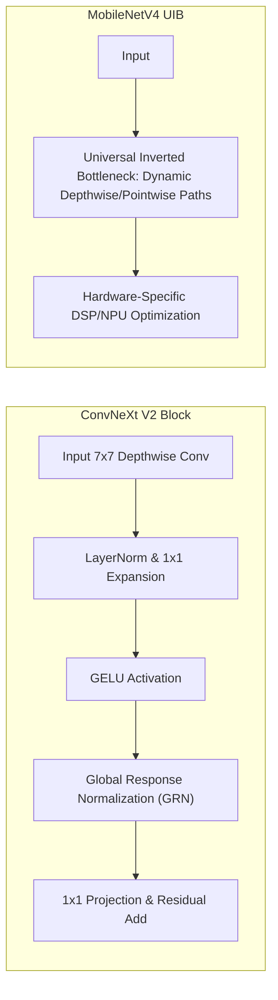

# 🔬 ConvNeXt V2 & MobileNetV4: Modern High-Performance ConvNets

## 1. Executive Brief & Significance
While Vision Transformers dominate massive cloud-scale training, pure Convolutional Networks (**ConvNets**) retain critical physical advantages in production:
- Inherent **translation equivariance** (no need for complex positional embeddings).
- Deterministic, low-overhead execution on edge DSPs, microcontrollers, and embedded NPUs without complex attention matrix caching.

**ConvNeXt V2** (Meta / UC Berkeley, 2023 / 2024) and **MobileNetV4** (Google, 2024) represent the modern renaissance of pure ConvNets, outperforming traditional ViTs at matching compute budgets through **Global Response Normalization (GRN)** and **Universal Inverted Bottlenecks (UIB)**.



---

## 2. Core Architectural Mechanics

### A. Global Response Normalization (GRN in ConvNeXt V2)
When pre-training ConvNets with self-supervised Masked Autoencoders (FCMAE), feature maps suffer from **feature collapse**: multiple channel dimensions become redundant and inactive.

ConvNeXt V2 introduces GRN to promote inter-channel competition without expensive attention matrices:
1. Compute channel-wise $L_2$-norm: $g_i = \|X_i\|_2$.
2. Compute relative division across all channels: $n_i = \frac{g_i}{\frac{1}{C}\sum_j g_j}$.
3. Calibrate activations with learnable scaling $\gamma$ and bias $\beta$:
   $$\hat{X}_i = \gamma \cdot (X_i \odot n_i) + \beta + X_i$$

### B. Universal Inverted Bottleneck (UIB in MobileNetV4)
MobileNetV4 unifies Inverted Bottlenecks (IB), ConvNeXt blocks, and Extra Depthwise (ExtraDW) modules into a single structural search space (UIB). Depending on whether the target hardware is a mobile CPU, Qualcomm Hexagon DSP, Apple Neural Engine, or NVIDIA Tensor Core GPU, UIB instantiates the exact kernel path that achieves peak arithmetic throughput.

---

## Granular Component-by-Component Architectural Breakdown

### Architectural Taxonomy & Structural Elements

| Architectural Stage | Component Identity | Structural Specification & Type | Attention / Conv Mechanics | Receptive Field & Resolution |
| :--- | :--- | :--- | :--- | :--- |
| **Architectural Paradigm** | **Pure Modern Hierarchical ConvNet** | Inverted Bottleneck + Depthwise Convolutions + Response Normalization | Large $7\times 7$ / $5\times 5$ Depthwise Separable Convolutions + GRN | Input Image ($H \times W \times 3$) $\to$ Hierarchical Pyramids / Class Logits |
| **Backbone (ConvNeXt V2)**| **4-Stage ConvNeXt V2 Engine** | Patchify Stem ($4\times 4$, stride 4) + Stages $C_1-C_4$ ($[96, 192, 384, 768]$) | $7\times 7$ Depthwise Conv $\to$ LN $\to$ $1\times 1$ Conv ($4\times$) $\to$ GELU $\to$ GRN $\to$ $1\times 1$ Conv | Hierarchical feature maps at $1/4, 1/8, 1/16, 1/32$ resolution |
| **Backbone (MobileNetV4)** | **Universal Inverted Bottleneck (UIB)** | 5-Stage UIB Search Space (ExtraDW, IB, Conv, FusedIB) | Hardware-adaptive $3\times 3$ / $5\times 5$ Depthwise & Pointwise convolutions | Mobile-optimized scales $1/2, 1/4, 1/8, 1/16, 1/32$ |
| **Neck / Aggregator** | **Global Pooling / Downstream FPN** | Classification: Global Average Pooling (GAP); Dense: FPN / PANet | Spatial mean reduction ($H/32 \times W/32 \to 1\times 1$) or multi-scale lateral $1\times 1$ convs | Collapses spatial dimensions to $1\text{D}$ embedding vector ($D=768\dots 1536$) |
| **Encoder** | **Pure Convolutional Encoder** | Hierarchical Residual ConvNet Blocks | Translation equivariant local convolution without quadratic MHSA | Large effective receptive field (ERF) matching Swin Transformers |
| **Decoder / Head** | **Linear / Dense Convolutional Head** | Classification: LayerNorm + Linear Classifier; Dense: Decoupled Conv | Direct linear mapping $\mathbb{R}^{C \to K}$ or multi-scale convolutional detection heads | Class distribution ($K=1000$) or dense spatial bounding box/mask maps |

### Structural Deep-Dive: ConvNeXt V2 and MobileNetV4 Mechanics
1. **Backbone & Stem**:
   - *ConvNeXt V2*: Adopts a ViT-style non-overlapping patchification stem ($4\times 4$ convolution, stride 4, followed by LayerNorm), immediately projecting $H \times W \times 3$ to $H/4 \times W/4 \times C$. Subsequent stages downsample via separate $2\times 2$ stride-2 convolutions.
   - *MobileNetV4*: Uses Universal Inverted Bottlenecks (UIB) with flexible operator ordering (e.g. Extra Depthwise before expansion for DSPs, standard Inverted Bottleneck for GPUs, or FusedIB for high memory-bandwidth CPUs).
2. **Inverted Bottleneck with GRN (ConvNeXt V2)**:
   Each block consists of:
   - $7\times 7$ depthwise convolution (large spatial receptive field with minimal FLOPs).
   - LayerNorm over channels.
   - $1\times 1$ pointwise convolution expanding channel depth by $4\times$.
   - GELU non-linearity.
   - **Global Response Normalization (GRN)**: Computes $L_2$ channel norms, normalizes across channels, and scales features to prevent channel dead-zones.
   - $1\times 1$ pointwise convolution projecting back to original dimension $C$, merged via residual addition.
3. **Neck / Feature Aggregator**: 
   - For classification: Spatial Global Average Pooling (GAP) reduces the $H/32 \times W/32 \times C$ tensor to a $1\times 1 \times C$ embedding.
   - For downstream object detection (e.g. [[architectures/real-time-detectors-and-segmenters/yolov12|YOLOv12]] or [[topics/object-detection/00-object-detection-moc|Object Detection]] backbones): Multi-scale features $C_2, C_3, C_4$ feed into standard FPN/PANet feature aggregators.
4. **Decoder / Prediction Head**: In classification, a LayerNorm followed by a single linear projection produces logits for $K$ classes. In dense downstream tasks, convolutional heads perform bounding box regression and classification directly on the FPN features.

### Parameter & Computational Latency Distribution

| Stage / Subsystem (ConvNeXt V2-Base) | Parameter Share (%) | Inference Latency (%) | Computational Complexity ($\text{FLOPs}$) | Dominant Hardware Bottleneck |
| :--- | :--- | :--- | :--- | :--- |
| **Patchify Stem ($4\times 4$ Conv)** | <1% | ~2% | $\mathcal{O}(H W C_{\text{in}} C_1 / 16)$ | Memory bandwidth bound |
| **Stages 1 & 2 ($1/4, 1/8$ Pyramids)** | ~12% | ~32% | $\mathcal{O}(H W C^2)$ (High-resolution Conv2D) | Memory bandwidth & cache locality |
| **Stages 3 & 4 ($1/16, 1/32$ Depth)** | ~83% | ~60% | $\mathcal{O}(H W C^2)$ (Deep Inverted Bottlenecks) | Tensor Core GEMM compute bound |
| **GAP & Linear Classifier Head** | ~4% | ~6% | $\mathcal{O}(C_{\text{final}} \cdot K)$ | Memory bandwidth / host transfer |

| Stage / Subsystem (MobileNetV4-Conv) | Parameter Share (%) | Inference Latency (%) | Computational Complexity ($\text{FLOPs}$) | Dominant Hardware Bottleneck |
| :--- | :--- | :--- | :--- | :--- |
| **Fused Conv Stem** | ~2% | ~5% | $\mathcal{O}(H W C_{\text{stem}})$ | High-resolution memory bandwidth |
| **UIB Stages 1–3 (Early/Mid)** | ~25% | ~45% | $\mathcal{O}(H W \cdot K^2 \cdot C)$ (Depthwise/Pointwise) | SRAM cache and memory bandwidth |
| **UIB Stages 4–5 (Late Depth)** | ~68% | ~44% | $\mathcal{O}(H W \cdot C^2)$ (Pointwise Expansions) | Arithmetic intensity & ALU throughput |
| **Classifier Head** | ~5% | ~6% | $\mathcal{O}(C_{\text{final}} \cdot K)$ | Host transfer & final reduction |
---

## 3. Quantitative SOTA Benchmark Profile (ImageNet-1K)

| Model Architecture | Parameters | GFLOPs | ImageNet-1K Top-1 | Mobile NPU Latency (ms) | TensorRT FP16 (RTX 4090) | Open License |
| :--- | :--- | :--- | :--- | :--- | :--- | :--- |
| **MobileNetV4-Conv-Small**  | 3.8 M | 0.2 G | 74.6% | 0.42 ms | 0.35 ms | Apache-2.0 |
| **MobileNetV4-Conv-Medium** | 9.7 M | 0.9 G | 82.3% | 0.98 ms | 0.85 ms | Apache-2.0 |
| **ConvNeXt V2-Nano**        | 15.6 M | 2.5 G | 82.1% | 2.10 ms | 1.40 ms | Apache-2.0 |
| **ConvNeXt V2-Base**        | 89.0 M | 15.4 G | 86.8% | 14.50 ms | 6.20 ms | Apache-2.0 |
| **ConvNeXt V2-Huge**        | 660.0 M | 115.0 G | 88.9% (SOTA)| 75.00 ms | 12.40 ms | Apache-2.0 |

---

## 4. Engineering Implementation with `timm`

Ross Wightman's **`timm` (PyTorch Image Models)** is the global production standard for loading, training, and exporting these models:

```python
import timm
import torch

# List available pre-trained SOTA checkpoints
# ['mobilenetv4_conv_medium.e500_r256_in1k', 'convnextv2_base.fcmae_ft_in22k_in1k']
model = timm.create_model('convnextv2_base.fcmae_ft_in22k_in1k', pretrained=True, num_classes=1000)
model.eval().cuda()

dummy_tensor = torch.randn(1, 3, 224, 224, device="cuda")

# Seamless ONNX export
torch.onnx.export(
    model,
    dummy_tensor,
    "convnext_v2_base.onnx",
    input_names=["input"],
    output_names=["logits"],
    opset_version=17
)
```

---

## 5. Commercial Usability & License Audit
- **License**: **Apache-2.0**
- **Commercial Permissibility**: Permitted for commercial products, edge IoT cameras, mobile apps, and industrial automation without open-source requirements.
- **Official Repositories**:
  - `timm`: [https://github.com/huggingface/pytorch-image-models](https://github.com/huggingface/pytorch-image-models)
  - `ConvNeXt-V2`: [https://github.com/facebookresearch/ConvNeXt-V2](https://github.com/facebookresearch/ConvNeXt-V2)
