# 🔬 ConvNeXt V2: Co-designing Pure ConvNets and Masked Autoencoders with Global Response Normalization

## 1. Executive Brief & Significance

While Vision Transformers (ViTs) dominated self-supervised visual representation learning via Masked Autoencoders (MAE), pure Convolutional Networks (ConvNets) long struggled with masked image modeling. When standard ConvNets (such as ConvNeXt V1) are trained with masked autoencoding, they suffer from **feature collapse**: a phenomenon where feature representations across convolutional channels become redundant, dead, and inactive, causing severe optimization degradation.

**ConvNeXt V2** (Woo et al., Meta FAIR / UC Berkeley, CVPR 2023) fundamentally resolved this limitation through the co-design of a **Fully Convolutional Masked Autoencoder (FCMAE)** and a novel channel calibration mechanism: **Global Response Normalization (GRN)**. Key breakthroughs include:
- **Global Response Normalization (GRN)**: Introduces inter-channel feature competition without expensive quadratic attention matrices, preventing feature collapse and maximizing channel diversity.
- **Pure Convolutional Masked Pre-training (FCMAE)**: Employs sparse convolutional operations that process only unmasked visual patches, reducing pre-training compute by up to $3\times$.
- **Unified Scaling Hierarchy**: Scales seamlessly from ultra-lightweight mobile backbones (**Atto**: $3.7\text{M}$ parameters) to workstation foundation backbones (**Huge**: $660\text{M}$ parameters), achieving up to **$88.9\%$ Top-1** accuracy on ImageNet-1K.

```mermaid
flowchart TD
    subgraph FCMAE_Pretraining ["Fully Convolutional Masked Autoencoder (FCMAE)"]
        RawImage["Input Image: I in R^(3 x H x W)"] --> MaskGenerator["Sparse Masking (60% Masking Ratio)"]
        MaskGenerator --> SparseEncoder["Sparse ConvNeXt V2 Encoder (Unmasked Patches Only)"]
        SparseEncoder --> DenseDecoder["Lightweight ConvNeXt Decoder + Mask Tokens"]
        DenseDecoder --> ReconLoss["MSE Reconstruction Loss on Pixel Values"]
    end

    subgraph ConvNeXt_V2_Block_Detail ["ConvNeXt V2 Inverted Bottleneck with GRN"]
        InBlock["Input Feature Tensor: X in R^(B x H x W x C)"] --> DWConv["7x7 Depthwise Convolution (Spatial Filtering)"]
        DWConv --> LN["LayerNorm (Channels-First / Channels-Last)"]
        LN --> Pointwise1["1x1 Pointwise Convolution (Channel Expansion 4x)"]
        Pointwise1 --> GELU_Act["GELU Activation"]
        GELU_Act --> GRN_Module["Global Response Normalization (GRN) Channel Calibration"]
        GRN_Module --> Pointwise2["1x1 Pointwise Convolution (Channel Projection back to C)"]
        Pointwise2 --> ResidualAdd["Residual Add: X + Block(X)"]
    end

    subgraph Downstream_Perception ["Universal Downstream Adaptation"]
        ResidualAdd --> ImageNetCls["ImageNet-1K Classification Head (Top-1 88.9%)"]
        ResidualAdd --> COCO_FPN["COCO Object Detection / Instance Seg (Mask R-CNN / Cascade)"]
        ResidualAdd --> ADE20K_UperNet["ADE20K Semantic Segmentation (UperNet)"]
    end
```



---

## 2. Mathematical Foundations & Global Response Normalization (GRN)

### A. The Feature Collapse Phenomenon
During self-supervised masked autoencoder pre-training, pure convolutional networks tend to produce saturated, highly collinear activation patterns across channel dimensions:
$$\text{Sim}(X_i, X_j) = \frac{\langle X_i, X_j \rangle}{\|X_i\|_2 \|X_j\|_2} \to 1.0 \quad \text{for } i \neq j$$
This redundancy creates "dead channels" that fail to encode diverse geometric and semantic visual features.

---

### B. Global Response Normalization (GRN) Formulation
To promote feature diversity without introducing multi-head self-attention, GRN enforces global channel-wise contrastive normalization in three distinct steps:

1. **Global Feature Aggregation**:
   Computes the spatial $L_2$-norm for each individual channel feature map $X_i \in \mathbb{R}^{H \times W}$:
   $$g_i = \|X_i\|_2 = \sqrt{\sum_{h=1}^H \sum_{w=1}^W X_i(h, w)^2} \in \mathbb{R}$$
   Yielding a global channel representation vector $\mathbf{g} = [g_1, g_2, \dots, g_C]^T \in \mathbb{R}^C$.

2. **Feature Normalization**:
   Calculates the relative response of channel $i$ with respect to the average norm across all $C$ channels:
   $$n_i = \frac{g_i}{\frac{1}{C}\sum_{j=1}^C g_j} \in \mathbb{R}$$
   Channels with high activation magnitude receive $n_i > 1.0$, while suppressed channels receive $n_i < 1.0$.

3. **Feature Calibration & Residual Gating**:
   Modulates the input activations using learned scale parameter $\gamma \in \mathbb{R}^C$ (initialized to zero) and bias parameter $\beta \in \mathbb{R}^C$:
   $$\hat{X}_i = \gamma_i \cdot (X_i \odot n_i) + \beta_i + X_i$$

Because $\gamma$ is initialized to 0, the GRN layer initially acts as an identity pass-through, ensuring stable gradient flow during early optimization.

---

## 3. Granular Component-by-Component Architectural Breakdown

| Architectural Stage | Component Identity | Structural Specification & Type | Attention / Conv Mechanics | Receptive Field & Dimensionality |
| :--- | :--- | :--- | :--- | :--- |
| **Architectural Paradigm** | **Pure Modern ConvNet** | 4-Stage Inverted Bottleneck Hierarchy with GRN | Large $7\times 7$ Depthwise Convolutions + Pointwise MLPs | Multi-scale pyramid: $1/4, 1/8, 1/16, 1/32$ |
| **Stem Embedding** | **Patchify Stem** | $4 \times 4$ Conv2D (Stride 4) + LayerNorm | Non-overlapping patch projection | Input $[3, H, W] \to [C=128, H/4, W/4]$ |
| **Stage 1 (C1)** | **ConvNeXt V2 Stage 1** | $L_1=3$ Blocks, $C_1=128$ | $7\times 7$ Depthwise Conv $\to$ LN $\to 1\times 1$ ($4\times$) $\to$ GELU $\to$ GRN $\to 1\times 1$ | High spatial resolution $H/4 \times W/4$ |
| **Stage 2 (C2)** | **ConvNeXt V2 Stage 2** | $L_2=3$ Blocks, $C_2=256$ | $7\times 7$ Depthwise Conv + GRN feature calibration | Intermediate scale $H/8 \times W/8$ |
| **Stage 3 (C3)** | **Deep Core Stage 3** | $L_3=27$ Blocks, $C_3=512$ (in Base) | Deepest representation stage ($\approx 60\%$ params) | Deep semantic features at $H/16 \times W/16$ |
| **Stage 4 (C4)** | **Stage 4** | $L_4=3$ Blocks, $C_4=1024$ | Large receptive field semantic abstraction | Low resolution $H/32 \times W/32$ |
| **Classifier Head** | **GAP & Linear Layer** | Global Average Pooling + LayerNorm + Linear Classifier | Spatial mean reduction $\to \mathbb{R}^{1024}$ | Class logits $\mathbb{R}^{K=1000}$ |

---

## 4. Quantitative SOTA Benchmark Profile

### Model Scaling Hierarchy & ImageNet-1K Performance

| Model Variant | Parameters | GFLOPs | ImageNet-1K Top-1 | TensorRT FP16 (RTX 4090) | Mobile NPU Latency |
| :--- | :--- | :--- | :--- | :--- | :--- |
| **ConvNeXt V2-Atto** | 3.7 M | 0.6 G | 76.7% | **0.45 ms** | **0.55 ms** |
| **ConvNeXt V2-Femto** | 5.2 M | 0.8 G | 78.5% | **0.62 ms** | **0.78 ms** |
| **ConvNeXt V2-Pico** | 9.1 M | 1.4 G | 80.3% | **0.95 ms** | **1.20 ms** |
| **ConvNeXt V2-Nano** | 15.6 M | 2.5 G | 82.1% | **1.40 ms** | **2.10 ms** |
| **ConvNeXt V2-Tiny** | 28.6 M | 4.5 G | 83.0% | **2.20 ms** | **3.80 ms** |
| **ConvNeXt V2-Base** | 89.0 M | 15.4 G | **86.8%** | **6.20 ms** | **14.50 ms** |
| **ConvNeXt V2-Large** | 198.0 M | 34.4 G | **87.3%** | **11.50 ms** | 28.00 ms |
| **ConvNeXt V2-Huge** | 660.0 M | 115.0 G | **88.9% (SOTA)**| **18.40 ms** | 75.00 ms |

---

## 5. Engineering Implementation: Complete PyTorch Block with GRN

```python
"""
PyTorch Implementation of ConvNeXt V2 Block with Global Response Normalization (GRN).
"""

import torch
import torch.nn as nn
import torch.nn.functional as F


class GRN(nn.Module):
    """
    Global Response Normalization (GRN) layer.
    Promotes channel feature competition without attention matrices.
    """
    def __init__(self, dim: int, eps: float = 1e-6):
        super().__init__()
        self.gamma = nn.Parameter(torch.zeros(1, 1, 1, dim))
        self.beta = nn.Parameter(torch.zeros(1, 1, 1, dim))
        self.eps = eps

    def forward(self, x: torch.Tensor) -> torch.Tensor:
        """
        x: [B, H, W, C] (Channels-last format)
        """
        # Step 1: Global spatial L2 norm per channel
        Gx = torch.norm(x, p=2, dim=(1, 2), keepdim=True)  # [B, 1, 1, C]
        
        # Step 2: Normalize across channel dimension
        Nx = Gx / (Gx.mean(dim=-1, keepdim=True) + self.eps)  # [B, 1, 1, C]
        
        # Step 3: Calibrate and residual scale
        return self.gamma * (x * Nx) + self.beta + x


class ConvNeXtV2Block(nn.Module):
    """
    ConvNeXt V2 Inverted Bottleneck Block with 7x7 Depthwise Conv and GRN.
    """
    def __init__(self, dim: int, drop_path: float = 0.0):
        super().__init__()
        # 7x7 Depthwise Convolution
        self.dwconv = nn.Conv2d(dim, dim, kernel_size=7, padding=3, groups=dim)
        self.norm = nn.LayerNorm(dim, eps=1e-6)
        
        # Pointwise Expansion (1x1 Conv, 4x expansion)
        self.pwconv1 = nn.Linear(dim, 4 * dim)
        self.act = nn.GELU()
        
        # Global Response Normalization
        self.grn = GRN(4 * dim)
        
        # Pointwise Projection (1x1 Conv, back to dim)
        self.pwconv2 = nn.Linear(4 * dim, dim)

    def forward(self, x: torch.Tensor) -> torch.Tensor:
        """
        x: [B, C, H, W]
        """
        input_tensor = x
        
        # 1. Depthwise convolution
        x = self.dwconv(x)
        
        # 2. Permute to channels-last for LayerNorm & Linear layers
        x = x.permute(0, 2, 3, 1)  # [B, H, W, C]
        x = self.norm(x)
        
        # 3. Inverted Bottleneck with GRN
        x = self.pwconv1(x)
        x = self.act(x)
        x = self.grn(x)
        x = self.pwconv2(x)
        
        # 4. Permute back to channels-first
        x = x.permute(0, 3, 1, 2)  # [B, C, H, W]
        
        # 5. Residual connection
        return input_tensor + x
```

---

## 6. References & Official Resources
- **ConvNeXt V2 Paper**: [ConvNeXt V2: Co-designing and Scaling ConvNets with Masked Autoencoders (CVPR 2023)](https://arxiv.org/abs/2301.00808)
- **Official Meta GitHub Repository**: [https://github.com/facebookresearch/ConvNeXt-V2](https://github.com/facebookresearch/ConvNeXt-V2)
- **`timm` Pretrained Weights**: [https://github.com/huggingface/pytorch-image-models](https://github.com/huggingface/pytorch-image-models)
