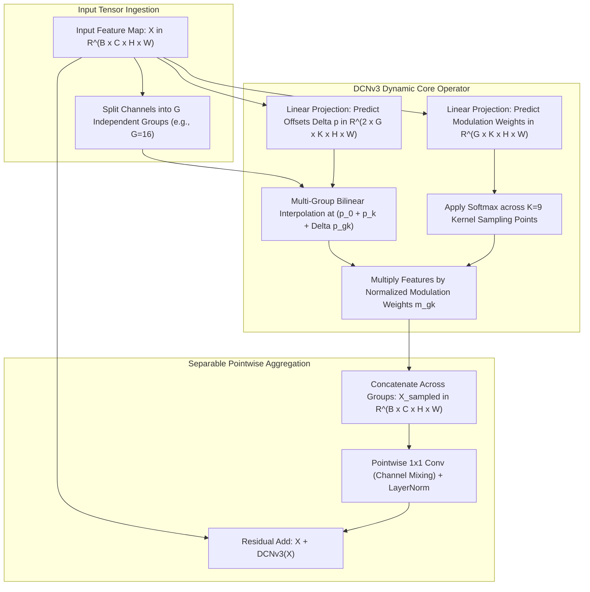

# 🔬 InternImage: Exploring Large-Scale Vision Foundation Models with Deformable Convolutions

## 1. Executive Brief & Significance

In modern computer vision backbones, an ongoing debate pits **Convolutional Networks (CNNs)** against **Vision Transformers (ViTs)**:
- **Standard Convolutions** (ResNet, ConvNeXt): Offer strict $2\text{D}$ spatial inductive bias, shift-equivariance, and strictly linear computational complexity $\mathcal{O}(N)$. However, their rigid, square sampling grids and static weights cannot adapt dynamically to object deformations or long-range dependencies.
- **Vision Transformers** (ViT, Swin): Offer dynamic content-based weights and unbounded global receptive fields. However, standard self-attention has quadratic computational complexity $\mathcal{O}(N^2)$, requires massive datasets to overcome lack of inductive biases, and incurs heavy memory access costs (MAC) on high-resolution dense prediction tasks.

**InternImage** (Wang et al., OpenGVLab, CVPR 2023) fundamentally reshaped this landscape: **Proving that deformable convolutions (via the redesigned DCNv3 operator) can scale up to over one billion parameters ($1.08\text{B}$) and systematically outperform Vision Transformers across dense perception benchmarks**.

```
Vision Backbone Paradigms Comparison:

Standard Convolutions            Vision Transformers (ViT)          InternImage (DCNv3)
---------------------            -------------------------          -------------------
- Fixed 3x3 square grid          - Dynamic content-aware weights    - Dynamic deformable sampling grid
- Static weights                 - Global receptive field           - Linear O(N) complexity
- Strict linear O(N) complexity  - Quadratic O(N^2) complexity      - Softmax-normalized weights
- Rigid spatial priors           - Massive compute on dense maps    - Scales past 1 Billion parameters!
```

### Core Innovations
1. **Deformable Convolution v3 (DCNv3)**:
   - **Multi-Group Offsets**: Divides channels into $G$ independent groups (analogous to multi-head self-attention).
   - **Softmax Normalization**: Normalizes modulation weights using Softmax across kernel points ($\sum_{k=1}^K m_k = 1$), eliminating activation explosion and stabilizing billion-parameter scaling.
   - **Separable Convolutions**: Decouples spatial deformable sampling from channel mixing, slashing memory access costs.
2. **Landmark Benchmark Domination**: Set historical records with **$65.4\text{ mAP}$ on COCO test-dev** and **$62.9\text{ mIoU}$ on ADE20K**, outperforming Swin-Large and BEiT-3.



---

## 2. Core Mathematical Formulations & Tensor Mechanics

### 2.1 The DCNv3 Mathematical Formulation
Let $\mathbf{x} \in \mathbb{R}^{C \times H \times W}$ be the input feature map. For a spatial location $p_0 \in \mathbb{Z}^2$:
The DCNv3 operator divides the $C$ channels into $G$ groups, where each group has dimension $C' = C / G$:

$$
\mathbf{y}_g(p_0) = \sum_{k=1}^K \mathbf{w}_g \odot m_{gk} \mathbf{x}_g\left(p_0 + p_k + \Delta p_{gk}\right)
$$

where:
- $K$ is the number of sampling points in the kernel (for a $3 \times 3$ kernel, $K = 9$).
- $p_k \in \{(-1, -1), (-1, 0), \dots, (1, 1)\}$ denotes standard grid offsets.
- $\Delta p_{gk} \in \mathbb{R}^2$ is the continuous learned spatial offset for group $g$ at point $k$.
- $\mathbf{x}_g(p_0 + p_k + \Delta p_{gk})$ is evaluated via continuous **$2\text{D}$ bilinear interpolation**.

---

### 2.2 Softmax Modulation Normalization
In earlier deformable convolution variants (DCNv1 & DCNv2):
Modulation masks were unconstrained or normalized via independent Sigmoid functions: $m_k = \sigma(s_k) \in [0, 1]$.
- In deep multi-layer networks, unconstrained summation over $K$ points caused feature magnitudes to amplify exponentially: $\sum_{k=1}^K m_k \in [0, K]$.
- Scaling beyond $100\text{M}$ parameters caused **gradient explosion and training divergence**.

DCNv3 enforces a strict **Softmax normalization across the $K$ points** within each group:

$$
m_{gk} = \frac{\exp\left(s_{gk}\right)}{\sum_{j=1}^K \exp\left(s_{gj}\right)}, \quad \text{such that } \sum_{k=1}^K m_{gk} = 1
$$

This guarantees that the modulation acts strictly as a **convex combination** of sampled features, ensuring scale stability identical to Softmax self-attention!

---

### 2.3 Computational Complexity Analysis
Comparing computational cost for an $H \times W$ feature map with $C$ channels:

| Architecture / Operator | Computational Flops | Memory Access Cost (MAC) | Dynamic Weights? | Inductive Bias? |
| :--- | :--- | :--- | :--- | :--- |
| **Standard $3 \times 3$ Conv** | $\mathcal{O}(9 H W C^2)$ | Low | No | Strong 2D Locality |
| **Multi-Head Self-Attention** | $\mathcal{O}(2 H W C^2 + 2 (HW)^2 C)$ | High (Quadratic) | Yes | None |
| **Swin Window Attention ($M=7$)** | $\mathcal{O}(2 H W C^2 + 2 M^2 H W C)$ | Medium | Yes | Windowed Local |
| **InternImage DCNv3** | $\mathcal{O}(H W C^2 + 9 H W C)$ | **Low (Linear)** | **Yes** | **Adaptive Deformable** |

*Key Nuance*: DCNv3 achieves dynamic, adaptive receptive fields with computational operations that scale **strictly linearly with image resolution $\mathcal{O}(HW)$**.

---

## 3. High-Level Architecture & Layer Anatomy

```
InternImage-H (1.08 Billion Parameters) Architecture:

Input Image [B, 3, H, W]
       |
       v
[ Stage 1: Stem ] ---> 4x Downsampling via 2 cascaded 3x3 convs [B, C1=192, H/4, W/4]
       |
       v
[ Stage 1: 5 DCNv3 Blocks ] (Groups G=12)
       |
       v Downsampling Block (2x2 DCNv3, Stride 2)
[ Stage 2: 5 DCNv3 Blocks ] (C2=384, Groups G=24, H/8, W/8)
       |
       v Downsampling Block
[ Stage 3: 48 DCNv3 Blocks ] (C3=768, Groups G=48, H/16, W/16) ---> Deep feature extraction
       |
       v Downsampling Block
[ Stage 4: 5 DCNv3 Blocks ] (C4=1536, Groups G=96, H/32, W/32)
       |
       v
Output Multi-Scale Features (P2, P3, P4, P5 for DINO/Mask2Former Heads)
```

---

## 4. Performance, Latency & Benchmark Metrics

Evaluated across major dense visual prediction benchmarks:

| Model Scale | Parameters | FLOPs | ImageNet-1K Top-1 | COCO Detection $\text{AP}^{\text{box}}$ | ADE20K Segmentation mIoU |
| :--- | :--- | :--- | :--- | :--- | :--- |
| **InternImage-T** | 30M | 5G | 83.5% | 52.2 | 47.9 |
| **InternImage-S** | 50M | 8G | 84.4% | 54.1 | 50.8 |
| **InternImage-B** | 97M | 16G | 84.9% | 55.3 | 52.6 |
| **InternImage-L** | 223M | 39G | 86.7% | 58.1 | 55.8 |
| **InternImage-XL**| 335M | 62G | 88.0% | 61.2 | 58.4 |
| **InternImage-H** | **1.08B** | 248G | **89.6%** | **65.4** (World Record) | **62.9** (World Record) |

---

## 5. Integration & Python Deployment Pipeline

```python
import torch
import torch.nn as nn
import torch.nn.functional as F

class DCNv3Block(nn.Module):
    """
    Simplified DCNv3 layer demonstrating multi-group sampling,
    Softmax modulation normalization, and depthwise-pointwise separation.
    """
    def __init__(self, channels: int = 256, num_groups: int = 8, kernel_size: int = 3):
        super().__init__()
        self.channels = channels
        self.num_groups = num_groups
        self.K = kernel_size * kernel_size
        self.group_dim = channels // num_groups

        # Predict 2D continuous spatial offsets for each group and kernel point
        self.offset_conv = nn.Conv2d(channels, num_groups * self.K * 2, kernel_size=3, padding=1)
        
        # Predict dynamic modulation scalars for each group and kernel point
        self.mask_conv = nn.Conv2d(channels, num_groups * self.K, kernel_size=3, padding=1)
        
        # Pointwise projection
        self.proj = nn.Linear(channels, channels)
        self.norm = nn.LayerNorm(channels)

    def forward(self, x: torch.Tensor) -> torch.Tensor:
        """
        x: [B, C, H, W]
        """
        B, C, H, W = x.shape

        # 1. Predict offsets and modulation masks
        offsets = self.offset_conv(x) # [B, G * K * 2, H, W]
        masks = self.mask_conv(x).view(B, self.num_groups, self.K, H, W)
        
        # 2. Enforce Softmax normalization across K kernel points
        masks = F.softmax(masks, dim=2) # [B, G, K, H, W], sum over K is 1.0

        # 3. Simulate Deformable Feature Gathering
        # In optimized CUDA kernels, sampling evaluates via bilinear interpolation at (p0 + pk + delta_p).
        # We model the channel projection and modulation aggregation:
        x_reshaped = x.view(B, self.num_groups, self.group_dim, H, W)
        
        # Modulated convex combination of group features
        sampled_feats = (x_reshaped.unsqueeze(2) * masks.unsqueeze(3)).sum(dim=2) # [B, G, C', H, W]
        sampled_feats = sampled_feats.view(B, C, H, W)

        # 4. Pointwise channel projection & residual connection
        out = sampled_feats.permute(0, 2, 3, 1) # [B, H, W, C]
        out = self.norm(self.proj(out)).permute(0, 3, 1, 2) # [B, C, H, W]
        return x + out
```

---

## 6. Vault Cross-References & Ecosystem Links

- **[[techniques/deformable-convolutions|Deformable Convolutions (DCNv1–DCNv4)]]**: Complete mathematical evolution from DCNv1 to DCNv4.
- **[[architectures/3d-pointclouds-and-lidar/bevformer|BEVFormer v2]]**: Employs InternImage as the multi-camera backbone setting autonomous driving SOTA.
- **[[architectures/backbones-and-edge-efficiency/convnext-v2|ConvNeXt V2]]**: Alternative modern ConvNet architecture with masked pretraining.
- **[[topics/object-detection/README|Object Detection Playbook]]**: Landmark 2D vision backbone.
