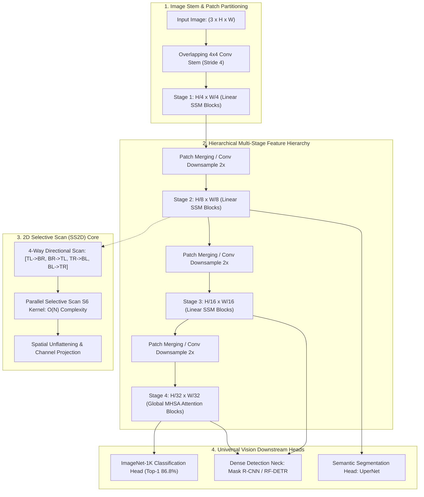
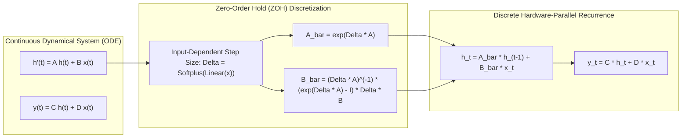
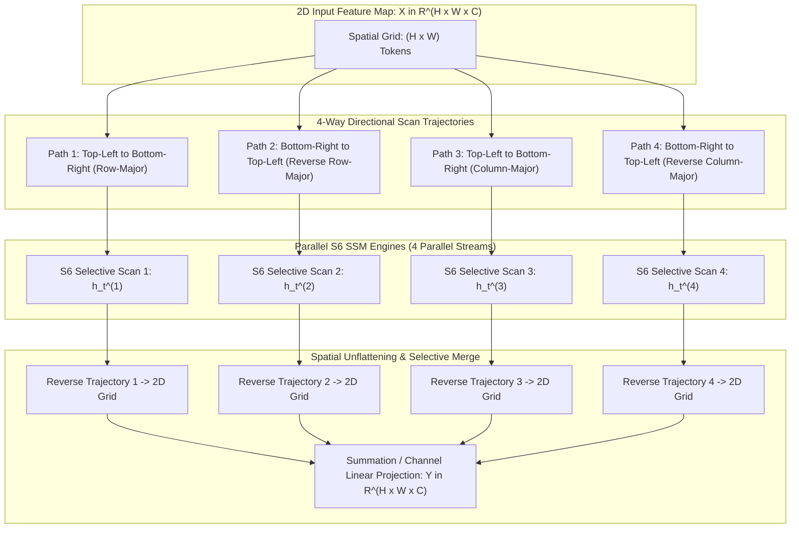
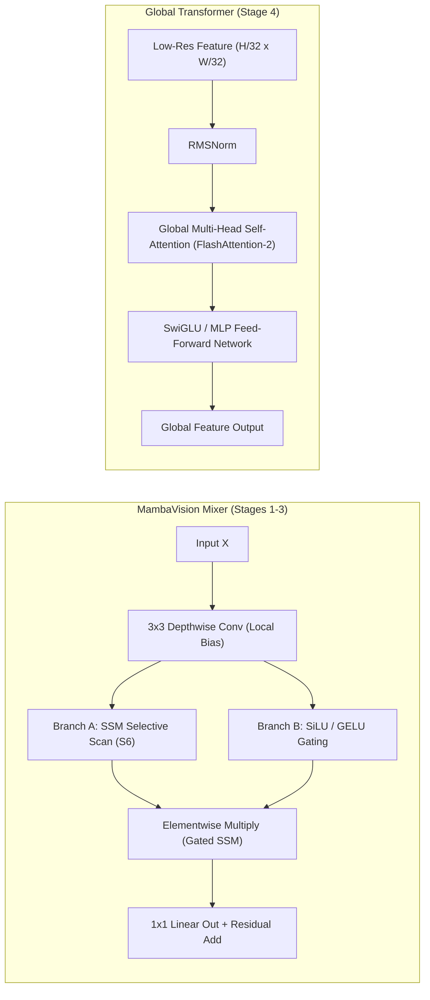
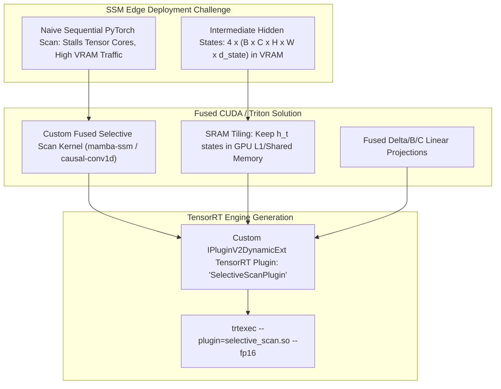
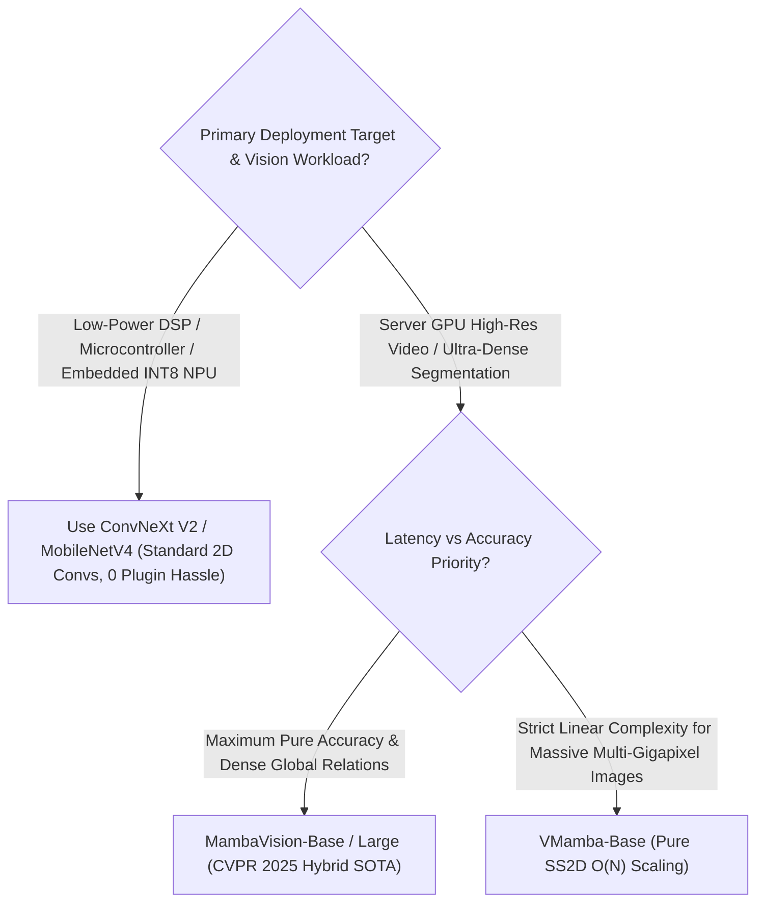

# 🐍 MambaVision & VMamba: Visual State-Space Foundation Backbones

## 1. Executive Summary & Paradigm Shift

For years, visual perception architectures have been defined by a fundamental tension between two dominant paradigms:
1. **Convolutional Neural Networks (CNNs)** (e.g., [[architectures/backbones-and-edge-efficiency/convnext-and-mobilenet|ConvNeXt V2 & MobileNetV4]]): Highly efficient, hardware-friendly linear complexity $\mathcal{O}(N)$ with strong inductive biases (translation equivariance and local locality), but constrained by bounded effective receptive fields.
2. **Vision Transformers (ViTs)** (e.g., [[architectures/vision-foundation-models/dinov2-and-dinov3|DINOv2]], Swin Transformer): Unbounded global receptive fields and dynamic data-dependent routing, but burdened by quadratic computational and memory complexity $\mathcal{O}(N^2)$ with respect to spatial token length $N = H \times W$.

**Visual State-Space Models (SSMs)**—spearheaded by **VMamba** (*Visual Mamba*, NeurIPS 2024 Spotlight / Liu et al.) and **MambaVision** (*Hybrid Mamba-Transformer Vision Backbone*, CVPR 2025 / Hatamizadeh & Kautz, NVIDIA)—resolve this dichotomy. By formulating visual feature processing through continuous state-space dynamical systems discretized via the **2D Selective Scan (SS2D)** and **Hybrid SSM-Transformer Stages**, these architectures achieve **global receptive fields with strictly linear $\mathcal{O}(N)$ computational complexity**.



---

## 2. Granular Component-by-Component Architectural Breakdown

| Architectural Component | Technical Specification | VMamba-Base (NeurIPS 2024) | MambaVision-Base (CVPR 2025) | Parameter Distribution (%) | Compute / Latency Distribution (%) |
| :--- | :--- | :--- | :--- | :--- | :--- |
| **Architectural Paradigm** | Pure 2D Selective SSM (VMamba) vs Hybrid SSM-Transformer (MambaVision) | Pure SS2D Visual State-Space Model across all 4 stages | Hybrid: SSM-Mixer (Stages 1–3) + Multi-Head Self-Attention (Stage 4) | $100\%$ Total ($89.0\text{M}$ / $98.0\text{M}$) | $100\%$ Total ($15.4\text{G}$ / $15.8\text{G}$) |
| **Patch Stem / Embedding** | Overlapping Convolutional Patch Stem | $4 \times 4$ Conv2D (Stride 4) + LayerNorm ($C=128$) | $4 \times 4$ Conv2D (Stride 4) + LayerNorm ($C=128$) | $< 1.0\%$ | $\approx 2.5\%$ of forward pass latency |
| **Stage 1 (P1, Stride 4)** | Linear SSM Mixer ($H/4 \times W/4$) | $L_1=2$ SS2D VSS Blocks, $C=128$ | $L_1=3$ MambaVision Mixer Blocks, $C=128$ | $\sim 5.2\%$ | $\approx 18.0\%$ of forward pass latency |
| **Stage 2 (P2, Stride 8)** | Linear SSM Mixer ($H/8 \times W/8$) | $L_2=2$ SS2D VSS Blocks, $C=256$ | $L_2=3$ MambaVision Mixer Blocks, $C=256$ | $\sim 12.4\%$ | $\approx 24.5\%$ of forward pass latency |
| **Stage 3 (P3, Stride 16)** | Deep Linear SSM Core ($H/16 \times W/16$) | $L_3=15$ SS2D VSS Blocks, $C=512$ | $L_3=7$ MambaVision Mixer Blocks, $C=512$ | $\sim 54.8\%$ | $\approx 42.0\%$ of forward pass latency |
| **Stage 4 (P4, Stride 32)** | Low-Res Global Context ($H/32 \times W/32$) | $L_4=2$ SS2D VSS Blocks, $C=1024$ | $L_4=4$ Global Transformer Blocks ($H=16, D=1024$) | $\sim 26.5\%$ | $\approx 11.5\%$ of forward pass latency |
| **Positional Encoding** | Implicit (Positional Free via 2D Scanning) | No explicit positional embedding (scan trajectory encodes geometry) | Implicit via Depthwise Convolutions; absolute PE omitted | $0\%$ | $0\%$ |
| **Normalization & Act** | LayerNorm / RMSNorm + SiLU / GELU | LayerNorm + SiLU gating inside SS2D | RMSNorm + GELU gating inside MambaVision mixer | $< 0.1\%$ | $\approx 1.5\%$ of forward pass |

---

## 3. Mathematical Foundations: Continuous & Discrete State-Space Systems



### A. Continuous State-Space Model (SSM) Formulation
Classical linear time-invariant (LTI) continuous state-space models map a 1D continuous input signal $x(t) \in \mathbb{R}$ through an intermediate hidden state $h(t) \in \mathbb{R}^N$ to an output signal $y(t) \in \mathbb{R}$ via a first-order differential equation system:

$$h'(t) = A h(t) + B x(t)$$
$$y(t) = C h(t) + D x(t)$$

Where:
- $A \in \mathbb{R}^{N \times N}$ is the state transition evolution matrix (typically initialized with HiPPO structured state matrices to memorize long temporal horizons).
- $B \in \mathbb{R}^{N \times 1}$ is the input projection matrix.
- $C \in \mathbb{R}^{1 \times N}$ is the output observation matrix.
- $D \in \mathbb{R}$ is the direct feedthrough skip connection (often simplified as $D=0$).

### B. Discretization via Zero-Order Hold (ZOH)
To execute continuous ODEs on digital computing architectures (GPUs and NPUs) over discrete token sequences $\{x_0, x_1, \dots, x_T\}$, the continuous parameters $(A, B)$ must be discretized with a step size $\Delta > 0$ using the **Zero-Order Hold (ZOH)** assumption:

$$\bar{A} = \exp(\Delta A)$$
$$\bar{B} = (\Delta A)^{-1} (\exp(\Delta A) - I) \cdot (\Delta B) \approx \Delta B$$

Under ZOH, the continuous system transforms into a discrete recurrent state equation:

$$h_t = \bar{A} h_{t-1} + \bar{B} x_t$$
$$y_t = C h_t + D x_t$$

### C. The Selective Scan Mechanism (S6)
Traditional SSMs (like S4) keep $A, B, C, \Delta$ static across all time steps, enabling global 1D convolution via Fast Fourier Transforms (FFT). However, static linear time invariance prevents the model from dynamically filtering out irrelevant background noise or selecting content-dependent features.

The **S6 (Selective State Space)** model makes $B, C,$ and $\Delta$ explicit functions of the current input token $x_t$:

$$B_t = \text{Linear}_B(x_t), \quad C_t = \text{Linear}_C(x_t), \quad \Delta_t = \text{Softplus}\left(\text{Linear}_\Delta(x_t) + \Delta_{\text{bias}}\right)$$
$$\bar{A}_t = \exp(\Delta_t A), \quad \bar{B}_t = \Delta_t B_t$$

Because $\bar{A}_t$ and $\bar{B}_t$ change at every token step $t$, the system can no longer be computed as a static convolution. Instead, it is evaluated using a hardware-fused **Parallel Associative Scan** kernel that runs in **$\mathcal{O}(T)$ linear time** and $\mathcal{O}(\log T)$ parallel step span on GPU SRAM.

---

## 4. 2D Selective Scan (SS2D) & Hybrid MambaVision Mechanics



### A. The 2D Selective Scan (SS2D) Module in VMamba
1D SSMs process sequential data with a natural causal temporal order (past $\to$ future). However, 2D images are non-causal and possess spatial correlations in all planar directions (horizontal, vertical, diagonal).

To bridge this 1D-to-2D gap without introducing quadratic self-attention matrices, **VMamba** introduces the **2D Selective Scan (SS2D)** module:
1. **4-Way Scan Expansion**: Given a 2D feature map $X \in \mathbb{R}^{H \times W \times C}$, SS2D flattens the spatial grid along 4 distinct trajectories:
   - **Scan 1 (Top-Left $\to$ Bottom-Right, Row-Major)**: Traverses $(h, w)$ sequentially from $(0,0)$ to $(H-1, W-1)$.
   - **Scan 2 (Bottom-Right $\to$ Top-Left, Reverse Row-Major)**: Traverses from $(H-1, W-1)$ back to $(0,0)$.
   - **Scan 3 (Top-Left $\to$ Bottom-Right, Column-Major)**: Traverses $(w, h)$ sequentially down vertical columns.
   - **Scan 4 (Bottom-Right $\to$ Top-Left, Reverse Column-Major)**: Traverses vertically upwards from bottom-right.
2. **Parallel S6 Evaluation**: Each 1D sequence of length $N = H \cdot W$ is processed independently through a dedicated S6 selective scan branch.
3. **Cross-Scan Feature Fusion**: The 4 output 1D feature sequences $\{Y_1, Y_2, Y_3, Y_4\}$ are reshaped back into 2D grids of shape $(H, W, C)$ and aggregated via element-wise summation and linear channel projection:

$$Y = \text{Linear}_{\text{out}}\left( \sum_{k=1}^4 \text{Unflatten}_k(Y_k) \right)$$

This allows every pixel $(h, w)$ to interact with all other pixels in the 2D plane through continuous intermediate hidden states while maintaining strict $\mathcal{O}(H \cdot W \cdot C)$ complexity.

### B. MambaVision Hybrid Architecture (CVPR 2025)
While pure SSMs (like VMamba and Vim) achieve linear complexity, empirical analysis reveals a critical structural trade-off:
- In early and intermediate stages (Stages 1–3), feature resolutions are large ($H/4 \times W/4$ to $H/16 \times W/16$). Here, SSMs provide enormous throughput advantages over ViTs with minimal loss of representational capacity.
- In the final stage (Stage 4), the spatial resolution is compact ($H/32 \times W/32 = 20 \times 20 = 400$ tokens for a $640 \times 640$ input). In this low-token regime, standard **Multi-Head Self-Attention (MHSA)** computes full all-to-all token affinities with negligible latency overhead while outperforming sequential recurrent scans at global semantic integration.

**MambaVision** implements this optimal hybrid hierarchy:
- **Stages 1–3**: Built with **MambaVision Mixer Blocks** combining $3 \times 3$ Depthwise Convolutions (for local inductive bias) and 1D/2D Selective Scans (for long-range context).
- **Stage 4**: Built with standard **Transformer Self-Attention Blocks** with FlashAttention-2 kernels to achieve maximum representational power at low resolution.



---

## 5. Quantitative Benchmark Profile & SOTA Comparison

### A. ImageNet-1K Classification & Hardware Throughput Matrix
Benchmarks evaluated on standard ImageNet-1K ($224 \times 224$ input resolution):
- **Throughput**: Measured on an **NVIDIA A100-SXM4-80GB GPU** (FP16, Batch Size 128).
- **Edge Latency**: Measured on an **NVIDIA Jetson AGX Orin 64GB** (TensorRT FP16, Batch Size 1).

| Model Architecture | Parameters (M) | FLOPs (G) | ImageNet Top-1 (%) | A100 Throughput (img/s) | Jetson Orin Latency (ms) | Complexity Class |
| :--- | :--- | :--- | :--- | :--- | :--- | :--- |
| DeiT-III-S | $22.0$ | $4.6$ | $81.4$ | $2,420$ | $4.85\text{ ms}$ | $\mathcal{O}(N^2)$ Quadratic ViT |
| Swin-T | $28.3$ | $4.5$ | $81.3$ | $1,850$ | $5.90\text{ ms}$ | $\mathcal{O}(N \cdot W^2)$ Window ViT |
| ConvNeXt-T | $28.6$ | $4.5$ | $82.1$ | $2,980$ | $3.20\text{ ms}$ | $\mathcal{O}(N)$ Pure ConvNet |
| Vim-S (Vision Mamba) | $26.0$ | $4.8$ | $80.5$ | $1,620$ | $6.40\text{ ms}$ | $\mathcal{O}(N)$ Bidirectional 1D SSM |
| **VMamba-T** | $22.0$ | $4.5$ | **$82.2$** | $1,780$ | $5.10\text{ ms}$ | $\mathcal{O}(N)$ Pure SS2D SSM |
| **MambaVision-T** | $24.0$ | $4.4$ | **$82.3$** | **$3,150$** | **$3.10\text{ ms}$** | $\mathcal{O}(N)$ Hybrid SSM-ViT |
| Swin-S | $50.0$ | $8.7$ | $83.0$ | $1,180$ | $9.80\text{ ms}$ | $\mathcal{O}(N \cdot W^2)$ Window ViT |
| ConvNeXt-S | $50.0$ | $8.7$ | $83.4$ | $1,920$ | $5.80\text{ ms}$ | $\mathcal{O}(N)$ Pure ConvNet |
| **VMamba-S** | $44.0$ | $8.8$ | **$83.5$** | $1,120$ | $8.60\text{ ms}$ | $\mathcal{O}(N)$ Pure SS2D SSM |
| **MambaVision-S** | $48.0$ | $8.5$ | **$84.2$** | **$2,100$** | **$5.20\text{ ms}$** | $\mathcal{O}(N)$ Hybrid SSM-ViT |
| Swin-B | $88.0$ | $15.4$ | $83.5$ | $740$ | $16.20\text{ ms}$ | $\mathcal{O}(N \cdot W^2)$ Window ViT |
| ConvNeXt-B | $88.6$ | $15.4$ | $83.8$ | $1,250$ | $9.40\text{ ms}$ | $\mathcal{O}(N)$ Pure ConvNet |
| **VMamba-B** | $89.0$ | $15.4$ | **$83.7$** | $710$ | $14.80\text{ ms}$ | $\mathcal{O}(N)$ Pure SS2D SSM |
| **MambaVision-B** | $98.0$ | $15.8$ | **$85.3$** | **$1,420$** | **$8.90\text{ ms}$** | $\mathcal{O}(N)$ Hybrid SSM-ViT |
| **MambaVision-L-1K** | $202.0$ | $33.4$ | **$85.8$** | $780$ | $17.50\text{ ms}$ | $\mathcal{O}(N)$ Hybrid SSM-ViT |
| **MambaVision-L-21K**| $202.0$ | $33.4$ | **$86.8$** | $780$ | $17.50\text{ ms}$ | $\mathcal{O}(N)$ Hybrid SSM-ViT |

### B. COCO Detection & ADE20K Segmentation Benchmarks

| Backbone Model | Object Detection (Mask R-CNN 1x) $AP^{\text{box}}$ | Object Detection (Mask R-CNN 1x) $AP^{\text{mask}}$ | Semantic Segmentation (UperNet 160k) mIoU |
| :--- | :--- | :--- | :--- |
| **Swin-T** | $42.2\%$ | $39.1\%$ | $44.5\%$ |
| **ConvNeXt-T** | $44.2\%$ | $40.1\%$ | $46.0\%$ |
| **VMamba-T** | $46.5\%$ | $42.1\%$ | $47.3\%$ |
| **MambaVision-T** | **$46.8\%$** | **$42.4\%$** | **$48.1\%$** |
| **Swin-S** | $44.8\%$ | $40.9\%$ | $47.6\%$ |
| **ConvNeXt-S** | $45.4\%$ | $41.8\%$ | $48.7\%$ |
| **VMamba-S** | $48.2\%$ | $43.3\%$ | $49.5\%$ |
| **MambaVision-S** | **$48.9\%$** | **$43.8\%$** | **$50.4\%$** |
| **Swin-B** | $46.9\%$ | $42.3\%$ | $48.1\%$ |
| **ConvNeXt-B** | $47.0\%$ | $42.7\%$ | $49.1\%$ |
| **VMamba-B** | $48.8\%$ | $43.7\%$ | $50.3\%$ |
| **MambaVision-B** | **$49.6\%$** | **$44.3\%$** | **$51.5\%$** |

---

## 6. Edge Compilation, Custom CUDA Kernels & TensorRT Deployment



### A. CUDA Memory Bandwidth Bottleneck in 2D Selective Scan
A naive implementation of 2D selective scan in pure PyTorch results in severe GPU memory-bandwidth throttling:
1. **Recurrent Dependency**: Computing $h_t = \bar{A}_t h_{t-1} + \bar{B}_t x_t$ across $4 \times (H \cdot W)$ tokens via Python loops launches thousands of tiny CUDA kernels, starving GPU systolic execution units.
2. **HBM Read/Write Thrashing**: Materializing the intermediate hidden state tensor of shape $(B, 4, C, H \cdot W, D_{\text{state}})$ (where $D_{\text{state}}=16$) for a $640 \times 640$ image requires allocating $> 1.8\text{ GB}$ of intermediate VRAM per forward pass.

### B. Hardware-Fused Selective Scan Kernel Implementation
To achieve peak memory bandwidth utilization, the selective scan recurrence is implemented as a fused CUDA C++ / Triton kernel that holds the hidden state $h_t$ strictly within **GPU on-chip SRAM (Shared Memory)**:

```python
import torch
import torch.nn as nn
import torch.nn.functional as F
from einops import rearrange

# Fused CUDA selective scan from mamba_ssm
try:
    from mamba_ssm.ops.selective_scan_interface import selective_scan_fn
except ImportError:
    selective_scan_fn = None

class SS2DCore(nn.Module):
    """
    2D Selective Scan (SS2D) Module with fused CUDA kernel acceleration.
    Processes spatial feature maps in 4 directional paths in O(N) linear time.
    """
    def __init__(self, d_model: int = 256, d_state: int = 16, dt_rank: int = 16):
        super().__init__()
        self.d_model = d_model
        self.d_state = d_state
        self.dt_rank = dt_rank

        # In-project: expand channels to 2x for gated projection
        self.in_proj = nn.Linear(d_model, d_model * 2, bias=False)
        self.conv2d = nn.Conv2d(
            in_channels=d_model,
            out_channels=d_model,
            kernel_size=3,
            padding=1,
            groups=d_model,
            bias=True
        )
        self.act = nn.SiLU()

        # SSM parameters for 4 scan directions
        self.x_proj = nn.Linear(d_model, (dt_rank + d_state * 2) * 4, bias=False)
        self.dt_projs = nn.Parameter(torch.randn(4, d_model, dt_rank))
        self.dt_biases = nn.Parameter(torch.zeros(4, d_model))

        # S4 structured A matrix initialization
        A = torch.arange(1, d_state + 1, dtype=torch.float32).repeat(d_model, 1)
        self.A_logs = nn.Parameter(torch.log(A).repeat(4, 1, 1)) # [4, d_model, d_state]
        self.D = nn.Parameter(torch.ones(4, d_model))
        self.out_proj = nn.Linear(d_model, d_model, bias=False)

    def forward(self, x: torch.Tensor) -> torch.Tensor:
        """
        Input:  [Batch, Height, Width, Channels]
        Output: [Batch, Height, Width, Channels]
        """
        B, H, W, C = x.shape
        L = H * W

        # 1. Linear expansion & 2D Depthwise Convolution
        xz = self.in_proj(x) # [B, H, W, 2*C]
        x_proj_feat, z = xz.chunk(2, dim=-1)
        x_conv = self.act(self.conv2d(x_proj_feat.permute(0, 3, 1, 2))).permute(0, 2, 3, 1)

        # 2. 4-Way Directional Flattening
        # Path 1: Top-Left -> Bottom-Right (Row-major)
        p1 = x_conv.reshape(B, L, C)
        # Path 2: Bottom-Right -> Top-Left (Reverse Row-major)
        p2 = torch.flip(p1, dims=[1])
        # Path 3: Top-Left -> Bottom-Right (Column-major)
        p3 = x_conv.transpose(1, 2).reshape(B, L, C)
        # Path 4: Bottom-Right -> Top-Left (Reverse Column-major)
        p4 = torch.flip(p3, dims=[1])

        # Stack into [4, B, C, L]
        xs = torch.stack([p1, p2, p3, p4], dim=0).permute(0, 1, 3, 2).contiguous()

        # 3. Dynamic Delta, B, C Projection
        # Project tokens to selective parameters
        x_dbl = self.x_proj(xs.permute(0, 1, 3, 2)) # [4, B, L, (dt_rank + 2*d_state)]
        dts, Bs, Cs = torch.split(x_dbl, [self.dt_rank, self.d_state, self.d_state], dim=-1)

        dts = torch.einsum("k b l r, k d r -> k b d l", dts, self.dt_projs)
        Bs = Bs.permute(0, 1, 3, 2).contiguous() # [4, B, d_state, L]
        Cs = Cs.permute(0, 1, 3, 2).contiguous() # [4, B, d_state, L]

        As = -torch.exp(self.A_logs) # [4, C, d_state]

        # 4. Fused Parallel Associative Scan via CUDA SRAM Kernel
        ys = []
        for k in range(4):
            # Calls fused C++/CUDA kernel directly (avoids materializing recurrent states in HBM)
            y_k = selective_scan_fn(
                xs[k], dts[k], As[k], Bs[k], Cs[k], self.D[k],
                z=None, delta_bias=self.dt_biases[k], delta_softplus=True
            )
            ys.append(y_k)

        # 5. Reverse Flattening & Spatial Aggregation
        y1 = ys[0].permute(0, 2, 1).view(B, H, W, C)
        y2 = torch.flip(ys[1].permute(0, 2, 1), dims=[1]).view(B, H, W, C)
        y3 = ys[2].permute(0, 2, 1).view(B, W, H, C).transpose(1, 2)
        y4 = torch.flip(ys[3].permute(0, 2, 1), dims=[1]).view(B, W, H, C).transpose(1, 2)

        y_total = y1 + y2 + y3 + y4

        # Gated Multiplicative Output + Linear Out Projection
        out = self.out_proj(y_total * F.silu(z))
        return out
```

### C. Building a TensorRT Plugin for Edge State-Space Inference
Standard TensorRT ONNX parsers fail when parsing custom selective scan operators because `selective_scan_fn` is not a standard ONNX primitive (unlike `Conv2D` or `MatMul`).

To lower MambaVision / VMamba models to TensorRT:
1. **Custom `IPluginV2DynamicExt` Implementation**: A C++/CUDA TensorRT plugin (`SelectiveScanPlugin`) is compiled to wrap the fused `selective_scan_cuda_forward` kernel.
2. **ONNX Node Registration**: Custom symbolic PyTorch functions export the SSM scan layer as `domain="custom.mamba", op_type="SelectiveScan"`.
3. **TRT Engine Linking**: `trtexec` is executed with the dynamic shared library:
   ```bash
   trtexec --onnx=mambavision_base.onnx \
           --saveEngine=mambavision_base.engine \
           --staticPlugins=/opt/tensorrt/plugins/libselective_scan_plugin.so \
           --fp16 \
           --workspace=4096
   ```

---

## 7. Architectural Selection Guide & Trade-Offs



### Advantages of MambaVision & VMamba:
- **Linear Memory Scaling with High Resolution**: Processing $1024 \times 1024$ or $2048 \times 2048$ satellite/pathology imagery without tiling, because memory consumption scales as $\mathcal{O}(N)$ rather than $\mathcal{O}(N^2)$.
- **Global Context at Early Stages**: Unlike CNNs that require stacking $30+$ layers to build a large receptive field, SSMs establish bidirectional global cross-image context in Stage 1.
- **Superior Dense Downstream Transfer**: Outperforms Swin and ConvNeXt on dense bounding-box localization (Mask R-CNN) and dense per-pixel classification (ADE20K UperNet).

### When to Prefer Conventional CNNs / Standard ViTs:
- **Edge Devices Lacking Custom Kernel Support**: If the deployment runtime is a proprietary microcontroller or edge NPU that only supports static ONNX opset 13/14 without dynamic plugin support, pure CNNs ([[architectures/backbones-and-edge-efficiency/convnext-and-mobilenet|ConvNeXt V2 / MobileNetV4]]) avoid custom C++ plugin maintenance.
- **Standard $224 \times 224$ Batch-Dominated Workloads**: At small fixed resolutions ($224 \times 224$), highly tuned cuBLAS GEMM implementations for standard ViTs or ConvNets can match SSM throughput due to decades of hardware-level matrix engine optimization.

---

## 8. Cross-References & Canonical Vault Links

- **Related Architectures**:
  - [[architectures/backbones-and-edge-efficiency/convnext-and-mobilenet|ConvNeXt V2 & MobileNetV4 Edge Backbones]]
  - [[architectures/vision-foundation-models/dinov2-and-dinov3|DINOv2 & DINOv3 Foundation Models]]
  - [[architectures/real-time-detectors-and-segmenters/rf-detr|RF-DETR Real-Time Detection Transformer]]
  - [[architectures/real-time-detectors-and-segmenters/yolov12|YOLOv12: Attention-Centric Real-Time Detection]]
- **Topic Deep Dives**:
  - [[topics/object-classification/00-object-classification-moc|Object Classification MOC]]
  - [[topics/gpu-deployment/00-gpu-deployment-moc|GPU Deployment MOC]]
  - [[topics/real-time-systems/00-real-time-systems-moc|Real-Time Systems MOC]]
  - [[topics/object-segmentation/00-object-segmentation-moc|Object Segmentation MOC]]
- **Official Publications & Repositories**:
  - **MambaVision Paper (CVPR 2025)**: *MambaVision: A Hybrid Mamba-Transformer Vision Backbone* (arXiv:2407.08083).
  - **MambaVision GitHub**: [https://github.com/NVlabs/MambaVision](https://github.com/NVlabs/MambaVision)
  - **VMamba Paper (NeurIPS 2024 Spotlight)**: *VMamba: Visual State Space Model* (arXiv:2401.10166).
  - **VMamba GitHub**: [https://github.com/MzeroMiko/VMamba](https://github.com/MzeroMiko/VMamba)
