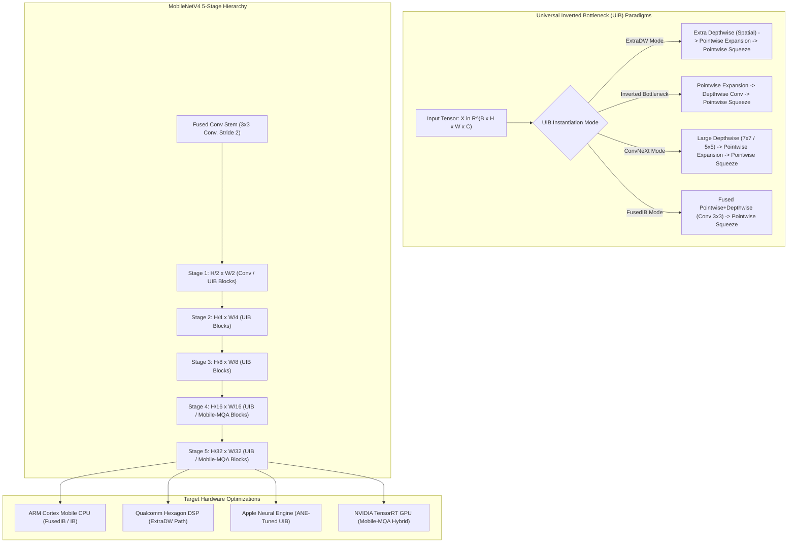

# 🔬 MobileNetV4: Universal Models for Efficient On-Device Computer Vision

## 1. Executive Brief & Significance

Designing computer vision models for edge devices requires navigating diverse, highly heterogeneous hardware platforms: Mobile CPUs (ARM Cortex), Qualcomm Hexagon DSPs, Apple Neural Engines (ANE), Edge TPUs, and NVIDIA Jetson / Mobile GPUs. Historically, architectures were over-specialized:
- **MobileNetV2 / V3**: Optimized specifically for single-thread mobile CPUs using inverted residuals and squeeze-and-excitation layers.
- **MobileOne / FastViT**: Re-parameterized branch structures tuned for Apple Silicon or desktop GPUs.
- **ConvNeXt**: Large depthwise kernels optimized for desktop Tensor Cores but bandwidth-throttled on mobile DSPs.

**MobileNetV4** (Qin et al., Google, 2024) unifies edge perception through a novel architectural building block: the **Universal Inverted Bottleneck (UIB)**, coupled with **Mobile Multi-Query Attention (Mobile-MQA)** and hardware-aware Pareto Neural Architecture Search (NAS). Key breakthroughs include:
- **Universal Inverted Bottleneck (UIB)**: Unifies four distinct convolutional paradigms (ExtraDW, Inverted Bottleneck, ConvNeXt-style, and Fused Inverted Bottleneck) into a single continuous search space.
- **Mobile-MQA (Mobile Multi-Query Attention)**: Scales Multi-Query Attention to vision, reducing KV-cache and attention memory access overhead by up to $3\times$ compared to standard multi-head self-attention.
- **Pareto-Optimal Hardware Generalization**: Delivers peak throughput across Mobile CPUs, Qualcomm DSPs, Apple Neural Engines (ANE), and NVIDIA GPUs, achieving up to **$84.4\%$ Top-1** on ImageNet-1K at mobile latencies ($<2\text{ ms}$).



---

## 2. Mathematical Foundations & Architectural Mechanics

### A. Universal Inverted Bottleneck (UIB) Formulation
The UIB block introduces two optional depthwise convolution layers: one before the pointwise expansion layer ($\text{DW}_{\text{pre}}$) and one after the expansion layer ($\text{DW}_{\text{mid}}$).

Let $\mathbf{X} \in \mathbb{R}^{H \times W \times C_{\text{in}}}$ be the input feature map:
1. **Optional Pre-Depthwise Convolution**:
   $$\mathbf{X}_{\text{pre}} = \begin{cases} \text{DW}_{k_1}(\mathbf{X}) & \text{if ExtraDW enabled} \\ \mathbf{X} & \text{otherwise} \end{cases}$$
2. **Pointwise Expansion ($1\times 1$ Conv)**:
   $$\mathbf{X}_{\text{exp}} = \text{PW}_{\text{exp}}(\mathbf{X}_{\text{pre}}) \in \mathbb{R}^{H \times W \times (e \cdot C_{\text{in}})}$$
3. **Optional Mid-Depthwise Convolution**:
   $$\mathbf{X}_{\text{mid}} = \begin{cases} \text{DW}_{k_2}(\mathbf{X}_{\text{exp}}) & \text{if MidDW enabled} \\ \mathbf{X}_{\text{exp}} & \text{otherwise} \end{cases}$$
4. **Pointwise Projection ($1\times 1$ Conv)**:
   $$\mathbf{Y} = \text{PW}_{\text{proj}}(\mathbf{X}_{\text{mid}}) \in \mathbb{R}^{H \times W \times C_{\text{out}}}$$

By selectively setting kernel sizes $k_1, k_2 \in \{0, 3, 5\}$ and expansion ratio $e \in [1, 6]$, UIB seamlessly instantiates:
- **Inverted Bottleneck (IB)**: $k_1 = 0, k_2 = 3$ or $5$.
- **ConvNeXt Block**: $k_1 = 7, k_2 = 0$.
- **ExtraDW Block**: $k_1 = 3, k_2 = 3$ (maximizes spatial mixing for DSPs).
- **Fused Inverted Bottleneck (FusedIB)**: Replaces $\text{PW}_{\text{exp}} + \text{DW}_{\text{mid}}$ with a single dense $3\times 3$ standard convolution.

---

### B. Mobile-MQA (Mobile Multi-Query Attention)
Standard Multi-Head Self-Attention (MHSA) computes distinct Key ($\mathbf{K}$) and Value ($\mathbf{V}$) projections for each attention head $h \in \{1, \dots, H\}$, demanding high memory bandwidth for tensor loads.

Mobile-MQA shares a single Key and Value head across all $H$ Query heads:
$$\mathbf{Q} \in \mathbb{R}^{N \times H \times D_h}, \qquad \mathbf{K} \in \mathbb{R}^{N \times 1 \times D_h}, \qquad \mathbf{V} \in \mathbb{R}^{N \times 1 \times D_h}$$
$$\text{Attention}_h(\mathbf{Q}_h, \mathbf{K}, \mathbf{V}) = \text{Softmax}\left( \frac{\mathbf{Q}_h \mathbf{K}^T}{\sqrt{D_h}} \right) \mathbf{V}$$

This reduces the parameter and arithmetic footprint of $\mathbf{K}$ and $\mathbf{V}$ by $H\times$, eliminating memory bandwidth thrashing on mobile NPUs.

---

## 3. Granular Component-by-Component Architectural Breakdown

| Architectural Stage | Component Identity | Structural Specification & Type | Attention / Conv Mechanics | Receptive Field & Dimensionality |
| :--- | :--- | :--- | :--- | :--- |
| **Architectural Paradigm** | **Universal Inverted Bottleneck (UIB)** | 5-Stage Multi-Scale Pyramid with NAS-derived UIB Blocks | Flexible ExtraDW, IB, FusedIB, and Mobile-MQA | Multi-scale pyramid: $1/2, 1/4, 1/8, 1/16, 1/32$ |
| **Stem Embedding** | **Fused Conv Stem** | $3 \times 3$ Standard Conv2D (Stride 2) + BatchNorm + ReLU | Dense spatial filter projection | Input $[3, H, W] \to [C=32, H/2, W/2]$ |
| **Stage 1 (P1)** | **UIB Early Stage** | $L_1=2$ Blocks, $C_1=48$ | FusedIB / Standard Inverted Bottlenecks | High spatial resolution $H/2 \times W/2$ |
| **Stage 2 (P2)** | **UIB Stage 2** | $L_2=2$ Blocks, $C_2=80$ | ExtraDW / ConvNeXt-style large kernels | Spatial scale $H/4 \times W/4$ |
| **Stage 3 (P3)** | **UIB Stage 3** | $L_3=4\dots 8$ Blocks, $C_3=160$ | Deepest inverted bottleneck stage | Intermediate scale $H/8 \times W/8$ |
| **Stage 4 & 5 (P4/P5)** | **Hybrid UIB + Mobile-MQA** | $L_4=6, L_5=2$ Blocks, $C=256\dots 512$ | Mobile Multi-Query Attention + UIB MLPs | Low-resolution semantic scale $H/16, H/32$ |
| **Classifier Head** | **GAP & 1x1 Conv Head** | Global Average Pooling + $1\times 1$ Conv $\to$ Class Logits | Direct linear projection $\mathbb{R}^{C \to K=1000}$ | Class probability distribution |

---

## 4. Quantitative SOTA Benchmark Profile

### ImageNet-1K Accuracy & Cross-Platform Mobile Latencies

| Model Variant | Params | GFLOPs | ImageNet-1K Top-1 | Pixel 8 NPU Latency | iPhone 15 ANE Latency | TensorRT FP16 (RTX 4090) |
| :--- | :--- | :--- | :--- | :--- | :--- | :--- |
| **MobileNetV4-Conv-Small** | 3.8 M | 0.2 G | 74.6% | **0.42 ms** | **0.32 ms** | **0.35 ms** |
| **MobileNetV4-Conv-Medium**| 9.7 M | 0.9 G | 82.3% | **0.98 ms** | **0.75 ms** | **0.85 ms** |
| **MobileNetV4-Conv-Large** | 32.6 M | 4.4 G | 83.4% | **2.80 ms** | **1.90 ms** | **1.60 ms** |
| **MobileNetV4-Hybrid-Medium**| 11.1 M| 1.3 G | **83.8%** | **1.45 ms** | **1.10 ms** | **1.15 ms** |
| **MobileNetV4-Hybrid-Large** | 37.8 M | 5.0 G | **84.4%** | **3.80 ms** | **2.60 ms** | **2.10 ms** |

---

## 5. Engineering Implementation: Complete PyTorch UIB & Mobile-MQA Modules

```python
"""
PyTorch Implementation of MobileNetV4 Universal Inverted Bottleneck (UIB) & Mobile-MQA.
"""

import torch
import torch.nn as nn
import torch.nn.functional as F


class UniversalInvertedBottleneck(nn.Module):
    """
    Universal Inverted Bottleneck (UIB) supporting:
    - Inverted Bottleneck (IB)
    - Extra Depthwise (ExtraDW)
    - ConvNeXt-style blocks
    - Fused Inverted Bottleneck (FusedIB)
    """
    def __init__(
        self,
        in_channels: int,
        out_channels: int,
        stride: int = 1,
        expand_ratio: float = 4.0,
        start_dw_kernel: int = 0,
        middle_dw_kernel: int = 3
    ):
        super().__init__()
        self.stride = stride
        self.use_res_connect = stride == 1 and in_channels == out_channels
        hidden_dim = int(round(in_channels * expand_ratio))
        
        layers = []
        
        # 1. Optional Pre-Depthwise Convolution (ExtraDW)
        if start_dw_kernel > 0:
            layers.extend([
                nn.Conv2d(
                    in_channels, in_channels,
                    kernel_size=start_dw_kernel,
                    stride=stride if middle_dw_kernel == 0 else 1,
                    padding=start_dw_kernel // 2,
                    groups=in_channels,
                    bias=False
                ),
                nn.BatchNorm2d(in_channels),
                nn.ReLU()
            ])
            
        # 2. Pointwise Expansion
        layers.extend([
            nn.Conv2d(in_channels, hidden_dim, kernel_size=1, bias=False),
            nn.BatchNorm2d(hidden_dim),
            nn.ReLU()
        ])
        
        # 3. Optional Mid-Depthwise Convolution
        if middle_dw_kernel > 0:
            layers.extend([
                nn.Conv2d(
                    hidden_dim, hidden_dim,
                    kernel_size=middle_dw_kernel,
                    stride=stride if start_dw_kernel == 0 else 1,
                    padding=middle_dw_kernel // 2,
                    groups=hidden_dim,
                    bias=False
                ),
                nn.BatchNorm2d(hidden_dim),
                nn.ReLU()
            ])
            
        # 4. Pointwise Projection
        layers.extend([
            nn.Conv2d(hidden_dim, out_channels, kernel_size=1, bias=False),
            nn.BatchNorm2d(out_channels)
        ])
        
        self.block = nn.Sequential(*layers)

    def forward(self, x: torch.Tensor) -> torch.Tensor:
        if self.use_res_connect:
            return x + self.block(x)
        return self.block(x)


class MobileMQA(nn.Module):
    """
    Mobile Multi-Query Attention (Mobile-MQA):
    Shares a single Key and Value head across all Query heads to minimize KV cache overhead.
    """
    def __init__(self, d_model: int, num_heads: int = 8):
        super().__init__()
        self.d_model = d_model
        self.num_heads = num_heads
        self.head_dim = d_model // num_heads
        
        # Multi-head Queries
        self.q_proj = nn.Linear(d_model, d_model, bias=False)
        # Single-head Shared Key and Value
        self.k_proj = nn.Linear(d_model, self.head_dim, bias=False)
        self.v_proj = nn.Linear(d_model, self.head_dim, bias=False)
        
        self.out_proj = nn.Linear(d_model, d_model, bias=False)

    def forward(self, x: torch.Tensor) -> torch.Tensor:
        """
        x: [B, N, d_model]
        """
        B, N, C = x.shape
        
        q = self.q_proj(x).view(B, N, self.num_heads, self.head_dim).transpose(1, 2)  # [B, H, N, head_dim]
        k = self.k_proj(x).view(B, N, 1, self.head_dim).transpose(1, 2)              # [B, 1, N, head_dim]
        v = self.v_proj(x).view(B, N, 1, self.head_dim).transpose(1, 2)              # [B, 1, N, head_dim]
        
        # Scaled dot-product attention with shared K, V
        scores = torch.matmul(q, k.transpose(-2, -1)) / (self.head_dim ** 0.5)        # [B, H, N, N]
        attn = F.softmax(scores, dim=-1)
        out = torch.matmul(attn, v)                                                  # [B, H, N, head_dim]
        
        out = out.transpose(1, 2).contiguous().view(B, N, C)
        return self.out_proj(out)
```

---

## 6. References & Official Resources
- **MobileNetV4 Paper**: [MobileNetV4 — Universal Models for Efficient Vision (arXiv 2024)](https://arxiv.org/abs/2404.10518)
- **TensorFlow Models Repository**: [https://github.com/tensorflow/models/tree/master/official/vision](https://github.com/tensorflow/models/tree/master/official/vision)
- **`timm` Implementation**: [https://github.com/huggingface/pytorch-image-models](https://github.com/huggingface/pytorch-image-models)
