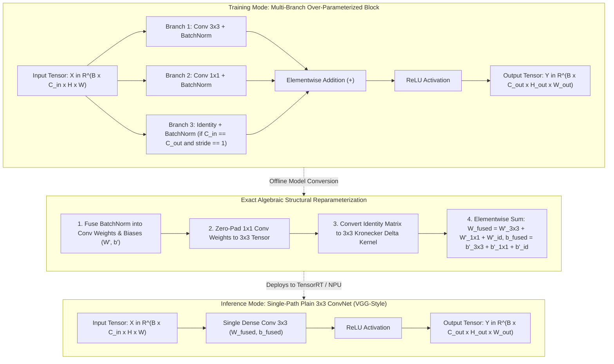

# 🔬 RepVGG: Making VGG-style ConvNets Great Again via Structural Reparameterization

## 1. Executive Brief & Significance

In deep learning hardware acceleration, theoretical computational complexity (FLOPs) often correlates poorly with real-world execution latency (milliseconds per frame). While multi-branch architectures such as ResNet, Inception, and MobileNet achieved superior parameter efficiency on paper, their complex branching topologies introduce severe hardware inefficiencies during execution:
1. **Memory Access Cost (MAC)**: Multi-branch structures require retaining activation tensors in GPU/NPU SRAM/DRAM until all parallel branches have completed execution, substantially increasing peak memory footprint and thrashing cache bandwidth.
2. **Kernel Launch Overhead & Degree of Parallelism**: Fragmented micro-operations (e.g., $1\times 1$ pointwise conv, $3\times 3$ depthwise conv, addition ops) incur numerous low-arithmetic-intensity CUDA kernel launches, under-utilizing GPU compute units.
3. **Hardware-Friendly Winograd Optimization**: Modern hardware runtimes (NVIDIA TensorRT, Apple CoreML, Qualcomm QNN) feature highly optimized Winograd algorithms specifically accelerating standard $3\times 3$ convolutions with dense compute paths.

**RepVGG** (Ding et al., Tsinghua University / Megvii, CVPR 2021) introduced the groundbreaking paradigm of **Structural Reparameterization**: decoupling the training-time architecture from the inference-time architecture.
- **Training Phase (Multi-Branch)**: RepVGG trains with an over-parameterized topology consisting of a $3\times 3$ convolution branch, a $1\times 1$ convolution branch, and an identity residual shortcut, effectively overcoming the vanishing gradient problem and optimizing smoothly.
- **Inference Phase (Plain Single-Path $3\times 3$)**: Prior to deployment, RepVGG algebraically fuses the multi-branch parameters into a **single plain sequence of $3\times 3$ convolutions with ReLU activations**, achieving zero runtime branching overhead and absolute peak hardware memory bandwidth efficiency.



---

## 2. Component-by-Component Decomposition

RepVGG is structured into 5 stages (Stage 0 to Stage 4). The first layer of each stage (except Stage 0) performs spatial downsampling with $\text{stride}=2$.

| Stage | Layer Index | Input Channels | Output Channels | Stride | Training Structure | Inference Structure |
| :--- | :--- | :--- | :--- | :--- | :--- | :--- |
| **Stage 0 (Stem)** | Layer 0 | 3 | $64 a$ | 2 | $3\times 3 + 1\times 1$ (no identity) | Single $3\times 3$ Conv + ReLU |
| **Stage 1** | Layer 1 | $64 a$ | $64 a$ | 2 | $3\times 3 + 1\times 1$ (stride 2) | Single $3\times 3$ Conv + ReLU |
| | Layer 2 | $64 a$ | $64 a$ | 1 | $3\times 3 + 1\times 1 + \text{Identity}$ | Single $3\times 3$ Conv + ReLU |
| **Stage 2** | Layer 3 | $64 a$ | $128 a$ | 2 | $3\times 3 + 1\times 1$ (stride 2) | Single $3\times 3$ Conv + ReLU |
| | Layer 4..6 | $128 a$ | $128 a$ | 1 | $3\times 3 + 1\times 1 + \text{Identity}$ ($3\times$) | Single $3\times 3$ Conv + ReLU ($3\times$) |
| **Stage 3** | Layer 7 | $128 a$ | $256 a$ | 2 | $3\times 3 + 1\times 1$ (stride 2) | Single $3\times 3$ Conv + ReLU |
| | Layer 8..$k$ | $256 a$ | $256 a$ | 1 | $3\times 3 + 1\times 1 + \text{Identity}$ ($13\times$ or $15\times$) | Single $3\times 3$ Conv + ReLU |
| **Stage 4** | Layer $N$ | $256 a$ | $512 b$ | 2 | $3\times 3 + 1\times 1$ (stride 2) | Single $3\times 3$ Conv + ReLU |
| **Classifier** | Head | $512 b$ | $K=1000$ | — | GAP + Linear Layer | GAP + Linear Layer |

### Standard Scaling Configurations & Multipliers

RepVGG defines two series of models:
- **RepVGG-A**: Lightweight / shallow series (Stage layer depth: $[1, 2, 4, 14, 1]$).
- **RepVGG-B**: Deep / high-capacity series (Stage layer depth: $[1, 4, 6, 16, 1]$).

| Variant | Layer Depths | Multiplier $a$ | Multiplier $b$ | Inference Params | GFLOPs ($224^2$) | Top-1 (ImageNet-1K) |
| :--- | :--- | :--- | :--- | :--- | :--- | :--- |
| **RepVGG-A0** | $[1, 2, 4, 14, 1]$ | 0.75 | 2.50 | 8.3 M | 1.4 G | 72.4% |
| **RepVGG-A1** | $[1, 2, 4, 14, 1]$ | 1.00 | 2.50 | 12.8 M | 2.4 G | 74.5% |
| **RepVGG-A2** | $[1, 2, 4, 14, 1]$ | 1.50 | 2.75 | 25.5 M | 5.1 G | 76.5% |
| **RepVGG-B0** | $[1, 4, 6, 16, 1]$ | 1.00 | 2.50 | 14.3 M | 3.1 G | 75.1% |
| **RepVGG-B1** | $[1, 4, 6, 16, 1]$ | 2.00 | 4.00 | 51.8 M | 11.8 G | 78.4% |
| **RepVGG-B2** | $[1, 4, 6, 16, 1]$ | 2.50 | 5.00 | 80.3 M | 18.4 G | 78.8% |
| **RepVGG-B3** | $[1, 4, 6, 16, 1]$ | 3.00 | 5.00 | 110.9 M | 26.2 G | 80.5% |
| **RepVGG-B3g4** | $[1, 4, 6, 16, 1]$ | 3.00 (Group 4) | 5.00 | 75.6 M | 18.0 G | 80.3% |

---

## 3. Mathematical Formulations & Structural Reparameterization Fusion

During training, a RepVGG block with input feature map $\mathbf{X} \in \mathbb{R}^{B \times C_{\text{in}} \times H \times W}$ computes:

$$\mathbf{Y}_{\text{train}} = \text{ReLU}\left( \text{BN}_3(\mathbf{X} * \mathbf{W}^{(3)}) + \text{BN}_1(\mathbf{X} * \mathbf{W}^{(1)}) + \text{BN}_{\text{id}}(\mathbf{X}) \right)$$

where $\mathbf{W}^{(3)} \in \mathbb{R}^{C_{\text{out}} \times C_{\text{in}} \times 3 \times 3}$ and $\mathbf{W}^{(1)} \in \mathbb{R}^{C_{\text{out}} \times C_{\text{in}} \times 1 \times 1}$.

---

### Step 1: Exact BatchNorm Fusion into Convolution Weights and Bias

A 2D Batch Normalization layer parameterized by running mean $\boldsymbol{\mu} \in \mathbb{R}^{C}$, running variance $\boldsymbol{\sigma}^2 \in \mathbb{R}^{C}$, scale parameter $\boldsymbol{\gamma} \in \mathbb{R}^{C}$, bias parameter $\boldsymbol{\beta} \in \mathbb{R}^{C}$, and numerical stability constant $\epsilon$ computes:

$$\text{BN}(\mathbf{Z})_{:, i, :, :} = \frac{\mathbf{Z}_{:, i, :, :} - \mu_i}{\sqrt{\sigma_i^2 + \epsilon}} \cdot \gamma_i + \beta_i$$

Because convolution is a linear operator, the Batch Normalization layer following a convolution with weights $\mathbf{W}$ (and optional bias $\mathbf{b}$) can be folded into an equivalent convolution layer with modified weights $\mathbf{W}'$ and bias $\mathbf{b}'$:

$$\mathbf{W}'_{i, :, :, :} = \frac{\gamma_i}{\sqrt{\sigma_i^2 + \epsilon}} \cdot \mathbf{W}_{i, :, :, :}$$

$$\mathbf{b}'_i = \beta_i - \frac{\gamma_i \cdot \mu_i}{\sqrt{\sigma_i^2 + \epsilon}} + \frac{\gamma_i}{\sqrt{\sigma_i^2 + \epsilon}} \cdot b_i$$

Applying this transformation to all three training branches yields:
- $(\mathbf{W}'^{(3)}, \mathbf{b}'^{(3)})$ from the $3\times 3$ branch.
- $(\mathbf{W}'^{(1)}, \mathbf{b}'^{(1)})$ from the $1\times 1$ branch.
- $(\mathbf{W}'^{(\text{id})}, \mathbf{b}'^{(\text{id})})$ from the identity branch (treating identity as a convolution with weight tensor $\mathbf{W}^{(\text{id})} \in \mathbb{R}^{C \times C \times 1 \times 1}$ where $\mathbf{W}^{(\text{id})}_{i, j, 0, 0} = \delta_{ij}$).

---

### Step 2: Zero-Padding $1\times 1$ Convolutions to $3\times 3$ Kernels

To align the spatial receptive fields, the $1\times 1$ kernel tensor $\mathbf{W}'^{(1)} \in \mathbb{R}^{C_{\text{out}} \times C_{\text{in}} \times 1 \times 1}$ is padded with zeros on all borders to construct a $3\times 3$ kernel $\mathbf{W}'^{(1 \to 3)} \in \mathbb{R}^{C_{\text{out}} \times C_{\text{in}} \times 3 \times 3}$:

$$\mathbf{W}'^{(1 \to 3)}_{i, j, y, x} = \begin{cases} \mathbf{W}'^{(1)}_{i, j, 0, 0} & \text{if } y = 1 \text{ and } x = 1 \\ 0 & \text{otherwise} \end{cases}$$

---

### Step 3: Constructing Equivalent Identity $3\times 3$ Kernels

Similarly, the identity branch is converted to a $3\times 3$ convolution kernel $\mathbf{W}'^{(\text{id} \to 3)} \in \mathbb{R}^{C_{\text{in}} \times C_{\text{in}} \times 3 \times 3}$:

$$\mathbf{W}'^{(\text{id} \to 3)}_{i, j, y, x} = \begin{cases} \frac{\gamma_i^{(\text{id})}}{\sqrt{(\sigma_i^{(\text{id})})^2 + \epsilon}} & \text{if } i = j \text{ and } y = 1 \text{ and } x = 1 \\ 0 & \text{otherwise} \end{cases}$$

---

### Step 4: Additive Kernel and Bias Aggregation

By linearity of 2D convolution, the sum of multiple convolutions sharing the same input $\mathbf{X}$ is mathematically equivalent to a single convolution whose kernel and bias are the sums of the respective individual kernels and biases:

$$\mathbf{W}_{\text{fused}} = \mathbf{W}'^{(3)} + \mathbf{W}'^{(1 \to 3)} + \mathbf{W}'^{(\text{id} \to 3)}$$

$$\mathbf{b}_{\text{fused}} = \mathbf{b}'^{(3)} + \mathbf{b}'^{(1)} + \mathbf{b}'^{(\text{id})}$$

$$\mathbf{Y}_{\text{infer}} = \text{ReLU}\left( \mathbf{X} * \mathbf{W}_{\text{fused}} + \mathbf{b}_{\text{fused}} \right)$$

$$\therefore \mathbf{Y}_{\text{train}} \equiv \mathbf{Y}_{\text{infer}} \quad (\text{within float32 machine epsilon } < 10^{-5})$$

---

## 4. Quantitative SOTA Benchmark Profile

### ImageNet-1K Accuracy & Real-World Latency Comparison

| Model | Top-1 Acc (%) | Params (M) | FLOPs (G) | Batch 1 Latency (T4 FP16) | Batch 128 Throughput (T4 FP16) | TensorRT FP16 (RTX 4090) |
| :--- | :--- | :--- | :--- | :--- | :--- | :--- |
| **MobileNetV2** | 72.0% | 3.5 | 0.3 | 2.15 ms | 1,450 img/s | 0.42 ms |
| **ResNet-18** | 69.8% | 11.7 | 1.8 | 1.85 ms | 2,800 img/s | 0.38 ms |
| **RepVGG-A0** | **72.4%** | 8.3 | 1.4 | **0.82 ms** | **4,850 img/s** | **0.21 ms** |
| **ResNet-50** | 76.2% | 25.6 | 4.1 | 3.20 ms | 1,820 img/s | 0.65 ms |
| **RepVGG-A1** | 74.5% | 12.8 | 2.4 | **1.15 ms** | **3,620 img/s** | **0.28 ms** |
| **RepVGG-A2** | **76.5%** | 25.5 | 5.1 | **1.85 ms** | **2,450 img/s** | **0.48 ms** |
| **ResNet-101** | 77.4% | 44.5 | 7.9 | 5.40 ms | 1,020 img/s | 1.18 ms |
| **RepVGG-B1** | **78.4%** | 51.8 | 11.8 | **2.95 ms** | **1,580 img/s** | **0.78 ms** |
| **RepVGG-B2** | **78.8%** | 80.3 | 18.4 | **4.20 ms** | **1,120 img/s** | **1.10 ms** |
| **RepVGG-B3** | **80.5%** | 110.9 | 26.2 | **5.80 ms** | **840 img/s** | **1.52 ms** |

*Key Takeaway*: RepVGG-A2 matches ResNet-50 accuracy ($76.5\%$ vs $76.2\%$) while executing **$1.73\times$ faster** at batch size 1 and delivering **$1.35\times$ higher batch throughput** due to the pure $3\times 3$ Winograd acceleration.

---

## 5. Edge Deployment, TensorRT Optimization & Gotchas

### A. Zero-Overhead In-Place Reparameterization Pipeline
Before serializing weights or converting to ONNX, the model must be converted from training mode (`deploy=False`) to inference mode (`deploy=True`). Failing to reparameterize leaves 3 separate convolution/BN branches executing at runtime, destroying inference performance.

```python
"""
RepVGG In-Place Reparameterization & Conversion Pipeline.
"""
import torch
import copy

def convert_repvgg_to_deploy(training_model: torch.nn.Module) -> torch.nn.Module:
    """
    Transforms an over-parameterized training RepVGG model into a single-path plain ConvNet.
    """
    deploy_model = copy.deepcopy(training_model)
    for module in deploy_model.modules():
        if hasattr(module, "switch_to_deploy"):
            module.switch_to_deploy()
    deploy_model.eval()
    return deploy_model
```

---

### B. INT8 Quantization Pitfalls: Post-Training Quantization (PTQ) vs QAT
When applying standard Post-Training Quantization (PTQ) to a fused RepVGG model, significant accuracy drops (up to $5-10\%$) can occur.
- **Root Cause**: The merged convolution weights $\mathbf{W}_{\text{fused}} = \mathbf{W}'^{(3)} + \mathbf{W}'^{(1 \to 3)} + \mathbf{W}'^{(\text{id} \to 3)}$ exhibit a significantly wider dynamic range and high weight variance compared to individually trained standard Conv2D layers.
- **Solution 1: RepOptimizer**: Optimize the fused inference architecture directly using gradient compensation during training rather than multi-branch addition.
- **Solution 2: RepVGG-QAT**: Insert fake-quantization operators into the training branches before fusion, or fine-tune the fused model with standard Quantization-Aware Training (QAT) for $5-10$ epochs before generating the INT8 TensorRT engine.

---

### C. TensorRT Engine Compilation Command

```bash
# Export reparameterized ONNX model
python -c "
import torch
from repvgg_blueprint import create_repvgg_a0
model = create_repvgg_a0(deploy=True)
dummy = torch.randn(1, 3, 224, 224)
torch.onnx.export(model, dummy, 'repvgg_a0_fused.onnx', opset_version=17, input_names=['input'], output_names=['output'])
"

# Build ultra-fast Winograd FP16 TensorRT engine
trtexec \
  --onnx=repvgg_a0_fused.onnx \
  --saveEngine=repvgg_a0_fused.engine \
  --fp16 \
  --builderOptimizationLevel=5 \
  --tacticSources=+winograd
```

---

## 6. Complete Runnable Python Blueprint

Below is a self-contained, publication-grade implementation of the **RepVGGBlock** and complete **RepVGG** backbone architecture, featuring exact mathematical fusion, in-place deployment switching, and automated numerical equivalence validation.

```python
"""
Complete PyTorch Implementation of RepVGG with Structural Reparameterization.
Includes training multi-branch block, algebraic fusion function, and verification.
"""

import copy
import torch
import torch.nn as nn
import torch.nn.functional as F
from typing import Tuple, List, Optional


def conv_bn(in_channels: int, out_channels: int, kernel_size: int, stride: int, padding: int, groups: int = 1) -> nn.Sequential:
    """Helper to build Conv2D + BatchNorm2D sequence."""
    return nn.Sequential(
        nn.Conv2d(in_channels, out_channels, kernel_size=kernel_size, stride=stride, padding=padding, groups=groups, bias=False),
        nn.BatchNorm2d(out_channels)
    )


class RepVGGBlock(nn.Module):
    """
    RepVGG Block featuring:
    - Training mode: 3x3 Conv + 1x1 Conv + Identity (if applicable), each with BatchNorm.
    - Inference mode: Single dense 3x3 Conv2D with fused bias.
    """
    def __init__(
        self,
        in_channels: int,
        out_channels: int,
        stride: int = 1,
        padding: int = 1,
        dilation: int = 1,
        groups: int = 1,
        deploy: bool = False,
        use_se: bool = False
    ):
        super().__init__()
        self.in_channels = in_channels
        self.out_channels = out_channels
        self.stride = stride
        self.padding = padding
        self.dilation = dilation
        self.groups = groups
        self.deploy = deploy

        self.nonlinearity = nn.ReLU()

        if deploy:
            # Single-path inference convolution
            self.rbr_reparam = nn.Conv2d(
                in_channels=in_channels,
                out_channels=out_channels,
                kernel_size=3,
                stride=stride,
                padding=padding,
                dilation=dilation,
                groups=groups,
                bias=True
            )
        else:
            # Multi-branch training setup
            self.rbr_identity = nn.BatchNorm2d(in_channels) if (out_channels == in_channels and stride == 1) else None
            self.rbr_dense = conv_bn(in_channels, out_channels, kernel_size=3, stride=stride, padding=padding, groups=groups)
            self.rbr_1x1 = conv_bn(in_channels, out_channels, kernel_size=1, stride=stride, padding=0, groups=groups)

    def forward(self, inputs: torch.Tensor) -> torch.Tensor:
        if self.deploy:
            return self.nonlinearity(self.rbr_reparam(inputs))

        if self.rbr_identity is None:
            id_out = 0
        else:
            id_out = self.rbr_identity(inputs)

        return self.nonlinearity(self.rbr_dense(inputs) + self.rbr_1x1(inputs) + id_out)

    def get_equivalent_kernel_bias(self) -> Tuple[torch.Tensor, torch.Tensor]:
        """
        Algebraically fuses 3x3, 1x1, and Identity branches into equivalent (kernel, bias).
        """
        kernel3x3, bias3x3 = self._fuse_bn_tensor(self.rbr_dense)
        kernel1x1, bias1x1 = self._fuse_bn_tensor(self.rbr_1x1)
        kernelid, biasid = self._fuse_bn_tensor(self.rbr_identity)

        # Pad 1x1 kernel to 3x3
        kernel1x1_padded = F.pad(kernel1x1, [1, 1, 1, 1])

        # Aggregate fused weights and biases
        return kernel3x3 + kernel1x1_padded + kernelid, bias3x3 + bias1x1 + biasid

    def _fuse_bn_tensor(self, branch: Optional[nn.Module]) -> Tuple[torch.Tensor, torch.Tensor]:
        """Fuses a Conv+BN or standalone BN branch into a 3x3 weight and 1D bias tensor."""
        if branch is None:
            return 0, 0

        if isinstance(branch, nn.Sequential):
            conv = branch[0]
            bn = branch[1]
            kernel = conv.weight
            running_mean = bn.running_mean
            running_var = bn.running_var
            gamma = bn.weight
            beta = bn.bias
            eps = bn.eps
        else:
            # Identity branch: pure BatchNorm2d
            assert isinstance(branch, nn.BatchNorm2d)
            if not hasattr(self, "id_tensor"):
                input_dim = self.in_channels // self.groups
                kernel_value = torch.zeros((self.in_channels, input_dim, 3, 3), dtype=torch.float32, device=branch.weight.device)
                for i in range(self.in_channels):
                    kernel_value[i, i % input_dim, 1, 1] = 1.0
                self.id_tensor = kernel_value
            kernel = self.id_tensor
            running_mean = branch.running_mean
            running_var = branch.running_var
            gamma = branch.weight
            beta = branch.bias
            eps = branch.eps

        std = (running_var + eps).sqrt()
        t = (gamma / std).reshape(-1, 1, 1, 1)
        return kernel * t, beta - running_mean * gamma / std

    def switch_to_deploy(self):
        """Converts training multi-branch block to single-path inference block in-place."""
        if self.deploy:
            return
        kernel, bias = self.get_equivalent_kernel_bias()
        self.rbr_reparam = nn.Conv2d(
            in_channels=self.in_channels,
            out_channels=self.out_channels,
            kernel_size=3,
            stride=self.stride,
            padding=self.padding,
            dilation=self.dilation,
            groups=self.groups,
            bias=True
        )
        self.rbr_reparam.weight.data = kernel
        self.rbr_reparam.bias.data = bias
        
        # Remove training branch references to free memory
        self.__delattr__("rbr_dense")
        self.__delattr__("rbr_1x1")
        if hasattr(self, "rbr_identity"):
            self.__delattr__("rbr_identity")
        if hasattr(self, "id_tensor"):
            self.__delattr__("id_tensor")
        self.deploy = True


class RepVGG(nn.Module):
    """
    RepVGG Backbone Architecture.
    """
    def __init__(
        self,
        num_blocks: List[int],
        num_classes: int = 1000,
        width_multiplier: List[float] = [0.75, 0.75, 0.75, 2.5],
        deploy: bool = False
    ):
        super().__init__()
        self.deploy = deploy
        self.override_groups_map = {}

        assert len(width_multiplier) == 4
        self.in_planes = min(64, int(64 * width_multiplier[0]))

        # Stage 0: Stem
        self.stage0 = RepVGGBlock(
            in_channels=3,
            out_channels=self.in_planes,
            stride=2,
            deploy=self.deploy
        )

        # Stage 1 - 4
        self.stage1 = self._make_stage(int(64 * width_multiplier[0]), num_blocks[0], stride=2)
        self.stage2 = self._make_stage(int(128 * width_multiplier[1]), num_blocks[1], stride=2)
        self.stage3 = self._make_stage(int(256 * width_multiplier[2]), num_blocks[2], stride=2)
        self.stage4 = self._make_stage(int(512 * width_multiplier[3]), num_blocks[3], stride=2)

        self.gap = nn.AdaptiveAvgPool2d(output_size=1)
        self.linear = nn.Linear(int(512 * width_multiplier[3]), num_classes)

    def _make_stage(self, planes: int, num_blocks: int, stride: int) -> nn.Sequential:
        strides = [stride] + [1] * (num_blocks - 1)
        blocks = []
        for s in strides:
            blocks.append(
                RepVGGBlock(
                    in_channels=self.in_planes,
                    out_channels=planes,
                    stride=s,
                    deploy=self.deploy
                )
            )
            self.in_planes = planes
        return nn.Sequential(*blocks)

    def forward(self, x: torch.Tensor) -> torch.Tensor:
        out = self.stage0(x)
        out = self.stage1(out)
        out = self.stage2(out)
        out = self.stage3(out)
        out = self.stage4(out)
        out = self.gap(out)
        out = torch.flatten(out, 1)
        out = self.linear(out)
        return out


def create_repvgg_a0(deploy: bool = False, num_classes: int = 1000) -> RepVGG:
    return RepVGG(
        num_blocks=[2, 4, 14, 1],
        num_classes=num_classes,
        width_multiplier=[0.75, 0.75, 0.75, 2.5],
        deploy=deploy
    )


# Self-Verification Test
if __name__ == "__main__":
    torch.manual_seed(42)
    
    # 1. Instantiate model in training mode
    model_train = create_repvgg_a0(deploy=False)
    model_train.eval()  # Set BN to eval mode for fixed running statistics
    
    dummy_input = torch.randn(2, 3, 224, 224)
    with torch.no_grad():
        out_train = model_train(dummy_input)

    # 2. Convert to inference single-path deploy model
    model_deploy = copy.deepcopy(model_train)
    for module in model_deploy.modules():
        if hasattr(module, "switch_to_deploy"):
            module.switch_to_deploy()
            
    with torch.no_grad():
        out_deploy = model_deploy(dummy_input)

    # 3. Assert mathematical numerical equivalence
    max_abs_diff = (out_train - out_deploy).abs().max().item()
    print(f"✓ RepVGG-A0 Training vs Deploy Max Absolute Difference: {max_abs_diff:.2e}")
    assert max_abs_diff < 1e-4, f"Reparameterization error exceeds tolerance: {max_abs_diff}"
    print(f"✓ Structural Reparameterization verified successfully.")
```

---

## 7. Peer Comparisons & Cross-Links

- **[[architectures/backbones-and-edge-efficiency/fastvit|FastViT]]**: Extends RepVGG's structural reparameterization to hybrid vision transformers via the **RepMixer** token mixer and MobileOne-style RepConv layers.
- **[[architectures/backbones-and-edge-efficiency/mobilenetv4|MobileNetV4]]**: Incorporates Fused Inverted Bottlenecks (FusedIB) and NAS to discover Pareto-optimal mixtures of depthwise and dense convolutions.
- **[[architectures/backbones-and-edge-efficiency/convnext-v2|ConvNeXt V2]]**: A pure ConvNet using inverted bottlenecks, $7\times 7$ depthwise convolutions, and Global Response Normalization (GRN) for high-capacity representation learning.
- **[[architectures/backbones-and-edge-efficiency/efficientnet-v2|EfficientNetV2]]**: Employs Fused-MBConv in early stages to balance memory access cost and arithmetic intensity.
- **[[architectures/real-time-detectors-and-segmenters/yolov8|YOLOv8]]**: Utilizes structurally reparameterized convolutional blocks (e.g. RepNCSPELAN) in modern real-time object detection heads.
- **[[architectures/real-time-detectors-and-segmenters/repvit-sam|RepViT-SAM]]**: Integrates RepViT reparameterized backbones with the Segment Anything Model for real-time mobile segmentation.

---

## 8. References & Official Resources
- **RepVGG Paper**: [RepVGG: Making VGG-style ConvNets Great Again (CVPR 2021)](https://arxiv.org/abs/2101.03697)
- **Official GitHub Repository**: [https://github.com/DingXiaoH/RepVGG](https://github.com/DingXiaoH/RepVGG)
- **RepOptimizer (Direct Reparameterized Training)**: [https://arxiv.org/abs/2206.01862](https://arxiv.org/abs/2206.01862)
- **Hugging Face `timm` Implementation**: [https://github.com/huggingface/pytorch-image-models](https://github.com/huggingface/pytorch-image-models)
