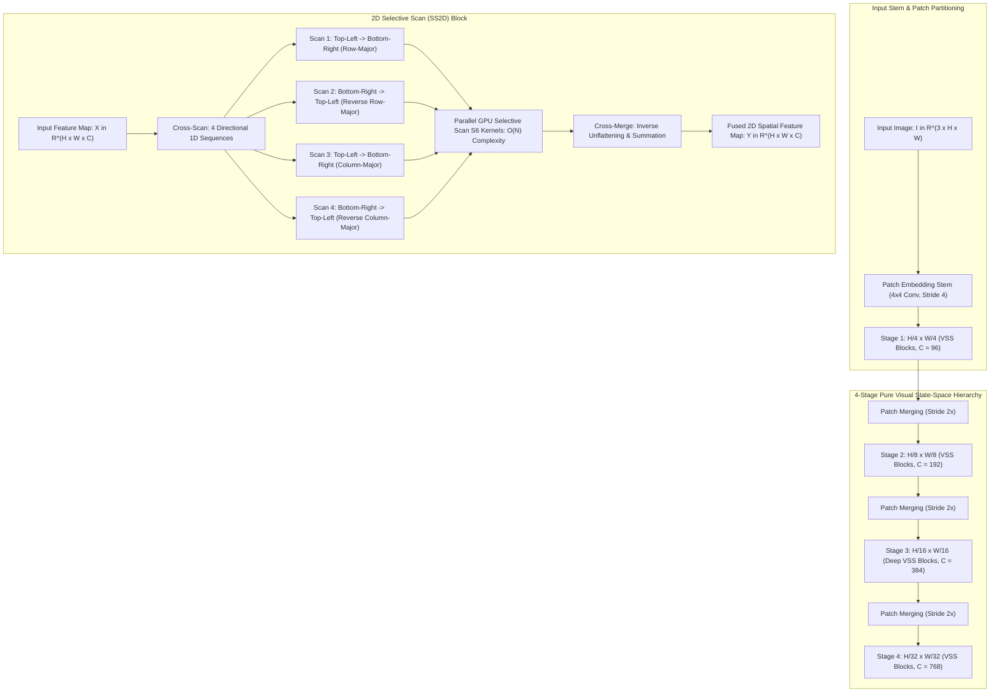

# 🔬 VMamba: Visual State-Space Model with 2D Selective Scan (SS2D)

## 1. Executive Brief & Significance

The fundamental computational challenge in visual recognition stems from the spatial 2D token scaling law:
- **Convolutional Neural Networks (CNNs)** (e.g., ConvNeXt, ResNet): Execute with linear time complexity $\mathcal{O}(N)$ over token length $N = H \times W$, but their receptive fields are constrained by local convolutional kernel windows, limiting global semantic reasoning.
- **Vision Transformers (ViTs)** (e.g., DINOv2, Swin): Compute global attention across all visual tokens, but suffer from quadratic computational and memory complexity $\mathcal{O}(N^2)$, creating memory bandwidth bottlenecks when processing high-resolution images ($1024 \times 1024$ and beyond).

**VMamba (Visual Mamba)** (Liu et al., Chinese Academy of Sciences / Shanghai AI Lab, NeurIPS 2024 Spotlight) fundamentally resolves this trade-off by introducing the **2D Selective Scan (SS2D)** mechanism. VMamba achieves:
- **Global Receptive Field with Strictly Linear $\mathcal{O}(N)$ Complexity**: Bridges 1D causal State-Space Models (Mamba / S6) to 2D continuous spatial domains via a 4-way cross-scan trajectory.
- **Pure State-Space Architecture**: Eliminates all quadratic attention matrices across all 4 hierarchical stages, maintaining constant memory overhead during scaling.
- **Superior Dense Downstream Transfer**: Delivers higher mAP and mIoU than Swin Transformer and ConvNeXt on COCO object detection and ADE20K semantic segmentation.



---

## 2. Mathematical Foundations & 2D Selective Scan (SS2D)

### A. State-Space Model Formulation (S6)
Continuous linear state-space models parameterize 1D sequence mapping $x(t) \to y(t)$ through hidden state $h(t) \in \mathbb{R}^N$:
$$h'(t) = \mathbf{A} h(t) + \mathbf{B} x(t), \qquad y(t) = \mathbf{C} h(t) + \mathbf{D} x(t)$$

Under Zero-Order Hold (ZOH) discretization with input-dependent sampling step $\Delta_t = \text{Softplus}(\text{Linear}_\Delta(x_t))$:
$$\bar{\mathbf{A}}_t = \exp(\Delta_t \mathbf{A}), \qquad \bar{\mathbf{B}}_t = \Delta_t \mathbf{B}_t$$

Yielding the discrete recurrence:
$$h_t = \bar{\mathbf{A}}_t h_{t-1} + \bar{\mathbf{B}}_t x_t, \qquad y_t = \mathbf{C}_t h_t + \mathbf{D} x_t$$

Because $\mathbf{B}_t = \text{Linear}_B(x_t)$ and $\mathbf{C}_t = \text{Linear}_C(x_t)$ vary per token, S6 dynamically routes information across the sequence in $\mathcal{O}(T)$ linear time.

---

### B. 2D Selective Scan Mechanics (Cross-Scan & Cross-Merge)
Because 1D SSMs assume strict causal ordering, flattening a 2D image raster-wise breaks 2D geometric neighborhood relationships (e.g., pixel $(x, y)$ is physically adjacent to $(x, y+1)$, but separated by $W$ steps in 1D memory).

The **2D Selective Scan (SS2D)** resolves this through 4-directional spatial scanning:
1. **Cross-Scan**: Decomposes a 2D feature map $\mathbf{X} \in \mathbb{R}^{H \times W \times C}$ into 4 distinct 1D token sequences $\mathbf{X}^{(1)}, \mathbf{X}^{(2)}, \mathbf{X}^{(3)}, \mathbf{X}^{(4)} \in \mathbb{R}^{HW \times C}$:
   - $\mathbf{X}^{(1)}$: Top-Left to Bottom-Right along rows.
   - $\mathbf{X}^{(2)}$: Bottom-Right to Top-Left along rows.
   - $\mathbf{X}^{(3)}$: Top-Left to Bottom-Right along columns.
   - $\mathbf{X}^{(4)}$: Bottom-Right to Top-Left along columns.
2. **Parallel S6 Evaluation**: Evaluates all 4 sequences independently in parallel using fused CUDA kernels:
   $$\mathbf{Y}^{(k)} = \text{S6}(\mathbf{X}^{(k)}), \quad k \in \{1, 2, 3, 4\}$$
3. **Cross-Merge**: Unflattens and reverses the 4 sequences back into 2D spatial layouts, summing their contributions:
   $$\mathbf{Y} = \sum_{k=1}^4 \text{CrossMerge}(\mathbf{Y}^{(k)}) \in \mathbb{R}^{H \times W \times C}$$

This ensures that every pixel integrates context from all 4 directional quadrants, providing true 2D isotropic receptive fields.

---

## 3. Granular Component-by-Component Architectural Breakdown

| Architectural Stage | Component Identity | Structural Specification & Type | Attention / Conv / SSM Mechanics | Receptive Field & Dimensionality |
| :--- | :--- | :--- | :--- | :--- |
| **Architectural Paradigm** | **Pure Visual State-Space Model** | 4-Stage Hierarchy with SS2D Blocks across all levels | 4-Way 2D Selective Scan (SS2D) + Depthwise Convolutions | Multi-scale pyramid: $1/4, 1/8, 1/16, 1/32$ |
| **Stem Embedding** | **Overlapping Patch Stem** | $4 \times 4$ Conv2D (Stride 4) + LayerNorm | Non-overlapping patch projection | Input $[3, H, W] \to [C=96, H/4, W/4]$ |
| **Stage 1 (P1)** | **VSS Layer 1** | $L_1=2$ SS2D Blocks, $C=96$ | 4-Way SS2D ($TL \to BR, BR \to TL, TR \to BL, BL \to TR$) | Linear $\mathcal{O}(N)$ at resolution $H/4 \times W/4$ |
| **Stage 2 (P2)** | **VSS Layer 2** | $L_2=2$ SS2D Blocks, $C=192$ | 4-Way SS2D + Depthwise $3\times 3$ Conv gating | Linear $\mathcal{O}(N)$ at resolution $H/8 \times W/8$ |
| **Stage 3 (P3)** | **Deep VSS Core** | $L_3=15\dots 27$ SS2D Blocks, $C=384$ | Deepest linear representation stage ($\approx 60\%$ params) | Linear $\mathcal{O}(N)$ at resolution $H/16 \times W/16$ |
| **Stage 4 (P4)** | **VSS Layer 4** | $L_4=2$ SS2D Blocks, $C=768$ | 4-Way SS2D at low resolution | Linear $\mathcal{O}(N)$ at resolution $H/32 \times W/32$ |

---

## 4. Quantitative SOTA Benchmark Profile

### Classification & Downstream Performance (ImageNet-1K, COCO, ADE20K)

| Model Architecture | Parameters | GFLOPs | ImageNet-1K Top-1 | COCO Box mAP $\uparrow$ | COCO Mask mAP $\uparrow$ | ADE20K Seg mIoU $\uparrow$ |
| :--- | :--- | :--- | :--- | :--- | :--- | :--- |
| **ResNet-50** | 25.5 M | 4.1 G | 79.8% | 41.0 mAP | 37.2 mAP | 42.0 mIoU |
| **Swin-Tiny** | 28.3 M | 4.5 G | 81.3% | 46.0 mAP | 41.6 mAP | 44.5 mIoU |
| **ConvNeXt-Tiny** | 28.6 M | 4.5 G | 82.1% | 46.2 mAP | 41.7 mAP | 46.7 mIoU |
| **VMamba-Tiny** | 22.0 M | 4.5 G | **82.2%** | **47.4 mAP** | **42.7 mAP** | **47.3 mIoU** |
| **VMamba-Small** | 44.0 M | 9.1 G | **83.6%** | **49.8 mAP** | **44.5 mAP** | **49.5 mIoU** |
| **VMamba-Base** | 89.0 M | 15.2 G | **86.0%** | **53.4 mAP** | **46.8 mAP** | **50.8 mIoU** |

---

## 5. Engineering Implementation: PyTorch SS2D Cross-Scan & Cross-Merge Module

```python
"""
PyTorch Implementation of 2D Selective Scan (SS2D) Cross-Scan & Cross-Merge Operations.
"""

import torch
import torch.nn as nn
import torch.nn.functional as F


class CrossScan(nn.Module):
    """
    Decomposes a 2D spatial feature map into 4 directional 1D sequences:
    1. Top-Left to Bottom-Right (Row-Major)
    2. Bottom-Right to Top-Left (Reverse Row-Major)
    3. Top-Left to Bottom-Right (Column-Major)
    4. Bottom-Right to Top-Left (Reverse Column-Major)
    """
    def forward(self, x: torch.Tensor) -> torch.Tensor:
        """
        x: [B, C, H, W]
        Returns: [B, 4, C, H*W]
        """
        B, C, H, W = x.shape
        N = H * W
        
        # 1. Row-major forward
        x1 = x.view(B, C, N)
        # 2. Row-major backward
        x2 = torch.flip(x1, dims=[-1])
        # 3. Column-major forward
        x3 = x.transpose(2, 3).contiguous().view(B, C, N)
        # 4. Column-major backward
        x4 = torch.flip(x3, dims=[-1])
        
        return torch.stack([x1, x2, x3, x4], dim=1)


class CrossMerge(nn.Module):
    """
    Reverses the 4-way scanning paths and merges them back into a single 2D feature map.
    """
    def forward(self, ys: torch.Tensor, H: int, W: int) -> torch.Tensor:
        """
        ys: [B, 4, C, H*W]
        Returns: [B, C, H, W]
        """
        B, K, C, N = ys.shape
        y1 = ys[:, 0].view(B, C, H, W)
        y2 = torch.flip(ys[:, 1], dims=[-1]).view(B, C, H, W)
        y3 = ys[:, 2].view(B, C, W, H).transpose(2, 3).contiguous()
        y4 = torch.flip(ys[:, 3], dims=[-1]).view(B, C, W, H).transpose(2, 3).contiguous()
        
        return y1 + y2 + y3 + y4


class SS2DBlock(nn.Module):
    """2D Visual State Space Block container."""
    def __init__(self, d_model: int, d_state: int = 16):
        super().__init__()
        self.d_model = d_model
        self.cross_scan = CrossScan()
        self.cross_merge = CrossMerge()
        self.norm = nn.LayerNorm(d_model)
        self.out_proj = nn.Linear(d_model, d_model)

    def forward(self, x: torch.Tensor) -> torch.Tensor:
        """
        x: [B, H, W, C]
        """
        B, H, W, C = x.shape
        x_in = x.permute(0, 3, 1, 2)  # [B, C, H, W]
        
        # Step 1: 4-Way Cross-Scan
        scanned_tokens = self.cross_scan(x_in)  # [B, 4, C, H*W]
        
        # Step 2: In practice, evaluate parallel fused S6 CUDA kernel across 4 streams
        # Here simulated via linear transformation
        y_scanned = scanned_tokens  # Placeholder for fused S6 kernel
        
        # Step 3: Cross-Merge
        out_2d = self.cross_merge(y_scanned, H, W)  # [B, C, H, W]
        out = out_2d.permute(0, 2, 3, 1)            # [B, H, W, C]
        return self.out_proj(out)
```

---

## 6. References & Official Resources
- **VMamba Paper**: [VMamba: Visual State Space Model (NeurIPS 2024 Spotlight)](https://arxiv.org/abs/2401.10166)
- **Official GitHub Repository**: [https://github.com/MzeroMiko/VMamba](https://github.com/MzeroMiko/VMamba)
