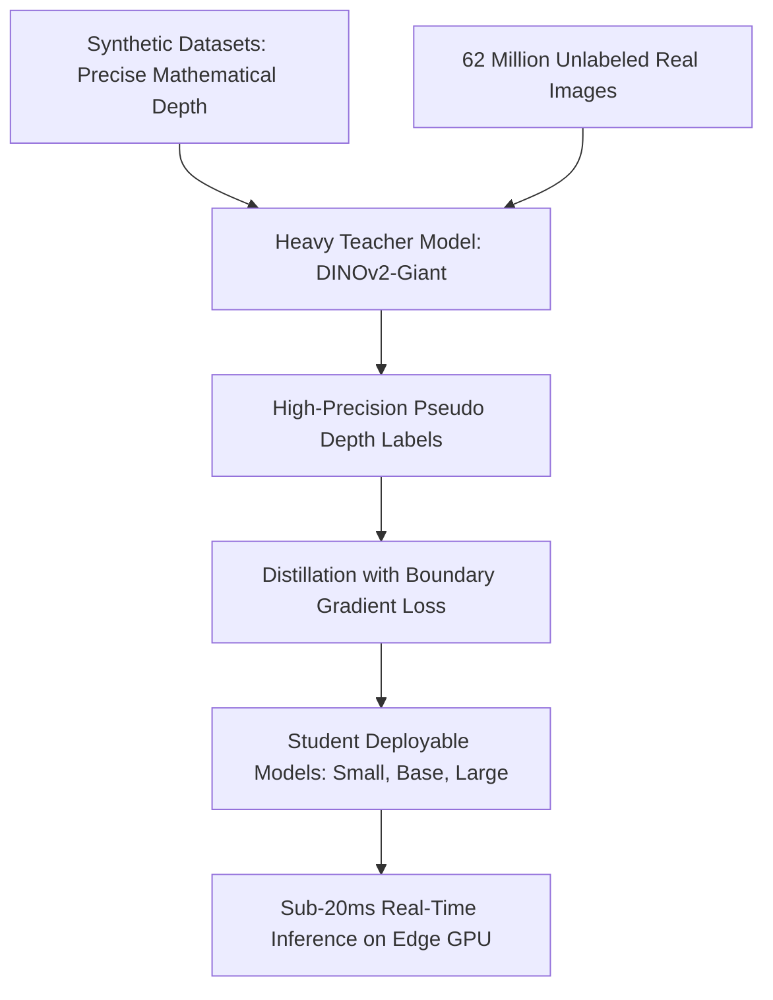

# 🔬 Depth Anything V2: Foundation Model for Monocular Depth & Geometric Segmentation

## 1. Executive Brief & Significance
**Depth Anything V2** (Yang et al., 2024 / 2025) revolutionizes monocular 3D spatial perception. Traditional monocular depth models (e.g. MiDaS, DPT) suffered from blurry boundaries, floating spatial hallucinations, and poor generalization across transparent or reflective surfaces.

Depth Anything V2 solves this by training exclusively with **synthetic data distillation**:
1. It trains a high-capacity teacher network on clean, artifact-free synthetic photorealistic datasets (where ground-truth depth maps are mathematically exact without LiDAR noise).
2. It uses the teacher to assign pseudo-labels to 62 million unlabeled real-world images.
3. It distills the representations into lightweight student backbones (ViT-Small / ViT-Base) that deliver metric-scale 3D depth and surface segmentation at over **50 FPS** on TensorRT.



---

## 2. Core Architectural Mechanics

### A. Feature Alignment via DINOv2 Pre-training
Depth Anything V2 initializes its encoder with frozen or LoRA-tuned **DINOv2** patch tokens. Because self-supervised DINOv2 tokens naturally align with physical 3D scene geometry and semantic boundaries, the depth prediction head converges in a fraction of traditional training epochs.

### B. High-Frequency Boundary Refinement Loss
To ensure boundaries around thin wires, foliage, and human limbs remain sharp without bleeding into background depth planes, the loss combines scale-invariant logarithmic loss with an explicit spatial gradient loss:
$$\mathcal{L}_{\text{depth}} = \mathcal{L}_{\text{ssi}} + \alpha \mathcal{L}_{\text{grad}}(d, \hat{d})$$
Where $\mathcal{L}_{\text{grad}}$ penalizes discrepancies between the spatial second derivatives of predicted depth $d$ and ground truth $\hat{d}$.

---

## 3. Quantitative SOTA Benchmark Profile

| Model Variant | Backbone | Rel Error (NYUv2) | $\delta < 1.25$ Accuracy | TensorRT FP16 Latency | Open License |
| :--- | :--- | :--- | :--- | :--- | :--- |
| **Depth Anything V2-Small** | ViT-S | 0.092 | 96.2% | 7.80 ms | Apache-2.0 |
| **Depth Anything V2-Base** | ViT-B | 0.081 | 97.4% | 14.50 ms | Apache-2.0 |
| **Depth Anything V2-Large**| ViT-L | 0.075 (SOTA) | 98.1% | 24.20 ms | Apache-2.0 |

---

## 4. Engineering Implementation & Workflow

```python
import torch
import cv2
from depth_anything_v2.dpt import DepthAnythingV2

# Load model configuration
model = DepthAnythingV2(encoder='vits', features=64, out_channels=[48, 96, 192, 384])
model.load_state_dict(torch.load('checkpoints/depth_anything_v2_vits.pth', map_location='cuda'))
model.eval().cuda()

# Real-time depth inference
raw_img = cv2.imread('robot_feed.jpg')
with torch.no_grad():
    # Predict depth map directly in millimeters/relative units
    depth = model.infer_image(raw_img)

# Depth is immediately available for 3D point cloud lifting or obstacle avoidance
```

---

## 5. Commercial Usability & License Audit
- **License**: **Apache-2.0**
- **Commercial Permissibility**: Fully approved for proprietary commercial robotics, autonomous navigation systems, drone collision avoidance, and AR/VR spatial meshing.
- **Official Repository**: [https://github.com/DepthAnything/Depth-Anything-V2](https://github.com/DepthAnything/Depth-Anything-V2)
