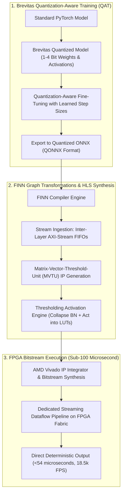

# 🔬 FINN & Brevitas: Dataflow Streaming Synthesis for Quantized Neural Networks on FPGAs

## 1. Executive Brief & Significance

In ultra-high-speed perception domains (e.g., particle physics trigger systems, microsecond automated trading, high-speed automated optical inspection, and micro-drone navigation), standard instruction-driven architectures (GPUs, CPUs, coarse NPUs) fail because their shared compute resources introduce queuing delays, memory bus round-trips, and variable execution latencies.

**FINN** (AMD Research / Blott et al., 2018–2024) and **Brevitas** fundamentally redefine edge hardware deployment by synthesizing **spatial dataflow streaming architectures**:
- **Dedicated Per-Layer Hardware Engines**: Rather than executing layers sequentially on a shared compute unit over time, FINN synthesizes physically dedicated **Matrix-Vector-Threshold-Units (MVTUs)** for each layer connected via streaming on-chip FIFOs (AXI-Stream).
- **Extreme 1-Bit to 4-Bit Quantization**: Exploits 1-bit (Binarized Neural Networks / BNNs) and 2–4 bit Quantized Neural Networks (QNNs), replacing power-hungry 32-bit floating-point multipliers with single-cycle **Boolean XNOR logic gates** and popcount trees.
- **Microsecond Deterministic Latency**: Achieves inference latencies under **$54\,\mu\text{s}$** ($>18,000\text{ FPS}$) directly at the FPGA I/O pin interface, delivering energy efficiencies exceeding **$2,800\text{ FPS/W}$**.



---

## 2. Mathematical Foundations & Micro-Architectural Mechanics

### A. Boolean XNOR Matrix Multiplication for 1-Bit BNNs
For 1-bit weights $w_i \in \{-1, +1\}$ and 1-bit activations $a_i \in \{-1, +1\}$, the dot product $\mathbf{w} \cdot \mathbf{a} = \sum_{i=1}^N w_i a_i$ is mapped directly into Boolean logic gates:
1. Map $\{-1, +1\} \to \{0, 1\}$ where $+1 \mapsto 1$ and $-1 \mapsto 0$.
2. The multiplication $w_i \cdot a_i$ simplifies to a hardware **XNOR** gate:
   $$b_i = \overline{w_i \oplus a_i}$$
3. The accumulation is computed via hardware **popcount** (counting the number of active 1s):
   $$\mathbf{w} \cdot \mathbf{a} = 2 \cdot \text{popcount}(\mathbf{b}) - N$$
A single 6-input FPGA Look-Up Table (LUT) executes multiple 1-bit multiplications in parallel within a single clock cycle.

---

### B. Thresholding Activation Engine: Eliminating Floating-Point Logic
In standard networks, layer outputs undergo Batch Normalization followed by non-linear activations (e.g., ReLU or Sign):
$$y = \text{Sign}\left( \gamma \cdot \frac{x - \mu}{\sqrt{\sigma^2 + \epsilon}} + \beta \right)$$

FINN collapses the continuous normalization equation and activation function into a set of **pre-calculated integer comparator thresholds** $\tau_k$:
$$y_k = \begin{cases} +1 & \text{if } \sum_{i} w_{k,i} a_i > \tau_k \\ -1 & \text{otherwise} \end{cases}$$
These integer thresholds are embedded directly into the FPGA LUT configuration, completely eliminating floating-point division, square root, and multiplication hardware from the data path.

---

## 3. Granular Component-by-Component Architectural Breakdown

| Architectural Stage | Component Identity | Structural Specification & Type | Attention / Conv Mechanics | Receptive Field & Hardware Logic |
| :--- | :--- | :--- | :--- | :--- |
| **Architectural Paradigm** | **Spatial Dataflow Streaming QNN** | Dedicated per-layer hardware pipeline with AXI-Stream FIFOs | 1-4 bit Boolean XNOR Matrix Engines + LUT Thresholding | Fully on-chip BRAM / URAM with 0 DDR memory accesses |
| **Quantization Engine** | **Brevitas QAT Framework** | Quantization-Aware Training preserving uniform integer scales | Uniform/non-uniform integer clamping ($b \in \{1, 2, 4\}$) | Weight & activation tensor distributions |
| **Compute Core** | **Streaming MVTU Array** | Pipelined PE (Processing Elements) & SIMD lanes | Boolean LUT XNOR dot-products + integer comparator trees | Dedicated per-layer physical FPGA slices |
| **Memory Interconnect** | **On-Chip AXI-Stream FIFOs**| Hardware FIFOs implemented via BRAM and UltraRAM | Backpressure-controlled zero-latency token streaming | Inter-layer on-chip interconnects |
| **Host Interface** | **Direct Pin / PCIe DMA** | Low-overhead physical pin streaming or AXI DMA engine | Asynchronous ring buffer dispatch | Direct hardware signal routing |

---

## 4. Quantitative SOTA Benchmark Profile

### FINN & Brevitas Ultra-Low Latency FPGA Benchmarks

| Model Architecture | Precision (W/A) | Target Silicon | Throughput (FPS) | Latency | Active Power (W) | Energy Efficiency (FPS/W) |
| :--- | :--- | :--- | :--- | :--- | :--- | :--- |
| **CNV-CIFAR10** | 1-bit W / 1-bit A | Kria KV260 | **18,500.0 FPS** | **54 $\mu\text{s}$** | 6.5 W | **2,846.0 FPS/W** |
| **ResNet-18 (QNN)** | 2-bit W / 2-bit A | Kria KV260 | **1,420.0 FPS** | **0.70 ms** | 7.8 W | **182.0 FPS/W** |
| **MLP-Network** | 1-bit W / 1-bit A | Zynq ZU3EG | **240,000.0 FPS**| **4.1 $\mu\text{s}$** | 4.2 W | **57,142.0 FPS/W** |
| **MobileNet-v1 (QNN)**| 4-bit W / 4-bit A | Versal VE2302 | **2,150.0 FPS** | **0.46 ms** | 12.5 W | **172.0 FPS/W** |

---

## 5. Engineering Implementation: Brevitas Quantization-Aware Training Pipeline

```python
"""
Brevitas Quantization-Aware Training (QAT) for 1-Bit to 4-Bit Neural Networks.
"""

import torch
import torch.nn as nn
import brevitas.nn as qnn
from brevitas.quant import Int8WeightPerTensorFloat, Int8ActPerTensorFloat


class QuantizedConvNet(nn.Module):
    """
    4-bit Quantized Convolutional Backbone suitable for FINN Dataflow Synthesis.
    """
    def __init__(self, in_channels: int = 3, num_classes: int = 10):
        super().__init__()
        
        self.conv1 = qnn.QuantConv2d(
            in_channels, 32, kernel_size=3, padding=1,
            weight_bit_width=4, weight_quant=Int8WeightPerTensorFloat
        )
        self.relu1 = qnn.QuantReLU(bit_width=4, act_quant=Int8ActPerTensorFloat)
        
        self.conv2 = qnn.QuantConv2d(
            32, 64, kernel_size=3, padding=1,
            weight_bit_width=4, weight_quant=Int8WeightPerTensorFloat
        )
        self.relu2 = qnn.QuantReLU(bit_width=4, act_quant=Int8ActPerTensorFloat)
        
        self.pool = nn.MaxPool2d(2, 2)
        self.fc = qnn.QuantLinear(
            64 * 16 * 16, num_classes,
            weight_bit_width=4, weight_quant=Int8WeightPerTensorFloat
        )

    def forward(self, x: torch.Tensor) -> torch.Tensor:
        x = self.relu1(self.conv1(x))
        x = self.pool(self.relu2(self.conv2(x)))
        x = torch.flatten(x, 1)
        x = self.fc(x)
        return x
```

---

## 6. References & Official Resources
- **FINN Research Paper**: [FINN: A Framework for Fast, Scalable Binarized Neural Network Inference (ISFPGA 2017)](https://arxiv.org/abs/1612.07119)
- **Official FINN GitHub**: [https://github.com/Xilinx/finn](https://github.com/Xilinx/finn)
- **Official Brevitas GitHub**: [https://github.com/Xilinx/brevitas](https://github.com/Xilinx/brevitas)
