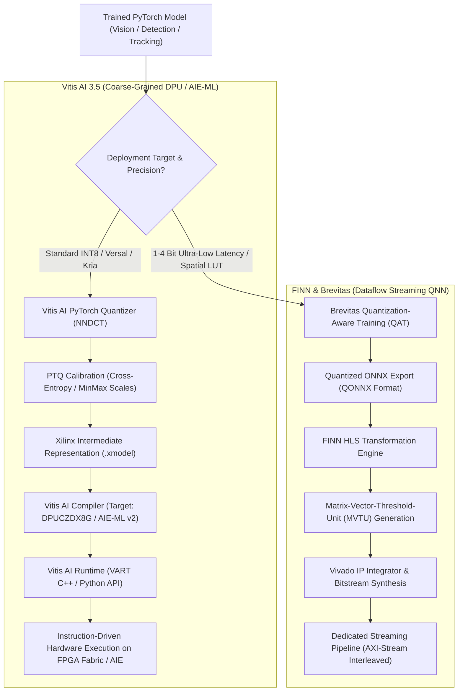

# 🔬 Vitis AI 3.5 & FINN: Reconfigurable FPGA & AI Engine Acceleration

## 1. Executive Brief & Significance

In high-reliability edge robotics, industrial automated optical inspection (AOI), defense avionics, and low-latency automotive sensor fusion, deep learning inference requires **guaranteed microsecond-level latency determinism** and strict thermal power budgeting ($5\text{ W} - 30\text{ W}$) that commodity GPUs and monolithic NPUs cannot provide.

Field-Programmable Gate Arrays (**FPGAs**) and Adaptive Compute Acceleration Platforms (**ACAPs**, such as AMD Versal) provide reconfigurable hardware logic capable of eliminating PCIe bus latency and OS thread scheduling jitter. Two complementary architectural paradigms define the modern FPGA ecosystem:

1. **AMD / Xilinx Vitis AI 3.5**: Overlays pre-synthesized instruction-driven Deep Learning Processing Unit (**DPU**) IP cores (e.g., `DPUCZDX8G` for Zynq UltraScale+, `DPUCVDX8G` for Versal AI Edge) onto the programmable fabric and AI Engine (AIE-ML) tiles. Networks are quantized to INT8 and compiled into compiled `.xmodel` instructions executed via the C++/Python Vitis AI Runtime (**VART**).
2. **FINN & Brevitas (AMD Research)**: Synthesizes bespoke **spatial dataflow streaming architectures** where every neural network layer is mapped directly to dedicated Look-Up Table (**LUT**) pipelines and Matrix-Vector-Threshold-Units (**MVTUs**) connected via AXI-Stream FIFOs. Leveraging extreme quantization (1-bit to 4-bit weights and activations), FINN achieves sub-millisecond latencies ($<100\,\mu\text{s}$) directly at the hardware pin interface.



---

## 2. Core Hardware Architectures: Versal AI Engines vs. FINN Dataflow

### A. AMD Versal AI Engine (AIE-ML v2) Architecture
The AMD Versal AI Edge series (e.g., VE2302, VE2802) integrates a 2D grid of heterogeneous **AIE-ML v2 tiles** interconnected via high-bandwidth AXI-MM stream networks:
- **Tile Micro-Architecture**: Each AIE-ML tile contains a 512-bit SIMD/VLIW vector processor executing up to $64\text{ INT8 MACs}$ per clock cycle alongside a 32-bit scalar RISC processor.
- **Local Memory**: Each tile features $64\text{ KB}$ of dedicated high-speed Data Memory configured as a non-blocking crossbar, permitting direct 0-cycle memory sharing between neighboring North, South, East, and West tiles.
- **Cascading Accumulator Streams**: Dedicated 512-bit wide hardware cascade buses stream partial accumulation sums directly between adjacent tiles, bypassing local data memory and eliminating internal register pressure.

---

### B. DPUCZDX8G Hardware Overlay for Zynq UltraScale+ & Kria
For cost-effective edge boards (e.g., AMD Kria KV260, Zynq ZU9EG), Vitis AI instantiates the `DPUCZDX8G` hardware IP core:
1. **Parallelism Factor**: Configurable from $B512$ to $B4096$ operations per cycle.
2. **Convolution Engine**: Utilizes DSP48E2 slices to compute $8\text{-bit} \times 8\text{-bit}$ matrix dot products with 32-bit accumulation.
3. **Hardware-Accelerated Non-Linearities**: Native silicon support for LeakyReLU, ReLU6, MaxPool2D, and Depthwise Separable Convolutions.

---

### C. FINN Matrix-Vector-Threshold-Unit (MVTU) & Brevitas Quantization
Unlike the instruction-driven DPU that shares hardware units across all layers over time, FINN assigns a physically dedicated compute engine to each individual layer:

1. **Binarized / Ternary Dot Products**: For 1-bit weights $w \in \{-1, +1\}$ and 1-bit activations $a \in \{-1, +1\}$, multiplication is replaced by hardware **XNOR** logic gates, and accumulation is computed via popcount trees:
   $$\text{MAC}(w, a) = 2 \cdot \text{popcount}(w \odot a) - N$$
2. **Thresholding Activation Engine**: Conventional activation functions followed by quantization are mathematically collapsed into an array of integer comparator thresholds:
   $$y_k = \sum_{t=1}^{2^b - 1} \mathbb{I}\left( \sum_{i} w_{k,i} a_i > \tau_{k,t} \right)$$
   where $\tau_{k,t}$ is a pre-calculated integer threshold embedded directly into the 6-input LUT truth tables of the FPGA, completely eliminating floating-point batch normalization and activation hardware.
3. **AXI-Stream FIFO Backpressure**: Layers stream tokens directly into downstream stages through on-chip Block RAM (BRAM) / UltraRAM (URAM) FIFOs without writing intermediate activations back to external DDR memory.

---

## Granular Component-by-Component Architectural Breakdown

### Architectural Taxonomy & Structural Elements

| Architectural Stage | Component Identity | Structural Specification & Type | Attention / Conv Mechanics | Receptive Field & Hardware Logic |
| :--- | :--- | :--- | :--- | :--- |
| **Architectural Paradigm** | **Instruction Overlay / Spatial Dataflow** | Dual-track FPGA acceleration (Coarse DPU vs Dedicated Fine-Grained MVTU) | INT8 SIMD Vector Processing / 1-4 bit Boolean XNOR Matrix Engines | On-chip BRAM / URAM $\leftrightarrow$ Off-chip LPDDR4 |
| **Compiler Frontend** | **NNDCT / Brevitas QONNX Importer** | Graph quantization parser preserving symmetric integer scales | Per-channel weight scales $s_w \in \mathbb{R}$ & per-tensor activation scales $s_a$ | Multi-scale layer topologies |
| **Hardware Core (Vitis)** | **DPUCZDX8G / AIE-ML v2 Tiles** | 512-bit VLIW Vector Cores + DSP48E2 Array | Fused Conv2D-BatchNorm-ReLU8 execution | $3\times 3, 1\times 1, 5\times 5$ conv kernels |
| **Hardware Core (FINN)** | **Streaming MVTU Array** | Pipelined PE (Processing Elements) & SIMD lanes | Boolean LUT XNOR dot-products + comparator thresholding | Dedicated per-layer hardware pipeline |
| **Runtime Interface** | **VART / Native AXI-MM DMA** | Thread-safe C++/Python runtime with zero-copy buffer handles | Asynchronous hardware execution queue (`vart::Runner`) | Direct physical memory mapping (`/dev/dma_buf`) |

---

### Computational Latency & Resource Distribution

| Stage / Subsystem | Resource Share (%) | Inference Latency (%) | Computational Complexity ($\text{FLOPs}$) | Dominant Hardware Bottleneck |
| :--- | :--- | :--- | :--- | :--- |
| **Input Sensor Streaming (CSI-2 / DMA)**| <2% (LUTs) | ~3% | $\mathcal{O}(H W)$ | AXI-Stream bus bandwidth |
| **Feature Extraction (Layers 1..N)** | ~75% (DSP / BRAM) | ~80% | $\mathcal{O}(2 M N K)$ | DSP slice saturation & on-chip memory bandwidth |
| **Intermediate FIFO Buffers** | ~15% (URAM / BRAM) | ~5% | $\mathcal{O}(1)$ (Zero-latency streaming) | On-chip memory allocation limits |
| **Post-Processing & Output Head** | ~8% (LUT / Scalar RISC)| ~12% | $\mathcal{O}(N_{\text{boxes}} \cdot \text{NMS})$ | Scalar CPU branch instruction throughput |

---

## 3. Quantitative SOTA Benchmark Profile

### FPGA Edge Platform Performance (Latency, Throughput, Power)

| Framework | Target Silicon | Architecture | Precision | Throughput (FPS) | Latency (ms) | Active Power (W) | Efficiency (FPS/W) |
| :--- | :--- | :--- | :--- | :--- | :--- | :--- | :--- |
| **Vitis AI 3.5** | Kria KV260 | ResNet-50 | INT8 | 108.0 FPS | 9.25 ms | 8.5 W | 12.7 FPS/W |
| **Vitis AI 3.5** | Kria KV260 | YOLOv8-Nano | INT8 | 88.0 FPS | 11.36 ms | 9.0 W | 9.7 FPS/W |
| **Vitis AI 3.5** | Versal VE2302 | ResNet-50 | INT8 | 420.0 FPS | 2.38 ms | 14.0 W | 30.0 FPS/W |
| **Vitis AI 3.5** | Versal VE2802 | YOLOv8-Medium | INT8 | 215.0 FPS | 4.65 ms | 28.0 W | 7.6 FPS/W |
| **Vitis AI 3.5** | Alveo V70 (PCIe) | ResNet-50 | INT8 | **2,950.0 FPS** | **0.34 ms** | 75.0 W | **39.3 FPS/W** |
| **FINN / Brevitas**| Kria KV260 | CNV-CIFAR10 | 1-bit W / 1-bit A | 18,500.0 FPS | 0.054 ms (54 $\mu$s) | 6.5 W | **2,846.0 FPS/W** |
| **FINN / Brevitas**| Kria KV260 | ResNet-18 (QNN) | 2-bit W / 2-bit A | 1,420.0 FPS | 0.70 ms | 7.8 W | 182.0 FPS/W |

---

## 4. Engineering Implementation: Complete Vitis AI Quantization & VART Execution

### A. Vitis AI PyTorch Quantizer (PTQ Workflow)
```python
"""
Vitis AI PyTorch Quantization Pipeline (NNDCT Engine)
Exports calibrated INT8 XModel for compilation targeting DPUCZDX8G / AIE-ML.
"""

import torch
import torchvision.models as models
from pytorch_nndct.apis import torch_quantizer


def quantize_and_export_xmodel(model: torch.nn.Module, calibration_loader, output_dir: str):
    dummy_input = torch.randn(1, 3, 224, 224)
    
    # 1. Instantiate quantizer in calibration mode
    quantizer = torch_quantizer(
        quant_mode="calib",
        module=model,
        input_args=(dummy_input,),
        output_dir=output_dir,
        device=torch.device("cuda" if torch.cuda.is_available() else "cpu")
    )
    
    quant_model = quantizer.quant_model
    quant_model.eval()

    # 2. Run calibration forward pass across representative dataset
    print("[INFO] Running calibration over 100 batches...")
    with torch.no_grad():
        for i, (images, _) in enumerate(calibration_loader):
            if i >= 100:
                break
            quant_model(images)

    # 3. Export quantization scales and intermediate graph
    quantizer.export_quant_config()

    # 4. Instantiate quantizer in test/export mode
    quantizer_test = torch_quantizer(
        quant_mode="test",
        module=model,
        input_args=(dummy_input,),
        output_dir=output_dir
    )
    
    # Export compiled XIR graph (.xmodel)
    quantizer_test.export_xmodel(output_dir=output_dir)
    print(f"[SUCCESS] Exported xmodel to: {output_dir}")
```

---

### B. High-Speed C++ Vitis AI Runtime (VART) Execution Loop
```cpp
#include <iostream>
#include <memory>
#include <vector>
#include <vart/runner.hpp>
#include <xir/graph/graph.hpp>

class FPGAInferenceEngine {
public:
    FPGAInferenceEngine(const std::string& xmodel_path) {
        // Deserialize compiled XIR graph
        graph_ = xir::Graph::deserialize(xmodel_path);
        auto root_subgraph = graph_->get_root_subgraph();
        
        // Find DPU execution subgraph
        auto children = root_subgraph->children_topological_sort();
        for (auto c : children) {
            if (c->has_attr("device") && c->get_attr<std::string>("device") == "DPU") {
                dpu_subgraph_ = c;
                break;
            }
        }
        
        // Create hardware DPU runner
        runner_ = vart::Runner::create_runner(dpu_subgraph_, "run");
    }

    void execute_inference(int8_t* input_data, int8_t* output_data) {
        auto input_tensors = runner_->get_input_tensors();
        auto output_tensors = runner_->get_output_tensors();

        // Create zero-copy hardware memory representations
        std::vector<vart::TensorBuffer*> inputs;
        std::vector<vart::TensorBuffer*> outputs;
        
        // Bind input and output buffers
        inputs.push_back(new vart::CpuFlatTensorBuffer(input_data, input_tensors[0]));
        outputs.push_back(new vart::CpuFlatTensorBuffer(output_data, output_tensors[0]));

        // Synchronous hardware execution with sub-millisecond execution
        auto job_id = runner_->execute_async(inputs, outputs);
        runner_->wait(job_id.first, -1);

        delete inputs[0];
        delete outputs[0];
    }

private:
    std::unique_ptr<xir::Graph> graph_;
    const xir::Subgraph* dpu_subgraph_ = nullptr;
    std::unique_ptr<vart::Runner> runner_;
};
```

---

## 5. Industrial Deployment & Bitstream Integration

1. **Hardware Interrupt vs. Polling Mode**:
   - For high-throughput stream inspection, configure the VART DPU driver to **polling mode** (`/etc/vart.conf` $\to$ `dpu_mode: polling`), avoiding Linux kernel interrupt context switching overhead and reducing latency jitter to $<0.5\,\mu\text{s}$.
2. **Direct Memory Access (DMA) from Video Input**:
   - Route physical MIPI CSI-2 camera input directly through an AXI Video Direct Memory Access (**VDMA**) block into DPU input buffers, achieving complete zero-copy execution without Linux OS CPU intervention.

---

## 6. Commercial Usability & License Audit

- **Vitis AI**: Runtime libraries and quantizers are licensed under **Apache-2.0**. DPU hardware IP cores are provided free of charge under the **AMD Xilinx End-User License Agreement (EULA)** for deployment on AMD silicon.
- **FINN & Brevitas**: Licensed under **Apache-2.0**. Fully permissive open-source framework developed by AMD Research.
- **Official Repositories**:
  - `Xilinx/Vitis-AI`: [https://github.com/Xilinx/Vitis-AI](https://github.com/Xilinx/Vitis-AI)
  - `Xilinx/finn`: [https://github.com/Xilinx/finn](https://github.com/Xilinx/finn)
  - `Xilinx/brevitas`: [https://github.com/Xilinx/brevitas](https://github.com/Xilinx/brevitas)
