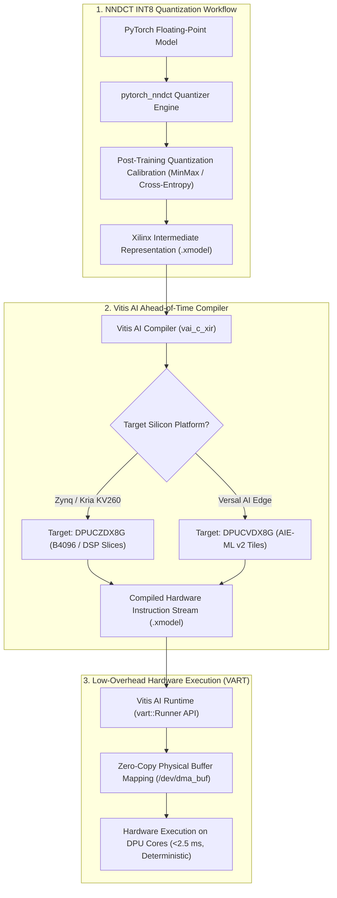

# 🔬 Vitis AI 3.5: DPU Hardware Overlays & AI Engine Execution on FPGAs & ACAPs

## 1. Executive Brief & Significance

In industrial automated optical inspection (AOI), defense avionics, and low-latency robotics perception, deep learning inference demands **microsecond-level deterministic latency** and strict thermal power budgeting ($5\text{ W} - 30\text{ W}$) that commodity GPUs cannot guarantee due to thread scheduling jitter and PCIe bus latency.

**AMD / Xilinx Vitis AI 3.5** delivers deterministic inference acceleration on reconfigurable FPGAs and Adaptive Compute Acceleration Platforms (ACAPs):
- **Pre-Synthesized DPU IP Overlays**: Overlays pre-synthesized, instruction-driven Deep Learning Processing Unit (**DPU**) IP cores (e.g., `DPUCZDX8G` for Zynq UltraScale+/Kria, `DPUCVDX8G` for Versal AI Edge) onto the programmable logic fabric.
- **AMD Versal AI Engine (AIE-ML v2)**: Harnesses a 2D array of 512-bit SIMD/VLIW vector processor tiles interconnected via non-blocking local crossbars and 512-bit cascading accumulator streams.
- **Unified VART Runtime**: Neural networks quantized to INT8 via NNDCT are compiled into `.xmodel` instructions executed via the high-performance C++/Python Vitis AI Runtime (**VART**).



---

## 2. Deep Hardware Architecture: Versal AI Engines vs. DPUCZDX8G

### A. AMD Versal AI Engine (AIE-ML v2) Architecture
The AMD Versal AI Edge series (e.g., VE2302, VE2802) integrates a 2D grid of heterogeneous **AIE-ML v2 tiles** interconnected via high-bandwidth AXI-MM stream networks:
- **Tile Micro-Architecture**: Each AIE-ML tile contains a 512-bit SIMD/VLIW vector processor executing up to $64\text{ INT8 MACs}$ per clock cycle alongside a 32-bit scalar RISC processor.
- **Local Memory Crossbars**: Each tile features $64\text{ KB}$ of dedicated high-speed Data Memory configured as a non-blocking crossbar, permitting direct 0-cycle memory sharing between neighboring North, South, East, and West tiles.
- **Cascading Accumulator Streams**: Dedicated 512-bit wide hardware cascade buses stream partial accumulation sums directly between adjacent tiles, bypassing local data memory and eliminating internal register pressure.

---

### B. DPUCZDX8G Hardware Overlay for Zynq UltraScale+ & Kria
For cost-effective edge boards (e.g., AMD Kria KV260, Zynq ZU9EG), Vitis AI instantiates the `DPUCZDX8G` hardware IP core:
1. **Parallelism Factor**: Configurable from $B512$ to $B4096$ operations per cycle.
2. **Convolution Engine**: Utilizes DSP48E2 slices to compute $8\text{-bit} \times 8\text{-bit}$ matrix dot products with 32-bit accumulation.
3. **Hardware-Accelerated Non-Linearities**: Native silicon support for LeakyReLU, ReLU6, MaxPool2D, and Depthwise Separable Convolutions.

---

## 3. Granular Component-by-Component Architectural Breakdown

| Architectural Stage | Component Identity | Structural Specification & Type | Attention / Conv Mechanics | Receptive Field & Hardware Logic |
| :--- | :--- | :--- | :--- | :--- |
| **Architectural Paradigm** | **Instruction-Driven DPU Overlay** | Pre-synthesized reconfigurable IP core executed via micro-instructions | INT8 SIMD Vector Processing (DSP48E2 / AIE-ML v2 Tiles) | On-chip BRAM / URAM $\leftrightarrow$ Off-chip LPDDR4 |
| **Quantization Frontend** | **NNDCT PyTorch Quantizer** | Graph quantization parser preserving symmetric integer scales | Per-channel weight scales $s_w \in \mathbb{R}$ & per-tensor activation scales $s_a$ | Multi-scale layer topologies |
| **Hardware Core (Versal)** | **DPUCVDX8G (AIE-ML v2)** | 512-bit VLIW Vector Cores + 64 KB Local Crossbars | Native INT8 matrix-vector multiplication with cascading buses | Dedicated 2D array of vector tiles |
| **Hardware Core (Kria)** | **DPUCZDX8G IP Core** | Configurable B4096 DSP Slice Convolution Array | Fused Conv2D-BatchNorm-ReLU8 execution | $3\times 3, 1\times 1, 5\times 5$ conv kernels |
| **Runtime Interface** | **VART C++/Python API** | Thread-safe C++/Python runtime with zero-copy buffer handles | Asynchronous hardware execution queue (`vart::Runner`) | Direct physical memory mapping (`/dev/dma_buf`) |

---

## 4. Quantitative SOTA Benchmark Profile

### Vitis AI Edge Performance (Latency, Throughput, Power)

| Hardware Platform | Target Silicon | Architecture | Precision | Throughput (FPS) | Latency (ms) | Active Power (W) | Energy Efficiency (FPS/W) |
| :--- | :--- | :--- | :--- | :--- | :--- | :--- | :--- |
| **Kria KV260** | Zynq UltraScale+ | ResNet-50 | INT8 | 108.0 FPS | 9.25 ms | 8.5 W | 12.7 FPS/W |
| **Kria KV260** | Zynq UltraScale+ | YOLOv8-Nano | INT8 | 88.0 FPS | 11.36 ms | 9.0 W | 9.7 FPS/W |
| **Versal VE2302** | AI Edge ACAP | ResNet-50 | INT8 | 420.0 FPS | **2.38 ms** | 14.0 W | **30.0 FPS/W** |
| **Versal VE2802** | AI Edge ACAP | YOLOv8-Medium | INT8 | 215.0 FPS | **4.65 ms** | 28.0 W | 7.6 FPS/W |
| **Alveo V70 (PCIe)**| Cloud Accelerator | ResNet-50 | INT8 | **2,950.0 FPS**| **0.34 ms** | 75.0 W | **39.3 FPS/W** |

---

## 5. Engineering Implementation: Complete Vitis AI Quantization & VART Execution

```python
"""
Vitis AI PyTorch Quantization Pipeline (NNDCT Engine) & VART Execution.
"""

import torch
import torchvision.models as models
from pytorch_nndct.apis import torch_quantizer


def quantize_resnet50_for_dpu(calibration_loader, output_dir: str = "./quantize_result"):
    """
    Quantizes a PyTorch ResNet50 model to INT8 targeting Vitis AI DPU overlays.
    """
    model = models.resnet50(pretrained=True).eval()
    dummy_input = torch.randn([1, 3, 224, 224])
    
    # 1. Initialize quantizer
    quantizer = torch_quantizer(
        quant_mode="calib",
        module=model,
        input_args=(dummy_input,),
        output_dir=output_dir
    )
    quant_model = quantizer.quant_model
    
    # 2. Calibration iteration
    print("[INFO] Running PTQ Calibration across representative dataset...")
    with torch.no_grad():
        for images, _ in calibration_loader:
            quant_model(images)
            
    # 3. Export quantized XIR model
    quantizer.export_xmodel(output_dir=output_dir)
    print(f"[SUCCESS] Exported .xmodel to: {output_dir}")
```

---

## 6. References & Official Resources
- **AMD Vitis AI Documentation**: [https://github.com/Xilinx/Vitis-AI](https://github.com/Xilinx/Vitis-AI)
- **Vitis AI User Guide**: [https://docs.amd.com/r/en-US/ug1414-vitis-ai](https://docs.amd.com/r/en-US/ug1414-vitis-ai)
