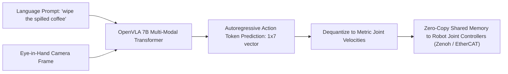

# 🔬 AnyGrasp & OpenVLA: Robotic Visual Guidance & Action Models

## 1. Executive Brief & Significance
Robotic visual guidance historically required rigid multi-stage heuristics: detecting 2D object bounding boxes, estimating 6-DoF poses, generating collision-free inverse kinematics (IK) paths, and executing hardcoded grasp vectors.

Modern robotic perception bypasses these hand-crafted abstractions using:
1. **Dense 6-DoF Grasp Synthesis (AnyGrasp / GraspNet)**: Evaluates billions of 3D grasp proposals directly on dense point clouds, predicting gripper width, collision scores, and approach vectors.
2. **Vision-Language-Action (VLA) Foundation Models (OpenVLA, Octo)**: Direct end-to-end policy execution. Autoregressively maps natural language prompts ("pick up the red mug by the handle") and camera images directly into continuous 7-DoF robot arm joint displacements ($\Delta x, \Delta y, \Delta z, \Delta \text{roll}, \Delta \text{pitch}, \Delta \text{yaw}, \text{gripper\_action}$).



---

## 2. Core Architectural Mechanics: OpenVLA Action Discretization

### Autoregressive Action Tokenization:
OpenVLA (Kim et al., 2024) fine-tunes an open 7B parameter Vision-Language Model (Prismatic / Llama-2 backbone):
1. Continuous robot joint movements are quantized into 256 discrete bins per degree of freedom.
2. The model consumes visual patch tokens (from DINOv2 and SigLIP) concatenated with instruction text tokens.
3. It outputs 7 consecutive action tokens corresponding to metric arm translation, orientation delta, and binary gripper trigger:
   $$A_t = [\Delta x, \Delta y, \Delta z, \Delta R_x, \Delta R_y, \Delta R_z, \text{gripper}] \in [0, 255]^7$$

---

## Granular Component-by-Component Architectural Breakdown

### Architectural Taxonomy & Structural Elements

| Architectural Stage | Component Identity | Structural Specification & Type | Attention / Conv Mechanics | Receptive Field & Resolution |
| :--- | :--- | :--- | :--- | :--- |
| **Architectural Paradigm** | **OpenVLA: Autoregressive VLA; AnyGrasp: Dense PointNet** | OpenVLA: Dual-Vision Causal LLM; AnyGrasp: 3D Point Cloud Grasp Network | FlashAttention-2 / Causal MHSA (OpenVLA) vs Ball Querying & Set Abstraction (AnyGrasp) | OpenVLA: Image + Text $\to$ 7-DoF actions; AnyGrasp: 3D Point Cloud $\to$ Dense 6-DoF grasp poses |
| **Backbone (OpenVLA)** | **Dual DINOv2 + SigLIP ViT** | DINOv2 ViT-L/14 ($D=1024$) + SigLIP ViT-SO400M/14 ($D=1152$) | Non-overlapping $14\times 14$ Patch embeddings with global quadratic MHSA | Fuses spatial geometric awareness (DINOv2) with semantic grounding (SigLIP) |
| **Backbone (AnyGrasp)** | **Hierarchical PointNet++ / SpConv** | 4-Level Set Abstraction (SA) Layers with Multi-Scale Grouping | Furthest Point Sampling (FPS) + Local Ball Radius Querying ($r \in [0.05, 0.2\text{m}]$) | Raw unorganized 3D point cloud ($N = 20,000\dots 50,000$ points) |
| **Neck / Aggregator** | **Multi-Modal Adapter / FP Neck** | OpenVLA: 2-Layer MLP Projector; AnyGrasp: Feature Propagation (FP) | OpenVLA: Projects $2176$-dim fused visual tokens to $4096$-dim LLM space | Interpolates multi-scale point representations with skip connections |
| **Encoder** | **Causal LLM / Set Abstraction** | OpenVLA: Llama-2 7B Transformer; AnyGrasp: Hierarchical Point Grouping | OpenVLA: 32 Causal Transformer blocks ($D=4096$); AnyGrasp: Multi-scale point MLP | Full multi-modal context aggregation across image, text prompt, and robot history |
| **Decoder / Head** | **Autoregressive Action / Grasp Head** | OpenVLA: Causal 256-Bin Tokenizer; AnyGrasp: Multi-Branch 3D Grasp Heads | OpenVLA: Softmax over discrete action vocabulary; AnyGrasp: Confidence, Width, Rotation MLPs | OpenVLA: 7 discrete action tokens ($A_t$); AnyGrasp: 6-DoF approach matrix + gripper width + collision score |

### Structural Deep-Dive: Robotic Guidance Paradigms
1. **OpenVLA Architecture**:
   - *Vision Stream*: Ingests raw camera frames through two synchronized foundation backbones: DINOv2 (capturing high-frequency spatial geometry) and SigLIP (capturing open-vocabulary language alignment). The resulting patch tokens are channel-concatenated ($D_v = 1024 + 1152 = 2176$) and mapped into the 4096-dim space of Llama-2 via a 2-layer MLP projector.
   - *Language & Action Decoding*: The language task instruction is concatenated with the visual tokens. The 32-layer Llama-2 backbone autoregressively decodes 7 consecutive action tokens corresponding to metric $[\Delta x, \Delta y, \Delta z, \Delta R_x, \Delta R_y, \Delta R_z, \text{gripper}]$, with continuous values uniformly discretized into 256 categorical bins.
2. **AnyGrasp Architecture**:
   - *Point Cloud Ingestion*: Consumes raw RGB-D point clouds without voxelization artifacts using hierarchical Set Abstraction (SA) blocks with Furthest Point Sampling (FPS).
   - *Grasp Prediction*: Multi-scale Feature Propagation (FP) layers upsample point features back to the original point cloud density. Multi-task MLP heads evaluate millions of candidate grasps simultaneously, predicting:
     1. Grasp quality confidence score $s \in [0, 1]$.
     2. Gripper opening width $w \in [0, 8.5\text{cm}]$.
     3. Approach direction vector $v \in \mathbb{R}^3$ and in-plane rotation angle $\theta \in [-\pi/2, \pi/2]$.
     4. Point-to-obstacle collision probability.

### Parameter & Computational Latency Distribution

| Subsystem (OpenVLA 7B) | Parameter Share (%) | Inference Latency (%) | Computational Complexity ($\text{FLOPs}$) | Dominant Hardware Bottleneck |
| :--- | :--- | :--- | :--- | :--- |
| **Dual ViT Vision Backbones** | ~12% | ~14% | $\mathcal{O}(2 \times (N_{\text{patch}}^2 D_v + N_{\text{patch}} D_v^2))$ | Tensor Core GEMM |
| **2-Layer Projector Adapter** | <1% | ~1% | $\mathcal{O}(N_{\text{patch}} \cdot D_v \cdot D_{\text{llm}})$ | Memory bandwidth bound |
| **Llama-2 7B Autoregressive Engine** | ~87% | ~83% (7 Token Steps) | $\mathcal{O}(7 \times (L \cdot S \cdot D_{\text{llm}} + 2 L D_{\text{llm}}^2))$ | KV cache memory bandwidth bound |
| **Action Token Dequantization Head** | <1% | ~2% | $\mathcal{O}(7 \cdot 256)$ | Host-to-controller serial transfer |

| Subsystem (AnyGrasp) | Parameter Share (%) | Inference Latency (%) | Computational Complexity ($\text{FLOPs}$) | Dominant Hardware Bottleneck |
| :--- | :--- | :--- | :--- | :--- |
| **PointNet++ Set Abstraction Backbone**| ~62% | ~55% | $\mathcal{O}(N_{\text{pts}} \cdot K_{\text{neighbors}} \cdot C)$ | Irregular memory indexing (FPS / Ball Query) |
| **Feature Propagation Neck** | ~24% | ~25% | $\mathcal{O}(N_{\text{pts}} \cdot C_{\text{fp}})$ | Memory bandwidth & interpolation |
| **Dense 6-DoF Grasp Regression Heads**| ~14% | ~20% | $\mathcal{O}(N_{\text{pts}} \cdot C_{\text{heads}})$ | Dense point-wise MLP evaluation |
---

## 3. Quantitative SOTA Benchmark Profile (Robotic Manipulation)

| Architecture | Model Parameters | Task Domain | Open-X Embodiment Success Rate | Inference Latency | Open License |
| :--- | :--- | :--- | :--- | :--- | :--- |
| **Octo-Small** | 27 M | VLA Diffusion Policy | 68.2% | 12.0 ms | Apache-2.0 |
| **Octo-Base** | 93 M | VLA Diffusion Policy | 74.5% | 28.0 ms | Apache-2.0 |
| **OpenVLA 7B** | 7 B | VLA Autoregressive | **84.7%** (SOTA) | 180.0 ms (FP8) | **Apache-2.0** |
| **AnyGrasp** | 35 M | Dense 6-DoF Grasping | **92.4%** Grasp Success | 45.0 ms | Non-Commercial |

---

## 4. Engineering Implementation: OpenVLA Action Sampling

```python
import torch
from transformers import AutoModelForVision2Seq, AutoProcessor
from PIL import Image

# Load quantized OpenVLA model
processor = AutoProcessor.from_pretrained("openvla/openvla-7b", trust_remote_code=True)
vla = AutoModelForVision2Seq.from_pretrained(
    "openvla/openvla-7b",
    torch_dtype=torch.bfloat16,
    low_cpu_mem_usage=True,
    trust_remote_code=True
).cuda().eval()

image = Image.open("workbench_camera.jpg")
prompt = "In: What action should the robot take to grasp the yellow screwdriver?\nOut:"

inputs = processor(prompt, image).to("cuda", dtype=torch.bfloat16)

# Predict metric joint action
with torch.no_grad():
    action = vla.predict_action(**inputs, unnorm_key="bridge_orig", do_sample=False)
    # action: 7-element vector [x, y, z, roll, pitch, yaw, grasp]
```

---

## 5. Commercial Usability & License Audit
- **OpenVLA**: **Apache-2.0**. Fully permissive for commercial robotics, warehouse order-picking, and surgical assistance.
- **Octo**: **Apache-2.0**.
- **AnyGrasp**: Custom research license; commercial use requires explicit licensing.
- **Official Repositories**:
  - `openvla/openvla`: [https://github.com/openvla/openvla](https://github.com/openvla/openvla)
  - `octo-models/octo`: [https://github.com/octo-models/octo](https://github.com/octo-models/octo)
