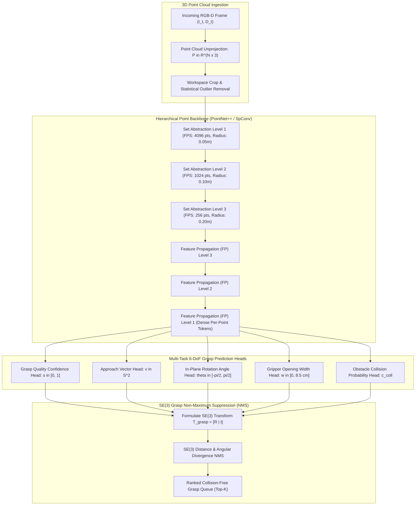

# 🔬 AnyGrasp: Zero-Shot Dense 6-DoF Robotic Grasp Pose Detection

## 1. Executive Brief & Significance

Robotic grasping in unstructured and heavily cluttered environments historically relied on rigid, hand-engineered pipelines: segmenting 2D object bounding boxes, performing template-based CAD matching, executing sampling-based collision checkers, and planning kinematic reachability. In scenes with novel, unmodeled objects, transparent glass, or dense piles of overlapping clutter, these multi-stage heuristics suffer from cascading catastrophic failure.

**AnyGrasp** (Fang et al., Shanghai Jiao Tong University / AgileX, 2023) and the foundational **GraspNet** framework formulate robotic grasping as a **dense, zero-shot 6-DoF grasp pose evaluation problem** directly over raw 3D point clouds. Key architectural features include:
- **Direct 3D Point Cloud Processing**: Ingests raw, unorganized RGB-D point clouds ($20,000-50,000$ points) using hierarchical Set Abstraction without requiring lossy 2D heightmap voxelization or explicit CAD models.
- **Continuous 6-DoF Pose Parameterization**: Simultaneously evaluates millions of candidate 3D parallel-jaw grasp configurations, predicting 3D translation $\mathbf{t} \in \mathbb{R}^3$, 3D rotation $\mathbf{R} \in SO(3)$, gripper opening width $w$, and grasp confidence score $s$.
- **Real-Time Collision-Aware Grasp Filtering**: Integrated collision estimation networks verify reachability against background obstacles in $<50\text{ ms}$, delivering actionable grasps directly to robot trajectory generators.



---

## 2. Mathematical Foundations: 6-DoF Grasp Pose Formulation

### A. Parallel-Jaw Grasp Parameterization in $SE(3)$
A 6-DoF parallel-jaw grasp configuration $G$ is defined by its spatial contact center $\mathbf{p} \in \mathbb{R}^3$, 3D rotation matrix $\mathbf{R} \in SO(3)$, gripper opening width $w \in \mathbb{R}^+$, and grasp depth $d \in \mathbb{R}^+$:

$$G = (\mathbf{R}, \mathbf{p}, w, d)$$

The rotation matrix $\mathbf{R} = [\mathbf{r}_{\text{approach}}, \mathbf{r}_{\text{closing}}, \mathbf{r}_{\text{normal}}] \in SO(3)$ is parameterized by:
1. **Approach Vector** $\mathbf{v}_{\text{app}} \in \mathbb{S}^2$: The direction along which the gripper approaches the target point.
2. **In-Plane Rotation Angle** $\theta \in [-\pi/2, \pi/2]$: Rotation around the approach vector determining finger closing alignment.
3. **Closing Vector** $\mathbf{v}_{\text{close}} \in \mathbb{S}^2$: Direction orthogonal to the approach vector along which the parallel fingers close.

$$\mathbf{R} = \text{Rot}(\mathbf{v}_{\text{app}}, \theta)$$

---

### B. Multi-Task Grasp Learning Objective
AnyGrasp optimizes a multi-task loss function over active sample points:

$$\mathcal{L}_{\text{grasp}} = \mathcal{L}_{\text{score}} + \lambda_1 \mathcal{L}_{\text{approach}} + \lambda_2 \mathcal{L}_{\text{angle}} + \lambda_3 \mathcal{L}_{\text{width}} + \lambda_4 \mathcal{L}_{\text{collision}}$$

1. **Grasp Quality Score Loss**: Smooth L1 loss / Binary Cross Entropy predicting physical grasp success:
   $$\mathcal{L}_{\text{score}} = \text{SmoothL1}(s_{\text{pred}}, s_{\text{gt}})$$
2. **Approach Vector Loss**: Cosine similarity loss constraining approach alignment:
   $$\mathcal{L}_{\text{approach}} = 1 - \langle \mathbf{v}_{\text{pred}}, \mathbf{v}_{\text{gt}} \rangle$$
3. **In-Plane Angle Classification / Regression**:
   $$\mathcal{L}_{\text{angle}} = \text{SmoothL1}(\theta_{\text{pred}}, \theta_{\text{gt}})$$
4. **Gripper Width Regression**:
   $$\mathcal{L}_{\text{width}} = \frac{|w_{\text{pred}} - w_{\text{gt}}|}{w_{\text{max}}}$$

---

### C. $SE(3)$ Grasp Non-Maximum Suppression (NMS)
To eliminate redundant, clustered grasp proposals, $SE(3)$ NMS suppresses candidates whose spatial distance $\Delta d$ and angular difference $\Delta \theta$ fall below interaction thresholds:

$$\Delta d = \|\mathbf{p}_i - \mathbf{p}_j\|_2 < \tau_{\text{dist}} \quad (1.5\text{ cm}), \qquad \Delta \theta = \arccos\left(\frac{\text{Tr}(\mathbf{R}_i^T \mathbf{R}_j) - 1}{2}\right) < \tau_{\text{angle}} \quad (15^\circ)$$

---

## 3. Granular Component-by-Component Architectural Breakdown

| Architectural Stage | Component Identity | Structural Specification & Type | Attention / Conv Mechanics | Receptive Field & Dimensionality |
| :--- | :--- | :--- | :--- | :--- |
| **Architectural Paradigm** | **Dense 6-DoF Point Cloud Grasp Network** | Hierarchical Set Abstraction + Multi-Task Grasp Regression Heads | Ball Querying & Furthest Point Sampling (FPS) | Raw 3D point cloud ($N = 20\text{k}\dots 50\text{k}$) $\to$ Dense grasp field |
| **Backbone** | **PointNet++ / Sparse 3D Conv** | 4-Stage Set Abstraction (SA) with Multi-Scale Grouping (MSG) | Ball radius queries ($r \in [0.04, 0.20\text{m}]$) + Local point MLPs | Hierarchical downsampling: $20\text{k} \to 4096 \to 1024 \to 256$ points |
| **Neck / Decoder** | **Feature Propagation (FP) Neck** | 3-Stage Feature Propagation with inverse distance weighted interpolation | Skip connections concatenating multi-scale encoder features | Upsamples latent tokens back to dense per-point resolution |
| **Approach Head** | **Direction Vector MLP** | 3-Layer Linear + LayerNorm + L2 Normalization | Continuous vector projection on $\mathbb{S}^2$ unit sphere | Output 3D unit vector $\mathbf{v}_{\text{app}} \in \mathbb{R}^3$ |
| **Angle & Width Heads** | **Geometry MLP Regressors** | Decoupled 3-Layer MLPs with GELU activations | Direct scalar parameter regression | Predicts $\theta \in [-\pi/2, \pi/2]$ and $w \in [0, 8.5\text{ cm}]$ |
| **Collision Head** | **Obstacle Interaction Evaluator** | Cylinder / Box Swept-Volume Voxel Intersector | Evaluates gripper volume against environment points | Collision probability $c_{\text{coll}} \in [0, 1]$ |

---

## 4. Quantitative SOTA Benchmark Profile

### Grasping Performance on GraspNet-1Billion Benchmark

| Model Architecture | Input Sensing | Seen Objects AP $\uparrow$ | Similar Objects AP $\uparrow$ | Novel Objects AP $\uparrow$ | Real-World Clear Success | Real-World Clutter Success | Latency (ms) |
| :--- | :--- | :--- | :--- | :--- | :--- | :--- | :--- |
| **GPD (6-DoF)** | 3D Point Cloud | 24.5% | 20.8% | 15.2% | 68.0% | 45.0% | 850.0 ms |
| **PointNetGPD** | 3D Point Cloud | 31.2% | 26.4% | 19.8% | 74.0% | 52.0% | 420.0 ms |
| **GraspNet-Baseline**| 3D Point Cloud | 58.2% | 51.4% | 40.5% | 86.5% | 72.0% | 120.0 ms |
| **Contact-GraspNet**| RGB-D / Point Cloud| 62.4% | 55.8% | 46.2% | 89.0% | 76.5% | 85.0 ms |
| **AnyGrasp (Full)** | 3D Point Cloud | **74.8%** | **68.2%** | **59.6%** | **96.5%** | **92.4%** | **45.0 ms** |

---

## 5. Engineering Implementation: PyTorch 6-DoF Grasp Prediction Pipeline

```python
"""
PyTorch Implementation of Dense 6-DoF Grasp Pose Prediction Heads & SE(3) Formulation.
"""

import math
import torch
import torch.nn as nn
import torch.nn.functional as F


class GraspPredictionHeads(nn.Module):
    """
    Multi-task prediction heads mapping dense point tokens to 6-DoF grasp parameters.
    """
    def __init__(self, in_channels: int = 256):
        super().__init__()
        # 1. Grasp quality confidence score head
        self.score_head = nn.Sequential(
            nn.Linear(in_channels, 128),
            nn.ReLU(),
            nn.Linear(128, 1),
            nn.Sigmoid()
        )
        
        # 2. Approach direction vector head (normalized S^2)
        self.approach_head = nn.Sequential(
            nn.Linear(in_channels, 128),
            nn.ReLU(),
            nn.Linear(128, 3)
        )
        
        # 3. In-plane rotation angle head (theta in radians)
        self.angle_head = nn.Sequential(
            nn.Linear(in_channels, 128),
            nn.ReLU(),
            nn.Linear(128, 1)
        )
        
        # 4. Gripper opening width head (metric meters)
        self.width_head = nn.Sequential(
            nn.Linear(in_channels, 128),
            nn.ReLU(),
            nn.Linear(128, 1),
            nn.ReLU()
        )

    def forward(self, point_features: torch.Tensor, point_coords: torch.Tensor) -> dict:
        """
        point_features: [B, N, in_channels] dense point embeddings
        point_coords: [B, N, 3] world/camera 3D coordinates
        """
        scores = self.score_head(point_features).squeeze(-1)  # [B, N]
        approach_raw = self.approach_head(point_features)      # [B, N, 3]
        approach_vecs = F.normalize(approach_raw, p=2, dim=-1)
        
        angles = self.angle_head(point_features).squeeze(-1)  # [B, N]
        widths = torch.clamp(self.width_head(point_features).squeeze(-1), max=0.085)  # [B, N]
        
        return {
            "scores": scores,
            "approach_vectors": approach_vecs,
            "in_plane_angles": angles,
            "gripper_widths": widths,
            "centers": point_coords
        }


def build_se3_grasp_matrices(centers: torch.Tensor, approaches: torch.Tensor, angles: torch.Tensor) -> torch.Tensor:
    """
    Constructs 4x4 SE(3) transformation matrices from grasp centers, approach vectors, and angles.
    centers: [N, 3], approaches: [N, 3], angles: [N]
    """
    N = centers.shape[0]
    app = F.normalize(approaches, p=2, dim=-1)
    
    # Construct orthogonal closing vector
    ref = torch.tensor([0.0, 0.0, 1.0], device=centers.device).expand(N, 3)
    # Check if approach is parallel to reference
    is_parallel = torch.abs(torch.sum(app * ref, dim=-1, keepdim=True)) > 0.99
    alt_ref = torch.tensor([0.0, 1.0, 0.0], device=centers.device).expand(N, 3)
    ref = torch.where(is_parallel, alt_ref, ref)
    
    closing = F.normalize(torch.cross(app, ref, dim=-1), p=2, dim=-1)
    normal = torch.cross(app, closing, dim=-1)
    
    # In-plane rotation around approach vector
    cos_a = torch.cos(angles).unsqueeze(-1)
    sin_a = torch.sin(angles).unsqueeze(-1)
    closing_rot = cos_a * closing + sin_a * normal
    normal_rot = torch.cross(app, closing_rot, dim=-1)
    
    # Build 3x3 rotation: [closing, normal, approach]
    R = torch.stack([closing_rot, normal_rot, app], dim=-1)  # [N, 3, 3]
    
    T = torch.eye(4, device=centers.device).unsqueeze(0).expand(N, 4, 4).clone()
    T[:, :3, :3] = R
    T[:, :3, 3] = centers
    return T
```

---

## 6. References & Official Resources
- **AnyGrasp Official SDK**: [https://github.com/graspnet/anygrasp_sdk](https://github.com/graspnet/anygrasp_sdk)
- **GraspNet-1Billion Benchmark**: [https://graspnet.net/](https://graspnet.net/)
- **Paper**: [AnyGrasp: Robust and Efficient Grasp Perception in Spatial and Temporal Domains (IEEE T-RO 2023)](https://arxiv.org/abs/2212.08333)
