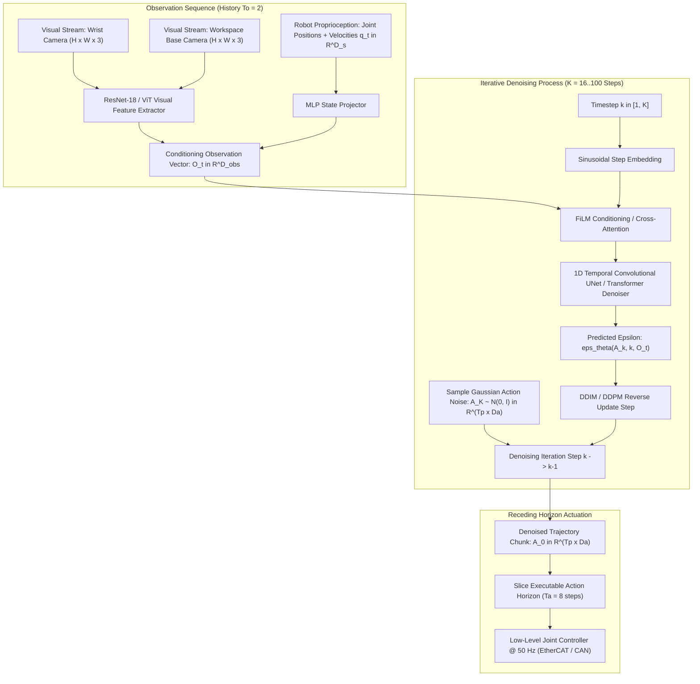

# 🔬 Diffusion Policy: Visuomotor Robot Control via Denoising Diffusion Models

## 1. Executive Brief & Significance

In imitation learning and robotic manipulation, traditional behavioral cloning models parameterize visuomotor policies using explicit supervised regression: predicting the next action $a_t$ via Mean Squared Error (MSE) loss $\mathcal{L} = \|a_t - \pi(o_t)\|^2$ or Gaussian Mixture Models (GMMs). 

This traditional setup exhibits critical structural failures:
1. **Multimodal Mode Averaging**: When demonstration datasets contain multiple valid paths to complete a task (e.g., navigating left vs. right around an obstacle), explicit MSE loss minimizes error by predicting the mean of the paths, driving the robot into collisions.
2. **High-Frequency Tremor & Covariate Shift**: Single-step action predictions accumulate compounding drift, leading to catastrophic failure when the robot encounters unvisited states.
3. **Inability to Express Arbitrary Energy Landscapes**: GMMs require pre-specifying the number of mixture components and struggle with high-dimensional action manifolds.

**Diffusion Policy** (Chi et al., Stanford / Columbia / TRI, RSS 2023) fundamentally revolutionized robot learning by formulating policy evaluation as a **score-based conditional denoising diffusion process**. Key innovations include:
- **Expressive Multi-Modal Action Distributions**: Accurately models complex, discontinuous, and multi-modal trajectory distributions without mode collapse.
- **Action Chunking with Receding Horizon**: Predicts continuous action trajectory sequences ($T_p = 16$ timesteps) over a temporal horizon while executing only a subset ($T_a = 8$ steps), guaranteeing smooth, non-oscillating robot actuation.
- **Dual Structural Backbones**: Supports both **1D Temporal Convolutional UNets** (with Feature-wise Linear Modulation / FiLM) and **Transformer-based Denoising Networks**.



---

## 2. Mathematical Foundations: Denoising Diffusion Probabilistic Models for Actions

### A. Forward Noise Injection Process
Given a demonstration action trajectory chunk $\mathbf{A}_0 \in \mathbb{R}^{T_p \times D_a}$ spanning prediction horizon $T_p$, the forward diffusion process progressively corrupts the trajectory with Gaussian noise across $K$ diffusion iterations according to variance schedule $\beta_1, \beta_2, \dots, \beta_K$:

$$q(\mathbf{A}_k \mid \mathbf{A}_0) = \mathcal{N}\left( \mathbf{A}_k; \sqrt{\bar{\alpha}_k} \mathbf{A}_0, (1 - \bar{\alpha}_k) \mathbf{I} \right)$$

where $\alpha_k = 1 - \beta_k$ and $\bar{\alpha}_k = \prod_{s=1}^k \alpha_s$. Using the reparameterization trick:
$$\mathbf{A}_k = \sqrt{\bar{\alpha}_k} \mathbf{A}_0 + \sqrt{1 - \bar{\alpha}_k} \boldsymbol{\epsilon}, \quad \boldsymbol{\epsilon} \sim \mathcal{N}(0, \mathbf{I})$$

---

### B. Reverse Denoising Policy Formulation & Loss Function
The policy network $\boldsymbol{\epsilon}_\theta(\mathbf{A}_k, k, \mathbf{O})$ is conditioned on observation history $\mathbf{O} = [o_{t-T_o+1}, \dots, o_t]$ and learns to predict the injected noise vector $\boldsymbol{\epsilon}$.

The network parameters $\theta$ are optimized using the standard DDPM objective:
$$\mathcal{L}_{\text{Diffusion}}(\theta) = \mathbb{E}_{k \sim \mathcal{U}[1, K], \, \mathbf{A}_0 \sim \mathcal{D}, \, \boldsymbol{\epsilon} \sim \mathcal{N}(0, \mathbf{I}), \, \mathbf{O} \sim \mathcal{D}} \left\| \boldsymbol{\epsilon} - \boldsymbol{\epsilon}_\theta\left( \sqrt{\bar{\alpha}_k}\mathbf{A}_0 + \sqrt{1-\bar{\alpha}_k}\boldsymbol{\epsilon}, \, k, \, \mathbf{O} \right) \right\|_2^2$$

---

### C. Fast Sampling via DDIM Inference
During real-time deployment, rather than evaluating all 100 DDPM steps, Diffusion Policy utilizes **Denoising Diffusion Implicit Models (DDIM)** to skip diffusion timesteps deterministically, executing in only $K_{\text{eval}} = 10 - 16$ steps:

$$\mathbf{A}_{k-1} = \sqrt{\bar{\alpha}_{k-1}} \left( \frac{\mathbf{A}_k - \sqrt{1 - \bar{\alpha}_k}\boldsymbol{\epsilon}_\theta(\mathbf{A}_k, k, \mathbf{O})}{\sqrt{\bar{\alpha}_k}} \right) + \sqrt{1 - \bar{\alpha}_{k-1} - \sigma_k^2} \boldsymbol{\epsilon}_\theta(\mathbf{A}_k, k, \mathbf{O}) + \sigma_k \mathbf{z}$$

where setting $\sigma_k = 0$ yields fully deterministic inference trajectories.

---

## 3. Granular Component-by-Component Architectural Breakdown

| Architectural Stage | Component Identity | Structural Specification & Type | Attention / Conv Mechanics | Receptive Field & Dimensionality |
| :--- | :--- | :--- | :--- | :--- |
| **Architectural Paradigm** | **Denoising Diffusion Policy** | Score-based generative model on continuous trajectory spaces | 1D Temporal Dilated Convolutions / Cross-Attention | Multi-view images $\to T_p = 16$ action horizon |
| **Vision Backbone** | **Dual ResNet-18 / ViT-B** | Pretrained / From-scratch ConvNet with Spatial Softmax | $3\times 3$ standard residual convolutions + Spatial Softmax pooling | $2 \times [3, 224, 224] \to [D_{\text{vis}} = 128]$ |
| **Conditioning Neck** | **FiLM Modulation Layers** | Feature-wise Linear Modulation: $\gamma(O) \odot x + \beta(O)$ | Linear scaling and bias projection from observation state | Fused observation state $\mathbf{O} \in \mathbb{R}^{D_{\text{obs}}}$ |
| **Denoising Backbone** | **1D Temporal UNet / Transformer** | 4-Level 1D Conv UNet with residual blocks and skip connections | 1D temporal convolutions along time dimension $T_p$ | Trajectory tensor $\mathbf{A}_k \in \mathbb{R}^{T_p \times D_a}$ |
| **Trajectory Slicer** | **Receding Horizon Executor** | Temporal chunk buffer executing $T_a$ actions before replanning | Sliding execution window | Outputs metric actions $a_t \in \mathbb{R}^{D_a}$ |

---

## 4. Quantitative SOTA Benchmark Profile

### Robotic Manipulation Simulation & Real-World Baselines

| Benchmark Task | Metric / Task Type | Behavior Cloning (LSTM) | Implicit BC (IBC) | Action Chunking Transformer (ACT) | Diffusion Policy (CNN UNet) | Diffusion Policy (Transformer) |
| :--- | :--- | :--- | :--- | :--- | :--- | :--- |
| **Push-T** | Success Rate (%) | 52.0% | 72.0% | 84.0% | **95.2%** | **94.8%** |
| **Franka Kitchen** | Multi-Task Success (%) | 45.0% | 58.0% | 72.0% | **88.0%** | **86.5%** |
| **Block Push (Multimodal)**| Success Rate (%) | 38.0% (Mode Averaging)| 68.0% | 82.0% | **96.0%** | **95.0%** |
| **Tool Hang** | High-Precision Success (%)| 22.0% | 46.0% | 68.0% | **85.0%** | **83.0%** |
| **Inference Latency** | Milliseconds (ms) | **4.5 ms** | 120.0 ms | 15.0 ms | **12.0 ms (DDIM-16)** | 18.5 ms |

---

## 5. Engineering Implementation: Complete PyTorch 1D Temporal UNet Policy

```python
"""
PyTorch Implementation of 1D Temporal Convolutional UNet Diffusion Policy with FiLM.
"""

import math
import torch
import torch.nn as nn
import torch.nn.functional as F


class SinusoidalPosEmb(nn.Module):
    """Sinusoidal diffusion step embeddings."""
    def __init__(self, dim: int):
        super().__init__()
        self.dim = dim

    def forward(self, x: torch.Tensor) -> torch.Tensor:
        device = x.device
        half_dim = self.dim // 2
        emb = math.log(10000) / (half_dim - 1)
        emb = torch.exp(torch.arange(half_dim, device=device) * -emb)
        emb = x[:, None] * emb[None, :]
        return torch.cat((emb.sin(), emb.cos()), dim=-1)


class Conv1dBlock(nn.Module):
    """1D Temporal Convolutional block with GroupNorm and Mish activation."""
    def __init__(self, in_channels: int, out_channels: int, kernel_size: int = 5):
        super().__init__()
        self.block = nn.Sequential(
            nn.Conv1d(in_channels, out_channels, kernel_size, padding=kernel_size // 2),
            nn.GroupNorm(8, out_channels),
            nn.Mish()
        )

    def forward(self, x: torch.Tensor) -> torch.Tensor:
        return self.block(x)


class ConditionalResidualBlock1D(nn.Module):
    """Residual block conditioned via Feature-wise Linear Modulation (FiLM)."""
    def __init__(self, in_channels: int, out_channels: int, cond_dim: int):
        super().__init__()
        self.conv1 = Conv1dBlock(in_channels, out_channels)
        self.conv2 = Conv1dBlock(out_channels, out_channels)
        
        # FiLM projection: predicts scale gamma and shift beta
        self.film_proj = nn.Linear(cond_dim, out_channels * 2)
        self.residual_conv = nn.Conv1d(in_channels, out_channels, 1) if in_channels != out_channels else nn.Identity()

    def forward(self, x: torch.Tensor, cond: torch.Tensor) -> torch.Tensor:
        out = self.conv1(x)
        
        # Apply FiLM
        film = self.film_proj(cond).unsqueeze(-1)  # [B, 2*out_channels, 1]
        gamma, beta = torch.chunk(film, 2, dim=1)
        out = gamma * out + beta
        
        out = self.conv2(out)
        return out + self.residual_conv(x)


class ConditionalUNet1D(nn.Module):
    """1D Temporal UNet Denoising Model for continuous action trajectories."""
    def __init__(
        self,
        action_dim: int = 7,
        obs_dim: int = 128,
        diffusion_step_embed_dim: int = 128,
        down_dims: list[int] = [128, 256, 512]
    ):
        super().__init__()
        self.time_emb = nn.Sequential(
            SinusoidalPosEmb(diffusion_step_embed_dim),
            nn.Linear(diffusion_step_embed_dim, diffusion_step_embed_dim * 2),
            nn.Mish(),
            nn.Linear(diffusion_step_embed_dim * 2, diffusion_step_embed_dim)
        )
        
        cond_dim = obs_dim + diffusion_step_embed_dim
        
        self.init_conv = nn.Conv1d(action_dim, down_dims[0], kernel_size=1)
        
        self.down_blocks = nn.ModuleList()
        in_dim = down_dims[0]
        for out_dim in down_dims:
            self.down_blocks.append(
                ConditionalResidualBlock1D(in_dim, out_dim, cond_dim)
            )
            in_dim = out_dim
            
        self.mid_block1 = ConditionalResidualBlock1D(down_dims[-1], down_dims[-1], cond_dim)
        self.mid_block2 = ConditionalResidualBlock1D(down_dims[-1], down_dims[-1], cond_dim)
        
        self.up_blocks = nn.ModuleList()
        reversed_dims = list(reversed(down_dims))
        for i in range(len(reversed_dims) - 1):
            self.up_blocks.append(
                ConditionalResidualBlock1D(reversed_dims[i] * 2, reversed_dims[i+1], cond_dim)
            )
            
        self.final_conv = nn.Sequential(
            Conv1dBlock(down_dims[0] * 2, down_dims[0]),
            nn.Conv1d(down_dims[0], action_dim, 1)
        )

    def forward(self, sample: torch.Tensor, timestep: torch.Tensor, global_cond: torch.Tensor) -> torch.Tensor:
        """
        sample: [B, T_p, action_dim] noisy actions
        timestep: [B] diffusion steps
        global_cond: [B, obs_dim] observation embedding
        Returns: [B, T_p, action_dim] predicted noise
        """
        # Transpose to channels-first: [B, action_dim, T_p]
        x = sample.transpose(1, 2)
        
        t_emb = self.time_emb(timestep)
        cond = torch.cat([global_cond, t_emb], dim=-1)
        
        x = self.init_conv(x)
        h = []
        for block in self.down_blocks:
            x = block(x, cond)
            h.append(x)
            x = F.max_pool1d(x, kernel_size=2)
            
        x = self.mid_block1(x, cond)
        x = self.mid_block2(x, cond)
        
        for block in self.up_blocks:
            skip = h.pop()
            x = F.interpolate(x, size=skip.shape[-1], mode='nearest')
            x = torch.cat([x, skip], dim=1)
            x = block(x, cond)
            
        skip = h.pop()
        x = F.interpolate(x, size=skip.shape[-1], mode='nearest')
        x = torch.cat([x, skip], dim=1)
        x = self.final_conv(x)
        
        # Transpose back: [B, T_p, action_dim]
        return x.transpose(1, 2)
```

---

## 6. References & Official Resources
- **Original Paper**: [Diffusion Policy: Visuomotor Policy Learning via Action Diffusion (RSS 2023)](https://arxiv.org/abs/2303.04137)
- **Official GitHub Repository**: [https://github.com/real-stanford/diffusion_policy](https://github.com/real-stanford/diffusion_policy)
- **Project Page**: [https://diffusion-policy.cs.columbia.edu/](https://diffusion-policy.cs.columbia.edu/)
