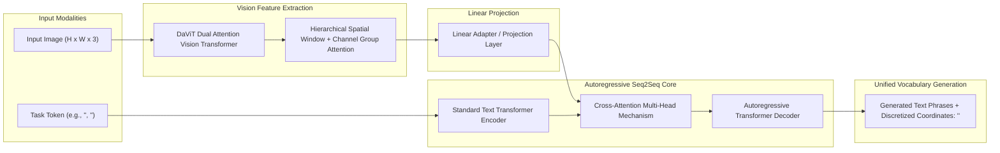
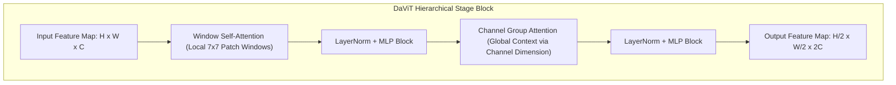
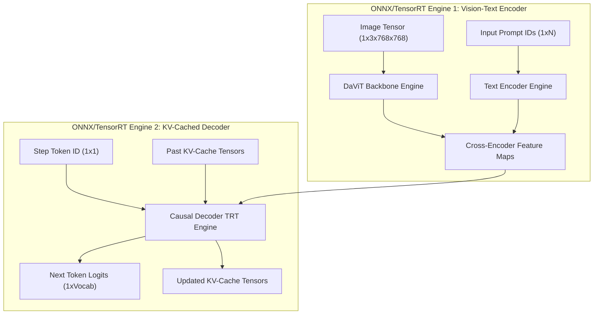

# 🌐 Florence-2: Unified Sequence-to-Sequence Vision Foundation Model

## 1. Executive Summary & Paradigm Shift

**Florence-2** (Xiao et al., Microsoft, 2024) is a compact, open-weight vision foundation model that unifies diverse visual perception tasks—ranging from coarse scene understanding to pixel-level grounding—into a single **prompt-driven sequence-to-sequence (Seq2Seq)** formulation. Prior computer vision architectures relied on distinct, specialized task heads: convolutional classification heads, anchor/anchor-free bounding box regression heads (e.g., [[topics/object-detection/00-object-detection-moc|Object Detection]]), mask decoders (e.g., [[topics/object-segmentation/00-object-segmentation-moc|Object Segmentation]]), and text recognition decoders. 

Florence-2 eliminates all task-specific heads by framing every visual perception problem as an autoregressive token generation task over a unified vocabulary containing both natural language tokens and discretized spatial location bins.



Trained on the **FLD-5B** dataset—comprising 5.4 billion comprehensive visual annotations across 126 million images generated through an iterative automated data curation pipeline—Florence-2 delivers zero-shot and fine-tuned capabilities across captioning, object detection, dense region labeling, visual grounding, referring expression segmentation, and optical character recognition (OCR).

---

## 2. Granular Component-by-Component Architectural Breakdown

| Architectural Component | Technical Specification | Florence-2-Base (0.23B) | Florence-2-Large (0.77B) | Parameter Distribution (%) | Compute / Latency Distribution (%) |
| :--- | :--- | :--- | :--- | :--- | :--- |
| **Architectural Paradigm** | Unified Multi-Task Vision-Language Seq2Seq | Hierarchical ViT Encoder + Autoregressive Transformer Decoder | Hierarchical ViT Encoder + Autoregressive Transformer Decoder | $100\%$ Total ($232\text{M}$ / $771\text{M}$) | $100\%$ Total |
| **Vision Backbone** | Hierarchical **DaViT** (Dual Attention Vision Transformer) | 4 stages ($C=[96, 192, 384, 768]$, depths $[1, 1, 3, 1]$), stride 4, 8, 16, 32 | 4 stages ($C=[128, 256, 512, 1024]$, depths $[1, 1, 9, 1]$), stride 4, 8, 16, 32 | $\sim 39.7\%$ ($92\text{M}$) in Base;<br>$\sim 39.4\%$ ($304\text{M}$) in Large | $\approx 55\% - 65\%$ during image prefill;<br>$0\%$ during autoregressive token decode |
| **Patch Embedding Stem** | Overlapping Convolutional Patch Stem ($7 \times 7$ Conv, Stride 4) | $7 \times 7$ Conv2D ($C_{\text{in}}=3 \to 96$) | $7 \times 7$ Conv2D ($C_{\text{in}}=3 \to 128$) | $< 0.1\%$ | $< 2.0\%$ of vision pass |
| **Neck / Aggregator** | Linear Dimension Adapter + Cross-Attention Bridge | Linear projection ($768 \to 768$) + LayerNorm | Linear projection ($1024 \to 1024$) + LayerNorm | $< 0.4\%$ | $< 0.5\%$ of prefill compute |
| **Encoder** | Dual Attention (Alternating $7 \times 7$ Window Spatial Self-Attn + Channel Group Attn) + Standard Text Transformer Encoder | DaViT Dual Attn + 6-layer Text Encoder ($D=768$, $H=12$) | DaViT Dual Attn + 12-layer Text Encoder ($D=1024$, $H=16$) | $\sim 15.5\%$ ($36\text{M}$) in Base;<br>$\sim 15.6\%$ ($120\text{M}$) in Large | $\approx 5\% - 8\%$ during prompt prefill |
| **Decoder / Head** | Autoregressive Causal Transformer Decoder with Visual Cross-Attention + Linear LM Head | 6-layer Causal Decoder ($D=768$, $H=12$) + Softmax over $51,200 + 1,000$ loc tokens | 12-layer Causal Decoder ($D=1024$, $H=16$) + Softmax over $51,200 + 1,000$ loc tokens | $\sim 44.4\%$ ($103\text{M}$) in Base;<br>$\sim 44.9\%$ ($346\text{M}$) in Large | $\approx 30\%$ during prompt prefill;<br>$\approx 99.5\%$ during autoregressive token decode |
| **Positional Encoding** | 2D Relative Pos Bias (DaViT) + 1D Learned Sinusoidal (Text & Decoder) | Relative Bias (Vision) + 1D PosEnc ($L_{\text{max}}=1024$) | Relative Bias (Vision) + 1D PosEnc ($L_{\text{max}}=1024$) | $< 0.05\%$ | Negligible |

---

## 3. Architectural Decomposition

Florence-2 employs an encoder-decoder structure consisting of a hierarchical vision encoder, a text encoder, and an autoregressive multi-layer transformer decoder.
### A. Dual Attention Vision Transformer (DaViT) Encoder
The visual backbone uses **DaViT (Dual Attention Vision Transformer)** to extract high-resolution spatial feature representations while avoiding the quadratic computational complexity $\mathcal{O}((H \cdot W)^2)$ of standard global Vision Transformers.

1. **Dual Attention Mechanism**: Within each transformer block, self-attention alternates across two orthogonal pathways:
   - **Spatial Window Attention**: Computes self-attention locally within non-overlapping $7 \times 7$ spatial windows. This captures fine-grained, localized visual geometry with linear complexity relative to total pixel count:
     $$\mathcal{O}_{\text{spatial}} = 2 \cdot (H \cdot W) \cdot C \cdot K_w^2$$
   - **Channel Group Attention**: Computes self-attention across grouped channel dimensions across all spatial tokens. This establishes global, cross-region context without computing spatial token-to-token inner products:
     $$\mathcal{O}_{\text{channel}} = 2 \cdot (H \cdot W) \cdot \frac{C^2}{G}$$
     where $G$ is the number of channel groups.

2. **Hierarchical 4-Stage Downsampling**: The encoder processes the input image through four successive stages with patch embedding downsamplings (stride 4, 8, 16, 32), producing feature maps with channels $[C_1, C_2, C_3, C_4]$.

3. **Vision-to-Language Adapter**: The multi-scale visual tokens from the final DaViT stage are projected linearly into the embedding dimension $D_{\text{text}}$ of the language transformer.



### B. Standard Autoregressive Seq2Seq Language Decoder
The projected vision embeddings serve as cross-attention keys ($K$) and values ($V$) for a standard causal autoregressive Transformer decoder. 

- The task prompt string (e.g., `<OD>` or `<CAPTION>`) is tokenized and passed through the text encoder.
- The decoder sequentially predicts next tokens conditioned on previous tokens via causal self-attention, and conditioned on image features via encoder-decoder cross-attention:
  $$\mathbf{h}_t = \text{TransformerDecoder}(\mathbf{y}_{<t}, \mathbf{z}_{\text{vision}}, \mathbf{z}_{\text{prompt}})$$
  $$P(y_t \mid \mathbf{y}_{<t}, \mathbf{I}, \mathbf{T}) = \text{Softmax}(\mathbf{W}_v \mathbf{h}_t)$$

### C. Discrete Spatial Coordinate Quantization
To represent spatial bounding boxes and polygon vertices within a text vocabulary without floating-point regression heads, Florence-2 discretizes continuous image coordinates $(x, y) \in [0.0, 1.0]$ into $1000$ discrete uniform integer bins:
$$\text{Bin}(x) = \left\lfloor x \times 1000 \right\rfloor \in \{0, 1, \dots, 999\}$$

Each integer is mapped to a dedicated spatial location token:
$$\langle \text{loc\_}0 \rangle, \langle \text{loc\_}1 \rangle, \dots, \langle \text{loc\_}999 \rangle$$

- **Bounding Box Format**: 4 sequential location tokens representing top-left and bottom-right corners:
  $$\langle \text{loc\_}y_1 \rangle \langle \text{loc\_}x_1 \rangle \langle \text{loc\_}y_2 \rangle \langle \text{loc\_}x_2 \rangle \text{label\_name}$$
- **Polygonal Segmentation Format**: A series of $N$ coordinate pairs defining polygon boundaries:
  $$\langle \text{loc\_}y_1 \rangle \langle \text{loc\_}x_1 \rangle \langle \text{loc\_}y_2 \rangle \langle \text{loc\_}x_2 \rangle \dots \langle \text{loc\_}y_N \rangle \langle \text{loc\_}x_N \rangle$$

---

## 4. Prompt Token Taxonomy & Output Grammars

Florence-2 uses dedicated task prompt tokens that instruct the Seq2Seq decoder on which output schema to synthesize:

| Task Prompt Token | Target Perception Task | Output Generation Grammar |
| :--- | :--- | :--- |
| `<OD>` | 2D Object Detection | `label1<loc_y1><loc_x1><loc_y2><loc_x2>label2<loc_y1><loc_x1><loc_y2><loc_x2>...` |
| `<CAPTION>` | Short Scene Caption | `A concise single-sentence description of the image.` |
| `<DETAILED_CAPTION>` | Descriptive Caption | `A detailed paragraph describing objects, attributes, and background.` |
| `<MORE_DETAILED_CAPTION>` | Dense Caption | `An exhaustive description covering spatial relations, actions, and lighting.` |
| `<DENSE_REGION_CAPTION>` | Dense Region Labeling | `<loc_y1><loc_x1><loc_y2><loc_x2>phrase1<loc_y1><loc_x1><loc_y2><loc_x2>phrase2...` |
| `<CAPTION_TO_PHRASE_GROUNDING>` | Grounding from Text | `phrase1<loc_y1><loc_x1><loc_y2><loc_x2>phrase2<loc_y1><loc_x1><loc_y2><loc_x2>...` |
| `<REFERRING_EXPRESSION_SEGMENTATION>` | Referring Mask Extraction | `<loc_y1><loc_x1><loc_y2><loc_x2>...<loc_yN><loc_xN>` (Polygon vertices) |
| `<OCR>` | Scene Text Reading | `Text line 1\nText line 2\n...` |
| `<OCR_WITH_REGION>` | Grounded OCR | `<loc_y1><loc_x1><loc_y2><loc_x2>transcription1...` |

---

## 5. Hardware Latency, FLOPs & Quantization Profiles

Florence-2 was engineered with compact parameter counts suitable for low-power edge accelerators and real-time GPU pipelines.

### Model Variants Breakdown
- **Florence-2-Base**: $232\text{M}$ total parameters ($\sim 92\text{M}$ DaViT-Base encoder, $\sim 140\text{M}$ language encoder-decoder).
- **Florence-2-Large**: $771\text{M}$ total parameters ($\sim 304\text{M}$ DaViT-Large encoder, $\sim 467\text{M}$ language encoder-decoder).

### Detailed Performance Matrix across Target Accelerators

| Model Variant | Precision | Input Res | GFLOPs (Vision) | Jetson Orin AGX 64GB (ms) | RTX 4090 (ms) | A100-SXM4 (ms) | Output Task Tested |
| :--- | :--- | :--- | :--- | :--- | :--- | :--- | :--- |
| **Florence-2-Base** | FP16 | $768 \times 768$ | 148 | 32.4 ms | 6.8 ms | 4.1 ms | `<OD>` (15 boxes generated) |
| **Florence-2-Base** | INT8 (W8A8) | $768 \times 768$ | 148 | 19.8 ms | 4.2 ms | 2.5 ms | `<OD>` (15 boxes generated) |
| **Florence-2-Base** | FP16 | $768 \times 768$ | 148 | 44.2 ms | 9.4 ms | 5.8 ms | `<CAPTION>` (30 tokens) |
| **Florence-2-Large** | FP16 | $768 \times 768$ | 412 | 82.6 ms | 17.5 ms | 10.2 ms | `<OD>` (15 boxes generated) |
| **Florence-2-Large** | INT8 (W8A8) | $768 \times 768$ | 412 | 49.1 ms | 10.8 ms | 6.4 ms | `<OD>` (15 boxes generated) |
| **Florence-2-Large** | FP16 | $768 \times 768$ | 412 | 118.0 ms | 24.8 ms | 14.6 ms | `<DENSE_REGION_CAPTION>` |

### KV-Cache Dynamics & Memory Footprint on Edge GPUs
During autoregressive generation on edge devices like [[topics/gpu-deployment/00-gpu-deployment-moc|Jetson Orin]], decoding latency is governed by memory-bandwidth-bound KV-cache reads:
- For Florence-2-Base ($L=12$ decoder layers, $H=12$ heads, $D_{\text{head}}=64$):
  $$\text{KV Cache Size per Token} = 2 \times L \times H \times D_{\text{head}} \times 2\text{ bytes} = 36.86\text{ KB/token}$$
- Generating a 128-token dense detection and captioning sequence requires only $\approx 4.7\text{ MB}$ of KV-cache VRAM per batch stream, making concurrent multi-camera inference feasible on 8GB/16GB embedded systems.

---

## 6. Export Gotchas & TensorRT / ONNX Deployment Recipe

Deploying Florence-2 via TensorRT or ONNX Runtime requires partitioning the model into two separate execution graphs:
1. **Vision + Text Encoder Subgraph**: Fully static/bounded dynamic shape graph executing DaViT convolutions and windowed self-attentions in single-pass FP16.
2. **Autoregressive Language Decoder Subgraph**: Stateful graph utilizing explicit KV-cache inputs and outputs (`past_key_values` and `present_key_values`).



### Critical Export Gotchas
- **Window Attention Reshape**: DaViT uses dynamic window reshaping. When exporting to ONNX with `torch.onnx.export`, explicitly specify fixed image spatial dimensions (e.g., $768 \times 768$) to allow TensorRT to fuse window permutations into fixed-stride memory loads.
- **Location Token Post-Processing**: The location tokens $\langle \text{loc\_}i \rangle$ must be parsed from string outputs and scaled back to the source image coordinate frame:
  $$x_{\text{real}} = \frac{x_{\text{token}}}{1000} \times W_{\text{orig}}, \quad y_{\text{real}} = \frac{y_{\text{token}}}{1000} \times H_{\text{orig}}$$

### Complete Production Inference Pipeline Snippet
```python
import torch
from PIL import Image
from transformers import AutoModelForCausalLM, AutoProcessor

# 1. Load HuggingFace model and processor with flash-attention support
model_id = "microsoft/Florence-2-base"
device = "cuda" if torch.cuda.is_available() else "cpu"
dtype = torch.float16 if torch.cuda.is_available() else torch.float32

model = AutoModelForCausalLM.from_pretrained(
    model_id, 
    torch_dtype=dtype, 
    trust_remote_code=True
).to(device).eval()

processor = AutoProcessor.from_pretrained(model_id, trust_remote_code=True)

# 2. Prepare image and multi-task prompt
image = Image.open("sample_scene.jpg").convert("RGB")
prompt = "<OD>"  # Change to '<DENSE_REGION_CAPTION>' or '<REFERRING_EXPRESSION_SEGMENTATION>'

inputs = processor(text=prompt, images=image, return_tensors="pt").to(device, dtype)

# 3. Autoregressive generation with bounded sequence length
with torch.inference_mode():
    generated_ids = model.generate(
        input_ids=inputs["input_ids"],
        pixel_values=inputs["pixel_values"],
        max_new_tokens=1024,
        num_beams=3,
        do_sample=False,
        use_cache=True,
    )

# 4. Decode text tokens and parse spatial coordinates
generated_text = processor.batch_decode(generated_ids, skip_special_tokens=False)[0]
parsed_answer = processor.post_process_generation(
    generated_text, 
    task=prompt, 
    image_size=(image.width, image.height)
)

print("Parsed Detection Results:", parsed_answer)
```

---

## 7. Architectural Trade-offs & Comparisons

| Dimension | Florence-2 (Base/Large) | YOLOv12 / YOLOv11 | Conventional MLLMs (e.g. LLaVA-1.5) |
| :--- | :--- | :--- | :--- |
| **Output Flexibility** | Universal (Boxes, Masks, OCR, Text) | Specialized (Boxes / Masks only) | Freeform Text, weak fine spatial grounding |
| **Model Size** | $0.23\text{B} - 0.77\text{B}$ | $2.5\text{M} - 60\text{M}$ | $7\text{B} - 13\text{B}$ |
| **Inference Latency** | $15 - 50\text{ ms}$ | $1.5 - 6\text{ ms}$ | $150 - 800\text{ ms}$ |
| **Head Architecture** | Zero heads (Unified Seq2Seq Vocabulary) | Task-specific anchor-free decoupled heads | Linear MLP projector to LLM |
| **Edge Feasibility** | High (Runs smoothly on Jetson Orin Nano/AGX) | Ultra-High (Runs on microcontrollers/mobile) | Low (Requires server GPUs or heavy quantization) |

---

## 8. Official Repositories & Resources
- **Model Checkpoints**: [HuggingFace - Microsoft Florence-2-base](https://huggingface.co/microsoft/Florence-2-base) & [Florence-2-large](https://huggingface.co/microsoft/Florence-2-large)
- **Research Paper**: *Florence-2: Advancing a Unified Representation for Arbitrary Visual Tasks* (Xiao et al., Microsoft Azure AI, 2024)
- **Related Topics**: [[topics/object-detection/00-object-detection-moc|Object Detection MOC]], [[topics/object-segmentation/00-object-segmentation-moc|Object Segmentation MOC]], [[topics/gpu-deployment/00-gpu-deployment-moc|GPU Deployment MOC]], [[topics/real-time-systems/00-real-time-systems-moc|Real-Time Systems MOC]].
