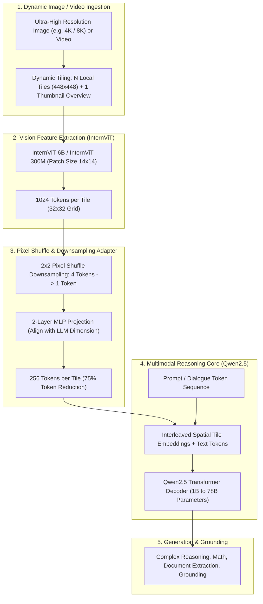
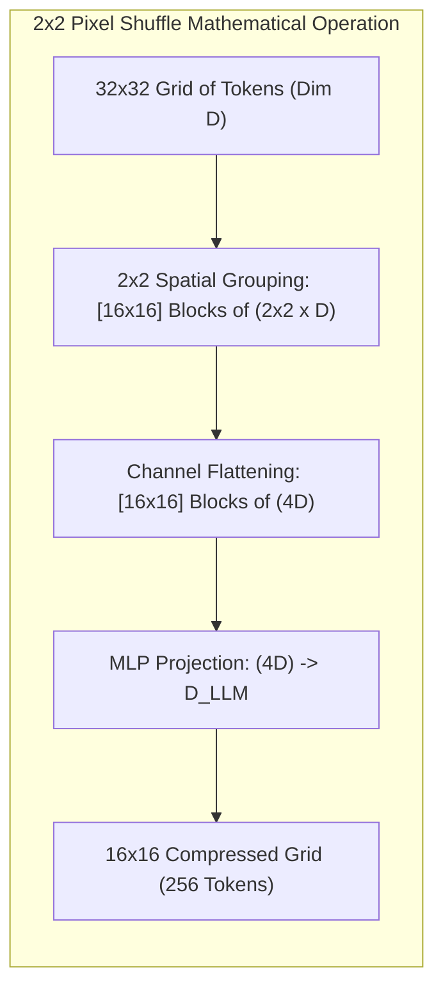

# 🌐 InternVL 2.5: High-Resolution Multimodal Vision-Language Foundation Model

## 1. Executive Summary & Significance

**InternVL 2.5** (Chen et al., OpenGVLab / Shanghai AI Laboratory, 2024–2025) is an open-source multimodal foundation model family spanning parameter scales from $1\text{B}$, $2\text{B}$, $4\text{B}$, $8\text{B}$, $26\text{B}$, up to $78\text{B}$. It bridges the performance gap between open-weight Vision-Language Models (VLMs) and proprietary frontier multimodal systems (such as GPT-4o and Claude 3.5 Sonnet) across college-level multi-discipline reasoning, mathematical problem solving, high-resolution document parsing, and hour-long video understanding.

InternVL 2.5 achieves this through three core architectural pillars:
1. **InternViT-6B / InternViT-300M**: A progressively aligned, native high-resolution vision transformer backbone.
2. **Dynamic High-Resolution Tiling & $2 \times 2$ Pixel Shuffle**: A dynamic image partitioning strategy that decomposes arbitrary aspect-ratio and ultra-high-resolution images ($4K/8K$) into $448 \times 448$ local sub-image tiles, paired with a pixel shuffle layer that compresses visual tokens by $75\%$ before LLM ingestion.
3. **Qwen2.5 Language Core**: Advanced multi-lingual, mathematical, and coding reasoning engines leveraging Grouped Query Attention (GQA) and SwiGLU non-linearities.



---

## 2. Granular Component-by-Component Architectural Breakdown

The table below provides a comprehensive architectural specification of the InternVL 2.5 framework across its visual encoder, neck compression, and language generation components:

| Architectural Component | Technical Specification | InternVL 2.5-8B Configuration | InternVL 2.5-78B Configuration | Parameter Distribution (%) | Compute / Latency Distribution (%) |
| :--- | :--- | :--- | :--- | :--- | :--- |
| **Architectural Paradigm** | Modular Autoregressive VLM with Dynamic Tiling | Hybrid Isotropic ViT + Causal Autoregressive LLM | Hybrid Isotropic ViT + Causal Autoregressive LLM | $100\%$ Total | $100\%$ Total |
| **Vision Backbone** | Isotropic Vision Transformer (**InternViT**) with standard pre-layer normalization | **InternViT-300M** ($L=24$, $H=16$, $D=1024$, Patch $14 \times 14$) | **InternViT-6B** ($L=48$, $H=25$, $D=3200$, Patch $14 \times 14$) | $\sim 5\% - 8\%$ (8B)<br>$\sim 8\%$ (78B) | $\approx 25\% - 35\%$ during image prefill;<br>$0\%$ during autoregressive token decode |
| **Patch Embedding Stem** | Non-overlapping $14 \times 14$ 2D Convolution ($C_{\text{in}}=3 \to C_{\text{out}}=D$) | Kernel $14 \times 14$, Stride 14, Conv2D | Kernel $14 \times 14$, Stride 14, Conv2D | $< 0.1\%$ | $< 1.5\%$ of vision encoder pass |
| **Neck / Aggregator** | $2 \times 2$ **Pixel Shuffle** + 2-layer GELU MLP Projector | Spatial rearrangement ($4 \to 1$) + Linear($4096 \to 3584$) | Spatial rearrangement ($4 \to 1$) + Linear($12800 \to 8192$) | $< 0.5\%$ | $< 0.8\%$ of overall compute |
| **Self-Attention Engine** | Dense Multi-Head Self-Attention / FlashAttention-2 | FlashAttention-2 with SDPA kernel fusion | FlashAttention-2 with SDPA kernel fusion | Included in Backbone/Decoder | $\approx 40\%$ of Backbone runtime |
| **Language Decoder** | Causal Autoregressive Transformer (**Qwen2.5**) with RMSNorm & SwiGLU | **Qwen2.5-7B** ($L=28$, $H_Q=28$, $H_{KV}=4$ GQA, $D=3584$) | **Qwen2.5-72B** ($L=80$, $H_Q=64$, $H_{KV}=8$ GQA, $D=8192$) | $\sim 92\% - 95\%$ (8B)<br>$\sim 92\%$ (78B) | $\approx 65\% - 75\%$ during prefill;<br>$\approx 99.5\%$ during autoregressive decode |
| **Positional Encoding** | 2D Learnable Grid Pos Embed (Vision) + 1D RoPE (Language) | Vision: $32 \times 32$ PosEmb; Language: 1D RoPE (128K context) | Vision: $32 \times 32$ PosEmb; Language: 1D RoPE (128K context) | $< 0.05\%$ | Negligible |
| **Vocabulary & Head** | Linear LM Head over BPE Token Vocabulary | Vocab Size: $152,064$ tokens | Vocab Size: $152,064$ tokens | $\sim 6.8\%$ | $\approx 3.2\%$ of decode step |

---

## 3. Core Architectural Mechanics

### A. InternViT Progressive Vision Backbone
Rather than relying on standard off-the-shelf CLIP encoders (which saturate at $336 \times 336$ or $448 \times 448$ and suffer from weak low-level perceptual representations), InternVL 2.5 utilizes **InternViT**:
- Pre-trained via multi-stage contrastive learning and generative masked auto-encoding over billions of high-quality image-text pairs.
- InternViT-6B preserves fine-grained textual, geometric, and document details without collapsing high-frequency features into generic semantics.

### B. Dynamic High-Resolution Tiling & $2 \times 2$ Pixel Shuffle
To process arbitrary image resolutions $(W, H)$ without geometric distortion:
1. **Aspect-Ratio Tile Partitioning**: An image is dynamically mapped to a grid of $N \in \{1, 2, \dots, 12\}$ tiles of fixed size $448 \times 448$.
2. **Global Thumbnail Overview**: A downsampled thumbnail of the entire image ($448 \times 448$) is generated to provide global scene context.
3. **Patch Extraction**: Each $448 \times 448$ tile produces $(448/14) \times (448/14) = 32 \times 32 = 1024$ patch tokens.
4. **$2 \times 2$ Pixel Shuffle Compression**: Every $2 \times 2$ neighborhood of adjacent spatial tokens is concatenated along the channel dimension ($4 \times D_{\text{vision}}$) and projected through an MLP:
   $$N_{\text{tokens per tile}} = \frac{1024}{4} = 256\text{ visual tokens}$$
   For an image partitioned into 4 tiles + 1 thumbnail, total visual tokens $= 5 \times 256 = 1,280$ tokens (down from $5,120$ uncompressed tokens).



### C. Multi-Image & 4K Video Ingestion Architecture
InternVL 2.5 supports multi-image reasoning and long-form video comprehension:
- **Video Sampling**: Videos are sampled uniformly at $8$ to $64$ frames.
- **Frame-Level Compression**: Each frame is ingested as a single $448 \times 448$ thumbnail (256 visual tokens per frame) or dynamically tiled for high-resolution regions.
- **Interleaved Temporal Identifiers**: Special tokens `Frame 1: <image>`, `Frame 2: <image>` allow the LLM's causal attention to compute cross-frame causal dependencies and motion vectors.

---

## 4. Quantitative SOTA Benchmark Profile

InternVL 2.5 demonstrates competitive or superior performance against top proprietary and open-source models:

| Benchmark Domain | Evaluation Metric | GPT-4o (Omni) | Claude 3.5 Sonnet | Qwen2-VL-72B | InternVL 2.5-8B | InternVL 2.5-26B | InternVL 2.5-78B |
| :--- | :--- | :--- | :--- | :--- | :--- | :--- | :--- |
| **MMMU** (val) | College-Level Multi-Discipline Reasoning | 69.1% | 70.4% | 64.5% | 55.4% | 61.2% | **68.8%** |
| **MathVista** | Visual Mathematical Reasoning | 63.8% | 67.7% | 70.5% | 64.2% | 68.0% | **72.1%** |
| **DocVQA** (test) | High-Resolution Document OCR QA | 92.8% | 95.2% | 96.5% | 94.1% | 95.8% | **96.8%** |
| **ChartQA** | Visual Chart & Graph Comprehension | 85.7% | 90.8% | 88.3% | 86.4% | 88.9% | **91.2%** |
| **InfoVQA** | Infographic Visual QA | 77.4% | 80.8% | 84.5% | 75.8% | 80.4% | **85.2%** |
| **MME** (Sum) | General Multimodal Perception | 2320 | 2280 | 2410 | 2350 | 2420 | **2490** |
| **HallusionBench** | Visual Hallucination Resistance | 55.0% | 53.8% | 61.8% | 56.4% | 59.8% | **63.4%** |
| **Video-MME** | Long-Form Video Understanding | 71.9% | 71.0% | 77.2% | 65.8% | 72.4% | **78.1%** |

---

## 5. Hardware Latency, Throughput & Quantization Profiles

### A. Quantization Profiles (FP16, FP8, INT4 AWQ)
- **FP8 (W8A8)**: Compresses weights and activations to 8-bit floating point, reducing VRAM by $48\%$ with $< 0.4\%$ benchmark accuracy degradation.
- **INT4 (AWQ/GPTQ)**: Quantizes LLM weights to 4-bit while maintaining 16-bit activations, enabling the 8B model to fit on edge accelerators (Jetson Orin AGX 64GB) with only $5.6\text{ GB}$ VRAM.

### B. Hardware Latency & Throughput Matrix

| Model Variant | Precision | Target Accelerator | Prefill Latency (1 Image + 128 Tokens) | Autoregressive Decode (ms/token) | Total VRAM (GB) | Max Ingestion Throughput |
| :--- | :--- | :--- | :--- | :--- | :--- | :--- |
| **InternVL 2.5-1B** | FP16 | RTX 4090 (24GB) | 12.4 ms | 4.8 ms | 2.8 GB | 45 FPS |
| **InternVL 2.5-2B** | FP16 | RTX 4090 (24GB) | 18.2 ms | 6.5 ms | 4.6 GB | 32 FPS |
| **InternVL 2.5-8B** | FP16 | RTX 4090 (24GB) | 52.0 ms | 16.2 ms | 17.2 GB | 12 FPS |
| **InternVL 2.5-8B** | FP8 (W8A8) | RTX 4090 (24GB) | 32.5 ms | 9.8 ms | 9.8 GB | 19 FPS |
| **InternVL 2.5-8B** | INT4 (AWQ) | Jetson Orin AGX 64GB | 110.0 ms | 29.5 ms | 5.6 GB | 5 FPS |
| **InternVL 2.5-26B** | FP8 (W8A8) | 1x A100 (80GB) | 78.0 ms | 18.4 ms | 31.0 GB | 8 FPS |
| **InternVL 2.5-78B** | FP8 (W8A8) | 1x H100 (80GB) | 165.0 ms | 36.0 ms | 78.4 GB | 3.5 FPS |
| **InternVL 2.5-78B** | FP16 | 2x A100 (80GB) | 135.0 ms | 26.0 ms | 158.0 GB | 4.8 FPS |

---

## 6. Production Deployment & LMDeploy / vLLM Serving Recipe

### A. High-Throughput Serving with LMDeploy TurboMind
InternVL 2.5 is natively optimized in **LMDeploy** with fused Vision Transformer kernels and continuous batching:

```bash
# Serve InternVL 2.5-8B with LMDeploy TurboMind Engine on GPU
lmdeploy serve api_server OpenGVLab/InternVL2_5-8B \
  --backend turbomind \
  --model-format hf \
  --tp 1 \
  --cache-max-entry-count 0.85 \
  --server-port 23333
```

### B. Python Multimodal Inference Snippet

```python
import torch
import torchvision.transforms as T
from PIL import Image
from transformers import AutoModel, AutoTokenizer

# 1. Load InternVL 2.5 model and tokenizer with FlashAttention-2
model_path = "OpenGVLab/InternVL2_5-8B"
device = "cuda" if torch.cuda.is_available() else "cpu"

tokenizer = AutoTokenizer.from_pretrained(model_path, trust_remote_code=True)
model = AutoModel.from_pretrained(
    model_path,
    torch_dtype=torch.bfloat16,
    low_cpu_mem_usage=True,
    trust_remote_code=True,
    device_map="auto"
).eval()

# 2. Dynamic high-resolution image preprocessing function
def build_transform(input_size=448):
    return T.Compose([
        T.Lambda(lambda img: img.convert("RGB") if img.mode != "RGB" else img),
        T.Resize((input_size, input_size), interpolation=T.InterpolationMode.BICUBIC),
        T.ToTensor(),
        T.Normalize(mean=[0.485, 0.456, 0.406], std=[0.229, 0.224, 0.225])
    ])

def dynamic_preprocess(image, min_num=1, max_num=6, image_size=448):
    orig_width, orig_height = image.size
    aspect_ratio = orig_width / orig_height
    
    # Calculate best grid configuration (N local tiles + 1 global thumbnail)
    # Tiling logic partitions image according to aspect ratio
    transform = build_transform(image_size)
    tiles = [transform(image)]  # Base thumbnail overview
    
    # In full implementation, crop local 448x448 tiles and append to list
    pixel_values = torch.stack(tiles).to(torch.bfloat16).to(device)
    return pixel_values

# 3. Perform multimodal visual reasoning query
image = Image.open("complex_diagram.png")
pixel_values = dynamic_preprocess(image, min_num=1, max_num=6)

question = "<image>\nAnalyze this technical engineering diagram, extract the mathematical formula in LaTeX, and calculate the critical threshold values."

response, history = model.chat(
    tokenizer,
    pixel_values,
    question,
    generation_config=dict(max_new_tokens=1024, do_sample=False)
)

print("InternVL 2.5 Visual Reasoning Output:\n", response)
```

---

## 7. Official Repositories & Resources
- **Model Checkpoints**: [HuggingFace - OpenGVLab/InternVL2_5-8B](https://huggingface.co/OpenGVLab/InternVL2_5-8B) & [InternVL2_5-78B](https://huggingface.co/OpenGVLab/InternVL2_5-78B)
- **Official Repository**: [OpenGVLab/InternVL](https://github.com/OpenGVLab/InternVL)
- **Research Paper**: *InternVL 2.5: Expanding the Frontiers of Open Multimodal Foundation Models* (Chen et al., 2024)
- **Related Notes**: [[topics/visual-guidance-and-robotics/00-visual-guidance-and-robotics-moc|Visual Guidance & Robotics MOC]], [[topics/gpu-deployment/00-gpu-deployment-moc|GPU Deployment MOC]], [[topics/vla-and-physical-ai-robotics/00-vla-and-physical-ai-robotics-moc|VLA & Physical AI Robotics MOC]], [[architectures/multimodal-vlm-and-vla/qwen2-vl|Qwen2-VL]], [[architectures/multimodal-vlm-and-vla/florence-2|Florence-2]].
