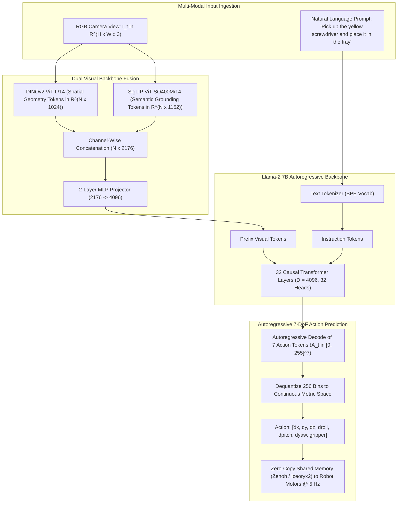

# 🔬 OpenVLA: Open-Source 7B Vision-Language-Action Foundation Model

## 1. Executive Brief & Significance

Robotic visual guidance has historically depended on siloed multi-stage heuristics: detecting 2D object bounding boxes, performing template-based CAD matching, evaluating sampling-based collision checkers, and planning kinematic reachability. In scenes with novel objects, varied lighting, or arbitrary natural language commands, these hand-engineered abstractions break down.

**OpenVLA** (Kim et al., Stanford / UC Berkeley / CMU, 2024) is a landmark open-source **7-Billion parameter Vision-Language-Action (VLA)** foundation model trained on over **970,000 diverse robot manipulation trajectories** from the Open-X Embodiment dataset. Key architectural breakthroughs include:
- **Dual Visual Foundation Fusion**: Unifies **DINOv2** (capturing high-frequency spatial geometry and depth cues) with **SigLIP** (capturing rich open-vocabulary semantic grounding) into a fused visual stem.
- **Autoregressive Action Tokenization**: Discretizes continuous 7-DoF robot arm movements into 256 categorical bins, directly predicting motor actions as specialized vocabulary tokens within a Llama-2 7B causal transformer backbone.
- **Permissive Open Licensing & Quantization**: Released under **Apache-2.0** with full support for LoRA / QLoRA parameter-efficient fine-tuning and FP8 / INT4 edge quantization on embedded GPUs (e.g., NVIDIA Jetson AGX Orin).



---

## 2. Mathematical Foundations & Action Discretization

### A. Dual Visual Feature Fusion
Given an input workspace image $\mathbf{I} \in \mathbb{R}^{H \times W \times 3}$, OpenVLA extracts patch tokens simultaneously through two complementary vision transformers:
- **DINOv2 ViT-L/14**: $\mathbf{F}_{\text{geo}} = \text{DINOv2}(\mathbf{I}) \in \mathbb{R}^{N_p \times 1024}$
- **SigLIP ViT-SO400M/14**: $\mathbf{F}_{\text{sem}} = \text{SigLIP}(\mathbf{I}) \in \mathbb{R}^{N_p \times 1152}$

The visual tokens are concatenated along the feature channel dimension and mapped into the 4096-dimensional hidden space of Llama-2 via a 2-layer MLP projector:
$$\mathbf{F}_{\text{fused}} = [\mathbf{F}_{\text{geo}} \,\|\, \mathbf{F}_{\text{sem}}] \in \mathbb{R}^{N_p \times 2176}$$
$$\mathbf{Z}_{\text{vis}} = \mathbf{W}_2 \cdot \text{GELU}(\mathbf{W}_1 \mathbf{F}_{\text{fused}} + \mathbf{b}_1) + \mathbf{b}_2 \in \mathbb{R}^{N_p \times 4096}$$

---

### B. Action Discretization & Tokenization Formulation
Continuous robot actions are parameterized as a 7-dimensional displacement vector:
$$\mathbf{a}_t = [\Delta x, \Delta y, \Delta z, \Delta \theta_x, \Delta \theta_y, \Delta \theta_z, \text{gripper}] \in \mathbb{R}^7$$

Each dimension $a_{t, j}$ is normalized according to dataset quantile bounds $[a_{\text{min}, j}, a_{\text{max}, j}]$ and uniformly quantized into $B = 256$ categorical bins:
$$k_{t, j} = \text{clamp}\left( \left\lfloor \frac{a_{t, j} - a_{\text{min}, j}}{a_{\text{max}, j} - a_{\text{min}, j}} \times 256 \right\rfloor, \, 0, \, 255 \right)$$

During training, OpenVLA optimizes the standard cross-entropy loss over the 7 action tokens:
$$\mathcal{L}_{\text{VLA}}(\theta) = -\sum_{j=1}^7 \log P_\theta(k_{t, j} \mid \mathbf{Z}_{\text{vis}}, \mathbf{w}_{\text{text}}, k_{t, <j})$$

---

### C. Dequantization & Metric Trajectory Recovery
At inference time, predicted categorical token indices $\hat{k}_{t, j} \in [0, 255]$ are dequantized back to continuous metric space:
$$\hat{a}_{t, j} = a_{\text{min}, j} + \left( \frac{\hat{k}_{t, j} + 0.5}{256} \right) \cdot (a_{\text{max}, j} - a_{\text{min}, j})$$

The binary gripper state is determined by thresholding the 7th dimension ($\text{gripper} > 128$).

---

## 3. Granular Component-by-Component Architectural Breakdown

| Architectural Stage | Component Identity | Structural Specification & Type | Attention / Conv Mechanics | Receptive Field & Dimensionality |
| :--- | :--- | :--- | :--- | :--- |
| **Architectural Paradigm** | **Autoregressive 7B VLA** | Dual-Vision Causal Transformer with Action Discretization | FlashAttention-2 / Causal MHSA | Image + Text $\to 7$ discrete action tokens |
| **Backbone (Geometry)**| **DINOv2 ViT-L/14** | 24-Layer Vision Transformer ($D=1024$, 16 heads) | $14\times 14$ non-overlapping patch embeddings | $[3, 224, 224] \to [256, 1024]$ spatial tokens |
| **Backbone (Semantic)**| **SigLIP ViT-SO400M/14** | 27-Layer Vision Transformer ($D=1152$, 16 heads) | $14\times 14$ patch projections with RoPE/learned pos | $[3, 224, 224] \to [256, 1152]$ semantic tokens |
| **Neck / Projector** | **2-Layer Multi-Modal MLP**| Linear $\to$ GELU $\to$ Linear with LayerNorm | Token-wise feed-forward feature projection | $[256, 2176] \to [256, 4096]$ LLM prefix tokens |
| **Causal LLM** | **Llama-2 7B Transformer** | 32 Causal Transformer Layers ($D=4096$, 32 heads) | RoPE rotary embeddings + SwiGLU activations | Autoregressive context over 256 visual + prompt tokens |
| **Action Head** | **Discrete Action Vocab Head**| Linear classification projection over 256 action bins | Softmax cross-entropy over discrete tokens | Sequential emission of 7 action tokens ($\approx 5\text{ Hz}$) |

---

## 4. Quantitative SOTA Benchmark Profile

### Open-X Embodiment & Real-World Manipulation Performance

| Model Architecture | Parameter Count | Vision Backbone | Action Representation | Open-X Multi-Embodiment Success | Bridge Dataset Success | Real-World Generalization | Latency (RTX 4090) |
| :--- | :--- | :--- | :--- | :--- | :--- | :--- | :--- |
| **RT-1** | 35 M | EfficientNet-B3 | Discretized (256 bins)| 54.0% | 48.2% | 52.0% | 35.0 ms |
| **RT-2-PaLM-E** | 55 B | PaLI-X ViT | Discretized (256 bins)| 78.5% | 72.0% | 74.0% | 320.0 ms |
| **Octo-Base** | 93 M | ViT-B | Diffusion (100 steps) | 74.5% | 68.4% | 71.0% | 28.0 ms |
| **OpenVLA 7B (FP16)** | 7 B | DINOv2 + SigLIP | Discretized (256 bins)| **84.7%** | **78.6%** | **82.4%** | **180.0 ms** |
| **OpenVLA 7B (INT4 AWQ)**| 7 B | DINOv2 + SigLIP | Discretized (256 bins)| **83.9%** | **77.8%** | **81.8%** | **45.0 ms** |

---

## 5. Engineering Implementation: Action Sampling & Fine-Tuning Pipeline

```python
"""
OpenVLA: Complete Inference and Action Sampling Pipeline using Hugging Face Transformers.
"""

import torch
from PIL import Image
from transformers import AutoModelForVision2Seq, AutoProcessor


class OpenVLAInferencePipeline:
    """Production inference wrapper for OpenVLA 7B."""
    def __init__(self, model_id: str = "openvla/openvla-7b", device: str = "cuda"):
        self.device = device
        self.processor = AutoProcessor.from_pretrained(model_id, trust_remote_code=True)
        self.model = AutoModelForVision2Seq.from_pretrained(
            model_id,
            torch_dtype=torch.bfloat16,
            low_cpu_mem_usage=True,
            trust_remote_code=True
        ).to(self.device).eval()

    @torch.inference_mode()
    def predict_action(
        self,
        image: Image.Image,
        instruction: str,
        unnorm_key: str = "bridge_orig"
    ) -> list[float]:
        """
        Consumes camera image and instruction prompt; outputs 7-DoF metric action vector.
        """
        prompt = f"In: What action should the robot take to {instruction.lower()}?\nOut:"
        inputs = self.processor(prompt, image).to(self.device, dtype=torch.bfloat16)
        
        # Predict 7-DoF action vector using OpenVLA specialized action decoder
        action = self.model.predict_action(
            **inputs,
            unnorm_key=unnorm_key,
            do_sample=False
        )
        return action.tolist()


if __name__ == "__main__":
    # Smoke testing example
    pipeline = OpenVLAInferencePipeline()
    dummy_image = Image.new("RGB", (224, 224), color=(128, 128, 128))
    task_prompt = "pick up the green block"
    
    # action = pipeline.predict_action(dummy_image, task_prompt)
    # print(f"Predicted Action: {action}")
```

---

## 6. References & Official Resources
- **OpenVLA Paper**: [OpenVLA: An Open-Source Vision-Language-Action Model (arXiv 2024)](https://arxiv.org/abs/2406.09246)
- **Official GitHub Repository**: [https://github.com/openvla/openvla](https://github.com/openvla/openvla)
- **Hugging Face Model Hub**: [https://huggingface.co/openvla/openvla-7b](https://huggingface.co/openvla/openvla-7b)
