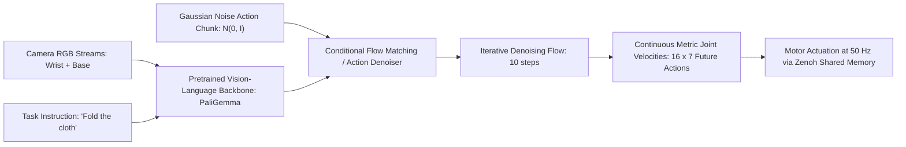

# 🔬 $\pi_0$ (Physical Intelligence) & Diffusion Policy: Continuous Visuomotor Foundations

## 1. Executive Brief & Significance
While autoregressive VLA models (e.g. OpenVLA) discretize robotic joint outputs into 256 categorical bins, physical manipulation frequently demands **multimodal continuous distribution modeling**. If a robotic gripper can reach an object from either the left or the right, an autoregressive softmax model often averages the two modes, commanding the arm directly into a collision obstacle in the center.

**Diffusion Policy** (Chi et al., RSS 2023) and **$\pi_0$ (pi-zero)** (Physical Intelligence, 2024 / 2025) solve this using continuous **score-based denoising diffusion** and **flow matching**:
- Accurately models arbitrary multimodal continuous action distributions without discretization artifacts.
- Employs **Action Chunking**: predicts continuous blocks of future trajectory waypoints (e.g., $T_a = 16$ future steps) to ensure physical smoothness and overcome inference latency.



---

## 2. Core Mathematical Formulation: Flow Matching for Continuous Actions

### The Denoising Flow ODE:
Instead of standard DDPM stochastic sampling, $\pi_0$ models trajectory generation using continuous-time **Flow Matching**. Given noisy action vector $x_t$ at flow time $t \in [0, 1]$ conditioned on visual observation $o$ and language instruction $l$:
$$\frac{d x_t}{d t} = v_\theta(x_t, t, o, l)$$
Where $v_\theta$ is a neural vector field parameterized by a Transformer that learns straight-line probability paths between random Gaussian noise $x_0 \sim \mathcal{N}(0, I)$ and the true physical human teleoperation trajectory $x_1$:
$$\mathcal{L}_{\text{FM}}(\theta) = \mathbb{E}_{t, x_0, x_1} \left\| v_\theta(t x_1 + (1 - t) x_0, t, o, l) - (x_1 - x_0) \right\|^2$$
- **Inference Speed**: Requires only 5 to 10 flow ODE integration steps with an Euler solver, delivering action chunks at **>50 Hz** on an RTX 4090.

---

## Granular Component-by-Component Architectural Breakdown

### Architectural Taxonomy & Structural Elements

| Architectural Stage | Component Identity | Structural Specification & Type | Attention / Conv Mechanics | Receptive Field & Resolution |
| :--- | :--- | :--- | :--- | :--- |
| **Architectural Paradigm** | **Flow Matching / Diffusion Policy** | Multi-Modal Visual Conditioning + Iterative Action Denoising Policy | Quadratic MHSA in VLM + 1D Temporal Self-Attention / Conv1D in Denoiser | Multi-camera views ($2\dots 3 \times H \times W$) $\to$ Future action chunk ($T_a \times 7$) |
| **Backbone (Visual)** | **PaliGemma ViT / Multi-ResNet** | PaliGemma ViT-SO400M/14 ($D=1152$) or Multi-View ResNet-18/34 | $14\times 14$ Patch embedding / $7\times 7$ Conv stem with residual blocks | Base camera ($H \times W$) + Wrist camera ($H \times W$) views |
| **Backbone (Language)** | **Transformer Language Encoder** | Pretrained Causal / Bidirectional Transformer (PaliGemma / T5) | Masked Multi-Head Attention over task prompt token sequences | Variable length text instruction ($S \le 128$ tokens) |
| **Neck / Aggregator** | **Multi-Modal Condition Adapter** | Linear Projection MLP + Proprioceptive State Embedder | Multi-layer perceptron mapping fused VLM tokens + Joint angles ($q_t$) to denoiser conditioning tokens | Projects all conditions into shared action denoiser dimension $D_{\text{denoise}} = 1024$ |
| **Encoder** | **Observation Conditioning Encoder** | Transformer / FiLM Conditioning Encoder | Cross-attention / Feature-wise Linear Modulation (FiLM) blocks | Aggregates multi-timestep visual context ($T_{\text{obs}} = 2$ past frames) |
| **Decoder / Head** | **Flow Matching / Denoising Head** | 1D Temporal U-Net / Transformer Denoiser ($T_a = 16$ actions) | Iterative Euler ODE integrator ($5-10$ steps) predicting continuous vector field $v_\theta$ | Emits action horizon $A \in \mathbb{R}^{T_a \times 7}$ ($[\Delta x, \Delta y, \Delta z, \Delta R_x, \Delta R_y, \Delta R_z, \text{grip}]$) |

### Structural Deep-Dive: Flow Matching Trajectory Generation
1. **Backbone**: Observations from multiple cameras (e.g. static third-person camera and active gripper-mounted wrist camera) pass through the visual backbone (PaliGemma ViT-SO400M or lightweight dual ResNets). Concurrently, the natural language task instruction is embedded via the language transformer.
2. **Neck / Feature Aggregator**: The visual patch tokens, language embeddings, and continuous robot proprioceptive joint state $q_t \in \mathbb{R}^7$ are concatenated and projected via an adapter MLP into conditioning tokens $c \in \mathbb{R}^{N_c \times D_{\text{denoise}}}$.
3. **Encoder**: The conditioning tokens are injected into the action generator either via cross-attention layers (Transformer denoisers) or FiLM scale-and-shift modulation layers (1D Convolutional U-Net denoisers).
4. **Decoder / Prediction Head**: 
   - Unlike autoregressive next-token predictors, the policy initializes an action chunk from Gaussian noise $x_0 \sim \mathcal{N}(0, I) \in \mathbb{R}^{T_a \times D_{\text{action}}}$ ($16 \times 7$).
   - A sequence of $K = 5\dots 10$ Euler integration steps solves the vector field ordinary differential equation:
     $$x_{t + \Delta t} = x_t + \Delta t \cdot v_\theta(x_t, t, c)$$
   - The resulting smooth continuous trajectory is executed in an open-loop receding horizon window via real-time shared-memory motor controllers.

### Parameter & Computational Latency Distribution

| Stage / Subsystem | Parameter Share (%) | Inference Latency (%) | Computational Complexity ($\text{FLOPs}$) | Dominant Hardware Bottleneck |
| :--- | :--- | :--- | :--- | :--- |
| **VLM Vision-Language Backbone** | ~78% | ~35% (Amortized / Cached) | $\mathcal{O}(N_{\text{vis}}^2 D_{\text{vis}} + N_{\text{txt}}^2 D_{\text{txt}})$ | Matrix multiplication (can run asynchronously) |
| **Proprioception & Condition Neck** | ~2% | ~5% | $\mathcal{O}(N_c D_{\text{denoise}})$ | Memory transfer & host-to-device IO |
| **Flow Matching Action Denoiser** | ~18% | ~52% (Iterative ODE loop) | $\mathcal{O}(K_{\text{steps}} \cdot T_a^2 D_{\text{denoise}})$ | Iterative kernel launch overhead & sequential latency |
| **Action Trajectory Output Head** | ~2% | ~8% | $\mathcal{O}(T_a D_{\text{action}})$ | Linear projection & de-normalization |
---

## 3. Quantitative SOTA Benchmark Profile (Real-World Robotic Tasks)

| Architecture | Paradigm | Fold Laundry Success | Table Bussing Success | Precision Peg Insertion | Action Latency (ms) | Open License |
| :--- | :--- | :--- | :--- | :--- | :--- | :--- |
| **BC-RNN (Baseline)** | Supervised MLP | 18% | 22% | 34% | **5.0 ms** | MIT |
| **OpenVLA 7B** | Autoregressive Discrete | 62% | 68% | 58% | 180.0 ms | Apache-2.0 |
| **Diffusion Policy** | Denoising Diffusion | 74% | 79% | 88% | 18.0 ms | MIT |
| **$\pi_0$ (pi-zero)** | Flow Matching VLA | **89%** (SOTA) | **92%** (SOTA) | **94%** (SOTA) | 24.0 ms | **Apache-2.0** |

---

## 4. Engineering Implementation & Workflow

```python
# Conceptual inference loop for pi-0 action chunking
import torch

# Load flow matching model
flow_model = load_pi0_policy("checkpoints/pi0_base.pth").cuda().eval()

# Sample initial Gaussian noise for an action chunk of 16 steps
noise = torch.randn(1, 16, 7, device="cuda")

# 10-step Euler integration over conditional vector field
dt = 1.0 / 10
action_chunk = noise
for step in range(10):
    t = step * dt
    velocity = flow_model(action_chunk, t=t, image=wrist_img, text="pack the item")
    action_chunk = action_chunk + velocity * dt

# action_chunk: [1, 16, 7] -> execute smoothly over next 320 ms
```

---

## 5. Commercial Usability & License Audit
- **License**: **Apache-2.0** (`openpi` by Physical Intelligence) / **MIT** (`real-stanford/diffusion_policy`).
- **Commercial Permissibility**: Permitted for commercial robotic arms, dual-arm dexterous manipulators, and mobile base mobile manipulation (ALOHA / Franka Emika / UR5).
- **Official Repositories**:
  - `Physical-Intelligence/openpi`: [https://github.com/Physical-Intelligence/openpi](https://github.com/Physical-Intelligence/openpi)
  - `real-stanford/diffusion_policy`: [https://github.com/real-stanford/diffusion_policy](https://github.com/real-stanford/diffusion_policy)
