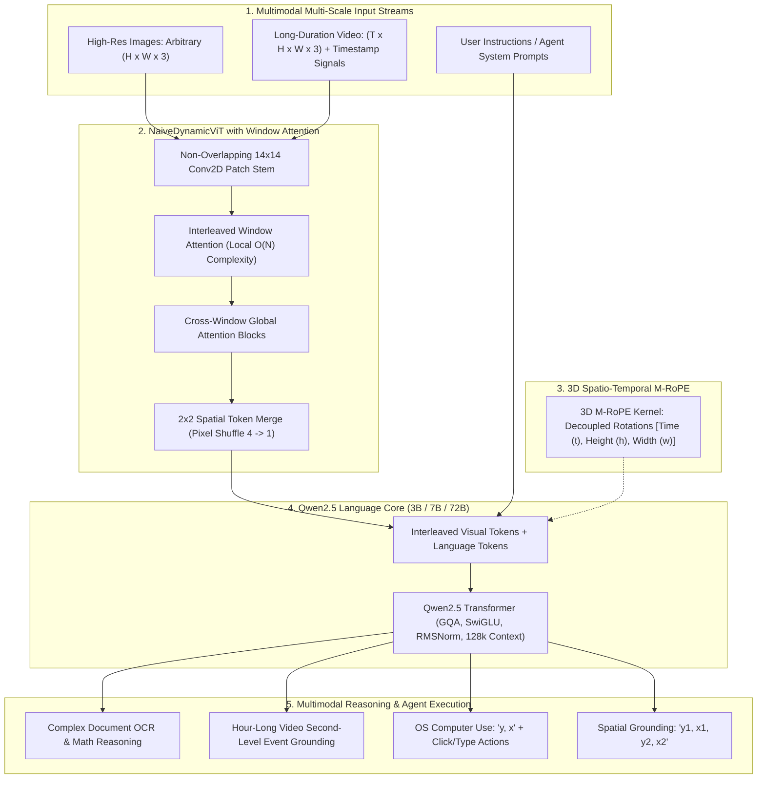
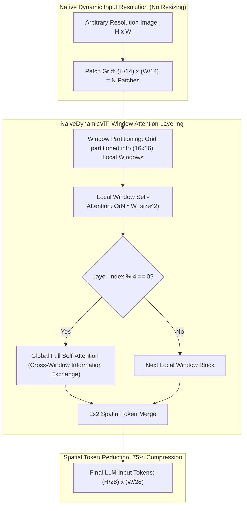
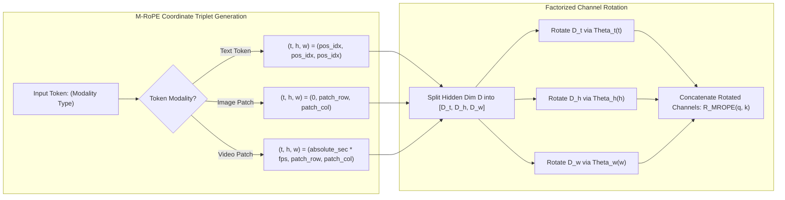
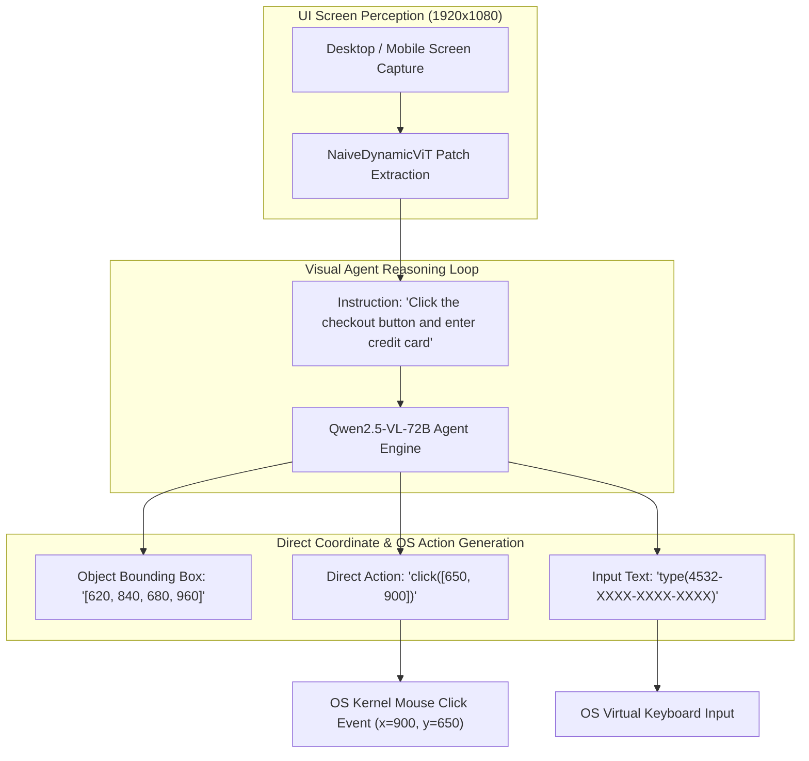
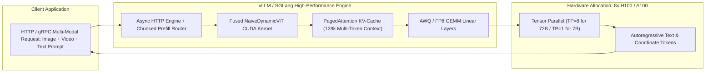
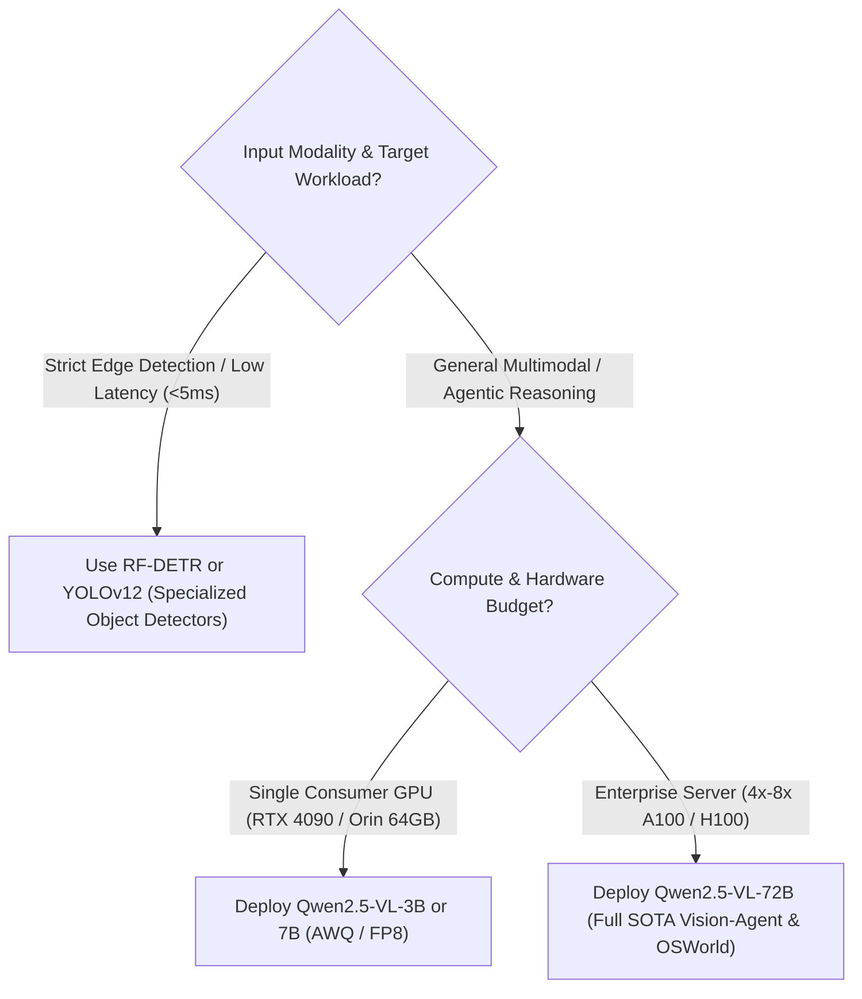

# 👁️ Qwen2.5-VL: Dynamic-Resolution Vision-Language & Visual-Agent Foundation Model

## 1. Executive Summary & Paradigm Shift

On January 26, 2025, the Alibaba Qwen team released **Qwen2.5-VL**, a flagship open-weight Vision-Language Model (VLM) family available in **3B, 7B, and 72B** parameter configurations. Building directly upon the foundation established by [[architectures/multimodal-vlm-and-vla/qwen2-vl|Qwen2-VL]], Qwen2.5-VL transforms multimodal foundation models from passive image/video captioning systems into **active visual reasoning and operating system agents**.

Qwen2.5-VL introduces four foundational architectural advancements:
1. **Window-Attention Accelerated Dynamic ViT (NaiveDynamicViT)**: Expands native dynamic aspect-ratio image ingestion with local **Window Attention** inside intermediate vision transformer layers, slashing visual encoder FLOPs by up to $65\%$ on ultra-high-resolution documents and multi-megapixel camera feeds.
2. **Absolute Time Encoding for Hour-Long Videos**: Replaces uniform frame sampling with continuous physical timestamp embeddings, enabling native ingestion of $1\text{+} \text{ hour}$ continuous video streams with second-level event localization and temporal reasoning.
3. **Multimodal Rotary Position Embedding (M-RoPE)**: Formally decouples 3D rotary embeddings across Time ($t$), Height ($h$), and Width ($w$), providing mathematically consistent positional rotations across interleaved text, multi-image sequences, and video feeds.
4. **Native Visual Agent Grounding**: Directly outputs normalized spatial bounding boxes (`<box>y1, x1, y2, x2</box>`) and precise OS UI click/tap action points (`<point>y, x</point>`), powering real-world computer use, smartphone UI automation, and robotic tool operation.



---

## 2. Granular Component-by-Component Architectural Breakdown

| Architectural Component | Technical Specification | Qwen2.5-VL-7B Configuration | Qwen2.5-VL-72B Configuration | Parameter Distribution (%) | Compute / Latency Distribution (%) |
| :--- | :--- | :--- | :--- | :--- | :--- |
| **Architectural Paradigm** | Dynamic-Resolution Autoregressive Multimodal Agent | Dynamic Window ViT + Causal Autoregressive LLM | Dynamic Window ViT + Causal Autoregressive LLM | $100\%$ Total ($7.61\text{B}$ / $72.8\text{B}$) | $100\%$ Total |
| **Vision Backbone** | **NaiveDynamicViT** with Interleaved Window Attention | $L=32$ blocks, $H=16$, $D=1280$, Patch $14 \times 14$; Window Size $16 \times 16$ | $L=32$ blocks, $H=16$, $D=1280$, Patch $14 \times 14$; Window Size $16 \times 16$ | $\sim 8.8\%$ ($670\text{M}$) in 7B;<br>$\sim 0.9\%$ ($670\text{M}$) in 72B | $\approx 22\% - 30\%$ during visual prefill;<br>$0\%$ during autoregressive decode |
| **Patch Stem / Stem Embedding** | Dynamic 2D Convolutional Patch Stem | Non-overlapping $14 \times 14$ Conv2D ($C_{\text{in}}=3 \to 1280$) | Non-overlapping $14 \times 14$ Conv2D ($C_{\text{in}}=3 \to 1280$) | $< 0.1\%$ | $< 1.0\%$ of vision encoder forward pass |
| **Neck / Spatial Token Merger** | $2 \times 2$ Spatial Token Merge + Linear Projection | Concatenates $2 \times 2$ spatial patches ($5120 \to 3584$) | Concatenates $2 \times 2$ spatial patches ($5120 \to 8192$) | $< 0.3\%$ | $< 0.5\%$ of prefill compute |
| **Encoder / Vision Attention** | Interleaved Window Attention + Global FlashAttention-2 | Alternates $3 \times$ local window attention ($16 \times 16$ patches) with $1 \times$ full global attention | Alternates $3 \times$ local window attention ($16 \times 16$ patches) with $1 \times$ full global attention | Included in Vision Backbone | $\approx 35\%$ of vision encoder pass (down from $60\%$ in Qwen2-VL) |
| **Language Backbone** | Causal Autoregressive Transformer (**Qwen2.5**) with GQA | $L=28$, $H_Q=28$, $H_{KV}=4$, $D=3584$, SwiGLU, RMSNorm | $L=80$, $H_Q=64$, $H_{KV}=8$, $D=8192$, SwiGLU, RMSNorm | $\sim 90.9\%$ ($6.94\text{B}$) in 7B;<br>$\sim 99.0\%$ ($72.1\text{B}$) in 72B | $\approx 70\% - 78\%$ during prefill;<br>$\approx 99.8\%$ during autoregressive decode |
| **Positional Encoding** | **3D Multimodal RoPE (M-RoPE)** with Physical Time Support | Decoupled 3D rotations: $d_t = 16$, $d_h = 24$, $d_w = 24$ (Head Dim $64$) | Decoupled 3D rotations: $d_t = 32$, $d_h = 48$, $d_w = 48$ (Head Dim $128$) | $< 0.05\%$ | Negligible computation overhead |
| **Vocabulary & Head** | Linear LM Head over Extended Multimodal BPE | Vocab Size: $152,064$ tokens + `<box>`, `<point>` tokens | Vocab Size: $152,064$ tokens + `<box>`, `<point>` tokens | $\sim 7.1\%$ in 7B | $\approx 2.5\%$ of decode step |

---

## 3. Core Architectural Mechanics & Mathematical Formulations



### A. NaiveDynamicViT with Interleaved Window Attention
Standard Vision Transformers enforce a rigid square input grid (e.g., $224 \times 224$ or $384 \times 384$) via bilinear interpolation or center-cropping, which degrades fine document typography and distorts panoramic imagery.

Qwen2.5-VL partitions the raw image into non-overlapping $14 \times 14$ patches dynamically without geometric interpolation:

$$N_{\text{patches}} = \left\lceil \frac{H}{14} \right\rceil \times \left\lceil \frac{W}{14} \right\rceil$$

In prior architectures (such as [[architectures/multimodal-vlm-and-vla/qwen2-vl|Qwen2-VL]]), computing full global self-attention across all $N_{\text{patches}}$ for a $4\text{K}$ image ($3840 \times 2160 \to 42,320$ patches) incurs a quadratic memory and compute explosion $\mathcal{O}(N^2)$.

To overcome this, Qwen2.5-VL introduces **Interleaved Window Attention**:
1. **Local Window Partitioning**: Intermediate ViT layers divide the 2D patch grid into non-overlapping spatial windows of size $M \times M$ (where $M=16$, corresponding to a $224 \times 224$ pixel local receptive field). Self-attention is computed strictly within each window:
   $$\text{Complexity}_{\text{Local}} = \mathcal{O}\left( \left(\frac{N}{M^2}\right) \cdot (M^2)^2 \cdot D \right) = \mathcal{O}\left( N \cdot M^2 \cdot D \right)$$
   This reduces the computational scaling from quadratic $\mathcal{O}(N^2)$ to **linear with respect to image area $\mathcal{O}(N)$**.
2. **Periodic Global Attention**: Every 4th layer ($L \in \{4, 8, 12, \dots, 32\}$), the model evaluates full global FlashAttention-2 across all patches, allowing distant visual tokens to exchange long-range contextual information.
3. **$2 \times 2$ Spatial Token Merge**: After the 32 ViT blocks, adjacent $2 \times 2$ patch tokens are concatenated and projected into the LLM embedding dimension $D_{\text{model}}$ via a lightweight MLP, reducing token count by $75\%$:
   $$N_{\text{visual tokens}} = \left\lceil \frac{H}{28} \right\rceil \times \left\lceil \frac{W}{28} \right\rceil$$

---

### B. 3D Multimodal Rotary Position Embedding (M-RoPE) with Absolute Time



Standard 1D RoPE flattens 2D images and 3D video frames into linear 1D arrays, destroying spatial adjacency and temporal coherence.

**3D M-RoPE** factorizes the rotary embedding across three physical coordinate axes: **Temporal ($t$)**, **Vertical Height ($h$)**, and **Horizontal Width ($w$)**.

Given a query or key vector $x \in \mathbb{R}^d$ for head dimension $d$, the channels are partitioned into three dedicated subspaces:

$$d = d_t + d_h + d_w$$

For Qwen2.5-VL-7B ($d=64$), the allocation is $d_t = 16, d_h = 24, d_w = 24$. The 3D rotation matrix $\mathbf{R}_{\text{M-RoPE}}(t, h, w)$ is formulated as a block-diagonal rotation:

$$\mathbf{R}_{\text{M-RoPE}}(t, h, w) = \text{diag}\left( \mathbf{R}_{\Theta_t}(t), \mathbf{R}_{\Theta_h}(h), \mathbf{R}_{\Theta_w}(w) \right)$$

Where for each axis $k \in \{t, h, w\}$:

$$\mathbf{R}_{\Theta_k}(p_k) = \begin{pmatrix} 
\cos(p_k \theta_1) & -\sin(p_k \theta_1) & 0 & 0 & \dots \\
\sin(p_k \theta_1) & \cos(p_k \theta_1) & 0 & 0 & \dots \\
0 & 0 & \cos(p_k \theta_2) & -\sin(p_k \theta_2) & \dots \\
0 & 0 & \sin(p_k \theta_2) & \cos(p_k \theta_2) & \dots 
\end{pmatrix}, \quad \theta_i = 10000^{-2(i-1)/d_k}$$

#### Coordinate Assignment Rules:
- **Text Tokens**: For a text token at sequence position $i$, the coordinates are synchronized across all three axes: $(t_i, h_i, w_i) = (i, i, i)$. This guarantees that text-only pretraining weights remain mathematically identical to standard 1D RoPE.
- **Image Tokens**: For an image patch located at row $r$ and column $c$, the temporal index is fixed at $t=0$, and spatial coordinates are mapped directly: $(t, h, w) = (0, r, c)$.
- **Video Tokens with Absolute Time Encoding**: Prior models assigned video frames integer indices $t \in \{0, 1, 2, \dots\}$. If a video was sampled at $1\text{ FPS}$ vs $10\text{ FPS}$, the temporal distance between consecutive frames was distorted. Qwen2.5-VL assigns $t$ using the **exact physical timestamp in seconds**:
  $$t_{\text{frame}} = \text{round}\left( \text{Timestamp}_{\text{seconds}} \times \text{FPS}_{\text{base}} \right)$$
  This enables the model to localize millisecond-level actions in hour-long continuous security, medical, or robotics footage.

---

### C. Visual Agent Capabilities: Grounding & Computer Use



Qwen2.5-VL incorporates native spatial tokenization directly into its vocabulary, eliminating the need for external detection heads or specialized post-processing scripts:

1. **Normalized Coordinate Bounding Boxes**:
   - The model normalizes image height and width to an integer range of $[0, 1000]$.
   - Detection queries output structured XML tags: `<box>y_min, x_min, y_max, x_max</box>`.
   - Example: A detected pedestrian across pixels $[y_1=108, x_1=384, y_2=540, x_2=768]$ on a $1920 \times 1080$ frame is generated as `<box>100, 200, 500, 400</box>`.
2. **Click & Tap Points for Computer / Phone Use**:
   - For UI interaction (OSWorld, Mobile-Bench), Qwen2.5-VL outputs target point coordinates `<point>y, x</point>` corresponding to the exact interactive centroid of buttons, text fields, and dropdowns.
   - Combined with OS automation drivers (e.g., PyAutoGUI or Android ADB), Qwen2.5-VL executes end-to-end multi-step workflow automation.

---

## 4. Quantitative Benchmark Profile & SOTA Comparison

### A. Comprehensive Multimodal Benchmark Matrix (Jan 2025 Evaluation)

| Benchmark | Domain / Modality | Qwen2-VL-72B | **Qwen2.5-VL-7B** | **Qwen2.5-VL-72B** | Claude 3.5 Sonnet | GPT-4o (May 2024) | Gemini 1.5 Pro |
| :--- | :--- | :--- | :--- | :--- | :--- | :--- | :--- |
| **MMMU** (val) | Multi-discipline college reasoning | $56.7\%$ | **$58.5\%$** | **$66.4\%$** | $68.3\%$ | $69.1\%$ | $63.5\%$ |
| **MathVista** (test) | Mathematical visual reasoning | $68.2\%$ | **$70.4\%$** | **$78.6\%$** | $67.7\%$ | $63.8\%$ | $63.9\%$ |
| **DocVQA** (test) | High-res document understanding | $94.5\%$ | **$95.2\%$** | **$96.4\%$** | $95.2\%$ | $92.8\%$ | $93.1\%$ |
| **InfoVQA** (test) | Infographic visual parsing | $78.8\%$ | **$81.2\%$** | **$85.5\%$** | $80.8\%$ | $76.2\%$ | $78.0\%$ |
| **OCRBench** | Dense character & scene text recognition | $865$ | **$884$** | **$912$** | $788$ | $736$ | $754$ |
| **Video-MME** (w/ subs) | Comprehensive video comprehension | $71.5\%$ | **$74.2\%$** | **$83.1\%$** | $77.2\%$ | $77.2\%$ | $81.7\%$ |
| **Video-MME** (long video) | Videos $>30\text{ minutes}$ duration | $63.4\%$ | **$67.8\%$** | **$78.4\%$** | $69.5\%$ | $71.0\%$ | $76.8\%$ |
| **OSWorld** (test) | Desktop OS computer use automation | $12.4\%$ | **$18.5\%$** | **$31.2\%$** | $28.5\%$ | $24.8\%$ | $19.2\%$ |
| **RefCOCOg** | Natural language spatial grounding | $88.2\%$ | **$89.6\%$** | **$92.1\%$** | N/A | N/A | N/A |

### Key Benchmark Insights:
- **Mathematical & Document Dominance**: Qwen2.5-VL-72B scores **$78.6\%$ on MathVista**, surpassing GPT-4o ($63.8\%$) and Claude 3.5 Sonnet ($67.7\%$) by over $10\text{ percentage points}$.
- **Long Video Superiority**: On long-duration videos ($>30\text{ minutes}$ in Video-MME), Qwen2.5-VL-72B achieves **$78.4\%$**, leading Gemini 1.5 Pro ($76.8\%$) due to the absolute time M-RoPE encoding.
- **Computer Use Breakthrough**: On OSWorld, Qwen2.5-VL-72B ($31.2\%$) surpasses Claude 3.5 Sonnet ($28.5\%$), establishing a new open-weight state-of-the-art for visual agent execution.

---

## 5. Production Serving: vLLM & SGLang Recipes



### A. vLLM High-Throughput Serving Configuration
Deploying Qwen2.5-VL in production requires handling large dynamic visual token sequences efficiently using **Chunked Prefill** and **PagedAttention**:

```bash
# 1. Serving Qwen2.5-VL-7B on a Single GPU (NVIDIA RTX 4090 / A100-40GB / H100)
python3 -m vllm.entrypoints.openai.api_server \
    --model Qwen/Qwen2.5-VL-7B-Instruct \
    --served-model-name qwen2.5-vl-7b \
    --tensor-parallel-size 1 \
    --gpu-memory-utilization 0.92 \
    --max-model-len 32768 \
    --max-num-seqs 64 \
    --enable-chunked-prefill \
    --limit-mm-per-prompt 'image=8,video=2' \
    --trust-remote-code \
    --port 8000

# 2. Serving Qwen2.5-VL-72B with FP8 Quantization on 4x A100 / H100 (TP=4)
python3 -m vllm.entrypoints.openai.api_server \
    --model Qwen/Qwen2.5-VL-72B-Instruct-FP8 \
    --served-model-name qwen2.5-vl-72b-fp8 \
    --tensor-parallel-size 4 \
    --gpu-memory-utilization 0.95 \
    --max-model-len 65536 \
    --enable-chunked-prefill \
    --kv-cache-dtype fp8 \
    --limit-mm-per-prompt 'image=16,video=4' \
    --trust-remote-code \
    --port 8000
```

### B. Python Production Client: Multi-Image Reasoning & UI Grounding

```python
import openai
import base64

def encode_image(image_path: str) -> str:
    with open(image_path, "rb") as f:
        return base64.b64encode(f.read()).decode("utf-8")

client = openai.OpenAI(
    base_url="http://localhost:8000/v1",
    api_key="EMPTY"
)

def analyze_desktop_ui(screenshot_path: str, user_goal: str):
    """
    Submits a UI screenshot to Qwen2.5-VL and parses visual agent click coordinates.
    """
    base64_img = encode_image(screenshot_path)

    response = client.chat.completions.create(
        model="qwen2.5-vl-72b-fp8",
        messages=[
            {
                "role": "system",
                "content": (
                    "You are an expert GUI automation agent. Analyze the user's desktop screenshot "
                    "and provide the precise click coordinates in '<point>y, x</point>' format normalized "
                    "to [0, 1000] scale, followed by the rationale."
                )
            },
            {
                "role": "user",
                "content": [
                    {
                        "type": "text",
                        "text": f"User Goal: {user_goal}. Identify where the mouse must click next."
                    },
                    {
                        "type": "image_url",
                        "image_url": {
                            "url": f"data:image/png;base64,{base64_img}"
                        }
                    }
                ]
            }
        ],
        temperature=0.1,
        max_tokens=512
    )

    result_text = response.choices[0].message.content
    print(f"[+] Agent Output:\n{result_text}")
    return result_text

if __name__ == "__main__":
    # Example invocation
    # analyze_desktop_ui("desktop_screen.png", "Click the 'Submit Order' button in the bottom right.")
    pass
```

### C. SGLang Ultra-Fast Serving with RadixAttention
For workloads involving repetitive image prefixes (e.g., continuous video streaming or multi-turn UI navigation where the same background UI is sent repeatedly), **SGLang** with **RadixAttention** caches visual KV tokens across queries:

```bash
# Launch SGLang server with RadixAttention multi-modal prefix caching
python3 -m sglang.launch_server \
    --model-path Qwen/Qwen2.5-VL-7B-Instruct \
    --port 30000 \
    --tp 1 \
    --mem-fraction-static 0.88 \
    --chunked-prefill-size 4096 \
    --schedule-policy lpm
```

---

## 6. Architectural Trade-offs & Production Guidelines



### When to Select Qwen2.5-VL:
- **Complex Document & Visual Math Parsing**: For invoices, charts, tables, mathematical proofs, and infographics where standard OCR engines fail.
- **Operating System & Mobile UI Agents**: When building autonomous web navigators, automated software testing agents, or phone assistants requiring coordinate grounding (`<point>y, x</point>`).
- **Hour-Long Video Perception**: For surveillance anomaly detection, sports analytics, or multi-hour lecture summarization requiring fine-grained timestamp indexing.

### When to Prefer Specialized Alternatives:
- **Sub-10ms Real-Time Object Bounding Box Streams**: For industrial conveyor belts, autonomous drone flight, or high-FPS robotics control loops, use dedicated real-time detectors like [[architectures/real-time-detectors-and-segmenters/rf-detr|RF-DETR]] or [[architectures/real-time-detectors-and-segmenters/yolov12|YOLOv12]].
- **Embodied Robotics Trajectory Control**: For direct 6-DoF or 7-DoF end-effector trajectory generation, pair Qwen2.5-VL high-level visual planning with a specialized low-level policy model like [[architectures/multimodal-vlm-and-vla/pi0|pi0 & Diffusion Policy]] or [[architectures/multimodal-vlm-and-vla/openvla|OpenVLA]].

---

## 7. Cross-References & Canonical Vault Links

- **Related Architectures**:
  - [[architectures/multimodal-vlm-and-vla/qwen2-vl|Qwen2-VL Dynamic Resolution Foundation Model]]
  - [[architectures/multimodal-vlm-and-vla/internvl2-5|InternVL 2.5 High-Resolution VLM]]
  - [[architectures/multimodal-vlm-and-vla/florence-2|Florence-2 Unified Vision Foundation Model]]
  - [[architectures/multimodal-vlm-and-vla/pi0|pi0 & Diffusion Policy Robotics Foundation]]
  - [[architectures/multimodal-vlm-and-vla/openvla|AnyGrasp & OpenVLA Robotic Perception]]
- **Topic Deep Dives**:
  - [[topics/visual-guidance-and-robotics/00-visual-guidance-and-robotics-moc|Visual Guidance & Robotics MOC]]
  - [[topics/video-tracking/00-video-tracking-moc|Video Tracking MOC]]
  - [[topics/gpu-deployment/00-gpu-deployment-moc|GPU Deployment MOC]]
  - [[topics/real-time-systems/00-real-time-systems-moc|Real-Time Systems MOC]]
- **Official Publications & Repositories**:
  - **Qwen2.5-VL Announcement & Blog**: [https://qwenlm.github.io/blog/qwen2.5-vl/](https://qwenlm.github.io/blog/qwen2.5-vl/)
  - **Qwen2.5-VL GitHub Repository**: [https://github.com/QwenLM/Qwen2.5-VL](https://github.com/QwenLM/Qwen2.5-VL)
  - **Hugging Face Checkpoints**: [https://huggingface.co/collections/Qwen/qwen25-vl-6795af0eed0ec83b54433068](https://huggingface.co/collections/Qwen/qwen25-vl-6795af0eed0ec83b54433068)
