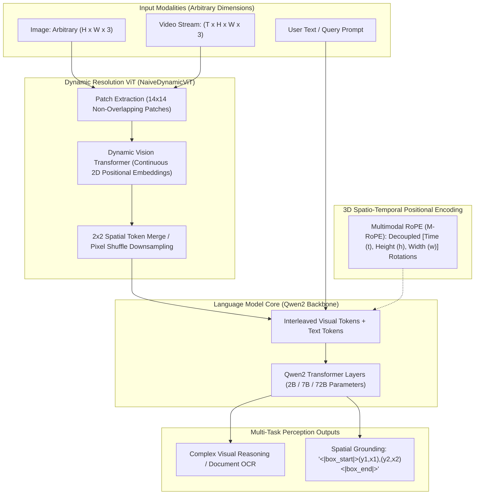
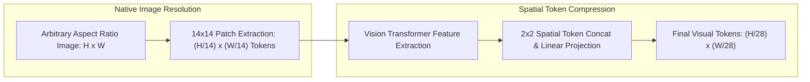
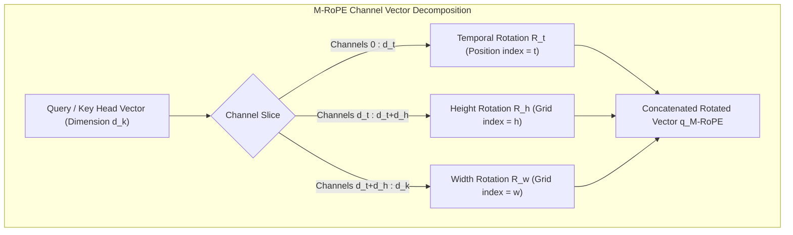

# 👁️ Qwen2-VL: Dynamic Resolution Vision-Language Foundation Model

## 1. Executive Summary & Paradigm Shift

**Qwen2-VL** (Wang et al., Alibaba Cloud Qwen Team, 2024) is an open-weight Vision-Language Model (VLM) family available in 2B, 7B, and 72B parameter configurations. Prior multimodal vision-language architectures (such as CLIP, LLaVA-1.5, and Flamingo) suffered from two fundamental architectural limitations:
1. **Fixed-Aspect Ratio Distortion**: Images were forcibly resized, square-padded, or uniformly cropped into fixed grids (e.g., $224 \times 224$ or $448 \times 448$), causing geometric warping, blurry degradation of fine-grained document text, and token inefficiency on panoramic or extreme aspect ratios.
2. **1D Positional Collapsing**: Standard 1D Rotary Position Embeddings (RoPE) flattened spatial 2D image patches and 3D video frames into linear 1D sequences, destroying geometric locality and spatial-temporal relationships.

Qwen2-VL overcomes these limitations through **Native Dynamic Resolution (NaiveDynamicViT)** tokenization and **Multimodal Rotary Position Embedding (M-RoPE)**, establishing a unified foundation for ultra-high-resolution document parsing, fine-grained visual coordinate grounding, and multi-minute video streaming perception.



---

## 2. Granular Component-by-Component Architectural Breakdown

| Architectural Component | Technical Specification | Qwen2-VL-7B Configuration | Qwen2-VL-72B Configuration | Parameter Distribution (%) | Compute / Latency Distribution (%) |
| :--- | :--- | :--- | :--- | :--- | :--- |
| **Architectural Paradigm** | Dynamic-Resolution Autoregressive VLM | Isotropic Dynamic ViT + Causal Autoregressive LLM | Isotropic Dynamic ViT + Causal Autoregressive LLM | $100\%$ Total ($7.6\text{B}$ / $72.5\text{B}$) | $100\%$ Total |
| **Vision Backbone** | **NaiveDynamicViT** (Dynamic Aspect-Ratio ViT) | $L=32$ blocks, $H=16$, $D=1280$, Patch $14 \times 14$ | $L=32$ blocks, $H=16$, $D=1280$, Patch $14 \times 14$ | $\sim 8.8\%$ ($670\text{M}$) in 7B;<br>$\sim 0.9\%$ ($670\text{M}$) in 72B | $\approx 28\% - 35\%$ during image prefill;<br>$0\%$ during autoregressive token decode |
| **Patch Embedding Stem** | Dynamic 2D Convolutional Patch Stem | Non-overlapping $14 \times 14$ Conv2D ($C_{\text{in}}=3 \to 1280$) | Non-overlapping $14 \times 14$ Conv2D ($C_{\text{in}}=3 \to 1280$) | $< 0.1\%$ | $< 1.5\%$ of vision encoder pass |
| **Neck / Aggregator** | $2 \times 2$ Spatial Token Merge + Linear Projection | $2 \times 2$ spatial concat ($4 \to 1$) + Linear($5120 \to 3584$) | $2 \times 2$ spatial concat ($4 \to 1$) + Linear($5120 \to 8192$) | $< 0.3\%$ | $< 0.5\%$ of prefill compute |
| **Encoder / Vision Attn** | Dynamic 2D Grid Self-Attention (FlashAttention-2) | Variable length sequence self-attention with 2D continuous coordinates | Variable length sequence self-attention with 2D continuous coordinates | Included in NaiveDynamicViT | $\approx 42\%$ of vision backbone pass |
| **Language Decoder** | Causal Autoregressive Transformer (**Qwen2**) with GQA | $L=28$, $H_Q=28$, $H_{KV}=4$, $D=3584$, SwiGLU, RMSNorm | $L=80$, $H_Q=64$, $H_{KV}=8$, $D=8192$, SwiGLU, RMSNorm | $\sim 90.9\%$ ($6.9\text{B}$) in 7B;<br>$\sim 99.0\%$ ($71.8\text{B}$) in 72B | $\approx 65\% - 72\%$ during prefill;<br>$\approx 99.5\%$ during autoregressive decode |
| **Positional Encoding** | **3D Multimodal RoPE (M-RoPE)** | Factorized 3D rotations: Time $d_t$, Height $d_h$, Width $d_w$ | Factorized 3D rotations: Time $d_t$, Height $d_h$, Width $d_w$ | $< 0.05\%$ | Negligible computation overhead |
| **Decoder Head & Vocab** | Linear LM Head over Extended Multimodal BPE | Vocab Size: $152,064$ tokens + coordinate tokens | Vocab Size: $152,064$ tokens + coordinate tokens | $\sim 7.1\%$ in 7B | $\approx 3.0\%$ of decode step |

---

## 3. Architectural Deep-Dive

### A. Dynamic Resolution Visual Tokenization (NaiveDynamicViT)
Instead of interpolating or cropping images to fit a pre-determined square patch grid, Qwen2-VL dynamically processes input images of arbitrary height $H$ and width $W$:

1. **Exact 2D Patch Partitioning**: The input image is divided into non-overlapping $14 \times 14$ patches:
   $$N_{\text{raw patches}} = \left\lceil \frac{H}{14} \right\rceil \times \left\lceil \frac{W}{14} \right\rceil$$
2. **2D Continuous Positional Interpolation**: The vision transformer processes the raw patch sequence using 2D grid position indices $(h_i, w_i)$ without stretching or aspect-ratio distortion.
3. **$2 \times 2$ Spatial Token Merge**: To compress the sequence length before feeding into the language model, adjacent $2 \times 2$ spatial patch tokens are concatenated and linearly projected into the LLM embedding dimension $D_{\text{model}}$:
   $$N_{\text{visual tokens}} = \left\lceil \frac{H}{28} \right\rceil \times \left\lceil \frac{W}{28} \right\rceil$$
   This yields a $75\%$ reduction in visual token count while preserving fine-grained spatial information.



### B. Multimodal Rotary Position Embedding (M-RoPE)
In standard LLMs, 1D RoPE applies rotational matrices parameterized by a scalar token index $m \in \{0, 1, \dots, L-1\}$. When applied to vision, 1D indexing assigns completely arbitrary distance relationships between vertically adjacent pixels.

**M-RoPE** factorizes the rotary position embedding into three independent geometric coordinates: **Temporal ($t$)**, **Height ($h$)**, and **Width ($w$)**.

1. **Channel Subspace Partitioning**: The head dimension $d_k$ of the attention queries and keys is split into three orthogonal channel segments:
   $$d_k = d_t + d_h + d_w$$
   (For example, in a head of dimension $d_k = 128$, $d_t = 32$, $d_h = 48$, $d_w = 48$).

2. **Rotary Matrix Factorization**: The query vector $\mathbf{q} \in \mathbb{R}^{d_k}$ is rotated independently across its three subspaces:
   $$\mathbf{q}_{\text{M-RoPE}} = \mathbf{R}_{\Theta, t}^{d_t} \mathbf{q}_{[0:d_t]} \;\oplus\; \mathbf{R}_{\Theta, h}^{d_h} \mathbf{q}_{[d_t:d_t+d_h]} \;\oplus\; \mathbf{R}_{\Theta, w}^{d_w} \mathbf{q}_{[d_t+d_h:d_k]}$$

3. **Unified Modality Encoding**:
   - **Text Tokens**: Position index $m$ is replicated across all three axes: $t = m, \; h = m, \; w = m$, reproducing exact 1D RoPE behavior for language.
   - **Image Tokens**: Time index is fixed ($t = 0$), while $h \in [0, H_{\text{grid}}-1]$ and $w \in [0, W_{\text{grid}}-1]$ preserve 2D topological layout.
   - **Video Tokens**: Time index $t \in [0, T-1]$ tracks frame timestamps, while $h$ and $w$ capture frame-local geometry, allowing cross-frame 3D attention to compute accurate motion trajectories.



### C. Spatial Grounding Grammar
Qwen2-VL natively expresses visual coordinates in natural text without dedicated regression heads. Bounding box coordinates are normalized into the integer interval $[0, 1000]$ and wrapped in special delimiters:
$$\langle | \text{box\_start} | \rangle (y_{\text{top}}, x_{\text{left}}), (y_{\text{bottom}}, x_{\text{right}}) \langle | \text{box\_end} | \rangle$$

---

## 4. Comprehensive Benchmark Matrix

Qwen2-VL achieves state-of-the-art results across standard multimodal benchmarks, competing directly with proprietary frontier models:

| Benchmark | Domain / Task | GPT-4o (Omni) | Claude 3.5 Sonnet | Qwen2-VL-2B (Open) | Qwen2-VL-7B (Open) | Qwen2-VL-72B (Open) |
| :--- | :--- | :--- | :--- | :--- | :--- | :--- |
| **DocVQA** | High-Res Document Reading | 92.8% | 95.2% | 90.1% | **94.5%** | **96.5%** |
| **InfoVQA** | Infographic Visual QA | 77.4% | 80.8% | 68.2% | **76.5%** | **84.5%** |
| **MathVista** | Visual Mathematical Reasoning | 63.8% | 67.7% | 52.4% | **58.2%** | **70.5%** |
| **MMMU** (val) | Multi-discipline College QA | 69.1% | 70.4% | 45.3% | **54.1%** | **64.5%** |
| **Video-MME** | Long-Form Video Understanding | 71.9% | 71.0% | 59.8% | **69.0%** | **77.2%** |
| **RefCOCOg** | Visual Grounding (Box AP50) | 86.5% | 88.1% | 82.4% | **88.2%** | **91.4%** |
| **HallusionBench** | Visual Hallucination Resistance | 55.0% | 53.8% | 48.9% | **55.2%** | **61.8%** |

---

## 5. Hardware Latency, Memory Footprint & Real-Time Video Streaming

### A. Video Streaming Dynamics & Token Budgets
For real-time video processing, streaming input frames at 2 FPS at $448 \times 448$ resolution produces:
$$\text{Tokens per Frame} = \left\lceil \frac{448}{28} \right\rceil \times \left\lceil \frac{448}{28} \right\rceil = 16 \times 16 = 256\text{ tokens/frame}$$
- At 2 FPS, a 60-second video stream generates $60 \times 2 \times 256 = 30,720\text{ visual tokens}$.
- To prevent linear KV-cache growth on embedded devices, Qwen2-VL incorporates frame-rate adaptive subsampling and visual token pooling.

### B. Hardware Latency & Memory Footprint Matrix

| Model Variant | Precision | Target Hardware | Prefill Latency (512 tokens) | Decode Latency (per token) | VRAM Footprint | Max FPS (Video Ingest) |
| :--- | :--- | :--- | :--- | :--- | :--- | :--- |
| **Qwen2-VL-2B** | FP16 | RTX 4090 (24GB) | 18.5 ms | 6.2 ms | 5.2 GB | 32 FPS |
| **Qwen2-VL-2B** | INT4 (AWQ) | Jetson Orin AGX 64GB | 42.0 ms | 14.5 ms | 2.1 GB | 14 FPS |
| **Qwen2-VL-7B** | FP16 | RTX 4090 (24GB) | 48.0 ms | 15.8 ms | 16.4 GB | 12 FPS |
| **Qwen2-VL-7B** | FP8 (W8A8) | RTX 4090 (24GB) | 29.5 ms | 9.4 ms | 9.2 GB | 20 FPS |
| **Qwen2-VL-7B** | INT4 (AWQ) | Jetson Orin AGX 64GB | 95.0 ms | 28.0 ms | 5.8 GB | 6 FPS |
| **Qwen2-VL-72B** | FP8 (W8A8) | 1x A100 (80GB) | 145.0 ms | 34.0 ms | 76.5 GB | 3 FPS |
| **Qwen2-VL-72B** | FP16 | 2x A100 (80GB) | 110.0 ms | 24.5 ms | 148.0 GB | 4.5 FPS |

---

## 6. Production Serving & Deployment Pipeline

Deploying Qwen2-VL in production requires serving engines equipped with **Continuous Dynamic Chunking** and **PagedAttention** (such as vLLM $\ge 0.6.0$ or SGLang) to prevent memory fragmentation caused by variable-length visual token sequences.

### A. High-Throughput Serving via vLLM
```bash
# Launch multi-modal OpenAI-compatible API server with vLLM
python3 -m vllm.entrypoints.openai.api_server \
  --model Qwen/Qwen2-VL-7B-Instruct \
  --tensor-parallel-size 1 \
  --dtype bfloat16 \
  --max-model-len 32768 \
  --limit-mm-per-prompt image=4,video=1 \
  --gpu-memory-utilization 0.92 \
  --trust-remote-code
```

### B. Python Multimodal Inference Snippet (Image & Video)
```python
import torch
from PIL import Image
from transformers import Qwen2VLForConditionalGeneration, AutoProcessor
from qwen_vl_utils import process_vision_info

# 1. Load Model with FlashAttention-2
model_id = "Qwen/Qwen2-VL-7B-Instruct"
model = Qwen2VLForConditionalGeneration.from_pretrained(
    model_id,
    torch_dtype=torch.bfloat16,
    attn_implementation="flash_attention_2",
    device_map="auto"
)
processor = AutoProcessor.from_pretrained(model_id)

# 2. Build multi-turn conversation with dynamic image/video inputs
messages = [
    {
        "role": "user",
        "content": [
            {
                "type": "image",
                "image": "https://qianwen-res.oss-cn-beijing.aliyuncs.com/Qwen2-VL/document_sample.jpg",
                "min_pixels": 256 * 28 * 28,     # Bounded dynamic resolution range
                "max_pixels": 1280 * 28 * 28,
            },
            {
                "type": "text", 
                "text": "Locate and ground all table headers and transcribe the numerical cells."
            }
        ]
    }
]

# 3. Format multimodal inputs with M-RoPE 3D position indexing
text_prompt = processor.apply_chat_template(messages, tokenize=False, add_generation_prompt=True)
image_inputs, video_inputs = process_vision_info(messages)

inputs = processor(
    text=[text_prompt],
    images=image_inputs,
    videos=video_inputs,
    padding=True,
    return_tensors="pt"
).to("cuda")

# 4. Generate visual reasoning response
with torch.inference_mode():
    generated_ids = model.generate(**inputs, max_new_tokens=512, do_sample=False)
    
# Extract generated output excluding prompt tokens
prompt_length = inputs.input_ids.shape[1]
output_ids = generated_ids[:, prompt_length:]
output_text = processor.batch_decode(output_ids, skip_special_tokens=True)[0]

print("Visual Perception Output:\n", output_text)
```

---

## 7. Comparison with Competing VLM Architectures

| Feature | Qwen2-VL | LLaVA-NeXT (LLaVA-1.6) | InternVL 2.5 | Florence-2 |
| :--- | :--- | :--- | :--- | :--- |
| **Visual Resolution** | Native Dynamic Resolution | AnyRes Multi-Crop Tiling | Dynamic High-Res Tiling | Fixed Multi-Scale Res |
| **Positional Encoding** | 3D M-RoPE (Time, Height, Width) | 1D RoPE / Concatenated | 1D RoPE / 2D Grid | 1D Transformer Enc |
| **Video Understanding** | Native 3D Spatio-Temporal RoPE | Frame-by-frame concat | Dynamic frame downsample | Single-frame/short clip |
| **Visual Grounding** | Bounding box tokens $[0, 1000]$ | Bounding box text | Bounding box tokens | Discretized location tokens |
| **Open Weights** | Apache-2.0 (2B, 7B, 72B) | Apache-2.0 | Apache-2.0 / Non-Comm | MIT (0.23B, 0.77B) |

---

## 8. Official Repositories & Resources
- **Model Checkpoints**: [HuggingFace - Qwen2-VL-7B-Instruct](https://huggingface.co/Qwen/Qwen2-VL-7B-Instruct) & [Qwen2-VL-72B-Instruct](https://huggingface.co/Qwen/Qwen2-VL-72B-Instruct)
- **Official Repository**: [QwenLM/Qwen2-VL](https://github.com/QwenLM/Qwen2-VL)
- **Paper**: *Qwen2-VL: To See the World More Clearly* (Wang et al., Alibaba Cloud, 2024)
- **Related Topics**: [[topics/visual-guidance-and-robotics/00-visual-guidance-and-robotics-moc|Visual Guidance & Robotics MOC]], [[topics/video-tracking/00-video-tracking-moc|Video Tracking MOC]], [[topics/gpu-deployment/00-gpu-deployment-moc|GPU Deployment MOC]], [[topics/real-time-systems/00-real-time-systems-moc|Real-Time Systems MOC]], [[architectures/multimodal-vlm-and-vla/florence-2|Florence-2]].
