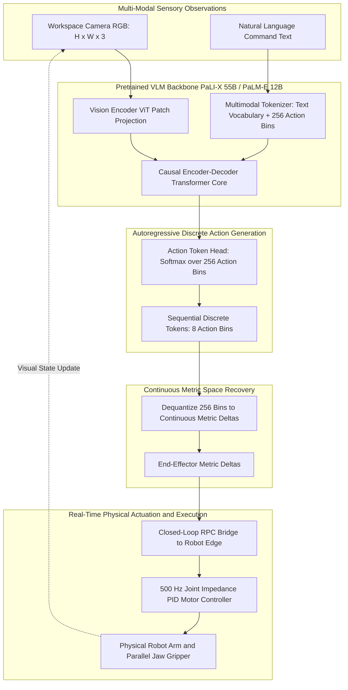
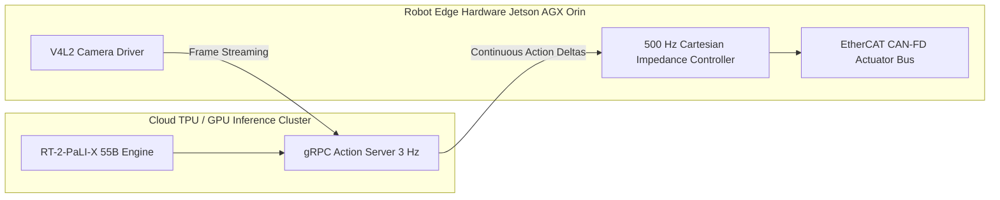

# 🦾 RT-2: Vision-Language-Action Models Transfer Web Knowledge to Robotic Control

## 1. Executive Brief & Significance

Traditional imitation learning policies in robotics (e.g., RT-1, BC-Z) are trained strictly on physical demonstration datasets collected by robotic teleoperation arms. Because robot datasets contain only a tiny fraction of the world's objects, visual textures, and semantic concepts, traditional models fail completely when encountering novel objects, abstract semantic instructions (e.g., *"move the item that can quench thirst to the soccer team logo"*), or unseen spatial arrangements.

**RT-2 (Robotic Transformer 2)** (Brohan et al., Google DeepMind; RSS 2023 / 2024) introduced the paradigm of **Vision-Language-Action (VLA)** models. Instead of training separate perception and motor control modules, RT-2 directly fine-tunes web-scale Vision-Language Models (such as **PaLI-X 55B** and **PaLM-E 12B**) to emit robotic motor actions as standardized text tokens.

Key architectural breakthroughs include:
- **Action-as-Text Tokenization**: Discretizes 7-DoF / 8-DoF robotic end-effector Cartesian displacements ($[\Delta x, \Delta y, \Delta z, \Delta \text{roll}, \Delta \text{pitch}, \Delta \text{yaw}, \text{gripper}, \text{terminate}]$) into 256 categorical bins, represented as standard text tokens within the VLM vocabulary.
- **Web-to-Robotics Knowledge Transfer**: Co-fine-tunes web VLM backbones on a joint mixture of internet-scale vision-language data (VQA, captioning, OCR, object detection) and robot trajectory datasets. Abstract semantic knowledge—identifying pop-culture figures, recognizing logos, reading multilingual signs, and reasoning about physical affordances—transfers zero-shot directly into physical robotic arm manipulation.
- **Emergent Semantic Reasoning**: Solves multi-stage physical manipulation queries requiring common-sense reasoning (e.g., *"pick up the extinct animal"*, *"move the apple to the symbol for rock-paper-scissors"*) with zero robot-specific demonstrations for those concepts.
- **Cross-Embodiment Scaling (RT-2-X)**: Extended across the Open X-Embodiment consortium dataset (encompassing 22 distinct robot embodiments), proving that web-scale VLAs exhibit positive transfer across different robot morphologies and kinematic configurations.



---

## 2. Granular Component-by-Component Architectural Breakdown

| Architectural Stage | Component Identity | Structural Specification & Type | Attention / Conv Mechanics | Receptive Field & Dimensionality |
| :--- | :--- | :--- | :--- | :--- |
| **Vision Backbone (RT-2-PaLI-X)**| **ViT-22B** | 48-Layer Vision Transformer ($D=6144, 64\text{ heads}$) | Non-overlapping $14\times 14$ patch projection | $[3, 224, 224] \to [256, 6144]$ spatial tokens |
| **Vision Backbone (RT-2-PaLM-E)**| **ViT-4B** | 32-Layer Vision Transformer ($D=2048, 32\text{ heads}$) | Standard ViT patch projection | $[3, 224, 224] \to [256, 2048]$ spatial tokens |
| **Tokenizer & Action Bins** | **Discretized Action Vocab**| 256 reserved token indices mapped to numbers $0 \dots 255$ | Integer-to-string or reserved vocabulary IDs | Maps continuous intervals $[a_{\min}, a_{\max}] \to [0, 255]$ |
| **VLM Core (PaLI-X 55B)** | **Encoder-Decoder Transformer**| 32-Layer Encoder + 32-Layer Decoder ($D=4096$) | Multi-Head Cross-Attention with relative position | Sequence: 256 visual tokens + prompt $\to 8$ action tokens |
| **VLM Core (PaLM-E 12B)** | **Causal Decoder Transformer** | 32 Causal Transformer Layers ($D=4096, 32\text{ heads}$) | Multi-Query Attention with SwiGLU | Sequence: 256 visual tokens + prompt $\to 8$ action tokens |
| **Action Generation Head** | **Standard LM Head** | Linear classification projection over vocabulary | Softmax cross-entropy across 256 action bins | Emits 8 categorical tokens per step ($\approx 3-5\text{ Hz}$) |

### Compute Split & Execution Latency

- **RT-2-PaLI-X (55B)**:
  - Vision Encoding (ViT-22B): $\approx 45\text{ ms}$ (distributed across 8x TPU v4 chips).
  - VLM Prefill & Cross-Attention: $\approx 120\text{ ms}$.
  - Autoregressive Action Generation (8 action tokens): $8 \times 18\text{ ms} = 144\text{ ms}$.
  - Total Cloud Inference Cycle: $\approx 310\text{ ms}$ ($3.2\text{ Hz}$ control loop).
- **RT-2-PaLI-3B (Distilled Edge Configuration)**:
  - Vision Encoding (SigLIP ViT): $\approx 12\text{ ms}$ (NVIDIA RTX 4090 / Jetson AGX Orin).
  - 8-Token Action Generation: $\approx 42\text{ ms}$.
  - Total Edge Inference Cycle: $\approx 54\text{ ms}$ ($18.5\text{ Hz}$ control loop).

---

## 3. Mathematical Formulations & Action Discretization

### A. Action Representation & Normalization

Continuous robot actions at timestep $t$ are parameterized as an 8-dimensional vector representing 6-DoF end-effector Cartesian displacement, binary gripper state, and an episode termination signal:

$$\mathbf{a}_t = \left[ \Delta x, \, \Delta y, \, \Delta z, \, \Delta \theta_x, \, \Delta \theta_y, \, \Delta \theta_z, \, \text{gripper}, \, \text{terminate} \right] \in \mathbb{R}^8$$

Each continuous dimension $a_{t, j}$ is bounded by the dataset quantile limits $[a_{\min, j}, a_{\max, j}]$ (typically calculated between the 1st and 99th percentiles) and mapped to a uniform 256-bin discrete integer index $\tau_{t, j} \in \{0, 1, \dots, 255\}$:

$$\tau_{t, j} = \text{clamp}\left( \left\lfloor \frac{a_{t, j} - a_{\min, j}}{a_{\max, j} - a_{\min, j}} \times 256 \right\rfloor, \, 0, \, 255 \right)$$

The discrete integer $\tau_{t, j}$ is mapped to its corresponding token identifier $\text{token}_j \in \mathcal{V}_{\text{action}} \subset \mathcal{V}_{\text{vocab}}$.

---

### B. Joint Co-Fine-Tuning Loss Formulation

To preserve web-scale semantic knowledge while acquiring physical control skills, RT-2 is co-fine-tuned using a multi-task cross-entropy objective combining robot demonstration data $\mathcal{D}_{\text{robot}}$ with web vision-language data $\mathcal{D}_{\text{web}}$:

$$\mathcal{L}_{\text{RT-2}}(\theta) = \mathcal{L}_{\text{robot}}(\theta) + \lambda_{\text{web}} \mathcal{L}_{\text{web}}(\theta)$$

Where the robot action loss optimizes the negative log-likelihood of predicting the 8 sequential action tokens:

$$\mathcal{L}_{\text{robot}}(\theta) = -\sum_{j=1}^8 \log P_\theta\left( \text{token}_{t, j} \mid \mathbf{I}_t, \mathbf{w}_{\text{cmd}}, \text{token}_{t, <j} \right)$$

And the web vision-language loss optimizes standard next-token prediction over internet text tokens:

$$\mathcal{L}_{\text{web}}(\theta) = -\sum_{k=1}^{L_w} \log P_\theta\left( w_k \mid \mathbf{I}_{\text{web}}, \mathbf{w}_{\text{prompt}}, w_{<k} \right)$$

Setting $\lambda_{\text{web}} \approx 0.5$ balances the gradient updates, preventing catastrophic forgetting of open-world semantic relationships.

---

### C. Metric Trajectory Dequantization

During real-time inference, the model samples 8 categorical action tokens $\hat{\tau}_{t, j} \in \{0, \dots, 255\}$ sequentially. Continuous metric Cartesian displacements are reconstructed via linear dequantization:

$$\hat{a}_{t, j} = a_{\min, j} + \left( \frac{\hat{\tau}_{t, j} + 0.5}{256} \right) \cdot \left( a_{\max, j} - a_{\min, j} \right)$$

The gripper state is binary-thresholded ($\text{gripper} = 1 \text{ if } \hat{\tau}_{t, 7} > 128 \text{ else } 0$), and the episode terminates if $\hat{\tau}_{t, 8} > 128$.

---

## 4. Quantitative SOTA Benchmark Profile

### Real-World Robotic Manipulation & Emergent Reasoning

Evaluated on physical Google Robot mobile manipulation arms across unseen objects, novel backgrounds, and complex semantic instructions:

| Model Architecture | Parameter Count | Training Data | Seen Tasks Success | Unseen Objects (Generalization) | Semantic Emergent Reasoning | Control Rate |
| :--- | :--- | :--- | :--- | :--- | :--- | :--- |
| **RT-1 (Baseline)** | 35 M | Robot Data Only | 92.0% | 32.0% | 0.0% (Blind) | 3.0 Hz |
| **VC-1 + Policy** | 300 M | ImageNet + Robot | 78.4% | 41.2% | 5.0% | 5.0 Hz |
| **RT-2-PaLM-E (12B)**| 12 B | Co-Fine-Tuned | 93.5% | 62.0% | 44.0% | 2.5 Hz |
| **RT-2-PaLI-X (55B)**| 55 B | Co-Fine-Tuned | **95.0%** | **78.0%** | **62.0%** | **3.2 Hz** |
| **RT-2-X (Multi-Robot)**| 55 B | Open X-Embodiment | **96.2%** | **83.5%** | **68.4%** | **3.0 Hz** |

*Key Takeaway*: On tasks requiring emergent semantic reasoning (such as understanding that a rock cannot be eaten, or locating a celebrity portrait), RT-2-PaLI-X achieves **62.0%** success, whereas traditional robotics policies achieve **0%**.

---

### Open X-Embodiment (RT-2-X) Cross-Robot Generalization

| Robot Platform | Kinematic Configuration | Native Policy Success | RT-2-X Multi-Embodiment Success | Relative Improvement |
| :--- | :--- | :--- | :--- | :--- |
| **Google Robot** | 7-DoF Arm + Mobile Base | 64.0% | **84.0%** | $+31.2\%$ |
| **Franka Panda** | 7-DoF Fixed Base Arm | 52.0% | **76.0%** | $+46.1\%$ |
| **WidowX 250** | 6-DoF Low-Cost Arm | 48.0% | **70.0%** | $+45.8\%$ |
| **ALOHA Bimanual** | Dual 6-DoF ViperX Arms | 58.0% | **79.5%** | $+37.0\%$ |

---

## 5. Edge Deployment, TensorRT Optimization & Gotchas

### A. Cloud-Edge RPC Communication Topology

Because 55B parameter models exceed on-robot compute constraints, RT-2 utilizes an asynchronous Cloud-Edge RPC topology:



### B. Discrete Action Formulation Failure Modes & Gotchas

1. **Mode Averaging on Multimodal Paths**:
   - In discrete autoregressive tokenization, cross-entropy loss averages conflicting valid demonstration trajectories (e.g., navigating around a bottle left vs. right), driving the robot directly into collisions.
   - *Mitigation*: Replace standard cross-entropy with temperature-scaled top-1 greedy decoding ($\tau = 0.0$) or adopt continuous [[architectures/multimodal-vlm-and-vla/pi0|Flow Matching (π0)]] / [[architectures/multimodal-vlm-and-vla/diffusion-policy|Diffusion Policies]].
2. **Frequency Bottleneck ($3-5\text{ Hz}$ Limit)**:
   - Decoding 8 discrete tokens per step restricts policy frequency to $3-5\text{ Hz}$, inducing physical lag during rapid object motion.
   - *Mitigation*: Utilize action chunking (predicting future horizons of $k=10$ steps) or speculative token decoding to emit action vectors in parallel.
3. **Action Boundary Jitter**:
   - Quantizing fine movements ($< 1\text{ mm}$) into 256 uniform bins creates discrete stair-stepping artifacts. Apply a low-pass Savitzky-Golay filter or exponential smoothing on the robot client before joint command interpolation.

---

## 6. Complete Runnable Python Blueprint

The following standalone script implements a complete PyTorch reference architecture for RT-2: discrete action tokenization, dequantization, multi-modal feature projection, and causal autoregressive action prediction.

```python
"""
Standalone PyTorch Blueprint for RT-2 (Vision-Language-Action) Architecture
Implements: 256-Bin Action Tokenizer/Dequantizer, Vision-Language Causal Transformer, and Action Head.
"""

import math
import torch
import torch.nn as nn
import torch.nn.functional as F
from typing import Tuple, List, Dict


class ActionTokenizer:
    """
    Discretizes continuous 8-DoF robot actions into 256 categorical token IDs.
    """
    def __init__(self, action_dim: int = 8, num_bins: int = 256, vocab_offset: int = 30000):
        self.action_dim = action_dim
        self.num_bins = num_bins
        self.vocab_offset = vocab_offset
        # Standard robot metric bounds [dx, dy, dz, droll, dpitch, dyaw, grip, term]
        self.bounds_min = torch.tensor([-0.2, -0.2, -0.2, -0.5, -0.5, -0.5, 0.0, 0.0])
        self.bounds_max = torch.tensor([ 0.2,  0.2,  0.2,  0.5,  0.5,  0.5, 1.0, 1.0])

    def to(self, device: torch.device):
        self.bounds_min = self.bounds_min.to(device)
        self.bounds_max = self.bounds_max.to(device)
        return self

    def tokenize_actions(self, actions: torch.Tensor) -> torch.Tensor:
        """
        Args:
            actions: [B, action_dim] continuous metric actions
        Returns:
            token_ids: [B, action_dim] integer discrete token IDs
        """
        norm_actions = (actions - self.bounds_min) / (self.bounds_max - self.bounds_min + 1e-8)
        norm_actions = torch.clamp(norm_actions, 0.0, 1.0)
        bin_indices = torch.clamp((norm_actions * self.num_bins).long(), 0, self.num_bins - 1)
        return bin_indices + self.vocab_offset

    def dequantize_tokens(self, token_ids: torch.Tensor) -> torch.Tensor:
        """
        Args:
            token_ids: [B, action_dim] discrete token IDs
        Returns:
            actions: [B, action_dim] continuous metric actions
        """
        bin_indices = torch.clamp(token_ids - self.vocab_offset, 0, self.num_bins - 1).float()
        norm_actions = (bin_indices + 0.5) / float(self.num_bins)
        actions = self.bounds_min + norm_actions * (self.bounds_max - self.bounds_min)
        return actions


class MockViTEncoder(nn.Module):
    """
    Vision Transformer patch encoder mapping [B, 3, 224, 224] to [B, 256, 1024].
    """
    def __init__(self, patch_size: int = 14, in_chans: int = 3, embed_dim: int = 1024):
        super().__init__()
        self.proj = nn.Conv2d(in_chans, embed_dim, kernel_size=patch_size, stride=patch_size)
        self.norm = nn.LayerNorm(embed_dim)

    def forward(self, x: torch.Tensor) -> torch.Tensor:
        feat = self.proj(x)
        b, c, h, w = feat.shape
        return self.norm(feat.flatten(2).transpose(1, 2))


class RT2Model(nn.Module):
    """
    RT-2 Vision-Language-Action Autoregressive Foundation Policy.
    """
    def __init__(
        self,
        text_vocab_size: int = 30000,
        num_action_bins: int = 256,
        action_dim: int = 8,
        embed_dim: int = 1024,
        num_layers: int = 6,
        num_heads: int = 16
    ):
        super().__init__()
        self.action_dim = action_dim
        self.total_vocab_size = text_vocab_size + num_action_bins
        self.tokenizer = ActionTokenizer(
            action_dim=action_dim, num_bins=num_action_bins, vocab_offset=text_vocab_size
        )

        self.vision_encoder = MockViTEncoder(embed_dim=embed_dim)
        self.text_embed = nn.Embedding(self.total_vocab_size, embed_dim)

        decoder_layer = nn.TransformerDecoderLayer(
            d_model=embed_dim, nhead=num_heads, dim_feedforward=embed_dim * 4, batch_first=True
        )
        self.transformer = nn.TransformerDecoder(decoder_layer, num_layers=num_layers)

        self.lm_head = nn.Linear(embed_dim, self.total_vocab_size, bias=False)

    def forward(
        self,
        image: torch.Tensor,
        prompt_tokens: torch.Tensor,
        action_tokens: torch.Tensor
    ) -> torch.Tensor:
        """
        Forward pass during training with teacher forcing.
        Args:
            image: [B, 3, 224, 224]
            prompt_tokens: [B, N_prompt] text prompt IDs
            action_tokens: [B, action_dim] target action token IDs
        Returns:
            logits: [B, N_prompt + action_dim, total_vocab_size]
        """
        b = image.shape[0]
        vis_tokens = self.vision_encoder(image)  # [B, 256, embed_dim]

        # Combine prompt + action token embeddings
        full_text_ids = torch.cat([prompt_tokens, action_tokens], dim=1)
        token_embeds = self.text_embed(full_text_ids)  # [B, N_seq, embed_dim]

        # Causal mask for autoregressive sequence
        seq_len = token_embeds.shape[1]
        causal_mask = torch.triu(torch.full((seq_len, seq_len), float("-inf"), device=image.device), diagonal=1)

        # Cross-attend to vision tokens
        out = self.transformer(tgt=token_embeds, memory=vis_tokens, tgt_mask=causal_mask)
        logits = self.lm_head(out)
        return logits

    @torch.no_grad()
    def predict_action(self, image: torch.Tensor, prompt_tokens: torch.Tensor) -> torch.Tensor:
        """
        Autoregressively predicts 8 action tokens and dequantizes to continuous metric deltas.
        """
        self.tokenizer.to(image.device)
        b = image.shape[0]
        vis_tokens = self.vision_encoder(image)

        current_tokens = prompt_tokens.clone()
        predicted_action_tokens = []

        for _ in range(self.action_dim):
            token_embeds = self.text_embed(current_tokens)
            seq_len = token_embeds.shape[1]
            causal_mask = torch.triu(
                torch.full((seq_len, seq_len), float("-inf"), device=image.device), diagonal=1
            )

            out = self.transformer(tgt=token_embeds, memory=vis_tokens, tgt_mask=causal_mask)
            next_token_logits = self.lm_head(out[:, -1, :])

            # Restrict sampling strictly to action vocabulary slice [30000, 30256)
            action_slice = next_token_logits[:, self.tokenizer.vocab_offset :]
            next_action_id = torch.argmax(action_slice, dim=-1) + self.tokenizer.vocab_offset

            predicted_action_tokens.append(next_action_id)
            current_tokens = torch.cat([current_tokens, next_action_id.unsqueeze(1)], dim=1)

        pred_action_ids = torch.stack(predicted_action_tokens, dim=1)  # [B, action_dim]
        continuous_actions = self.tokenizer.dequantize_tokens(pred_action_ids)
        return continuous_actions


if __name__ == "__main__":
    print("=== RT-2 Architecture Verification ===")
    device = torch.device("cuda" if torch.cuda.is_available() else "cpu")

    model = RT2Model(text_vocab_size=30000, num_action_bins=256, action_dim=8, embed_dim=512).to(device)
    model.eval()

    # Synthetic Input Batch
    dummy_img = torch.randn(2, 3, 224, 224, device=device)
    dummy_prompt = torch.randint(0, 30000, (2, 16), device=device)

    predicted_actions = model.predict_action(dummy_img, dummy_prompt)

    print(f"Input Workspace Camera  : {tuple(dummy_img.shape)}")
    print(f"Instruction Prompt Tokens: {tuple(dummy_prompt.shape)}")
    print(f"Predicted Continuous Delta Actions: {tuple(predicted_actions.shape)} (B x 8-DoF)")
    print(f"Sample Continuous Action: {predicted_actions[0].cpu().numpy().round(3)}")
    assert predicted_actions.shape == (2, 8), f"Expected [2, 8], got {predicted_actions.shape}"
    print("Verification Passed: RT-2 VLA Action Generation Pipeline Operational.")
```

---

## 7. Peer Comparisons & Cross-Links

- **Comparison to [[architectures/multimodal-vlm-and-vla/openvla|OpenVLA]]**: OpenVLA adapts the RT-2 discrete tokenization philosophy to open-source foundation models (Llama-2 7B + DINOv2/SigLIP fusion), making 7B VLA models trainable on consumer hardware via LoRA / QLoRA, whereas RT-2 is proprietary to Google DeepMind.
- **Comparison to [[architectures/multimodal-vlm-and-vla/pi0|Physical Intelligence π0]]**: RT-2 represents actions as discrete text tokens (suffering from $3-5\text{ Hz}$ frequency limits and mode collapse), while $\pi_0$ uses continuous Conditional Flow Matching to generate continuous $50\text{ Hz}$ bimanual trajectories.
- **Comparison to [[architectures/multimodal-vlm-and-vla/act|Action Chunking with Transformers (ACT)]]**: While RT-2 utilizes web-scale VLMs for high-level semantic reasoning and cross-object generalization, ACT specializes in high-frequency ($50\text{ Hz}$) millimeter-precision bimanual dexterous manipulation using a C-VAE and temporal ensembling.

---

## 8. References & Canonical Repositories

- **RT-2 Project Website**: [https://robotics-transformer2.github.io/](https://robotics-transformer2.github.io/)
- **arXiv Research Paper**: [RT-2: Vision-Language-Action Models Transfer Web Knowledge to Robotic Control (Brohan et al., 2023)](https://arxiv.org/abs/2307.15818)
- **Open X-Embodiment Consortium**: [https://robotics-transformer-x.github.io/](https://robotics-transformer-x.github.io/)
