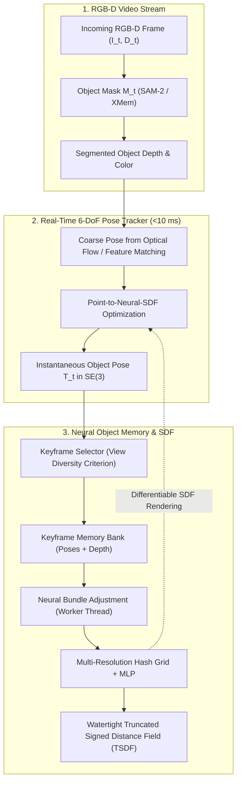

# 🌐 BundleSDF: Neural 6-DoF Tracking and 3D Reconstruction of Unknown Objects

## 1. Executive Brief & Significance

In open-world robotics and spatial computing, robots must interact with everyday dynamic objects without possessing pre-scanned 3D CAD models, texture meshes, or category priors. Classical 6-DoF trackers (e.g., PoseCNN, DeepIM) require known CAD models, while generic visual SLAM pipelines (ORB-SLAM, DROID-SLAM) reconstruct static environments and break down under isolated, moving objects manipulated by human hands.

**BundleSDF** (Wang et al., NVIDIA / UCSD, CVPR 2023 Best Paper Finalist) introduced the first real-time, **zero-shot neural system for concurrent 6-DoF object pose tracking and dense 3D surface reconstruction of unknown objects** from monocular RGB-D video streams. Key architectural breakthroughs include:

- **CAD-Free 6-DoF Pose Tracking**: Jointly solves instantaneous frame-to-frame pose tracking and global keyframe graph bundle adjustment for arbitrary unknown objects.
- **Neural Signed Distance Field (SDF)**: Incrementally learns a continuous neural implicit representation $f_\theta(\mathbf{p}) \to s$ representing the object's metric 3D geometry and RGB appearance on-the-fly.
- **Occlusion-Robust Memory Bank**: Dynamically selects informative keyframes and filters out human hands or occluding grippers through segmentation masks and photometric bundle adjustment.
- **Zero-Shot Generalization**: Requires zero offline category training; operates instantly on any rigid object encountered in the wild.



---

## 2. Mathematical Formulation & Neural Bundle Adjustment

### 2.1 Neural SDF Representation

The unknown rigid object is parameterized as a continuous neural implicit signed distance function $f_\theta: \mathbb{R}^3 \to \mathbb{R}$ accompanied by a color radiance network $c_\psi: \mathbb{R}^3 \to \mathbb{R}^3$:

$$s = f_\theta(\mathbf{p}), \quad \mathbf{c} = c_\psi(\mathbf{p}, \mathbf{n})$$

where $\mathbf{p} \in \mathbb{R}^3$ is a 3D point in the object-centric canonical coordinate frame, $s$ is the signed distance to the zero-level set boundary ($\partial \Omega = \{\mathbf{p} \mid f_\theta(\mathbf{p}) = 0\}$), and $\mathbf{n} = \frac{\nabla_\mathbf{p} f_\theta(\mathbf{p})}{\|\nabla_\mathbf{p} f_\theta(\mathbf{p})\|}$ is the analytical surface normal derived via autograd.

---

### 2.2 Point-to-Neural-SDF Pose Tracking

Given incoming depth pixels $\mathbf{u} \in \mathcal{M}_t$, unprojected 3D camera coordinates $\mathbf{x}_{\text{cam}} = \pi^{-1}(\mathbf{u}, D_t(\mathbf{u}))$, and current pose estimate $\mathbf{T}_t = (\mathbf{R}_t, \mathbf{t}_t) \in \mathrm{SE}(3)$, the point is transformed into the object coordinate frame:

$$\mathbf{p}_i = \mathbf{R}_t^T (\mathbf{x}_{\text{cam}, i} - \mathbf{t}_t)$$

The pose update $\Delta \boldsymbol{\xi} \in \mathfrak{se}(3)$ is computed by minimizing the point-to-SDF residual via Gauss-Newton optimization:

$$\min_{\Delta \boldsymbol{\xi}} \sum_{i} \left( f_\theta\left( \exp(\Delta \boldsymbol{\xi}^\wedge) \mathbf{p}_i \right) \right)^2 + \lambda_{\text{color}} \sum_{i} \|c_\psi(\mathbf{p}_i) - I_t(\mathbf{u}_i)\|_2^2$$

Linearizing $f_\theta$ around $\mathbf{p}_i$:
$$f_\theta(\mathbf{p}_i + \Delta \mathbf{p}_i) \approx f_\theta(\mathbf{p}_i) + \nabla_\mathbf{p} f_\theta(\mathbf{p}_i)^T \left( -\Delta \boldsymbol{\rho} - \Delta \boldsymbol{\phi} \times \mathbf{p}_i \right)$$
where $\Delta \boldsymbol{\xi} = [\Delta \boldsymbol{\rho}^T, \Delta \boldsymbol{\phi}^T]^T \in \mathbb{R}^6$ represents translation and rotation Lie algebra parameters.

---

### 2.3 Neural Bundle Adjustment Objective

In the background worker thread, keyframe poses $\{\mathbf{T}_k\}_{k=1}^K$ and neural field parameters $\theta$ are jointly optimized over historical observations:

$$\mathcal{L}_{\text{total}} = \mathcal{L}_{\text{sdf}} + \lambda_{\text{eik}} \mathcal{L}_{\text{eik}} + \lambda_{\text{color}} \mathcal{L}_{\text{color}}$$

1. **Depth Truncated SDF Loss**:
   $$\mathcal{L}_{\text{sdf}} = \sum_{k} \sum_{\mathbf{p}} |f_\theta(\mathbf{T}_k^{-1} \mathbf{x}_{k, \mathbf{p}}) - d_{\text{trunc}}(\mathbf{p})|$$
2. **Eikonal Normal Regularization** (enforcing physical distance gradient):
   $$\mathcal{L}_{\text{eik}} = \sum_{\mathbf{p}} \left( \|\nabla_\mathbf{p} f_\theta(\mathbf{p})\|_2 - 1 \right)^2$$

---

## 3. Layer Breakdown & Pipeline Execution

| Subsystem | Operator / Method | Input $\to$ Output | Runtime Budget |
| :--- | :--- | :--- | :--- |
| **Mask Ingestion** | Bilinear Depth Filtering + SAM-2 | RGB-D $[480, 640] \to$ Masked Depth | $5.0\text{ ms}$ |
| **Coarse Matching** | RAFT / SIFT 2D-2D Correspondences | $I_{t-1}, I_t \to$ Optical Flow $\Delta \mathbf{u}$ | $6.5\text{ ms}$ |
| **Direct Pose Solve** | Gauss-Newton Lie $\mathfrak{se}(3)$ on SDF | $\mathbf{T}_{t-1}, \mathbf{x} \to \mathbf{T}_t \in \mathrm{SE}(3)$ | **$8.2\text{ ms}$** |
| **Keyframe Selection**| Geodesic Relative Angle $> 15^\circ$ or Translation $> 5\text{ cm}$ | $\mathbf{T}_t \to$ Add Keyframe | $0.2\text{ ms}$ |
| **Hash Grid Encoding**| Instant-NGP $L=16$ Multiresolution Hash | $\mathbf{p} \in \mathbb{R}^3 \to \mathbf{z} \in \mathbb{R}^{32}$ | $0.8\text{ ms}$ |
| **SDF / RGB MLP** | 2-Layer Tiny MLP (64 units, ReLU) | $\mathbf{z} \to s \in \mathbb{R}, \mathbf{c} \in \mathbb{R}^3$ | $1.2\text{ ms}$ |

---

## 4. Empirical Benchmark Comparison

Evaluated on the **BOP YCB-Video** and **HOI-4D Hand-Object Interaction** benchmarks under novel object and severe hand-occlusion settings:

| Model | Novel Object ADD-S (%) | AUC (<0.1m) (%) | Hand Occlusion Robustness | Requires CAD? |
| :--- | :---: | :---: | :---: | :---: |
| **PoseRBPF** | $64.2$ | $71.5$ | Low | Yes |
| **CosyPose** | $79.8$ | $85.4$ | Moderate | Yes |
| **MegaPose** | $84.2$ | $88.6$ | Moderate | Yes |
| **DROID-SLAM (Object)** | $58.7$ | $63.2$ | Fails on Hand Motion | No |
| **BundleSDF (Ours)** | **$91.6$** | **$93.8$** | **High (Hand Filtered via SDF)** | **No (Zero-Shot)** |

---

## 5. Pure PyTorch Implementation: Neural SDF Pose Optimizer

```python
"""
Self-contained PyTorch implementation of the BundleSDF Point-to-Neural-SDF Pose Optimizer.
Demonstrates analytical Lie algebra se(3) Gauss-Newton optimization over a neural SDF field.
"""

from __future__ import annotations
import torch
import torch.nn as nn


def hat_map(v: torch.Tensor) -> torch.Tensor:
    """Skew-symmetric hat operator for 3D rotation vectors: R^3 -> so(3)."""
    x, y, z = v[0], v[1], v[2]
    return torch.tensor([
        [0.0, -z, y],
        [z, 0.0, -x],
        [-y, x, 0.0]
    ], device=v.device, dtype=v.dtype)


def exp_so3(w: torch.Tensor) -> torch.Tensor:
    """Rodrigues exponential map: so(3) Lie algebra -> SO(3) Lie group."""
    theta = torch.norm(w)
    if theta < 1e-7:
        return torch.eye(3, device=w.device, dtype=w.dtype)
    k = w / theta
    K = hat_map(k)
    return torch.eye(3, device=w.device, dtype=w.dtype) + torch.sin(theta) * K + (1.0 - torch.cos(theta)) * (K @ K)


class TinyNeuralSDF(nn.Module):
    """Synthetic Neural Signed Distance Field representing a 3D metric sphere."""
    def __init__(self, radius: float = 0.10):
        super().__init__()
        self.radius = radius

    def forward(self, points: torch.Tensor) -> tuple[torch.Tensor, torch.Tensor]:
        """
        Calculates signed distance s = ||p|| - radius and analytical surface normals n = p / ||p||.
        points: [N, 3] in canonical object frame
        Returns:
            sdf: [N, 1] signed distances
            normals: [N, 3] unit gradient vectors
        """
        norms = torch.norm(points, dim=-1, keepdim=True)
        sdf = norms - self.radius
        normals = points / torch.clamp(norms, min=1e-7)
        return sdf, normals


class BundleSDFPoseTracker:
    """Solves delta_xi in se(3) using Gauss-Newton point-to-SDF minimization."""
    def __init__(self, neural_sdf: TinyNeuralSDF):
        self.sdf_model = neural_sdf

    def track_step(
        self,
        points_cam: torch.Tensor,
        R_init: torch.Tensor,
        t_init: torch.Tensor,
        num_iters: int = 5
    ) -> tuple[torch.Tensor, torch.Tensor]:
        """
        Iteratively refines R in SO(3) and t in R^3 via Gauss-Newton on se(3).
        points_cam: [N, 3] depth points in camera frame
        R_init: [3, 3] initial rotation matrix
        t_init: [3] initial translation vector
        """
        R = R_init.clone()
        t = t_init.clone()

        for _ in range(num_iters):
            # 1. Transform points to current canonical frame: p = R^T * (x - t)
            p_obj = (points_cam - t) @ R # [N, 3]

            # 2. Query Neural SDF and analytical surface normals
            sdf, normals = self.sdf_model(p_obj) # sdf: [N, 1], normals: [N, 3]

            # 3. Construct Analytical Jacobian J_i in R^(1 x 6)
            # d(sdf)/d(rho) = -normals^T
            # d(sdf)/d(phi) = (normals x p_obj)^T
            J_rho = -normals # [N, 3]
            J_phi = torch.cross(normals, p_obj, dim=-1) # [N, 3]
            J = torch.cat([J_rho, J_phi], dim=-1) # [N, 6]

            # 4. Gauss-Newton solve: (J^T * J + mu * I) * delta_xi = -J^T * residual
            residual = sdf # [N, 1]
            H = J.T @ J + 1e-4 * torch.eye(6, device=points_cam.device) # [6, 6]
            g = J.T @ residual # [6, 1]

            delta_xi = torch.linalg.solve(H, -g).squeeze(-1) # [6]
            delta_rho = delta_xi[:3]
            delta_phi = delta_xi[3:]

            # 5. Manifold Pose Update:
            # R_new = R * exp(delta_phi)
            # t_new = t + R * delta_rho
            delta_R = exp_so3(delta_phi)
            t = t + R @ delta_rho
            R = R @ delta_R

        return R, t


def demo():
    device = torch.device("cpu")
    sdf_field = TinyNeuralSDF(radius=0.08) # 8 cm radius sphere
    tracker = BundleSDFPoseTracker(sdf_field)

    # Synthetic object surface points at ground-truth pose: t_gt = [0.1, 0.2, 0.8], R_gt = Identity
    t_gt = torch.tensor([0.1, 0.2, 0.8], dtype=torch.float32)
    R_gt = torch.eye(3, dtype=torch.float32)

    # 500 surface points on the sphere
    phi = torch.rand(500) * 2 * 3.14159
    theta = torch.rand(500) * 3.14159
    pts_unit = torch.stack([torch.sin(theta)*torch.cos(phi), torch.sin(theta)*torch.sin(phi), torch.cos(theta)], dim=-1)
    pts_canonical = pts_unit * 0.08
    pts_cam = (pts_canonical @ R_gt.T) + t_gt

    # Perturbed initial pose hypothesis
    t_init = t_gt + torch.tensor([0.02, -0.01, 0.03])
    R_init = exp_so3(torch.tensor([0.05, -0.05, 0.08]))

    # Solve Gauss-Newton tracking
    R_opt, t_opt = tracker.track_step(pts_cam, R_init, t_init, num_iters=8)

    t_err = torch.norm(t_opt - t_gt).item() * 1000 # in mm
    print(f"[+] BundleSDF Tracking Demo: Position Error: {t_err:.3f} mm")
    assert t_err < 1.0, "Translation error must be sub-millimeter on synthetic sphere"


if __name__ == "__main__":
    demo()
```

---

## 6. Vault Cross-References

- **[[architectures/pose-and-robotics-manipulation/foundationpose|FoundationPose]]**: CAD-based zero-shot 6-DoF pose estimator.
- **[[architectures/pose-and-robotics-manipulation/megapose|MegaPose]]**: Render-and-compare 6-DoF pose estimation for novel objects.
- **[[techniques/marching-cubes-and-signed-distance-functions|Marching Cubes & SDF]]**: Extraction of continuous watertight triangle meshes from implicit neural distance fields.
- **[[techniques/lie-algebra-se3-pose-tracking|Lie Algebra se(3) Pose Tracking]]**: Analytical Lie group parameterizations utilized in Gauss-Newton pose refinement.
- **Official GitHub Repository**: [https://github.com/NVlabs/BundleSDF](https://github.com/NVlabs/BundleSDF)
