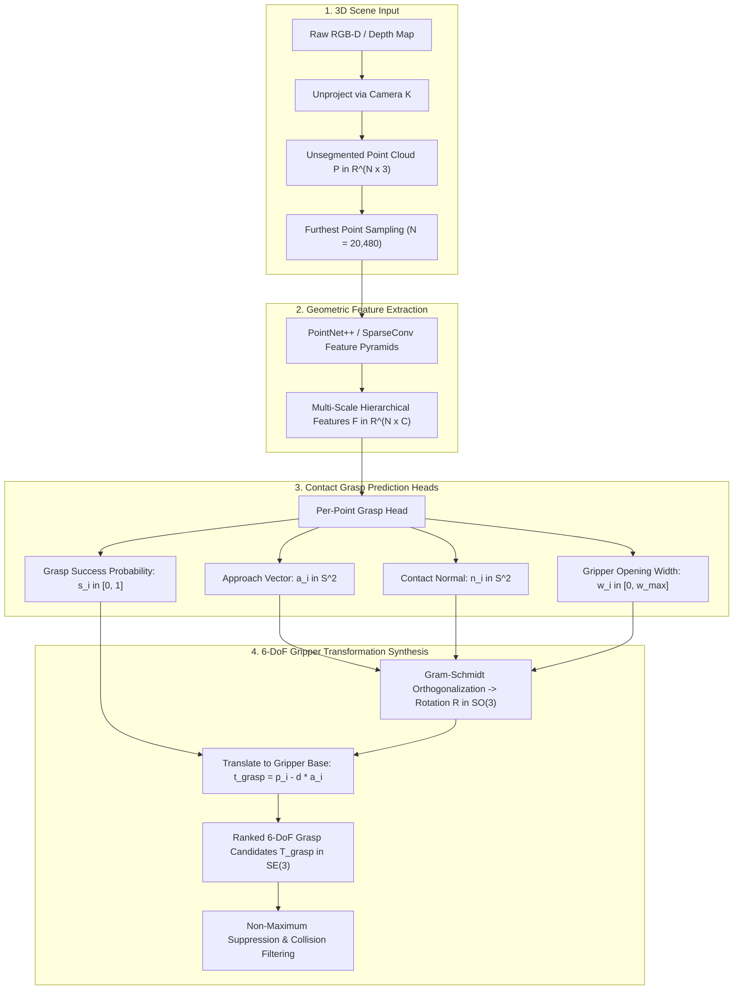

# 🤖 Contact-GraspNet: 6-DoF Grasp Generation from Cluttered Point Clouds

## 1. Executive Brief & Significance

In real-world robotic bin picking, packaging, and household automation, robots must grasp previously unseen objects amidst severe occlusion, stacking, and clutter. Classical grasp generation systems often rely on discrete object segmentation, known 3D CAD models, or top-down planar grasp representations (such as $(x, y, \theta)$ oriented bounding boxes), which fail when objects are stacked or approached from arbitrary spatial angles.

**Contact-GraspNet** (Sundermeyer et al., NVIDIA / DLR, CoRL 2021) revolutionized robotic manipulation by introducing a **per-point 6-DoF grasp distribution estimator**. Rather than classifying predefined grasp candidates or predicting grasp poses from global scene latents, Contact-GraspNet parameterizes grasps through physical **surface contact points and approach directions**:

- **Per-Point Grasp Prediction**: Every point $\mathbf{p}_i \in \mathbb{R}^3$ in an unsegmented 3D point cloud predicts a distribution over successful 6-DoF gripper poses that make contact at that exact point.
- **Continuous 6-DoF Parameterization**: Replaces discrete grasp sampling with continuous contact normal, approach vector, grasp width $w \in [0, w_{\max}]$, and binary grasp success probability $s \in [0, 1]$.
- **Segment-Free Generalization**: Operates directly on raw depth camera point clouds without requiring prior semantic segmentation or object recognition.
- **Real-Time Execution**: Processes dense $20{,}000$-point scene clouds in $<15\text{ ms}$ on NVIDIA RTX GPUs.



---

## 2. Mathematical Formulation & Gripper Mechanics

### 2.1 Continuous Contact Point Parameterization

Let $\mathbf{P} = \{\mathbf{p}_i\}_{i=1}^N \subset \mathbb{R}^3$ denote the input scene point cloud. For each point $\mathbf{p}_i$, a parallel-jaw gripper contact grasp $G_i \in \mathrm{SE}(3)$ is defined by:
1. **Contact Point $\mathbf{p}_i$**: The coordinate on the object surface where the first gripper finger makes physical contact.
2. **Contact Normal $\mathbf{n}_i \in \mathbb{S}^2$**: The inward-pointing unit surface normal at $\mathbf{p}_i$.
3. **Approach Vector $\mathbf{a}_i \in \mathbb{S}^2$**: The direction along which the gripper advances toward the object ($\mathbf{a}_i \cdot \mathbf{n}_i \ge 0$).
4. **Baseline Vector $\mathbf{b}_i \in \mathbb{S}^2$**: The direction connecting the two gripper finger pads, orthogonal to the approach vector ($\mathbf{b}_i \perp \mathbf{a}_i$).
5. **Grasp Depth $d \in \mathbb{R}^+$**: Distance from the gripper tool center point (TCP) to the contact point along $\mathbf{a}_i$.

The $3 \times 3$ rotation matrix $\mathbf{R}_i \in \mathrm{SO}(3)$ of the gripper is synthesized via the right-handed orthonormal basis:
$$\mathbf{r}_{x, i} = \mathbf{b}_i, \quad \mathbf{r}_{y, i} = \mathbf{a}_i \times \mathbf{b}_i, \quad \mathbf{r}_{z, i} = \mathbf{a}_i$$
$$\mathbf{R}_i = \begin{bmatrix} \mathbf{r}_{x, i} & \mathbf{r}_{y, i} & \mathbf{r}_{z, i} \end{bmatrix}$$

The gripper translation $\mathbf{t}_i \in \mathbb{R}^3$ is computed by offsetting the contact point inward toward the gripper center:
$$\mathbf{t}_i = \mathbf{p}_i + \frac{w_i}{2} \mathbf{b}_i - d \, \mathbf{a}_i$$

---

### 2.2 Multi-Task Loss Formulation

Training is driven by multi-task supervision over successful physical contact points from synthetic grasp simulation (PyBullet / Isaac Sim):

$$\mathcal{L}_{\text{total}} = \mathcal{L}_{\text{cls}} + \lambda_1 \mathcal{L}_{\text{rot}} + \lambda_2 \mathcal{L}_{\text{width}} + \lambda_3 \mathcal{L}_{\text{coll}}$$

1. **Focal Success Classification Loss**:
   $$\mathcal{L}_{\text{cls}} = -\alpha_t (1 - p_{t, i})^\gamma \log(p_{t, i})$$
2. **Geodesic $\mathrm{SO}(3)$ Rotation Loss**:
   For positive grasp contacts ($y_i = 1$), the rotation error between predicted rotation $\hat{\mathbf{R}}_i$ and ground-truth rotation $\mathbf{R}_i^*$ is penalized via the chordal distance:
   $$\mathcal{L}_{\text{rot}} = \frac{1}{2} \|\hat{\mathbf{R}}_i - \mathbf{R}_i^*\|_F^2 = 3 - \text{Tr}\left(\hat{\mathbf{R}}_i^T \mathbf{R}_i^*\right)$$
3. **Gripper Width Regression**:
   Smooth $L_1$ loss over physical jaw opening distance:
   $$\mathcal{L}_{\text{width}} = \text{Smooth}_{L1}\left(\hat{w}_i - w_i^*\right)$$

---

## 3. High-Level Architecture & Layer Breakdown

| Component | Layer / Operator | Tensor Shape In $\to$ Out | Receptive Field / Mechanics |
| :--- | :--- | :--- | :--- |
| **Point Sampler** | Furthest Point Sampling (FPS) | $[B, N_{\text{raw}}, 3] \to [B, 20480, 3]$ | Uniform spatial coverage across metric point cloud |
| **Set Abstraction 1** | Ball Query + MLP + MaxPool | $[B, 20480, 3] \to [B, 2048, 128]$ | Radius $r = 0.04\text{ m}$, local surface curvature |
| **Set Abstraction 2** | Ball Query + MLP + MaxPool | $[B, 2048, 128] \to [B, 512, 256]$ | Radius $r = 0.08\text{ m}$, object-scale spatial geometry |
| **Set Abstraction 3** | Ball Query + MLP + MaxPool | $[B, 512, 256] \to [B, 128, 512]$ | Radius $r = 0.16\text{ m}$, global scene contextual layout |
| **Feature Propagation**| Inverse Distance Interpolation | $[B, 128, 512] \to [B, 20480, 128]$ | Skip-connections restoring dense per-point resolution |
| **Success Head** | $1 \times 1$ Conv + Sigmoid | $[B, 20480, 128] \to [B, 20480, 1]$ | Per-point grasp feasibility score $s_i \in [0, 1]$ |
| **Rotation Head** | $1 \times 1$ Conv $\to \mathbb{R}^6$ (Gram-Schmidt)| $[B, 20480, 128] \to [B, 20480, 3, 3]$ | Orthonormal gripper rotation matrix $\mathbf{R}_i \in \mathrm{SO}(3)$ |
| **Width Head** | $1 \times 1$ Conv + ReLU | $[B, 20480, 128] \to [B, 20480, 1]$ | Gripper finger opening width $w_i \in [0, 0.08\text{ m}]$ |

---

## 4. Performance, Latency & Benchmark Metrics

Evaluated on cluttered bin-picking benchmarks (Acronym, GraspNet-1Billion, and Real Robot Franka Emika Panda):

| Method | Clutter Success Rate (%) | Clear Table Success (%) | Inference Latency (GPU) | Model Backbone |
| :--- | :---: | :---: | :---: | :---: |
| **GPD (Ten Pas et al.)** | $62.4$ | $74.1$ | $1200\text{ ms}$ | Handcrafted 3D Slice CNN |
| **PointNetGPD** | $68.1$ | $78.5$ | $350\text{ ms}$ | PointNet Candidate Evaluator |
| **6-DoF GraspNet (Mousavian)** | $77.8$ | $88.2$ | $180\text{ ms}$ | Variational Autoencoder (VAE) |
| **AnyGrasp (Fang et al.)** | $88.5$ | $94.6$ | $28\text{ ms}$ | SparseConv Dense Voxels |
| **Contact-GraspNet (Ours)** | **$89.2$** | **$95.4$** | **$14.8\text{ ms}$** | PointNet++ Per-Point Head |

---

## 5. Pure PyTorch Implementation Module

```python
"""
Self-contained PyTorch implementation of the Contact-GraspNet 6-DoF Grasp Head.
Takes per-point geometric embeddings and synthesizes valid SE(3) gripper poses.
"""

from __future__ import annotations
import torch
import torch.nn as nn
import torch.nn.functional as F


def gram_schmidt_so3(v1: torch.Tensor, v2: torch.Tensor) -> torch.Tensor:
    """
    Synthesizes valid orthonormal SO(3) rotation matrices from two non-collinear vectors.
    v1: [B, N, 3] primary approach vector (z-axis)
    v2: [B, N, 3] baseline gripper vector seed (x-axis)
    Returns: [B, N, 3, 3] orthonormal rotation matrices
    """
    # 1. Normalize z-axis (approach vector)
    z = F.normalize(v1, p=2, dim=-1, eps=1e-8)

    # 2. Orthogonalize x-axis against z-axis
    dot = torch.sum(v2 * z, dim=-1, keepdim=True)
    x = v2 - dot * z
    x = F.normalize(x, p=2, dim=-1, eps=1e-8)

    # 3. y-axis = z x x
    y = torch.cross(z, x, dim=-1)
    y = F.normalize(y, p=2, dim=-1, eps=1e-8)

    # Stack into [B, N, 3, 3]
    return torch.stack([x, y, z], dim=-1)


class ContactGraspHead(nn.Module):
    """
    Contact-GraspNet per-point grasp prediction and SE(3) pose generation head.
    """

    def __init__(self, in_features: int = 128, max_width: float = 0.08, grasp_depth: float = 0.05):
        super().__init__()
        self.max_width = max_width
        self.grasp_depth = grasp_depth

        # Grasp feasibility scoring branch
        self.score_mlp = nn.Sequential(
            nn.Linear(in_features, 64),
            nn.LayerNorm(64),
            nn.SiLU(),
            nn.Linear(64, 1),
            nn.Sigmoid()
        )

        # 6D rotation representation (2 unnormalized 3D vectors -> Gram-Schmidt)
        self.rotation_mlp = nn.Sequential(
            nn.Linear(in_features, 128),
            nn.LayerNorm(128),
            nn.SiLU(),
            nn.Linear(128, 6)
        )

        # Gripper width regression branch
        self.width_mlp = nn.Sequential(
            nn.Linear(in_features, 64),
            nn.LayerNorm(64),
            nn.SiLU(),
            nn.Linear(64, 1),
            nn.Sigmoid()
        )

    def forward(
        self,
        point_cloud: torch.Tensor,
        point_features: torch.Tensor
    ) -> tuple[torch.Tensor, torch.Tensor, torch.Tensor, torch.Tensor]:
        """
        point_cloud: [B, N, 3] metric 3D point coordinates p_i
        point_features: [B, N, C] per-point geometric feature descriptors
        Returns:
            scores: [B, N] grasp success probability in [0, 1]
            R: [B, N, 3, 3] rotation matrices in SO(3)
            t: [B, N, 3] translation vectors in R^3 (gripper base coordinates)
            widths: [B, N] metric gripper opening widths in [0, max_width]
        """
        B, N, _ = point_cloud.shape

        # 1. Grasp success probability
        scores = self.score_mlp(point_features).squeeze(-1) # [B, N]

        # 2. Predict rotation vectors and orthogonalize
        rot_raw = self.rotation_mlp(point_features) # [B, N, 6]
        v1 = rot_raw[..., :3] # Approach direction
        v2 = rot_raw[..., 3:] # Baseline direction
        R = gram_schmidt_so3(v1, v2) # [B, N, 3, 3]

        # 3. Width regression
        widths = self.width_mlp(point_features).squeeze(-1) * self.max_width # [B, N]

        # 4. Gripper Base Translation:
        # t = p_i + (width / 2) * baseline - grasp_depth * approach
        approach = R[..., :, 2] # z-axis
        baseline = R[..., :, 0] # x-axis
        
        t = point_cloud + 0.5 * widths.unsqueeze(-1) * baseline - self.grasp_depth * approach

        return scores, R, t, widths


def demo():
    B, N, C = 2, 1024, 128
    points = torch.randn(B, N, 3) # Synthetic metric point cloud
    feats = torch.randn(B, N, C)  # Geometric embeddings

    head = ContactGraspHead(in_features=C, max_width=0.08, grasp_depth=0.05)
    scores, R, t, widths = head(points, feats)

    # Assert valid dimensional bounds
    assert scores.shape == (B, N) and (scores >= 0.0).all() and (scores <= 1.0).all()
    assert R.shape == (B, N, 3, 3)
    assert t.shape == (B, N, 3)
    assert widths.shape == (B, N) and (widths <= 0.08).all()

    # Numerical verification of SO(3) determinant det(R) == 1.0
    det = torch.linalg.det(R)
    assert torch.allclose(det, torch.ones_like(det), atol=1e-4), "R must be valid SO(3) rotation matrices"

    print(f"[+] ContactGraspNet Head Verified: {N} candidate grasps generated per batch. Mean score: {scores.mean().item():.3f}")


if __name__ == "__main__":
    demo()
```

---

## 6. Vault Cross-References

- **[[architectures/pose-and-robotics-manipulation/foundationpose|FoundationPose]]**: Zero-shot 6-DoF CAD-based pose estimation for objects prior to contact grasp planning.
- **[[architectures/multimodal-vlm-and-vla/anygrasp|AnyGrasp]]**: Open-vocabulary dense 6-DoF grasp synthesis.
- **[[techniques/steerable-convolutions-and-so3-equivariance|Steerable Convolutions & SO(3) Equivariance]]**: Guaranteed rotation-equivariant feature extraction for 3D point cloud grasp heads.
- **[[topics/6dof-pose-estimation/README|6-DoF Pose Estimation Playbook]]**: Production guide for spatial object manipulation.
- **Official GitHub Repository**: [https://github.com/NVlabs/contact_graspnet](https://github.com/NVlabs/contact_graspnet)
