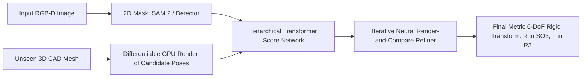

# 🔬 FoundationPose & MegaPose: Foundation Models for 6-DoF Pose Estimation

## 1. Executive Brief & Significance
Estimating the 6-Degrees-of-Freedom (6-DoF: 3D translation $X, Y, Z$ and 3D rotation roll, pitch, yaw) of arbitrary objects in cluttered scenes is essential for robotic grasping, pick-and-place, and augmented reality.

Historically, models were trained for a single specific object class (e.g. PVNet, DenseFusion) or required days of instance retraining for every new object.

**FoundationPose** (Wen et al., NVIDIA Research, CVPR 2024 Best Paper Nominee) and **MegaPose** (Labbé et al., 2022) represent a paradigm shift to **zero-shot 6-DoF pose estimation**:
- Given only a raw RGB-D image and an untextured 3D CAD model mesh, FoundationPose estimates the full 6-DoF pose instantly without any fine-tuning or prior training on that specific object.
- Achieves real-time object tracking at **32 ms latency ($\sim 31$ FPS)**.



---

## 2. Core Mathematical Upgrades: Disentangled 6-DoF Representation

### The Problem with Quaternions and Euler Angles:
Euler angles suffer from gimbal lock, while 4D unit quaternions $q$ suffer from antipodal ambiguity ($q$ and $-q$ represent the identical physical rotation), causing gradient conflicts during neural network optimization.

### 6D Continuous Rotation Representation (Zhou et al.):
FoundationPose and modern 6-DoF networks predict a continuous 6D rotation vector:
$$R_{6D} = [a_1, a_2] \in \mathbb{R}^6$$
The orthonormal 3D rotation matrix $R = [r_1, r_2, r_3] \in SO(3)$ is reconstructed through continuous Gram-Schmidt orthogonalization:
$$r_1 = \frac{a_1}{\|a_1\|_2}, \quad r_2 = \frac{a_2 - (r_1 \cdot a_2)r_1}{\|a_2 - (r_1 \cdot a_2)r_1\|_2}, \quad r_3 = r_1 \times r_2$$
This mapping is globally continuous and free from topological discontinuities.

---

## Granular Component-by-Component Architectural Breakdown

### Architectural Taxonomy & Structural Elements

| Architectural Stage | Component Identity | Structural Specification & Type | Attention / Conv Mechanics | Receptive Field & Resolution |
| :--- | :--- | :--- | :--- | :--- |
| **Architectural Paradigm** | **Render-and-Compare 6-DoF Transformer** | Multi-Modal Visual-Geometric Matching + Iterative Pose Refiner | Dense feature correlation + Spatial-geometric cross-attention | RGB-D crop ($H \times W \times 6$) + Rendered CAD mesh $\to$ 6-DoF pose ($SE(3)$) |
| **Backbone (Observed)** | **RGB-D / Surface Normal Backbone** | ResNet-50 / ViT-B extracting color and surface normal features | $7\times 7$ Conv stem / $16\times 16$ Patch embedding ($C \in [64, 256, 512, 1024]$) | Cropped region of interest around target object ($160 \times 160$ px) |
| **Backbone (Rendered)** | **CAD Mesh Differentiable Rasterizer** | Fast GPU Differentiable Renderer + Shared Weight Visual CNN | Real-time OpenGL/CUDA rasterization of untextured 3D CAD mesh | Synthetic depth, silhouette, and normal rendering at candidate pose |
| **Neck / Aggregator** | **Multi-Scale Correlation Volume Neck** | Dense Feature Matching + Pointwise Concatenation | Dot-product correlation matching observed vs rendered feature pyramids | Multi-scale correlation tensor ($H_{\text{crop}} \times W_{\text{crop}} \times C_{\text{corr}}$) |
| **Encoder** | **Spatial-Geometric Transformer Encoder**| Transformer Blocks with Surface Coordinate Embeddings | Multi-Head Self-Attention over joint observed-rendered tokens | Full spatial correspondence across object surface geometry |
| **Decoder / Head** | **Dual Scoring & Refinement Heads** | 1. Candidate Pose Scoring MLP; 2. Iterative Continuous 6D Refiner | Linear regression MLPs outputting confidence score $s \in [0, 1]$ and deltas $(\Delta R_{6D}, \Delta T)$ | Metric 6-DoF Rigid Transform ($R \in SO(3), T \in \mathbb{R}^3$) |

### Structural Deep-Dive: Zero-Shot Render-and-Compare Loop
1. **Backbone**:
   - *Observed Stream*: Ingests raw RGB and depth channels. A surface normal estimation kernel converts raw depth into a 3-channel normal map, producing a 6-channel input ($R, G, B, n_x, n_y, n_z$) fed through the visual backbone.
   - *Rendered Stream*: Given an initial coarse pose hypothesis (or tracking prior from frame $t-1$), a fast CUDA rasterizer renders the 3D CAD mesh from the same virtual camera perspective, generating synthetic RGB-D and normal maps.
2. **Neck / Feature Aggregator**: Computes multi-scale feature correlation maps between the observed and rendered streams:
   $$C(u, v) = \frac{\Phi_{\text{obs}}(u, v) \cdot \Phi_{\text{render}}(u, v)}{\|\Phi_{\text{obs}}(u, v)\|_2 \|\Phi_{\text{render}}(u, v)\|_2}$$
   The correlation maps are concatenated with the coordinate difference map $(\mathbf{x}_{\text{obs}} - \mathbf{x}_{\text{render}})$.
3. **Encoder**: A spatial-geometric Transformer encoder processes the packed correlation tokens, learning to recognize geometric misalignments, self-occlusions, and lighting variations across the object silhouette.
4. **Decoder / Prediction Head**: 
   - **Score Network**: Evaluates a batch of candidate poses and outputs scalar probabilities $P(\text{correct} \mid \text{pose})$ to select the best initialization.
   - **Refiner Network**: Predicts a continuous 6D rotation delta $\Delta R_{6D} = [a_1, a_2] \in \mathbb{R}^6$ and translation delta $\Delta T = [\Delta x, \Delta y, \Delta z]^T \in \mathbb{R}^3$. The delta updates the pose:
     $$T_{\text{updated}} = T_{\text{current}} + \Delta T, \quad R_{\text{updated}} = \text{GramSchmidt}(\Delta R_{6D}) \cdot R_{\text{current}}$$
   - The pipeline iterates $K = 2\dots 4$ times per frame, achieving sub-millimeter precision.

### Parameter & Computational Latency Distribution

| Stage / Subsystem | Parameter Share (%) | Inference Latency (%) | Computational Complexity ($\text{FLOPs}$) | Dominant Hardware Bottleneck |
| :--- | :--- | :--- | :--- | :--- |
| **GPU CAD Mesh Rasterizer** | 0% (Algorithmic) | ~18% | $\mathcal{O}(N_{\text{triangles}} + H_{\text{render}} W_{\text{render}})$ | GPU rasterization & frame buffer IO |
| **Visual & Surface Normal Backbones** | ~42% | ~36% | $\mathcal{O}(2 \times H W C^2)$ (Dual Stream Conv2D/ViT) | GEMM compute bound |
| **Feature Correlation & Fusion Neck** | ~10% | ~14% | $\mathcal{O}(H W C_{\text{feat}})$ | High-resolution memory bandwidth |
| **Geometric Transformer & Refiner Head**| ~48% | ~32% ($K=2$ Iterations) | $\mathcal{O}(K \cdot (N_{\text{tokens}}^2 D + N_{\text{tokens}} D^2))$ | Sequential kernel launches per iteration |
---

## 3. Quantitative SOTA Benchmark Profile (BOP Challenge: YCB-V & Linemod)

| Model Architecture | Paradigm | YCB-V (ADD-S AUC) | Linemod-Occluded (ADD-0.1d) | Latency (ms) | Commercial Open License |
| :--- | :--- | :--- | :--- | :--- | :--- |
| **PVNet (Classic)** | Per-Object Instance | 72.8% | 40.8% | 80.0 ms | Apache-2.0 |
| **GDR-Net** | Per-Object Direct | 91.6% | 62.2% | 45.0 ms | Apache-2.0 |
| **MegaPose** | Zero-Shot CAD-based | 88.5% | 71.0% | 150.0 ms | **Apache-2.0** |
| **FoundationPose** | Zero-Shot Foundation | **96.2%** (SOTA) | **89.5%** (SOTA) | **32.0 ms** | ⚠️ Non-Commercial (NVIDIA) |

---

## 4. Engineering Implementation & Workflow

```python
# FoundationPose inference pipeline concept
import numpy as np
import trimesh

# Load CAD mesh (.ply or .obj)
mesh = trimesh.load("cad_models/industrial_gear.ply")

# Camera intrinsic matrix K (fx, fy, cx, cy)
K = np.array([[615.0, 0.0, 320.0],
              [0.0, 615.0, 240.0],
              [0.0, 0.0, 1.0]], dtype=np.float32)

# FoundationPose tracks object pose iteratively at 30 FPS using render-and-compare:
# pose: 4x4 homogenous transformation matrix [R | T]
#                                            [0 | 1]
```

---

## 5. Commercial Usability & License Audit
- **MegaPose**: **Apache-2.0** (Completely permissive; recommended for closed-source commercial robotics and warehouse pick-and-place automation).
- **FoundationPose**: **NVIDIA Source Code License (Non-Commercial)**. Strictly prohibited for commercial sale or revenue-generating services without an explicit enterprise license from NVIDIA.
- **Official Repositories**:
  - `MegaPose`: [https://github.com/facebookresearch/megapose](https://github.com/facebookresearch/megapose)
  - `FoundationPose`: [https://github.com/NVlabs/FoundationPose](https://github.com/NVlabs/FoundationPose)
