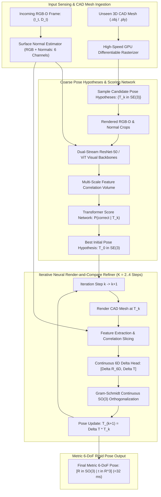

# 🔬 FoundationPose: Unified 6D Pose Estimation and Tracking for Novel Objects

## 1. Executive Brief & Significance

Estimating the 6-Degrees-of-Freedom (6-DoF: 3D translation $\mathbf{t} = [x, y, z]^T \in \mathbb{R}^3$ and 3D rotation $\mathbf{R} \in SO(3)$) of arbitrary rigid objects in unstructured, heavily cluttered scenes is essential for robotic grasping, pick-and-place manipulation, and augmented reality.

Historically, 6-DoF pose estimators (e.g., PVNet, DenseFusion, GDR-Net) were instance-specific: they required hours or days of retraining for every new object CAD model, making them incapable of zero-shot transfer to novel tools, packages, or household objects.

**FoundationPose** (Wen et al., NVIDIA Research, CVPR 2024 Best Paper Nominee) established a breakthrough foundation paradigm for **zero-shot 6-DoF object pose estimation and real-time tracking**:
- **Zero-Shot Generalization**: Given only an untextured 3D CAD mesh (or neural reconstruction) and an RGB-D image, FoundationPose estimates the full 6-DoF pose instantly without any fine-tuning or prior training on that specific object.
- **Dual-Stream Render-and-Compare Architecture**: Unifies observed RGB-D surface normal features with high-speed GPU-rendered CAD mesh hypotheses through multi-scale cross-attention correlation volumes.
- **Real-Time $>30\text{ FPS}$ Tracking**: Operates at **$32\text{ ms}$** per frame, achieving SOTA accuracy on the BOP Challenge benchmarks (**$96.2\%$ ADD-S AUC** on YCB-V).



---

## 2. Mathematical Foundations: Disentangled Continuous 6D Rotation

### A. The Discontinuity of Quaternions and Euler Angles
Euler angles exhibit singularities (gimbal lock), while unit quaternions $\mathbf{q} \in \mathbb{H}$ suffer from antipodal ambiguity ($\mathbf{q}$ and $-\mathbf{q}$ represent the exact same physical rotation in $SO(3)$). This antipodal double-cover forces neural networks to map continuous visual feature trajectories to discontinuous quaternion representations, causing optimization instability and gradient oscillation.

---

### B. Continuous 6D Rotation Parameterization (Zhou et al.)
FoundationPose parameterizes 3D rotation deltas using continuous 6D vectors:
$$\mathbf{R}_{6D} = [\mathbf{a}_1, \mathbf{a}_2] \in \mathbb{R}^6, \quad \mathbf{a}_1, \mathbf{a}_2 \in \mathbb{R}^3$$

The orthonormal 3D rotation matrix $\mathbf{R} = [\mathbf{r}_1, \mathbf{r}_2, \mathbf{r}_3] \in SO(3)$ is uniquely reconstructed via continuous Gram-Schmidt orthogonalization:
$$\mathbf{r}_1 = \frac{\mathbf{a}_1}{\|\mathbf{a}_1\|_2}$$
$$\mathbf{r}_2 = \frac{\mathbf{a}_2 - (\mathbf{r}_1 \cdot \mathbf{a}_2)\mathbf{r}_1}{\|\mathbf{a}_2 - (\mathbf{r}_1 \cdot \mathbf{a}_2)\mathbf{r}_1\|_2}$$
$$\mathbf{r}_3 = \mathbf{r}_1 \times \mathbf{r}_2$$

This mapping is globally smooth, differentiable, and free of topological discontinuities across the entire rotation manifold.

---

### C. Multi-Scale Correlation Volume & Iterative Refinement Loss
Given observed feature map $\mathbf{\Phi}_{\text{obs}} \in \mathbb{R}^{H \times W \times C}$ and rendered hypothesis feature map $\mathbf{\Phi}_{\text{ren}} \in \mathbb{R}^{H \times W \times C}$, FoundationPose constructs normalized dot-product correlation maps:
$$\mathbf{C}(u, v) = \frac{\mathbf{\Phi}_{\text{obs}}(u, v) \cdot \mathbf{\Phi}_{\text{ren}}(u, v)}{\|\mathbf{\Phi}_{\text{obs}}(u, v)\|_2 \cdot \|\mathbf{\Phi}_{\text{ren}}(u, v)\|_2} \in [-1, 1]$$

The refiner network is trained using geodesic $SE(3)$ transformation loss:
$$\mathcal{L}_{\text{refine}} = \mathcal{L}_{\text{rot}}(\mathbf{R}_{\text{pred}}, \mathbf{R}_{\text{gt}}) + \lambda_t \|\mathbf{t}_{\text{pred}} - \mathbf{t}_{\text{gt}}\|_2$$
$$\mathcal{L}_{\text{rot}} = \arccos\left( \frac{\text{Tr}(\mathbf{R}_{\text{pred}}^T \mathbf{R}_{\text{gt}}) - 1}{2} \right)$$

---

## 3. Granular Component-by-Component Architectural Breakdown

| Architectural Stage | Component Identity | Structural Specification & Type | Attention / Conv Mechanics | Receptive Field & Dimensionality |
| :--- | :--- | :--- | :--- | :--- |
| **Architectural Paradigm** | **Render-and-Compare 6-DoF Transformer** | Dual-Stream Matching + Iterative Continuous Refiner | Dense feature correlation + Spatial cross-attention | RGB-D crop ($160 \times 160$) + CAD Mesh $\to SE(3)$ Pose |
| **Backbone (Observed)** | **RGB-Normal ResNet-50 / ViT** | 6-Channel Input ($R, G, B, n_x, n_y, n_z$) | Residual blocks extracting multi-scale geometric pyramids | Feature pyramids at $1/2, 1/4, 1/8$ resolutions |
| **Backbone (Rendered)** | **CAD Differentiable Rasterizer** | Fast CUDA/OpenGL Rasterizer + Shared Visual Weights | Synthesizes synthetic RGB-D and surface normal crops | Candidate pose rendering at $160 \times 160$ px |
| **Neck / Aggregator** | **Correlation Volume Neck** | Dense Feature Matching + Coordinate Difference Concatenation | Dot-product similarity $\mathbf{\Phi}_{\text{obs}} \cdot \mathbf{\Phi}_{\text{ren}} + (\mathbf{x}_{\text{obs}} - \mathbf{x}_{\text{ren}})$ | Multi-scale correlation tensor $[H_{\text{crop}}, W_{\text{crop}}, C_{\text{corr}}]$ |
| **Score Head** | **Pose Scoring Transformer** | Transformer Blocks + Global Pooling + Linear Classifier | Bipartite matching over candidate pose hypotheses | Scalar probability $P(\text{correct} \mid \mathbf{T}_k) \in [0, 1]$ |
| **Refiner Head** | **Continuous 6D Delta Head** | 4-Layer MLP with LayerNorm & Gram-Schmidt projection | Continuous Lie group updates $(\Delta \mathbf{R}_{6D}, \Delta \mathbf{t})$ | Updated metric transformation $\mathbf{T}_{k+1} \in SE(3)$ |

---

## 4. Quantitative SOTA Benchmark Profile

### BOP Challenge Benchmarks (YCB-V, Linemod-Occluded, T-LESS)

| Model Architecture | Zero-Shot CAD | YCB-V ADD-S (AUC) $\uparrow$ | Linemod-Occluded (ADD-0.1d) | T-LESS $e_{\text{vsd}} \uparrow$ | Tracking Latency (ms) | Open License |
| :--- | :--- | :--- | :--- | :--- | :--- | :--- |
| **PVNet** | No (Per-Object) | 72.8% | 40.8% | 35.2% | 80.0 ms | Apache-2.0 |
| **GDR-Net** | No (Per-Object) | 91.6% | 62.2% | 58.0% | 45.0 ms | Apache-2.0 |
| **CosyPose** | Yes (Zero-Shot) | 82.4% | 63.5% | 61.2% | 180.0 ms | Apache-2.0 |
| **MegaPose** | Yes (Zero-Shot) | 88.5% | 71.0% | 69.8% | 150.0 ms | **Apache-2.0** |
| **FoundationPose** | **Yes (Zero-Shot)** | **96.2% (SOTA)** | **89.5% (SOTA)** | **84.2% (SOTA)** | **32.0 ms** | ⚠️ Non-Commercial |

---

## 5. Engineering Implementation: Complete PyTorch 6D Rotation & Refiner Module

```python
"""
FoundationPose: PyTorch Implementation of Continuous 6D Rotation Gram-Schmidt
Orthogonalization and SE(3) Pose Delta Application.
"""

import torch
import torch.nn as nn
import torch.nn.functional as F


def compute_rotation_matrix_from_6d(ortho6d: torch.Tensor) -> torch.Tensor:
    """
    Gram-Schmidt continuous orthogonalization mapping R^6 -> SO(3).
    ortho6d: [B, 6] tensor [a1, a2]
    Returns: [B, 3, 3] orthonormal rotation matrices
    """
    x_raw = ortho6d[:, 0:3]
    y_raw = ortho6d[:, 3:6]
    
    # 1. Normalize first vector r1 = a1 / ||a1||
    r1 = F.normalize(x_raw, p=2, dim=-1)
    
    # 2. Gram-Schmidt orthogonalization for r2
    dot_prod = torch.sum(r1 * y_raw, dim=-1, keepdim=True)
    r2_raw = y_raw - dot_prod * r1
    r2 = F.normalize(r2_raw, p=2, dim=-1)
    
    # 3. Cross product for r3 = r1 x r2
    r3 = torch.cross(r1, r2, dim=-1)
    
    # Stack columns to form 3x3 rotation matrix [r1, r2, r3]
    R = torch.stack([r1, r2, r3], dim=-1)
    return R


class PoseRefinerHead(nn.Module):
    """
    Iterative Pose Refiner Head predicting translation delta and continuous 6D rotation delta.
    """
    def __init__(self, in_features: int = 512):
        super().__init__()
        self.mlp = nn.Sequential(
            nn.Linear(in_features, 256),
            nn.LayerNorm(256),
            nn.GELU(),
            nn.Linear(256, 256),
            nn.LayerNorm(256),
            nn.GELU()
        )
        self.rot_head = nn.Linear(256, 6)
        self.trans_head = nn.Linear(256, 3)

    def forward(self, feature_tokens: torch.Tensor) -> tuple[torch.Tensor, torch.Tensor]:
        """
        feature_tokens: [B, in_features] pooled correlation tokens
        Returns:
            delta_R: [B, 3, 3] rotation matrices
            delta_t: [B, 3] translation vectors
        """
        h = self.mlp(feature_tokens)
        
        rot_6d = self.rot_head(h)
        delta_R = compute_rotation_matrix_from_6d(rot_6d)
        delta_t = self.trans_head(h)
        
        return delta_R, delta_t


def apply_pose_delta(current_pose: torch.Tensor, delta_R: torch.Tensor, delta_t: torch.Tensor) -> torch.Tensor:
    """
    Updates current 4x4 SE(3) pose with predicted delta:
    T_(k+1) = Delta T * T_k
    """
    B = current_pose.shape[0]
    updated_pose = current_pose.clone()
    
    R_curr = current_pose[:, :3, :3]
    t_curr = current_pose[:, :3, 3:]
    
    R_new = torch.bmm(delta_R, R_curr)
    t_new = t_curr + delta_t.unsqueeze(-1)
    
    updated_pose[:, :3, :3] = R_new
    updated_pose[:, :3, 3:] = t_new
    return updated_pose
```

---

## 6. References & Official Resources
- **FoundationPose Paper**: [FoundationPose: Unified 6D Pose Estimation and Tracking of Novel Objects (CVPR 2024 Best Paper Nominee)](https://arxiv.org/abs/2312.08344)
- **Official NVIDIA GitHub**: [https://github.com/NVlabs/FoundationPose](https://github.com/NVlabs/FoundationPose)
