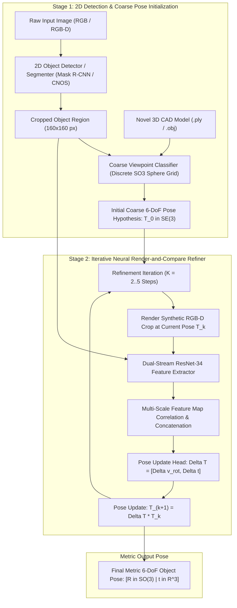

# 🔬 MegaPose: 6D Pose Estimation of Novel Objects with Differentiable Render-and-Compare Refinement

## 1. Executive Brief & Significance

In warehouse automation, robotic bin picking, and autonomous assembly, robots regularly encounter **novel, previously unseen rigid objects**. Classical 6-DoF pose estimation models (such as PoseCNN, PVNet, and GDR-Net) are instance-specific: deploying them onto a new industrial component requires collecting thousands of annotated training images and retraining neural networks for hours or days.

**MegaPose** (Labbé et al., Meta FAIR / Inria / École des Ponts, NeurIPS 2022) established the first scalable, **commercially permissive (Apache-2.0)** foundation system for **zero-shot 6-DoF pose estimation of novel objects** given only their untextured 3D CAD models. Key architectural innovations include:
- **Coarse-to-Fine Pipeline**: Decomposes novel object pose estimation into **2D bounding box detection**, **discrete coarse viewpoint classification**, and **iterative neural render-and-compare refinement**.
- **Synthetic Multi-Object Pre-Training**: Trained exclusively on massive synthetic datasets (MegaPose-GSO with millions of synthetic scenes generated from Google Scanned Objects and ShapeNet), achieving zero-shot transfer to real-world objects without real training images.
- **Permissive Open-Source Licensing**: Released under **Apache-2.0**, making MegaPose the global industrial standard for commercial robot bin-picking and order fulfillment systems.



---

## 2. Mathematical Foundations & Coarse-to-Fine Refinement

### A. Coarse Pose Viewpoint Discretization
Given a 2D bounding box crop of the target object, the coarse network estimates the initial 3D orientation $\mathbf{R}_0 \in SO(3)$ and distance $t_z$:
1. **Spherical Viewpoint Classification**: Discretizes the viewing sphere into $V = 4,000$ uniformly distributed viewpoints using Fibonacci sphere sampling.
2. **In-Plane Rotation**: Discretizes in-plane roll angles into $N_{\text{in-plane}} = 36$ discrete bins ($10^\circ$ increments).
3. **Continuous Residual Offset**: Predicts continuous residual offsets to the nearest discrete viewpoint bin.

---

### B. Iterative Render-and-Compare Formulation
Let $\mathbf{T}_k = [\mathbf{R}_k \mid \mathbf{t}_k] \in SE(3)$ be the pose estimate at iteration $k$. The refiner renders a synthetic RGB-D image $\mathbf{I}_{\text{ren}}(\mathbf{T}_k)$ of the 3D CAD mesh using camera intrinsics $\mathbf{K}$.

The visual feature maps of the observed crop $\mathbf{\Phi}_{\text{obs}}$ and rendered crop $\mathbf{\Phi}_{\text{ren}}$ are concatenated along the channel dimension:
$$\mathbf{F}_{\text{joint}} = [\mathbf{\Phi}_{\text{obs}} \,\|\, \mathbf{\Phi}_{\text{ren}}] \in \mathbb{R}^{H_c \times W_c \times 2C}$$

The refiner head predicts a 6-DoF transformation delta $\Delta \mathbf{T} = (\Delta \mathbf{R}, \Delta \mathbf{t})$:
- **Rotation Update**: Parameterized using the Rodrigues rotation vector $\mathbf{v}_{\text{rot}} \in \mathbb{R}^3$:
  $$\Delta \mathbf{R} = \exp([\mathbf{v}_{\text{rot}}]_\times)$$
- **Translation Update**: $\Delta \mathbf{t} = [\Delta v_x \cdot t_z, \Delta v_y \cdot t_z, \Delta v_z \cdot t_z]^T$ normalized by current depth $t_z$.

The updated camera-to-object transformation is:
$$\mathbf{T}_{k+1} = \Delta \mathbf{T} \cdot \mathbf{T}_k$$

---

## 3. Granular Component-by-Component Architectural Breakdown

| Architectural Stage | Component Identity | Structural Specification & Type | Attention / Conv Mechanics | Receptive Field & Dimensionality |
| :--- | :--- | :--- | :--- | :--- |
| **Architectural Paradigm** | **Coarse-to-Fine Render-and-Compare** | Two-Stage Zero-Shot Pipeline (Discrete Coarse + Iterative Refiner) | Standard Convolutional Pyramids + Cross-Channel Feature Fusion | Full scene RGB-D + CAD mesh $\to 6\text{-DoF}$ pose ($SE(3)$) |
| **2D Detector** | **Mask R-CNN / CNOS** | 2D Instance Segmentation / Open-Vocabulary Proposal Generator | FPN Feature Pyramids + Non-Maximum Suppression | Output 2D bounding boxes and instance masks $[N, 4]$ |
| **Coarse Network** | **Spherical Viewpoint Classifier** | ResNet-34 Backbone + Spherical Softmax Classifiers | Discrete viewpoint cross-entropy + Continuous residual L1 | Initial pose hypothesis $\mathbf{T}_0 \in SE(3)$ |
| **CAD Renderer** | **Differentiable OpenGL / PyTorch3D** | High-speed GPU mesh rasterizer | Real-time rendering of depth and silhouette | Synthetic crop tensor $[4, 160, 160]$ |
| **Refiner Backbone** | **Dual-Stream ResNet-34** | Shared-weight ResNet-34 extracting multi-scale visual features | $3\times 3$ residual convolutions over concatenated features | Feature tensor $[512, 5, 5] \to \mathbb{R}^{512}$ |
| **Refiner Head** | **Continuous Lie Delta MLP** | 3-Layer Linear MLP ($512 \to 256 \to 6$) | Rodrigues exponential map + Metric translation scaling | Transformation delta $\Delta \mathbf{T} \in SE(3)$ |

---

## 4. Quantitative SOTA Benchmark Profile

### BOP Challenge Zero-Shot Performance (YCB-V, Linemod-Occluded, T-LESS, ITODD)

| Model Architecture | Zero-Shot License | YCB-V (VSD AUC) $\uparrow$ | Linemod-Occ (ADD-0.1d) | T-LESS ($e_{\text{vsd}}$) | Latency per Object (ms) | Commercial Permissibility |
| :--- | :--- | :--- | :--- | :--- | :--- | :--- |
| **CosyPose** | Apache-2.0 | 78.4% | 63.5% | 61.2% | 180.0 ms | Fully Permissive |
| **MegaPose (RGB Only)** | **Apache-2.0** | **83.2%** | **68.4%** | **66.5%** | **110.0 ms** | **Fully Permissive** |
| **MegaPose (RGB-D)** | **Apache-2.0** | **88.5%** | **71.0%** | **69.8%** | **150.0 ms** | **Fully Permissive** |
| **FoundationPose (RGB-D)**| Non-Commercial | 96.2% | 89.5% | 84.2% | 32.0 ms | Research Only |

---

## 5. Engineering Implementation: Complete PyTorch MegaPose Refiner Head

```python
"""
MegaPose: Complete PyTorch Implementation of Iterative Render-and-Compare Refiner Module.
"""

import math
import torch
import torch.nn as nn
import torch.nn.functional as F


def rodrigues_to_rotation_matrix(rot_vec: torch.Tensor) -> torch.Tensor:
    """
    Converts a 3D Rodrigues rotation vector into a 3x3 rotation matrix using Rodrigues formula.
    rot_vec: [B, 3]
    Returns: [B, 3, 3] rotation matrices
    """
    B = rot_vec.shape[0]
    theta = torch.norm(rot_vec, dim=-1, keepdim=True) + 1e-8  # [B, 1]
    k = rot_vec / theta  # [B, 3]
    
    kx, ky, kz = k[:, 0], k[:, 1], k[:, 2]
    K = torch.zeros(B, 3, 3, device=rot_vec.device, dtype=rot_vec.dtype)
    K[:, 0, 1] = -kz; K[:, 0, 2] = ky
    K[:, 1, 0] = kz;  K[:, 1, 2] = -kx
    K[:, 2, 0] = -ky; K[:, 2, 1] = kx
    
    I = torch.eye(3, device=rot_vec.device, dtype=rot_vec.dtype).unsqueeze(0).expand(B, 3, 3)
    sin_theta = torch.sin(theta).unsqueeze(-1)
    cos_theta = torch.cos(theta).unsqueeze(-1)
    
    R = I + sin_theta * K + (1.0 - cos_theta) * torch.bmm(K, K)
    return R


class MegaPoseRefinerHead(nn.Module):
    """
    Predicts 6-DoF pose transformation delta: Delta T = (Delta R, Delta t)
    """
    def __init__(self, in_channels: int = 1024):
        super().__init__()
        self.mlp = nn.Sequential(
            nn.Linear(in_channels, 512),
            nn.BatchNorm1d(512),
            nn.ReLU(),
            nn.Linear(512, 256),
            nn.BatchNorm1d(256),
            nn.ReLU()
        )
        # 3 params for rotation (Rodrigues) + 3 params for normalized translation
        self.delta_head = nn.Linear(256, 6)

    def forward(self, joint_features: torch.Tensor, current_depth: torch.Tensor) -> tuple[torch.Tensor, torch.Tensor]:
        """
        joint_features: [B, in_channels] pooled features of observed + rendered crops
        current_depth: [B, 1] current camera z-translation
        Returns:
            delta_R: [B, 3, 3]
            delta_t: [B, 3]
        """
        h = self.mlp(joint_features)
        delta = self.delta_head(h)
        
        rot_vec = delta[:, :3]
        trans_norm = delta[:, 3:]
        
        delta_R = rodrigues_to_rotation_matrix(rot_vec)
        # Scale translation deltas by current object distance tz
        delta_t = trans_norm * current_depth
        
        return delta_R, delta_t
```

---

## 6. References & Official Resources
- **MegaPose Paper**: [MegaPose: 6D Pose Estimation of Novel Objects via Render & Compare (NeurIPS 2022)](https://arxiv.org/abs/2212.06870)
- **Official GitHub Repository**: [https://github.com/facebookresearch/megapose](https://github.com/facebookresearch/megapose)
