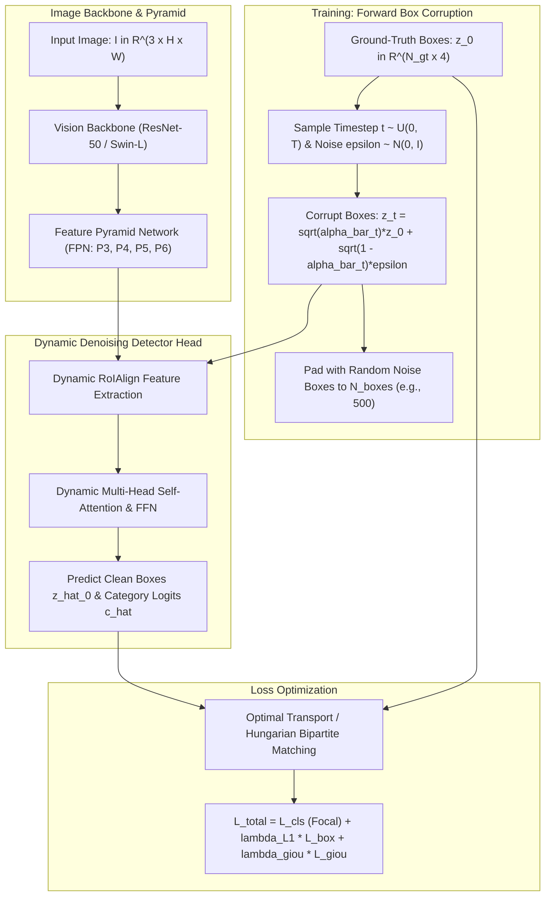

# 🔬 DiffusionDet: Diffusion Model for Object Detection

## 1. Executive Brief & Significance

Traditional object detection architectures partition detection into rigid, handcrafted paradigms:
1. **Anchor-Based Detectors** (Faster R-CNN, RetinaNet, YOLOv3/v4): Place dense geometric bounding box grids across feature maps, requiring sensitive aspect-ratio and scale tuning.
2. **Anchor-Free Point Detectors** (FCOS, CenterNet, YOLOv8/v10): Regress distances from center points, struggling on overlapping objects with identical centers.
3. **Query-Based Set Detectors** (DETR, Deformable DETR, DINO): Learn fixed positional queries optimized jointly with self-attention, but require hundreds of training epochs to converge and fix the maximum number of detectable objects at training time.

**DiffusionDet** (Chen et al., CVPR 2023) introduced a breakthrough paradigm shift: **Object detection formulated as a generative denoising diffusion process from random noise boxes to clean ground-truth bounding boxes**.

```
Detection Paradigms Evolution:

Anchor Boxes (Dense Priors)  -->  Object Queries (Learned Priors)  -->  DiffusionDet (Pure Noise Priors)
+-------------------------+       +----------------------------+       +------------------------------+
| Dense geometric grids   |       | Fixed learned query tokens |       | Pure random Gaussian noise   |
| Thousands of candidates |  -->  | (100 to 300 queries)       |  -->  | z_T ~ N(0, I)                |
| NMS post-processing     |       | Bipartite matching         |       | Iteratively denoised via     |
| Handcrafted anchors     |       | Slow convergence (50 epochs)|      | reverse diffusion steps      |
+-------------------------+       +----------------------------+       +------------------------------+
```

### Core Innovations
- **Detection as Denoising Diffusion**: At training time, ground-truth bounding boxes are corrupted with Gaussian noise; the detector learns to reverse the noise.
- **Pure Noise Priors at Inference**: During inference, the network takes **pure Gaussian noise boxes $z_T \sim \mathcal{N}(\mathbf{0}, \mathbf{I})$** and progressively refines them into crisp object detections conditioned on image features.
- **Dynamic Box Number & Flexible Compute**: The model can evaluate $100$, $300$, or $1000$ boxes at test time **without retraining**, and can trade speed for accuracy by adjusting diffusion sampling steps ($S=1$ for real-time edge execution, $S=4$ for high-precision inspection).



---

## 2. Core Mathematical Formulations & Tensor Mechanics

### 2.1 Forward Box Corruption Process
Let a bounding box be parameterized by normalized center coordinates and dimensions:

$$
z_0 = [c_x, c_y, w, h] \in [0, 1]^4
$$

In the forward diffusion process, noise is injected into ground-truth boxes according to a variance schedule $\beta_1, \dots, \beta_T$:

$$
q(z_t \mid z_0) = \mathcal{N}\left(z_t; \sqrt{\bar{\alpha}_t} z_0, (1 - \bar{\alpha}_t) \mathbf{I}\right)
$$

where $\alpha_t = 1 - \beta_t$ and $\bar{\alpha}_t = \prod_{s=1}^t \alpha_s$.

Because bounding box coordinates are physically bounded in $[0, 1]$, DiffusionDet applies **box coordinate scaling**:
$$z_t = \text{clamp}\left(\sqrt{\bar{\alpha}_t} (2 z_0 - 1) + \sqrt{1 - \bar{\alpha}_t} \boldsymbol{\epsilon}, -1, 1\right)$$
mapping the bounded box manifold to standard normal distribution support $[-1, 1]$.

---

### 2.2 Reverse Denoising & Prediction Formulation
Unlike standard diffusion models (DDPM/DDIM) which predict the added noise vector $\boldsymbol{\epsilon}_\theta(z_t, t)$, DiffusionDet directly predicts the **clean ground-truth bounding box** $\hat{z}_0$:

$$
\hat{z}_0 = f_\theta\left(z_t, t, \mathbf{F}_{\text{img}}\right)
$$

where $\mathbf{F}_{\text{img}} = \text{FPN}(\mathbf{I})$ denotes the multi-scale visual feature pyramid.

Using DDIM sampling mechanics, the previous step box distribution $z_{t-1}$ is deterministically computed:

$$
z_{t-1} = \sqrt{\bar{\alpha}_{t-1}} \hat{z}_0 + \sqrt{1 - \bar{\alpha}_{t-1} - \sigma_t^2} \left( \frac{z_t - \sqrt{\bar{\alpha}_t} \hat{z}_0}{\sqrt{1 - \bar{\alpha}_t}} \right) + \sigma_t \boldsymbol{\epsilon}_t
$$

Setting $\sigma_t = 0$ yields **deterministic DDIM trajectory updates**, allowing high-quality box recovery in as few as **$S = 1$ to $4$ steps**!

---

### 2.3 Training Loss via Set Matching
Because the number of candidate boxes $N_{\text{boxes}}$ (e.g., $500$) exceeds the number of ground-truth objects $N_{\text{gt}}$, predictions are assigned to ground truth via **Hungarian Bipartite Matching**:

$$
\hat{\sigma} = \arg\min_{\sigma \in \mathfrak{S}_{N_{\text{boxes}}}} \sum_{i=1}^{N_{\text{gt}}} \mathcal{L}_{\text{match}}\left(y_i, \hat{y}_{\sigma(i)}\right)
$$

where matching cost considers classification confidence and geometric overlap:
$$\mathcal{L}_{\text{match}}(y_i, \hat{y}_j) = -\hat{p}_j(c_i) + \lambda_{\text{L1}} \|z_i - \hat{z}_j\|_1 + \lambda_{\text{giou}} \mathcal{L}_{\text{GIoU}}(z_i, \hat{z}_j)$$

The total optimization loss is:

$$
\mathcal{L}_{\text{total}} = \sum_{i=1}^{N_{\text{gt}}} \left[ \mathcal{L}_{\text{focal}}(\hat{c}_{\hat{\sigma}(i)}, c_i) + \lambda_{\text{L1}} \|z_i - \hat{z}_{\hat{\sigma}(i)}\|_1 + \lambda_{\text{giou}} \mathcal{L}_{\text{GIoU}}(z_i, \hat{z}_{\hat{\sigma}(i)}) \right]
$$

---

## 3. High-Level Architecture & Layer Anatomy

```
DiffusionDet Layer Hierarchy:

Input Image [B, 3, H, W]
       |
       v
[ 1. Vision Backbone: ResNet-50 / Swin-Base ]
       |
       v Feature Maps C3, C4, C5
[ 2. Feature Pyramid Network (FPN) ] ---> P3, P4, P5, P6 (C = 256)
       |
       +---------------------------------------------+
                                                     |
Noisy Bounding Boxes z_t [B, N_boxes, 4]             |
       |                                             |
       v                                             v
[ 3. RoIAlign Feature Extraction ] <-----------------+
     Extracts 7x7 spatial feature patches per box
       |
       v Box Tokens [B, N_boxes, 256]
[ 4. Dynamic Denoising Head (Cascaded 6 Stages) ]
     - Self-Attention across boxes (models inter-object relations)
     - Dynamic Conv / FFN (conditioned on timestep embedding t)
     - Box Coordinate Regression Head -> Delta z
     - Category Classification Head   -> Class Logits
       |
       v
Clean Boxes z_0 [B, N_boxes, 4] + Class Scores [B, N_boxes, K]
```

---

## 4. Performance, Latency & Benchmark Metrics

Evaluated on **COCO 2017 validation/test-dev**:

| Model Backbone | Sampling Steps ($S$) | Candidate Boxes ($N_{\text{boxes}}$) | $\text{AP}^{\text{val}}$ | $\text{AP}_{50}$ | $\text{AP}_{75}$ | Latency (NVIDIA A100) |
| :--- | :--- | :--- | :--- | :--- | :--- | :--- |
| **ResNet-50** | 1 (Real-Time) | 100 | **45.5** | 64.6 | 49.3 | **18.2 ms (55 FPS)** |
| **ResNet-50** | 1 | 300 | **46.2** | 65.5 | 50.1 | 21.4 ms |
| **ResNet-50** | 4 | 300 | **46.8** | 66.2 | 50.8 | 32.1 ms |
| **Swin-Base** | 1 | 300 | **52.3** | 72.8 | 57.4 | 38.5 ms |
| **Swin-Large** | 4 | 500 | **54.8** | 75.1 | 60.3 | 64.2 ms |

*Key Insight*: Unlike fixed-query models, DiffusionDet achieves **$+1.3\text{ AP}$ gain purely by increasing evaluation boxes from $100$ to $500$ at inference time without retraining**!

---

## 5. Integration & Python Deployment Pipeline

```python
import torch
import torch.nn as nn
import torchvision.ops as ops

class DiffusionDetHead(nn.Module):
    """
    Simplified DiffusionDet Denoising Head demonstrating RoIAlign extraction,
    timestep modulation, and iterative bounding box denoising.
    """
    def __init__(self, in_channels: int = 256, num_classes: int = 80, num_heads: int = 6):
        super().__init__()
        self.in_channels = in_channels
        self.num_classes = num_classes
        
        # Timestep sinusoidal projection
        self.time_mlp = nn.Sequential(
            nn.Linear(in_channels, in_channels),
            nn.SiLU(),
            nn.Linear(in_channels, in_channels)
        )
        
        # Self-attention among candidate boxes
        self.self_attn = nn.MultiheadAttention(embed_dim=in_channels, num_heads=8, batch_first=True)
        self.norm1 = nn.LayerNorm(in_channels)
        
        # Bounding box and classification heads
        self.cls_head = nn.Linear(in_channels, num_classes)
        self.box_head = nn.Sequential(
            nn.Linear(in_channels, in_channels),
            nn.ReLU(),
            nn.Linear(in_channels, 4)
        )

    def extract_roi_features(self, fpn_features: torch.Tensor, boxes: torch.Tensor, image_shape: tuple[int, int]) -> torch.Tensor:
        """
        fpn_features: [B, C, H, W]
        boxes: [B, N, 4] normalized [cx, cy, w, h] in [0, 1]
        """
        B, N, _ = boxes.shape
        H, W = image_shape
        
        # Convert [cx, cy, w, h] to [x1, y1, x2, y2] absolute coordinates
        x1 = (boxes[..., 0] - boxes[..., 2] / 2) * W
        y1 = (boxes[..., 1] - boxes[..., 3] / 2) * H
        x2 = (boxes[..., 0] + boxes[..., 2] / 2) * W
        y2 = (boxes[..., 1] + boxes[..., 3] / 2) * H
        xyxy = torch.stack([x1, y1, x2, y2], dim=-1)
        
        # RoIAlign requires list of tensors per batch element
        rois = [xyxy[b] for b in range(B)]
        pooled_feats = ops.roi_align(fpn_features, rois, output_size=7, spatial_scale=1.0 / 8.0)
        # pooled_feats: [B * N, C, 7, 7] -> average pool to [B, N, C]
        box_tokens = pooled_feats.mean(dim=[-2, -1]).view(B, N, self.in_channels)
        return box_tokens

    def forward(self, fpn_features: torch.Tensor, noisy_boxes: torch.Tensor, t_emb: torch.Tensor, image_shape: tuple[int, int]):
        """
        fpn_features: [B, 256, H, W]
        noisy_boxes: [B, N, 4]
        t_emb: [B, 256] timestep embedding
        """
        # 1. Extract visual features at current box locations
        box_tokens = self.extract_roi_features(fpn_features, noisy_boxes, image_shape)
        
        # 2. Modulate with timestep condition
        t_mod = self.time_mlp(t_emb).unsqueeze(1) # [B, 1, 256]
        box_tokens = box_tokens + t_mod
        
        # 3. Model inter-box interactions via self-attention
        attn_out, _ = self.self_attn(box_tokens, box_tokens, box_tokens)
        box_tokens = self.norm1(box_tokens + attn_out)
        
        # 4. Predict clean box delta and classification logits
        pred_logits = self.cls_head(box_tokens) # [B, N, num_classes]
        box_deltas = self.box_head(box_tokens)  # [B, N, 4]
        pred_boxes = noisy_boxes + box_deltas
        
        return pred_logits, pred_boxes
```

---

## 6. Vault Cross-References & Ecosystem Links

- **[[techniques/denoising-diffusion-ddpm-and-ddim|Denoising Diffusion Models (DDPM & DDIM)]]**: Mathematical foundation of forward Gaussian corruption and reverse trajectories.
- **[[techniques/bipartite-matching-and-hungarian-assigner|Bipartite Matching & Hungarian Assigner]]**: Exact $1:1$ loss assignment mapping predicted boxes to ground truth.
- **[[techniques/roialign-and-exact-bilinear-sampling|RoIAlign & Exact Bilinear Sampling]]**: Feature extraction engine pooling multi-scale FPN features into box tokens.
- **[[architectures/real-time-detectors-and-segmenters/yolov10|YOLOv10]] & [[architectures/real-time-detectors-and-segmenters/rf-detr|RF-DETR]]**: Comparative one-stage and query-based detection baselines.
- **[[topics/object-detection/README|Object Detection Playbook]]**: Cataloged as the primary generative detection architecture.
