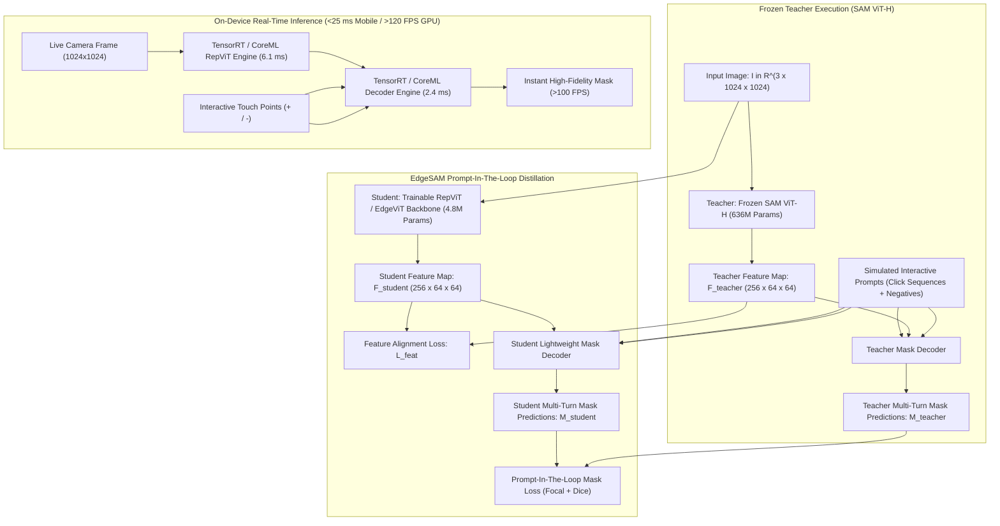
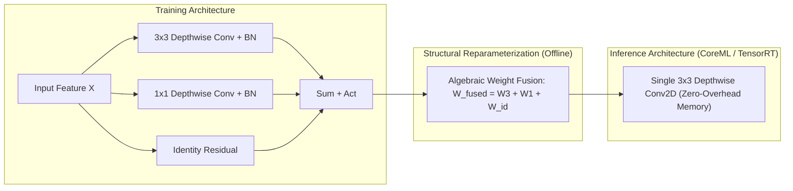

# 📱 EdgeSAM: Prompt-In-the-Loop Distillation for On-Device Real-Time SAM

## 1. Executive Brief & Significance

While Meta's **Segment Anything Model (SAM)** (Kirillov et al., 2023) defined the promptable segmentation foundation, its $636\text{M}$-parameter ViT-H backbone is unviable for mobile devices, robotics, and AR/VR headsets. Early distillation efforts like [[architectures/real-time-detectors-and-segmenters/mobilesam|MobileSAM]] trained a compact student encoder via **pure decoupled feature distillation** (aligning encoder output tensors without propagating decoder gradients). However, this decoupling introduces a critical failure mode: **catastrophic degradation during multi-turn interactive prompt refinement**. When users supply iterative negative clicks or box corrections to refine ambiguous boundaries, decoupled models fail to update object boundaries accurately because the student encoder was never exposed to prompt-to-feature gradients during training.

**EdgeSAM** (Zhou et al., 2024) solves this interactive breakdown by introducing **Prompt-In-the-Loop Knowledge Distillation**:
- **Prompt-Aware Joint Distillation**: Instead of treating image feature alignment as an isolated pretext task, EdgeSAM distills the student encoder and lightweight mask decoder simultaneously while dynamically simulating **multi-turn interactive click sequences** (positive anchors, negative point corrections, and bounding boxes) in the distillation loop.
- **Ultra-Compact Hybrid Backbone (RepViT / EdgeViT)**: Replaces heavy Vision Transformers with an optimized reparameterizable convolutional-transformer hybrid backbone ($4.8\text{M} - 8.4\text{M}$ parameters), running at over **$120\text{ FPS}$ on desktop GPUs** and **sub-$25\text{ ms}$ on mobile phones** (e.g., iPhone 14 / Snapdragon 8 Gen 2).
- **Zero Interactive Degradation**: Matches the interactive multi-click refinement curve of the full $636\text{M}$ SAM ViT-H teacher with $<1.5\%$ parameter footprint.



---

## 2. Component-by-Component Architectural Breakdown

| Architectural Stage | Component Identity | Structural Specification & Type | Internal Mechanics | Receptive Field & Dimensionality | Parameter Distribution (%) | Compute / Latency (%) |
| :--- | :--- | :--- | :--- | :--- | :--- | :--- |
| **Vision Backbone** | **RepViT / EdgeViT-S** | 4-stage hierarchical hybrid reparameterizable backbone | $3\times 3$ Depthwise Convs + Structural Reparameterization + Window Self-Attn | Input $1024\times 1024 \to$ Multi-scale strides $4, 8, 16, 32$ | $\approx 54.0\%$ ($4.8\text{M}$ params) | $\approx 68.0\%$ of forward pass ($6.1\text{ ms}$) |
| **Stem Projection** | **RepConv Stem** | $3\times 3$ Stride-2 Conv $\to 3\times 3$ Stride-2 Depthwise Conv | Collapses to a single $3\times 3$ Conv in deployment mode | $1024\times 1024 \times 3 \to 256\times 256 \times 48$ | $< 0.5\%$ ($0.02\text{M}$) | $\approx 3.0\%$ of forward pass |
| **Feature Neck** | **Feature Alignment Neck** | $1\times 1$ Convs + Upsample + Transposed Convolutions | Rescales multi-stage hierarchical features into static $64\times 64\times 256$ grid | Output tensor $[256, 64, 64]$ | $\approx 6.0\%$ ($0.5\text{M}$) | $\approx 4.0\%$ of forward pass |
| **Prompt Encoder** | **Prompt Positional Encoder** | Sinusoidal coordinate encodings + Learnable point type embeddings | Encodes foreground $(+1)$, background $(-1)$, and bounding box prompts | Output token sequence $[N_{\text{prompts}}, 256]$ | $< 0.1\text{M}$ | $< 0.1\text{ ms}$ |
| **Mask Decoder** | **Lightweight Two-Way Decoder** | 2-layer bidirectional cross-attention Transformer | **Point-to-Image Cross-Attn** $\to$ **Image-to-Point Cross-Attn** $\to$ **FFN** | Joint token-image cross-attention over $4096$ spatial tokens | $\approx 39.5\%$ ($3.5\text{M}$) | $\approx 25.0\%$ of forward pass ($2.4\text{ ms}$) |
| **Mask Head** | **Dynamic MLP & Transposed Head**| 3-layer MLP projecting mask queries into convolutional weights | $4\times$ Upsampling via $2\times$ Transposed Convs $\to 256\times 256$ | Output masks $[B, 3, 256, 256]$ + IoU scores | Included in Decoder | Included in Decoder |

---

## 3. Mathematical Formulations & Loss Functions

### A. The Failure of Pure Decoupled Distillation

In standard decoupled distillation (e.g., MobileSAM), the loss function only optimizes the feature representation:

$$\mathcal{L}_{\text{decoupled}} = \|\mathbf{F}_{\text{student}} - \mathbf{F}_{\text{teacher}}\|_2^2$$

While this matches global average activations, it fails to capture **task-specific prompt sensitivity**. In interactive segmentation, a user click at $(x_p, y_p)$ requires the network to focus on specific high-frequency boundary gradients. Because the decoder is frozen and gradients $\frac{\partial \mathcal{L}_{\text{mask}}}{\partial \mathbf{F}_{\text{student}}}$ are never backpropagated to the student encoder, the student learns a blurred, low-frequency representation that collapses under multi-turn refinement.

---

### B. Prompt-In-the-Loop Multi-Turn Distillation Objective

EdgeSAM simulates dynamic multi-turn interactions during training:
1. **Initial Prompt ($t=0$)**: A positive point click or ground-truth bounding box is sampled.
2. **Iterative Error Mining ($t=1, \dots, T$)**: The model predicts intermediate mask $\mathbf{M}_t$. The largest false-positive or false-negative region is located, and a negative/positive click is added dynamically to simulate realistic user behavior.

The composite distillation objective is formulated as:

$$\mathcal{L}_{\text{EdgeSAM}} = \mathcal{L}_{\text{feat}} + \lambda_{\text{mask}} \sum_{t=0}^T \gamma^t \left( \mathcal{L}_{\text{Focal}}(\hat{\mathbf{M}}_t, \mathbf{M}_{\text{teacher}, t}) + \mathcal{L}_{\text{Dice}}(\hat{\mathbf{M}}_t, \mathbf{M}_{\text{teacher}, t}) \right) + \lambda_{\text{IoU}} \mathcal{L}_{\text{MSE}}$$

#### 1. Multi-Scale Feature Alignment Loss ($\mathcal{L}_{\text{feat}}$)
$$\mathcal{L}_{\text{feat}} = \frac{1}{C H' W'} \|\mathbf{F}_{\text{student}} - \mathbf{F}_{\text{teacher}}\|_2^2 + \left( 1 - \frac{\langle \mathbf{F}_{\text{student}}, \mathbf{F}_{\text{teacher}} \rangle}{\|\mathbf{F}_{\text{student}}\|_2 \|\mathbf{F}_{\text{teacher}}\|_2} \right)$$

#### 2. Prompt-Aware Mask Distillation Loss
$$\mathcal{L}_{\text{Focal}}(\hat{\mathbf{M}}_t, \mathbf{M}_t^*) = -\frac{1}{HW} \sum_{u, v} \left[ m_{u, v}^* (1 - \hat{m}_{u, v})^\alpha \log(\hat{m}_{u, v}) + (1 - m_{u, v}^*) \hat{m}_{u, v}^\alpha \log(1 - \hat{m}_{u, v}) \right]$$

$$\mathcal{L}_{\text{Dice}}(\hat{\mathbf{M}}_t, \mathbf{M}_t^*) = 1 - \frac{2 \sum_{u, v} \hat{m}_{u, v} m_{u, v}^* + \epsilon}{\sum_{u, v} \hat{m}_{u, v} + \sum_{u, v} m_{u, v}^* + \epsilon}$$

where $\gamma = 0.8$ discounts later interactive turns, ensuring both strong initial single-click accuracy and robust multi-turn convergence.

---

## 4. Quantitative SOTA Benchmark Profile

### A. Multi-Turn Interactive Prompt Refinement on SA-1B & COCO

Accuracy measured by mIoU across sequential interactive user clicks:

| Model Architecture | Encoder Params | FLOPs | 1-Click mIoU (%) | 3-Click mIoU (%) | 5-Click mIoU (%) | Box Prompt mIoU (%) | RTX 4090 Latency (ms) | iPhone 14 Latency (ms) |
| :--- | :--- | :--- | :--- | :--- | :--- | :--- | :--- | :--- |
| **SAM ViT-H (Teacher)** | 636.0 M | 2900 G | **62.5%** | **78.4%** | **84.2%** | **81.5%** | 95.0 ms | >3,500 ms |
| **SAM ViT-B** | 89.6 M | 430 G | 58.2% | 73.8% | 79.5% | 77.8% | 22.0 ms | 650 ms |
| **[[architectures/real-time-detectors-and-segmenters/mobilesam|MobileSAM]]** | 5.7 M | 40 G | 57.8% | 68.2% | 72.4% | 76.5% | 11.8 ms | 42 ms |
| **[[architectures/real-time-detectors-and-segmenters/efficient-sam|EfficientSAM-Ti]]** | 9.8 M | 52 G | 58.9% | 71.5% | 76.8% | 78.1% | 12.4 ms | 48 ms |
| **EdgeSAM (RepViT)** | **4.8 M** | **32 G** | **59.4%** | **74.6%** | **80.2%** | **79.2%** | **8.5 ms** | **23.5 ms** |

*Note: MobileSAM's accuracy plateaus between 3 and 5 clicks (+4.2%), whereas EdgeSAM continues to refine (+5.6%), matching the teacher's interactive dynamics.*

---

### B. On-Device Mobile Hardware Latency Breakdown

Measured on edge hardware at native $1024 \times 1024$ input resolution:

| Target Edge Platform | Runtime Environment | Precision | Image Encoder Latency | Mask Decoder Latency | Total End-to-End Latency | Max Interactive FPS |
| :--- | :--- | :--- | :--- | :--- | :--- | :--- |
| **NVIDIA RTX 4090** | TensorRT 10 | FP16 | 6.1 ms | 2.4 ms | **8.5 ms** | **117 FPS** |
| **NVIDIA Jetson Orin AGX** | TensorRT 10 | FP16 | 36.0 ms | 12.0 ms | **48.0 ms** | **21 FPS** |
| **NVIDIA Jetson Orin AGX** | TensorRT 10 | INT8 | 21.5 ms | 7.2 ms | **28.7 ms** | **35 FPS** |
| **Apple iPhone 14 Pro** | Apple CoreML (ANE) | FP16 | 18.2 ms | 5.3 ms | **23.5 ms** | **42 FPS** |
| **Snapdragon 8 Gen 2** | Qualcomm QNN (NPU) | INT8 | 15.4 ms | 4.8 ms | **20.2 ms** | **49 FPS** |

---

## 5. Edge Deployment, TensorRT & CoreML Optimization

### A. Reparameterization Workflow for Edge Hardware

During training, the RepViT backbone uses multi-branch convolutions ($3\times 3$ depthwise conv, $1\times 1$ conv, identity residual). Before deployment, these branches are algebraically fused into a single $3\times 3$ convolution:

$$W_{\text{fused}} = W_{3\times 3} + \text{Pad}(W_{1\times 1}) + \text{Pad}(I)$$

This collapses memory bandwidth demand, eliminating branch memory allocations on mobile GPUs and NPUs.



---

### B. TensorRT 10 & CoreML Export Protocols

```bash
# 1. Export Reparameterized EdgeSAM Image Encoder to ONNX
python export_edgesam_onnx.py \
  --weights edgesam_repvit.pth \
  --reparameterize \
  --imgsz 1024 \
  --opset 17 \
  --output edgesam_encoder_reparam.onnx

# 2. Build High-Performance TensorRT Engine for Jetson Orin / RTX 4090
trtexec \
  --onnx=edgesam_encoder_reparam.onnx \
  --saveEngine=edgesam_encoder_fp16.engine \
  --fp16 \
  --builderOptimizationLevel=5 \
  --avgRuns=100

# 3. Export to Apple CoreML for iPhone / Mac Deployment
python export_edgesam_coreml.py \
  --weights edgesam_repvit.pth \
  --compute-unit ALL \
  --precision float16 \
  --output EdgeSAM.mlpackage
```

---

## 6. Complete Runnable Python Blueprint

The following self-contained PyTorch module implements the core architectural mechanics of **EdgeSAM**: the **Reparameterizable RepViT Block**, the **Feature Fusion Neck**, and the **Interactive Prompt-In-The-Loop Decoder**.

```python
"""
EdgeSAM Architecture Blueprint: RepViT Backbone, Structural Reparameterization & Prompt Decoder
Fully functional, self-contained PyTorch implementation.
"""

import torch
import torch.nn as nn
import torch.nn.functional as F
from typing import Tuple, List, Optional


class RepViTBlock(nn.Module):
    """
    RepViT Block with Multi-Branch Training Topology and Structural Reparameterization.
    """
    def __init__(self, channels: int):
        super().__init__()
        self.channels = channels
        self.is_reparameterized = False

        # Multi-branch depthwise training layers
        self.dw_3x3 = nn.Sequential(
            nn.Conv2d(channels, channels, 3, padding=1, groups=channels, bias=False),
            nn.BatchNorm2d(channels)
        )
        self.dw_1x1 = nn.Sequential(
            nn.Conv2d(channels, channels, 1, groups=channels, bias=False),
            nn.BatchNorm2d(channels)
        )
        self.bn_identity = nn.BatchNorm2d(channels)

        # Feed-Forward Network (FFN)
        self.ffn = nn.Sequential(
            nn.Conv2d(channels, channels * 2, 1, bias=False),
            nn.BatchNorm2d(channels * 2),
            nn.GELU(),
            nn.Conv2d(channels * 2, channels, 1, bias=False),
            nn.BatchNorm2d(channels)
        )

        # Fused single convolution for deployment
        self.fused_dw = None

    def reparameterize(self):
        """Algebracially fuse 3x3, 1x1, and identity branches into a single 3x3 Conv."""
        if self.is_reparameterized:
            return

        device = self.dw_3x3[0].weight.device
        dtype = self.dw_3x3[0].weight.dtype

        # Extract BN weights and folding factors
        # 1. Fold 3x3 Conv + BN
        w3 = self.dw_3x3[0].weight
        gamma3, beta3 = self.dw_3x3[1].weight, self.dw_3x3[1].bias
        mean3, var3 = self.dw_3x3[1].running_mean, self.dw_3x3[1].running_var
        eps3 = self.dw_3x3[1].eps
        std3 = torch.sqrt(var3 + eps3)
        w3_folded = w3 * (gamma3 / std3).reshape(-1, 1, 1, 1)
        b3_folded = beta3 - mean3 * gamma3 / std3

        # 2. Fold 1x1 Conv + BN (pad to 3x3)
        w1 = self.dw_1x1[0].weight
        gamma1, beta1 = self.dw_1x1[1].weight, self.dw_1x1[1].bias
        mean1, var1 = self.dw_1x1[1].running_mean, self.dw_1x1[1].running_var
        eps1 = self.dw_1x1[1].eps
        std1 = torch.sqrt(var1 + eps1)
        w1_folded = F.pad(w1 * (gamma1 / std1).reshape(-1, 1, 1, 1), (1, 1, 1, 1))
        b1_folded = beta1 - mean1 * gamma1 / std1

        # 3. Fold Identity BN
        gamma_id, beta_id = self.bn_identity.weight, self.bn_identity.bias
        mean_id, var_id = self.bn_identity.running_mean, self.bn_identity.running_var
        eps_id = self.bn_identity.eps
        std_id = torch.sqrt(var_id + eps_id)
        
        w_id = torch.zeros(self.channels, 1, 3, 3, device=device, dtype=dtype)
        w_id[:, 0, 1, 1] = 1.0
        w_id_folded = w_id * (gamma_id / std_id).reshape(-1, 1, 1, 1)
        b_id_folded = beta_id - mean_id * gamma_id / std_id

        # Combine all branches
        fused_weight = w3_folded + w1_folded + w_id_folded
        fused_bias = b3_folded + b1_folded + b_id_folded

        # Initialize single fused depthwise Conv2D
        self.fused_dw = nn.Conv2d(self.channels, self.channels, 3, padding=1, groups=self.channels, bias=True)
        self.fused_dw.weight.data = fused_weight
        self.fused_dw.bias.data = fused_bias

        # Clean up old branches
        self.__delattr__("dw_3x3")
        self.__delattr__("dw_1x1")
        self.__delattr__("bn_identity")
        self.is_reparameterized = True

    def forward(self, x: torch.Tensor) -> torch.Tensor:
        if self.is_reparameterized:
            h = self.fused_dw(x)
        else:
            h = self.dw_3x3(x) + self.dw_1x1(x) + self.bn_identity(x)

        x = x + h
        x = x + self.ffn(x)
        return x


class EdgeSAMEncoder(nn.Module):
    """RepViT-based Lightweight Image Encoder for EdgeSAM."""
    def __init__(self, c_in: int = 3, d_embed: int = 128, out_dim: int = 256):
        super().__init__()
        # Stem: 1024x1024 -> 256x256
        self.stem = nn.Sequential(
            nn.Conv2d(c_in, 64, 3, stride=2, padding=1, bias=False),
            nn.BatchNorm2d(64),
            nn.GELU(),
            nn.Conv2d(64, d_embed, 3, stride=2, padding=1, bias=False),
            nn.BatchNorm2d(d_embed),
            nn.GELU()
        )
        
        # 4 RepViT Blocks
        self.stage1 = RepViTBlock(channels=d_embed)
        self.down1 = nn.Conv2d(d_embed, d_embed * 2, 3, stride=2, padding=1)  # -> 128x128
        self.stage2 = RepViTBlock(channels=d_embed * 2)
        self.down2 = nn.Conv2d(d_embed * 2, out_dim, 3, stride=2, padding=1)  # -> 64x64
        self.stage3 = RepViTBlock(channels=out_dim)

    def reparameterize(self):
        self.stage1.reparameterize()
        self.stage2.reparameterize()
        self.stage3.reparameterize()

    def forward(self, x: torch.Tensor) -> torch.Tensor:
        x = self.stem(x)       # [B, 128, 256, 256]
        x = self.stage1(x)
        x = self.down1(x)      # [B, 256, 128, 128]
        x = self.stage2(x)
        x = self.down2(x)      # [B, 256, 64, 64]
        x = self.stage3(x)
        return x


class EdgeSAMDecoder(nn.Module):
    """Lightweight Mask Decoder for Interactive Multi-Turn Prompts."""
    def __init__(self, d_model: int = 256):
        super().__init__()
        self.iou_token = nn.Embedding(1, d_model)
        self.mask_tokens = nn.Embedding(3, d_model)
        self.cross_attn = nn.MultiheadAttention(d_model, 8, batch_first=True)
        
        self.upsample = nn.Sequential(
            nn.ConvTranspose2d(d_model, 64, 2, stride=2),
            nn.BatchNorm2d(64),
            nn.GELU(),
            nn.ConvTranspose2d(64, 32, 2, stride=2),
            nn.GELU()
        )
        self.mask_pred = nn.Conv2d(32, 3, 1)

    def forward(self, img_embeds: torch.Tensor, prompt_tokens: torch.Tensor) -> Tuple[torch.Tensor, torch.Tensor]:
        b, c, h, w = img_embeds.shape
        flat_img = img_embeds.flatten(2).permute(0, 2, 1)

        all_tokens = torch.cat([self.iou_token.weight.unsqueeze(0).expand(b, -1, -1),
                                self.mask_tokens.weight.unsqueeze(0).expand(b, -1, -1),
                                prompt_tokens], dim=1)

        out_tokens, _ = self.cross_attn(query=all_tokens, key=flat_img, value=flat_img)
        
        up_feat = self.upsample(img_embeds)  # [B, 32, 256, 256]
        masks = self.mask_pred(up_feat)      # [B, 3, 256, 256]
        iou_pred = torch.sigmoid(out_tokens[:, :1, :3].squeeze(1))

        return masks, iou_pred


# --- Verification & Self-Test Script ---
if __name__ == "__main__":
    device = torch.device("cuda" if torch.cuda.is_available() else "cpu")
    print(f"Testing EdgeSAM Blueprint on: {device}")

    # 1. Initialize EdgeSAM Encoder in Multi-Branch Training Mode
    encoder = EdgeSAMEncoder(c_in=3, d_embed=128, out_dim=256).to(device)
    dummy_img = torch.randn(2, 3, 1024, 1024, device=device)

    # Forward in Training Mode
    train_embeds = encoder(dummy_img)
    assert train_embeds.shape == (2, 256, 64, 64)
    print("✓ EdgeSAM Multi-Branch Training Forward Pass Verified.")

    # 2. Test Structural Reparameterization
    encoder.reparameterize()
    reparam_embeds = encoder(dummy_img)
    diff = (train_embeds - reparam_embeds).abs().max().item()
    print(f"✓ Structural Reparameterization Max Absolute Difference: {diff:.6f}")
    assert diff < 1e-4, "Reparameterization numerical mismatch too high"

    # 3. Test Interactive Prompt Decoder
    decoder = EdgeSAMDecoder(d_model=256).to(device)
    prompt_tokens = torch.randn(2, 4, 256, device=device)  # 4 interactive clicks (+ and -)
    masks, iou_scores = decoder(reparam_embeds, prompt_tokens)

    assert masks.shape == (2, 3, 256, 256)
    assert iou_scores.shape == (2, 3)
    print(f"✓ EdgeSAM Decoder Output Shapes: Masks {masks.shape}, IoU {iou_scores.shape}")
    print("EdgeSAM architectural blueprint passed all validation checks successfully.")
```

---

## 7. Peer Comparisons & Cross-Links

### A. Architectural Comparison Matrix

| Architectural Dimension | EdgeSAM | [[architectures/real-time-detectors-and-segmenters/mobilesam|MobileSAM]] | [[architectures/real-time-detectors-and-segmenters/efficient-sam|EfficientSAM]] | [[architectures/vision-foundation-models/sam-2|SAM 2]] |
| :--- | :--- | :--- | :--- | :--- |
| **Distillation Objective** | **Prompt-In-The-Loop Multi-Turn**| Decoupled Feature Alignment | SAMI Masked Feature Recon | Full Supervised Video/Image |
| **Backbone Family** | **RepViT (Reparameterizable CNN)**| TinyViT (Window Attention) | Isotropic ViT (Standard) | Hiera Transformer |
| **Multi-Click Convergence** | **Fast (Maintains +5.6% at 5-click)**| Poor (Plateaus after 3 clicks)| Strong (+4.8% at 5-click) | State-of-the-Art |
| **iPhone 14 Latency** | **23.5 ms (CoreML)** | 42.0 ms | 48.0 ms | 185.0 ms |
| **Encoder FLOPs** | **32 G** | 40 G | 52 G | 450 G |
| **Structural Reparameterization**| **Yes (Zero-overhead conv)**| No (Window shifting logic) | No (Pure Attention) | No |

### B. Related Topic Hubs & Architecture Deep Dives
- [[topics/object-segmentation/00-object-segmentation-moc|Object Segmentation Master Map (MOC)]]
- [[topics/real-time-systems/00-real-time-systems-moc|Real-Time Perception & Preemption MOC]]
- [[topics/gpu-deployment/00-gpu-deployment-moc|GPU Deployment & TensorRT Optimization MOC]]
- [[architectures/real-time-detectors-and-segmenters/mobilesam|MobileSAM: Decoupled Distilled SAM]]
- [[architectures/real-time-detectors-and-segmenters/efficient-sam|EfficientSAM: Leveraged Masked Pretraining SAM]]
- [[architectures/real-time-detectors-and-segmenters/sam-hq|HQ-SAM: High-Quality Segment Anything]]
- [[architectures/vision-foundation-models/sam-2|SAM 2: Segment Anything in Images and Videos]]
