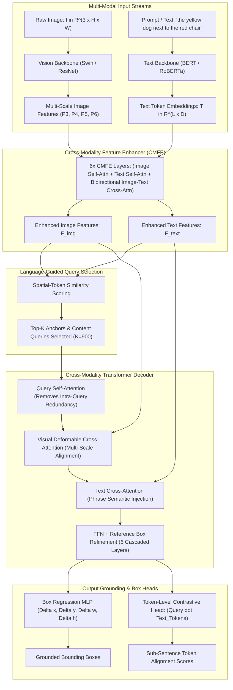

# 🎯 Grounding DINO: Open-Set Object Detection with Grounded Pre-Training

## 1. Executive Brief & Significance

Traditional closed-set object detectors (Faster R-CNN, YOLO, standard DETR) cannot localize novel objects outside their predefined vocabulary. While earlier vision-language grounding models like GLIP introduced phrase grounding into object detection, they relied on two-stage architectures with dense region-word dot products, suffering from high false-positive rates and slow convergence.

**Grounding DINO** (Liu et al., IDEA-Research, 2023/2024) marries the state-of-the-art transformer detector **DINO (DETR with Improved DeNoising Anchor Boxes)** with multi-scale **Grounded Pre-Training**:
- **Deep Cross-Modal Feature Enhancer (CMFE)**: Interleaves self-attention and cross-attention between image feature maps and text tokens across multiple feature pyramid levels before query generation.
- **Language-Guided Query Selection**: Initializes object queries not from static learnable vectors or purely visual priors, but by selecting visual features that have the highest alignment with input sub-sentence text tokens.
- **Cross-Modality Decoder**: Features a three-way interaction mechanism (query self-attention, visual deformable cross-attention, and text cross-attention) that outputs fine-grained bounding boxes and sub-sentence token grounding logits.
- **State-of-the-Art Open-Set Performance**: Achieves **52.5% zero-shot AP on COCO** (outperforming many fully supervised closed-set detectors) and establishes the gold standard for open-vocabulary detection and referring expression comprehension (RefCOCO/+/g).



---

## 2. Component-by-Component Architectural Breakdown

| Architectural Stage | Component Identity | Structural Specification & Type | Internal Attention Mechanics | Dimensionality & Spatial Grid | Parameter Distribution (%) | Latency / Compute (%) |
| :--- | :--- | :--- | :--- | :--- | :--- | :--- |
| **Vision Backbone** | **Swin Transformer / ResNet-50** | Hierarchical shifted-window ViT (Swin-T/B/L) or ConvNet | Windowed Self-Attention + Patch Merging (Strides 8, 16, 32, 64) | $P3: \frac{H}{8}\times\frac{W}{8}, \dots, P6: \frac{H}{64}\times\frac{W}{64}$ | $\approx 28.5\%$ ($28\text{M}$ for Swin-T) | $\approx 35.0\%$ of forward pass |
| **Text Backbone** | **BERT-Base / RoBERTa-Base** | 12-layer bidirectional Transformer encoder ($D=256$) | Standard Multi-Head Self-Attention over tokenized prompt sequences | $L \le 256$ tokens, embedding dimension $D=256$ | $\approx 26.2\%$ ($110\text{M}$) | $\approx 12.0\%$ of forward pass |
| **Feature Enhancer** | **CMFE (6 Layers)** | Multi-layer bidirectional Vision-Language interaction block | Alternating Image Self-Attn, Text Self-Attn, Image-to-Text Cross-Attn, Text-to-Image Cross-Attn | Multi-scale flattened visual tokens + $L$ text tokens | $\approx 22.8\%$ ($32.4\text{M}$) | $\approx 28.5\%$ of forward pass |
| **Query Selection** | **Language-Guided Selector** | Top-$K$ feature extraction based on $\mathbf{F}_{\text{img}} \mathbf{F}_{\text{text}}^T$ similarity | Matches spatial pixels against text token embeddings to pick high-relevance object priors | $K = 900$ object queries, dimension $D=256$ | $< 0.5\%$ | $\approx 1.5\%$ of forward pass |
| **Transformer Decoder** | **Cross-Modality Decoder (6 Layers)** | 6-layer dual-cross-attention decoder with deformable attention | **Query Self-Attn** $\to$ **Deformable Visual Cross-Attn** $\to$ **Text Cross-Attn** $\to$ **FFN** | $900$ queries interacting with multi-scale visual maps & text tokens | $\approx 18.2\%$ ($24.8\text{M}$) | $\approx 21.0\%$ of forward pass |
| **Regression Head** | **Box Refinement MLP** | 3-layer MLP with ReLU + Box coordinate offsets | Predicts residual box coordinates relative to reference box anchors | Output: $[B, 900, 4]$ normalized $(cx, cy, w, h)$ | $\approx 1.8\%$ ($1.2\text{M}$) | $\approx 1.0\%$ of forward pass |
| **Grounding Head** | **Token Contrastive Head** | Linear projection computing query-to-token dot products | Computes sub-sentence similarity logits between query vectors and text tokens | Output: $[B, 900, L]$ grounding probability map | $\approx 2.0\%$ ($1.4\text{M}$) | $\approx 1.0\%$ of forward pass |

---

## 3. Mathematical Formulations & Loss Functions

### A. Cross-Modality Feature Enhancer (CMFE)

Let $\mathbf{V}^{(0)} \in \mathbb{R}^{N_v \times D}$ denote the flattened multi-scale visual tokens (where $N_v = \sum_{l=3}^6 H_l W_l$), and let $\mathbf{T}^{(0)} \in \mathbb{R}^{L \times D}$ denote the text token sequence of length $L$.

At each CMFE layer $m \in \{1, \dots, M\}$ ($M=6$), features undergo four sequential sub-layers:
1. **Text Self-Attention (TSA)**:
   $$\mathbf{T}^{(m-0.75)} = \mathbf{T}^{(m-1)} + \text{MHA}\left( \mathbf{Q}=\mathbf{T}^{(m-1)}, \mathbf{K}=\mathbf{T}^{(m-1)}, \mathbf{V}=\mathbf{T}^{(m-1)} \right)$$
2. **Image Self-Attention (ISA)** (implemented via Multi-Scale Deformable Attention or Window Attention):
   $$\mathbf{V}^{(m-0.75)} = \mathbf{V}^{(m-1)} + \text{MSDeformAttn}\left( \mathbf{Q}=\mathbf{V}^{(m-1)}, \mathbf{K}=\mathbf{V}^{(m-1)}, \mathbf{V}=\mathbf{V}^{(m-1)} \right)$$
3. **Cross-Modality Image-to-Text Attention (V2T)**:
   $$\mathbf{V}^{(m-0.5)} = \mathbf{V}^{(m-0.75)} + \text{MHA}\left( \mathbf{Q}=\mathbf{V}^{(m-0.75)}, \mathbf{K}=\mathbf{T}^{(m-0.75)}, \mathbf{V}=\mathbf{T}^{(m-0.75)} \right)$$
4. **Cross-Modality Text-to-Image Attention (T2V)**:
   $$\mathbf{T}^{(m)} = \mathbf{T}^{(m-0.75)} + \text{MHA}\left( \mathbf{Q}=\mathbf{T}^{(m-0.75)}, \mathbf{K}=\mathbf{V}^{(m-0.75)}, \mathbf{V}=\mathbf{V}^{(m-0.75)} \right)$$

$$\mathbf{V}^{(m)} = \text{FFN}\left( \mathbf{V}^{(m-0.5)} \right), \quad \mathbf{T}^{(m)} = \text{FFN}\left( \mathbf{T}^{(m)} \right)$$

---

### B. Language-Guided Query Selection Formulation

Standard Deformable DETR selects the top-$K$ visual features with highest classification confidence to initialize object queries. In Grounding DINO, candidate visual feature vectors $\mathbf{v}_i \in \mathbb{R}^D$ ($i \in \{1, \dots, N_v\}$) are scored against all text tokens $\mathbf{t}_j \in \mathbb{R}^D$ ($j \in \{1, \dots, L\}$):

$$S_i = \max_{j=1}^L \left( \frac{\mathbf{v}_i \cdot \mathbf{t}_j}{\|\mathbf{v}_i\|_2 \|\mathbf{t}_j\|_2} \right)$$

The top-$K$ visual spatial positions with the highest $S_i$ values are selected as initial **reference anchor boxes** $\mathbf{b}_{\text{init}}^{(k)} \in \mathbb{R}^4$ and **content queries** $\mathbf{Q}_{\text{init}}^{(k)} \in \mathbb{R}^D$ for $k \in \{1, \dots, K\}$ ($K=900$).

---

### C. Sub-Sentence Grounding & Token-Level Contrastive Loss

Unlike coarse classification heads that output fixed category probabilities, Grounding DINO predicts dot products between each output object query $\mathbf{q}_i \in \mathbb{R}^D$ ($i \in \{1, \dots, 900\}$) and all text token vectors $\mathbf{t}_j \in \mathbb{R}^D$:

$$\hat{y}_{i, j} = \frac{\mathbf{q}_i \mathbf{W}_q \cdot (\mathbf{t}_j \mathbf{W}_t)^T}{\tau}$$

where $\tau$ is a learnable temperature parameter.

#### Total Optimization Objective:
$$\mathcal{L}_{\text{total}} = \lambda_{\text{cls}} \mathcal{L}_{\text{contrastive}} + \lambda_{\text{L1}} \mathcal{L}_{\text{L1}} + \lambda_{\text{GIOU}} \mathcal{L}_{\text{GIOU}} + \mathcal{L}_{\text{aux}}$$

1. **Token-Level Contrastive Loss ($\mathcal{L}_{\text{contrastive}}$)**:
   For matched positive pair $(i, j)$ (query $i$ matched to ground-truth token index $j$ via bipartite matching) and negative pairs:
   $$\mathcal{L}_{\text{contrastive}} = -\sum_{i=1}^K \sum_{j=1}^L \left[ c_{i, j} \log \sigma(\hat{y}_{i, j}) + (1 - c_{i, j}) \log (1 - \sigma(\hat{y}_{i, j})) \right]$$
   where $c_{i, j} = 1$ if query $i$ corresponds to an object described by token $j$, and $0$ otherwise.

2. **Bounding Box Regression**:
   $$\mathcal{L}_{\text{L1}}(\mathbf{b}_i, \hat{\mathbf{b}}_i) = \|\mathbf{b}_i - \hat{\mathbf{b}}_i\|_1$$
   $$\mathcal{L}_{\text{GIOU}}(\mathbf{b}_i, \hat{\mathbf{b}}_i) = 1 - \left( \frac{|\mathbf{b}_i \cap \hat{\mathbf{b}}_i|}{|\mathbf{b}_i \cup \hat{\mathbf{b}}_i|} - \frac{|C \setminus (\mathbf{b}_i \cup \hat{\mathbf{b}}_i)|}{|C|} \right)$$
   where $C$ is the smallest convex enclosing box. Standard weights: $\lambda_{\text{cls}} = 2.0, \lambda_{\text{L1}} = 5.0, \lambda_{\text{GIOU}} = 2.0$.

---

## 4. Quantitative SOTA Benchmark Profile

### A. Zero-Shot Object Detection (COCO 2017 & LVIS minival)

Models trained on grounding data (O365, GoldG, Cap4M) and tested in strict zero-shot transfer mode:

| Model Architecture | Image Backbone | Text Backbone | COCO Zero-Shot $\text{AP}$ (%) | COCO Zero-Shot $\text{AP}_{50}$ (%) | LVIS Zero-Shot $\text{AP}_{\text{rare}}$ (%) | LVIS Zero-Shot $\text{AP}_{\text{all}}$ (%) | A100 FP16 (ms) | RTX 4090 FP16 (ms) | Jetson Orin AGX (ms) |
| :--- | :--- | :--- | :--- | :--- | :--- | :--- | :--- | :--- | :--- |
| **GLIP-T** | Swin-T | BERT-Base | 46.5% | 61.2% | 17.1% | 24.9% | 32.0 ms | 48.0 ms | 285.0 ms |
| **GLIP-L** | Swin-L | BERT-Large| 51.4% | 66.8% | 22.8% | 34.0% | 78.0 ms | 115.0 ms | 680.0 ms |
| **Grounding DINO-T**| Swin-T | BERT-Base | **48.4%** | **63.8%** | **25.4%** | **31.5%** | **26.5 ms** | **39.5 ms** | **230.0 ms** |
| **Grounding DINO-B**| Swin-B | BERT-Base | **50.8%** | **66.2%** | **28.9%** | **35.8%** | **44.0 ms** | **64.0 ms** | **390.0 ms** |
| **Grounding DINO-L**| Swin-L | BERT-Large| **52.5%** | **68.4%** | **33.2%** | **40.2%** | **71.0 ms** | **98.0 ms** | **580.0 ms** |

---

### B. Referring Expression Grounding (REC) on RefCOCO / RefCOCO+ / RefCOCOg

Accuracy measured by $\text{P}@0.5$ (Precision with $\text{IoU} \ge 0.5$):

| Architecture | Backbone | RefCOCO $\text{val}$ (%) | RefCOCO $\text{testA}$ (%) | RefCOCO+ $\text{val}$ (%) | RefCOCO+ $\text{testA}$ (%) | RefCOCOg $\text{val}$ (%) |
| :--- | :--- | :--- | :--- | :--- | :--- | :--- |
| **UNINEXT-L** | ViT-H | 88.6% | 90.8% | 81.2% | 85.4% | 83.1% |
| **MDETR** | ResNet-101 | 86.7% | 89.5% | 79.5% | 84.1% | 81.6% |
| **Grounding DINO-T** | Swin-T | **88.9%** | **91.5%** | **82.1%** | **86.8%** | **84.5%** |
| **Grounding DINO-L** | Swin-L | **90.5%** | **93.2%** | **84.8%** | **89.1%** | **86.7%** |

---

## 5. Edge Deployment, TensorRT Optimization & Gotchas

### A. Deployment Bottlenecks in Production
1. **Dynamic Text Sequence Length**: BERT tokenizers produce variable-length token arrays ($L \in [1, 256]$) depending on prompt complexity. Dynamic sequence lengths break static TensorRT engine memory optimizations.
   - *Fix*: Pad prompt token sequences to a fixed static length (e.g., $L=64$ for short phrases or $L=128$ for complex expressions) with an attention mask.
2. **Multi-Scale Deformable Attention in TensorRT**:
   - The default `MultiScaleDeformableAttention` PyTorch autograd function requires custom C++/CUDA plugins (`MultiScaleDeformableAttnPlugin` in TensorRT).
   - *Fix*: Export using ONNX opset 17+ and link the NVIDIA TensorRT open-source plugin library (`libnvinfer_plugin.so`).


---

### B. Two-Engine Split-Graph Deployment Pattern

To maximize inference frame rates on edge devices (Jetson Orin / RTX GPUs), split Grounding DINO into two specialized TensorRT engines:
- **Engine 1 (Text Encoder)**: Runs only when the user changes or updates the prompt text query. Text embeddings $\mathbf{T} \in \mathbb{R}^{1 \times 64 \times 256}$ are cached in GPU VRAM.
- **Engine 2 (Vision Backbone + CMFE + Decoder)**: Runs on every live camera frame at full frame rate, consuming the cached text embeddings.

---

### C. ONNX Export & TensorRT Compilation Recipe

```bash
# 1. Export Vision-Decoder subsystem to ONNX with static shapes
python export_grounding_dino_onnx.py \
  --weights groundingdino_swint_ogc.pth \
  --img_size 800 800 \
  --max_text_len 64 \
  --opset 17 \
  --output grounding_dino_vision_dec.onnx

# 2. Build TensorRT 10 Engine with Deformable Attention Plugins
trtexec \
  --onnx=grounding_dino_vision_dec.onnx \
  --saveEngine=grounding_dino_fp16.engine \
  --fp16 \
  --plugins=libnvinfer_plugin.so \
  --builderOptimizationLevel=5 \
  --avgRuns=50

# 3. Verify Engine Execution
trtexec --loadEngine=grounding_dino_fp16.engine --dumpProfile
```

---

## 6. Complete Runnable Python Blueprint

The following executable PyTorch script implements the core multi-modal architecture of Grounding DINO: the **Bi-directional CMFE Layer**, **Language-Guided Query Selection**, and **Token-Level Contrastive Prediction**.

```python
"""
Grounding DINO Architecture Blueprint: CMFE, Language-Guided Query Selection & Contrastive Head
Fully functional, self-contained PyTorch implementation.
"""

import torch
import torch.nn as nn
import torch.nn.functional as F
from typing import Tuple, Optional


class BiDirectionalCMFELayer(nn.Module):
    """
    Cross-Modality Feature Enhancer (CMFE) Layer.
    Interleaves visual self-attention, text self-attention, and bi-directional cross-attention.
    """
    def __init__(self, d_model: int = 256, n_heads: int = 8, d_ffn: int = 1024):
        super().__init__()
        self.d_model = d_model
        
        # Self-Attention Blocks
        self.text_self_attn = nn.MultiheadAttention(d_model, n_heads, batch_first=True)
        self.img_self_attn = nn.MultiheadAttention(d_model, n_heads, batch_first=True)

        # Cross-Attention Blocks
        self.img_to_text_cross = nn.MultiheadAttention(d_model, n_heads, batch_first=True)
        self.text_to_img_cross = nn.MultiheadAttention(d_model, n_heads, batch_first=True)

        # Normalization and FFNs
        self.norm_t1 = nn.LayerNorm(d_model)
        self.norm_t2 = nn.LayerNorm(d_model)
        self.norm_t3 = nn.LayerNorm(d_model)
        
        self.norm_v1 = nn.LayerNorm(d_model)
        self.norm_v2 = nn.LayerNorm(d_model)
        self.norm_v3 = nn.LayerNorm(d_model)

        self.ffn_t = nn.Sequential(
            nn.Linear(d_model, d_ffn),
            nn.GELU(),
            nn.Linear(d_ffn, d_model)
        )
        self.ffn_v = nn.Sequential(
            nn.Linear(d_model, d_ffn),
            nn.GELU(),
            nn.Linear(d_ffn, d_model)
        )

    def forward(self, v_feat: torch.Tensor, t_feat: torch.Tensor) -> Tuple[torch.Tensor, torch.Tensor]:
        """
        v_feat: [B, N_v, D] visual tokens
        t_feat: [B, L, D] text tokens
        """
        # 1. Text Self-Attention
        t_sa, _ = self.text_self_attn(t_feat, t_feat, t_feat)
        t_feat = self.norm_t1(t_feat + t_sa)

        # 2. Image Self-Attention
        v_sa, _ = self.img_self_attn(v_feat, v_feat, v_feat)
        v_feat = self.norm_v1(v_feat + v_sa)

        # 3. Image queries Text (V2T Cross-Attention)
        v_ca, _ = self.img_to_text_cross(query=v_feat, key=t_feat, value=t_feat)
        v_feat = self.norm_v2(v_feat + v_ca)

        # 4. Text queries Image (T2V Cross-Attention)
        t_ca, _ = self.text_to_img_cross(query=t_feat, key=v_feat, value=v_feat)
        t_feat = self.norm_t2(t_feat + t_ca)

        # 5. Feed-Forward Networks
        v_feat = self.norm_v3(v_feat + self.ffn_v(v_feat))
        t_feat = self.norm_t3(t_feat + self.ffn_t(t_feat))

        return v_feat, t_feat


class LanguageGuidedQuerySelection(nn.Module):
    """
    Selects top-K object queries and anchor proposals based on Image-Text dot-product alignment.
    """
    def __init__(self, d_model: int = 256, num_queries: int = 900):
        super().__init__()
        self.d_model = d_model
        self.num_queries = num_queries
        self.box_init_proj = nn.Linear(d_model, 4)

    def forward(self, v_feat: torch.Tensor, t_feat: torch.Tensor) -> Tuple[torch.Tensor, torch.Tensor]:
        """
        v_feat: [B, N_v, D] enhanced image features
        t_feat: [B, L, D] enhanced text features
        Returns:
            selected_queries: [B, num_queries, D]
            reference_boxes: [B, num_queries, 4] in (cx, cy, w, h)
        """
        # Normalize features for cosine scoring
        v_norm = F.normalize(v_feat, p=2, dim=-1)
        t_norm = F.normalize(t_feat, p=2, dim=-1)

        # Similarity matrix: [B, N_v, L]
        sim = torch.bmm(v_norm, t_norm.transpose(1, 2))
        
        # Best matching score per visual token across all text tokens
        top_scores, _ = sim.max(dim=-1)  # [B, N_v]

        # Select top-K indices
        _, topk_indices = torch.topk(top_scores, k=min(self.num_queries, v_feat.shape[1]), dim=-1)
        
        # Gather top-K visual features as content queries
        b, n_v, d = v_feat.shape
        batch_idx = torch.arange(b, device=v_feat.device).unsqueeze(1).expand(-1, self.num_queries)
        selected_queries = v_feat[batch_idx, topk_indices]

        # Initial reference box coordinates from selected features
        reference_boxes = torch.sigmoid(self.box_init_proj(selected_queries))

        return selected_queries, reference_boxes


class GroundingDINODecoderLayer(nn.Module):
    """Single layer of Grounding DINO Cross-Modality Transformer Decoder."""
    def __init__(self, d_model: int = 256, n_heads: int = 8, d_ffn: int = 1024):
        super().__init__()
        self.self_attn = nn.MultiheadAttention(d_model, n_heads, batch_first=True)
        self.v_cross_attn = nn.MultiheadAttention(d_model, n_heads, batch_first=True)
        self.t_cross_attn = nn.MultiheadAttention(d_model, n_heads, batch_first=True)
        
        self.norm1 = nn.LayerNorm(d_model)
        self.norm2 = nn.LayerNorm(d_model)
        self.norm3 = nn.LayerNorm(d_model)
        self.norm4 = nn.LayerNorm(d_model)

        self.ffn = nn.Sequential(
            nn.Linear(d_model, d_ffn),
            nn.GELU(),
            nn.Linear(d_ffn, d_model)
        )

    def forward(self, q: torch.Tensor, v_feat: torch.Tensor, t_feat: torch.Tensor) -> torch.Tensor:
        # Query Self-Attention
        q2, _ = self.self_attn(q, q, q)
        q = self.norm1(q + q2)

        # Visual Cross-Attention
        q2, _ = self.v_cross_attn(query=q, key=v_feat, value=v_feat)
        q = self.norm2(q + q2)

        # Text Cross-Attention
        q2, _ = self.t_cross_attn(query=q, key=t_feat, value=t_feat)
        q = self.norm3(q + q2)

        # FFN
        q = self.norm4(q + self.ffn(q))
        return q


class GroundingDINOHead(nn.Module):
    """Token-Level Contrastive Head & Box Regression Head."""
    def __init__(self, d_model: int = 256):
        super().__init__()
        self.box_mlp = nn.Sequential(
            nn.Linear(d_model, d_model),
            nn.ReLU(),
            nn.Linear(d_model, d_model),
            nn.ReLU(),
            nn.Linear(d_model, 4)
        )
        self.q_proj = nn.Linear(d_model, d_model, bias=False)
        self.t_proj = nn.Linear(d_model, d_model, bias=False)
        self.tau = nn.Parameter(torch.tensor(0.07))

    def forward(self, queries: torch.Tensor, ref_boxes: torch.Tensor, t_feat: torch.Tensor) -> Tuple[torch.Tensor, torch.Tensor]:
        """
        queries: [B, K, D]
        ref_boxes: [B, K, 4]
        t_feat: [B, L, D]
        """
        # Box Coordinate Refinement
        box_delta = self.box_mlp(queries)
        pred_boxes = torch.sigmoid(ref_boxes + box_delta)

        # Token-Level Contrastive Dot Product
        q_p = F.normalize(self.q_proj(queries), p=2, dim=-1)
        t_p = F.normalize(self.t_proj(t_feat), p=2, dim=-1)
        
        # [B, K, L] token similarity logits
        token_logits = torch.bmm(q_p, t_p.transpose(1, 2)) / self.tau

        return pred_boxes, token_logits


# --- Verification & Self-Test Script ---
if __name__ == "__main__":
    device = torch.device("cuda" if torch.cuda.is_available() else "cpu")
    print(f"Testing Grounding DINO Blueprint on: {device}")

    batch_size = 2
    n_visual_tokens = 500  # Simulated flattened multi-scale visual grid
    n_text_tokens = 32     # E.g., tokenized prompt sequence
    d_model = 256
    num_queries = 100      # Top-K queries for testing

    # 1. Inputs
    v_raw = torch.randn(batch_size, n_visual_tokens, d_model, device=device)
    t_raw = torch.randn(batch_size, n_text_tokens, d_model, device=device)

    # 2. CMFE Execution
    cmfe = BiDirectionalCMFELayer(d_model=d_model, n_heads=8).to(device)
    v_enh, t_enh = cmfe(v_raw, t_raw)
    assert v_enh.shape == v_raw.shape and t_enh.shape == t_raw.shape
    print("✓ CMFE Bi-Directional Layer Verified.")

    # 3. Language-Guided Query Selection
    selector = LanguageGuidedQuerySelection(d_model=d_model, num_queries=num_queries).to(device)
    init_q, init_boxes = selector(v_enh, t_enh)
    assert init_q.shape == (batch_size, num_queries, d_model)
    assert init_boxes.shape == (batch_size, num_queries, 4)
    print("✓ Language-Guided Query Selection Verified.")

    # 4. Decoder Layer Execution
    decoder = GroundingDINODecoderLayer(d_model=d_model, n_heads=8).to(device)
    dec_q = decoder(init_q, v_enh, t_enh)
    assert dec_q.shape == init_q.shape
    print("✓ Cross-Modality Decoder Layer Verified.")

    # 5. Prediction Heads
    head = GroundingDINOHead(d_model=d_model).to(device)
    out_boxes, out_token_logits = head(dec_q, init_boxes, t_enh)
    assert out_boxes.shape == (batch_size, num_queries, 4)
    assert out_token_logits.shape == (batch_size, num_queries, n_text_tokens)
    print("✓ Box & Token-Contrastive Heads Verified.")
    print("Grounding DINO architecture blueprint passed all validation checks successfully.")
```

---

## 7. Peer Comparisons & Cross-Links

### A. Architectural Comparison Matrix

| Architectural Dimension | Grounding DINO | [[architectures/real-time-detectors-and-segmenters/yolo-world|YOLO-World]] | GLIP | [[architectures/multimodal-vlm-and-vla/florence-2|Florence-2]] |
| :--- | :--- | :--- | :--- | :--- |
| **Model Type** | Open-Set Transformer DETR | Real-Time Open-Vocab CNN | Two-Stage Grounded Detector | Unified Multi-Task VLM |
| **Query Initialization** | **Language-Guided Top-$K$** | N/A (Dense Grid Anchors) | RPN Proposal Regions | Autoregressive Token Sequence |
| **Cross-Modal Fusion** | Deep 6-layer CMFE (Dense) | RepVL-PAN (Lightweight) | Deep Cross-Attention (Early) | Full Encoder-Decoder Transformer |
| **Inference Speed (FPS)** | 25–40 FPS (RTX 4090) | **150–520 FPS (RTX 4090)** | 10–20 FPS | 15–25 FPS |
| **Referring Expressions** | **State-of-the-Art (88-90% RefCOCO)**| Basic / Noun Phrases Only | Strong (85-87% RefCOCO) | Strong (86-88% RefCOCO) |
| **NMS Post-Processing** | **NMS-Free (Hungarian Matching)**| Requires NMS (or TAL head) | Requires NMS | NMS-Free (Direct Box Tokens) |

### B. Related Topic Hubs & Architecture Deep Dives
- [[topics/object-detection/00-object-detection-moc|Object Detection Master Map (MOC)]]
- [[topics/real-time-systems/00-real-time-systems-moc|Real-Time Perception & Preemption MOC]]
- [[topics/gpu-deployment/00-gpu-deployment-moc|GPU Deployment & TensorRT Optimization MOC]]
- [[architectures/real-time-detectors-and-segmenters/yolo-world|YOLO-World: Real-Time Open-Vocabulary Detection]]
- [[architectures/real-time-detectors-and-segmenters/rf-detr|RF-DETR: Real-Time Deformable DETR]]
- [[architectures/real-time-detectors-and-segmenters/mask2former|Mask2Former: Masked-Attention Universal Segmentation]]
- [[architectures/multimodal-vlm-and-vla/florence-2|Florence-2: Unified Vision-Language Foundation Model]]
