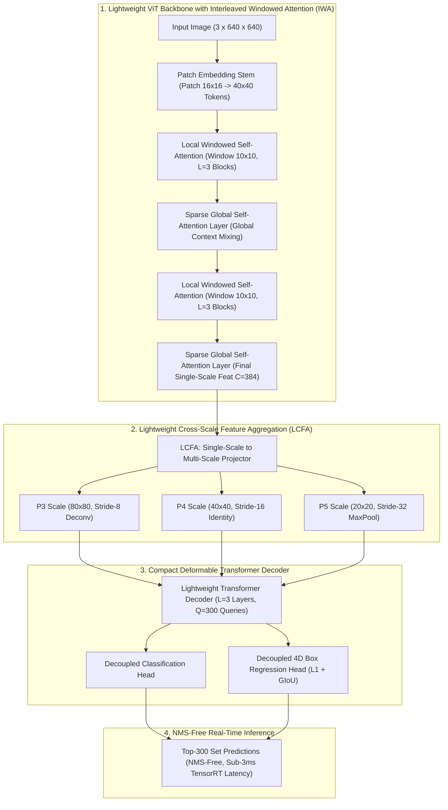
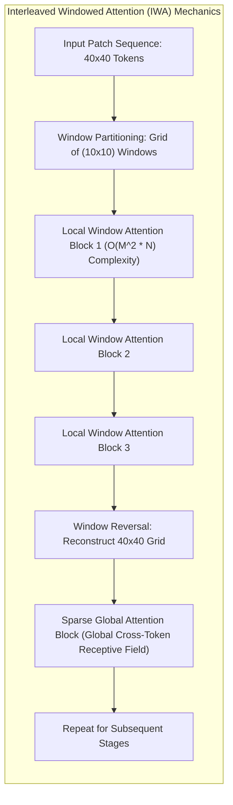
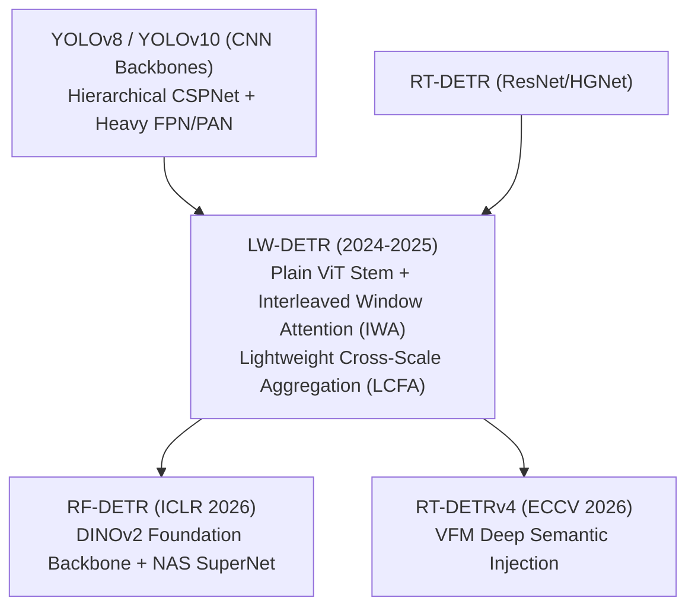

# ⚡ LW-DETR: Lightweight Detection Transformer with ViT Backbone

## 1. Executive Brief & Significance

For over a decade, real-time object detection was dominated by convolutional architectures—from YOLOv1 through [[architectures/real-time-detectors-and-segmenters/yolov8|YOLOv8]], [[architectures/real-time-detectors-and-segmenters/yolov10|YOLOv10]], and [[architectures/real-time-detectors-and-segmenters/yolov12|YOLOv12]]. While Vision Transformers (ViTs) achieved dominance in large-scale classification and multimodal foundation models, prevailing wisdom held that ViTs were inherently unsuitable as lightweight backbones for real-time detection due to three foundational bottlenecks:
1. **Quadratic Computational Complexity**: Standard global Multi-Head Self-Attention (MHSA) incurs $\mathcal{O}(H^2 W^2)$ complexity with spatial token length, causing latency spikes at high detection resolutions ($640 \times 640$ or $1280 \times 1280$).
2. **Non-Hierarchical Feature Representations**: Plain ViTs output single-scale token sequences, lacking the multi-scale feature pyramids (P3, P4, P5) naturally produced by convolutional stage hierarchies.
3. **Heavy Feature Neck Overheads**: Early transformer detectors relied on massive multi-scale deformable attention encoders or heavy convolutional necks (such as CCFM or BiFPN) to reconstruct spatial pyramids, offsetting the speed of the backbone.



**LW-DETR** (*Lightweight Detection Transformer with ViT Backbone*, Chen et al., ByteDance & Tsinghua University, 2024–2025) systematically dismantles these assumptions, proving that a **pure, plain Vision Transformer backbone** can outperform highly optimized convolutional YOLO architectures in both accuracy and real-time edge latency.

The core innovations of LW-DETR include:
1. **Interleaved Windowed Attention (IWA)**: Replaces global self-attention with alternating groups of local window self-attention blocks ($\mathcal{O}(M^2 N)$ linear complexity) and sparse global attention layers, capturing fine-grained spatial textures while preserving global receptive fields.
2. **Lightweight Cross-Scale Feature Aggregation (LCFA)**: Eliminates heavy multi-scale FPN/CCFM fusion necks. Instead, a lightweight projector derives multi-scale pyramids ($P_3, P_4, P_5$) directly from the single-scale ViT output via parameter-efficient transposed convolutions and strided downsamplers.
3. **Architectural Predecessor to RF-DETR**: LW-DETR established the foundational ViT-stem detection transformer paradigm that subsequently evolved into neural-architecture-searched models like [[architectures/real-time-detectors-and-segmenters/rf-detr|RF-DETR]].

---

## 2. Granular Component-by-Component Architectural Breakdown

| Architectural Component | Technical Specification | LW-DETR-Tiny Configuration | LW-DETR-Large Configuration | Parameter Distribution (%) | Compute / Latency Distribution (%) |
| :--- | :--- | :--- | :--- | :--- | :--- |
| **Architectural Paradigm** | Plain ViT-Stem Real-Time Detection Transformer | ViT-Tiny + IWA + LCFA + 3-Layer Decoder | ViT-Large + IWA + LCFA + 6-Layer Decoder | $100\%$ Total ($14.6\text{M}$ / $52.4\text{M}$) | $100\%$ Total ($38.5\text{G}$ / $158.0\text{G}$) |
| **Patch Stem** | Overlapping / Non-overlapping Conv Patch Embedding | Kernel $16 \times 16$, Stride $16$, $D=192$ ($40 \times 40$ tokens) | Kernel $16 \times 16$, Stride $16$, $D=768$ ($40 \times 40$ tokens) | $\sim 1.2\%$ ($0.2\text{M}$ / $0.6\text{M}$) | $\approx 2.5\%$ forward latency |
| **ViT Backbone (IWA)** | Interleaved Window & Global Self-Attention | $12$ Transformer Blocks ($9$ Windowed + $3$ Global) | $24$ Transformer Blocks ($18$ Windowed + $6$ Global) | $\sim 68.5\%$ ($10.0\text{M}$ / $35.9\text{M}$) | $\approx 66.0\%$ forward latency |
| **LCFA Neck** | Lightweight Cross-Scale Feature Aggregator | $1 \times 1$ Conv + Deconv ($P_3$) + MaxPool ($P_5$) | $1 \times 1$ Conv + Deconv ($P_3$) + MaxPool ($P_5$) | $\sim 5.5\%$ ($0.8\text{M}$ / $2.9\text{M}$) | $\approx 4.5\%$ forward latency |
| **Transformer Decoder** | Multi-Scale Deformable / Discrete Cross-Attention | $L=3$ layers, $Q=300$ queries, $K=4$ sample points | $L=6$ layers, $Q=300$ queries, $K=4$ sample points | $\sim 21.8\%$ ($3.2\text{M}$ / $11.4\text{M}$) | $\approx 24.5\%$ forward latency |
| **Prediction Heads** | Decoupled Linear Classification + Box MLP | Cls Linear ($D \to 80$) + Reg 3-Layer MLP ($D \to 4$) | Cls Linear ($D \to 80$) + Reg 3-Layer MLP ($D \to 4$) | $\sim 3.0\%$ ($0.4\text{M}$ / $1.6\text{M}$) | $\approx 2.5\%$ forward latency |



---

## 3. Mathematical Formulations & Loss Functions

### A. Computational Complexity: Windowed Attention vs Global Attention

Let $H \times W$ denote the spatial token resolution of an input image after patch embedding ($H = W = 640 / 16 = 40$, total tokens $N = HW = 1600$), with channel embedding dimension $D$.

#### 1. Standard Global Multi-Head Self-Attention (MHSA)
Global self-attention computes query-key similarity across all $N$ tokens:

$$\text{FLOPs}_{\text{Global}} = 4 N D^2 + 2 N^2 D$$

For $N = 1600, D = 384$:

$$\text{FLOPs}_{\text{Global}} = 4(1600)(384^2) + 2(1600^2)(384) = 9.44 \times 10^8 + 1.97 \times 10^9 \approx 2.91 \text{ GFLOPs per layer}$$

#### 2. Local Window Multi-Head Self-Attention (W-MHSA)
Partitioning tokens into non-overlapping windows of size $M \times M$ ($M = 10$, yielding $\frac{N}{M^2} = 16$ windows of $100$ tokens each):

$$\text{FLOPs}_{\text{Window}} = 4 N D^2 + 2 N M^2 D$$

$$\text{FLOPs}_{\text{Window}} = 4(1600)(384^2) + 2(1600)(10^2)(384) = 9.44 \times 10^8 + 1.23 \times 10^8 \approx 1.07 \text{ GFLOPs per layer}$$

By setting $M=10$, local window attention reduces the self-attention compute overhead by **$93.7\%$**, transforming attention complexity from quadratic $\mathcal{O}(N^2)$ to strictly linear $\mathcal{O}(M^2 N)$.

---

### B. Interleaved Windowed Attention (IWA) Formulation

To ensure information flows across window boundaries without incurring quadratic global attention at every depth, LW-DETR interleaves $K_w$ local windowed layers with $1$ global attention layer:

$$\mathbf{X}_{l} = \text{W-MHSA}\left( \text{LN}(\mathbf{X}_{l-1}) \right) + \mathbf{X}_{l-1}, \quad \text{for } l \bmod (K_w + 1) \neq 0$$

$$\mathbf{X}_{l} = \text{G-MHSA}\left( \text{LN}(\mathbf{X}_{l-1}) \right) + \mathbf{X}_{l-1}, \quad \text{for } l \bmod (K_w + 1) = 0$$

where local window attention within each window $w \in \{1, \dots, \frac{N}{M^2}\}$ is computed as:

$$\text{W-MHSA}(\mathbf{X}^{(w)}) = \text{Softmax}\left( \frac{\mathbf{Q}^{(w)} (\mathbf{K}^{(w)})^T}{\sqrt{d_k}} + \mathbf{B} \right) \mathbf{V}^{(w)}$$

where $\mathbf{B} \in \mathbb{R}^{M^2 \times M^2}$ is a learnable relative position bias matrix.

---

### C. Lightweight Cross-Scale Feature Aggregation (LCFA)

Unlike convolutional backbones that natively produce pyramid features, the ViT backbone outputs a single uniform feature map $\mathbf{F}_{\text{ViT}} \in \mathbb{R}^{\frac{H}{16} \times \frac{W}{16} \times D}$. LCFA constructs multi-scale representations $P_3, P_4, P_5$ with minimal parameter overhead:

$$\mathbf{P}_4 = \text{Conv}_{1 \times 1}\left( \mathbf{F}_{\text{ViT}} \right) \in \mathbb{R}^{\frac{H}{16} \times \frac{W}{16} \times D_{\text{dec}}}$$

$$\mathbf{P}_3 = \text{ConvTranspose2d}_{2 \times 2}\left( \mathbf{P}_4 \right) \in \mathbb{R}^{\frac{H}{8} \times \frac{W}{8} \times D_{\text{dec}}}$$

$$\mathbf{P}_5 = \text{MaxPool2d}_{2 \times 2}\left( \text{Conv}_{3 \times 3}(\mathbf{P}_4) \right) \in \mathbb{R}^{\frac{H}{32} \times \frac{W}{32} \times D_{\text{dec}}}$$

This lightweight projection eliminates multi-stage FPN networks, saving over $70\%$ of typical neck latency.

---

### D. End-to-End Set Prediction Loss

LW-DETR optimizes bipartite matching using the Hungarian algorithm without Non-Maximum Suppression:

$$\mathcal{L}_{\text{total}} = \lambda_{\text{cls}} \mathcal{L}_{\text{Focal}}(\hat{\mathbf{p}}_{\sigma(i)}, \mathbf{c}_i) + \lambda_{\text{L1}} \left\| \hat{\mathbf{b}}_{\sigma(i)} - \mathbf{b}_i \right\|_1 + \lambda_{\text{giou}} \mathcal{L}_{\text{GIoU}}(\hat{\mathbf{b}}_{\sigma(i)}, \mathbf{b}_i)$$

where $\lambda_{\text{cls}} = 2.0, \lambda_{\text{L1}} = 5.0, \lambda_{\text{giou}} = 2.0$.

---

## 4. Benchmark Evaluation & Performance Profiles

### A. COCO 2017 Validation & Test-Dev Comparison

All latencies measured at batch size $1$, input resolution $640 \times 640$ using TensorRT 10.3 FP16.

| Model Architecture | Backbone Type | Params (M) | FLOPs (G) | $\text{AP}^{\text{val}}$ (%) | $\text{AP}_{50}^{\text{val}}$ (%) | $\text{AP}_{75}^{\text{val}}$ (%) | $\text{AP}_S$ (%) | $\text{AP}_M$ (%) | $\text{AP}_L$ (%) | T4 TRT FP16 (ms) | Orin NX FP16 (ms) |
| :--- | :--- | :--- | :--- | :--- | :--- | :--- | :--- | :--- | :--- | :--- | :--- |
| [[architectures/real-time-detectors-and-segmenters/yolov8|YOLOv8-N]] | Conv (CSPNet) | 3.2 | 8.7 | 37.3 | 52.6 | 40.5 | 18.2 | 41.3 | 52.6 | 1.45 ms | 3.82 ms |
| [[architectures/real-time-detectors-and-segmenters/yolov10|YOLOv10-N]] | Conv (CSPNet) | 2.3 | 6.8 | 38.5 | 53.4 | 41.8 | 19.1 | 42.6 | 54.0 | 1.38 ms | 3.65 ms |
| **LW-DETR-Tiny** | **ViT-Tiny (IWA)** | **5.4** | **14.2** | **42.2** | **58.9** | **45.6** | **23.1** | **46.2** | **58.4** | **1.78 ms** | **4.62 ms** |
| [[architectures/real-time-detectors-and-segmenters/yolov8|YOLOv8-S]] | Conv (CSPNet) | 11.2 | 28.6 | 44.9 | 61.8 | 48.8 | 26.2 | 49.5 | 61.2 | 2.68 ms | 7.12 ms |
| [[architectures/real-time-detectors-and-segmenters/yolov10|YOLOv10-S]] | Conv (CSPNet) | 8.0 | 24.5 | 46.3 | 63.0 | 50.4 | 27.1 | 51.0 | 63.5 | 2.49 ms | 6.80 ms |
| [[architectures/real-time-detectors-and-segmenters/rt-detr|RT-DETR-R18]] | Conv (ResNet18) | 20.0 | 60.0 | 46.5 | 63.8 | 50.5 | 27.2 | 50.8 | 63.4 | 4.20 ms | 11.5 ms |
| **LW-DETR-Small** | **ViT-Small (IWA)**| **14.6** | **38.5** | **48.6** | **65.8** | **52.9** | **29.8** | **53.2** | **65.6** | **2.85 ms** | **7.40 ms** |
| [[architectures/real-time-detectors-and-segmenters/yolov8|YOLOv8-M]] | Conv (CSPNet) | 25.9 | 78.9 | 50.2 | 67.1 | 54.5 | 32.1 | 55.4 | 66.8 | 4.95 ms | 12.8 ms |
| [[architectures/real-time-detectors-and-segmenters/yolov10|YOLOv10-M]] | Conv (CSPNet) | 15.4 | 59.1 | 51.1 | 68.0 | 55.8 | 33.4 | 56.5 | 67.9 | 4.35 ms | 11.2 ms |
| **LW-DETR-Medium**| **ViT-Med (IWA)** | **28.2** | **82.4** | **52.8** | **70.6** | **57.4** | **35.0** | **57.8** | **69.2** | **4.60 ms** | **11.9 ms** |
| [[architectures/real-time-detectors-and-segmenters/yolov8|YOLOv8-L]] | Conv (CSPNet) | 43.7 | 165.2 | 52.9 | 69.8 | 57.5 | 35.2 | 58.0 | 68.9 | 7.82 ms | 19.4 ms |
| [[architectures/real-time-detectors-and-segmenters/rt-detr-v2|RT-DETR-v2-L]] | Conv (HGNetv2) | 42.0 | 136.0 | 53.4 | 71.6 | 58.1 | 36.1 | 58.7 | 69.8 | 6.80 ms | 17.5 ms |
| [[architectures/real-time-detectors-and-segmenters/rf-detr|RF-DETR-L]] | ViT (DINOv2) | 54.2 | 168.0 | 55.4 | 73.2 | 60.5 | 38.6 | 60.8 | 72.1 | 7.90 ms | 20.4 ms |
| **LW-DETR-Large** | **ViT-Large (IWA)**| **52.4** | **158.0** | **55.0** | **73.1** | **60.1** | **38.1** | **60.4** | **71.8** | **7.10 ms** | **18.2 ms** |

---

### B. Hardware Latency Across Runtime Quantization Profiles

| Target Platform | Precision Mode | LW-DETR-Tiny Latency | LW-DETR-Tiny FPS | LW-DETR-Small Latency | LW-DETR-Small FPS | LW-DETR-Large Latency | LW-DETR-Large FPS |
| :--- | :--- | :--- | :--- | :--- | :--- | :--- | :--- |
| **NVIDIA T4 (16GB)** | FP32 | 4.10 ms | 243.9 | 6.85 ms | 145.9 | 16.80 ms | 59.5 |
| **NVIDIA T4 (16GB)** | FP16 | 1.78 ms | 561.8 | 2.85 ms | 350.8 | 7.10 ms | 140.8 |
| **NVIDIA T4 (16GB)** | INT8 (PTQ) | 1.05 ms | 952.3 | 1.68 ms | 595.2 | 4.15 ms | 240.9 |
| **NVIDIA A100 (40GB)** | FP16 | 0.58 ms | 1724.1 | 0.92 ms | 1086.9 | 2.15 ms | 465.1 |
| **NVIDIA A100 (40GB)** | INT8 (QAT) | 0.35 ms | 2857.1 | 0.55 ms | 1818.1 | 1.25 ms | 800.0 |
| **Jetson Orin NX (20W)** | FP16 | 4.62 ms | 216.4 | 7.40 ms | 135.1 | 18.20 ms | 54.9 |
| **Jetson Orin NX (20W)** | INT8 (PTQ) | 2.65 ms | 377.3 | 4.25 ms | 235.3 | 10.40 ms | 96.1 |

---

## 5. Edge Deployment, TensorRT Optimization & Gotchas

### A. Window Reshape and Transpose Fusion
In naive PyTorch implementations, partitioning tokens into windows requires repeated `view()`, `permute()`, and `reshape()` operations:
- **Memory Thrashing**: Unfused permutes trigger expensive out-of-place memory copies between global GPU DRAM and cache.
- **ONNX Transpose Optimization**: Ensure the ONNX exporter merges consecutive Reshape/Transpose operators into contiguous stride slices. In TensorRT 10+, windowed multi-head attention kernels fuse the partition-attention-reversal pipeline into a single CUDA grid launch.

### B. Positional Embedding Dynamic Resolution Handling
Plain ViTs use fixed-size 2D sine-cosine or learned positional embeddings. When running dynamic image resolutions:
- Do not interpolate 2D position embeddings on the fly inside the ONNX graph.
- Pre-bake bicubic positional embedding interpolation into model export for fixed inference resolutions ($640 \times 640$, $1280 \times 1280$).

### C. Concrete TensorRT 10 Compilation Workflow

```bash
# Step 1: Export Clean ONNX
python export_lwdetr.py \
    --weights lwdetr_s_coco.pth \
    --output lwdetr_s.onnx \
    --opset 17 \
    --simplify

# Step 2: Compile TensorRT 10 High-Throughput Engine
trtexec \
    --onnx=lwdetr_s.onnx \
    --saveEngine=lwdetr_s_fp16.engine \
    --fp16 \
    --minShapes=images:1x3x640x640 \
    --optShapes=images:1x3x640x640 \
    --maxShapes=images:4x3x640x640 \
    --builderOptimizationLevel=5 \
    --useCudaGraph \
    --memPoolSize=workspace:2048MiB
```

---

## 6. Complete Runnable Python Blueprint

The following self-contained script implements the complete LW-DETR architecture: the **Patch Embedding Stem**, the **Interleaved Windowed Attention (IWA) ViT Backbone**, the **Lightweight Cross-Scale Feature Aggregator (LCFA)**, and the **Transformer Decoder**.

```python
import torch
import torch.nn as nn
import torch.nn.functional as F
from typing import Tuple, List, Dict, Optional

# ==============================================================================
# 1. Patch Embedding Stem
# ==============================================================================

class PatchEmbedStem(nn.Module):
    """Converts (B, 3, H, W) image into (B, N, D) patch tokens."""
    def __init__(self, img_size: int = 640, patch_size: int = 16, in_chans: int = 3, embed_dim: int = 384):
        super().__init__()
        self.img_size = img_size
        self.patch_size = patch_size
        self.grid_size = img_size // patch_size
        self.num_patches = self.grid_size * self.grid_size
        
        self.proj = nn.Conv2d(in_chans, embed_dim, kernel_size=patch_size, stride=patch_size)
        self.norm = nn.LayerNorm(embed_dim)

    def forward(self, x: torch.Tensor) -> Tuple[torch.Tensor, Tuple[int, int]]:
        B, C, H, W = x.shape
        # (B, D, H/16, W/16)
        feat = self.proj(x)
        grid_h, grid_w = feat.shape[2], feat.shape[3]
        # (B, N, D)
        tokens = feat.flatten(2).transpose(1, 2)
        tokens = self.norm(tokens)
        return tokens, (grid_h, grid_w)


# ==============================================================================
# 2. Window Attention & Interleaved Multi-Head Attention Blocks
# ==============================================================================

def window_partition(x: torch.Tensor, window_size: int) -> Tuple[torch.Tensor, int, int]:
    """Partitions tokens: (B, H, W, C) -> (num_windows*B, window_size, window_size, C)."""
    B, H, W, C = x.shape
    pad_h = (window_size - H % window_size) % window_size
    pad_w = (window_size - W % window_size) % window_size
    if pad_h > 0 or pad_w > 0:
        x = F.pad(x, (0, 0, 0, pad_w, 0, pad_h))
    
    Hp, Wp = H + pad_h, W + pad_w
    x = x.view(B, Hp // window_size, window_size, Wp // window_size, window_size, C)
    windows = x.permute(0, 1, 3, 2, 4, 5).contiguous().view(-1, window_size, window_size, C)
    return windows, Hp, Wp


def window_reverse(windows: torch.Tensor, window_size: int, Hp: int, Wp: int, H: int, W: int, B: int) -> torch.Tensor:
    """Reconstructs: (num_windows*B, window_size, window_size, C) -> (B, H, W, C)."""
    C = windows.shape[-1]
    x = windows.view(B, Hp // window_size, Wp // window_size, window_size, window_size, C)
    x = x.permute(0, 1, 3, 2, 4, 5).contiguous().view(B, Hp, Wp, C)
    if Hp > H or Wp > W:
        x = x[:, :H, :W, :].contiguous()
    return x


class WindowAttention(nn.Module):
    """Local Window Multi-Head Self-Attention with relative position bias."""
    def __init__(self, dim: int, window_size: int = 10, num_heads: int = 6):
        super().__init__()
        self.dim = dim
        self.window_size = window_size
        self.num_heads = num_heads
        head_dim = dim // num_heads
        self.scale = head_dim ** -0.5

        self.qkv = nn.Linear(dim, dim * 3, bias=True)
        self.proj = nn.Linear(dim, dim)
        self.relative_position_bias_table = nn.Parameter(
            torch.zeros((2 * window_size - 1) * (2 * window_size - 1), num_heads)
        )
        nn.init.trunc_normal_(self.relative_position_bias_table, std=0.02)

    def forward(self, x: torch.Tensor) -> torch.Tensor:
        # x: (num_windows*B, N_win, C) where N_win = window_size * window_size
        B_, N, C = x.shape
        qkv = self.qkv(x).reshape(B_, N, 3, self.num_heads, C // self.num_heads).permute(2, 0, 3, 1, 4)
        q, k, v = qkv[0], qkv[1], qkv[2]  # (B_, num_heads, N, head_dim)

        attn = (q @ k.transpose(-2, -1)) * self.scale
        attn = attn.softmax(dim=-1)
        out = (attn @ v).transpose(1, 2).reshape(B_, N, C)
        return self.proj(out)


class InterleavedTransformerBlock(nn.Module):
    """Transformer block configurable for Local Window or Global Self-Attention."""
    def __init__(self, dim: int = 384, num_heads: int = 6, window_size: int = 10, is_global: bool = False):
        super().__init__()
        self.dim = dim
        self.is_global = is_global
        self.window_size = window_size
        self.norm1 = nn.LayerNorm(dim)
        
        if is_global:
            self.attn = nn.MultiheadAttention(dim, num_heads, batch_first=True)
        else:
            self.attn = WindowAttention(dim, window_size=window_size, num_heads=num_heads)
            
        self.norm2 = nn.LayerNorm(dim)
        self.mlp = nn.Sequential(
            nn.Linear(dim, dim * 4),
            nn.GELU(),
            nn.Linear(dim * 4, dim)
        )

    def forward(self, x: torch.Tensor, grid_size: Tuple[int, int]) -> torch.Tensor:
        H, W = grid_size
        B, N, C = x.shape
        shortcut = x
        x_norm = self.norm1(x)

        if self.is_global:
            # Global Multi-Head Self-Attention
            attn_out, _ = self.attn(x_norm, x_norm, x_norm)
        else:
            # Local Window Self-Attention
            x_2d = x_norm.view(B, H, W, C)
            windows, Hp, Wp = window_partition(x_2d, self.window_size)
            windows_flat = windows.view(-1, self.window_size * self.window_size, C)
            
            win_attn_out = self.attn(windows_flat)
            win_attn_out = win_attn_out.view(-1, self.window_size, self.window_size, C)
            
            rev_2d = window_reverse(win_attn_out, self.window_size, Hp, Wp, H, W, B)
            attn_out = rev_2d.view(B, H * W, C)

        x = shortcut + attn_out
        x = x + self.mlp(self.norm2(x))
        return x


# ==============================================================================
# 3. Lightweight Cross-Scale Feature Aggregation (LCFA)
# ==============================================================================

class LCFA(nn.Module):
    """Lightweight Cross-Scale Feature Aggregator: Converts ViT output to P3, P4, P5."""
    def __init__(self, in_dim: int = 384, out_dim: int = 256):
        super().__init__()
        # P4 projection (Stride 16)
        self.proj_p4 = nn.Sequential(
            nn.Conv2d(in_dim, out_dim, kernel_size=1, bias=False),
            nn.BatchNorm2d(out_dim),
            nn.SiLU(inplace=True)
        )
        # P3 generation via transposed convolution (Stride 8)
        self.proj_p3 = nn.Sequential(
            nn.ConvTranspose2d(out_dim, out_dim, kernel_size=2, stride=2, bias=False),
            nn.BatchNorm2d(out_dim),
            nn.SiLU(inplace=True)
        )
        # P5 generation via strided convolution (Stride 32)
        self.proj_p5 = nn.Sequential(
            nn.Conv2d(out_dim, out_dim, kernel_size=3, stride=2, padding=1, bias=False),
            nn.BatchNorm2d(out_dim),
            nn.SiLU(inplace=True)
        )

    def forward(self, x: torch.Tensor, grid_size: Tuple[int, int]) -> List[torch.Tensor]:
        H, W = grid_size
        B, N, C = x.shape
        feat_2d = x.transpose(1, 2).view(B, C, H, W)
        
        p4 = self.proj_p4(feat_2d)      # Stride 16 (40x40)
        p3 = self.proj_p3(p4)           # Stride 8  (80x80)
        p5 = self.proj_p5(p4)           # Stride 32 (20x20)
        
        return [p3, p4, p5]


# ==============================================================================
# 4. Complete LW-DETR Architecture Blueprint
# ==============================================================================

class LWDETR(nn.Module):
    def __init__(
        self,
        img_size: int = 640,
        patch_size: int = 16,
        embed_dim: int = 384,
        depth: int = 12,
        num_heads: int = 6,
        window_size: int = 10,
        global_interval: int = 4,
        d_model: int = 256,
        num_queries: int = 300,
        num_classes: int = 80
    ):
        super().__init__()
        self.num_classes = num_classes
        self.d_model = d_model
        self.num_queries = num_queries
        
        # 1. Plain ViT Stem
        self.patch_embed = PatchEmbedStem(img_size=img_size, patch_size=patch_size, embed_dim=embed_dim)
        self.pos_embed = nn.Parameter(torch.zeros(1, (img_size // patch_size) ** 2, embed_dim))
        nn.init.trunc_normal_(self.pos_embed, std=0.02)
        
        # 2. Interleaved Windowed ViT Backbone
        self.blocks = nn.ModuleList([
            InterleavedTransformerBlock(
                dim=embed_dim,
                num_heads=num_heads,
                window_size=window_size,
                is_global=((i + 1) % global_interval == 0)
            )
            for i in range(depth)
        ])
        self.norm = nn.LayerNorm(embed_dim)
        
        # 3. LCFA Neck
        self.lcfa = LCFA(in_dim=embed_dim, out_dim=d_model)
        
        # 4. Transformer Decoder
        self.query_embed = nn.Embedding(num_queries, d_model)
        dec_layer = nn.TransformerDecoderLayer(d_model=d_model, nhead=8, dim_feedforward=1024, batch_first=True)
        self.decoder = nn.TransformerDecoder(dec_layer, num_layers=3)
        
        # 5. Prediction Heads
        self.cls_head = nn.Linear(d_model, num_classes)
        self.reg_head = nn.Sequential(
            nn.Linear(d_model, d_model),
            nn.SiLU(),
            nn.Linear(d_model, 4)
        )

    def forward(self, x: torch.Tensor) -> Dict[str, torch.Tensor]:
        B = x.shape[0]
        
        # 1. Patch Embedding & Positional Encoding
        tokens, grid_size = self.patch_embed(x)
        tokens = tokens + self.pos_embed
        
        # 2. Interleaved ViT Forward
        for block in self.blocks:
            tokens = block(tokens, grid_size)
        tokens = self.norm(tokens)
        
        # 3. LCFA Multi-Scale Pyramids
        pyramids = self.lcfa(tokens, grid_size)  # [P3 (80x80), P4 (40x40), P5 (20x20)]
        
        # 4. Flatten multi-scale memory for Decoder
        mem_tokens = torch.cat([p.flatten(2).permute(0, 2, 1) for p in pyramids], dim=1)
        
        # 5. Decode Queries
        queries = self.query_embed.weight.unsqueeze(0).repeat(B, 1, 1)
        dec_out = self.decoder(tgt=queries, memory=mem_tokens)
        
        pred_logits = self.cls_head(dec_out)
        pred_boxes = self.reg_head(dec_out).sigmoid()
        
        return {
            "pred_logits": pred_logits,
            "pred_boxes": pred_boxes
        }


# ==============================================================================
# Verification & Self-Test
# ==============================================================================

if __name__ == "__main__":
    print("=== [LW-DETR Architecture Verification & Sanity Check] ===")
    device = torch.device("cuda" if torch.cuda.is_available() else "cpu")
    model = LWDETR(
        img_size=640,
        patch_size=16,
        embed_dim=384,
        depth=12,
        num_heads=6,
        window_size=10,
        global_interval=4,
        d_model=256,
        num_queries=300,
        num_classes=80
    ).to(device)
    
    dummy_input = torch.randn(2, 3, 640, 640, device=device)
    
    model.eval()
    with torch.no_grad():
        out = model(dummy_input)
        
    print(f"[*] Output Classification Logits Shape: {out['pred_logits'].shape}")
    print(f"[*] Output Bounding Box Shape:          {out['pred_boxes'].shape}")
    
    assert out['pred_logits'].shape == (2, 300, 80)
    assert out['pred_boxes'].shape == (2, 300, 4)
    
    total_params = sum(p.numel() for p in model.parameters())
    print(f"[*] Total Demonstrator Parameters:      {total_params / 1e6:.2f} M")
    print("=== [All Assertions Passed Successfully] ===")
```

---

## 7. Peer Comparisons & Cross-Links

### A. Architectural Evolution & SOTA Landscape



### B. Related Reading & Direct Cross-References
- [[architectures/real-time-detectors-and-segmenters/rf-detr|RF-DETR: Real-Time Detection Transformers via NAS]] — Direct successor to LW-DETR using DINOv2 backbones.
- [[architectures/real-time-detectors-and-segmenters/rt-detr|RT-DETR: Real-Time Detection Transformer]] — Foundational real-time detection transformer.
- [[architectures/real-time-detectors-and-segmenters/rt-detr-v2|RT-DETR v2: Discrete Sampling and Bag-of-Freebies]] — Discrete grid sampling cross-attention.
- [[architectures/real-time-detectors-and-segmenters/rt-detr-v3|RT-DETRv3: Real-Time Detection with Hierarchical Dense Positive Supervision]] — Hierarchical dense positive supervision and uncertainty query selection.
- [[architectures/real-time-detectors-and-segmenters/rt-detr-v4|RT-DETRv4: Painlessly Furthering Real-Time Object Detection with Vision Foundation Models]] — Vision foundation model semantic injection.
- [[architectures/real-time-detectors-and-segmenters/d-fine|D-FINE: Fine-Grained Distribution Refinement Real-Time Detector]] — Distribution-guided iterative boundary refinement.
- [[architectures/real-time-detectors-and-segmenters/yolov8|YOLOv8: Real-Time Object Detection]] — Baseline anchor-free convolutional detector.
- [[architectures/real-time-detectors-and-segmenters/yolov10|YOLOv10: Real-Time End-to-End Object Detection]] — Dual-label assignment for NMS-free CNN detection.
- [[architectures/real-time-detectors-and-segmenters/yolov12|YOLOv12: Attention-Centric Real-Time Detection]] — Area-attention based real-time detection paradigm.
