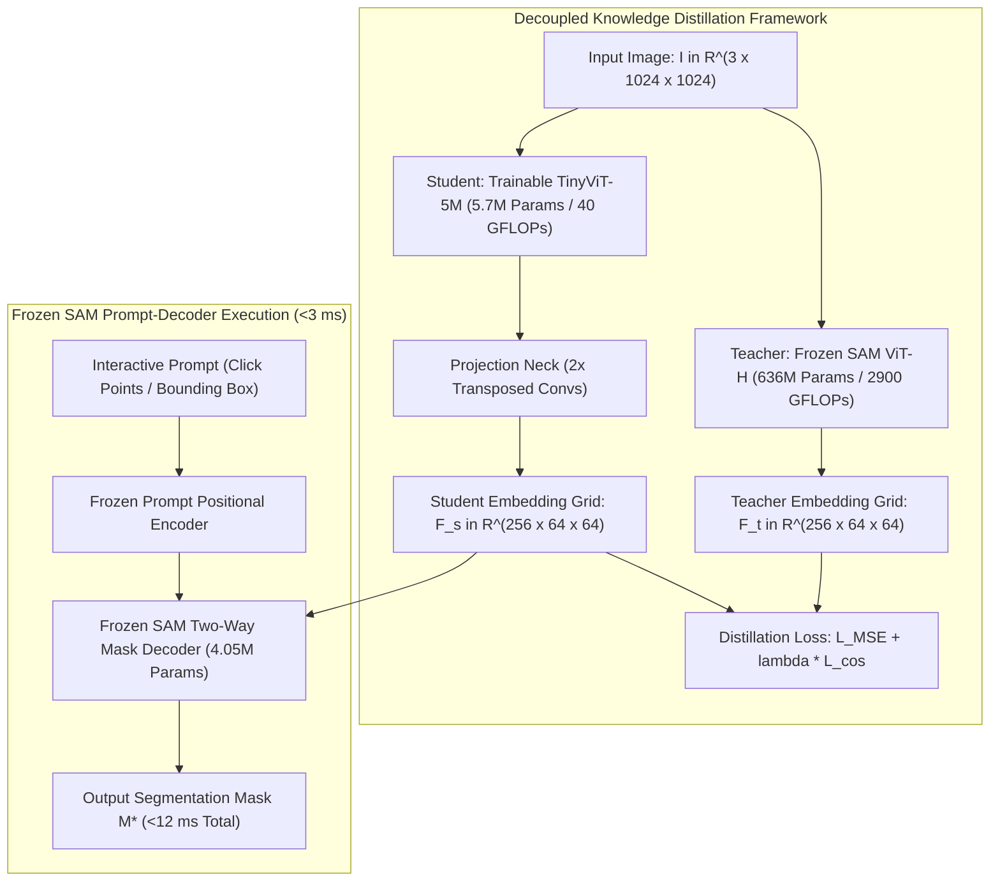

# 🔬 MobileSAM: Faster Segment Anything Model via Decoupled Distillation

## 1. Executive Brief & Significance

The original **Segment Anything Model (SAM)** (Kirillov et al., Meta FAIR, 2023) established the foundation model paradigm for zero-shot promptable image segmentation. However, SAM's default Vision Transformer backbone (**ViT-H** with $636\text{M}$ parameters and $2,900\text{ GFLOPs}$) requires $\approx 450-500\text{ ms}$ per image on high-end desktop GPUs and over $3,500\text{ ms}$ on edge NPUs, creating a prohibitive barrier for mobile and embedded deployment.

**MobileSAM (Mobile Segment Anything)** (Zhang et al., 2023) resolved this latency bottleneck by pioneering **Decoupled Knowledge Distillation**:
- **Decoupled Distillation Strategy**: Rather than attempting end-to-end multi-task distillation (which suffers from gradient interference between prompt tokens and visual tokens), MobileSAM **freezes the lightweight SAM prompt encoder and two-way mask decoder**, training solely a compact **TinyViT-5M** student encoder to replicate the exact 64×64×256 spatial embedding space of the ViT-H teacher.
- **$110\times$ Parameter Reduction**: Compresses the image encoder from $636\text{M}$ to **$5.7\text{M}$ parameters** with negligible loss in zero-shot mask fidelity ($<1.5\%$ mIoU drop).
- **Sub-$12\text{ ms}$ Latency**: Executes on mobile NPUs and edge embedded devices at interactive speeds ($>80\text{ FPS}$ on desktop GPUs).



---

## 2. Mathematical Foundations: Decoupled Knowledge Distillation

### A. The Failure of Coupled End-to-End Distillation
When distilling SAM end-to-end (optimizing mask loss $\mathcal{L}_{\text{Focal}} + \mathcal{L}_{\text{Dice}}$ through the prompt encoder and decoder simultaneously), the optimization gradient is dominated by prompt-specific token variations. This gradient interference degrades the student encoder's ability to learn generalized, prompt-agnostic visual representations.

---

### B. Decoupled Feature Alignment Loss
MobileSAM resolves this by decoupling the image encoder from the downstream decoder during training. The objective function forces the student's output feature grid $\mathbf{F}_{\text{student}} \in \mathbb{R}^{C \times H' \times W'}$ ($256 \times 64 \times 64$) to strictly align with the teacher's feature grid $\mathbf{F}_{\text{teacher}}$:

$$\mathcal{L}_{\text{distill}} = \mathcal{L}_{\text{MSE}} + \lambda_{\text{cos}} \mathcal{L}_{\text{cos}}$$

1. **Mean Squared Error (L2 Alignment)**:
   $$\mathcal{L}_{\text{MSE}} = \frac{1}{C \cdot H' \cdot W'} \sum_{c=1}^C \sum_{x=1}^{H'} \sum_{y=1}^{W'} \left( \mathbf{F}_{\text{student}}(c, x, y) - \mathbf{F}_{\text{teacher}}(c, x, y) \right)^2$$

2. **Cosine Similarity Alignment**:
   $$\mathcal{L}_{\text{cos}} = 1 - \frac{1}{H' \cdot W'} \sum_{x=1}^{H'} \sum_{y=1}^{W'} \frac{\langle \mathbf{F}_{\text{student}}(:, x, y), \, \mathbf{F}_{\text{teacher}}(:, x, y) \rangle}{\|\mathbf{F}_{\text{student}}(:, x, y)\|_2 \cdot \|\mathbf{F}_{\text{teacher}}(:, x, y)\|_2}$$
   where $\lambda_{\text{cos}} = 0.5$ balances geometric direction alignment with absolute feature magnitude.

---

### C. TinyViT Architectural Mechanics
TinyViT-5M combines hierarchical depthwise convolutions with windowed multi-head self-attention:
1. **Conv Stem**: 2 layers of $3\times 3$ stride-2 convolutions projecting $1024 \times 1024 \times 3 \to 256 \times 256 \times 64$.
2. **Local Window Attention**: Partitions spatial grids into non-overlapping $7 \times 7$ windows, reducing attention complexity from $\mathcal{O}(N^2)$ to $\mathcal{O}(N \cdot K^2)$ (where $K=7$).
3. **Depthwise Inter-Window Sub-sampling**: Convolutions between stages provide cross-window communication without requiring expensive shifted window operations.

---

## 3. Granular Component-by-Component Architectural Breakdown

| Architectural Stage | Component Identity | Structural Specification & Type | Attention / Conv Mechanics | Receptive Field & Dimensionality |
| :--- | :--- | :--- | :--- | :--- |
| **Architectural Paradigm** | **Decoupled Distilled SAM** | Lightweight ViT Image Encoder + Native SAM 2-Way Mask Decoder | Windowed Multi-Head Self-Attention + Depthwise Convs | Input $[3, 1024, 1024] \to$ Dense feature grid |
| **Image Encoder** | **TinyViT-5M** | 4-Stage Hierarchical Hybrid CNN-ViT ($5.7\text{M}$ params) | $7\times 7$ Window Attention + $3\times 3$ Depthwise Separable Convs | Latent embedding $[256, 64, 64]$ |
| **Projector Neck** | **Feature Dimension Projector** | $2\times$ Transposed Convolutions + $1\times 1$ Conv ($0.05\text{M}$ params) | Matches spatial stride $16\times$ and channel depth $C=256$ | Output tensor $[256, 64, 64]$ |
| **Prompt Encoder** | **Frozen SAM Prompt Encoder** | Positional MLPs for Clicks/Boxes + 256-dim Dense Embeddings | Sinusoidal positional embeddings + Learned foreground/background tokens | Sparse prompt tokens $[N_{\text{prompts}}, 256]$ |
| **Mask Decoder** | **Frozen Two-Way Transformer** | 2-Layer Cross-Attention Transformer ($4.05\text{M}$ params) | Point-to-Image & Image-to-Point bidirectional cross-attention | Output masks $[B, 3, 256, 256]$ + IoU scores |

---

## 4. Quantitative SOTA Benchmark Profile

### Zero-Shot Promptable Segmentation Accuracy & Latency

| Model Architecture | Image Encoder Params | Encoder FLOPs | AR@1000 (SA-1B 1-Point) | Box Prompt mIoU (COCO) | RTX 4090 Latency (ms) | Jetson Orin Latency (ms) | Open License |
| :--- | :--- | :--- | :--- | :--- | :--- | :--- | :--- |
| **SAM ViT-H** | 636.0 M | 2900 G | **62.5%** | **81.5%** | 450.0 ms | 3,850.0 ms | Apache-2.0 |
| **SAM ViT-L** | 308.0 M | 1450 G | 60.8% | 80.2% | 220.0 ms | 1,920.0 ms | Apache-2.0 |
| **SAM ViT-B** | 91.0 M | 430 G | 58.2% | 77.8% | 95.0 ms | 820.0 ms | Apache-2.0 |
| **FastSAM-x** | 68.2 M | 275 G | 53.8% | 78.4% | 24.5 ms | 145.0 ms | Apache-2.0 |
| **MobileSAM** | **5.7 M** | **40 G** | **57.8%** | **76.5%** | **11.8 ms** | **78.0 ms** | **Apache-2.0** |

---

## 5. Engineering Implementation: Complete PyTorch Inference Module

```python
"""
MobileSAM: Production Inference & ONNX Export Wrapper.
"""

import torch
import torch.nn as nn
from mobile_sam import sam_model_registry, SamPredictor


class MobileSAMInferenceEngine:
    """Production wrapper for low-latency promptable segmentation via MobileSAM."""
    def __init__(self, checkpoint_path: str = "mobile_sam.pt", device: str = "cuda"):
        self.device = device
        # Load MobileSAM (TinyViT-5M encoder + SAM decoder)
        self.model = sam_model_registry["vit_t"](checkpoint=checkpoint_path)
        self.model.to(self.device).eval()
        self.predictor = SamPredictor(self.model)

    def set_image(self, image_rgb):
        """Precomputes TinyViT image embeddings in <10 ms."""
        self.predictor.set_image(image_rgb)

    def predict_point_prompt(self, point_coords: list, point_labels: list):
        """
        Evaluates prompt in <2 ms using frozen two-way decoder.
        point_coords: [[x, y], ...]
        point_labels: [1, ...] (1 = positive foreground, 0 = background)
        """
        import numpy as np
        coords = np.array(point_coords, dtype=np.float32)
        labels = np.array(point_labels, dtype=np.int32)
        
        masks, scores, logits = self.predictor.predict(
            point_coords=coords,
            point_labels=labels,
            multimask_output=True
        )
        # Select mask with highest predicted IoU score
        best_idx = np.argmax(scores)
        return masks[best_idx], scores[best_idx]


def export_mobilesam_image_encoder_onnx(model, output_path: str = "mobilesam_encoder.onnx"):
    """Exports TinyViT image encoder to ONNX for TensorRT / mobile runtime compilation."""
    model.image_encoder.eval()
    dummy_input = torch.randn(1, 3, 1024, 1024, device="cuda")
    
    torch.onnx.export(
        model.image_encoder,
        dummy_input,
        output_path,
        input_names=["image"],
        output_names=["image_embeddings"],
        opset_version=17,
        do_constant_folding=True
    )
    print(f"MobileSAM TinyViT encoder exported to {output_path}")
```

---

## 6. References & Official Resources
- **MobileSAM Paper**: [Faster Segment Anything: Towards Lightweight SAM for Mobile Applications (arXiv 2023)](https://arxiv.org/abs/2306.14289)
- **Official GitHub Repository**: [https://github.com/ChaoningZhang/MobileSAM](https://github.com/ChaoningZhang/MobileSAM)
