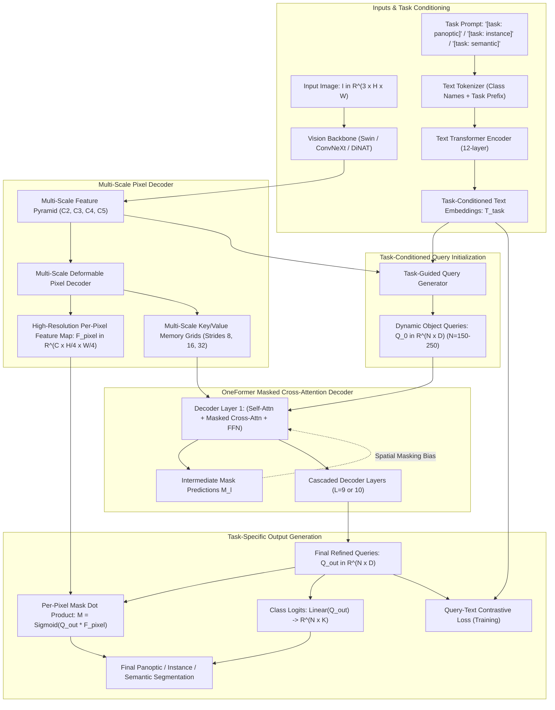
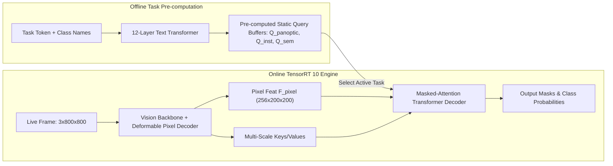

# 🌐 OneFormer: One Transformer to Rule Panoptic, Instance and Semantic Segmentation

## 1. Executive Brief & Significance

Image segmentation has historically been fragmented into three isolated sub-tasks: **Semantic Segmentation** (per-pixel category labeling), **Instance Segmentation** (per-object mask and boundary delineation), and **Panoptic Segmentation** (unifying "things" and "stuff"). While landmark universal models like [[architectures/real-time-detectors-and-segmenters/mask2former|Mask2Former]] established a shared architectural backbone, they still required **three completely independent training runs with distinct task-specific hyperparameter configurations and separate model weights**.

**OneFormer** (Jain et al., SHI Lab @ Oregon State & UIUC, CVPR 2023) introduced the first truly **universal multi-task segmentation framework**:
- **Single Model, Single Weight File, All Three Tasks**: OneFormer is trained jointly on semantic, instance, and panoptic segmentation under a single training regime. Switching between tasks at inference requires only changing a single conditioning prompt token (`[task: panoptic]`, `[task: instance]`, or `[task: semantic]`).
- **Task-Conditioned Query Initialization**: Object queries $\mathbf{Q} \in \mathbb{R}^{N \times D}$ are generated dynamically by conditioning text descriptions of dataset categories on a task token through a lightweight text encoder, replacing static learnable embeddings with task-aware semantic representations.
- **Task-Conditioned Joint Training with Contrastive Alignment**: Samples task contexts uniformly during training and aligns object query embeddings with text descriptions via a **Query-Text Contrastive Loss ($\mathcal{L}_{Q\text{-Text}}$)**.
- **SOTA Across All Benchmarks**: Outperforms specialized single-task Mask2Former models on COCO, ADE20K, and Cityscapes while cutting total training and hosting compute by $3\times$.



---

## 2. Component-by-Component Architectural Breakdown

| Architectural Stage | Component Identity | Structural Specification & Type | Attention / Transformation Mechanics | Dimensionality & Spatial Stride | Parameter Distribution (%) | Compute / Latency (%) |
| :--- | :--- | :--- | :--- | :--- | :--- | :--- |
| **Vision Backbone** | **Swin / ConvNeXt / DiNAT** | Hierarchical multi-stage vision backbone (Swin-T/B/L, ConvNeXt-L, DiNAT-L) | Windowed self-attention, Dilated Neighborhood Attention, or depthwise convs | Strides 4 ($C2$), 8 ($C3$), 16 ($C4$), 32 ($C5$); channels up to 1536 | $\approx 45.0\%$ ($88\text{M}$ for Swin-B) | $\approx 52.0\%$ of forward pass |
| **Text Encoder** | **12-Layer Text Transformer** | Standard Transformer encoder ($D=256$, 8 heads) | Self-attention across tokenized text string `"[task: {t}] a photo of a {class_name}"` | $K$ category sequences, output token embeddings $\mathbf{T}_{\text{task}} \in \mathbb{R}^{K \times D}$ | $\approx 18.5\%$ ($36\text{M}$) | $< 4.0\%$ (Evaluated once per task) |
| **Pixel Decoder** | **MS-Deformable Pixel Decoder** | Multi-scale deformable attention + top-down lateral conv connections | Deformable cross-attention across $C3, C4, C5$ features $\to$ Up-sampling to stride 4 | Produces $\mathcal{F}_{\text{pixel}} \in \mathbb{R}^{256 \times \frac{H}{4} \times \frac{W}{4}}$ and multi-scale keys | $\approx 20.2\%$ ($40\text{M}$) | $\approx 28.0\%$ of forward pass |
| **Query Generator** | **Task-Guided Initializer** | Linear projection of text embeddings + flattened multi-scale feature cross-attention | Fuses task-conditioned text representations $\mathbf{T}_{\text{task}}$ with image global context | Outputs $N = 150$ or $250$ dynamic object queries $\mathbf{Q}_0 \in \mathbb{R}^{N \times 256}$ | $\approx 1.5\%$ ($3\text{M}$) | $\approx 1.0\%$ of forward pass |
| **Transformer Decoder** | **Masked Cross-Attention Decoder** | 9-to-10 layer Transformer decoder with dynamic mask attention | **Self-Attention** (Query-to-Query) $\to$ **Masked Cross-Attention** (Query-to-Pixels within mask) $\to$ **FFN** | $N$ object queries interacting with multi-scale feature maps | $\approx 12.8\%$ ($25.5\text{M}$) | $\approx 14.0\%$ of forward pass |
| **Mask Prediction** | **Per-Pixel Mask Projector** | MLP on query vectors $\to \mathbf{W}_{\text{mask}} \in \mathbb{R}^{N \times 256}$, dot product with $\mathcal{F}_{\text{pixel}}$ | Dense tensor contraction $\mathbf{M} = \sigma(\mathbf{W}_{\text{mask}} \odot \mathcal{F}_{\text{pixel}})$ | Binary mask predictions $\mathbf{M} \in [0, 1]^{N \times \frac{H}{4} \times \frac{W}{4}}$ | $\approx 1.0\%$ ($2\text{M}$) | $\approx 0.8\%$ of forward pass |
| **Class Prediction** | **Classification Head** | Linear layer projecting query vectors to class logits | Computes class probabilities over $K + 1$ classes (including "no-object" $\varnothing$) | Output logits $\hat{\mathbf{P}} \in \mathbb{R}^{N \times (K + 1)}$ | $< 1.0\%$ | $\approx 0.2\%$ of forward pass |

---

## 3. Mathematical Formulations & Loss Functions

### A. Task-Conditioned Query Initialization

Let $T_{\text{task}} \in \{\text{"[task: panoptic]", "[task: instance]", "[task: semantic]"}\}$ denote the task conditioning token. For each category $k \in \{1, \dots, K\}$, a structured text prompt is generated:

$$S_k = \text{"} T_{\text{task}} \text{ a photo of a } c_k \text{"}$$

The sequence is passed through the 12-layer Text Transformer to yield contextualized text embeddings $\mathbf{E}_{\text{text}} \in \mathbb{R}^{K \times D}$.

To construct $N$ object queries ($N \ge K$), a task-guided query generation layer projects $\mathbf{E}_{\text{text}}$ alongside a set of learnable query seeds $\mathbf{Q}_{\text{seed}} \in \mathbb{R}^{(N - K) \times D}$:

$$\mathbf{Q}_0 = \text{MLP}\left( [\mathbf{E}_{\text{text}} \,\|\, \mathbf{Q}_{\text{seed}}] \right) \in \mathbb{R}^{N \times D}$$

---

### B. Masked Cross-Attention Mechanism

In each decoder layer $l \in \{1, \dots, L\}$, cross-attention is constrained to spatial regions where the previous layer predicted foreground probability for each query.

Let $\mathbf{M}_{l-1} \in [0, 1]^{N \times H_l W_l}$ denote the binarized mask prediction from layer $l-1$, resized to the resolution of feature map $\mathbf{X}_l \in \mathbb{R}^{H_l W_l \times D}$. The attention mask $\mathcal{M}_{l-1} \in \{0, -\infty\}^{N \times H_l W_l}$ is defined as:

$$\mathcal{M}_{l-1}(i, j) = \begin{cases} 0 & \text{if } \mathbf{M}_{l-1}(i, j) > 0.5 \\ -\infty & \text{otherwise} \end{cases}$$

The masked cross-attention equation evaluates to:

$$\mathbf{X}_{\text{cross}}^{(l)} = \text{Softmax}\left( \frac{\mathbf{Q}_{l-1} \mathbf{W}_Q (\mathbf{X}_l \mathbf{W}_K)^T}{\sqrt{d_k}} + \mathcal{M}_{l-1} \right) (\mathbf{X}_l \mathbf{W}_V)$$

This spatial masking localizes query gradient updates strictly within object instance boundaries, resolving the slow convergence of dense DETR cross-attention.

---

### C. Unified Multi-Task Loss Formulation

OneFormer minimizes a composite loss over matched query-ground truth pairs (via bipartite Hungarian matching) across all three tasks:

$$\mathcal{L}_{\text{total}} = \lambda_{\text{cls}} \mathcal{L}_{\text{cls}} + \lambda_{\text{ce}} \mathcal{L}_{\text{mask-CE}} + \lambda_{\text{dice}} \mathcal{L}_{\text{Dice}} + \lambda_{\text{task}} \mathcal{L}_{Q\text{-Text}}$$

1. **Classification Loss**:
   $$\mathcal{L}_{\text{cls}} = -\sum_{i=1}^N \log p_i(y_{\sigma(i)})$$
   where $\sigma(i)$ is the optimal Hungarian assignment permutation.

2. **Per-Pixel Mask Binary Cross-Entropy & Dice Losses**:
   $$\mathcal{L}_{\text{mask-CE}} = -\frac{1}{HW} \sum_{u, v} \left[ m_{u, v}^* \log \sigma(\hat{m}_{u, v}) + (1 - m_{u, v}^*) \log (1 - \sigma(\hat{m}_{u, v})) \right]$$
   $$\mathcal{L}_{\text{Dice}} = 1 - \frac{2 \sum_{u, v} \sigma(\hat{m}_{u, v}) m_{u, v}^* + \epsilon}{\sum_{u, v} \sigma(\hat{m}_{u, v}) + \sum_{u, v} m_{u, v}^* + \epsilon}$$

3. **Query-Text Contrastive Loss ($\mathcal{L}_{Q\text{-Text}}$)**:
   Forces the final query representation $\mathbf{q}_i \in \mathbb{R}^D$ to match the normalized text embedding $\mathbf{t}_k \in \mathbb{R}^D$ of its matched category:
   $$\mathcal{L}_{Q\text{-Text}} = -\sum_{i \in \text{matched}} \log \frac{\exp(\langle \mathbf{q}_i, \mathbf{t}_{y_i} \rangle / \tau)}{\sum_{j=1}^K \exp(\langle \mathbf{q}_i, \mathbf{t}_j \rangle / \tau)}$$
   where $\tau = 0.07$ is the contrastive temperature parameter.

---

## 4. Benchmark Evaluation & Performance Profiles

### A. Multi-Task Joint Evaluation on COCO (Single Set of Weights)

Performance of a **single OneFormer model** evaluated across all three tasks vs. task-specialized baselines:

| Architecture | Backbone | Panoptic PQ (%) | Panoptic $\text{PQ}^{\text{th}}$ (%) | Panoptic $\text{PQ}^{\text{st}}$ (%) | Instance $\text{AP}^{\text{mask}}$ (%) | Semantic mIoU (%) | Latency A100 FP16 (ms) | Latency RTX 4090 FP16 (ms) |
| :--- | :--- | :--- | :--- | :--- | :--- | :--- | :--- | :--- |
| **[[architectures/real-time-detectors-and-segmenters/mask2former|Mask2Former (Specialized)]]** | Swin-T | 51.9% | 57.7% | 43.0% | 41.7% | 53.8% | 22.0 ms | 31.5 ms |
| **OneFormer (Unified)** | Swin-T | **52.5%** | **58.6%** | **43.4%** | **42.5%** | **54.6%** | **23.5 ms** | **33.0 ms** |
| **[[architectures/real-time-detectors-and-segmenters/mask2former|Mask2Former (Specialized)]]** | Swin-B | 56.4% | 63.4% | 46.0% | 46.4% | 58.2% | 42.0 ms | 58.0 ms |
| **OneFormer (Unified)** | Swin-B | **57.2%** | **64.3%** | **46.7%** | **47.3%** | **59.0%** | **44.5 ms** | **60.5 ms** |
| **[[architectures/real-time-detectors-and-segmenters/mask2former|Mask2Former (Specialized)]]** | Swin-L | 58.3% | 65.1% | 48.1% | 48.6% | 60.1% | 75.0 ms | 102.0 ms |
| **OneFormer (Unified)** | Swin-L | **59.0%** | **66.1%** | **48.4%** | **49.6%** | **61.2%** | **78.0 ms** | **106.0 ms** |
| **OneFormer (Unified)** | DiNAT-L | **59.6%** | **66.8%** | **48.9%** | **50.1%** | **61.8%** | **84.0 ms** | **114.0 ms** |

---

### B. ADE20K Universal Benchmark Evaluation

| Model Architecture | Backbone | ADE20K Panoptic PQ (%) | ADE20K Instance AP (%) | ADE20K Semantic mIoU (%) | Parameters (M) |
| :--- | :--- | :--- | :--- | :--- | :--- |
| **kMaX-DeepLab** | ConvNeXt-L | 48.0% | 38.2% | 54.3% | 224 M |
| **Mask2Former** | Swin-L | 48.7% | 39.6% | 56.1% | 215 M |
| **OneFormer** | Swin-L | **49.8%** | **41.2%** | **57.4%** | **219 M** |
| **OneFormer** | DiNAT-L | **50.8%** | **42.5%** | **58.7%** | **226 M** |

---

## 5. Edge Deployment, TensorRT Optimization & Gotchas

### A. Production Inference Protocol
1. **Offline Task Query Caching**: Since task strings and category names are known at deployment time, the Text Transformer can be executed **offline once**. The task-conditioned query matrices $\mathbf{Q}_0^{\text{panoptic}}$, $\mathbf{Q}_0^{\text{instance}}$, and $\mathbf{Q}_0^{\text{semantic}}$ are pre-computed and stored directly in GPU memory as static weight tensors ($N \times D$).
2. **Masked Cross-Attention Dynamic Matrix Handling**:
   - The cross-attention spatial mask $\mathcal{M}_l$ is computed dynamically from intermediate mask logits $\hat{\mathbf{M}}_l$.
   - In standard ONNX exports, thresholding `(M > 0.5)` introduces boolean comparison nodes that break TensorRT layer fusion.
   - *Fix*: Replace boolean thresholding with a smooth sigmoid scaling function:
     $$\mathcal{M}_{\text{soft}} = \log\left( \sigma(\hat{\mathbf{M}}) + 10^{-6} \right)$$
     This preserves pure floating-point operations across all ONNX execution providers.



---

### B. Complete ONNX Export & TensorRT Compilation Recipe

```bash
# 1. Export OneFormer Vision & Decoder Graph to ONNX
python export_oneformer_onnx.py \
  --config configs/coco/oneformer_swin_large.yaml \
  --weights oneformer_swin_large_coco.pth \
  --task panoptic \
  --imgsz 800 800 \
  --opset 17 \
  --output oneformer_panoptic_fp32.onnx

# 2. Build High-Throughput TensorRT 10 Engine
trtexec \
  --onnx=oneformer_panoptic_fp32.onnx \
  --saveEngine=oneformer_panoptic_fp16.engine \
  --fp16 \
  --plugins=libnvinfer_plugin.so \
  --builderOptimizationLevel=5 \
  --avgRuns=50
```

---

## 6. Complete Runnable Python Blueprint

The following self-contained PyTorch module implements the core architectural mechanics of OneFormer: **Task-Conditioned Query Initialization**, **Masked Cross-Attention**, and **Multi-Task Output Projection**.

```python
"""
OneFormer Architecture Blueprint: Task-Conditioned Queries & Masked Attention Decoder
Fully functional, self-contained PyTorch implementation.
"""

import torch
import torch.nn as nn
import torch.nn.functional as F
from typing import Tuple, Optional, Dict


class TaskConditionedQueryGenerator(nn.Module):
    """
    Generates dynamic object queries conditioned on task tokens ('panoptic', 'instance', 'semantic')
    and category text representations.
    """
    def __init__(self, d_model: int = 256, num_queries: int = 150):
        super().__init__()
        self.d_model = d_model
        self.num_queries = num_queries
        
        # Learnable task tokens
        self.task_embeddings = nn.ParameterDict({
            "panoptic": nn.Parameter(torch.randn(1, 1, d_model)),
            "instance": nn.Parameter(torch.randn(1, 1, d_model)),
            "semantic": nn.Parameter(torch.randn(1, 1, d_model))
        })
        
        # Learnable background query slots
        self.query_seeds = nn.Parameter(torch.randn(num_queries, d_model))
        self.proj = nn.Linear(d_model * 2, d_model)

    def forward(self, task_type: str, text_embeds: Optional[torch.Tensor] = None, batch_size: int = 1) -> torch.Tensor:
        """
        task_type: 'panoptic' | 'instance' | 'semantic'
        text_embeds: [K, D] optional category text embeddings
        Returns:
            queries: [B, num_queries, D]
        """
        task_tok = self.task_embeddings[task_type].expand(batch_size, self.num_queries, -1)
        base_queries = self.query_seeds.unsqueeze(0).expand(batch_size, -1, -1)

        # Fuse task context with base query seeds
        fused = torch.cat([base_queries, task_tok], dim=-1)
        queries = self.proj(fused)

        if text_embeds is not None:
            # Inject category text priors into the first K query slots
            k_cls = min(text_embeds.shape[0], self.num_queries)
            t_expand = text_embeds[:k_cls].unsqueeze(0).expand(batch_size, -1, -1)
            queries[:, :k_cls] = queries[:, :k_cls] + t_expand

        return queries


class MaskedCrossAttentionLayer(nn.Module):
    """
    Decoder Layer with Masked Cross-Attention constrained to foreground regions.
    """
    def __init__(self, d_model: int = 256, n_heads: int = 8, d_ffn: int = 1024):
        super().__init__()
        self.self_attn = nn.MultiheadAttention(d_model, n_heads, batch_first=True)
        self.cross_attn = nn.MultiheadAttention(d_model, n_heads, batch_first=True)
        
        self.norm1 = nn.LayerNorm(d_model)
        self.norm2 = nn.LayerNorm(d_model)
        self.norm3 = nn.LayerNorm(d_model)

        self.ffn = nn.Sequential(
            nn.Linear(d_model, d_ffn),
            nn.ReLU(),
            nn.Linear(d_ffn, d_model)
        )

    def forward(self, q: torch.Tensor, kv_memory: torch.Tensor, attn_mask: Optional[torch.Tensor] = None) -> torch.Tensor:
        """
        q: [B, N, D] object queries
        kv_memory: [B, HW, D] flattened visual feature map
        attn_mask: [B * n_heads, N, HW] spatial attention mask (-inf for masked positions)
        """
        # 1. Query Self-Attention
        q2, _ = self.self_attn(q, q, q)
        q = self.norm1(q + q2)

        # 2. Masked Cross-Attention
        # Note: PyTorch multihead_attention accepts attn_mask of shape (B*n_heads, N, HW)
        q2, _ = self.cross_attn(query=q, key=kv_memory, value=kv_memory, attn_mask=attn_mask)
        q = self.norm2(q + q2)

        # 3. FFN
        q = self.norm3(q + self.ffn(q))
        return q


class OneFormerHead(nn.Module):
    """
    Universal Segmentation Output Head: Computes Per-Pixel Masks and Class Logits.
    """
    def __init__(self, d_model: int = 256, num_classes: int = 133):
        super().__init__()
        self.mask_embed = nn.Sequential(
            nn.Linear(d_model, d_model),
            nn.ReLU(),
            nn.Linear(d_model, d_model)
        )
        self.cls_head = nn.Linear(d_model, num_classes + 1)  # +1 for void / no-object

    def forward(self, queries: torch.Tensor, f_pixel: torch.Tensor) -> Tuple[torch.Tensor, torch.Tensor]:
        """
        queries: [B, N, D] refined output queries
        f_pixel: [B, D, H/4, W/4] high-resolution per-pixel feature map
        Returns:
            mask_logits: [B, N, H/4, W/4]
            cls_logits: [B, N, num_classes + 1]
        """
        b, n, d = queries.shape
        _, _, h, w = f_pixel.shape

        # Query projection for mask scoring: [B, N, D]
        q_mask = self.mask_embed(queries)
        
        # Compute dot product between each query and per-pixel features
        mask_logits = torch.einsum("bnd,bdhw->bnhw", q_mask, f_pixel)

        # Class logits
        cls_logits = self.cls_head(queries)

        return mask_logits, cls_logits


# --- Verification & Self-Test Script ---
if __name__ == "__main__":
    device = torch.device("cuda" if torch.cuda.is_available() else "cpu")
    print(f"Testing OneFormer Blueprint on: {device}")

    b, n_queries, d_model = 2, 100, 256
    h_feat, w_feat = 32, 32  # Stride-8 intermediate feature map
    h_pix, w_pix = 64, 64    # Stride-4 pixel decoder feature map

    # 1. Initialize Task-Conditioned Queries
    query_gen = TaskConditionedQueryGenerator(d_model=d_model, num_queries=n_queries).to(device)
    panoptic_q = query_gen(task_type="panoptic", batch_size=b)
    assert panoptic_q.shape == (b, n_queries, d_model)
    print("✓ Task-Conditioned Query Initialization Verified.")

    # 2. Simulated Visual Memories
    kv_memory = torch.randn(b, h_feat * w_feat, d_model, device=device)
    f_pixel = torch.randn(b, d_model, h_pix, w_pix, device=device)

    # 3. Masked Cross-Attention Decoder
    dec_layer = MaskedCrossAttentionLayer(d_model=d_model, n_heads=8).to(device)
    
    # Generate dummy spatial mask: [B * 8, N, H_feat * W_feat]
    dummy_mask = torch.zeros(b * 8, n_queries, h_feat * w_feat, device=device)
    dummy_mask[:, :, ::2] = float("-inf")  # Mask out alternate spatial tokens

    refined_q = dec_layer(panoptic_q, kv_memory, attn_mask=dummy_mask)
    assert refined_q.shape == panoptic_q.shape
    print("✓ Masked Cross-Attention Layer Verified.")

    # 4. Multi-Task Output Head
    head = OneFormerHead(d_model=d_model, num_classes=80).to(device)
    pred_masks, pred_cls = head(refined_q, f_pixel)
    assert pred_masks.shape == (b, n_queries, h_pix, w_pix)
    assert pred_cls.shape == (b, n_queries, 81)
    print(f"✓ OneFormer Head Output Shapes: Masks {pred_masks.shape}, Cls {pred_cls.shape}")

    print("OneFormer architectural blueprint passed all validation checks successfully.")
```

---

## 7. Peer Comparisons & Cross-Links

### A. Architectural Comparison Matrix

| Feature / Dimension | OneFormer | [[architectures/real-time-detectors-and-segmenters/mask2former|Mask2Former]] | [[architectures/real-time-detectors-and-segmenters/fastsam|FastSAM]] | kMaX-DeepLab |
| :--- | :--- | :--- | :--- | :--- |
| **Multi-Task Capability** | **Joint (1 Model, 3 Tasks)** | Disjoint (3 Independent Models)| Instance / Prompt only | Joint Panoptic & Semantic |
| **Query Conditioning** | **Dynamic Task Token + Text**| Static Learnable Queries | Grid Anchor Priors | $k$-Means Cluster Centers |
| **Training Efficiency** | **$3\times$ Less Compute** | High (3x Training Runs) | Low (YOLO base) | Moderate |
| **COCO Panoptic PQ (Swin-L)**| **59.0%** | 58.3% | N/A | 58.1% |
| **Inference Task Switching** | Instant (Change Task String) | Requires Model Reload | N/A | Fixed Heads |
| **Edge Quantizability** | Moderate (Smooth Sigmoid Mask)| Moderate | **High (Pure CNN)** | Moderate |

### B. Related Topic Hubs & Architecture Deep Dives
- [[topics/object-segmentation/00-object-segmentation-moc|Object Segmentation Master Map (MOC)]]
- [[topics/real-time-systems/00-real-time-systems-moc|Real-Time Perception & Preemption MOC]]
- [[topics/gpu-deployment/00-gpu-deployment-moc|GPU Deployment & TensorRT Optimization MOC]]
- [[architectures/real-time-detectors-and-segmenters/mask2former|Mask2Former: Masked-Attention Universal Segmentation]]
- [[architectures/real-time-detectors-and-segmenters/fastsam|FastSAM: Fast Segment Anything]]
- [[architectures/vision-foundation-models/sam-2|SAM 2: Segment Anything in Images and Videos]]
- [[architectures/real-time-detectors-and-segmenters/rf-detr|RF-DETR: Real-Time Deformable DETR]]
