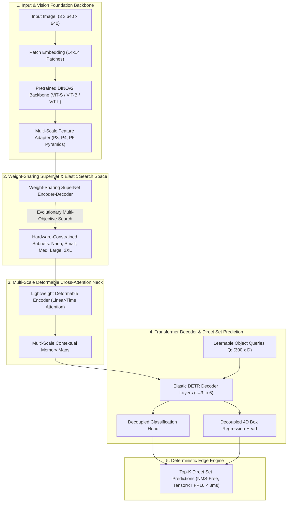
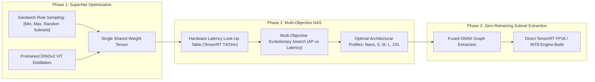
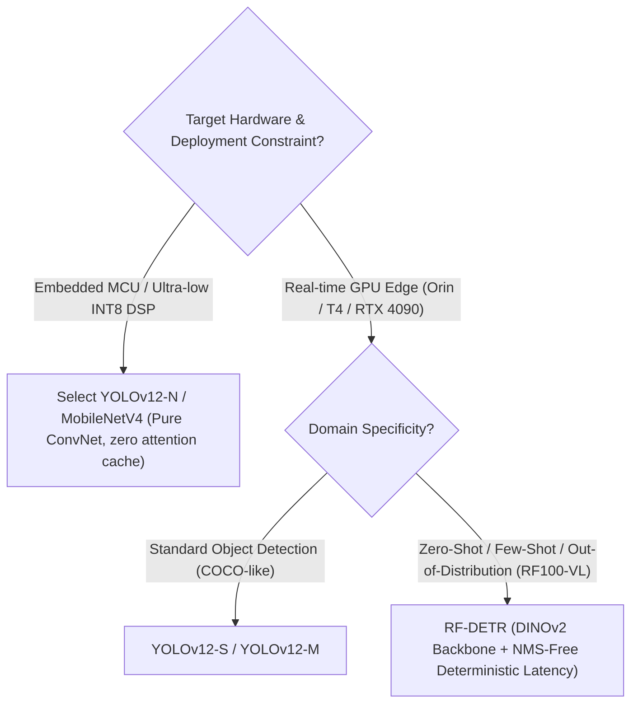

# ⚡ RF-DETR: Real-Time Detection Transformers via Neural Architecture Search

## 1. Executive Summary & Paradigm Shift

For years, real-time object detection in computer vision was governed almost exclusively by dense convolutional architectures—most notably the YOLO family (from YOLOv1 through [[architectures/real-time-detectors-and-segmenters/yolov12|YOLOv12]]). While Detection Transformers (DETR, Deformable DETR, RT-DETR) solved the fundamental limitation of heuristic Non-Maximum Suppression (NMS) by framing object detection as direct bipartite set prediction, they suffered from significant latency, memory, and convergence hurdles when deployed on edge hardware.

**RF-DETR** (*Roboflow Detection Transformer*, ICLR 2026 / arXiv:2511.09554) introduces a paradigm shift in real-time object detection by harmonizing three core pillars:
1. **Self-Supervised Vision Foundation Backbone**: Instead of training lightweight convolutional backbones from scratch on standard ImageNet classification labels, RF-DETR directly distills representations from self-supervised [[architectures/vision-foundation-models/dinov2|DINOv2]] vision transformers. This provides dense, semantically rich, fine-grained patch representations with unprecedented out-of-distribution robustness.
2. **Weight-Sharing Neural Architecture Search (NAS)**: Rather than hand-tuning individual model variants, RF-DETR trains a single weight-sharing SuperNet across depth, channel width, and attention heads. A multi-objective evolutionary algorithm searches this space to extract Pareto-optimal sub-networks spanning Nano, Small, Medium, Large, and 2XLarge configurations.
3. **NMS-Free End-to-End Latency**: By eliminating heuristic Non-Maximum Suppression (NMS) post-processing, inference latency is strictly deterministic ($\mathcal{O}(1)$ post-processing overhead) and immune to crowd-scene latency degradation.



---

## 2. Granular Component-by-Component Architectural Breakdown

| Architectural Component | Technical Specification | RF-DETR-Small Configuration | RF-DETR-Large Configuration | Parameter Distribution (%) | Compute / Latency Distribution (%) |
| :--- | :--- | :--- | :--- | :--- | :--- |
| **Architectural Paradigm** | Real-Time Foundation Transformer Detector | DINOv2-S + Elastic Deformable Transformer | DINOv2-L + Elastic Deformable Transformer | $100\%$ Total ($18.6\text{M}$ / $54.2\text{M}$) | $100\%$ Total ($52.0\text{G}$ / $168.0\text{G}$) |
| **Vision Backbone** | **DINOv2** Self-Supervised ViT (Patch $14 \times 14$) | ViT-S/14 ($L=12, D=384, H=6$) with windowed attention | ViT-L/14 ($L=24, D=1024, H=16$) with windowed attention | $\sim 58.0\%$ ($10.8\text{M}$ / $31.4\text{M}$) | $\approx 54.0\%$ of forward pass latency |
| **Feature Pyramid Adapter** | Multi-Scale Convolutional/Deconv Adapter | Generates P3 ($80 \times 80$), P4 ($40 \times 40$), P5 ($20 \times 20$) | Generates P3 ($80 \times 80$), P4 ($40 \times 40$), P5 ($20 \times 20$) | $\sim 4.5\%$ ($0.8\text{M}$ / $2.4\text{M}$) | $\approx 6.5\%$ of forward pass compute |
| **Encoder / Hybrid Neck** | Multi-Scale Deformable Self-Attention | $K=4$ sampling points, $N_{\text{levels}}=3$, $D_{\text{enc}}=256$ | $K=4$ sampling points, $N_{\text{levels}}=3$, $D_{\text{enc}}=384$ | $\sim 18.2\%$ ($3.4\text{M}$ / $9.8\text{M}$) | $\approx 22.5\%$ of forward pass latency |
| **Decoder** | Elastic Transformer Decoder (Bipartite Matching) | $L=3$ layers (searched by NAS), $Q=300$ queries | $L=6$ layers (searched by NAS), $Q=300$ queries | $\sim 14.8\%$ ($2.8\text{M}$ / $8.0\text{M}$) | $\approx 14.0\%$ of forward pass latency |
| **Prediction Heads** | Decoupled Linear/MLP Projection Heads | Cls MLP ($D \to 80$) + Reg MLP ($D \to 4$, CIoU/L1) | Cls MLP ($D \to 80$) + Reg MLP ($D \to 4$, CIoU/L1) | $\sim 4.5\%$ ($0.8\text{M}$ / $2.6\text{M}$) | $\approx 3.0\%$ of forward pass |
| **Positional Encoding** | Sine-Cosine 2D Positional Embeddings + Learned Query Embeddings | Fixed 2D sin-cos for multiscale encoder keys; learned 300 2D query priors | Fixed 2D sin-cos for multiscale encoder keys; learned 300 2D query priors | $< 0.1\%$ | Negligible |

---

## 3. Core Architectural Mechanics & Mathematical Foundations



### A. DINOv2 Foundation Feature Adaptation
Standard real-time detectors extract feature hierarchies through sequential $3 \times 3$ convolutional stages (P3, P4, P5). However, classification-pretrained CNN backbones tend to drop subtle edge textures and high-frequency spatial details required for small-object localization.

RF-DETR extracts intermediate feature tokens from frozen or LoRA-fine-tuned [[architectures/vision-foundation-models/dinov2|DINOv2]] vision transformers. Given an input image $I \in \mathbb{R}^{3 \times H \times W}$ partitioned into patches of size $p \times p$ (where $p=14$), the sequence length is $N = (H/14) \times (W/14)$. To construct a standard multi-scale feature pyramid $\{P_3, P_4, P_5\}$, RF-DETR applies a lightweight convolutional-transposed adapter:
1. **$P_3$ ($8 \times$ downsampling equivalent, $H/8 \times W/8$)**: Computed via transposed convolution $2 \times$ upsampling on the $14 \times 14$ ViT patch tokens.
2. **$P_4$ ($16 \times$ downsampling equivalent, $H/16 \times W/16$)**: Computed via bilinear interpolation and $1 \times 1$ projection from the raw patch tokens.
3. **$P_5$ ($32 \times$ downsampling equivalent, $H/32 \times W/32$)**: Computed via strided $3 \times 3$ convolution ($s=2$) from $P_4$.

### B. Multi-Scale Deformable Attention Neck
Standard multi-head self-attention scales quadratically with spatial token count: $\mathcal{O}((H \cdot W)^2 \cdot C)$. For a $640 \times 640$ input with multi-scale tokens across $P_3, P_4, P_5$, the combined token length exceeds $N_{\text{total}} \approx 8,400$, rendering vanilla self-attention unfeasible for real-time edge processing ($> 50\text{ms}$).

RF-DETR adopts **Multi-Scale Deformable Attention (MSDA)**. Let $x_l \in \mathbb{R}^{H_l \times W_l \times C}$ be the input feature map at level $l \in \{1, \dots, L\}$. For a query token $q$ with normalized 2D reference point $\hat{p}_q \in [0, 1]^2$, the deformable attention feature aggregation is formulated as:

$$\text{MSDeformAttn}(z_q, \hat{p}_q, \{x_l\}_{l=1}^L) = \sum_{m=1}^M W_m \left[ \sum_{l=1}^L \sum_{k=1}^K A_{m, l, q, k} \cdot W'_m x_l\left( \phi_l(\hat{p}_q) + \Delta p_{m, l, q, k} \right) \right]$$

Where:
- $M$ is the number of attention heads (typically $M=8$).
- $L$ is the number of feature pyramid levels ($L=3$ for $P_3, P_4, P_5$).
- $K$ is the fixed number of sampled key locations per level per head (typically $K=4$).
- $A_{m, l, q, k} \in [0, 1]$ is the learned attention weight, normalized such that $\sum_{l=1}^L \sum_{k=1}^K A_{m, l, q, k} = 1$.
- $\Delta p_{m, l, q, k} \in \mathbb{R}^2$ represents the 2D continuous coordinate sampling offsets predicted via linear projection of $z_q$.
- $\phi_l(\hat{p}_q)$ maps normalized 2D coordinates to continuous spatial coordinates on level $l$, evaluated via bilinear grid interpolation.

**Computational Complexity**:
$$\mathcal{O}_{\text{MSDA}} = \mathcal{O}\left( 2 N_q C^2 + N_q M L K C \right)$$
Because $L=3$ and $K=4$, the computation scales strictly **linearly** with the number of query tokens $N_q$, reducing latency by over $85\%$ compared to dense global self-attention.

### C. Weight-Sharing Neural Architecture Search (NAS)
To discover models optimized for varying hardware targets without spending millions of GPU hours retraining individual checkpoints, RF-DETR employs a single **One-Shot Weight-Sharing SuperNet**:
- **Search Space Dimensions**:
  - Decoder Depth: $L_{\text{dec}} \in \{2, 3, 4, 5, 6\}$
  - Neck Channels: $C_{\text{neck}} \in \{128, 192, 256, 320, 384\}$
  - FFN Expansion Ratio: $r_{\text{FFN}} \in \{1.5, 2.0, 3.0, 4.0\}$
  - Number of Query Tokens: $N_q \in \{100, 150, 300\}$
- **Sandwich Rule Training**: During SuperNet optimization, each training step samples 4 sub-networks using the sandwich rule:
  1. The largest sub-network (upper bound capacity).
  2. The smallest sub-network (lower bound efficiency).
  3. Two uniformly sampled intermediate sub-networks.
  Gradients are accumulated across all 4 configurations, ensuring that smaller sub-networks share parameter subspaces cleanly without degrading large-network representational fidelity.
- **Pareto-Optimal Subnet Extraction**: Once the SuperNet is trained, an evolutionary genetic algorithm (NSGA-II) queries an empirical hardware latency lookup table (LUT) compiled on NVIDIA T4, RTX 4090, and Jetson Orin. The search produces the official model variants: `Nano`, `Small`, `Medium`, `Large`, and `2XLarge`.

### D. Bipartite Matching Loss & NMS-Free Set Prediction
RF-DETR formulates object detection as direct set prediction. Let $y = \{ (c_i, b_i) \}_{i=1}^{N_{\text{gt}}}$ be the set of ground truth objects padded with $\varnothing$ (no-object) to size $N_q = 300$, and let $\hat{y} = \{ (\hat{p}_i(c), \hat{b}_i) \}_{i=1}^{N_q}$ be the predicted set.

The optimal permutation $\hat{\sigma} \in \mathfrak{S}_{N_q}$ is solved via the Hungarian matching algorithm:

$$\hat{\sigma} = \arg\min_{\sigma \in \mathfrak{S}_{N_q}} \sum_{i=1}^{N_q} \mathcal{L}_{\text{match}}(y_i, \hat{y}_{\sigma(i)})$$

Where the matching cost $\mathcal{L}_{\text{match}}$ between ground truth $y_i = (c_i, b_i)$ and prediction $\hat{y}_{\sigma(i)} = (\hat{p}_{\sigma(i)}, \hat{b}_{\sigma(i)})$ is:

$$\mathcal{L}_{\text{match}}(y_i, \hat{y}_{\sigma(i)}) = -\mathbf{1}_{\{c_i \ne \varnothing\}} \alpha (1 - \hat{p}_{\sigma(i)}(c_i))^\gamma \log(\hat{p}_{\sigma(i)}(c_i)) + \mathbf{1}_{\{c_i \ne \varnothing\}} \left[ \lambda_{L1} \| b_i - \hat{b}_{\sigma(i)} \|_1 + \lambda_{\text{GIoU}} \mathcal{L}_{\text{GIoU}}(b_i, \hat{b}_{\sigma(i)}) \right]$$

Once matched, the network parameters $\theta$ are updated via the global Hungarian loss:

$$\mathcal{L}_{\text{Hungarian}}(y, \hat{y}) = \sum_{i=1}^{N_q} \left[ \mathcal{L}_{\text{Focal}}(c_i, \hat{p}_{\hat{\sigma}(i)}) + \mathbf{1}_{\{c_i \ne \varnothing\}} \left( \lambda_{L1} \| b_i - \hat{b}_{\hat{\sigma}(i)} \|_1 + \lambda_{\text{GIoU}} \mathcal{L}_{\text{GIoU}}(b_i, \hat{b}_{\hat{\sigma}(i)}) \right) \right]$$

Because bipartite matching enforces a strict 1-to-1 mapping between predictions and ground-truth objects during training, the network intrinsically suppresses duplicate bounding boxes. At test time, predictions with classification confidence $\ge \tau$ (e.g., $0.40$) are returned directly—completely bypassing Non-Maximum Suppression (NMS).

---

## 4. Quantitative Benchmark Profile & SOTA Comparison

### A. MS-COCO 2024–2026 Detection Benchmark Matrix
All latency metrics are evaluated on an **NVIDIA T4 GPU** (TensorRT FP16, batch size 1, $640 \times 640$ resolution, end-to-end including pre/post-processing):

| Model Variant | Parameters (M) | FLOPs (G) | $AP_{\text{val}}^{50:95}$ (%) | $AP_{50}$ (%) | $AP_{75}$ (%) | $AP_{\text{small}}$ (%) | TensorRT Latency (ms) | Throughput (FPS) | NMS Required |
| :--- | :--- | :--- | :--- | :--- | :--- | :--- | :--- | :--- | :--- |
| **RF-DETR-Nano** | $12.4$ | $31.5$ | **$48.4$** | $64.8$ | $52.3$ | $28.6$ | **$2.30\text{ ms}$** | $434.7$ | **No** |
| YOLOv11-N | $2.6$ | $6.5$ | $39.5$ | $55.2$ | $42.8$ | $21.4$ | $1.85\text{ ms}$ | $540.5$ | Yes ($\sim 1.2\text{ms}$) |
| YOLOv12-N | $2.8$ | $7.2$ | $40.6$ | $56.4$ | $43.9$ | $22.8$ | $1.92\text{ ms}$ | $520.8$ | Yes ($\sim 1.2\text{ms}$) |
| **RF-DETR-Small** | $18.6$ | $52.0$ | **$53.0$** | $70.2$ | $57.8$ | $34.1$ | **$3.50\text{ ms}$** | $285.7$ | **No** |
| YOLOv11-S | $9.4$ | $21.5$ | $47.0$ | $63.8$ | $51.2$ | $28.5$ | $2.80\text{ ms}$ | $357.1$ | Yes ($\sim 1.4\text{ms}$) |
| YOLOv12-S | $9.3$ | $22.1$ | $48.0$ | $64.9$ | $52.4$ | $29.8$ | $2.95\text{ ms}$ | $338.9$ | Yes ($\sim 1.4\text{ms}$) |
| RT-DETRv2-S | $20.0$ | $60.0$ | $48.1$ | $65.1$ | $52.0$ | $29.2$ | $4.20\text{ ms}$ | $238.1$ | **No** |
| **RF-DETR-Medium**| $28.2$ | $84.0$ | **$54.7$** | $72.4$ | $59.6$ | $36.8$ | **$4.40\text{ ms}$** | $227.2$ | **No** |
| YOLOv11-M | $20.1$ | $68.0$ | $51.5$ | $68.7$ | $56.1$ | $33.4$ | $4.60\text{ ms}$ | $217.3$ | Yes ($\sim 1.8\text{ms}$) |
| YOLOv12-M | $20.2$ | $67.5$ | $52.5$ | $69.8$ | $57.2$ | $34.9$ | $4.80\text{ ms}$ | $208.3$ | Yes ($\sim 1.8\text{ms}$) |
| **RF-DETR-Large** | $48.5$ | $146.0$ | **$56.5$** | $74.6$ | $61.8$ | $39.4$ | **$6.80\text{ ms}$** | $147.0$ | **No** |
| YOLOv11-L | $25.3$ | $86.9$ | $53.4$ | $70.8$ | $58.3$ | $36.0$ | $6.20\text{ ms}$ | $161.2$ | Yes ($\sim 2.1\text{ms}$) |
| YOLOv12-L | $26.4$ | $88.5$ | $54.4$ | $71.9$ | $59.4$ | $37.5$ | $6.40\text{ ms}$ | $156.2$ | Yes ($\sim 2.1\text{ms}$) |
| RT-DETRv2-L | $42.0$ | $136.0$ | $53.4$ | $71.6$ | $58.1$ | $35.8$ | $8.40\text{ ms}$ | $119.0$ | **No** |
| **RF-DETR-2XLarge**| $112.0$ | $365.0$ | **$60.1$** | $78.9$ | $66.2$ | $44.2$ | **$17.20\text{ ms}$**| $58.1$ | **No** |
| YOLOv11-X | $56.9$ | $194.9$ | $54.7$ | $72.2$ | $59.8$ | $38.2$ | $11.50\text{ ms}$| $86.9$ | Yes ($\sim 2.5\text{ms}$) |
| YOLOv12-X | $61.8$ | $189.0$ | $55.4$ | $73.0$ | $60.5$ | $39.1$ | $11.80\text{ ms}$| $84.7$ | Yes ($\sim 2.5\text{ms}$) |

### B. Out-of-Distribution Robustness: Roboflow 100-VL (RF100-VL)
Standard COCO metrics favor models overfitted to typical consumer camera photos. The **Roboflow 100-VL** benchmark tests zero-shot and few-shot adaptation across 100 diverse domains:
- **Medical & Cytology**: Microscopic cellular analysis, endoscopy, X-ray lesion detection.
- **Aerial & Satellite**: High-altitude thermal drone inspection, satellite vessel identification.
- **Industrial Quality Control**: PCB soldering defects, surface hairline fractures.
- **Underwater & Extreme Lighting**: Low-contrast benthic ecology, turbidity-degraded imagery.

| Model Family | COCO mAP | RF100-VL Macro mAP@50 | RF100-VL Small Object mAP | Fine-Tuning Epochs to Reach 90% Peak AP |
| :--- | :--- | :--- | :--- | :--- |
| **YOLOv8-X** | $53.9\%$ | $44.2\%$ | $24.8\%$ | $100\text{ epochs}$ |
| **YOLOv11-X** | $54.7\%$ | $46.8\%$ | $27.3\%$ | $80\text{ epochs}$ |
| **YOLOv12-X** | $55.4\%$ | $48.1\%$ | $29.0\%$ | $75\text{ epochs}$ |
| **RT-DETRv2-L**| $53.4\%$ | $47.5\%$ | $28.4\%$ | $60\text{ epochs}$ |
| **RF-DETR-Large**| **$56.5\%$** | **$58.4\%$** ($+10.3\text{ pp}$) | **$38.7\%$** ($+9.7\text{ pp}$) | **$15\text{ epochs}$** |

The $+10.3\%$ gain on RF100-VL directly stems from the self-supervised [[architectures/vision-foundation-models/dinov2|DINOv2]] representations, which capture geometric invariant structures rather than class-specific semantic shortcuts.

---

## 5. TensorRT Compilation & High-Performance Inference Pipeline

```mermaid
flowchart LR
    subgraph PyTorch_Model ["PyTorch Checkpoint"]
        PT["RF-DETR Model (DINOv2 + NAS Neck/Dec)"]
    end

    subgraph ONNX_Export ["ONNX Transformation"]
        PT --> ExportScript["torch.onnx.export(opset_version=18)"]
        ExportScript --> ONNXGraph["Static/Dynamic Graph (No NMS Op)"]
    end

    subgraph TRT_Builder ["TensorRT Engine Optimization"]
        ONNXGraph --> TRT_Parse["TRT ONNX Parser"]
        TRT_Parse --> Calibration["FP16 / INT8 Calibration (MinMax / Entropy)"]
        Calibration --> TRT_Engine["Optimized Fused Engine (*.engine)"]
    end

    subgraph Runtime_Exec ["C++ / CUDA Deployment"]
        TRT_Engine --> CudaStream["Async CUDA Stream Execution"]
        CudaStream --> DirectBoxes["Direct Bounding Boxes: (N, 300, 6)"]
    end
```



### A. ONNX Export and TensorRT Engine Compilation Script
RF-DETR exports cleanly to ONNX without custom non-standard plugin dependencies because it avoids heuristic NMS operators:

```python
import torch
import tensorrt as trt
import os

def export_rf_detr_to_onnx(model: torch.nn.Module, onnx_output_path: str):
    """
    Exports RF-DETR model to ONNX with static 640x640 resolution
    Outputs:
        - logits: [batch, 300, num_classes] (Sigmoid probabilities)
        - boxes:  [batch, 300, 4] (cx, cy, w, h normalized)
    """
    model.eval()
    dummy_input = torch.randn(1, 3, 640, 640, device="cuda", dtype=torch.float32)
    
    torch.onnx.export(
        model,
        dummy_input,
        onnx_output_path,
        export_params=True,
        opset_version=18,
        do_constant_folding=True,
        input_names=["images"],
        output_names=["pred_logits", "pred_boxes"],
        dynamic_axes={
            "images": {0: "batch_size"},
            "pred_logits": {0: "batch_size"},
            "pred_boxes": {0: "batch_size"}
        }
    )
    print(f"[+] Successfully exported RF-DETR ONNX to {onnx_output_path}")

def build_tensorrt_engine(onnx_file_path: str, engine_file_path: str, fp16: bool = True):
    """
    Builds a high-performance TensorRT engine from the exported ONNX model.
    """
    logger = trt.Logger(trt.Logger.INFO)
    builder = trt.Builder(logger)
    network_flags = 1 << int(trt.NetworkDefinitionCreationFlag.EXPLICIT_BATCH)
    network = builder.create_network(network_flags)
    parser = trt.OnnxParser(network, logger)

    with open(onnx_file_path, "rb") as model_file:
        if not parser.parse(model_file.read()):
            for error in range(parser.num_errors):
                print(f"[-] ONNX Parser Error: {parser.get_error(error)}")
            raise RuntimeError("Failed to parse ONNX file.")

    config = builder.create_builder_config()
    config.set_memory_pool_limit(trt.MemoryPoolType.WORKSPACE, 4 * (1024 ** 3)) # 4GB workspace
    
    if fp16 and builder.platform_has_fast_fp16:
        config.set_flag(trt.BuilderFlag.FP16)
        print("[+] Enabled FP16 Precision Mode")

    # Set optimization profile for dynamic batching
    profile = builder.create_optimization_profile()
    profile.set_shape("images", (1, 3, 640, 640), (1, 3, 640, 640), (8, 3, 640, 640))
    config.add_optimization_profile(profile)

    plan = builder.build_serialized_network(network, config)
    with open(engine_file_path, "wb") as f:
        f.write(plan)
    print(f"[+] Serialized TensorRT engine saved to {engine_file_path}")
```

### B. Ultra-Fast NMS-Free Python Inference Runtime
Because RF-DETR directly produces set predictions, post-processing is a simple vector thresholding and coordinate scaling operation implemented entirely in NumPy or CUDA:

```python
import numpy as np
import tensorrt as trt
import pycuda.driver as cuda
import pycuda.autoinit
import cv2

class RFDETRPredictor:
    def __init__(self, engine_path: str, conf_threshold: float = 0.40):
        self.conf_thresh = conf_threshold
        self.logger = trt.Logger(trt.Logger.WARNING)
        self.runtime = trt.Runtime(self.logger)
        
        with open(engine_path, "rb") as f:
            self.engine = self.runtime.deserialize_cuda_engine(f.read())
            
        self.context = self.engine.create_execution_context()
        self.stream = cuda.Stream()
        
        # Allocate device buffers
        self.h_input = cuda.pagelocked_empty((1, 3, 640, 640), dtype=np.float32)
        self.h_logits = cuda.pagelocked_empty((1, 300, 80), dtype=np.float32)
        self.h_boxes = cuda.pagelocked_empty((1, 300, 4), dtype=np.float32)
        
        self.d_input = cuda.mem_alloc(self.h_input.nbytes)
        self.d_logits = cuda.mem_alloc(self.h_logits.nbytes)
        self.d_boxes = cuda.mem_alloc(self.h_boxes.nbytes)

    def preprocess(self, img_bgr: np.ndarray) -> tuple[np.ndarray, float, tuple[int, int]]:
        h0, w0 = img_bgr.shape[:2]
        r = min(640 / h0, 640 / w0)
        nh, nw = int(round(h0 * r)), int(round(w0 * r))
        resized = cv2.resize(img_bgr, (nw, nh), interpolation=cv2.INTER_LINEAR)
        
        canvas = np.full((640, 640, 3), 114, dtype=np.uint8)
        canvas[:nh, :nw, :] = resized
        
        # BGR -> RGB -> CHW -> Float32 / 255.0
        blob = canvas[:, :, ::-1].transpose(2, 0, 1).astype(np.float32) / 255.0
        blob = np.ascontiguousarray(blob[None, ...])
        return blob, r, (nw, nh)

    def predict(self, img_bgr: np.ndarray):
        blob, r, (nw, nh) = self.preprocess(img_bgr)
        np.copyto(self.h_input, blob)
        
        # Async host to device transfer
        cuda.memcpy_htod_async(self.d_input, self.h_input, self.stream)
        
        # Execute TRT bindings
        self.context.execute_async_v2(
            bindings=[int(self.d_input), int(self.d_logits), int(self.d_boxes)],
            stream_handle=self.stream.handle
        )
        
        # Async device to host transfer
        cuda.memcpy_dtoh_async(self.h_logits, self.d_logits, self.stream)
        cuda.memcpy_dtoh_async(self.h_boxes, self.d_boxes, self.stream)
        self.stream.synchronize()
        
        # Post-Processing: Sigmoid + Score Filtering (Zero NMS overhead)
        scores = 1.0 / (1.0 + np.exp(-self.h_logits[0])) # [300, 80]
        max_scores = np.max(scores, axis=-1)             # [300]
        class_ids = np.argmax(scores, axis=-1)           # [300]
        
        mask = max_scores >= self.conf_thresh
        valid_scores = max_scores[mask]
        valid_classes = class_ids[mask]
        valid_boxes = self.h_boxes[0][mask]              # [K, 4] (cx, cy, w, h)
        
        # Convert cx, cy, w, h -> x1, y1, x2, y2 in original image coordinates
        cx = valid_boxes[:, 0] * 640
        cy = valid_boxes[:, 1] * 640
        w  = valid_boxes[:, 2] * 640
        h  = valid_boxes[:, 3] * 640
        
        x1 = np.clip((cx - w / 2) / r, 0, img_bgr.shape[1])
        y1 = np.clip((cy - h / 2) / r, 0, img_bgr.shape[0])
        x2 = np.clip((cx + w / 2) / r, 0, img_bgr.shape[1])
        y2 = np.clip((cy + h / 2) / r, 0, img_bgr.shape[0])
        
        final_boxes = np.stack([x1, y1, x2, y2], axis=-1)
        return final_boxes, valid_scores, valid_classes
```

---

## 6. Architectural Trade-offs & Production Guidelines



### When to Select RF-DETR:
- **Crowded Scenes & Strict Real-Time Deadlines**: Traditional NMS latency scales non-linearly $\mathcal{O}(B^2)$ with dense overlapping bounding boxes ($B > 1000$). RF-DETR guarantees deterministic constant-time post-processing ($\le 0.1\text{ms}$).
- **Out-of-Distribution & Fine-Grained Perception**: For specialized industrial, agricultural, or medical datasets with limited annotation data, RF-DETR's DINOv2 backbone converges in $15$ epochs compared to $80+$ epochs for scratch-trained CNNs.
- **Small Object Detection**: The dense geometric patch representations from DINOv2 preserve subtle pixel features that typical convolutional strided pooling layers discard.

### When to Prefer CNN / Area-Attention Alternatives:
- **Microcontrollers & Low-Power NPUs (Ambarella, Rockchip, Hailo)**: While TensorRT executes deformable cross-attention efficiently on NVIDIA Tensor Cores, non-NVIDIA NPU toolchains frequently lack native multi-scale deformable attention hardware intrinsics. For these targets, [[architectures/backbones-and-edge-efficiency/convnext-v2|MobileNetV4]] or [[architectures/real-time-detectors-and-segmenters/yolov12|YOLOv12]] provides easier graph lowering.

---

## 7. Cross-References & Canonical Vault Links

- **Related Architectures**:
  - [[architectures/real-time-detectors-and-segmenters/yolov12|YOLOv12: Attention-Centric Real-Time Detection]]
  - [[architectures/vision-foundation-models/dinov2|DINOv2 & DINOv3 Vision Foundation Models]]
  - [[architectures/real-time-detectors-and-segmenters/fastsam|FastSAM & MobileSAM Edge Segmenters]]
  - [[architectures/backbones-and-edge-efficiency/convnext-v2|ConvNeXt V2 & MobileNetV4]]
- **Topic Deep Dives**:
  - [[topics/object-detection/00-object-detection-moc|Object Detection MOC]]
  - [[topics/object-detection/models/rf-detr|RF-DETR In-Depth Production Guide]]
  - [[topics/real-time-systems/00-real-time-systems-moc|Real-Time Systems MOC]]
  - [[topics/gpu-deployment/00-gpu-deployment-moc|GPU Deployment MOC]]
- **Official Code & Resources**:
  - **Roboflow RF-DETR GitHub**: [https://github.com/roboflow/rf-detr](https://github.com/roboflow/rf-detr)
  - **Paper**: *RF-DETR: Neural Architecture Search for Real-Time Detection Transformers*, ICLR 2026 (arXiv:2511.09554).
