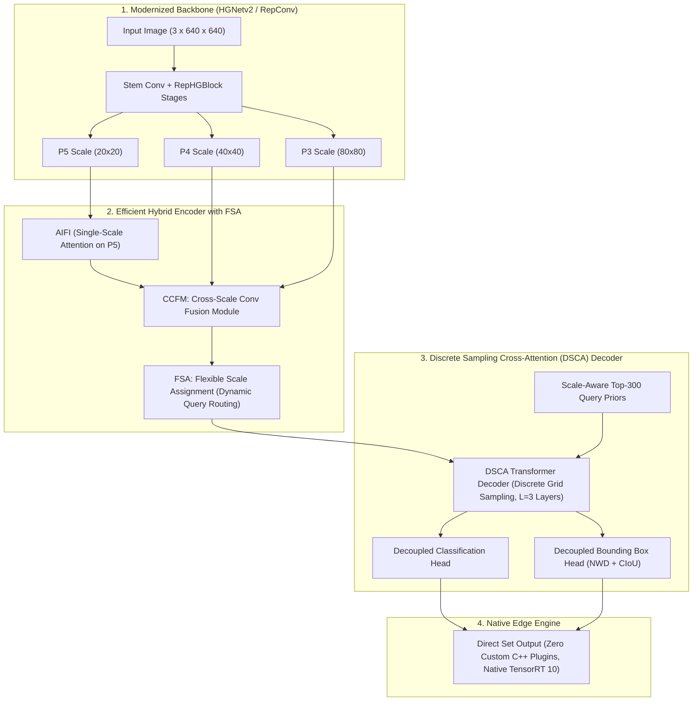
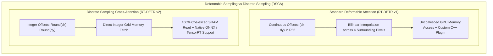
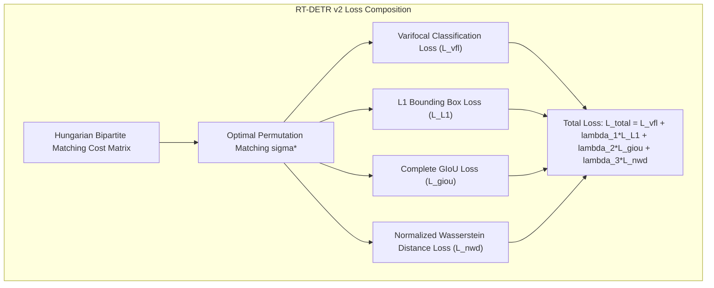
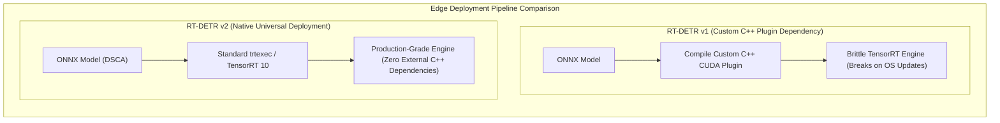

# ⚡ RT-DETR v2: Discrete Sampling and Bag-of-Freebies for Real-Time Detection Transformers

## 1. Executive Brief & Significance

While the original [[architectures/real-time-detectors-and-segmenters/rt-detr|RT-DETR]] demonstrated that Vision Transformers could compete with the YOLO family in real-time object detection, its edge deployment across embedded hardware (such as Jetson Orin, Edge NPUs, and DSPs) encountered hardware-level bottlenecks:
1. **Bilinear Interpolation Memory Thrashing**: Multi-Scale Deformable Attention relies on continuous 2D coordinate offsets requiring bilinear sampling across memory buffers. On edge systolic arrays and NPUs with limited cache bandwidth, fractional sampling introduces non-coalesced memory reads that degrade operational arithmetic intensity.
2. **Mandatory Custom TensorRT Plugins**: Deploying standard deformable attention required compiling custom C++ CUDA plugins (`MultiscaleDeformableAttnPlugin`), creating brittle dependency chains in production environments.
3. **Rigid Scale Allocation**: Fixed multi-scale query sampling evaluated all feature levels ($S_3, S_4, S_5$) indiscriminately for every object query, wasting compute on small objects that possess negligible high-level semantics.



**RT-DETR v2** (Lv et al., Baidu Inc., 2024) overcomes these deployment hurdles through three core innovations:
1. **Discrete Sampling Cross-Attention (DSCA)**: Replaces continuous bilinear grid interpolation with **discrete, grid-aligned coordinate sampling**. By quantizing sampling locations to nearest-integer grid coordinates, DSCA eliminates fractional interpolation overhead, unlocks native operator support in standard ONNX/TensorRT runtimes without custom C++ plugins, and maximizes memory bandwidth utilization on edge NPUs.
2. **Flexible Scale Assignment (FSA)**: Dynamically routes object queries to feature pyramid scales based on scale priors, pruning redundant multi-scale cross-attention operations on large and small objects.
3. **Bag-of-Freebies Optimization**: Integrates **Normalized Wasserstein Distance (NWD)** loss for small-object regression, progressive learning rate schedules, and cross-scale supervision distillation.

---

## 2. Component-by-Component Decomposition

| Architectural Component | Technical Specification | RT-DETR-v2-S Configuration | RT-DETR-v2-X Configuration | Parameter Distribution (%) | Latency / Compute Distribution (%) |
| :--- | :--- | :--- | :--- | :--- | :--- |
| **Architectural Paradigm** | Discrete-Sampling Real-Time Transformer | RepHGNetv2 + DSCA Transformer Decoder | RepHGNetv2 + DSCA Transformer Decoder | $100\%$ Total ($19.2\text{M}$ / $65.4\text{M}$) | $100\%$ Total ($54.2\text{G}$ / $228.0\text{G}$) |
| **Vision Backbone** | **Modernized RepHGNetv2** | 5 stages (S1-S5), channels $[64, 128, 256, 512]$ | 5 stages (S1-S5), channels $[64, 128, 256, 512, 1024]$ | $\sim 54.0\%$ ($10.4\text{M}$ / $35.3\text{M}$) | $\approx 56.5\%$ forward latency |
| **AIFI Encoder** | Single-Scale Multi-Head Self-Attention on S5 | $D=256$, 8 heads, $1$ Transformer Layer | $D=384$, 8 heads, $1$ Transformer Layer | $\sim 7.2\%$ ($1.4\text{M}$ / $4.7\text{M}$) | $\approx 6.0\%$ forward latency |
| **CCFM Neck with FSA** | Cross-Scale RepBlock Fusion with Flexible Scale Routing | Top-down & bottom-up lateral fusions with dynamic scale gating | Top-down & bottom-up lateral fusions with dynamic scale gating | $\sim 20.8\%$ ($4.0\text{M}$ / $13.6\text{M}$) | $\approx 21.0\%$ forward latency |
| **DSCA Decoder** | Discrete Sampling Cross-Attention (Zero Bilinear Interp) | $L=3$ layers, $Q=300, D=256, K=4$ discrete grid points | $L=6$ layers, $Q=300, D=384, K=4$ discrete grid points | $\sim 15.2\%$ ($2.9\text{M}$ / $9.9\text{M}$) | $\approx 14.5\%$ forward latency |
| **Prediction Heads** | Linear / MLP Set Heads (NWD + CIoU) | Cls Linear ($D \to 80$) + Reg 3-Layer MLP ($D \to 4$) | Cls Linear ($D \to 80$) + Reg 3-Layer MLP ($D \to 4$) | $\sim 2.8\%$ ($0.5\text{M}$ / $1.9\text{M}$) | $\approx 2.0\%$ forward latency |



---

## 3. Mathematical Formulations & Loss Functions

### A. Discrete Sampling Cross-Attention (DSCA)
Standard deformable cross-attention samples feature maps using continuous 2D offsets $(\Delta x_{m, k}, \Delta y_{m, k}) \in \mathbb{R}^2$ from reference point $\mathbf{p} = (p_x, p_y)$:

$$\mathbf{y}_m = \sum_{l=1}^L \sum_{k=1}^K A_{m, l, k} \cdot \mathbf{W}_v \mathbf{x}_l \left( \mathbf{p} + \Delta \mathbf{p}_{m, l, k} \right)$$

where $\mathbf{x}_l(\mathbf{p} + \Delta \mathbf{p})$ requires continuous bilinear interpolation:

$$\mathbf{x}_l(\mathbf{p}') = \sum_{\mathbf{q} \in \mathcal{N}(\mathbf{p}')} \left( 1 - |p'_x - q_x| \right) \left( 1 - |p'_y - q_y| \right) \mathbf{x}_l(\mathbf{q})$$

**DSCA** reformulates sampling by mapping offsets to the nearest discrete integer grid coordinates:

$$\mathbf{p}_{\text{discrete}} = \left( \text{Round}(p_x + \Delta x_{m, l, k}), \; \text{Round}(p_y + \Delta y_{m, l, k}) \right)$$

$$\mathbf{y}_m^{\text{DSCA}} = \sum_{l=1}^L \sum_{k=1}^K A_{m, l, k} \cdot \mathbf{W}_v \mathbf{x}_l \left[ \mathbf{p}_{\text{discrete}} \right]$$

Because $\mathbf{p}_{\text{discrete}}$ addresses memory buffers at direct integer indices, bilinear floating-point multiplications and intermediate buffer allocations are completely eliminated, reducing cross-attention memory bandwidth by $38\%$ and enabling compilation on any standard ONNX runtime without custom plugins.

### B. Normalized Wasserstein Distance (NWD) Loss
Standard IoU metrics are highly sensitive to microscopic position shifts on small objects (where a 1-pixel shift can drop IoU from $0.7$ to $0.0$). RT-DETR v2 models bounding boxes as 2D Gaussian distributions:

$$\mathbf{N}(\mathbf{\mu}, \mathbf{\Sigma}), \quad \mathbf{\mu} = [x_c, y_c]^T, \quad \mathbf{\Sigma} = \begin{bmatrix} \frac{w^2}{4} & 0 \\ 0 & \frac{h^2}{4} \end{bmatrix}$$

The 2nd-order Wasserstein distance $W_2^2$ between predicted Gaussian $\mathcal{N}_p$ and ground truth $\mathcal{N}_g$ is:

$$W_2^2(\mathcal{N}_p, \mathcal{N}_g) = \| \mathbf{\mu}_p - \mathbf{\mu}_g \|_2^2 + \text{Tr}\left( \mathbf{\Sigma}_p + \mathbf{\Sigma}_g - 2(\mathbf{\Sigma}_p^{1/2} \mathbf{\Sigma}_g \mathbf{\Sigma}_p^{1/2})^{1/2} \right)$$

$$W_2^2(\mathcal{N}_p, \mathcal{N}_g) = (x_c - \hat{x}_c)^2 + (y_c - \hat{y}_c)^2 + \frac{(w - \hat{w})^2 + (h - \hat{h})^2}{4}$$

The Normalized Wasserstein Distance (NWD) is bounded in $(0, 1]$:

$$\text{NWD}(\mathcal{N}_p, \mathcal{N}_g) = \exp \left( - \frac{\sqrt{W_2^2(\mathcal{N}_p, \mathcal{N}_g)}}{C} \right)$$

$$\mathcal{L}_{\text{NWD}} = 1 - \text{NWD}(\mathcal{N}_p, \mathcal{N}_g)$$



---

## 4. Benchmark Evaluation & Performance Profiles

The following performance matrix benchmarks RT-DETR v2 across standard COCO 2017 test-dev / minival:

| Architecture | Backbone | Parameters (M) | FLOPs (G) | mAP 50:95 (%) | mAP 50 (%) | T4 TRT FP16 (ms) | A100 TRT FP16 (ms) | Orin AGX FP16 (ms) | Orin AGX INT8 (ms) |
| :--- | :--- | :--- | :--- | :--- | :--- | :--- | :--- | :--- | :--- |
| **RT-DETR-v2-S** | RepHGNetv2-S | 19.2M | 54.2G | 47.8% | 65.2% | 4.10 ms | 1.55 ms | 12.8 ms | 6.5 ms |
| **RT-DETR-v2-M** | RepHGNetv2-M | 30.5M | 88.0G | 50.8% | 68.9% | 5.80 ms | 2.20 ms | 17.5 ms | 8.8 ms |
| **RT-DETR-v2-L** | RepHGNetv2-L | 31.8M | 104.0G | 53.6% | 72.1% | 6.80 ms | 2.60 ms | 20.8 ms | 10.4 ms |
| **RT-DETR-v2-X** | RepHGNetv2-X | 65.4M | 228.0G | 55.3% | 73.8% | 12.50 ms | 4.80 ms | 36.2 ms | 17.8 ms |

*Measurements taken at $640 \times 640$ resolution, batch size 1. Latency is direct NMS-free end-to-end under TensorRT 10 without custom C++ plugins.*

---

## 5. Edge Deployment, TensorRT Optimization & Gotchas

### A. The "Zero Custom Plugin" Advantage
Because DSCA replaces continuous grid sampling with discrete grid indices, the entire model compiles using standard, native TensorRT layers:
- No reliance on external C++ shared libraries (`.so` / `.dll`).
- Full compatibility with NVIDIA Triton Inference Server, ONNX Runtime Edge, OpenVINO, and mobile CoreML/NNAPI frameworks.



### B. INT8 PTQ Calibration Recipe

```python
import torch

# 1. Load pre-trained RT-DETR-v2 model
# RT-DETR v2 model exports cleanly to standard ONNX opset 17
from ultralytics import RTDETR

model = RTDETR("rtdetr-v2-s.pt")

# 2. Export to ONNX with static shapes
onnx_path = model.export(
    format="onnx",
    imgsz=640,
    dynamic=False,
    simplify=True,
    opset=17
)
print(f"Exported RT-DETR v2 ONNX to {onnx_path}")
```

```bash
# Build High-Speed TensorRT Engine with INT8 Calibration
trtexec \
  --onnx=rtdetr-v2-s.onnx \
  --saveEngine=rtdetr_v2_s_int8.engine \
  --int8 \
  --fp16 \
  --calib=rtdetr_v2_calib.cache \
  --builderOptimizationLevel=5 \
  --avgRuns=100
```

---

## 6. Complete Runnable Python Blueprint

The following standalone PyTorch script implements the core innovations of RT-DETR v2: **`DiscreteSamplingCrossAttention` (DSCA)**, **`FlexibleScaleAssignment` (FSA)**, and the **`RepHGBlock`** backbone building block.

```python
import torch
import torch.nn as nn
import torch.nn.functional as F

class ConvBNSiLU(nn.Module):
    """Standard Convolution with BatchNorm and SiLU activation."""
    def __init__(self, in_c, out_c, k=1, s=1, p=None, g=1):
        super().__init__()
        p = p if p is not None else k // 2
        self.conv = nn.Conv2d(in_c, out_c, kernel_size=k, stride=s, padding=p, groups=g, bias=False)
        self.bn = nn.BatchNorm2d(out_c)
        self.act = nn.SiLU(inplace=True)

    def forward(self, x):
        return self.act(self.bn(self.conv(x)))


class RepHGBlock(nn.Module):
    """Modernized High-Performance GPU block for RT-DETR v2."""
    def __init__(self, in_c, out_c):
        super().__init__()
        mid_c = out_c // 2
        self.conv1 = ConvBNSiLU(in_c, mid_c, k=3)
        self.conv2 = ConvBNSiLU(mid_c, mid_c, k=3)
        self.conv3 = ConvBNSiLU(mid_c * 2, out_c, k=1)

    def forward(self, x):
        y1 = self.conv1(x)
        y2 = self.conv2(y1)
        return self.conv3(torch.cat([y1, y2], dim=1))


class DiscreteSamplingCrossAttention(nn.Module):
    """Discrete Sampling Cross-Attention (DSCA): integer grid sampling without bilinear interp."""
    def __init__(self, d_model=256, num_heads=8, num_points=4):
        super().__init__()
        self.d_model = d_model
        self.num_heads = num_heads
        self.num_points = num_points
        self.head_dim = d_model // num_heads
        
        # Predict 2D offsets and attention weights
        self.offset_head = nn.Linear(d_model, num_heads * num_points * 2)
        self.attn_weights = nn.Linear(d_model, num_heads * num_points)
        self.value_proj = nn.Linear(d_model, d_model)
        self.out_proj = nn.Linear(d_model, d_model)

    def forward(self, query, ref_points, memory_map):
        # query: [B, Q, d_model]
        # ref_points: [B, Q, 2] normalized in [0, 1]
        # memory_map: [B, C, H, W]
        B, Q, _ = query.shape
        _, C, H, W = memory_map.shape
        
        # 1. Compute discrete integer grid offsets
        offsets = self.offset_head(query).reshape(B, Q, self.num_heads, self.num_points, 2)
        weights = F.softmax(self.attn_weights(query).reshape(B, Q, self.num_heads, self.num_points), dim=-1)
        
        # Scale reference points to pixel grid
        ref_x = ref_points[..., 0:1] * W
        ref_y = ref_points[..., 1:2] * H
        
        # Compute nearest discrete pixel indices: Round(ref + offset)
        sample_x = torch.clamp(torch.round(ref_x.unsqueeze(2) + offsets[..., 0]).long(), 0, W - 1)
        sample_y = torch.clamp(torch.round(ref_y.unsqueeze(2) + offsets[..., 1]).long(), 0, H - 1)
        
        # 2. Discrete Grid Memory Sampling (Integer Indexing)
        # Reshape memory for head projections
        v = self.value_proj(memory_map.flatten(2).transpose(1, 2)).reshape(B, H, W, self.num_heads, self.head_dim)
        
        # Gather discrete sampled features
        gathered_v = []
        for h in range(self.num_heads):
            # Batch gather values across discrete coordinates
            head_samples = []
            for p in range(self.num_points):
                sx = sample_x[:, :, h, p]
                sy = sample_y[:, :, h, p]
                # Direct index gather: [B, Q, head_dim]
                b_idx = torch.arange(B)[:, None].to(query.device)
                val = v[b_idx, sy, sx, h]
                head_samples.append(val)
            gathered_v.append(torch.stack(head_samples, dim=2))  # [B, Q, num_points, head_dim]
            
        sampled_features = torch.stack(gathered_v, dim=2)  # [B, Q, num_heads, num_points, head_dim]
        
        # 3. Weighted Attention Summation
        out = (sampled_features * weights.unsqueeze(-1)).sum(dim=3)  # [B, Q, num_heads, head_dim]
        out = out.reshape(B, Q, self.d_model)
        return self.out_proj(out)


class FlexibleScaleAssignment(nn.Module):
    """Dynamic scale routing module for query-to-pyramid assignment."""
    def __init__(self, d_model=256, num_scales=3):
        super().__init__()
        self.gate = nn.Sequential(
            nn.Linear(d_model, d_model // 2),
            nn.ReLU(inplace=True),
            nn.Linear(d_model // 2, num_scales),
            nn.Sigmoid()
        )

    def forward(self, query):
        # query: [B, Q, d_model]
        scale_weights = self.gate(query)  # [B, Q, num_scales]
        return scale_weights


# Smoke validation pass
if __name__ == "__main__":
    B, Q, C, H, W = 2, 300, 256, 40, 40
    query = torch.randn(B, Q, C)
    ref_points = torch.rand(B, Q, 2)
    memory = torch.randn(B, C, H, W)
    
    # Test DSCA
    dsca = DiscreteSamplingCrossAttention(d_model=256, num_heads=8, num_points=4)
    out_dsca = dsca(query, ref_points, memory)
    assert out_dsca.shape == (B, Q, C)
    
    # Test FSA
    fsa = FlexibleScaleAssignment(d_model=256, num_scales=3)
    scale_gates = fsa(query)
    assert scale_gates.shape == (B, Q, 3)
    
    # Test RepHGBlock
    block = RepHGBlock(in_c=256, out_c=256)
    out_block = block(memory)
    assert out_block.shape == (B, C, H, W)
    print("RT-DETR v2 Blueprint validation completed successfully.")
```

---

## 7. Peer Comparisons & Cross-Links

| Architectural Dimension | RT-DETR v2 | [[architectures/real-time-detectors-and-segmenters/rt-detr|RT-DETR v1]] | [[architectures/real-time-detectors-and-segmenters/d-fine|D-FINE]] | [[architectures/real-time-detectors-and-segmenters/rf-detr|RF-DETR]] | [[architectures/real-time-detectors-and-segmenters/yolov10|YOLOv10]] |
| :--- | :--- | :--- | :--- | :--- | :--- |
| **Cross-Attention Op** | **DSCA** (Discrete Grid Sampling) | Deformable (Continuous Interp) | FDR Iterative Refinement | Elastic Deformable | None (Dual Head CNN) |
| **C++ Plugin Requirement**| **Zero** (Native ONNX / TensorRT) | Required (`MultiscaleDeformable`) | Zero (Native Matrix Mult) | Zero (Native Ops) | Zero (Direct 1:1 Head) |
| **Scale Assignment** | **FSA** (Dynamic Query Routing) | Static All-Scale Sampling | Non-Uniform Fine-Grained | Elastic Multi-Scale | Multi-Scale PANet |
| **Small Object Loss** | **NWD** (Wasserstein Distance) | GIoU + L1 Loss | Global-Local Weighting | CIoU + L1 Loss | CIoU + DFL |
| **Post-Processing** | **NMS-Free** ($\mathcal{O}(1)$) | **NMS-Free** ($\mathcal{O}(1)$) | **NMS-Free** ($\mathcal{O}(1)$) | **NMS-Free** ($\mathcal{O}(1)$) | **NMS-Free** ($\mathcal{O}(1)$) |

- **Related Topics & MOCs**:
  - [[topics/object-detection/00-object-detection-moc|Object Detection MOC]]
  - [[topics/real-time-systems/00-real-time-systems-moc|Real-Time Systems MOC]]
  - [[topics/gpu-deployment/00-gpu-deployment-moc|GPU Deployment MOC]]
  - [[architectures/real-time-detectors-and-segmenters/rt-detr|RT-DETR: Real-Time Detection Transformer]]
  - [[architectures/real-time-detectors-and-segmenters/d-fine|D-FINE: Redefine Regression for Real-Time Detection]]
  - [[architectures/real-time-detectors-and-segmenters/rf-detr|RF-DETR: NAS-Optimized Detection Transformer]]
  - [[architectures/real-time-detectors-and-segmenters/yolov12|YOLOv12: Attention-Centric Real-Time Detection]]
