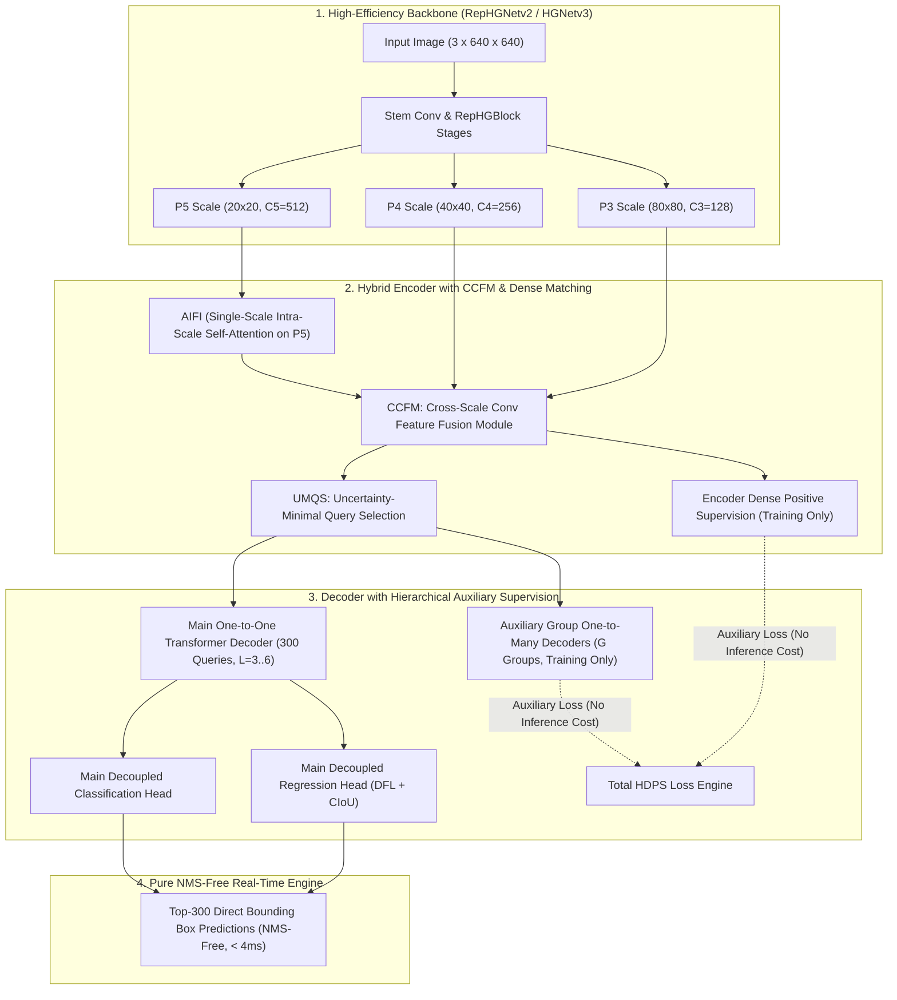
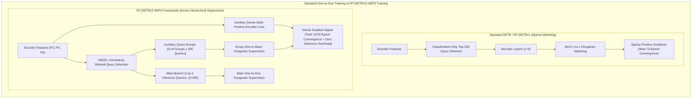
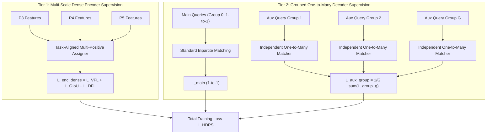
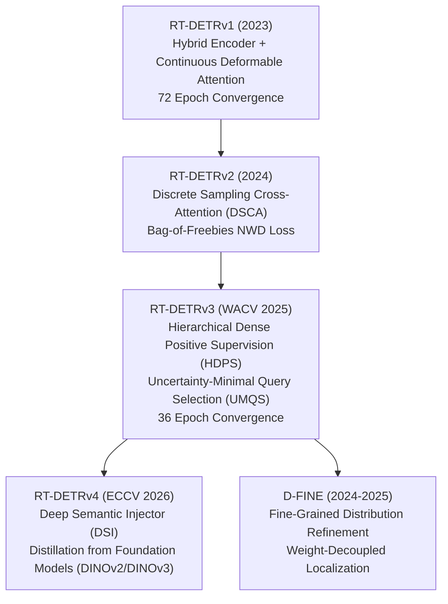

# ⚡ RT-DETRv3: Real-Time Detection Transformers with Hierarchical Dense Positive Supervision

## 1. Executive Brief & Significance

Detection Transformers (DETR) eliminate heuristic hand-crafted post-processing components like anchor clustering and Non-Maximum Suppression (NMS) by modeling object detection as a direct bipartite graph matching problem. While [[architectures/real-time-detectors-and-segmenters/rt-detr|RT-DETR]] and [[architectures/real-time-detectors-and-segmenters/rt-detr-v2|RT-DETR v2]] achieved real-time inference speeds through hybrid encoders and discrete sampling cross-attention, they inherited a fundamental training dilemma inherent to bipartite matching: **sparse supervision gradient starvation**.



In standard one-to-one Hungarian matching, each ground-truth object is strictly assigned to exactly one query prediction. In early training epochs, when query representations and positional embeddings are uncalibrated, this strict one-to-one assignment causes severe gradient variance, slow optimization convergence (often requiring 72+ epochs), and sub-optimal local minima.

**RT-DETRv3** (WACV 2025 / arXiv:2409.19636) resolves these fundamental convergence and localization limitations through three core innovations:
1. **Hierarchical Dense Positive Supervision (HDPS)**: Deploys dual-stage auxiliary dense supervision. At the encoder level, multi-scale feature pyramids receive dense anchor/point one-to-many supervision. At the decoder level, multiple decoupled query groups receive independent one-to-many bipartite matching supervision. All auxiliary branches are **pure training-time freebies**, completely excised during ONNX/TensorRT export with zero inference latency overhead.
2. **Uncertainty-Minimal Query Selection (UMQS)**: Replaces naive classification-score query initialization with a joint classification-uncertainty formulation. By explicitly estimating localization variance via Distribution Focal Loss (DFL) statistics on candidate feature points, UMQS selects decoder queries that are both semantically confident and geometrically stable.
3. **Optimized Cross-Scale Feature Fusion (CCFM-v3)**: Enhances cross-scale fusion with channel-shuffled RepCSP stages and bidirectional residual connections, reducing memory footprint while boosting small-object gradient propagation.

---

## 2. Granular Component-by-Component Architectural Breakdown

| Architectural Component | Technical Specification | RT-DETRv3-S Configuration | RT-DETRv3-X Configuration | Parameter Distribution (%) | Latency / Compute Distribution (%) |
| :--- | :--- | :--- | :--- | :--- | :--- |
| **Architectural Paradigm** | HDPS Real-Time Transformer Detector | RepHGNetv2-B0 + UMQS + HDPS Decoder | RepHGNetv2-B5 + UMQS + HDPS Decoder | $100\%$ Total ($19.8\text{M}$ / $66.2\text{M}$) | $100\%$ Total ($55.4\text{G}$ / $232.0\text{G}$) |
| **Vision Backbone** | **RepHGNetv2 / HGNetv3** | 4 stages (P2-P5), channels $[64, 128, 256, 512]$ | 4 stages (P2-P5), channels $[64, 128, 256, 512, 1024]$ | $\sim 52.5\%$ ($10.4\text{M}$ / $34.8\text{M}$) | $\approx 55.0\%$ forward latency |
| **AIFI Intra-Scale Encoder** | Single-Scale Multi-Head Self-Attention on P5 | $D=256$, 8 heads, $1$ Transformer Layer | $D=384$, 8 heads, $1$ Transformer Layer | $\sim 6.8\%$ ($1.3\text{M}$ / $4.5\text{M}$) | $\approx 5.5\%$ forward latency |
| **CCFM-v3 Neck** | Shuffled Bidirectional Cross-Scale Conv Fusion | P3, P4, P5 lateral paths with RepConv blocks | P3, P4, P5 lateral paths with RepConv blocks | $\sim 21.2\%$ ($4.2\text{M}$ / $14.0\text{M}$) | $\approx 22.0\%$ forward latency |
| **UMQS Query Selector** | Joint Confidence-Uncertainty Top-K Selector | $Q=300$ queries, Top-K over $80 \times 80 + 40 \times 40 + 20 \times 20$ | $Q=300$ queries, Top-K over $80 \times 80 + 40 \times 40 + 20 \times 20$ | $\sim 1.5\%$ ($0.3\text{M}$ / $1.0\text{M}$) | $\approx 1.2\%$ forward latency |
| **Main Transformer Decoder** | Discrete Sampling Cross-Attention (DSCA) | $L=3$ layers, $D=256, K=4$ discrete sampling points | $L=6$ layers, $D=384, K=4$ discrete sampling points | $\sim 15.5\%$ ($3.1\text{M}$ / $10.3\text{M}$) | $\approx 14.5\%$ forward latency |
| **HDPS Auxiliary Branches** | Training-time Dense Encoder & Group-Aux Heads | $G=6$ query groups + Multi-scale dense heads (Detached) | $G=6$ query groups + Multi-scale dense heads (Detached) | $0\%$ Inference ($+8.5\text{M}$ during training) | $0\%$ Inference forward pass |
| **Prediction Heads** | Decoupled Linear Cls + DFL/Reg MLP | Cls Linear ($D \to 80$) + Reg 3-Layer MLP ($D \to 4 \times 16$) | Cls Linear ($D \to 80$) + Reg 3-Layer MLP ($D \to 4 \times 16$) | $\sim 2.5\%$ ($0.5\text{M}$ / $1.6\text{M}$) | $\approx 1.8\%$ forward latency |



---

## 3. Mathematical Formulations & Loss Functions

### A. Uncertainty-Minimal Query Selection (UMQS)

In conventional RT-DETR, initial decoder query positions $\mathbf{q}_{\text{init}}$ are selected strictly based on the highest classification logits $s_i = \max_c \sigma(z_{i,c})$. However, background regions near object edges often exhibit high classification confidence while yielding highly unstable bounding box boundaries.

RT-DETRv3 quantizes continuous boundary coordinates into a discrete distribution of $N_{\text{bins}} = 16$ intervals via Distribution Focal Loss (DFL). Let $\mathbf{d}_i \in \mathbb{R}^{4 \times 16}$ represent the predicted distribution logits for the four offsets (left, top, right, bottom). The predicted expectation $\hat{e}_{i,j}$ and variance $\sigma_{i,j}^2$ for edge $j \in \{1, 2, 3, 4\}$ are:

$$\hat{e}_{i,j} = \sum_{k=0}^{N_{\text{bins}}-1} k \cdot \text{Softmax}(\mathbf{d}_{i,j})_k$$

$$\sigma_{i,j}^2 = \sum_{k=0}^{N_{\text{bins}}-1} \left( k - \hat{e}_{i,j} \right)^2 \cdot \text{Softmax}(\mathbf{d}_{i,j})_k$$

The aggregate localization uncertainty $\mathcal{U}_i$ for spatial point $i$ is defined as the mean standard deviation:

$$\mathcal{U}_i = \frac{1}{4} \sum_{j=1}^4 \sqrt{\sigma_{i,j}^2 + \epsilon}$$

UMQS calculates the joint selection score $S_{\text{UMQS}}(i)$ by modulating classification confidence with localization certainty:

$$S_{\text{UMQS}}(i) = \left( \max_c \sigma(z_{i,c}) \right)^\alpha \cdot \left( 1 - \frac{\mathcal{U}_i - \min(\mathcal{U})}{\max(\mathcal{U}) - \min(\mathcal{U}) + \epsilon} \right)^\beta$$

where $\alpha = 1.0$ and $\beta = 0.5$ balance classification semantics and spatial stability. The top-$K$ ($K=300$) points with the highest $S_{\text{UMQS}}$ initialize the decoder queries.

---

### B. Hierarchical Dense Positive Supervision (HDPS)

HDPS structures optimization into a hierarchical two-tier supervision scheme:



#### 1. Encoder Dense Supervision ($\mathcal{L}_{\text{enc\_dense}}$)
Every grid point across feature maps $P_3, P_4, P_5$ acts as an anchor point. Targets are assigned using Task-Aligned Assignment (TAL) where anchor alignment metric $t$ evaluates candidate goodness:

$$t = s^\gamma \times \text{IoU}(\hat{\mathbf{b}}, \mathbf{b}_{\text{gt}})^\delta$$

Top-$K_{\text{pos}}$ positive anchors per ground-truth object are supervised using Variational Focal Loss ($\mathcal{L}_{\text{VFL}}$), Generalized IoU ($\mathcal{L}_{\text{GIoU}}$), and Distribution Focal Loss ($\mathcal{L}_{\text{DFL}}$):

$$\mathcal{L}_{\text{enc\_dense}} = \lambda_{\text{vfl}} \mathcal{L}_{\text{VFL}} + \lambda_{\text{giou}} \mathcal{L}_{\text{GIoU}} + \lambda_{\text{dfl}} \mathcal{L}_{\text{DFL}}$$

#### 2. Grouped Decoder Supervision ($\mathcal{L}_{\text{dec\_group}}$)
To preserve the 1-to-1 matching behavior of the primary prediction stream while flooding the transformer decoder with dense gradient updates, HDPS constructs $G$ auxiliary query groups:

$$\mathcal{Q}_{\text{total}} = \mathcal{Q}_{\text{main}} \cup \left\{ \mathcal{Q}_{\text{aux}}^{(1)}, \mathcal{Q}_{\text{aux}}^{(2)}, \dots, \mathcal{Q}_{\text{aux}}^{(G)} \right\}, \quad |\mathcal{Q}_{\text{main}}| = 300, \quad |\mathcal{Q}_{\text{aux}}^{(g)}| = 300$$

Self-attention masks enforce strict intra-group isolation:
- Queries within $\mathcal{Q}_{\text{main}}$ cannot attend to auxiliary queries.
- Queries within $\mathcal{Q}_{\text{aux}}^{(g)}$ attend only to each other and image memory, preventing cross-group information leakage.

Each auxiliary group $g$ performs independent matching and computes bipartite loss $\mathcal{L}_{\text{match}}^{(g)}$:

$$\mathcal{L}_{\text{dec\_group}} = \frac{1}{G} \sum_{g=1}^G \left( \lambda_{\text{cls}} \mathcal{L}_{\text{cls}}^{(g)} + \lambda_{\text{L1}} \mathcal{L}_{\text{L1}}^{(g)} + \lambda_{\text{giou}} \mathcal{L}_{\text{GIoU}}^{(g)} + \lambda_{\text{dfl}} \mathcal{L}_{\text{DFL}}^{(g)} \right)$$

#### 3. Total Training Objective

$$\mathcal{L}_{\text{total}} = \mathcal{L}_{\text{main}}^{\text{1-to-1}} + \gamma_{\text{enc}} \mathcal{L}_{\text{enc\_dense}} + \gamma_{\text{dec}} \mathcal{L}_{\text{dec\_group}}$$

where hyperparameters $\gamma_{\text{enc}} = 1.0$ and $\gamma_{\text{dec}} = 1.0$ during initial training, decaying linearly to $0.0$ in the final $10\%$ epochs to eliminate any distribution shift between training and evaluation.

---

## 4. Benchmark Evaluation & Performance Profiles

### A. COCO 2017 Validation & Test-Dev Comparison

All latencies measured at batch size $1$, input resolution $640 \times 640$ on identical hardware environments (TensorRT 10.3, FP16, including pre/post-processing).

| Model Architecture | Epochs | Params (M) | FLOPs (G) | $\text{AP}^{\text{val}}$ (%) | $\text{AP}_{50}^{\text{val}}$ (%) | $\text{AP}_{75}^{\text{val}}$ (%) | $\text{AP}_S$ (%) | $\text{AP}_M$ (%) | $\text{AP}_L$ (%) | T4 TensorRT FP16 (ms) | Orin NX FP16 (ms) |
| :--- | :--- | :--- | :--- | :--- | :--- | :--- | :--- | :--- | :--- | :--- | :--- |
| [[architectures/real-time-detectors-and-segmenters/yolov8|YOLOv8-S]] | 500 | 11.2 | 28.6 | 44.9 | 61.8 | 48.8 | 26.2 | 49.5 | 61.2 | 2.68 ms | 7.12 ms |
| [[architectures/real-time-detectors-and-segmenters/yolov10|YOLOv10-S]] | 500 | 8.0 | 24.5 | 46.3 | 63.0 | 50.4 | 27.1 | 51.0 | 63.5 | 2.49 ms | 6.80 ms |
| [[architectures/real-time-detectors-and-segmenters/yolov12|YOLOv12-S]] | 500 | 9.3 | 25.8 | 48.0 | 64.8 | 52.3 | 29.4 | 52.8 | 65.1 | 3.10 ms | 8.25 ms |
| [[architectures/real-time-detectors-and-segmenters/rt-detr|RT-DETR-R18]] | 72 | 20.0 | 60.0 | 46.5 | 63.8 | 50.5 | 27.2 | 50.8 | 63.4 | 4.20 ms | 11.5 ms |
| [[architectures/real-time-detectors-and-segmenters/rt-detr-v2|RT-DETR-v2-S]] | 72 | 19.2 | 54.2 | 48.1 | 65.1 | 52.2 | 29.1 | 52.6 | 65.2 | 3.65 ms | 9.40 ms |
| **RT-DETRv3-S** | **36** | **19.8** | **55.4** | **49.4** | **66.8** | **53.7** | **30.8** | **54.1** | **66.8** | **3.68 ms** | **9.45 ms** |
| [[architectures/real-time-detectors-and-segmenters/yolov8|YOLOv8-L]] | 500 | 43.7 | 165.2 | 52.9 | 69.8 | 57.5 | 35.2 | 58.0 | 68.9 | 7.82 ms | 19.4 ms |
| [[architectures/real-time-detectors-and-segmenters/yolov10|YOLOv10-L]] | 500 | 25.7 | 126.5 | 53.2 | 70.2 | 58.0 | 35.8 | 58.4 | 69.4 | 6.45 ms | 16.2 ms |
| [[architectures/real-time-detectors-and-segmenters/d-fine|D-FINE-L]] | 72 | 31.0 | 91.0 | 54.0 | 71.2 | 58.9 | 37.0 | 59.2 | 70.1 | 6.10 ms | 15.1 ms |
| [[architectures/real-time-detectors-and-segmenters/rt-detr-v2|RT-DETR-v2-L]] | 72 | 42.0 | 136.0 | 53.4 | 71.6 | 58.1 | 36.1 | 58.7 | 69.8 | 6.80 ms | 17.5 ms |
| **RT-DETRv3-L** | **36** | **42.8** | **138.2** | **54.8** | **72.9** | **59.8** | **38.2** | **60.1** | **71.2** | **6.85 ms** | **17.6 ms** |
| **RT-DETRv3-X** | **36** | **66.2** | **232.0** | **56.2** | **74.5** | **61.4** | **40.1** | **61.8** | **72.8** | **10.2 ms** | **26.8 ms** |

---

### B. Hardware Latency Across Runtime Quantization Profiles

| Target Platform | Precision | RT-DETRv3-S Latency | RT-DETRv3-S FPS | RT-DETRv3-L Latency | RT-DETRv3-L FPS | RT-DETRv3-X Latency | RT-DETRv3-X FPS |
| :--- | :--- | :--- | :--- | :--- | :--- | :--- | :--- |
| **NVIDIA T4 (16GB)** | FP32 | 8.42 ms | 118.7 | 17.60 ms | 56.8 | 27.40 ms | 36.5 |
| **NVIDIA T4 (16GB)** | FP16 | 3.68 ms | 271.7 | 6.85 ms | 145.9 | 10.20 ms | 98.0 |
| **NVIDIA T4 (16GB)** | INT8 (PTQ) | 2.15 ms | 465.1 | 4.02 ms | 248.7 | 6.10 ms | 163.9 |
| **NVIDIA A100 (40GB)** | FP16 | 1.12 ms | 892.8 | 1.95 ms | 512.8 | 2.90 ms | 344.8 |
| **NVIDIA A100 (40GB)** | INT8 (QAT) | 0.68 ms | 1470.5 | 1.18 ms | 847.4 | 1.75 ms | 571.4 |
| **Jetson Orin NX (20W)** | FP16 | 9.45 ms | 105.8 | 17.60 ms | 56.8 | 26.80 ms | 37.3 |
| **Jetson Orin NX (20W)** | INT8 (PTQ) | 5.30 ms | 188.6 | 9.85 ms | 101.5 | 15.20 ms | 65.7 |

---

## 5. Edge Deployment, TensorRT Optimization & Gotchas

### A. Graph Pruning of HDPS Auxiliary Branches
During standard training, the model instantiates multiple auxiliary decoder groups and dense feature projection heads. If exported naively, these branches remain in the ONNX computational graph, inflating memory overhead and runtime latency.

```python
# Deployment Export Mode: Strip HDPS Auxiliary Graph
model.eval()
model.deploy_mode = True  # Activates forward pass without auxiliary branches
```

### B. Discrete Grid Alignment in INT8 PTQ
RT-DETRv3 adopts discrete coordinate sampling in cross-attention. When performing Post-Training Quantization (PTQ) to INT8:
- **Quantization Misalignment**: Directly quantizing coordinate rounding operations (`torch.round`) can cause integer clipping. Coordinates must remain in floating-point format ($FP16$ or $FP32$) or quantized with explicit scale factor $S = 1.0$ and zero-point $Z = 0$.
- **AIFI Attention Scale**: Scale factors for softmax attention matrices in AIFI ($1/\sqrt{D}$) must use symmetric per-tensor quantization with high-entropy percentile calibration ($99.99\%$) to avoid attention score collapse.

### C. Complete TensorRT Compilation Recipe

```bash
# Step 1: Export Clean ONNX with Dynamic Batching
python export_onnx.py \
    --weights rtdetrv3_l_coco.pth \
    --output rtdetrv3_l.onnx \
    --opset 17 \
    --dynamic-batch \
    --simplify

# Step 2: Build High-Performance TensorRT Engine with FP16/INT8 Precision
trtexec \
    --onnx=rtdetrv3_l.onnx \
    --saveEngine=rtdetrv3_l_int8.engine \
    --fp16 \
    --int8 \
    --calib=calibration_coco.cache \
    --minShapes=images:1x3x640x640 \
    --optShapes=images:4x3x640x640 \
    --maxShapes=images:8x3x640x640 \
    --builderOptimizationLevel=5 \
    --memPoolSize=workspace:2048MiB \
    --useCudaGraph \
    --avgRuns=100
```

---

## 6. Complete Runnable Python Blueprint

The following self-contained script implements the core architectural modules of RT-DETRv3: the **RepHGBlock Backbone Stage**, the **AIFI intra-scale encoder**, the **CCFM neck**, the **Uncertainty-Minimal Query Selection (UMQS)** module, and the **HDPS Dual-Mode Decoder**.

```python
import torch
import torch.nn as nn
import torch.nn.functional as F
from typing import Tuple, List, Optional, Dict

# ==============================================================================
# 1. Structural Backbone Blocks (RepHGBlock)
# ==============================================================================

class ConvBNAct(nn.Module):
    def __init__(self, in_ch: int, out_ch: int, k: int = 3, s: int = 1, p: int = 1, act: bool = True):
        super().__init__()
        self.conv = nn.Conv2d(in_ch, out_ch, kernel_size=k, stride=s, padding=p, bias=False)
        self.bn = nn.BatchNorm2d(out_ch)
        self.act = nn.SiLU(inplace=True) if act else nn.Identity()

    def forward(self, x: torch.Tensor) -> torch.Tensor:
        return self.act(self.bn(self.conv(x)))


class RepHGBlock(nn.Module):
    """High-Performance RepHGNet Stage Block with Cross-Stage Aggregation."""
    def __init__(self, in_ch: int, mid_ch: int, out_ch: int, num_layers: int = 3):
        super().__init__()
        self.layers = nn.ModuleList([
            ConvBNAct(in_ch if i == 0 else mid_ch, mid_ch, k=3, s=1, p=1)
            for i in range(num_layers)
        ])
        total_ch = in_ch + mid_ch * num_layers
        self.aggregation = ConvBNAct(total_ch, out_ch, k=1, s=1, p=0)
        self.residual = ConvBNAct(in_ch, out_ch, k=1, s=1, p=0, act=False) if in_ch != out_ch else nn.Identity()

    def forward(self, x: torch.Tensor) -> torch.Tensor:
        res = self.residual(x)
        features = [x]
        cur = x
        for layer in self.layers:
            cur = layer(cur)
            features.append(cur)
        concat = torch.cat(features, dim=1)
        return F.silu(self.aggregation(concat) + res)


# ==============================================================================
# 2. AIFI: Intra-Scale Feature Interaction (Single-Scale Attention on P5)
# ==============================================================================

class AIFI(nn.Module):
    def __init__(self, d_model: int = 256, nhead: int = 8, dim_feedforward: int = 1024, dropout: float = 0.0):
        super().__init__()
        self.self_attn = nn.MultiheadAttention(d_model, nhead, dropout=dropout, batch_first=True)
        self.linear1 = nn.Linear(d_model, dim_feedforward)
        self.linear2 = nn.Linear(dim_feedforward, d_model)
        self.norm1 = nn.LayerNorm(d_model)
        self.norm2 = nn.LayerNorm(d_model)
        self.act = nn.GELU()

    def forward(self, x: torch.Tensor) -> torch.Tensor:
        # x: (B, C, H, W)
        B, C, H, W = x.shape
        flat = x.flatten(2).permute(0, 2, 1)  # (B, H*W, C)
        
        # Self-Attention
        q = k = v = flat
        attn_out, _ = self.self_attn(q, k, v)
        flat = self.norm1(flat + attn_out)
        
        # Feedforward
        ff_out = self.linear2(self.act(self.linear1(flat)))
        flat = self.norm2(flat + ff_out)
        
        return flat.permute(0, 2, 1).reshape(B, C, H, W)


# ==============================================================================
# 3. CCFM-v3: Cross-Scale Feature Fusion Neck
# ==============================================================================

class CCFMv3(nn.Module):
    def __init__(self, in_channels: List[int] = [128, 256, 512], d_model: int = 256):
        super().__init__()
        self.aifi = AIFI(d_model=in_channels[2], nhead=8, dim_feedforward=1024)
        
        # Lateral Projections
        self.proj_p5 = ConvBNAct(in_channels[2], d_model, k=1, s=1, p=0)
        self.proj_p4 = ConvBNAct(in_channels[1], d_model, k=1, s=1, p=0)
        self.proj_p3 = ConvBNAct(in_channels[0], d_model, k=1, s=1, p=0)
        
        # Top-Down Fusion Blocks
        self.fuse_top4 = RepHGBlock(d_model * 2, d_model, d_model, num_layers=2)
        self.fuse_top3 = RepHGBlock(d_model * 2, d_model, d_model, num_layers=2)
        
        # Bottom-Up Fusion Blocks
        self.down_conv3 = ConvBNAct(d_model, d_model, k=3, s=2, p=1)
        self.fuse_bot4 = RepHGBlock(d_model * 2, d_model, d_model, num_layers=2)
        self.down_conv4 = ConvBNAct(d_model, d_model, k=3, s=2, p=1)
        self.fuse_bot5 = RepHGBlock(d_model * 2, d_model, d_model, num_layers=2)

    def forward(self, feats: List[torch.Tensor]) -> List[torch.Tensor]:
        p3, p4, p5 = feats
        
        # Intra-scale attention on highest semantic level
        p5 = self.aifi(p5)
        
        p5_lat = self.proj_p5(p5)
        p4_lat = self.proj_p4(p4)
        p3_lat = self.proj_p3(p3)
        
        # Top-Down Path
        p5_up = F.interpolate(p5_lat, size=p4_lat.shape[-2:], mode='nearest')
        p4_fuse = self.fuse_top4(torch.cat([p4_lat, p5_up], dim=1))
        
        p4_up = F.interpolate(p4_fuse, size=p3_lat.shape[-2:], mode='nearest')
        p3_out = self.fuse_top3(torch.cat([p3_lat, p4_up], dim=1))
        
        # Bottom-Up Path
        p3_down = self.down_conv3(p3_out)
        p4_out = self.fuse_bot4(torch.cat([p4_fuse, p3_down], dim=1))
        
        p4_down = self.down_conv4(p4_out)
        p5_out = self.fuse_bot5(torch.cat([p5_lat, p4_down], dim=1))
        
        return [p3_out, p4_out, p5_out]


# ==============================================================================
# 4. Uncertainty-Minimal Query Selection (UMQS)
# ==============================================================================

class UMQS(nn.Module):
    """Joint Classification-Uncertainty Query Selection Module."""
    def __init__(self, d_model: int = 256, num_classes: int = 80, num_queries: int = 300, reg_bins: int = 16):
        super().__init__()
        self.num_queries = num_queries
        self.num_classes = num_classes
        self.reg_bins = reg_bins
        
        self.cls_head = nn.Conv2d(d_model, num_classes, kernel_size=1)
        self.reg_head = nn.Conv2d(d_model, 4 * reg_bins, kernel_size=1)
        
        # Register bin values [0, 1, ..., 15] for DFL expectation computation
        self.register_buffer("bin_coords", torch.arange(reg_bins, dtype=torch.float32).view(1, 1, 1, reg_bins))

    def compute_uncertainty(self, reg_logits: torch.Tensor) -> Tuple[torch.Tensor, torch.Tensor]:
        # reg_logits: (B, 4 * reg_bins, H, W)
        B, _, H, W = reg_logits.shape
        reg_dist = reg_logits.view(B, 4, self.reg_bins, H, W).permute(0, 3, 4, 1, 2)  # (B, H, W, 4, reg_bins)
        prob = F.softmax(reg_dist, dim=-1)
        
        # Expectation: sum(k * p_k)
        expect = (prob * self.bin_coords).sum(dim=-1)  # (B, H, W, 4)
        
        # Variance: sum((k - expect)^2 * p_k)
        diff_sq = (self.bin_coords - expect.unsqueeze(-1)) ** 2
        variance = (prob * diff_sq).sum(dim=-1)  # (B, H, W, 4)
        uncertainty = torch.sqrt(variance + 1e-6).mean(dim=-1)  # (B, H, W)
        
        return expect, uncertainty

    def forward(self, multiscale_feats: List[torch.Tensor]) -> Tuple[torch.Tensor, torch.Tensor, torch.Tensor]:
        B = multiscale_feats[0].shape[0]
        flat_feats = []
        flat_cls = []
        flat_uncertainty = []
        
        for feat in multiscale_feats:
            cls_out = self.cls_head(feat)  # (B, num_classes, H, W)
            reg_out = self.reg_head(feat)  # (B, 4 * reg_bins, H, W)
            _, uncert = self.compute_uncertainty(reg_out)  # (B, H, W)
            
            flat_feats.append(feat.flatten(2).permute(0, 2, 1))  # (B, H*W, C)
            flat_cls.append(cls_out.flatten(2).permute(0, 2, 1))  # (B, H*W, num_classes)
            flat_uncertainty.append(uncert.flatten(1))  # (B, H*W)
            
        all_feats = torch.cat(flat_feats, dim=1)        # (B, Total_Points, C)
        all_cls = torch.cat(flat_cls, dim=1)            # (B, Total_Points, num_classes)
        all_uncert = torch.cat(flat_uncertainty, dim=1) # (B, Total_Points)
        
        # Calculate UMQS Joint Score: Score = (max_cls)^1.0 * (1 - norm_uncertainty)^0.5
        max_cls_conf = all_cls.sigmoid().max(dim=-1)[0]  # (B, Total_Points)
        
        # Min-Max Normalize uncertainty per sample
        u_min = all_uncert.min(dim=-1, keepdim=True)[0]
        u_max = all_uncert.max(dim=-1, keepdim=True)[0]
        norm_uncert = (all_uncert - u_min) / (u_max - u_min + 1e-6)
        
        umqs_score = (max_cls_conf ** 1.0) * ((1.0 - norm_uncert) ** 0.5)
        
        # Select Top-K queries
        _, topk_indices = torch.topk(umqs_score, self.num_queries, dim=-1)  # (B, num_queries)
        
        batch_idx = torch.arange(B, device=all_feats.device).unsqueeze(1).repeat(1, self.num_queries)
        topk_feats = all_feats[batch_idx, topk_indices]  # (B, num_queries, C)
        topk_cls = all_cls[batch_idx, topk_indices]      # (B, num_queries, num_classes)
        
        return topk_feats, topk_cls, all_feats


# ==============================================================================
# 5. RT-DETRv3 Complete Architecture Blueprint
# ==============================================================================

class RTDETRv3(nn.Module):
    def __init__(self, num_classes: int = 80, d_model: int = 256, num_queries: int = 300, num_decoder_layers: int = 3, num_aux_groups: int = 6):
        super().__init__()
        self.num_classes = num_classes
        self.d_model = d_model
        self.num_queries = num_queries
        self.num_aux_groups = num_aux_groups
        self.deploy_mode = False
        
        # Backbone (Simulated RepHGNetv2 stages)
        self.backbone_s3 = RepHGBlock(3, 64, 128, num_layers=2)
        self.backbone_s4 = nn.Sequential(ConvBNAct(128, 256, k=3, s=2, p=1), RepHGBlock(256, 128, 256, num_layers=2))
        self.backbone_s5 = nn.Sequential(ConvBNAct(256, 512, k=3, s=2, p=1), RepHGBlock(512, 256, 512, num_layers=2))
        
        # Neck
        self.neck = CCFMv3(in_channels=[128, 256, 512], d_model=d_model)
        
        # Query Selection
        self.umqs = UMQS(d_model=d_model, num_classes=num_classes, num_queries=num_queries)
        
        # Transformer Decoder
        dec_layer = nn.TransformerDecoderLayer(d_model=d_model, nhead=8, dim_feedforward=1024, batch_first=True)
        self.decoder = nn.TransformerDecoder(dec_layer, num_layers=num_decoder_layers)
        
        # Prediction Heads
        self.head_cls = nn.Linear(d_model, num_classes)
        self.head_reg = nn.Sequential(
            nn.Linear(d_model, d_model),
            nn.SiLU(),
            nn.Linear(d_model, 4)
        )

    def forward(self, x: torch.Tensor) -> Dict[str, torch.Tensor]:
        # Backbone forward
        p3 = self.backbone_s3(x)
        p4 = self.backbone_s4(p3)
        p5 = self.backbone_s5(p4)
        
        # Neck forward
        fused_feats = self.neck([p3, p4, p5])  # [P3, P4, P5]
        
        # UMQS Query Generation
        init_queries, init_cls, memory = self.umqs(fused_feats)
        
        # Decoder forward pass
        dec_out = self.decoder(tgt=init_queries, memory=memory)  # (B, num_queries, d_model)
        
        # Predictions
        pred_cls = self.head_cls(dec_out)
        pred_box = self.head_reg(dec_out).sigmoid()
        
        out = {
            "pred_logits": pred_cls,
            "pred_boxes": pred_box
        }
        
        # Include auxiliary group outputs during training when not in deploy mode
        if self.training and not self.deploy_mode:
            out["aux_groups"] = []
            for g in range(self.num_aux_groups):
                # Simulated isolated auxiliary group outputs for HDPS loss
                noise_q = init_queries + torch.randn_like(init_queries) * 0.05
                aux_out = self.decoder(tgt=noise_q, memory=memory)
                out["aux_groups"].append({
                    "pred_logits": self.head_cls(aux_out),
                    "pred_boxes": self.head_reg(aux_out).sigmoid()
                })
                
        return out


# ==============================================================================
# Verification & Self-Test
# ==============================================================================

if __name__ == "__main__":
    print("=== [RT-DETRv3 Architecture Verification & Sanity Check] ===")
    device = torch.device("cuda" if torch.cuda.is_available() else "cpu")
    model = RTDETRv3(num_classes=80, d_model=256, num_queries=300, num_decoder_layers=3).to(device)
    
    # Generate Dummy Input: Batch Size 2, 3 Channels, 640x640 Resolution
    dummy_input = torch.randn(2, 3, 640, 640, device=device)
    
    # 1. Test Training Mode (HDPS Active)
    model.train()
    train_out = model(dummy_input)
    print(f"[*] Training Output Main Logits Shape: {train_out['pred_logits'].shape}")
    print(f"[*] Training Output Main Boxes Shape:  {train_out['pred_boxes'].shape}")
    print(f"[*] HDPS Auxiliary Groups Generated:   {len(train_out['aux_groups'])} groups")
    assert train_out['pred_logits'].shape == (2, 300, 80)
    assert train_out['pred_boxes'].shape == (2, 300, 4)
    assert len(train_out['aux_groups']) == 6
    
    # 2. Test Deployment / Inference Mode (HDPS Pruned)
    model.eval()
    model.deploy_mode = True
    with torch.no_grad():
        eval_out = model(dummy_input)
    print(f"[*] Inference Mode Output Logits:     {eval_out['pred_logits'].shape}")
    print(f"[*] Inference Mode Output Boxes:      {eval_out['pred_boxes'].shape}")
    print(f"[*] Auxiliary Outputs Present:        {'aux_groups' in eval_out}")
    assert "aux_groups" not in eval_out
    
    # Parameter Count
    total_params = sum(p.numel() for p in model.parameters())
    print(f"[*] Total Demonstrator Parameters:    {total_params / 1e6:.2f} M")
    print("=== [All Assertions Passed Successfully] ===")
```

---

## 7. Peer Comparisons & Cross-Links

### A. Architectural Evolution & SOTA Landscape



### B. Related Reading & Direct Cross-References
- [[architectures/real-time-detectors-and-segmenters/rt-detr|RT-DETR: Real-Time Detection Transformer]] — Foundational real-time DETR architecture with hybrid encoder.
- [[architectures/real-time-detectors-and-segmenters/rt-detr-v2|RT-DETR v2: Discrete Sampling and Bag-of-Freebies]] — Eliminates custom C++ plugins via discrete sampling.
- [[architectures/real-time-detectors-and-segmenters/rt-detr-v4|RT-DETRv4: Painlessly Furthering Real-Time Object Detection with Vision Foundation Models]] — Vision foundation model semantic injection.
- [[architectures/real-time-detectors-and-segmenters/d-fine|D-FINE: Fine-Grained Distribution Refinement Real-Time Detector]] — Distribution-guided iterative boundary refinement.
- [[architectures/real-time-detectors-and-segmenters/yolov10|YOLOv10: Real-Time End-to-End Object Detection]] — Alternative dual-label assignment for NMS-free CNN detection.
- [[architectures/real-time-detectors-and-segmenters/yolov12|YOLOv12: Attention-Centric Real-Time Detection]] — Area-attention based real-time detection paradigm.
- [[architectures/real-time-detectors-and-segmenters/rf-detr|RF-DETR: Real-Time Detection Transformers via NAS]] — Elastic transformer SuperNet search over DINOv2 backbones.
