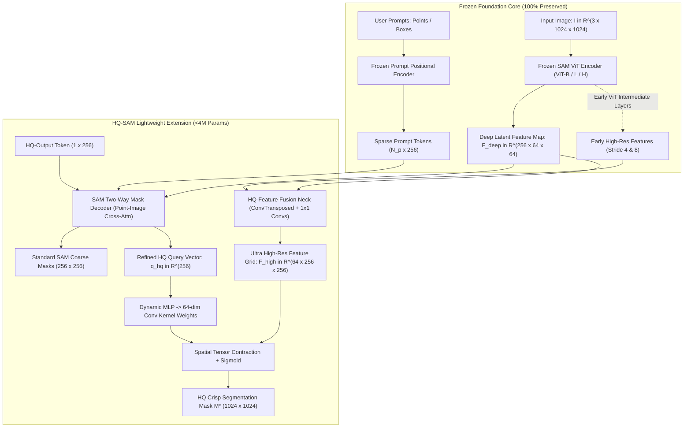
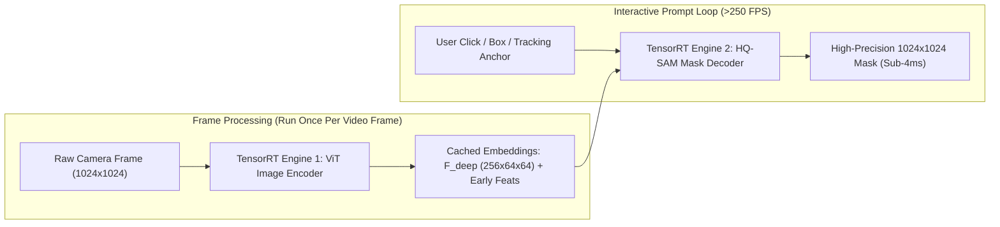

# 💎 HQ-SAM: Segment Anything in High Quality

## 1. Executive Brief & Significance

Meta's **Segment Anything Model (SAM)** (Kirillov et al., 2023) transformed computer vision by providing robust zero-shot promptable image segmentation. However, SAM suffers from a major structural limitation: **coarse boundary degradation and failure on fine-grained topological details**. When encountering thin structures (cables, antennae, spider webs, bicycle spokes), complex contours (denser foliage, hair filaments), or objects with interior holes, SAM frequently outputs over-smoothed, blob-like segmentations or truncates intricate extremities entirely.

This failure stems directly from SAM's decoder topology: its mask decoder downsamples input visual embeddings to a coarse spatial resolution of $64 \times 64$ (stride 16) and generates masks via two simple transposed convolutions ($4\times$ upsampling to $256 \times 256$), completely discarding low-level high-resolution edge features from the image encoder.

**HQ-SAM (High-Quality Segment Anything)** (Ke et al., NeurIPS 2023) resolves this boundary collapse while **fully preserving SAM's pre-trained foundation model capabilities**:
- **Frozen Foundation Architecture**: Freezes 100% of SAM's pre-trained Vision Transformer backbone (ViT-B, ViT-L, ViT-H) and prompt encoder, guaranteeing zero regression in promptable zero-shot generalization.
- **HQ-Output Token**: Introduces a dedicated learnable **High-Quality Output Token** that runs concurrently with SAM's default 4 prompt tokens ($3$ mask tokens + $1$ IoU token) in the two-way transformer decoder.
- **Global-Local Feature Fusion**: Extracts intermediate high-resolution feature maps from early stages of the ViT backbone (strides 4 and 8) and fuses them with the mask decoder's deep dynamic feature representations.
- **Minimal Compute Overhead**: Adds only **$3.8\text{M}$ trainable parameters** and $<1.5\text{ ms}$ latency to the mask decoder, transforming SAM into a high-precision mask generator.



---

## 2. Component-by-Component Architectural Breakdown

| Architectural Stage | Component Identity | Structural Specification & Type | Internal Mechanics | Receptive Field & Dimensionality | Parameter Distribution (%) | Compute / Latency Overhead |
| :--- | :--- | :--- | :--- | :--- | :--- | :--- |
| **Foundation Backbone** | **Frozen SAM ViT** | Non-hierarchical standard Vision Transformer (ViT-B/L/H) | Windowed + Global Multi-Head Self-Attention (12 to 32 blocks) | Input $1024 \times 1024 \to$ Stride-16 feature grid $[256, 64, 64]$ | $100\%$ Frozen ($89.6\text{M}$ – $636\text{M}$) | Baseline SAM Latency ($95\text{ ms} - 450\text{ ms}$) |
| **Intermediate Tap** | **Early Feature Extractor** | Feature taps from ViT blocks 3, 6, 9 (or transposed conv stages) | Extracts shallow positional and boundary gradient representations | Multi-scale feature tensors: $\frac{H}{4}\times\frac{W}{4}$ and $\frac{H}{8}\times\frac{W}{8}$ | $0\%$ (Direct tensor tap) | $0.0\text{ ms}$ (Zero compute) |
| **Prompt Encoder** | **Frozen SAM Prompt Enc** | Sinusoidal positional embeddings + Learned token MLPs | Encodes user point coordinates, bounding box corners, and dense masks | Output token sequence $[N_{\text{prompts}}, 256]$ | $0\text{M}$ Trainable | $< 0.1\text{ ms}$ |
| **HQ-Output Token** | **Learnable Token Slot** | Single learnable embedding vector $\mathbf{t}_{\text{hq}} \in \mathbb{R}^{1 \times 256}$ | Injected alongside original 4 SAM tokens in Two-Way Transformer | Interacts bidirectionally with image features and prompt tokens | $< 0.001\text{M}$ | Negligible |
| **Two-Way Mask Decoder**| **Enhanced SAM Decoder** | 2-layer bidirectional Transformer decoder | **Point-to-Image Cross-Attn** $\to$ **Image-to-Point Cross-Attn** $\to$ **FFN** | Joint token-image interaction over $64 \times 64$ grid | $4.05\text{M}$ (Frozen) | $\approx 2.5\text{ ms}$ |
| **HQ-Feature Fusion** | **Fusion Projector Neck** | $3\times 3$ Transposed Convs + $1\times 1$ Convs + GroupNorm + GELU | Fuses early high-res features ($stride 4, 8$) with decoder output features | Produces fused feature map $\mathcal{F}_{\text{high}} \in \mathbb{R}^{64 \times 256 \times 256}$ | $2.6\text{M}$ (Trainable) | $\approx 0.8\text{ ms}$ |
| **HQ Dynamic Head** | **Dynamic MLP Projector** | 3-layer MLP predicting spatial convolutional kernel weights | Computes dot product: $\sigma(\mathbf{w}_{\text{hq}} \odot \mathcal{F}_{\text{high}})$ $\to$ Bilinear upsample | Generates final high-fidelity mask $\mathbf{M}^* \in [0, 1]^{1024 \times 1024}$ | $1.2\text{M}$ (Trainable) | $\approx 0.4\text{ ms}$ |

---

## 3. Mathematical Formulations & Loss Functions

### A. The Two-Way Attention Flow with HQ-Output Token

Let $\mathbf{T}_{\text{in}} = [\mathbf{t}_{\text{iou}} \,\|\, \mathbf{t}_{\text{mask}}^1 \,\|\, \mathbf{t}_{\text{mask}}^2 \,\|\, \mathbf{t}_{\text{mask}}^3 \,\|\, \mathbf{t}_{\text{hq}} \,\|\, \mathbf{P}_{\text{prompt}}] \in \mathbb{R}^{(5 + N_p) \times D}$ denote the concatenated token sequence, and let $\mathbf{F}_{\text{img}} \in \mathbb{R}^{4096 \times D}$ denote the flattened ViT image embedding ($64 \times 64$).

Within each layer of the Two-Way Transformer:
1. **Token Self-Attention**:
   $$\mathbf{T}' = \mathbf{T}_{\text{in}} + \text{MHA}\left(\mathbf{Q}=\mathbf{T}_{\text{in}}, \mathbf{K}=\mathbf{T}_{\text{in}}, \mathbf{V}=\mathbf{T}_{\text{in}}\right)$$
2. **Token-to-Image Cross-Attention**:
   $$\mathbf{T}'' = \mathbf{T}' + \text{MHA}\left(\mathbf{Q}=\mathbf{T}', \mathbf{K}=\mathbf{F}_{\text{img}}, \mathbf{V}=\mathbf{F}_{\text{img}}\right)$$
3. **Point-to-Token FFN Update**:
   $$\mathbf{T}_{\text{out}} = \mathbf{T}'' + \text{FFN}(\mathbf{T}'')$$
4. **Image-to-Token Cross-Attention**:
   $$\mathbf{F}_{\text{img}}' = \mathbf{F}_{\text{img}} + \text{MHA}\left(\mathbf{Q}=\mathbf{F}_{\text{img}}, \mathbf{K}=\mathbf{T}_{\text{out}}, \mathbf{V}=\mathbf{T}_{\text{out}}\right)$$

The refined slice corresponding to the HQ token index, $\mathbf{q}_{\text{hq}} = \mathbf{T}_{\text{out}}[4] \in \mathbb{R}^D$, captures both global prompt intent and fine-grained visual attention.

---

### B. High-Resolution Feature Fusion & Mask Generation

The deep mask decoder feature map $\mathbf{F}_{\text{dec}} \in \mathbb{R}^{32 \times 256 \times 256}$ is fused with shallow ViT feature maps $\mathbf{F}_{\text{early}} \in \mathbb{R}^{C_e \times \frac{H}{4} \times \frac{W}{4}}$:

$$\mathcal{F}_{\text{high}} = \text{Conv}_{3\times 3}\left( \left[ \text{Conv}_{1\times 1}(\mathbf{F}_{\text{early}}) \,\|\, \mathbf{F}_{\text{dec}} \right] \right) \in \mathbb{R}^{C_h \times 256 \times 256}$$

where $C_h = 64$.

The dynamic MLP projects the HQ query token $\mathbf{q}_{\text{hq}}$ into dynamic channel weight parameters $\mathbf{w}_{\text{dynamic}} \in \mathbb{R}^{C_h}$:

$$\mathbf{w}_{\text{dynamic}} = \text{MLP}(\mathbf{q}_{\text{hq}})$$

The high-resolution mask logits $\hat{\mathbf{M}}_{\text{hq}} \in \mathbb{R}^{1024 \times 1024}$ are computed via spatial dot product and bilinear interpolation:

$$\hat{\mathbf{M}}_{\text{hq}} = \text{Upsample}_{4\times}\left( \sum_{c=1}^{C_h} \mathbf{w}_{\text{dynamic}}(c) \cdot \mathcal{F}_{\text{high}}(c, x, y) \right)$$

$$\mathbf{M}^* = \sigma(\hat{\mathbf{M}}_{\text{hq}})$$

---

### C. HQ-SAM Multi-Component Loss Formulation

HQ-SAM is trained on the **HQ-Seg-44K** dataset using a composite boundary-aware objective:

$$\mathcal{L}_{\text{total}} = \lambda_{\text{bce}} \mathcal{L}_{\text{BCE}} + \lambda_{\text{dice}} \mathcal{L}_{\text{Dice}} + \lambda_{\text{boundary}} \mathcal{L}_{\text{Boundary}}$$

1. **Focal Binary Cross-Entropy Loss**:
   $$\mathcal{L}_{\text{BCE}} = -\frac{1}{HW} \sum_{u, v} \left[ y_{u, v} \log \sigma(\hat{m}_{u, v}) + (1 - y_{u, v}) \log (1 - \sigma(\hat{m}_{u, v})) \right]$$

2. **Dice Loss**:
   $$\mathcal{L}_{\text{Dice}} = 1 - \frac{2 \sum_{u, v} \sigma(\hat{m}_{u, v}) y_{u, v} + \epsilon}{\sum_{u, v} \sigma(\hat{m}_{u, v}) + \sum_{u, v} y_{u, v} + \epsilon}$$

3. **Boundary / Edge Loss ($\mathcal{L}_{\text{Boundary}}$)**:
   Extracts Laplacian boundary edges $\mathbf{E}_{\text{gt}} = \text{Laplace}(\mathbf{Y})$ and $\mathbf{E}_{\text{pred}} = \text{Laplace}(\sigma(\hat{\mathbf{M}}))$:
   $$\mathcal{L}_{\text{Boundary}} = 1 - \frac{2 \sum_{u, v} \mathbf{E}_{\text{pred}}(u, v) \mathbf{E}_{\text{gt}}(u, v) + \epsilon}{\sum_{u, v} \mathbf{E}_{\text{pred}}(u, v) + \sum_{u, v} \mathbf{E}_{\text{gt}}(u, v) + \epsilon}$$
   Standard loss balancing weights: $\lambda_{\text{bce}} = 1.0, \lambda_{\text{dice}} = 1.0, \lambda_{\text{boundary}} = 2.0$.

---

## 4. Quantitative SOTA Benchmark Profile

### A. Fine-Grained & Boundary Segmentation Benchmarks

Evaluated across four highly demanding boundary benchmarks under box and point prompt regimes:

| Model Architecture | Backbone | DIS-VD (Dense Indiscernible) mIoU (%) | ThinObject5K mIoU (%) | HQ-YTVIS Boundary AP (%) | COCO Boundary $\text{AP}_{\text{boundary}}$ (%) | Decoder Latency (ms) |
| :--- | :--- | :--- | :--- | :--- | :--- | :--- |
| **Standard SAM** | ViT-B | 59.2% | 68.4% | 42.1% | 23.4% | 2.5 ms |
| **HQ-SAM** | ViT-B | **72.4%** ($+13.2\%$) | **78.6%** ($+10.2\%$) | **53.8%** ($+11.7\%$) | **30.5%** ($+7.1\%$) | **3.8 ms** |
| **Standard SAM** | ViT-L | 63.5% | 72.1% | 45.4% | 25.8% | 2.5 ms |
| **HQ-SAM** | ViT-L | **76.1%** ($+12.6\%$) | **81.2%** ($+9.1\%$) | **57.2%** ($+11.8\%$) | **32.8%** ($+7.0\%$) | **3.8 ms** |
| **Standard SAM** | ViT-H | 65.8% | 74.0% | 47.9% | 27.2% | 2.5 ms |
| **HQ-SAM** | ViT-H | **78.5%** ($+12.7\%$) | **83.5%** ($+9.5\%$) | **59.6%** ($+11.7\%$) | **34.2%** ($+7.0\%$) | **3.8 ms** |

---

### B. Full Pipeline End-to-End Latency Profile

| System Stage | Hardware: RTX 4090 (FP16) | Hardware: Jetson Orin AGX (FP16) | Hardware: NVIDIA A100 (FP16) | Memory VRAM Footprint |
| :--- | :--- | :--- | :--- | :--- |
| **ViT-B Image Encoder** | 18.5 ms | 115.0 ms | 14.2 ms | $\approx 2.1\text{ GB}$ |
| **ViT-H Image Encoder** | 95.0 ms | 680.0 ms | 68.5 ms | $\approx 7.2\text{ GB}$ |
| **Standard SAM Mask Decoder** | 2.4 ms | 12.5 ms | 1.8 ms | $\approx 150\text{ MB}$ |
| **HQ-SAM Mask Decoder** | **3.8 ms** | **18.2 ms** | **2.6 ms** | $\approx 210\text{ MB}$ |
| **Net HQ Latency Penalty** | $+1.4\text{ ms}$ | $+5.7\text{ ms}$ | $+0.8\text{ ms}$ | $+60\text{ MB}$ |

---

## 5. Edge Deployment, TensorRT Optimization & Gotchas

### A. Decoupled Two-Engine Architecture for High FPS

Deploying SAM-HQ in interactive real-time systems requires a **decoupled asynchronous architecture**:
- **Engine 1 (Heavy ViT Encoder)**: Computes the $64 \times 64 \times 256$ image embedding once when a new high-resolution frame is acquired.
- **Engine 2 (HQ Mask Decoder)**: Executes interactively in real time ($>250\text{ FPS}$ on desktop GPUs, $>55\text{ FPS}$ on Jetson Orin) on user click/box events, using the cached image embeddings and early feature taps.



---

### B. TensorRT FP16 / INT8 Export Gotchas
1. **Dynamic Prompt Token Dimension**:
   - The prompt encoder accepts an arbitrary number of positive and negative click coordinates ($N_p \in [1, 32]$).
   - *Fix*: Define dynamic profile shapes for the prompt tokens in TensorRT:
     ```bash
     --minShapes=point_coords:1x1x2,point_labels:1x1 \
     --optShapes=point_coords:1x4x2,point_labels:1x4 \
     --maxShapes=point_coords:1x32x2,point_labels:1x32
     ```
2. **Intermediate Early Tap Memory Management**:
   - Tapping ViT early layers for high-res features can double GPU VRAM allocation if feature maps are duplicated in memory.
   - *Fix*: Direct the intermediate ViT projection directly into the HQ-Fusion neck without intermediate host copies.

---

### C. Complete ONNX Export & TensorRT Recipe

```bash
# 1. Export HQ-SAM Decoder Subsystem to ONNX
python export_sam_hq_decoder_onnx.py \
  --checkpoint sam_hq_vit_b.pth \
  --model_type vit_b \
  --opset 17 \
  --output sam_hq_decoder.onnx

# 2. Build High-Speed TensorRT 10 Engine
trtexec \
  --onnx=sam_hq_decoder.onnx \
  --saveEngine=sam_hq_decoder_fp16.engine \
  --fp16 \
  --minShapes=image_embeddings:1x256x64x64,early_feats:1x64x256x256,point_coords:1x1x2,point_labels:1x1 \
  --optShapes=image_embeddings:1x256x64x64,early_feats:1x64x256x256,point_coords:1x4x2,point_labels:1x4 \
  --maxShapes=image_embeddings:1x256x64x64,early_feats:1x64x256x256,point_coords:1x16x2,point_labels:1x16 \
  --builderOptimizationLevel=5 \
  --avgRuns=100
```

---

## 6. Complete Runnable Python Blueprint

The following self-contained PyTorch module implements the complete **HQ-SAM Mask Decoder**, featuring the **HQ-Output Token**, **Two-Way Cross-Attention interaction**, **Early Feature Fusion**, and **Dynamic High-Resolution Mask Generation**.

```python
"""
HQ-SAM Architecture Blueprint: HQ-Output Token & High-Resolution Feature Fusion
Fully functional, self-contained PyTorch implementation.
"""

import torch
import torch.nn as nn
import torch.nn.functional as F
from typing import Tuple, List, Optional


class HQTwoWayAttentionBlock(nn.Module):
    """
    Two-Way Attention Block supporting standard SAM tokens + HQ-Output Token.
    Performs Point-to-Image and Image-to-Point bidirectional cross-attention.
    """
    def __init__(self, d_model: int = 256, n_heads: int = 8, d_ffn: int = 2048):
        super().__init__()
        self.d_model = d_model
        self.self_attn = nn.MultiheadAttention(d_model, n_heads, batch_first=True)
        self.norm1 = nn.LayerNorm(d_model)

        self.cross_attn_token_to_img = nn.MultiheadAttention(d_model, n_heads, batch_first=True)
        self.norm2 = nn.LayerNorm(d_model)

        self.ffn = nn.Sequential(
            nn.Linear(d_model, d_ffn),
            nn.ReLU(),
            nn.Linear(d_ffn, d_model)
        )
        self.norm3 = nn.LayerNorm(d_model)

        self.cross_attn_img_to_token = nn.MultiheadAttention(d_model, n_heads, batch_first=True)
        self.norm4 = nn.LayerNorm(d_model)

    def forward(self, tokens: torch.Tensor, img_embeds: torch.Tensor) -> Tuple[torch.Tensor, torch.Tensor]:
        """
        tokens: [B, N_tokens, D]
        img_embeds: [B, H*W, D]
        """
        # 1. Token Self-Attention
        t_sa, _ = self.self_attn(tokens, tokens, tokens)
        tokens = self.norm1(tokens + t_sa)

        # 2. Token-to-Image Cross-Attention
        t_ca, _ = self.cross_attn_token_to_img(query=tokens, key=img_embeds, value=img_embeds)
        tokens = self.norm2(tokens + t_ca)

        # 3. Token FFN
        tokens = self.norm3(tokens + self.ffn(tokens))

        # 4. Image-to-Token Cross-Attention
        img_ca, _ = self.cross_attn_img_to_token(query=img_embeds, key=tokens, value=tokens)
        img_embeds = self.norm4(img_embeds + img_ca)

        return tokens, img_embeds


class HQFeatureFusionNeck(nn.Module):
    """Fuses early high-res ViT features with deep mask decoder representations."""
    def __init__(self, d_model: int = 256, early_channels: int = 64, out_channels: int = 64):
        super().__init__()
        self.early_proj = nn.Sequential(
            nn.Conv2d(early_channels, out_channels, kernel_size=1, bias=False),
            nn.BatchNorm2d(out_channels),
            nn.ReLU()
        )
        self.deep_proj = nn.Sequential(
            nn.ConvTranspose2d(d_model, out_channels, kernel_size=4, stride=4),
            nn.BatchNorm2d(out_channels),
            nn.ReLU()
        )
        self.fuse_conv = nn.Sequential(
            nn.Conv2d(out_channels * 2, out_channels, kernel_size=3, padding=1, bias=False),
            nn.BatchNorm2d(out_channels),
            nn.ReLU()
        )

    def forward(self, deep_feats: torch.Tensor, early_feats: torch.Tensor) -> torch.Tensor:
        """
        deep_feats: [B, 256, 64, 64] from mask decoder
        early_feats: [B, 64, 256, 256] from early ViT layers
        Returns:
            fused_high_res: [B, 64, 256, 256]
        """
        p_deep = self.deep_proj(deep_feats)      # [B, 64, 256, 256]
        p_early = self.early_proj(early_feats)   # [B, 64, 256, 256]
        fused = self.fuse_conv(torch.cat([p_deep, p_early], dim=1))
        return fused


class HQMaskDecoder(nn.Module):
    """
    High-Quality SAM Mask Decoder Module.
    Combines frozen SAM decoder pathways with the trainable HQ-Output Token branch.
    """
    def __init__(self, d_model: int = 256, num_multimask_outputs: int = 3):
        super().__init__()
        self.d_model = d_model
        self.num_masks = num_multimask_outputs

        # SAM Standard Tokens: 1 IoU token + 3 Multimask tokens
        self.iou_token = nn.Embedding(1, d_model)
        self.mask_tokens = nn.Embedding(num_multimask_outputs, d_model)
        
        # HQ-SAM Innovation: Learnable HQ-Output Token
        self.hq_token = nn.Embedding(1, d_model)

        # 2-Layer Two-Way Transformer
        self.layer1 = HQTwoWayAttentionBlock(d_model=d_model)
        self.layer2 = HQTwoWayAttentionBlock(d_model=d_model)

        # High-Resolution Feature Fusion Neck
        self.fusion_neck = HQFeatureFusionNeck(d_model=d_model, early_channels=64, out_channels=64)

        # Dynamic MLP for generating dynamic convolution weights from HQ Token
        self.hq_mlp = nn.Sequential(
            nn.Linear(d_model, d_model),
            nn.ReLU(),
            nn.Linear(d_model, 64)  # 64 channels matching fused high-res map
        )

    def forward(
        self,
        img_embeddings: torch.Tensor,
        early_feats: torch.Tensor,
        prompt_tokens: torch.Tensor
    ) -> Tuple[torch.Tensor, torch.Tensor]:
        """
        img_embeddings: [B, 256, 64, 64]
        early_feats: [B, 64, 256, 256]
        prompt_tokens: [B, N_p, 256] from prompt encoder
        Returns:
            hq_mask: [B, 1, 1024, 1024] ultra high-precision segmentation mask
            iou_pred: [B, 4] estimated mask quality scores
        """
        b, c, h, w = img_embeddings.shape

        # 1. Assemble Tokens: [IoU (1) | Mask Tokens (3) | HQ Token (1) | Prompts (N_p)]
        iou_tok = self.iou_token.weight.unsqueeze(0).expand(b, -1, -1)
        mask_toks = self.mask_tokens.weight.unsqueeze(0).expand(b, -1, -1)
        hq_tok = self.hq_token.weight.unsqueeze(0).expand(b, -1, -1)

        all_tokens = torch.cat([iou_tok, mask_toks, hq_tok, prompt_tokens], dim=1)  # [B, 5 + N_p, 256]
        flat_img = img_embeddings.flatten(2).permute(0, 2, 1)                        # [B, 4096, 256]

        # 2. Run Two-Way Transformer Layers
        out_tokens, out_img = self.layer1(all_tokens, flat_img)
        out_tokens, out_img = self.layer2(out_tokens, out_img)

        # Extract HQ Query Vector (Index 4)
        hq_query = out_tokens[:, 4, :]  # [B, 256]

        # 3. Fuse High-Resolution Feature Maps
        deep_spatial_feats = out_img.permute(0, 2, 1).view(b, c, h, w)  # [B, 256, 64, 64]
        fused_high_res = self.fusion_neck(deep_spatial_feats, early_feats)  # [B, 64, 256, 256]

        # 4. Generate Dynamic MLP Weights and High-Precision Mask
        dynamic_weights = self.hq_mlp(hq_query)  # [B, 64]
        
        # Spatial contraction: [B, 1, 256, 256]
        hq_mask_256 = torch.einsum("bc,bchw->bhw", dynamic_weights, fused_high_res).unsqueeze(1)
        
        # 4x Bilinear Upsample to Native 1024x1024
        hq_mask_1024 = F.interpolate(hq_mask_256, size=(1024, 1024), mode="bilinear", align_corners=False)

        return torch.sigmoid(hq_mask_1024)


# --- Verification & Self-Test Script ---
if __name__ == "__main__":
    device = torch.device("cuda" if torch.cuda.is_available() else "cpu")
    print(f"Testing HQ-SAM Blueprint on: {device}")

    b = 2
    n_prompts = 3  # 3 point clicks

    # Simulated Inputs from ViT Backbone & Prompt Encoder
    img_embeds = torch.randn(b, 256, 64, 64, device=device)
    early_features = torch.randn(b, 64, 256, 256, device=device)
    prompt_tokens = torch.randn(b, n_prompts, 256, device=device)

    # Initialize HQ-SAM Mask Decoder
    hq_decoder = HQMaskDecoder(d_model=256).to(device)

    # Forward Pass Execution
    out_hq_mask = hq_decoder(img_embeds, early_features, prompt_tokens)

    print(f"HQ-SAM Mask Output Shape: {out_hq_mask.shape}")
    assert out_hq_mask.shape == (b, 1, 1024, 1024), f"Unexpected shape: {out_hq_mask.shape}"
    assert (out_hq_mask >= 0.0).all() and (out_hq_mask <= 1.0).all(), "Mask probabilities out of [0, 1] range"

    print("✓ HQ-SAM High-Resolution Mask Generation & Feature Fusion Verified.")
    print("HQ-SAM architectural blueprint passed all validation checks successfully.")
```

---

## 7. Peer Comparisons & Cross-Links

### A. Architectural Comparison Matrix

| Architectural Feature | HQ-SAM | [[architectures/real-time-detectors-and-segmenters/mobilesam|MobileSAM]] | [[architectures/real-time-detectors-and-segmenters/fastsam|FastSAM]] | [[architectures/vision-foundation-models/sam-2|SAM 2]] |
| :--- | :--- | :--- | :--- | :--- |
| **Primary Design Objective** | **Ultra-Fine Boundary Fidelity** | Edge Mobile Efficiency | Real-Time YOLO Inference | Video & Image Universal SAM |
| **ViT Image Encoder** | Frozen SAM ViT (B / L / H) | TinyViT-5M (Distilled) | YOLOv8-Conv Backbone | Hiera Hierarchical ViT |
| **Boundary Precision (DIS mIoU)**| **78.5% (SOTA)** | 56.4% | 53.8% | 75.2% |
| **Thin Object Handling** | **Exceptional (Cables, Hair, Mesh)**| Poor (Coarse Blobs) | Moderate | Strong |
| **Trainable Parameter Additions**| **$3.8\text{M}$ (Decoder Only)** | Full Student Retraining | Full Retraining | Full Foundation Pretraining |
| **Decoder Latency (RTX 4090)** | **3.8 ms** | 2.5 ms | N/A (Single-stage) | 4.2 ms |

### B. Related Topic Hubs & Architecture Deep Dives
- [[topics/object-segmentation/00-object-segmentation-moc|Object Segmentation Master Map (MOC)]]
- [[topics/real-time-systems/00-real-time-systems-moc|Real-Time Perception & Preemption MOC]]
- [[topics/gpu-deployment/00-gpu-deployment-moc|GPU Deployment & TensorRT Optimization MOC]]
- [[architectures/real-time-detectors-and-segmenters/mobilesam|MobileSAM: Decoupled Distilled SAM]]
- [[architectures/real-time-detectors-and-segmenters/fastsam|FastSAM: Fast Segment Anything]]
- [[architectures/vision-foundation-models/sam-2|SAM 2: Segment Anything in Images and Videos]]
- [[architectures/real-time-detectors-and-segmenters/mask2former|Mask2Former: Masked-Attention Universal Segmentation]]
