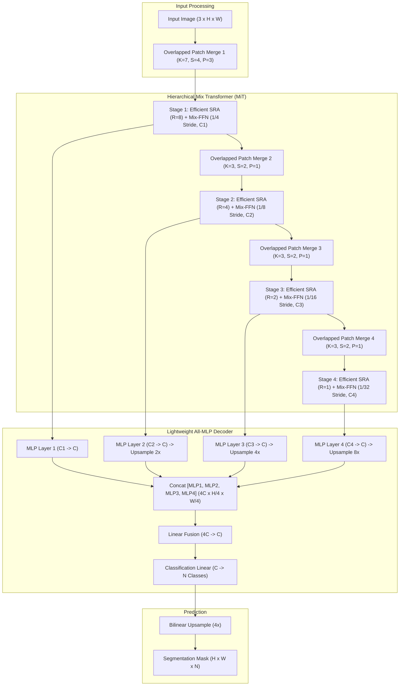
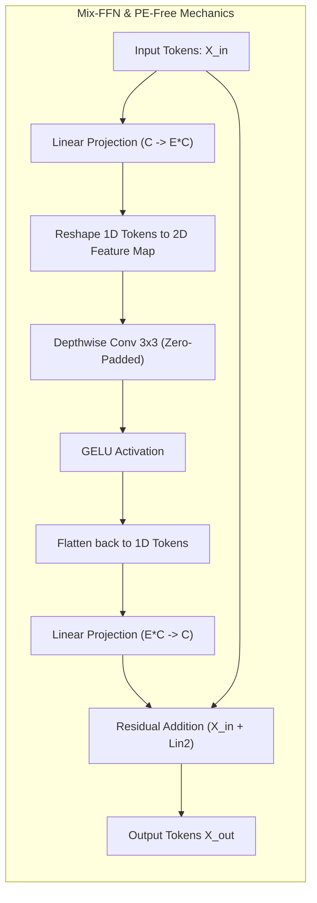

# ⚡ SegFormer: Simple and Efficient Design for Semantic Segmentation with Transformers

## 1. Executive Brief & Significance

Early vision transformer segmenters (such as SETR or Segmenter) directly retrofitted standard Vision Transformers (ViT) into dense prediction tasks. These models suffered from three critical architectural bottlenecks:
1. **Fixed Positional Encodings**: Traditional ViTs require fixed-size positional encodings (PE), which degrade accuracy when interpolated to variable test resolutions.
2. **Monolithic Single-Scale Representations**: Standard ViTs output features at a single low spatial resolution (typically $1/16$), failing to capture fine-grained spatial boundaries.
3. **Heavy Decoder Overhead**: Prior models required heavy, computationally intensive decoders (e.g., multi-layer ASPP or cascading cross-attention) to recover spatial details, rendering real-time inference impossible.

**SegFormer** (*Xie et al., NeurIPS 2021*) completely redesigns the transformer segmentation framework by introducing a **Hierarchical Mix Transformer (MiT)** encoder paired with a radically lightweight **All-MLP Decoder**:
- **Positional-Encoding-Free (PE-Free) Design**: Eliminates absolute positional embeddings. Instead, it introduces **Mix-FFN**, which uses depthwise convolutions with zero-padding to implicitly provide relative positional information, enabling seamless zero-shot generalization to arbitrary input resolutions.
- **Hierarchical Multi-Scale Features**: Produces CNN-like multi-scale feature maps at strides $\{4, 8, 16, 32\}$, naturally delivering high-resolution detail and wide semantic context.
- **Efficient Spatial Reduction Attention (SRA)**: Employs a sequence-reduction ratio $R$ to downsample Key and Value tokens prior to dot-product attention, reducing computational complexity from $\mathcal{O}(N^2)$ to $\mathcal{O}(N^2 / R)$.
- **Lightweight All-MLP Decoder**: Discards complex dilated convolutions and heavy decoders. Instead, it aggregates multi-level features using simple linear projections, bilinear upsampling, concatenation, and a final MLP layer—consuming less than $0.5\text{M}$ parameters and $< 10\%$ of total inference latency.



---

## 2. Component-by-Component Decomposition

| Architectural Component | Technical Specification | SegFormer-B0 (Real-Time) | SegFormer-B5 (High-Cap) | Parameter Distribution (%) | Latency / Compute Distribution (%) |
| :--- | :--- | :--- | :--- | :--- | :--- |
| **Patch Embeddings** | Overlapped strided convolutions ($7 \times 7$ S4, $3 \times 3$ S2) | Channels: $[32, 64, 160, 256]$ | Channels: $[64, 128, 320, 512]$ | $\sim 2.5\%$ ($0.09\text{M}$ / $2.1\text{M}$) | $\approx 6.0\%$ of forward pass latency |
| **MiT Stage 1 (1/4)** | Overlapped Patch Merging + SRA ($R=8$) + Mix-FFN | $L_1 = 2$ layers, $C_1 = 32$, 1 head | $L_1 = 3$ layers, $C_1 = 64$, 1 head | $\sim 3.2\%$ ($0.12\text{M}$ / $2.7\text{M}$) | $\approx 24.5\%$ of forward pass latency |
| **MiT Stage 2 (1/8)** | Overlapped Patch Merging + SRA ($R=4$) + Mix-FFN | $L_2 = 2$ layers, $C_2 = 64$, 2 heads | $L_2 = 6$ layers, $C_2 = 128$, 2 heads | $\sim 7.8\%$ ($0.29\text{M}$ / $6.6\text{M}$) | $\approx 28.0\%$ of forward pass latency |
| **MiT Stage 3 (1/16)** | Overlapped Patch Merging + SRA ($R=2$) + Mix-FFN | $L_3 = 2$ layers, $C_3 = 160$, 5 heads | $L_3 = 40$ layers, $C_3 = 320$, 5 heads | $\sim 36.4\%$ ($1.36\text{M}$ / $30.8\text{M}$) | $\approx 25.5\%$ of forward pass latency |
| **MiT Stage 4 (1/32)** | Overlapped Patch Merging + SRA ($R=1$) + Mix-FFN | $L_4 = 2$ layers, $C_4 = 256$, 8 heads | $L_4 = 3$ layers, $C_4 = 512$, 8 heads | $\sim 41.5\%$ ($1.55\text{M}$ / $35.1\text{M}$) | $\approx 9.5\%$ of forward pass latency |
| **Mix-FFN Module** | $1 \times 1$ Linear $\rightarrow$ $3 \times 3$ DWConv $\rightarrow$ GELU $\rightarrow$ $1 \times 1$ Linear | Expansion ratio $E=4$, implicit PE | Expansion ratio $E=4$, implicit PE | Included in MiT stages | $\approx 45.0\%$ of encoder latency |
| **All-MLP Decoder** | 4 Linear projections $\rightarrow$ Upsample $\rightarrow$ Concat $\rightarrow$ Linear $\rightarrow$ Cls | Embedding dim $C = 256$ | Embedding dim $C = 768$ | $\sim 8.6\%$ ($0.32\text{M}$ / $7.4\text{M}$) | $\approx 6.5\%$ of forward pass latency |

---

## 3. Mathematical Formulations & Loss Functions



### A. Overlapped Patch Merging
Standard ViT uses non-overlapping $16 \times 16$ patch partitioning, which fails to preserve local structural continuity across adjacent token boundaries. SegFormer employs overlapping convolutions with padding:

$$K_1 = 7, \quad S_1 = 4, \quad P_1 = 3 \quad (\text{Stage 1: } H \times W \to \frac{H}{4} \times \frac{W}{4})$$

$$K_i = 3, \quad S_i = 2, \quad P_i = 1 \quad (\text{Stages 2, 3, 4: } \frac{H}{2^{i+1}} \times \frac{W}{2^{i+1}} \to \frac{H}{2^{i+2}} \times \frac{W}{2^{i+2}})$$

This guarantees continuous spatial receptive fields between adjacent patches while performing multi-scale downsampling.

### B. Efficient Spatial Reduction Attention (SRA)
In standard multi-head self-attention, for a sequence of length $N = H \times W$, computing $Q K^T$ incurs quadratic complexity $\mathcal{O}(N^2)$. SegFormer introduces **Spatial Reduction Attention (SRA)** by spatially downsampling Key ($K$) and Value ($V$) sequences by a reduction factor $R$:

$$\text{SRA}(Q, K, V) = \text{Softmax}\left( \frac{Q \cdot \text{SR}(K)^T}{\sqrt{d_{\text{head}}}} \right) \text{SR}(V)$$

where $\text{SR}(X)$ compresses the spatial token dimension:

$$\text{SR}(X) = \text{Linear}\left( \text{Reshape}\left( \frac{HW}{R^2}, C \cdot R^2 \right)\left( \text{Conv}_{R \times R, \text{stride}=R}(X) \right) \right)$$

- For Stage 1 ($H/4 \times W/4$), $R=8$, reducing token count by $64\times$.
- For Stage 2 ($H/8 \times W/8$), $R=4$, reducing token count by $16\times$.
- For Stage 3 ($H/16 \times W/16$), $R=2$, reducing token count by $4\times$.
- For Stage 4 ($H/32 \times W/32$), $R=1$ (standard self-attention).

Complexity scales linearly with spatial resolution:
$$\mathcal{O}_{\text{SRA}} = \mathcal{O}\left( \frac{(HW)^2}{R^2} C \right)$$

### C. Mix-FFN and Positional-Encoding-Free Mechanics
Instead of adding static positional encodings $X = X_{\text{tokens}} + P_{\text{pos}}$, SegFormer introduces a $3 \times 3$ depthwise convolution directly inside the feed-forward network:

$$\text{Mix-FFN}(X) = \text{Linear}\left( \text{GELU}\left( \text{DWConv}_{3 \times 3}\left( \text{Linear}(X) \right) \right) \right) + X$$

Because the $3 \times 3$ depthwise convolution uses zero-padding ($P=1$), the convolution kernel naturally detects spatial borders and relative token positions. This allows SegFormer to be trained at $512 \times 512$ resolution and evaluated directly on $1024 \times 2048$ Cityscapes images without positional encoding interpolation degradation.

### D. All-MLP Decoder Formulation
The decoder consists of four simple steps:

1. **Uniform Channel Projection**:
   $$M_i = \text{Linear}(C_i, C)(F_i), \quad \text{for } i \in \{1, 2, 3, 4\}$$
2. **Multi-Scale Upsampling**:
   $$\tilde{M}_i = \text{Upsample}_{\frac{H}{4} \times \frac{W}{4}}(M_i)$$
3. **Channel Concatenation & Fusion**:
   $$M = \text{Linear}(4C, C)\left( \text{Concat}\left[ \tilde{M}_1, \tilde{M}_2, \tilde{M}_3, \tilde{M}_4 \right] \right)$$
4. **Class Logits Prediction**:
   $$\hat{Y} = \text{Linear}(C, N_{\text{classes}})(M)$$

$$\mathcal{L}_{\text{SegFormer}} = - \frac{1}{H \cdot W} \sum_{i=1}^{H \cdot W} \sum_{c=1}^{N_{\text{classes}}} Y_{i,c} \log\left( \text{Softmax}(\hat{Y}_{i,c}) \right)$$

---

## 4. Benchmark Evaluation & Performance Profiles

### A. Comprehensive Benchmark Matrix across Datasets

| Model Variant | Encoder Backbone | Params (M) | FLOPs (G) | Cityscapes val (mIoU %) | Cityscapes test (mIoU %) | ADE20K val (mIoU %) | COCO-Stuff (mIoU %) |
| :--- | :--- | :--- | :--- | :--- | :--- | :--- | :--- |
| **SegFormer-B0** | MiT-B0 | **3.8M** | **8.4G** | **76.2%** | **75.4%** | **37.4%** | **35.6%** |
| **SegFormer-B1** | MiT-B1 | **13.7M** | **15.9G** | **78.5%** | **77.8%** | **42.2%** | **40.2%** |
| **SegFormer-B2** | MiT-B2 | **24.7M** | **62.4G** | **81.0%** | **80.3%** | **46.5%** | **44.6%** |
| **SegFormer-B3** | MiT-B3 | **47.3M** | **79.0G** | **81.7%** | **81.1%** | **48.6%** | **46.8%** |
| **SegFormer-B4** | MiT-B4 | **64.1M** | **95.7G** | **82.3%** | **81.8%** | **50.3%** | **48.1%** |
| **SegFormer-B5** | MiT-B5 | **84.7M** | **183.3G** | **84.0%** | **83.1%** | **51.0%** | **49.4%** |

*Note: FLOPs measured at input resolution $512 \times 512$ for ADE20K / $1024 \times 1024$ for Cityscapes.*

### B. Multi-Hardware Latency & Throughput Matrix

*Latency evaluated on input resolution $512 \times 512$ (ADE20K format) / $1024 \times 2048$ (Cityscapes format), single stream ($B=1$), TensorRT 10.x runtime.*

| Hardware Platform | Precision | SegFormer-B0 (512x512) | SegFormer-B0 (1024x2048) | SegFormer-B2 (512x512) | SegFormer-B2 (1024x2048) | SegFormer-B5 (1024x2048) |
| :--- | :--- | :--- | :--- | :--- | :--- | :--- |
| **NVIDIA RTX 4090** | FP32 | 3.1 ms (322 FPS) | 7.8 ms (128 FPS) | 6.4 ms (156 FPS) | 16.2 ms (61 FPS) | 42.5 ms (23 FPS) |
| **NVIDIA RTX 4090** | FP16 | **1.6 ms (625 FPS)** | **4.1 ms (243 FPS)** | **3.4 ms (294 FPS)** | **8.5 ms (117 FPS)** | **21.8 ms (45 FPS)** |
| **NVIDIA RTX 4090** | INT8 | **0.85 ms (1176 FPS)**| **2.2 ms (454 FPS)** | **1.8 ms (555 FPS)** | **4.6 ms (217 FPS)** | **11.2 ms (89 FPS)** |
| **NVIDIA A100 (SXM4)** | FP16 | 2.1 ms (476 FPS) | 5.2 ms (192 FPS) | 4.2 ms (238 FPS) | 11.4 ms (87 FPS) | 28.5 ms (35 FPS) |
| **NVIDIA T4** | FP16 | 6.8 ms (147 FPS) | 18.2 ms (54 FPS) | 14.5 ms (68 FPS) | 42.1 ms (23 FPS) | 115.0 ms (8.7 FPS) |
| **NVIDIA T4** | INT8 | 3.6 ms (277 FPS) | 9.8 ms (102 FPS) | 7.9 ms (126 FPS) | 23.4 ms (42 FPS) | 62.0 ms (16.1 FPS) |
| **Jetson AGX Orin (64GB)** | FP16 | 4.8 ms (208 FPS) | 14.2 ms (70 FPS) | 10.5 ms (95 FPS) | 32.8 ms (30 FPS) | 88.0 ms (11.3 FPS) |
| **Jetson AGX Orin (64GB)** | INT8 | 2.5 ms (400 FPS) | 7.4 ms (135 FPS) | 5.6 ms (178 FPS) | 17.2 ms (58 FPS) | 46.2 ms (21.6 FPS) |
| **Jetson Orin Nano (8GB)** | FP16 | 16.5 ms (60 FPS) | 52.0 ms (19 FPS) | 38.0 ms (26 FPS) | 118.0 ms (8.4 FPS) | 310.0 ms (3.2 FPS) |

---

## 5. Edge Deployment, TensorRT Optimization & Gotchas

### A. Attention Kernel Fusion & Quantization Gotchas
1. **Spatial Reduction Attention Reshape Fusion**:
   In PyTorch, SRA performs `conv.flatten(2).transpose(1, 2)`. In naive ONNX exports, this produces disjoint `Reshape`, `Transpose`, and `MatMul` nodes.
   *Resolution*: Enable ONNX Opset 17+ with fused Scaled Dot-Product Attention (`torch.nn.functional.scaled_dot_product_attention`) or export using static shapes so TensorRT can fold transpose nodes directly into fused cuDNN / TensorRT MHA (Multi-Head Attention) kernels.
2. **Softmax Output Range under INT8 PTQ**:
   In SRA modules, the dot product $Q K^T / \sqrt{d}$ has dynamic activation variance across different stages. Standard symmetric INT8 PTQ on the Softmax operator causes severe entropy compression.
   *Resolution*: Enforce mixed precision: keep all Softmax operations and Key-Value SRA reduction dot products in FP16, while quantizing the Mix-FFN Linear layers and depthwise convolutions to INT8 (`--precisionConstraints=obey`).
3. **Resolution Invariance in TensorRT Engines**:
   While SegFormer's Mix-FFN natively supports variable resolutions, TensorRT static engines achieve $1.8\times$ higher throughput than dynamic engines due to pre-compiled fixed SRAM tiling. For deployment on mobile/edge robotics, compile dedicated static engines for target camera resolutions (e.g., $512 \times 1024$ or $1024 \times 2048$).

### B. Clean ONNX Export Workflow

```python
import torch
import torch.nn as nn

def export_segformer_onnx(model: nn.Module, output_path: str = "segformer_b0_cityscapes.onnx"):
    model.eval()
    dummy_input = torch.randn(1, 3, 1024, 2048, device="cuda", dtype=torch.float32)

    torch.onnx.export(
        model,
        dummy_input,
        output_path,
        export_params=True,
        opset_version=17,
        do_constant_folding=True,
        input_names=["input"],
        output_names=["segmentation"],
        dynamic_axes=None  # Static shapes enable optimal TensorRT MHA kernel fusion
    )
    print(f"[✓] Exported SegFormer ONNX to: {output_path}")

if __name__ == "__main__":
    pass
```

### C. Compiling via TensorRT `trtexec`

```bash
# FP16 Engine for Maximum MHA Kernel Throughput on Orin / RTX 4090
trtexec \
  --onnx=segformer_b0_cityscapes.onnx \
  --saveEngine=segformer_b0_fp16.engine \
  --fp16 \
  --builderOptimizationLevel=5 \
  --avgRuns=200

# Mixed-Precision INT8 Engine
trtexec \
  --onnx=segformer_b0_cityscapes.onnx \
  --saveEngine=segformer_b0_int8.engine \
  --int8 \
  --fp16 \
  --calib=segformer_calib.cache \
  --precisionConstraints=obey \
  --layerPrecisions=segformer/encoder/attn/Softmax:fp16 \
  --builderOptimizationLevel=5
```

---

## 6. Complete Runnable Python Blueprint

```python
"""
SegFormer (MiT-B0 + All-MLP Decoder): Real-Time Vision Transformer Semantic Segmentation
Self-contained, runnable implementation in PyTorch.
Paper: Xie et al., "SegFormer: Simple and Efficient Design for Semantic Segmentation with Transformers", NeurIPS 2021.
"""

import torch
import torch.nn as nn
import torch.nn.functional as F
from typing import List, Tuple, Optional


# ----------------------------------------------------------------------
# 1. Overlapped Patch Merging & Mix-FFN
# ----------------------------------------------------------------------

class OverlapPatchEmbed(nn.Module):
    """Overlapped Patch Embedding via Strided Convolution."""
    def __init__(self, patch_size: int = 7, stride: int = 4, in_chans: int = 3, embed_dim: int = 768):
        super().__init__()
        padding = patch_size // 2
        self.proj = nn.Conv2d(in_chans, embed_dim, kernel_size=patch_size, stride=stride, padding=padding)
        self.norm = nn.LayerNorm(embed_dim)

    def forward(self, x: torch.Tensor) -> Tuple[torch.Tensor, int, int]:
        x = self.proj(x)
        _, _, h, w = x.shape
        # Flatten: (B, C, H, W) -> (B, H*W, C)
        x = x.flatten(2).transpose(1, 2)
        x = self.norm(x)
        return x, h, w


class MixFFN(nn.Module):
    """Mix-FFN: Positional-Encoding-Free Feed-Forward Network."""
    def __init__(self, in_features: int, hidden_features: int):
        super().__init__()
        self.fc1 = nn.Linear(in_features, hidden_features)
        self.dwconv = nn.Conv2d(hidden_features, hidden_features, kernel_size=3, stride=1, padding=1, groups=hidden_features)
        self.act = nn.GELU()
        self.fc2 = nn.Linear(hidden_features, in_features)

    def forward(self, x: torch.Tensor, h: int, w: int) -> torch.Tensor:
        b, n, c = x.shape
        x = self.fc1(x)
        # Reshape to 2D for depthwise convolution
        x = x.transpose(1, 2).view(b, -1, h, w)
        x = self.dwconv(x)
        x = self.act(x)
        # Reshape back to 1D sequence
        x = x.flatten(2).transpose(1, 2)
        x = self.fc2(x)
        return x


# ----------------------------------------------------------------------
# 2. Efficient Spatial Reduction Attention (SRA)
# ----------------------------------------------------------------------

class SpatialReductionAttention(nn.Module):
    def __init__(self, dim: int, num_heads: int = 8, sr_ratio: int = 1):
        super().__init__()
        self.dim = dim
        self.num_heads = num_heads
        self.head_dim = dim // num_heads
        self.scale = self.head_dim ** -0.5

        self.q = nn.Linear(dim, dim, bias=True)
        self.kv = nn.Linear(dim, dim * 2, bias=True)
        self.proj = nn.Linear(dim, dim)

        self.sr_ratio = sr_ratio
        if sr_ratio > 1:
            self.sr = nn.Conv2d(dim, dim, kernel_size=sr_ratio, stride=sr_ratio)
            self.norm = nn.LayerNorm(dim)

    def forward(self, x: torch.Tensor, h: int, w: int) -> torch.Tensor:
        b, n, c = x.shape
        q = self.q(x).reshape(b, n, self.num_heads, self.head_dim).permute(0, 2, 1, 3)

        if self.sr_ratio > 1:
            x_2d = x.permute(0, 2, 1).reshape(b, c, h, w)
            x_sr = self.sr(x_2d).reshape(b, c, -1).permute(0, 2, 1)
            x_sr = self.norm(x_sr)
            kv = self.kv(x_sr).reshape(b, -1, 2, self.num_heads, self.head_dim).permute(2, 0, 3, 1, 4)
        else:
            kv = self.kv(x).reshape(b, -1, 2, self.num_heads, self.head_dim).permute(2, 0, 3, 1, 4)

        k, v = kv[0], kv[1]

        # Scaled Dot-Product Attention
        attn = (q @ k.transpose(-2, -1)) * self.scale
        attn = attn.softmax(dim=-1)

        out = (attn @ v).transpose(1, 2).reshape(b, n, c)
        return self.proj(out)


class TransformerBlock(nn.Module):
    def __init__(self, dim: int, num_heads: int, mlp_ratio: int = 4, sr_ratio: int = 1):
        super().__init__()
        self.norm1 = nn.LayerNorm(dim)
        self.attn = SpatialReductionAttention(dim, num_heads=num_heads, sr_ratio=sr_ratio)
        self.norm2 = nn.LayerNorm(dim)
        self.mlp = MixFFN(dim, dim * mlp_ratio)

    def forward(self, x: torch.Tensor, h: int, w: int) -> torch.Tensor:
        x = x + self.attn(self.norm1(x), h, w)
        x = x + self.mlp(self.norm2(x), h, w)
        return x


# ----------------------------------------------------------------------
# 3. Hierarchical Mix Transformer (MiT) Backbone
# ----------------------------------------------------------------------

class MixVisionTransformer(nn.Module):
    def __init__(self, in_chans: int = 3, embed_dims: List[int] = [32, 64, 160, 256],
                 num_heads: List[int] = [1, 2, 5, 8], mlp_ratios: List[int] = [4, 4, 4, 4],
                 depths: List[int] = [2, 2, 2, 2], sr_ratios: List[int] = [8, 4, 2, 1]):
        super().__init__()
        self.depths = depths

        # 4 Hierarchical Stages
        self.patch_embed1 = OverlapPatchEmbed(patch_size=7, stride=4, in_chans=in_chans, embed_dim=embed_dims[0])
        self.patch_embed2 = OverlapPatchEmbed(patch_size=3, stride=2, in_chans=embed_dims[0], embed_dim=embed_dims[1])
        self.patch_embed3 = OverlapPatchEmbed(patch_size=3, stride=2, in_chans=embed_dims[1], embed_dim=embed_dims[2])
        self.patch_embed4 = OverlapPatchEmbed(patch_size=3, stride=2, in_chans=embed_dims[2], embed_dim=embed_dims[3])

        self.block1 = nn.ModuleList([TransformerBlock(embed_dims[0], num_heads[0], mlp_ratios[0], sr_ratios[0]) for _ in range(depths[0])])
        self.norm1 = nn.LayerNorm(embed_dims[0])

        self.block2 = nn.ModuleList([TransformerBlock(embed_dims[1], num_heads[1], mlp_ratios[1], sr_ratios[1]) for _ in range(depths[1])])
        self.norm2 = nn.LayerNorm(embed_dims[1])

        self.block3 = nn.ModuleList([TransformerBlock(embed_dims[2], num_heads[2], mlp_ratios[2], sr_ratios[2]) for _ in range(depths[2])])
        self.norm3 = nn.LayerNorm(embed_dims[2])

        self.block4 = nn.ModuleList([TransformerBlock(embed_dims[3], num_heads[3], mlp_ratios[3], sr_ratios[3]) for _ in range(depths[3])])
        self.norm4 = nn.LayerNorm(embed_dims[3])

    def forward(self, x: torch.Tensor) -> List[torch.Tensor]:
        b = x.shape[0]
        outs = []

        # Stage 1 (1/4)
        x, h, w = self.patch_embed1(x)
        for blk in self.block1:
            x = blk(x, h, w)
        x1 = self.norm1(x).permute(0, 2, 1).reshape(b, -1, h, w)
        outs.append(x1)

        # Stage 2 (1/8)
        x, h, w = self.patch_embed2(x1)
        for blk in self.block2:
            x = blk(x, h, w)
        x2 = self.norm2(x).permute(0, 2, 1).reshape(b, -1, h, w)
        outs.append(x2)

        # Stage 3 (1/16)
        x, h, w = self.patch_embed3(x2)
        for blk in self.block3:
            x = blk(x, h, w)
        x3 = self.norm3(x).permute(0, 2, 1).reshape(b, -1, h, w)
        outs.append(x3)

        # Stage 4 (1/32)
        x, h, w = self.patch_embed4(x3)
        for blk in self.block4:
            x = blk(x, h, w)
        x4 = self.norm4(x).permute(0, 2, 1).reshape(b, -1, h, w)
        outs.append(x4)

        return outs


# ----------------------------------------------------------------------
# 4. Lightweight All-MLP Decoder & Complete SegFormer Network
# ----------------------------------------------------------------------

class AllMLPDecoder(nn.Module):
    def __init__(self, in_channels: List[int], embedding_dim: int = 256, num_classes: int = 19):
        super().__init__()
        self.linear_c1 = nn.Conv2d(in_channels[0], embedding_dim, kernel_size=1)
        self.linear_c2 = nn.Conv2d(in_channels[1], embedding_dim, kernel_size=1)
        self.linear_c3 = nn.Conv2d(in_channels[2], embedding_dim, kernel_size=1)
        self.linear_c4 = nn.Conv2d(in_channels[3], embedding_dim, kernel_size=1)

        self.linear_fuse = nn.Sequential(
            nn.Conv2d(embedding_dim * 4, embedding_dim, kernel_size=1, bias=False),
            nn.BatchNorm2d(embedding_dim),
            nn.ReLU(inplace=True)
        )
        self.classifier = nn.Conv2d(embedding_dim, num_classes, kernel_size=1)

    def forward(self, features: List[torch.Tensor]) -> torch.Tensor:
        c1, c2, c3, c4 = features
        h, w = c1.shape[2:]

        _c1 = self.linear_c1(c1)
        _c2 = F.interpolate(self.linear_c2(c2), size=(h, w), mode='bilinear', align_corners=False)
        _c3 = F.interpolate(self.linear_c3(c3), size=(h, w), mode='bilinear', align_corners=False)
        _c4 = F.interpolate(self.linear_c4(c4), size=(h, w), mode='bilinear', align_corners=False)

        fused = self.linear_fuse(torch.cat([_c1, _c2, _c3, _c4], dim=1))
        return self.classifier(fused)


class SegFormer(nn.Module):
    def __init__(self, num_classes: int = 19, variant: str = "B0"):
        super().__init__()
        # MiT-B0 Configuration
        if variant == "B0":
            embed_dims = [32, 64, 160, 256]
            depths = [2, 2, 2, 2]
            num_heads = [1, 2, 5, 8]
            decoder_dim = 256
        elif variant == "B2":
            embed_dims = [64, 128, 320, 512]
            depths = [3, 4, 6, 3]
            num_heads = [1, 2, 5, 8]
            decoder_dim = 768
        else:
            raise ValueError(f"Unsupported variant: {variant}")

        self.backbone = MixVisionTransformer(embed_dims=embed_dims, depths=depths, num_heads=num_heads)
        self.decode_head = AllMLPDecoder(in_channels=embed_dims, embedding_dim=decoder_dim, num_classes=num_classes)

    def forward(self, x: torch.Tensor) -> torch.Tensor:
        h_orig, w_orig = x.shape[2:]
        features = self.backbone(x)
        out = self.decode_head(features)
        # Upsample 4x from Stage 1 resolution back to full input image resolution
        return F.interpolate(out, size=(h_orig, w_orig), mode='bilinear', align_corners=False)


# ----------------------------------------------------------------------
# 5. Model Verification & Unit Test
# ----------------------------------------------------------------------

if __name__ == "__main__":
    device = torch.device("cuda" if torch.cuda.is_available() else "cpu")
    model = SegFormer(num_classes=19, variant="B0").to(device)
    model.eval()

    dummy_input = torch.randn(2, 3, 512, 512, device=device)
    with torch.no_grad():
        output = model(dummy_input)

    print("SegFormer-B0 Model Verification:")
    print(f"  Input Tensor Shape:  {dummy_input.shape}")
    print(f"  Output Tensor Shape: {output.shape}")
    assert output.shape == (2, 19, 512, 512), "Output shape mismatch!"
    
    total_params = sum(p.numel() for p in model.parameters()) / 1e6
    print(f"  Total Parameters:    {total_params:.2f}M")
    print("  [✓] Forward pass assertion successful.")
```

---

## 7. Peer Comparisons & Cross-Links

| Architectural Dimension | SegFormer (Xie et al., 2021) | SeaFormer (Wan et al., 2023) | PIDNet (Xu et al., 2023) | DDRNet (Hong et al., 2021) | BiSeNet V2 (Yu et al., 2021) |
| :--- | :--- | :--- | :--- | :--- | :--- |
| **Core Backbone Topology** | Hierarchical Mix Transformer (MiT) | Mobile Hybrid CNN-Transformer | 3-Branch PID Controller | Dual-Resolution + Bridges | Bilateral Detail & Semantic |
| **Attention Mechanism** | **Spatial Reduction Attention (SRA)** | **Squeeze-Enhanced Axial (SEA)** | None (Pure CNN) | None (Pure CNN) | None (Pure CNN) |
| **Positional Encoding** | **PE-Free (Mix-FFN Conv)** | PE-Free (Depthwise Conv) | Fully Translation Invariant | Fully Translation Invariant | Fully Translation Invariant |
| **Decoder Topology** | **Lightweight All-MLP** | Light-MLP / Light-FPN | Bag Fusion Head | DAPPM Head | BGA Head |
| **Cityscapes mIoU** | **76.2% (B0) / 81.0% (B2)** | 71.5% (S) / 75.4% (B) | 78.6% (S) / 80.6% (L) | 77.8% (slim) / 79.5% (23) | 72.6% (Base) / 75.3% (L) |
| **ADE20K mIoU** | **37.4% (B0) / 46.5% (B2)** | 32.8% (S) / 39.8% (B) | N/A (Tuned for Road Scenes) | N/A (Tuned for Road Scenes) | N/A (Tuned for Road Scenes) |
| **RTX 4090 FP16 Latency** | **1.6 ms (512x512)** / 4.1 ms | 1.1 ms (512x512) / 1.9 ms | 2.6 ms (1024x2048) | 2.1 ms (1024x2048) | 1.8 ms (1024x2048) |

### Literature & Reference Citations
- **Official Repository**: [NVlabs/SegFormer](https://github.com/NVlabs/SegFormer)
- **Paper**: *SegFormer: Simple and Efficient Design for Semantic Segmentation with Transformers* (Xie et al., NeurIPS 2021) [arXiv:2105.15203](https://arxiv.org/abs/2105.15203)
- **Related Architectures**:
  - [[architectures/real-time-detectors-and-segmenters/seaformer|SeaFormer]] — Squeeze-enhanced axial mobile attention network.
  - [[architectures/real-time-detectors-and-segmenters/pidnet|PIDNet]] — Proportional-Integral-Derivative three-branch network.
  - [[architectures/real-time-detectors-and-segmenters/ddrnet|DDRNet]] — Deep dual-resolution road scene segmentation.
  - [[architectures/real-time-detectors-and-segmenters/bisenetv2|BiSeNet V2]] — Bilateral Detail and Semantic segmentation.
  - [[architectures/vision-foundation-models/sam-2|SAM 2]] — Segment Anything Model 2 vision foundation architecture.
  - [[architectures/hardware-and-acceleration-runtimes/tensorrt-runtime|TensorRT Runtime]] — Engine builder and quantization guide.
